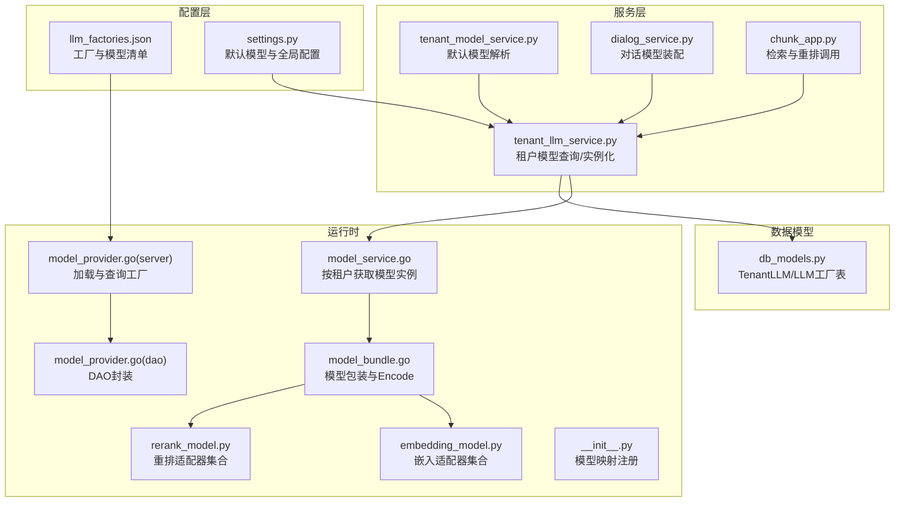
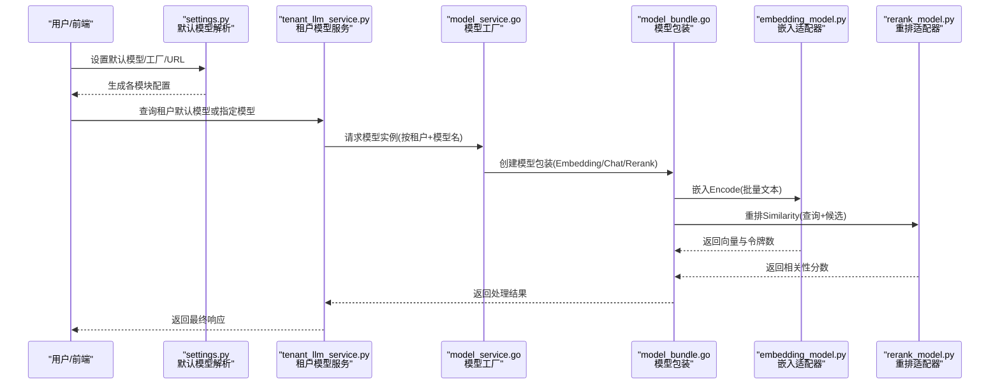
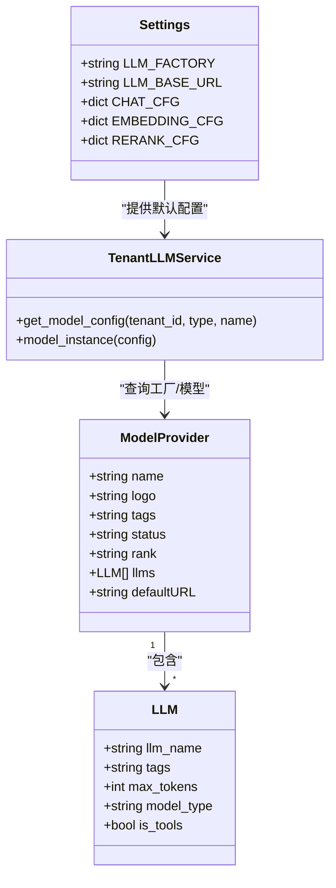
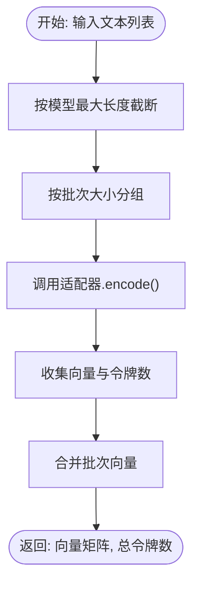
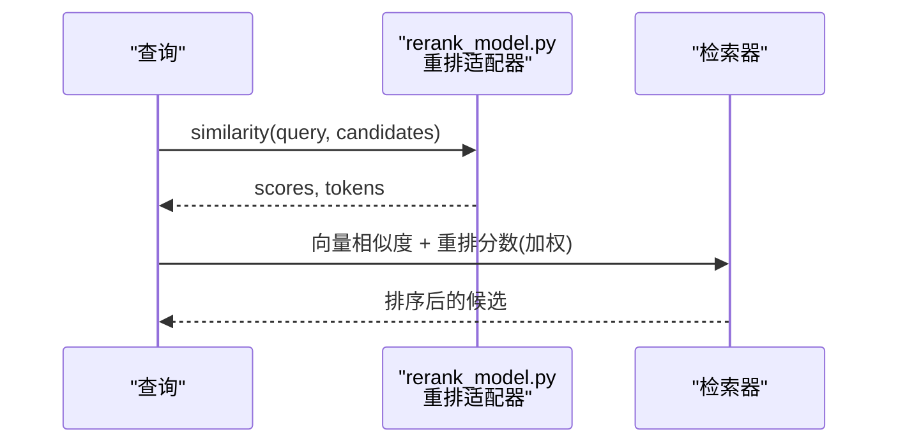
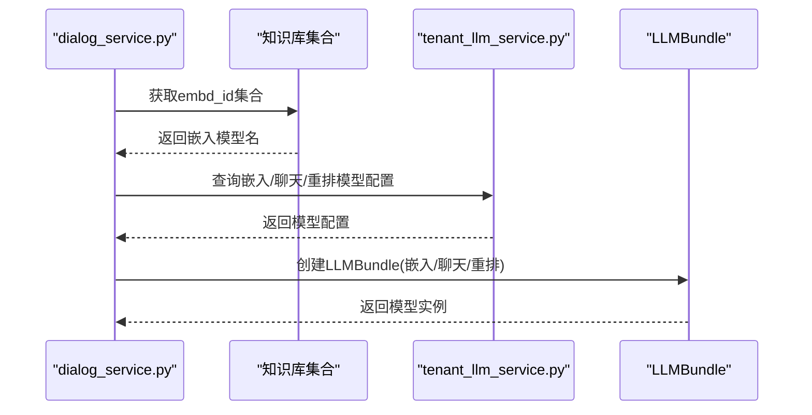
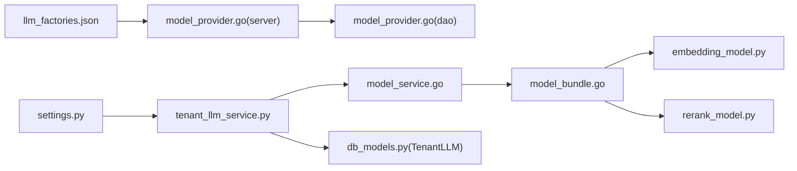

# 模型管理

<cite>
**本文引用的文件**
- [llm_factories.json](file://conf/llm_factories.json)
- [model_provider.go](file://internal/server/model_provider.go)
- [model_provider.go](file://internal/dao/model_provider.go)
- [model_service.go](file://internal/service/model_service.go)
- [model_bundle.go](file://internal/service/model_bundle.go)
- [types.go](file://internal/model/types.go)
- [tenant_llm_service.py](file://api/db/services/tenant_llm_service.py)
- [dialog_service.py](file://api/db/services/dialog_service.py)
- [chunk_app.py](file://api/apps/chunk_app.py)
- [sdk_doc.py](file://api/apps/sdk/doc.py)
- [embedding_model.py](file://rag/llm/embedding_model.py)
- [rerank_model.py](file://rag/llm/rerank_model.py)
- [__init__.py](file://rag/llm/__init__.py)
- [settings.py](file://common/settings.py)
- [db_models.py](file://api/db/db_models.py)
- [tenant_model_service.py](file://api/db/joint_services/tenant_model_service.py)
</cite>

## 目录
1. [简介](#简介)
2. [项目结构](#项目结构)
3. [核心组件](#核心组件)
4. [架构总览](#架构总览)
5. [详细组件分析](#详细组件分析)
6. [依赖分析](#依赖分析)
7. [性能考虑](#性能考虑)
8. [故障排查指南](#故障排查指南)
9. [结论](#结论)
10. [附录](#附录)

## 简介
本技术文档围绕 RAGFlow 的模型管理系统，系统化阐述其在多提供商 LLM 集成、嵌入模型管理与重排序模型应用方面的设计与实现。重点包括：
- 多提供商 LLM 集成：通过统一工厂配置与运行时解析，支持 OpenAI、阿里 Dashscope、Azure OpenAI、Ollama、NVIDIA、TogetherAI、SILICONFLOW 等多家厂商；并支持本地模型（LocalAI、LM Studio）与兼容 OpenAI 接口的第三方服务。
- 嵌入模型管理：涵盖模型注册、向量化维度配置、批量编码、令牌统计与性能监控入口；内置 Builtin（基于 TEI）与多种云厂商/开源嵌入模型适配器。
- 重排序模型应用：提供相关性评分、归一化排序策略与自定义重排序器扩展点；覆盖 Jina、Xinference、NVIDIA、OpenAI-API-Compatible、Cohere、SILICONFLOW、Qwen、HuggingFace、GPUStack、RAGcon 等。
- 配置与使用：给出模型注册、默认模型设置、租户级模型绑定、对话与检索流程中的模型选择与调用路径；并提供性能优化、成本控制与版本管理建议。

## 项目结构
RAGFlow 的模型管理由“配置层（工厂与默认模型）—服务层（租户模型与实例）—运行时（模型工厂与适配器）—接口层（检索与对话）”构成，形成清晰的分层与职责边界。

图示来源
- [llm_factories.json:1-800](file://conf/llm_factories.json#L1-L800)
- [settings.py:174-240](file://common/settings.py#L174-L240)
- [tenant_llm_service.py:92-137](file://api/db/services/tenant_llm_service.py#L92-L137)
- [tenant_model_service.py:80-105](file://api/db/joint_services/tenant_model_service.py#L80-L105)
- [dialog_service.py:252-276](file://api/db/services/dialog_service.py#L252-L276)
- [chunk_app.py:468-495](file://api/apps/chunk_app.py#L468-L495)
- [model_provider.go:53-117](file://internal/server/model_provider.go#L53-L117)
- [model_provider.go:40-92](file://internal/dao/model_provider.go#L40-L92)
- [model_service.go:31-117](file://internal/service/model_service.go#L31-L117)
- [model_bundle.go:43-81](file://internal/service/model_bundle.go#L43-L81)
- [embedding_model.py:52-88](file://rag/llm/embedding_model.py#L52-L88)
- [rerank_model.py:28-54](file://rag/llm/rerank_model.py#L28-L54)
- [__init__.py:141-181](file://rag/llm/__init__.py#L141-L181)
- [db_models.py:817-836](file://api/db/db_models.py#L817-L836)

章节来源
- [llm_factories.json:1-800](file://conf/llm_factories.json#L1-L800)
- [settings.py:174-240](file://common/settings.py#L174-L240)
- [model_provider.go:53-117](file://internal/server/model_provider.go#L53-L117)
- [model_provider.go:40-92](file://internal/dao/model_provider.go#L40-L92)
- [model_service.go:31-117](file://internal/service/model_service.go#L31-L117)
- [model_bundle.go:43-81](file://internal/service/model_bundle.go#L43-L81)
- [embedding_model.py:52-88](file://rag/llm/embedding_model.py#L52-L88)
- [rerank_model.py:28-54](file://rag/llm/rerank_model.py#L28-L54)
- [__init__.py:141-181](file://rag/llm/__init__.py#L141-L181)
- [tenant_llm_service.py:92-137](file://api/db/services/tenant_llm_service.py#L92-L137)
- [tenant_model_service.py:80-105](file://api/db/joint_services/tenant_model_service.py#L80-L105)
- [dialog_service.py:252-276](file://api/db/services/dialog_service.py#L252-L276)
- [chunk_app.py:468-495](file://api/apps/chunk_app.py#L468-L495)
- [db_models.py:817-836](file://api/db/db_models.py#L817-L836)

## 核心组件
- 工厂与模型清单：通过 llm_factories.json 统一声明各厂商模型名称、类型、标签与默认 URL，供前端与后端加载。
- 默认模型与全局配置：settings.py 解析用户默认模型、工厂与 API Base URL，并生成各模块（聊天、嵌入、重排等）的配置。
- 租户模型服务：tenant_llm_service.py 提供租户级模型查询、实例化、令牌用量统计与环境注入（如 OCR 模型）。
- 运行时模型工厂：model_service.go 与 model_bundle.go 负责根据租户与模型名解析具体实现，封装 Encode/Similarity 等接口。
- 嵌入与重排适配器：embedding_model.py 与 rerank_model.py 提供多厂商适配器，统一对外接口。
- 数据模型：db_models.py 定义 TenantLLM 与 LLM 工厂表，支撑租户模型注册与默认模型绑定。

章节来源
- [llm_factories.json:1-800](file://conf/llm_factories.json#L1-L800)
- [settings.py:174-240](file://common/settings.py#L174-L240)
- [tenant_llm_service.py:92-137](file://api/db/services/tenant_llm_service.py#L92-L137)
- [model_service.go:31-117](file://internal/service/model_service.go#L31-L117)
- [model_bundle.go:43-81](file://internal/service/model_bundle.go#L43-L81)
- [embedding_model.py:52-88](file://rag/llm/embedding_model.py#L52-L88)
- [rerank_model.py:28-54](file://rag/llm/rerank_model.py#L28-L54)
- [db_models.py:817-836](file://api/db/db_models.py#L817-L836)

## 架构总览
下图展示了从“用户配置/默认模型”到“运行时模型实例”的完整链路，以及在检索与对话中对嵌入与重排模型的调用。

图示来源
- [settings.py:174-240](file://common/settings.py#L174-L240)
- [tenant_llm_service.py:92-137](file://api/db/services/tenant_llm_service.py#L92-L137)
- [model_service.go:31-117](file://internal/service/model_service.go#L31-L117)
- [model_bundle.go:43-81](file://internal/service/model_bundle.go#L43-L81)
- [embedding_model.py:90-122](file://rag/llm/embedding_model.py#L90-L122)
- [rerank_model.py:195-229](file://rag/llm/rerank_model.py#L195-L229)

## 详细组件分析

### 组件A：多提供商 LLM 集成
- 工厂配置：llm_factories.json 定义各厂商（如 OpenAI、Tongyi-Qianwen、xAI、TokenPony、ZHIPU-AI 等）及其模型清单、标签与默认 URL。
- 运行时加载：internal/server/model_provider.go 加载 JSON 并建立名称到索引映射，便于快速查找；DAO 层提供按厂商/模型类型过滤与查询。
- 默认模型解析：settings.py 将用户默认模型转换为“模型名@工厂”，并结合环境变量与备份值生成最终配置。
- 实例化与路由：tenant_llm_service.py.model_instance 根据模型类型与工厂名选择对应适配器（Chat/CV/Embed/Rerank/TTS/OCR），并注入 API Key、Base URL 与模型参数。

图示来源
- [model_provider.go:26-44](file://internal/server/model_provider.go#L26-L44)
- [llm_factories.json:1-800](file://conf/llm_factories.json#L1-L800)
- [settings.py:174-240](file://common/settings.py#L174-L240)
- [tenant_llm_service.py:92-137](file://api/db/services/tenant_llm_service.py#L92-L137)

章节来源
- [model_provider.go:53-117](file://internal/server/model_provider.go#L53-L117)
- [model_provider.go:40-92](file://internal/dao/model_provider.go#L40-L92)
- [llm_factories.json:1-800](file://conf/llm_factories.json#L1-L800)
- [settings.py:174-240](file://common/settings.py#L174-L240)
- [tenant_llm_service.py:92-137](file://api/db/services/tenant_llm_service.py#L92-L137)

### 组件B：嵌入模型管理
- 模型注册与默认模型：TenantLLM 表记录租户的嵌入模型（embd_id），settings.py 在启动时解析默认嵌入模型与 TEI Profile，确保本地嵌入可用。
- 批量编码与令牌统计：embedding_model.py 中各适配器实现 encode/encode_queries，统一返回向量数组与令牌计数；Builtin 模式支持 TEI 自动截断与批处理。
- 运行时封装：model_bundle.go 的 Encode 方法限定仅嵌入模型可执行，返回向量与令牌数，供检索与训练阶段使用。

图示来源
- [embedding_model.py:90-122](file://rag/llm/embedding_model.py#L90-L122)
- [embedding_model.py:52-88](file://rag/llm/embedding_model.py#L52-L88)
- [model_bundle.go:76-81](file://internal/service/model_bundle.go#L76-L81)
- [settings.py:234-239](file://common/settings.py#L234-L239)

章节来源
- [settings.py:218-240](file://common/settings.py#L218-L240)
- [embedding_model.py:90-122](file://rag/llm/embedding_model.py#L90-L122)
- [embedding_model.py:52-88](file://rag/llm/embedding_model.py#L52-L88)
- [model_bundle.go:76-81](file://internal/service/model_bundle.go#L76-L81)
- [db_models.py:817-836](file://api/db/db_models.py#L817-L836)

### 组件C：重排序模型应用
- 相关性评分：rerank_model.py 中各适配器实现 similarity(query, texts)，返回每个候选的相关性分数与令牌数；部分适配器（如 OpenAI-API-Compatible、LocalAI）会对分数进行归一化。
- 结果排序策略：在检索阶段，检索器会结合向量相似度与重排分数进行加权排序；权重可通过请求参数传入（如 vector_similarity_weight）。
- 自定义重排序器：通过继承 Base 并实现 similarity，即可接入新的重排服务；__init__.py 中的映射注册机制自动识别新适配器。

图示来源
- [rerank_model.py:195-229](file://rag/llm/rerank_model.py#L195-L229)
- [rerank_model.py:28-54](file://rag/llm/rerank_model.py#L28-L54)
- [chunk_app.py:482-495](file://api/apps/chunk_app.py#L482-L495)

章节来源
- [rerank_model.py:195-229](file://rag/llm/rerank_model.py#L195-L229)
- [rerank_model.py:28-54](file://rag/llm/rerank_model.py#L28-L54)
- [chunk_app.py:482-495](file://api/apps/chunk_app.py#L482-L495)

### 组件D：对话与检索中的模型装配
- 对话装配：dialog_service.py 从知识库集合中提取嵌入模型，校验一致性并装配聊天与重排模型；若未显式指定则回退到租户默认模型。
- 检索装配：chunk_app.py 与 sdk_doc.py 支持优先使用租户级重排模型，否则回退到知识库级别重排模型；同时支持关键词增强与多知识库标签分类。

图示来源
- [dialog_service.py:252-276](file://api/db/services/dialog_service.py#L252-L276)
- [tenant_llm_service.py:92-137](file://api/db/services/tenant_llm_service.py#L92-L137)

章节来源
- [dialog_service.py:252-276](file://api/db/services/dialog_service.py#L252-L276)
- [chunk_app.py:468-495](file://api/apps/chunk_app.py#L468-L495)
- [sdk_doc.py:1747-1761](file://api/apps/sdk/doc.py#L1747-L1761)
- [tenant_llm_service.py:92-137](file://api/db/services/tenant_llm_service.py#L92-L137)

## 依赖分析
- 配置依赖：llm_factories.json 与 settings.py 共同决定默认模型与工厂；tenant_llm_service.py 依据租户上下文解析具体模型。
- 运行时依赖：model_service.go 与 model_bundle.go 串联工厂与适配器；embedding_model.py 与 rerank_model.py 提供多厂商适配。
- 数据依赖：TenantLLM 表存储租户模型信息，tenant_model_service.py 与 dialog_service.py 读取并装配。

图示来源
- [llm_factories.json:1-800](file://conf/llm_factories.json#L1-L800)
- [model_provider.go:53-117](file://internal/server/model_provider.go#L53-L117)
- [model_provider.go:40-92](file://internal/dao/model_provider.go#L40-L92)
- [settings.py:174-240](file://common/settings.py#L174-L240)
- [tenant_llm_service.py:92-137](file://api/db/services/tenant_llm_service.py#L92-L137)
- [model_service.go:31-117](file://internal/service/model_service.go#L31-L117)
- [model_bundle.go:43-81](file://internal/service/model_bundle.go#L43-L81)
- [embedding_model.py:52-88](file://rag/llm/embedding_model.py#L52-L88)
- [rerank_model.py:28-54](file://rag/llm/rerank_model.py#L28-L54)
- [db_models.py:817-836](file://api/db/db_models.py#L817-L836)

章节来源
- [llm_factories.json:1-800](file://conf/llm_factories.json#L1-L800)
- [model_provider.go:53-117](file://internal/server/model_provider.go#L53-L117)
- [model_provider.go:40-92](file://internal/dao/model_provider.go#L40-L92)
- [settings.py:174-240](file://common/settings.py#L174-L240)
- [tenant_llm_service.py:92-137](file://api/db/services/tenant_llm_service.py#L92-L137)
- [model_service.go:31-117](file://internal/service/model_service.go#L31-L117)
- [model_bundle.go:43-81](file://internal/service/model_bundle.go#L43-L81)
- [embedding_model.py:52-88](file://rag/llm/embedding_model.py#L52-L88)
- [rerank_model.py:28-54](file://rag/llm/rerank_model.py#L28-L54)
- [db_models.py:817-836](file://api/db/db_models.py#L817-L836)

## 性能考虑
- 嵌入编码批处理：embedding_model.py 对不同适配器设定合理批次大小，减少网络往返；Builtin 模式支持 TEI 自动截断，避免超长输入。
- 令牌统计与成本估算：各适配器返回令牌数，tenant_llm_service.py 提供令牌用量累加接口，可用于成本控制与配额管理。
- 重排分数归一化：部分重排适配器对分数进行归一化，有助于稳定排序效果。
- 默认模型与 TEI Profile：settings.py 支持 COMPOSE_PROFILES 中的 tei- 前缀，自动切换内置嵌入模型，降低外部依赖带来的延迟。

章节来源
- [embedding_model.py:90-122](file://rag/llm/embedding_model.py#L90-L122)
- [embedding_model.py:52-88](file://rag/llm/embedding_model.py#L52-L88)
- [tenant_llm_service.py:190-225](file://api/db/services/tenant_llm_service.py#L190-L225)
- [settings.py:234-239](file://common/settings.py#L234-L239)

## 故障排查指南
- 模型未授权/找不到：tenant_llm_service.py.get_model_config 会在未找到租户模型时抛出异常，检查租户是否正确配置模型名与工厂后缀（如 model@factory）。
- 嵌入模型不一致：dialog_service.py 在对话装配时会校验多个知识库是否使用相同嵌入模型，若不一致需调整知识库配置。
- 重排服务异常：rerank_model.py 的适配器在请求失败时会记录异常并返回错误信息，检查 API Key、Base URL 与模型名。
- 令牌用量异常：tenant_llm_service.increase_usage 用于累加令牌用量，若更新失败请检查数据库连接与字段权限。

章节来源
- [tenant_llm_service.py:92-137](file://api/db/services/tenant_llm_service.py#L92-L137)
- [dialog_service.py:252-276](file://api/db/services/dialog_service.py#L252-L276)
- [rerank_model.py:195-229](file://rag/llm/rerank_model.py#L195-L229)
- [tenant_llm_service.py:190-225](file://api/db/services/tenant_llm_service.py#L190-L225)

## 结论
RAGFlow 的模型管理系统以“工厂配置 + 租户模型服务 + 运行时适配器”为核心，实现了对多提供商 LLM 的统一接入与灵活调度。通过嵌入模型的批处理与令牌统计、重排模型的多适配器与归一化策略，以及在检索与对话中的无缝装配，系统在易用性、性能与可扩展性方面均具备良好表现。建议在生产环境中结合成本控制策略与版本管理方法，持续优化模型选择与资源配置。

## 附录

### A. 添加与配置模型（步骤指引）
- 注册租户模型
  - 在租户上下文中保存 TenantLLM 记录，包含 llm_factory、llm_name、model_type、api_key、api_base、max_tokens 等字段。
  - 若使用本地模型（LocalAI/HuggingFace/OpenAI-API-Compatible/VLLM），可在 llm_name 中附加工厂标识（如 model@LocalAI）。
- 设置默认模型
  - 在 settings.py 中配置 user_default_llm.default_models，指定 chat_model、embedding_model、rerank_model 等默认项；支持“模型名@工厂”格式。
- 在检索/对话中使用
  - 检索：在请求中指定 rerank_id 或 tenant_rerank_id，系统将优先使用租户级重排模型。
  - 对话：系统根据知识库嵌入模型与租户默认模型装配聊天与重排模型。

章节来源
- [db_models.py:817-836](file://api/db/db_models.py#L817-L836)
- [settings.py:174-240](file://common/settings.py#L174-L240)
- [chunk_app.py:468-495](file://api/apps/chunk_app.py#L468-L495)
- [dialog_service.py:252-276](file://api/db/services/dialog_service.py#L252-L276)

### B. 嵌入模型管理要点
- 模型注册：TenantLLM 记录模型名与工厂，llm_factories.json 提供模型清单与默认 URL。
- 向量维度：不同嵌入模型输出维度不同，需在检索与向量库匹配；Builtin 模式支持 TEI 自动截断。
- 性能监控：通过令牌统计与 increase_usage 累加，评估使用成本与配额。

章节来源
- [llm_factories.json:1-800](file://conf/llm_factories.json#L1-L800)
- [embedding_model.py:52-88](file://rag/llm/embedding_model.py#L52-L88)
- [tenant_llm_service.py:190-225](file://api/db/services/tenant_llm_service.py#L190-L225)

### C. 重排序模型应用要点
- 相关性评分：各适配器返回 relevance_score/logit，部分适配器会进行归一化。
- 排序策略：检索阶段可结合向量相似度与重排分数，通过权重参数调节。
- 自定义重排序器：继承 Base 并实现 similarity，注册到 __init__.py 的映射字典中即可生效。

章节来源
- [rerank_model.py:195-229](file://rag/llm/rerank_model.py#L195-L229)
- [rerank_model.py:28-54](file://rag/llm/rerank_model.py#L28-L54)
- [chunk_app.py:482-495](file://api/apps/chunk_app.py#L482-L495)
- [__init__.py:141-181](file://rag/llm/__init__.py#L141-L181)

### D. 版本管理与成本控制建议
- 版本管理：通过 llm_factories.json 的模型清单与租户 TenantLLM 的模型名，实现模型版本与工厂的解耦；建议为重要模型维护固定命名规范。
- 成本控制：利用令牌统计与 increase_usage 接口，定期审计租户模型使用情况；对高成本模型（如 OpenAI Whisper、Qwen ASR）设置阈值告警。
- 性能优化：优先使用本地嵌入（TEI）与批处理编码；在重排阶段采用合适的批次大小与归一化策略，平衡准确率与延迟。

章节来源
- [llm_factories.json:1-800](file://conf/llm_factories.json#L1-L800)
- [tenant_llm_service.py:190-225](file://api/db/services/tenant_llm_service.py#L190-L225)
- [settings.py:234-239](file://common/settings.py#L234-L239)