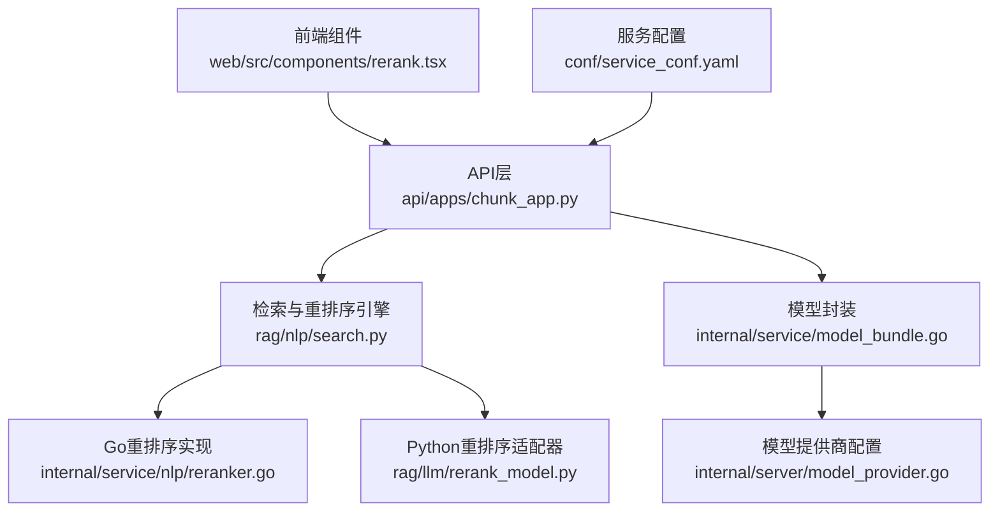
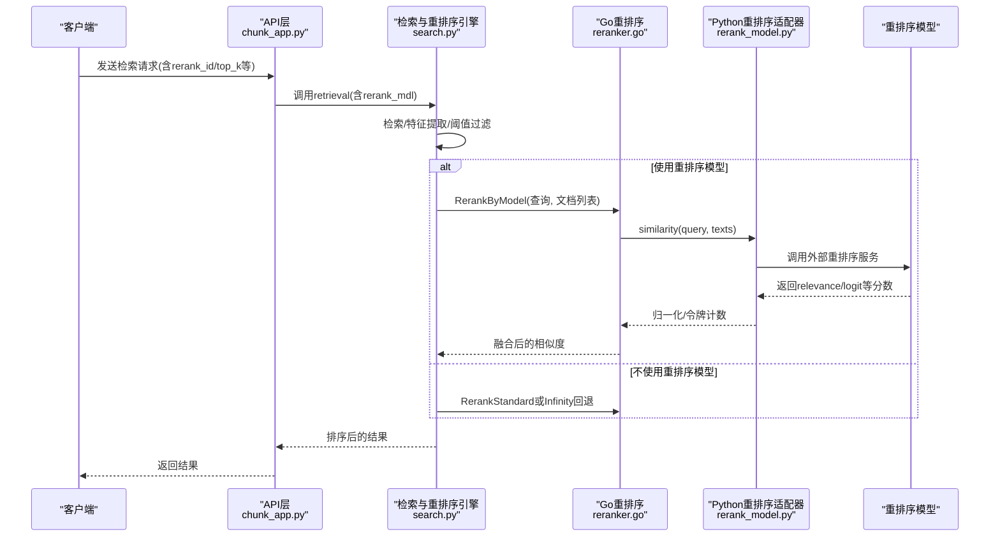
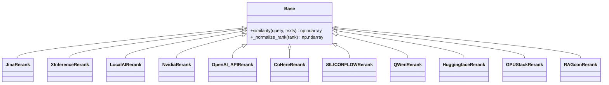
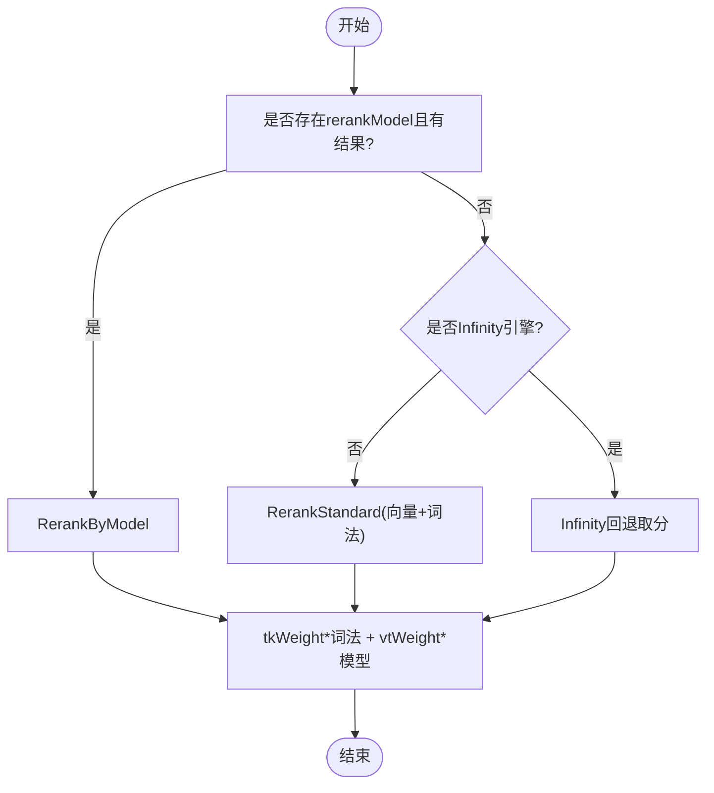
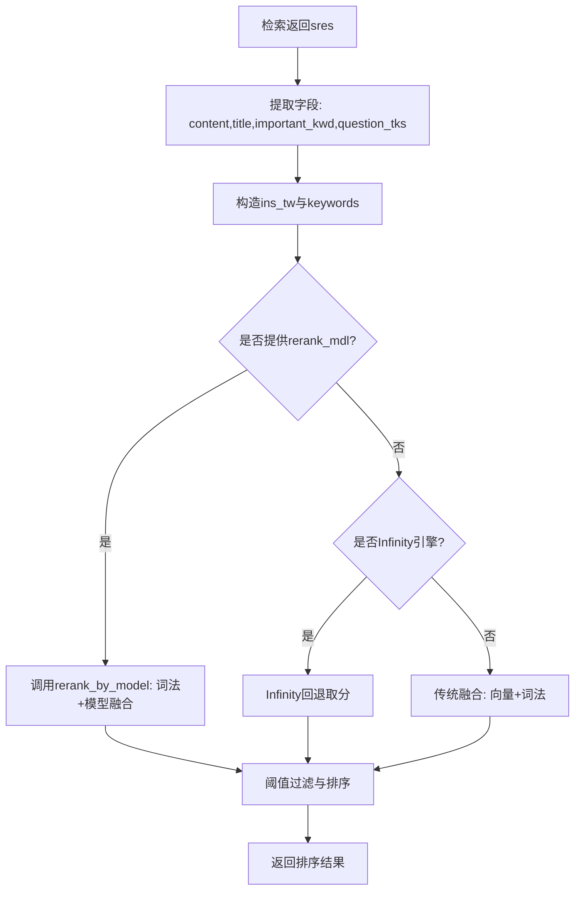
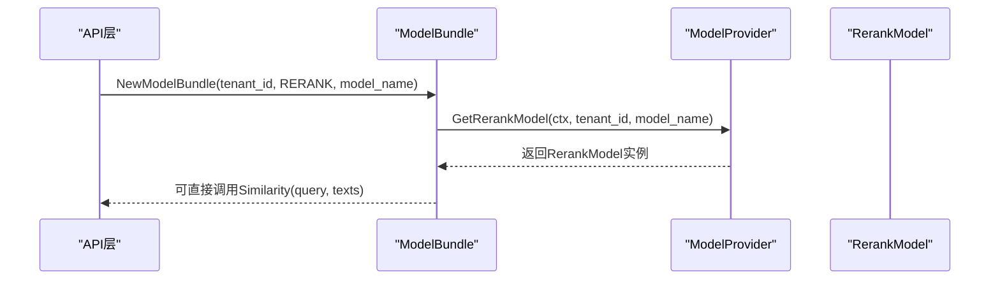
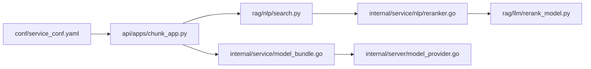

# 重排序模型应用

<cite>
**本文引用的文件**
- [rag/llm/rerank_model.py](file://rag/llm/rerank_model.py)
- [internal/service/nlp/reranker.go](file://internal/service/nlp/reranker.go)
- [rag/nlp/search.py](file://rag/nlp/search.py)
- [api/apps/chunk_app.py](file://api/apps/chunk_app.py)
- [api/apps/sdk/doc.py](file://api/apps/sdk/doc.py)
- [api/apps/sdk/session.py](file://api/apps/sdk/session.py)
- [web/src/components/rerank.tsx](file://web/src/components/rerank.tsx)
- [internal/service/model_bundle.go](file://internal/service/model_bundle.go)
- [internal/server/model_provider.go](file://internal/server/model_provider.go)
- [conf/service_conf.yaml](file://conf/service_conf.yaml)
- [docs/guides/dataset/set_page_rank.md](file://docs/guides/dataset/set_page_rank.md)
- [docs/guides/agent/best_practices/accelerate_agent_question_answering.md](file://docs/guides/agent/best_practices/accelerate_agent_question_answering.md)
</cite>

## 目录
1. [简介](#简介)
2. [项目结构](#项目结构)
3. [核心组件](#核心组件)
4. [架构总览](#架构总览)
5. [详细组件分析](#详细组件分析)
6. [依赖分析](#依赖分析)
7. [性能考量](#性能考量)
8. [故障排查指南](#故障排查指南)
9. [结论](#结论)
10. [附录](#附录)

## 简介
本文件面向RAGFlow中“重排序模型”的实现与应用，系统化阐述重排序的概念、作用与机制，覆盖初始检索结果的优化、相关性评分、排序策略、模型集成方式（加载、输入格式、输出解析）、应用场景（多模型融合、上下文感知排序、个性化推荐）、配置与调优（参数、阈值、性能）、效果评估与监控、以及自定义重排序器的开发流程。目标是帮助开发者理解并高效使用重排序能力，提升RAG系统的检索质量与用户体验。

## 项目结构
围绕重排序的关键代码分布在以下层次：
- 前端：提供重排序模型选择与参数配置的UI组件
- 后端API：接收请求、解析参数、构建检索与重排序调用链
- 检索与重排序引擎：Python侧检索与融合逻辑，Go侧重排序与向量/词法相似度计算
- 模型抽象与工厂：统一的模型封装与提供商配置

图表来源
- [web/src/components/rerank.tsx:24-78](file://web/src/components/rerank.tsx#L24-L78)
- [api/apps/chunk_app.py:468-495](file://api/apps/chunk_app.py#L468-L495)
- [rag/nlp/search.py:364-440](file://rag/nlp/search.py#L364-L440)
- [internal/service/nlp/reranker.go:56-87](file://internal/service/nlp/reranker.go#L56-L87)
- [rag/llm/rerank_model.py:28-552](file://rag/llm/rerank_model.py#L28-L552)
- [internal/service/model_bundle.go:35-74](file://internal/service/model_bundle.go#L35-L74)
- [internal/server/model_provider.go:53-102](file://internal/server/model_provider.go#L53-L102)
- [conf/service_conf.yaml:1-160](file://conf/service_conf.yaml#L1-L160)

章节来源
- [web/src/components/rerank.tsx:24-78](file://web/src/components/rerank.tsx#L24-L78)
- [api/apps/chunk_app.py:468-495](file://api/apps/chunk_app.py#L468-L495)
- [rag/nlp/search.py:364-440](file://rag/nlp/search.py#L364-L440)
- [internal/service/nlp/reranker.go:56-87](file://internal/service/nlp/reranker.go#L56-L87)
- [rag/llm/rerank_model.py:28-552](file://rag/llm/rerank_model.py#L28-L552)
- [internal/service/model_bundle.go:35-74](file://internal/service/model_bundle.go#L35-L74)
- [internal/server/model_provider.go:53-102](file://internal/server/model_provider.go#L53-L102)
- [conf/service_conf.yaml:1-160](file://conf/service_conf.yaml#L1-L160)

## 核心组件
- 重排序模型适配器（Python）：提供多种外部重排序服务的统一接口，负责请求构造、响应解析、归一化与令牌统计。
- Go重排序引擎：在后端执行重排序，支持模型与传统混合相似度融合，兼容不同文档引擎（Infinity/Elasticsearch）。
- 检索与融合（Python）：负责检索、特征加权、阈值过滤、排序与聚合。
- 模型封装与提供商：统一获取与调用重排序模型实例，支持按租户与模型类型选择。
- 前端重排序配置：提供重排序模型选择与top_k等参数的交互界面。

章节来源
- [rag/llm/rerank_model.py:28-552](file://rag/llm/rerank_model.py#L28-L552)
- [internal/service/nlp/reranker.go:25-87](file://internal/service/nlp/reranker.go#L25-L87)
- [rag/nlp/search.py:364-440](file://rag/nlp/search.py#L364-L440)
- [internal/service/model_bundle.go:35-74](file://internal/service/model_bundle.go#L35-L74)
- [web/src/components/rerank.tsx:24-78](file://web/src/components/rerank.tsx#L24-L78)

## 架构总览
下图展示了从API到重排序模型的完整调用链路，包括检索、融合与重排序阶段：

图表来源
- [api/apps/chunk_app.py:468-495](file://api/apps/chunk_app.py#L468-L495)
- [rag/nlp/search.py:364-440](file://rag/nlp/search.py#L364-L440)
- [internal/service/nlp/reranker.go:89-152](file://internal/service/nlp/reranker.go#L89-L152)
- [rag/llm/rerank_model.py:36-106](file://rag/llm/rerank_model.py#L36-L106)

## 详细组件分析

### 重排序模型适配器（Python）
- 抽象基类：定义统一的相似度接口与归一化工具。
- 多厂商适配：内置对多家服务的适配器（如Jina、Xinference、LocalAI、NVIDIA、OpenAI兼容、Cohere、SiliconFlow、Qwen、HuggingFace、GPUStack、RAGcon等），统一返回相关性分数与令牌用量。
- 输入输出约定：输入为查询与文档文本列表，输出为分数数组与令牌计数；部分适配器会进行分数归一化以保证可比性。

图表来源
- [rag/llm/rerank_model.py:28-552](file://rag/llm/rerank_model.py#L28-L552)

章节来源
- [rag/llm/rerank_model.py:28-552](file://rag/llm/rerank_model.py#L28-L552)

### Go重排序引擎
- 接口与数据结构：定义RerankModel接口与SearchResult结构体，确保与Python侧检索结果的字段一致。
- 重排序策略：
  - Rerank：根据是否提供rerankModel与引擎类型，选择模型重排序或标准重排序/Infinity回退。
  - RerankByModel：抽取关键词与文档文本，调用模型相似度接口，结合词法相似度进行加权融合。
  - RerankStandard：在Elasticsearch场景下，基于向量与词法相似度进行融合。
  - Infinity回退：从不同可能的分数字段中提取分数，若缺失则默认为1.0。
- 辅助函数：向量/词法相似度计算、权重组合、Argsort降序等。

图表来源
- [internal/service/nlp/reranker.go:56-87](file://internal/service/nlp/reranker.go#L56-L87)
- [internal/service/nlp/reranker.go:89-152](file://internal/service/nlp/reranker.go#L89-L152)
- [internal/service/nlp/reranker.go:154-214](file://internal/service/nlp/reranker.go#L154-L214)
- [internal/service/nlp/reranker.go:216-237](file://internal/service/nlp/reranker.go#L216-L237)

章节来源
- [internal/service/nlp/reranker.go:25-485](file://internal/service/nlp/reranker.go#L25-L485)

### 检索与融合（Python）
- 检索阶段：支持向量+词法融合表达式、高亮、聚合、过滤条件等。
- 特征与加权：从字段中提取内容、标题、重要关键词、问题词等，按权重组合生成词法相似度。
- 重排序阶段：当提供rerank_mdl时，使用模型相似度替换向量相似度，再与词法相似度按权重融合；否则走传统融合或Infinity回退。
- 阈值与排序：根据相似度阈值与权重，对结果进行过滤与排序。

图表来源
- [rag/nlp/search.py:313-338](file://rag/nlp/search.py#L313-L338)
- [rag/nlp/search.py:335-356](file://rag/nlp/search.py#L335-L356)
- [rag/nlp/search.py:406-440](file://rag/nlp/search.py#L406-L440)

章节来源
- [rag/nlp/search.py:313-440](file://rag/nlp/search.py#L313-L440)

### 模型封装与提供商
- ModelBundle：按租户与模型类型获取具体模型实例，提供统一的Encode/EncodeQuery/Chat/Similarity等接口。
- GetRerankModel：在Go侧通过ModelProvider获取重排序模型实例，供RerankByModel调用。
- 配置文件：service_conf.yaml中可配置默认模型与工厂信息，便于统一管理。

图表来源
- [internal/service/model_bundle.go:35-74](file://internal/service/model_bundle.go#L35-L74)
- [internal/service/model_bundle.go:148-168](file://internal/service/model_bundle.go#L148-L168)
- [internal/server/model_provider.go:53-102](file://internal/server/model_provider.go#L53-L102)

章节来源
- [internal/service/model_bundle.go:35-174](file://internal/service/model_bundle.go#L35-L174)
- [internal/server/model_provider.go:53-102](file://internal/server/model_provider.go#L53-L102)
- [conf/service_conf.yaml:94-110](file://conf/service_conf.yaml#L94-L110)

### 前端重排序配置
- 提供rerank_id选择与top_k滑块配置，仅在选中重排序模型时显示top_k。
- 与后端API参数保持一致，确保请求携带正确的rerank_id与top_k。

章节来源
- [web/src/components/rerank.tsx:24-78](file://web/src/components/rerank.tsx#L24-L78)

## 依赖分析
- 组件耦合：
  - API层依赖检索引擎与模型封装；检索引擎依赖Go重排序与Python适配器；模型封装依赖提供商。
- 外部依赖：
  - 多家外部重排序服务（Jina、Xinference、LocalAI、NVIDIA、OpenAI兼容、Cohere、SiliconFlow、Qwen、HuggingFace、GPUStack、RAGcon等）。
- 引擎差异：
  - Infinity与Elasticsearch在分数归一化与字段命名上存在差异，Go侧通过回退策略适配。

图表来源
- [api/apps/chunk_app.py:468-495](file://api/apps/chunk_app.py#L468-L495)
- [rag/nlp/search.py:364-440](file://rag/nlp/search.py#L364-L440)
- [internal/service/nlp/reranker.go:56-87](file://internal/service/nlp/reranker.go#L56-L87)
- [rag/llm/rerank_model.py:28-552](file://rag/llm/rerank_model.py#L28-L552)
- [internal/service/model_bundle.go:35-74](file://internal/service/model_bundle.go#L35-L74)
- [internal/server/model_provider.go:53-102](file://internal/server/model_provider.go#L53-L102)
- [conf/service_conf.yaml:1-160](file://conf/service_conf.yaml#L1-L160)

章节来源
- [api/apps/chunk_app.py:468-495](file://api/apps/chunk_app.py#L468-L495)
- [rag/nlp/search.py:364-440](file://rag/nlp/search.py#L364-L440)
- [internal/service/nlp/reranker.go:56-87](file://internal/service/nlp/reranker.go#L56-L87)
- [rag/llm/rerank_model.py:28-552](file://rag/llm/rerank_model.py#L28-L552)
- [internal/service/model_bundle.go:35-74](file://internal/service/model_bundle.go#L35-L74)
- [internal/server/model_provider.go:53-102](file://internal/server/model_provider.go#L53-L102)
- [conf/service_conf.yaml:1-160](file://conf/service_conf.yaml#L1-L160)

## 性能考量
- 重排序成本：启用重排序模型会引入额外的网络请求与计算开销，建议在具备GPU加速的环境下使用。
- 参数调优：
  - vector_similarity_weight：控制向量相似度与词法/模型相似度的融合权重。
  - similarity_threshold：用于过滤低分片段，避免将无关片段送入下游LLM。
  - top_k：控制重排序前候选规模，影响召回与速度的平衡。
- 引擎差异：Infinity对分数归一化更友好，可减少融合偏差；Elasticsearch需依赖标准重排序逻辑。

章节来源
- [docs/guides/agent/best_practices/accelerate_agent_question_answering.md:32-39](file://docs/guides/agent/best_practices/accelerate_agent_question_answering.md#L32-L39)
- [rag/nlp/search.py:364-440](file://rag/nlp/search.py#L364-L440)
- [internal/service/nlp/reranker.go:216-237](file://internal/service/nlp/reranker.go#L216-L237)

## 故障排查指南
- 重排序模型不可用：
  - 检查rerank_id是否正确配置，确认对应模型已在提供商中注册。
  - 若模型返回异常，Go侧会回退至词法相似度，确保流程可用但相关性可能下降。
- 分数异常或全零：
  - 确认字段提取逻辑（content、title、important_kwd、question_tks）是否正确。
  - 对于Infinity，检查分数字段名称是否匹配（SCORE/score/SIMILARITY等）。
- 性能问题：
  - 适当降低top_k或提高similarity_threshold，减少重排序负担。
  - 在无GPU情况下禁用重排序模型以提升速度。

章节来源
- [internal/service/nlp/reranker.go:137-151](file://internal/service/nlp/reranker.go#L137-L151)
- [internal/service/nlp/reranker.go:220-237](file://internal/service/nlp/reranker.go#L220-L237)
- [docs/guides/agent/best_practices/accelerate_agent_question_answering.md:32-39](file://docs/guides/agent/best_practices/accelerate_agent_question_answering.md#L32-L39)

## 结论
RAGFlow的重排序体系通过“Python检索+Go重排序+多厂商模型适配”的分层设计，在保证灵活性的同时兼顾性能与可扩展性。合理配置rerank_id、权重与阈值，可在不同引擎与场景下取得更优的相关性与用户体验。对于大规模部署，建议结合硬件资源与业务需求，动态调整重排序策略与参数。

## 附录

### 应用场景与高级功能
- 多模型融合：在同一流程中可切换不同厂商的重排序模型，对比效果并按需启用。
- 上下文感知排序：利用问题词、重要关键词等特征，增强对上下文的敏感度。
- 个性化推荐：结合用户画像、历史偏好等特征，动态调整rank_feature权重。

章节来源
- [rag/nlp/search.py:313-338](file://rag/nlp/search.py#L313-L338)
- [docs/guides/dataset/set_page_rank.md:37-41](file://docs/guides/dataset/set_page_rank.md#L37-L41)

### 配置指南
- 前端：在知识库详情页选择重排序模型，并按需设置top_k。
- 后端：在检索请求中传入rerank_id与vector_similarity_weight、similarity_threshold等参数。
- 默认模型：可通过服务配置文件设置默认重排序模型与工厂信息。

章节来源
- [web/src/components/rerank.tsx:24-78](file://web/src/components/rerank.tsx#L24-L78)
- [api/apps/chunk_app.py:468-495](file://api/apps/chunk_app.py#L468-L495)
- [api/apps/sdk/doc.py:1747-1761](file://api/apps/sdk/doc.py#L1747-L1761)
- [api/apps/sdk/session.py:1197-1220](file://api/apps/sdk/session.py#L1197-L1220)
- [conf/service_conf.yaml:94-110](file://conf/service_conf.yaml#L94-L110)

### 评估与监控
- 评估指标：可采用准确率、NDCG、MRR等离线指标，结合人工评估与A/B实验。
- 监控要点：记录重排序耗时、令牌用量、分数分布、阈值命中率等。
- 优化策略：根据监控反馈调整权重、阈值与top_k，或更换更合适的重排序模型。

章节来源
- [rag/llm/rerank_model.py:36-106](file://rag/llm/rerank_model.py#L36-L106)
- [internal/service/nlp/reranker.go:137-151](file://internal/service/nlp/reranker.go#L137-L151)

### 自定义重排序器开发指南
- 接口定义：遵循Base抽象类的similarity(query, texts)签名，返回分数数组与令牌计数。
- 实现规范：
  - 请求构造：标准化请求体，限制单次请求的文本长度与数量。
  - 响应解析：稳定解析relevance_score/logit等关键字段，异常时记录日志并降级。
  - 归一化：必要时对分数进行归一化，确保与词法/向量分数在同一尺度。
- 测试验证：准备典型问答与文档样本，覆盖长文本、多语言、极端情况，验证稳定性与一致性。

章节来源
- [rag/llm/rerank_model.py:28-552](file://rag/llm/rerank_model.py#L28-L552)