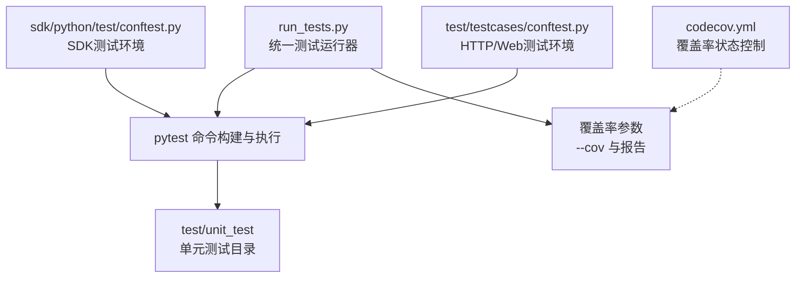
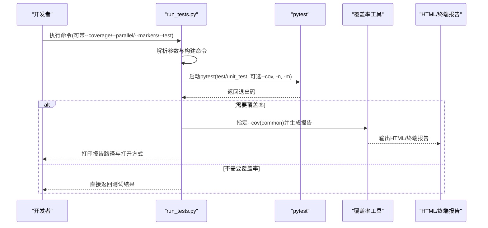
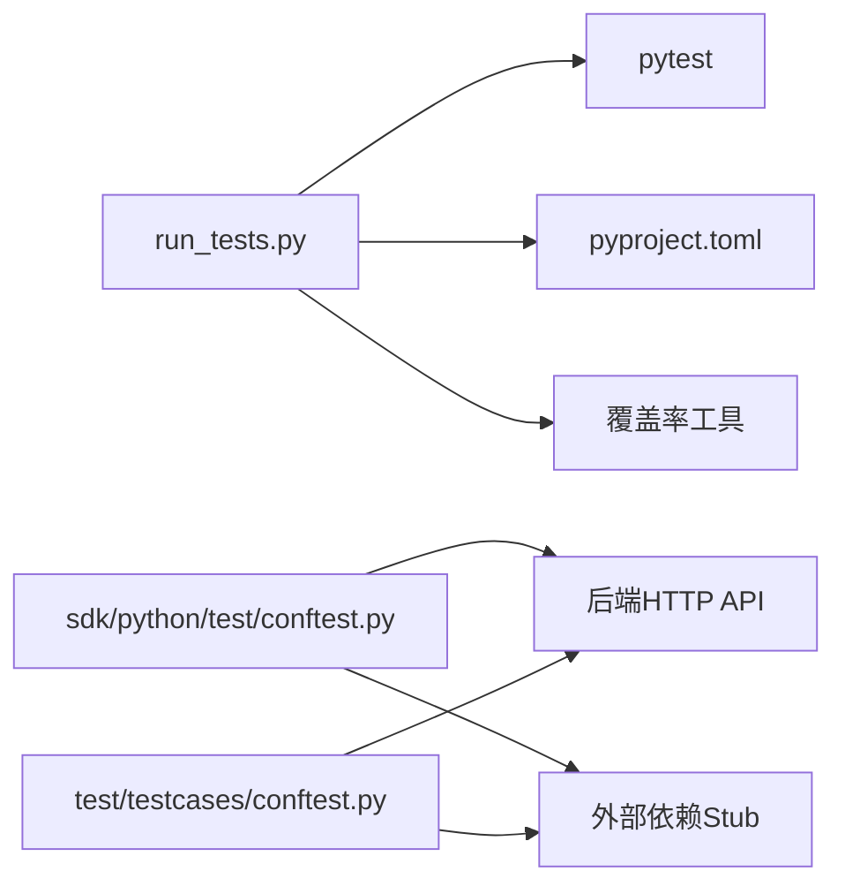

# 单元测试框架

<cite>
**本文引用的文件**
- [run_tests.py](file://run_tests.py)
- [codecov.yml](file://codecov.yml)
- [sdk/python/test/conftest.py](file://sdk/python/test/conftest.py)
- [test/testcases/conftest.py](file://test/testcases/conftest.py)
- [test/unit_test/common/test_string_utils.py](file://test/unit_test/common/test_string_utils.py)
</cite>

## 目录
1. [简介](#简介)
2. [项目结构](#项目结构)
3. [核心组件](#核心组件)
4. [架构总览](#架构总览)
5. [详细组件分析](#详细组件分析)
6. [依赖关系分析](#依赖关系分析)
7. [性能考量](#性能考量)
8. [故障排查指南](#故障排查指南)
9. [结论](#结论)
10. [附录](#附录)

## 简介
本文件面向RAGFlow的单元测试与测试运行体系，系统性阐述基于Pytest的测试框架配置与使用方法，涵盖测试组织结构、测试标记系统、参数化与参数化测试、Mock策略、覆盖率统计与分析、以及针对RAG引擎、代理系统、存储模块等核心组件的测试实践建议。文档同时提供可操作的命令行工具说明与常见问题排查路径，帮助开发者高效编写与维护高质量单元测试。

## 项目结构
RAGFlow的测试体系由以下层次构成：
- 测试运行器：统一入口脚本负责构建pytest命令、并行执行、覆盖率统计与报告生成。
- 配置层：多处conftest.py提供全局fixture与标记表达式，支撑不同子域（HTTP API、Python SDK、Web端）的测试环境准备。
- 覆盖率配置：通过Codecov配置控制项目级覆盖率状态开关。
- 单元测试目录：位于test/unit_test下，按模块分层组织，便于定位与执行。

图表来源
- [run_tests.py:96-138](file://run_tests.py#L96-L138)
- [sdk/python/test/conftest.py:63-92](file://sdk/python/test/conftest.py#L63-L92)
- [test/testcases/conftest.py:105-128](file://test/testcases/conftest.py#L105-L128)
- [codecov.yml:1-4](file://codecov.yml#L1-L4)

章节来源
- [run_tests.py:34-138](file://run_tests.py#L34-L138)
- [codecov.yml:1-4](file://codecov.yml#L1-L4)

## 核心组件
- 统一测试运行器
  - 提供命令行参数解析与pytest命令拼装，支持覆盖率、并行执行、标记过滤、指定测试路径等。
  - 默认在test/unit_test目录下执行，并根据配置自动注入--config-file指向pyproject.toml。
- 全局fixture与标记系统
  - SDK测试环境：注册/登录、获取API Key与租户信息，确保测试前置条件一致。
  - HTTP/Web测试环境：支持p1/p2/p3等级别标记表达式，结合--level选项动态生效；提供认证与租户初始化fixture。
- 覆盖率与报告
  - 通过--cov对common源码目录进行覆盖率统计，生成HTML与终端报告；支持自动打开报告文件。

章节来源
- [run_tests.py:96-138](file://run_tests.py#L96-L138)
- [sdk/python/test/conftest.py:63-153](file://sdk/python/test/conftest.py#L63-L153)
- [test/testcases/conftest.py:98-128](file://test/testcases/conftest.py#L98-L128)

## 架构总览
下图展示了从命令行到pytest执行再到覆盖率输出的整体流程：

图表来源
- [run_tests.py:96-138](file://run_tests.py#L96-L138)
- [run_tests.py:140-189](file://run_tests.py#L140-L189)

## 详细组件分析

### 统一测试运行器（run_tests.py）
- 功能要点
  - 参数解析：支持--coverage、--parallel、--verbose、--test、--markers等。
  - 命令构建：默认在test/unit_test目录执行；可注入--config-file；根据--markers拼装-m；根据--parallel注入-n；根据--coverage注入--cov与报告类型。
  - 执行与反馈：捕获KeyboardInterrupt与异常；成功时打印报告路径与打开方式。
- 最佳实践
  - 使用--markers快速筛选测试集（如unit/integration）。
  - 在CI中开启--coverage以生成报告并在本地查看。
  - 并行执行需安装pytest-xdist，否则回退至-n auto。

章节来源
- [run_tests.py:34-275](file://run_tests.py#L34-L275)

### SDK测试环境（sdk/python/test/conftest.py）
- 功能要点
  - 环境变量：HOST_ADDRESS、ZHIPU_AI_API_KEY等。
  - 注册/登录：封装注册与登录逻辑，失败时抛出异常或直接退出。
  - Fixture：get_api_key_fixture、get_auth、get_email等，用于提供认证令牌与租户信息。
  - 租户初始化：自动添加模型、查询租户ID并设置默认LLM/Embedding等。
- Mock策略建议
  - 对外部HTTP接口使用requests-mock或unittest.mock进行拦截，避免真实网络请求。
  - 对第三方服务（如ZHIPU AI）使用本地桩或Fake实现替换真实调用。

章节来源
- [sdk/python/test/conftest.py:17-153](file://sdk/python/test/conftest.py#L17-L153)

### HTTP/Web测试环境（test/testcases/conftest.py）
- 功能要点
  - 标记表达式：p1/p2/p3分别映射为不同的组合表达式，通过--level动态生效。
  - 注册/登录：与SDK版本类似，但URL包含版本号。
  - Fixture：auth/token等，用于后续测试用例复用。
  - 外部依赖Stub：对某些外部模块（如rag.llm、scholarly）进行stub，防止导入副作用。
- Mock策略建议
  - 对API路由与业务服务使用pytest fixture与unittest.mock.patch进行隔离。
  - 对数据库/缓存等持久化依赖使用内存或临时实例替代。

章节来源
- [test/testcases/conftest.py:98-232](file://test/testcases/conftest.py#L98-L232)

### 单元测试示例（test/unit_test/common/test_string_utils.py）
- 测试组织
  - 使用类分组测试同一函数的不同场景，便于维护与扩展。
  - 采用pytest.mark.skip标注待修复用例，保持主分支稳定。
- 断言与异常
  - 使用标准assert进行等值断言。
  - 对异常场景（如非零返回码）使用pytest.raises或自定义断言包装。
- 参数化建议
  - 对相似输入/期望组合使用pytest.mark.parametrize进行参数化，减少重复代码。
- Mock建议
  - 若被测函数依赖外部资源，优先通过参数注入或fixture替换实现隔离。

章节来源
- [test/unit_test/common/test_string_utils.py:17-360](file://test/unit_test/common/test_string_utils.py#L17-L360)

### 覆盖率配置与分析（codecov.yml）
- 当前配置关闭了项目级与补丁级覆盖率状态检查，适合在CI中仅生成报告而不强制阈值。
- 建议
  - 在团队达成共识后，可在codecov.yml中开启status并设置阈值，以提升质量门禁。
  - 结合run_tests.py的--cov参数，确保common等核心模块被覆盖。

章节来源
- [codecov.yml:1-4](file://codecov.yml#L1-L4)

## 依赖关系分析
- 运行器依赖
  - 依赖pytest及其插件（如xdist用于并行，cov用于覆盖率）。
  - 依赖pyproject.toml作为pytest配置文件来源。
- 测试环境依赖
  - SDK与HTTP/Web测试环境均依赖外部HTTP服务（后端API），需保证网络连通与凭据正确。
  - 外部依赖Stub机制降低对真实第三方服务的耦合。

图表来源
- [run_tests.py:96-138](file://run_tests.py#L96-L138)
- [sdk/python/test/conftest.py:17-153](file://sdk/python/test/conftest.py#L17-L153)
- [test/testcases/conftest.py:98-232](file://test/testcases/conftest.py#L98-L232)

## 性能考量
- 并行执行
  - 使用--parallel启用pytest-xdist并行，CPU核数越多效果越明显；若无xdist则回退至-n auto。
- 覆盖率开销
  - 开启--cov会增加执行时间与内存占用，建议在CI中开启，在本地开发中按需开启。
- 测试选择
  - 使用--markers与--test精准定位测试，缩短反馈周期。

章节来源
- [run_tests.py:122-132](file://run_tests.py#L122-L132)

## 故障排查指南
- 常见问题
  - 环境变量缺失：SDK测试环境要求设置HOST_ADDRESS与ZHIPU_AI_API_KEY，否则测试会直接退出。
  - 认证失败：注册/登录接口返回非零码时会抛出异常，检查后端服务状态与凭据。
  - 外部依赖Stub：若出现“模块被stub”相关错误，确认是否在测试环境中正确安装或stub了对应模块。
  - 并行执行失败：缺少pytest-xdist时会回退，必要时安装插件或移除--parallel。
- 排查步骤
  - 使用--verbose查看详细日志。
  - 使用--markers过滤测试，逐步缩小范围。
  - 通过--test指定具体文件或目录，验证最小可复现场景。
  - 检查覆盖率报告中的未覆盖路径，补充针对性用例。

章节来源
- [sdk/python/test/conftest.py:22-25](file://sdk/python/test/conftest.py#L22-L25)
- [test/testcases/conftest.py:130-148](file://test/testcases/conftest.py#L130-L148)
- [run_tests.py:184-189](file://run_tests.py#L184-L189)

## 结论
RAGFlow的单元测试框架以Pytest为核心，配合统一运行器与多套环境配置，实现了灵活的测试组织、标记与覆盖率统计。通过合理的Mock策略与参数化设计，开发者可以高效地覆盖RAG引擎、代理系统、存储模块等关键组件。建议在团队内明确覆盖率阈值与测试规范，持续优化测试用例质量与执行效率。

## 附录
- 命令行示例
  - 运行全部单元测试：python run_tests.py
  - 带覆盖率：python run_tests.py --coverage
  - 并行执行：python run_tests.py --parallel
  - 指定测试文件：python run_tests.py --test test/unit_test/common/test_string_utils.py
  - 按标记过滤：python run_tests.py --markers "unit"
- 编写规范建议
  - 命名：测试函数以test_开头，类以Test开头；参数化用例使用清晰的id或parametrize。
  - 断言：优先使用pytest内置断言；对异常使用pytest.raises或自定义断言包装。
  - 异常测试：覆盖正常路径与边界条件，对不可达分支使用pytest.skip标注。
  - Mock：对外部依赖进行隔离，避免真实网络/数据库/第三方服务调用。
  - 覆盖率：关注热点路径与分支，补齐未覆盖代码；结合报告定位改进点。