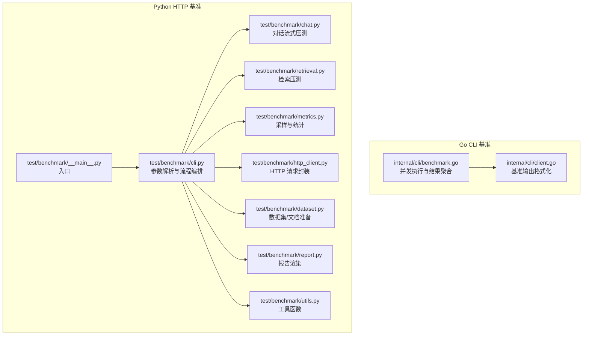
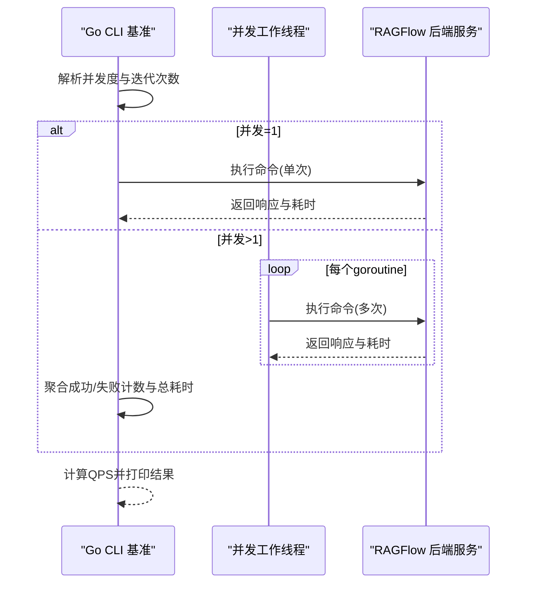
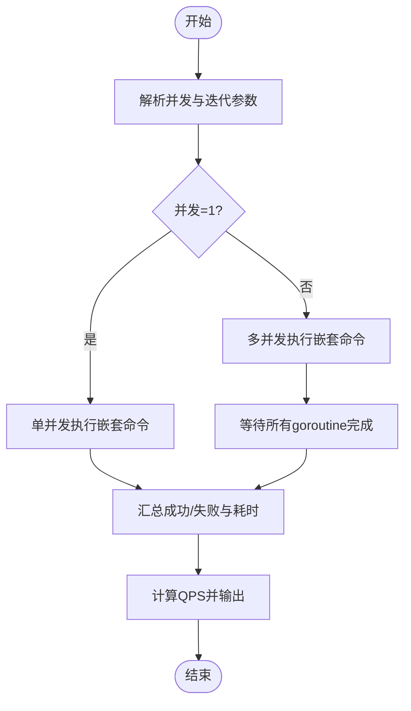
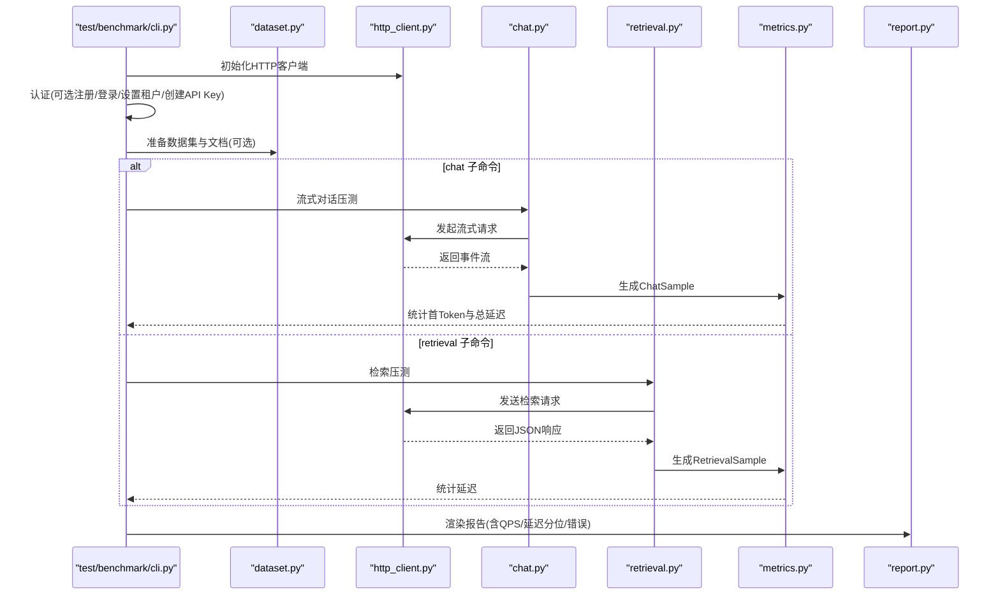
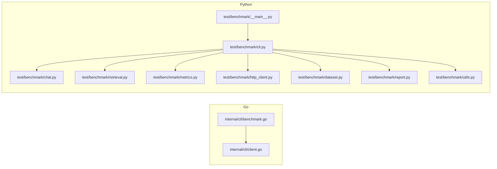
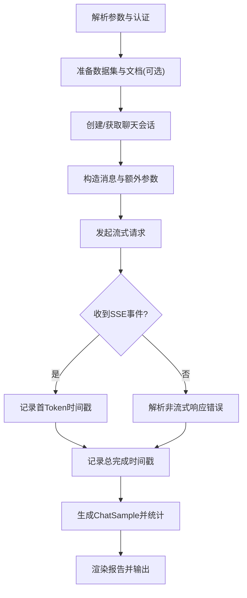

# 性能测试

<cite>
**本文引用的文件**   
- [internal/cli/benchmark.go](file://internal/cli/benchmark.go)
- [internal/cli/client.go](file://internal/cli/client.go)
- [test/benchmark/__main__.py](file://test/benchmark/__main__.py)
- [test/benchmark/cli.py](file://test/benchmark/cli.py)
- [test/benchmark/chat.py](file://test/benchmark/chat.py)
- [test/benchmark/retrieval.py](file://test/benchmark/retrieval.py)
- [test/benchmark/metrics.py](file://test/benchmark/metrics.py)
- [test/benchmark/http_client.py](file://test/benchmark/http_client.py)
- [test/benchmark/dataset.py](file://test/benchmark/dataset.py)
- [test/benchmark/report.py](file://test/benchmark/report.py)
- [test/benchmark/utils.py](file://test/benchmark/utils.py)
- [test/benchmark/run_chat.sh](file://test/benchmark/run_chat.sh)
- [test/benchmark/run_retrieval.sh](file://test/benchmark/run_retrieval.sh)
- [common/signal_utils.py](file://common/signal_utils.py)
- [api/utils/health_utils.py](file://api/utils/health_utils.py)
- [rag/utils/ob_conn.py](file://rag/utils/ob_conn.py)
</cite>

## 目录
1. [简介](#简介)
2. [项目结构](#项目结构)
3. [核心组件](#核心组件)
4. [架构总览](#架构总览)
5. [详细组件分析](#详细组件分析)
6. [依赖分析](#依赖分析)
7. [性能考量](#性能考量)
8. [故障排查指南](#故障排查指南)
9. [结论](#结论)
10. [附录](#附录)

## 简介
本文件面向RAGFlow的性能测试与基准评测，系统化介绍压力测试方法、并发用户模拟、吞吐量与延迟指标采集、内存泄漏检测、性能瓶颈定位与优化建议，并提供可直接使用的测试脚本路径与最佳实践。内容覆盖从CLI基准工具到HTTP API基准测试套件，涵盖检索、对话流式响应等关键场景。

## 项目结构
RAGFlow的性能测试能力由两部分组成：
- Go CLI基准工具：用于对后端命令进行单并发与多并发基准测试，输出总耗时、成功/失败计数、并发度等。
- Python HTTP API基准测试套件：通过HTTP客户端对检索与对话接口进行高并发压测，统计首 Token 延迟、总延迟、QPS、错误率等。

**图表来源**
- [internal/cli/benchmark.go:1-295](file://internal/cli/benchmark.go#L1-L295)
- [internal/cli/client.go:500-554](file://internal/cli/client.go#L500-L554)
- [test/benchmark/cli.py:1-576](file://test/benchmark/cli.py#L1-L576)
- [test/benchmark/chat.py:1-139](file://test/benchmark/chat.py#L1-L139)
- [test/benchmark/retrieval.py:1-40](file://test/benchmark/retrieval.py#L1-L40)
- [test/benchmark/metrics.py:1-68](file://test/benchmark/metrics.py#L1-L68)
- [test/benchmark/http_client.py:1-113](file://test/benchmark/http_client.py#L1-L113)
- [test/benchmark/dataset.py:1-147](file://test/benchmark/dataset.py#L1-L147)
- [test/benchmark/report.py:1-106](file://test/benchmark/report.py#L1-L106)
- [test/benchmark/utils.py:1-42](file://test/benchmark/utils.py#L1-L42)
- [test/benchmark/__main__.py:1-6](file://test/benchmark/__main__.py#L1-L6)

**章节来源**
- [internal/cli/benchmark.go:1-295](file://internal/cli/benchmark.go#L1-L295)
- [test/benchmark/cli.py:1-576](file://test/benchmark/cli.py#L1-L576)

## 核心组件
- Go CLI基准执行器：支持单并发与多并发模式，聚合各并发线程的成功/失败计数与总耗时，计算QPS并输出。
- Python HTTP基准套件：封装HttpClient，提供对话（OpenAI风格流式）与检索接口压测；内置数据集准备、文档上传解析、等待解析完成等流程；统计首 Token 延迟、总延迟、QPS与错误信息。
- 报告与指标：提供Chat与Retrieval两类报告模板，输出平均/最小/P50/P90/P95延迟、总耗时、QPS与错误列表。
- 内存泄漏检测：通过信号触发tracemalloc快照与停止，记录当前/峰值内存与RSS，辅助定位长期运行稳定性问题。

**章节来源**
- [internal/cli/benchmark.go:36-64](file://internal/cli/benchmark.go#L36-L64)
- [internal/cli/benchmark.go:146-218](file://internal/cli/benchmark.go#L146-L218)
- [internal/cli/client.go:500-520](file://internal/cli/client.go#L500-L520)
- [test/benchmark/cli.py:329-449](file://test/benchmark/cli.py#L329-L449)
- [test/benchmark/cli.py:452-547](file://test/benchmark/cli.py#L452-L547)
- [test/benchmark/report.py:32-105](file://test/benchmark/report.py#L32-L105)
- [test/benchmark/metrics.py:6-68](file://test/benchmark/metrics.py#L6-L68)
- [common/signal_utils.py:24-55](file://common/signal_utils.py#L24-L55)

## 架构总览
下图展示从命令行到HTTP压测的整体调用链路与数据流。

**图表来源**
- [internal/cli/benchmark.go:36-64](file://internal/cli/benchmark.go#L36-L64)
- [internal/cli/benchmark.go:146-218](file://internal/cli/benchmark.go#L146-L218)

## 详细组件分析

### Go CLI 基准执行器
- 单并发模式：逐次执行嵌套命令，提取响应码与耗时，统计成功/失败。
- 多并发模式：启动多个goroutine，每个goroutine独立创建客户端实例，静默执行指定次数，聚合所有结果，计算总耗时与QPS。
- 成功判定：根据命令类型检查状态码与JSON返回码，确保一致性。

**图表来源**
- [internal/cli/benchmark.go:36-64](file://internal/cli/benchmark.go#L36-L64)
- [internal/cli/benchmark.go:66-144](file://internal/cli/benchmark.go#L66-L144)
- [internal/cli/benchmark.go:146-218](file://internal/cli/benchmark.go#L146-L218)

**章节来源**
- [internal/cli/benchmark.go:36-64](file://internal/cli/benchmark.go#L36-L64)
- [internal/cli/benchmark.go:66-144](file://internal/cli/benchmark.go#L66-L144)
- [internal/cli/benchmark.go:146-218](file://internal/cli/benchmark.go#L146-L218)
- [internal/cli/client.go:500-520](file://internal/cli/client.go#L500-L520)

### Python HTTP 基准套件
- 参数解析与认证：支持API Key或登录令牌，必要时自动注册、登录、设置租户模型ID与LLM密钥。
- 数据集与文档准备：创建/列出/删除数据集，上传文档，触发分词解析，轮询等待解析完成。
- 对话压测：构造OpenAI风格消息，发起流式请求，统计首 Token 到总完成的时间戳，计算延迟与QPS。
- 检索压测：构造检索请求体，发送非流式请求，统计总延迟与QPS。
- 报告输出：按Chat/Retrieval模板输出延迟分位值、总耗时、QPS与错误列表。

**图表来源**
- [test/benchmark/cli.py:202-251](file://test/benchmark/cli.py#L202-L251)
- [test/benchmark/cli.py:253-310](file://test/benchmark/cli.py#L253-L310)
- [test/benchmark/cli.py:329-449](file://test/benchmark/cli.py#L329-L449)
- [test/benchmark/cli.py:452-547](file://test/benchmark/cli.py#L452-L547)
- [test/benchmark/dataset.py:16-100](file://test/benchmark/dataset.py#L16-L100)
- [test/benchmark/chat.py:71-139](file://test/benchmark/chat.py#L71-L139)
- [test/benchmark/retrieval.py:28-40](file://test/benchmark/retrieval.py#L28-L40)
- [test/benchmark/metrics.py:6-68](file://test/benchmark/metrics.py#L6-L68)
- [test/benchmark/report.py:32-105](file://test/benchmark/report.py#L32-L105)

**章节来源**
- [test/benchmark/cli.py:202-251](file://test/benchmark/cli.py#L202-L251)
- [test/benchmark/cli.py:253-310](file://test/benchmark/cli.py#L253-L310)
- [test/benchmark/cli.py:329-449](file://test/benchmark/cli.py#L329-L449)
- [test/benchmark/cli.py:452-547](file://test/benchmark/cli.py#L452-L547)
- [test/benchmark/dataset.py:16-100](file://test/benchmark/dataset.py#L16-L100)
- [test/benchmark/chat.py:71-139](file://test/benchmark/chat.py#L71-L139)
- [test/benchmark/retrieval.py:28-40](file://test/benchmark/retrieval.py#L28-L40)
- [test/benchmark/metrics.py:6-68](file://test/benchmark/metrics.py#L6-L68)
- [test/benchmark/report.py:32-105](file://test/benchmark/report.py#L32-L105)

### 性能指标与统计
- Chat：首 Token 延迟、总延迟；支持平均/最小/P50/P90/P95分位统计；QPS = 迭代数 / 总耗时。
- Retrieval：总延迟；支持平均/最小/P50/P90/P95分位统计；QPS = 迭代数 / 总耗时。
- 错误处理：捕获非流式响应、无效JSON、业务错误码等，统一计入错误列表。

**章节来源**
- [test/benchmark/metrics.py:6-68](file://test/benchmark/metrics.py#L6-L68)
- [test/benchmark/report.py:32-105](file://test/benchmark/report.py#L32-L105)
- [test/benchmark/chat.py:58-69](file://test/benchmark/chat.py#L58-L69)
- [test/benchmark/retrieval.py:33-39](file://test/benchmark/retrieval.py#L33-L39)

### 内存泄漏检测与长期稳定性
- 通过信号触发tracemalloc快照与停止，记录当前/峰值内存与RSS，便于定位内存增长趋势。
- 支持在Linux/macOS上获取进程最大RSS，在Windows上使用psutil读取RSS。

**章节来源**
- [common/signal_utils.py:24-55](file://common/signal_utils.py#L24-L55)

## 依赖分析
- Go CLI基准依赖内部HTTP客户端与响应类型，负责并发调度与结果聚合。
- Python基准依赖requests库与可选的requests-toolbelt，封装统一的HTTP请求与JSON解析。
- 数据集模块依赖文件系统与可选的multipart编码器，实现批量文件上传。
- 报告模块依赖指标统计，提供统一的文本报告渲染。

**图表来源**
- [internal/cli/benchmark.go:1-295](file://internal/cli/benchmark.go#L1-L295)
- [internal/cli/client.go:500-554](file://internal/cli/client.go#L500-L554)
- [test/benchmark/cli.py:1-576](file://test/benchmark/cli.py#L1-L576)
- [test/benchmark/chat.py:1-139](file://test/benchmark/chat.py#L1-L139)
- [test/benchmark/retrieval.py:1-40](file://test/benchmark/retrieval.py#L1-L40)
- [test/benchmark/metrics.py:1-68](file://test/benchmark/metrics.py#L1-L68)
- [test/benchmark/http_client.py:1-113](file://test/benchmark/http_client.py#L1-L113)
- [test/benchmark/dataset.py:1-147](file://test/benchmark/dataset.py#L1-L147)
- [test/benchmark/report.py:1-106](file://test/benchmark/report.py#L1-L106)
- [test/benchmark/utils.py:1-42](file://test/benchmark/utils.py#L1-L42)
- [test/benchmark/__main__.py:1-6](file://test/benchmark/__main__.py#L1-L6)

**章节来源**
- [internal/cli/benchmark.go:1-295](file://internal/cli/benchmark.go#L1-L295)
- [test/benchmark/cli.py:1-576](file://test/benchmark/cli.py#L1-L576)

## 性能考量
- 并发与迭代：通过增加并发度与迭代次数评估系统在高负载下的稳定性与扩展性；注意合理设置连接/读超时以避免阻塞。
- 延迟与吞吐：关注首 Token 延迟与总延迟，结合QPS评估系统在不同负载下的响应能力。
- 错误率：统计业务错误与网络异常，定位上游依赖（如LLM工厂、存储引擎）的性能瓶颈。
- 存储与数据库：通过健康检查与性能指标接口观测数据库延迟、慢查询、连接池与QPS，辅助定位存储层瓶颈。
- 长期稳定性：结合内存快照与RSS趋势，识别潜在内存泄漏与资源占用增长。

**章节来源**
- [test/benchmark/cli.py:41-74](file://test/benchmark/cli.py#L41-L74)
- [api/utils/health_utils.py:174-216](file://api/utils/health_utils.py#L174-L216)
- [rag/utils/ob_conn.py:338-395](file://rag/utils/ob_conn.py#L338-L395)

## 故障排查指南
- 认证失败：确认API Key或登录凭据配置正确，必要时启用自动注册与LLM密钥注入。
- 数据集/文档准备失败：检查数据集名称与payload，确认文档上传与解析完成后再进行压测。
- 对话流式错误：检查Content-Type是否为SSE，解析非流式响应时的错误码与消息。
- 检索失败：确认dataset_ids与question存在，解析JSON响应时的错误码。
- 报告缺失：确保迭代数与并发度参数合法，检查输出格式（文本或JSON）与错误列表。

**章节来源**
- [test/benchmark/cli.py:202-251](file://test/benchmark/cli.py#L202-L251)
- [test/benchmark/cli.py:253-310](file://test/benchmark/cli.py#L253-L310)
- [test/benchmark/chat.py:58-69](file://test/benchmark/chat.py#L58-L69)
- [test/benchmark/retrieval.py:33-39](file://test/benchmark/retrieval.py#L33-L39)

## 结论
RAGFlow提供了从Go CLI到Python HTTP的完整性能测试方案，覆盖并发压测、延迟与吞吐统计、错误归因与报告输出。结合内存快照与数据库健康指标，可系统性地定位瓶颈并指导优化。建议在标准化环境中重复执行同一套脚本，形成基线数据以便对比改进效果。

## 附录

### 基准测试脚本与用法
- 对话压测脚本：[test/benchmark/run_chat.sh:1-29](file://test/benchmark/run_chat.sh#L1-L29)
- 检索压测脚本：[test/benchmark/run_retrieval.sh:1-26](file://test/benchmark/run_retrieval.sh#L1-L26)
- 入口模块：[test/benchmark/__main__.py:1-6](file://test/benchmark/__main__.py#L1-L6)
- 主程序入口与参数解析：[test/benchmark/cli.py:31-113](file://test/benchmark/cli.py#L31-L113)

**章节来源**
- [test/benchmark/run_chat.sh:1-29](file://test/benchmark/run_chat.sh#L1-L29)
- [test/benchmark/run_retrieval.sh:1-26](file://test/benchmark/run_retrieval.sh#L1-L26)
- [test/benchmark/__main__.py:1-6](file://test/benchmark/__main__.py#L1-L6)
- [test/benchmark/cli.py:31-113](file://test/benchmark/cli.py#L31-L113)

### 关键流程图：对话压测

**图表来源**
- [test/benchmark/cli.py:329-449](file://test/benchmark/cli.py#L329-L449)
- [test/benchmark/chat.py:71-139](file://test/benchmark/chat.py#L71-L139)
- [test/benchmark/metrics.py:6-25](file://test/benchmark/metrics.py#L6-L25)
- [test/benchmark/report.py:32-70](file://test/benchmark/report.py#L32-L70)