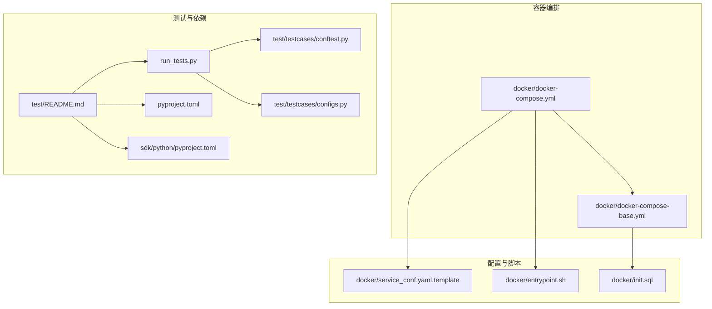
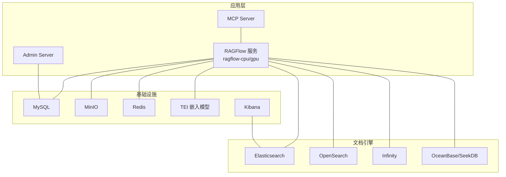
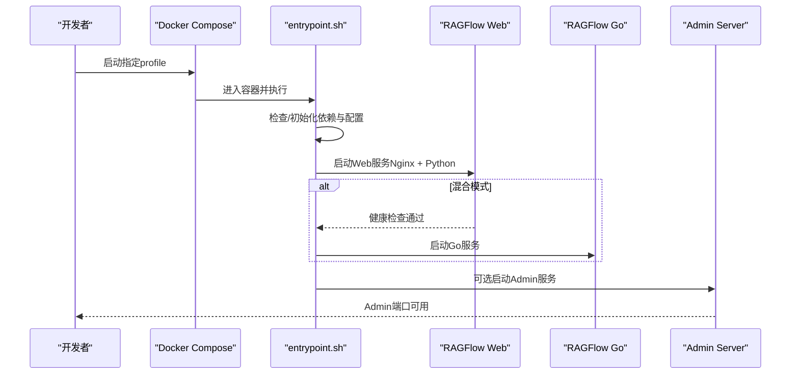
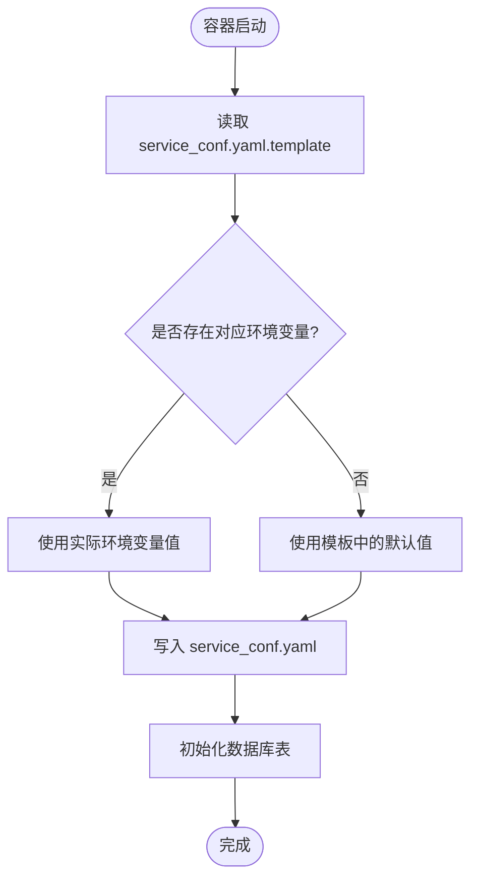
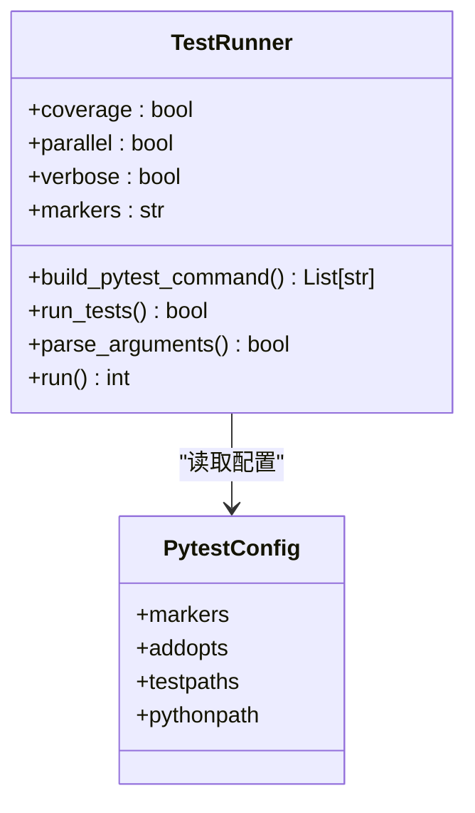
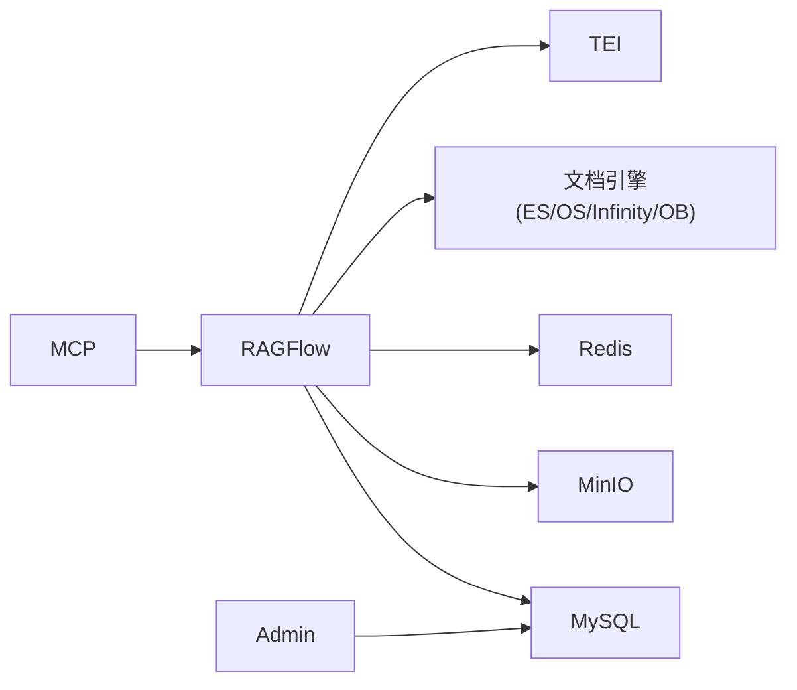

# 测试环境搭建

<cite>
**本文引用的文件**
- [docker/docker-compose.yml](file://docker/docker-compose.yml)
- [docker/docker-compose-base.yml](file://docker/docker-compose-base.yml)
- [docker/service_conf.yaml.template](file://docker/service_conf.yaml.template)
- [docker/entrypoint.sh](file://docker/entrypoint.sh)
- [docker/init.sql](file://docker/init.sql)
- [test/README.md](file://test/README.md)
- [run_tests.py](file://run_tests.py)
- [pyproject.toml](file://pyproject.toml)
- [test/testcases/conftest.py](file://test/testcases/conftest.py)
- [test/testcases/configs.py](file://test/testcases/configs.py)
- [sdk/python/pyproject.toml](file://sdk/python/pyproject.toml)
</cite>

## 目录
1. [简介](#简介)
2. [项目结构](#项目结构)
3. [核心组件](#核心组件)
4. [架构总览](#架构总览)
5. [详细组件分析](#详细组件分析)
6. [依赖分析](#依赖分析)
7. [性能考虑](#性能考虑)
8. [故障排查指南](#故障排查指南)
9. [结论](#结论)
10. [附录](#附录)

## 简介
本指南面向开发者与测试工程师，提供RAGFlow测试环境的完整搭建与维护方案。内容覆盖Docker容器编排、服务启动顺序、环境变量配置、测试数据准备与管理、测试工具安装与配置、多场景测试环境（Elasticsearch、Infinity、混合部署）以及日志与监控、故障排查等运维要点，帮助快速构建稳定高效的测试环境。

## 项目结构
测试相关的关键目录与文件：
- 容器编排：docker/docker-compose.yml、docker/docker-compose-base.yml
- 配置模板：docker/service_conf.yaml.template
- 启动脚本：docker/entrypoint.sh
- 初始化SQL：docker/init.sql
- 测试说明：test/README.md
- 测试运行器：run_tests.py
- 依赖与测试配置：pyproject.toml、sdk/python/pyproject.toml
- 测试夹具与通用配置：test/testcases/conftest.py、test/testcases/configs.py

图表来源
- [docker/docker-compose.yml:1-135](file://docker/docker-compose.yml#L1-L135)
- [docker/docker-compose-base.yml:1-326](file://docker/docker-compose-base.yml#L1-L326)
- [docker/service_conf.yaml.template:1-172](file://docker/service_conf.yaml.template#L1-L172)
- [docker/entrypoint.sh:1-340](file://docker/entrypoint.sh#L1-L340)
- [docker/init.sql:1-2](file://docker/init.sql#L1-L2)
- [test/README.md:1-98](file://test/README.md#L1-L98)
- [run_tests.py:1-275](file://run_tests.py#L1-L275)
- [pyproject.toml:1-289](file://pyproject.toml#L1-L289)
- [sdk/python/pyproject.toml:1-32](file://sdk/python/pyproject.toml#L1-L32)
- [test/testcases/conftest.py:1-232](file://test/testcases/conftest.py#L1-L232)
- [test/testcases/configs.py:1-70](file://test/testcases/configs.py#L1-L70)

章节来源
- [docker/docker-compose.yml:1-135](file://docker/docker-compose.yml#L1-L135)
- [docker/docker-compose-base.yml:1-326](file://docker/docker-compose-base.yml#L1-L326)
- [test/README.md:1-98](file://test/README.md#L1-L98)

## 核心组件
- Docker编排与服务依赖
  - 基础服务：MySQL、MinIO、Redis、Elasticsearch/OpenSearch、Infinity、OceanBase/SeekDB、TEI嵌入模型服务、Kibana
  - 应用服务：ragflow-cpu/gpu（后端+Web），Admin Server，可选MCP Server
  - 通过profiles控制启用的服务集（如elasticsearch、infinity、oceanbase、sandbox、tei-cpu/gpu）
- 配置模板与环境变量
  - 通过service_conf.yaml.template注入环境变量，支持ES、OpenSearch、Infinity、OceanBase、SeekDB、MySQL、MinIO、Redis、TEI等
- 启动脚本与初始化
  - entrypoint.sh负责按参数选择性启动Web/Go服务、Admin服务、MCP服务、数据同步与任务执行器，并在启动前完成数据库表初始化与Docling依赖检查
- 测试工具链
  - 使用pytest作为测试框架，支持并行、覆盖率、标记筛选；run_tests.py提供统一入口与彩色输出
  - SDK测试与HTTP API测试分别对应test/testcases/test_sdk_api与test/testcases/test_http_api

章节来源
- [docker/docker-compose-base.yml:1-326](file://docker/docker-compose-base.yml#L1-L326)
- [docker/service_conf.yaml.template:1-172](file://docker/service_conf.yaml.template#L1-L172)
- [docker/entrypoint.sh:150-340](file://docker/entrypoint.sh#L150-L340)
- [run_tests.py:34-275](file://run_tests.py#L34-L275)
- [pyproject.toml:204-238](file://pyproject.toml#L204-L238)

## 架构总览
下图展示测试环境的典型容器拓扑与交互关系，涵盖后端服务、文档引擎（ES/Infinity/OB）、对象存储、缓存与嵌入模型服务。

图表来源
- [docker/docker-compose.yml:4-135](file://docker/docker-compose.yml#L4-L135)
- [docker/docker-compose-base.yml:2-326](file://docker/docker-compose-base.yml#L2-L326)

## 详细组件分析

### 组件A：Docker编排与服务启动顺序
- 关键点
  - 通过profiles启用所需后端（如elasticsearch、infinity、oceanbase、sandbox、tei-cpu/gpu）
  - 服务间依赖：RAGFlow应用依赖MySQL健康；ES/OpenSearch/Kibana、Infinity、OB/SeekDB、MinIO、Redis、TEI各自独立或按需启用
  - 端口映射与网络：统一使用bridge网络“ragflow”，各服务暴露必要端口
  - 日志挂载：应用日志挂载到本地目录便于排查
- 启动顺序建议
  1) 先启动基础依赖（MySQL、MinIO、Redis）
  2) 再启动文档引擎（ES/OpenSearch或Infinity/OB）
  3) 最后启动RAGFlow应用与Admin/MCP服务
- 环境变量
  - COMPOSE_PROFILES、RAGFLOW_IMAGE、DOC_ENGINE、TEI_MODEL、TEI_IMAGE_CPU/GPU等
  - 通过.env文件与模板替换机制生效

图表来源
- [docker/docker-compose.yml:4-135](file://docker/docker-compose.yml#L4-L135)
- [docker/entrypoint.sh:266-306](file://docker/entrypoint.sh#L266-L306)

章节来源
- [docker/docker-compose.yml:1-135](file://docker/docker-compose.yml#L1-L135)
- [docker/docker-compose-base.yml:1-326](file://docker/docker-compose-base.yml#L1-L326)
- [docker/entrypoint.sh:150-340](file://docker/entrypoint.sh#L150-L340)

### 组件B：配置模板与环境变量注入
- 配置模板
  - service_conf.yaml.template集中定义RAGFlow、MySQL、MinIO、ES/OpenSearch、Infinity、OceanBase/SeekDB、Redis、TEI等连接参数
  - 支持默认值与占位符，由entrypoint.sh在容器启动时解析并生成最终配置
- 环境变量
  - 常用：MYSQL_*、MINIO_*、ES_*、OS_*、INFINITY_*、OCEANBASE_*、SEEKDB_*、REDIS_*、TEI_*、API_PROXY_SCHEME等
  - 通过.env文件与env_file加载

图表来源
- [docker/service_conf.yaml.template:1-172](file://docker/service_conf.yaml.template#L1-L172)
- [docker/entrypoint.sh:150-174](file://docker/entrypoint.sh#L150-L174)
- [docker/init.sql:1-2](file://docker/init.sql#L1-L2)

章节来源
- [docker/service_conf.yaml.template:1-172](file://docker/service_conf.yaml.template#L1-L172)
- [docker/entrypoint.sh:150-174](file://docker/entrypoint.sh#L150-L174)
- [docker/init.sql:1-2](file://docker/init.sql#L1-L2)

### 组件C：测试工具安装与配置
- Python依赖与测试框架
  - 使用uv管理依赖，测试组包含pytest、playwright、coverage等
  - pytest配置支持标记（p0/p1/p2/p3/smoke）、并行执行、覆盖率报告HTML输出
- SDK测试与HTTP API测试
  - SDK测试：test/testcases/test_sdk_api
  - HTTP API测试：test/testcases/test_http_api
  - 通过环境变量HOST_ADDRESS、DOC_ENGINE、HTTP_API_TEST_LEVEL等控制
- 运行器
  - run_tests.py提供统一入口，支持覆盖率、并行、标记筛选、详细输出

图表来源
- [run_tests.py:34-275](file://run_tests.py#L34-L275)
- [pyproject.toml:162-179](file://pyproject.toml#L162-L179)
- [pyproject.toml:204-238](file://pyproject.toml#L204-L238)

章节来源
- [run_tests.py:1-275](file://run_tests.py#L1-L275)
- [pyproject.toml:162-179](file://pyproject.toml#L162-L179)
- [pyproject.toml:204-238](file://pyproject.toml#L204-L238)

### 组件D：测试数据准备与管理
- 数据源与引擎
  - Elasticsearch/OpenSearch：用于全文检索与向量检索
  - Infinity：高性能向量数据库，支持Thrift/HTTP/PostgreSQL接口
  - OceanBase/SeekDB：关系型与轻量级数据库，支持向量扩展
- 准备与清理
  - 通过docker-compose启动对应引擎profile
  - 使用初始化SQL创建数据库与基本表（MySQL）
  - 清理策略：删除对应volume或重启容器以清空状态

章节来源
- [docker/docker-compose-base.yml:2-326](file://docker/docker-compose-base.yml#L2-L326)
- [docker/init.sql:1-2](file://docker/init.sql#L1-L2)

### 组件E：不同测试场景的环境配置
- Elasticsearch测试环境
  - 启用profile：elasticsearch
  - 设置DOC_ENGINE为ES（若需要）
  - 运行SDK或HTTP API测试
- Infinity数据库测试环境
  - 启用profile：infinity
  - 设置DOC_ENGINE=infinity
  - 运行SDK或HTTP API测试
- 混合部署测试环境
  - 启用profile：hybrid（示例：API_PROXY_SCHEME=hybrid）
  - 启动Go与Python双栈服务，验证代理与负载切换
- TEI嵌入模型测试
  - 启用profile：tei-cpu或tei-gpu
  - 设置TEI_MODEL与镜像变量

章节来源
- [test/README.md:49-98](file://test/README.md#L49-L98)
- [docker/docker-compose-base.yml:244-277](file://docker/docker-compose-base.yml#L244-L277)
- [docker/entrypoint.sh:178-197](file://docker/entrypoint.sh#L178-L197)

## 依赖分析
- 组件耦合
  - RAGFlow应用依赖MySQL、MinIO、Redis、文档引擎（ES/OpenSearch/Infinity/OB）与TEI
  - Admin/MCP服务可独立启用，但通常与RAGFlow同网段通信
- 外部依赖
  - Elasticsearch/OpenSearch、Infinity、OceanBase/SeekDB、MinIO、Redis、TEI均为外部服务，需正确配置连接参数
- 循环依赖
  - 当前编排未见循环依赖；注意避免在同一compose中互相等待

图表来源
- [docker/docker-compose-base.yml:2-326](file://docker/docker-compose-base.yml#L2-L326)
- [docker/docker-compose.yml:4-135](file://docker/docker-compose.yml#L4-L135)

章节来源
- [docker/docker-compose-base.yml:1-326](file://docker/docker-compose-base.yml#L1-L326)
- [docker/docker-compose.yml:1-135](file://docker/docker-compose.yml#L1-L135)

## 性能考虑
- 并行测试
  - 使用pytest-xdist实现并行执行，提升测试吞吐
  - run_tests.py自动探测CPU核数并传入-n auto
- 覆盖率与报告
  - 开启覆盖率HTML报告，便于定位热点与盲区
- 资源限制
  - 通过mem_limit与ulimit控制容器资源，避免资源争抢
- 文档引擎选择
  - 不同引擎在吞吐与延迟上差异较大，建议针对目标场景选择合适引擎并压测

章节来源
- [run_tests.py:112-132](file://run_tests.py#L112-L132)
- [pyproject.toml:240-289](file://pyproject.toml#L240-L289)
- [docker/docker-compose-base.yml:22-96](file://docker/docker-compose-base.yml#L22-L96)

## 故障排查指南
- 容器健康检查失败
  - 检查ES/OpenSearch/Infinity/OB/MinIO/Redis的健康检查端点与密码配置
  - 查看对应服务日志与端口占用情况
- 数据库初始化异常
  - 确认init.sql已挂载并执行；检查MySQL密码与初始化命令
- 文档引擎连接错误
  - 校验service_conf.yaml.template中的hosts、用户名、密码是否与.env一致
- 测试无法登录或鉴权失败
  - 确认HOST_ADDRESS、VERSION、ZHIPU_AI_API_KEY等环境变量
  - 使用conftest中的注册/登录逻辑验证鉴权头是否正确传递
- 日志与监控
  - 应用日志挂载至本地目录，便于采集与分析
  - 可结合Prometheus/Docker指标查看容器资源使用

章节来源
- [docker/docker-compose-base.yml:27-321](file://docker/docker-compose-base.yml#L27-L321)
- [docker/init.sql:1-2](file://docker/init.sql#L1-L2)
- [docker/service_conf.yaml.template:26-58](file://docker/service_conf.yaml.template#L26-L58)
- [test/testcases/conftest.py:151-232](file://test/testcases/conftest.py#L151-L232)
- [test/testcases/configs.py:20-31](file://test/testcases/configs.py#L20-L31)
- [docker/docker-compose.yml:39-49](file://docker/docker-compose.yml#L39-L49)

## 结论
通过本指南，您可以基于Docker编排快速搭建RAGFlow测试环境，灵活切换文档引擎与部署模式，并借助pytest生态完成高效测试。建议在CI/CD中集成并行测试与覆盖率报告，配合日志与健康检查完善监控体系，持续保障测试质量与稳定性。

## 附录
- 快速开始步骤
  - 构建镜像与拉起容器：参考test/README.md中的部署与启动步骤
  - 安装测试依赖：使用uv同步test组依赖
  - 运行测试：根据场景选择SDK或HTTP API测试套件
- 常用环境变量清单
  - COMPOSE_PROFILES、RAGFLOW_IMAGE、DOC_ENGINE、TEI_MODEL、TEI_IMAGE_CPU/GPU、API_PROXY_SCHEME
  - MYSQL_*、MINIO_*、ES_*、OS_*、INFINITY_*、OCEANBASE_*、SEEKDB_*、REDIS_*、TEI_*

章节来源
- [test/README.md:4-98](file://test/README.md#L4-L98)
- [pyproject.toml:162-179](file://pyproject.toml#L162-L179)
- [docker/service_conf.yaml.template:1-172](file://docker/service_conf.yaml.template#L1-L172)