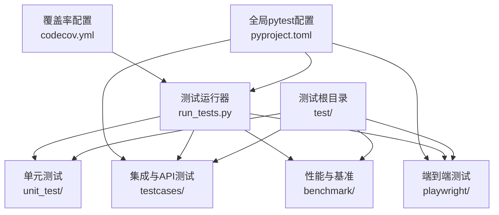
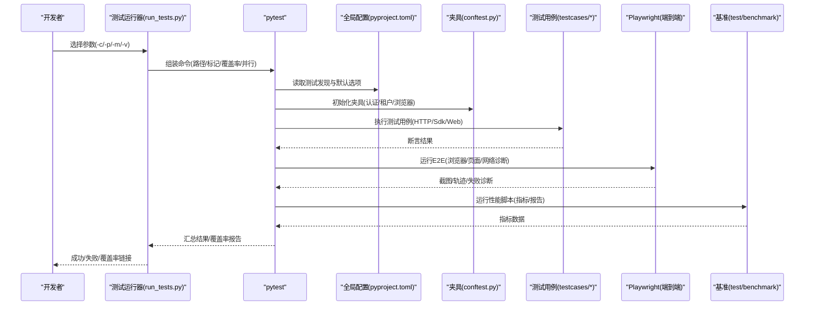
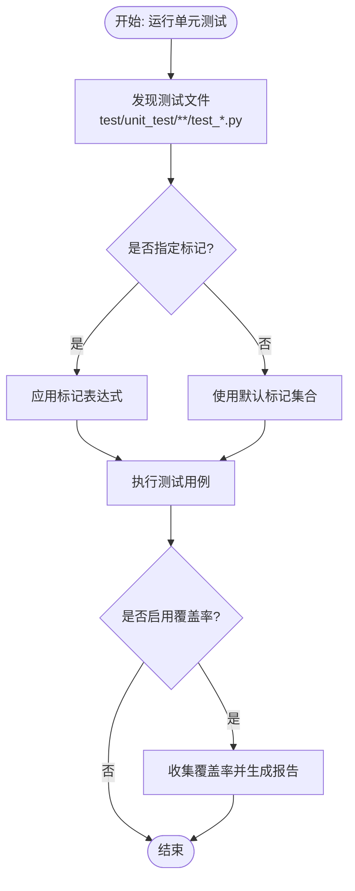
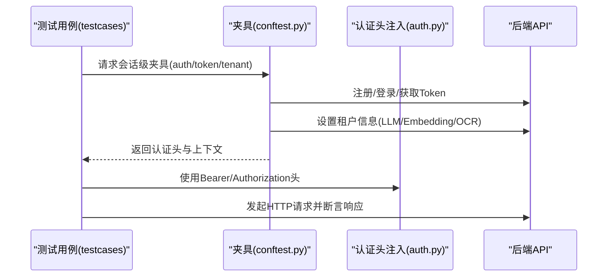
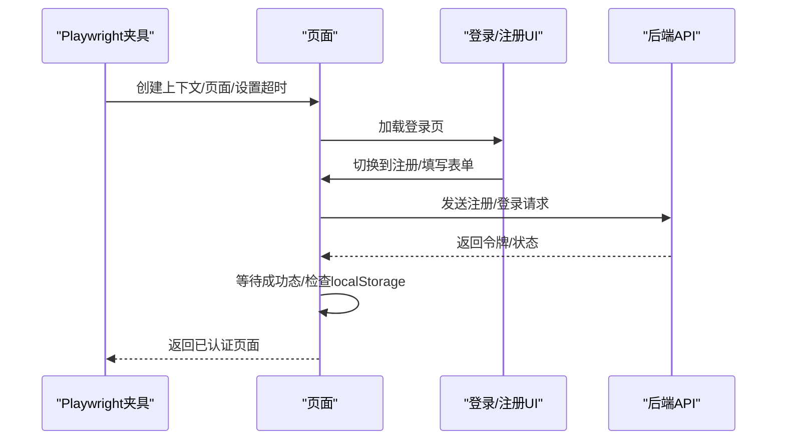
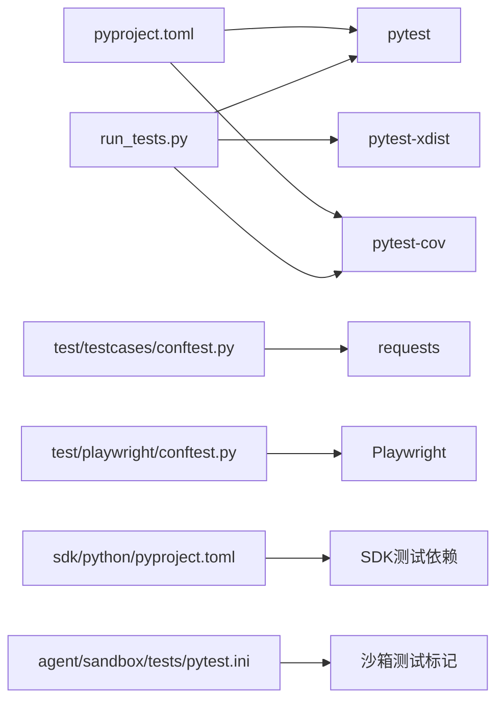

# 测试策略

<cite>
**本文引用的文件**   
- [test/README.md](file://test/README.md)
- [run_tests.py](file://run_tests.py)
- [pyproject.toml](file://pyproject.toml)
- [codecov.yml](file://codecov.yml)
- [test/playwright/conftest.py](file://test/playwright/conftest.py)
- [test/testcases/conftest.py](file://test/testcases/conftest.py)
- [test/unit_test/common/test_file_utils.py](file://test/unit_test/common/test_file_utils.py)
- [agent/sandbox/tests/pytest.ini](file://agent/sandbox/tests/pytest.ini)
- [test/benchmark/__main__.py](file://test/benchmark/__main__.py)
- [test/testcases/libs/auth.py](file://test/testcases/libs/auth.py)
- [sdk/python/pyproject.toml](file://sdk/python/pyproject.toml)
</cite>

## 目录
1. [引言](#引言)
2. [项目结构](#项目结构)
3. [核心组件](#核心组件)
4. [架构总览](#架构总览)
5. [详细组件分析](#详细组件分析)
6. [依赖分析](#依赖分析)
7. [性能考虑](#性能考虑)
8. [故障排查指南](#故障排查指南)
9. [结论](#结论)
10. [附录](#附录)

## 引言
本文件面向RAGFlow的测试体系，系统化梳理并输出测试框架、测试用例、测试流程与质量保证方法。内容覆盖单元测试、集成测试（含端到端）、API接口测试、性能测试与基准测试、测试环境搭建、覆盖率统计、持续集成配置以及最佳实践与缺陷管理建议，帮助开发者建立完善的测试体系，确保代码质量与系统稳定性。

## 项目结构
RAGFlow的测试子系统由多层测试构成：
- 单元测试：位于 test/unit_test 下，按模块细分，如 common、deepdoc/parser、memory/utils、rag 等。
- 集成测试与API测试：位于 test/testcases 下，覆盖SDK、HTTP API、Web应用等多客户端类型。
- 端到端测试（E2E）：位于 test/playwright 下，基于Playwright进行浏览器自动化测试。
- 性能测试与基准：位于 test/benchmark 下，提供检索、对话、检索+对话等场景的基准脚本。
- 测试运行器：run_tests.py 提供统一的pytest执行入口，支持覆盖率、并行、标记筛选等能力。
- 配置与工具：各子目录下的 pytest.ini、pyproject.toml、conftest.py 等定义了测试发现、夹具、标记、覆盖率等策略。

**图示来源**
- [pyproject.toml:204-237](file://pyproject.toml#L204-L237)
- [run_tests.py:34-138](file://run_tests.py#L34-L138)
- [test/README.md:1-98](file://test/README.md#L1-L98)

**章节来源**
- [test/README.md:1-98](file://test/README.md#L1-L98)
- [pyproject.toml:204-237](file://pyproject.toml#L204-L237)

## 核心组件
- 测试运行器（run_tests.py）
  - 统一调用pytest，支持并行（pytest-xdist）、覆盖率（pytest-cov）、标记筛选、详细输出等。
  - 默认扫描 test/unit_test，可指定目录或文件运行。
- 全局pytest配置（pyproject.toml）
  - 定义测试路径、发现规则、标记、命令行选项、覆盖率源与排除项。
- 夹具与环境准备（test/testcases/conftest.py、test/playwright/conftest.py）
  - 自动注册/登录、生成租户信息、注入认证头、浏览器上下文与页面配置、网络错误诊断等。
- 覆盖率与CI（codecov.yml）
  - 关闭项目/补丁级覆盖率状态检查，便于本地运行与CI解耦。
- 基准与性能（test/benchmark）
  - 提供检索、对话、检索+对话等脚本与指标采集工具，便于压测与基线对比。
- SDK与外部依赖测试配置（sdk/python/pyproject.toml）
  - 定义SDK测试依赖与标记，便于独立运行SDK侧测试。

**章节来源**
- [run_tests.py:34-138](file://run_tests.py#L34-L138)
- [pyproject.toml:204-237](file://pyproject.toml#L204-L237)
- [test/testcases/conftest.py:105-128](file://test/testcases/conftest.py#L105-L128)
- [test/playwright/conftest.py:687-800](file://test/playwright/conftest.py#L687-L800)
- [codecov.yml:1-4](file://codecov.yml#L1-L4)
- [test/benchmark/__main__.py:1-6](file://test/benchmark/__main__.py#L1-L6)
- [sdk/python/pyproject.toml:26-31](file://sdk/python/pyproject.toml#L26-L31)

## 架构总览
下图展示测试体系在不同层次的交互关系与控制流：

**图示来源**
- [run_tests.py:96-138](file://run_tests.py#L96-L138)
- [pyproject.toml:204-237](file://pyproject.toml#L204-L237)
- [test/testcases/conftest.py:151-171](file://test/testcases/conftest.py#L151-L171)
- [test/playwright/conftest.py:687-800](file://test/playwright/conftest.py#L687-L800)

## 详细组件分析

### 单元测试框架与覆盖率
- 测试组织
  - 使用pytest发现规则：testpaths、python_files、python_classes、python_functions。
  - 支持标记筛选（p0/p1/p2/p3/smoke/asyncio等），通过run_tests.py或pytest直接筛选。
- 覆盖率
  - run_tests.py支持--coverage，自动计算common目录覆盖率，并生成HTML与终端报告。
  - pyproject.toml中配置覆盖率源与排除项，避免测试目录与缓存被纳入统计。
- 示例：文件工具函数测试
  - 展示了对路径拼接、环境变量、缓存行为的断言与参数化测试，体现单元测试的可维护性与可扩展性。

**图示来源**
- [pyproject.toml:209-237](file://pyproject.toml#L209-L237)
- [run_tests.py:112-138](file://run_tests.py#L112-L138)
- [test/unit_test/common/test_file_utils.py:24-124](file://test/unit_test/common/test_file_utils.py#L24-L124)

**章节来源**
- [pyproject.toml:204-237](file://pyproject.toml#L204-L237)
- [run_tests.py:112-138](file://run_tests.py#L112-L138)
- [test/unit_test/common/test_file_utils.py:24-124](file://test/unit_test/common/test_file_utils.py#L24-L124)

### 集成测试与API测试
- 测试客户端类型
  - 通过--client-type支持python_sdk、http、web三种客户端类型，配合test/testcases/libs/auth.py注入认证头。
- 认证与租户准备
  - 在会话级夹具中完成注册、登录、生成API Token、设置租户信息（LLM/Embedding/OCR等），确保后续用例稳定运行。
- 测试级别
  - 通过--level选择p1/p2/p3，映射到标记表达式，实现冒烟/核心/全量测试的灵活切换。
- 环境与容器
  - test/README.md提供部署与切换Elasticsearch/Infinity文档引擎的步骤，便于在不同后端上运行SDK与HTTP API测试。

**图示来源**
- [test/testcases/conftest.py:151-171](file://test/testcases/conftest.py#L151-L171)
- [test/testcases/libs/auth.py:19-35](file://test/testcases/libs/auth.py#L19-L35)
- [test/README.md:49-98](file://test/README.md#L49-L98)

**章节来源**
- [test/testcases/conftest.py:105-128](file://test/testcases/conftest.py#L105-L128)
- [test/testcases/conftest.py:151-171](file://test/testcases/conftest.py#L151-L171)
- [test/testcases/libs/auth.py:19-35](file://test/testcases/libs/auth.py#L19-L35)
- [test/README.md:49-98](file://test/README.md#L49-L98)

### 端到端测试（Playwright）
- 浏览器与页面配置
  - 支持浏览器类型、headless模式、慢动作、超时、网络日志、控制台/页面错误/请求失败捕获。
- 登录与注册流程
  - 提供UI种子注册/登录夹具，自动处理表单输入、切换注册/登录、等待成功态与localStorage令牌。
- 用例顺序与稳定性
  - 通过pytest_collection_modifyitems固定关键用例顺序，降低跨用例干扰。
- 报告与诊断
  - 生成截图、快照、源码跟踪；异常时打印网络与错误诊断信息，便于定位问题。

**图示来源**
- [test/playwright/conftest.py:687-800](file://test/playwright/conftest.py#L687-L800)
- [test/playwright/conftest.py:540-588](file://test/playwright/conftest.py#L540-L588)
- [test/playwright/conftest.py:652-684](file://test/playwright/conftest.py#L652-L684)

**章节来源**
- [test/playwright/conftest.py:687-800](file://test/playwright/conftest.py#L687-L800)
- [test/playwright/conftest.py:540-588](file://test/playwright/conftest.py#L540-L588)
- [test/playwright/conftest.py:652-684](file://test/playwright/conftest.py#L652-L684)

### 性能测试与基准
- 基准脚本
  - test/benchmark/__main__.py作为入口，提供检索、对话、检索+对话等场景的脚本与指标采集工具。
- 运行方式
  - 可结合test/README.md中的环境与容器说明，在不同后端（Elasticsearch/Infinity）上运行基准脚本，形成可复现的性能报告。
- 建议
  - 将基准结果纳入版本对比，建立回归阈值，配合持续集成触发与报告归档。

**章节来源**
- [test/benchmark/__main__.py:1-6](file://test/benchmark/__main__.py#L1-L6)
- [test/README.md:49-98](file://test/README.md#L49-L98)

### 测试环境搭建与运行
- 依赖安装
  - 使用uv同步测试依赖组，激活虚拟环境，安装SDK。
- 容器与后端
  - 按test/README.md启动docker compose，配置COMPOSE_PROFILES、TEI模型与镜像，等待服务就绪。
- 运行测试
  - 使用run_tests.py或pytest直接运行，支持并行与覆盖率；针对SDK/HTTP/Web分别设置--client-type与--level。
- 覆盖率查看
  - run_tests.py在覆盖率开启时输出HTML报告路径，支持Windows/macOS/Linux一键打开。

**章节来源**
- [test/README.md:8-46](file://test/README.md#L8-L46)
- [run_tests.py:162-182](file://run_tests.py#L162-L182)
- [pyproject.toml:162-179](file://pyproject.toml#L162-L179)

## 依赖分析
- 测试运行器与配置
  - run_tests.py依赖pytest生态（pytest、pytest-xdist、pytest-cov），通过构建命令行参数驱动测试执行。
  - pyproject.toml集中定义测试发现、标记、默认选项与覆盖率策略，确保一致性。
- 夹具与外部系统
  - test/testcases/conftest.py依赖requests访问后端API，完成认证与租户初始化。
  - test/playwright/conftest.py依赖Playwright与浏览器，负责E2E自动化与诊断。
- 子项目测试
  - agent/sandbox/tests/pytest.ini定义沙箱测试的标记与发现规则，便于隔离运行。
  - sdk/python/pyproject.toml定义SDK测试依赖与标记，便于独立验证SDK行为。

**图示来源**
- [run_tests.py:96-138](file://run_tests.py#L96-L138)
- [pyproject.toml:162-179](file://pyproject.toml#L162-L179)
- [test/testcases/conftest.py:96-97](file://test/testcases/conftest.py#L96-L97)
- [sdk/python/pyproject.toml:12-23](file://sdk/python/pyproject.toml#L12-L23)
- [agent/sandbox/tests/pytest.ini:9-13](file://agent/sandbox/tests/pytest.ini#L9-L13)

**章节来源**
- [run_tests.py:96-138](file://run_tests.py#L96-L138)
- [pyproject.toml:162-179](file://pyproject.toml#L162-L179)
- [test/testcases/conftest.py:96-97](file://test/testcases/conftest.py#L96-L97)
- [sdk/python/pyproject.toml:12-23](file://sdk/python/pyproject.toml#L12-L23)
- [agent/sandbox/tests/pytest.ini:9-13](file://agent/sandbox/tests/pytest.ini#L9-L13)

## 性能考虑
- 并行执行
  - run_tests.py支持并行（-p/--parallel），自动探测CPU核数，提升单元测试执行效率。
- 覆盖率开销
  - 覆盖率统计会增加执行时间，建议在CI中按需开启，本地开发可快速开关。
- E2E稳定性
  - Playwright夹具内置超时、网络日志与错误诊断，减少不稳定因素导致的误报。
- 基准脚本
  - 建议在固定硬件与后端配置下运行基准脚本，避免环境波动影响结果。

**章节来源**
- [run_tests.py:122-132](file://run_tests.py#L122-L132)
- [test/playwright/conftest.py:613-650](file://test/playwright/conftest.py#L613-L650)

## 故障排查指南
- 单元测试失败
  - 使用--verbose查看详细输出；结合覆盖率报告定位未覆盖分支；必要时添加参数化用例。
- API测试失败
  - 检查认证头是否正确注入（RAGFlowHttpApiAuth/RAGFlowWebApiAuth）；确认--client-type与--level配置。
- E2E失败
  - 启用PW_TRACE生成轨迹；关注控制台/页面错误/请求失败日志；检查登录/注册流程是否成功。
- 覆盖率异常
  - 确认覆盖率源与排除项配置；确保run_tests.py与pyproject.toml一致；检查HTML报告路径。
- CI集成
  - codecov.yml关闭项目/补丁状态检查，可在CI中自定义覆盖率阈值与报告上传。

**章节来源**
- [test/testcases/libs/auth.py:19-35](file://test/testcases/libs/auth.py#L19-L35)
- [test/playwright/conftest.py:752-794](file://test/playwright/conftest.py#L752-L794)
- [codecov.yml:1-4](file://codecov.yml#L1-L4)

## 结论
RAGFlow的测试体系以pytest为核心，结合run_tests.py统一入口、pyproject.toml集中配置、夹具自动准备与Playwright端到端能力，形成了从单元到集成再到E2E的完整测试闭环。配合基准脚本与覆盖率统计，能够有效保障代码质量与系统稳定性。建议在持续集成中引入性能回归与覆盖率阈值，进一步完善质量门禁。

## 附录
- 最佳实践
  - 用例命名清晰、断言明确；优先使用参数化与夹具；为关键路径补充边界与异常场景。
  - E2E用例尽量无状态、可重入；对不稳定因素（网络/第三方）进行降噪处理。
  - 基准测试固定环境与数据集，定期比对指标，识别回归。
- 缺陷管理
  - 将失败用例与日志、截图、轨迹一并归档；对重复失败用例设置阻断标记；建立回归清单。
- 质量评估
  - 覆盖率目标：核心模块不低于XX%，整体不低于XX%；P0/P1用例通过率100%；E2E冒烟用例100%通过。