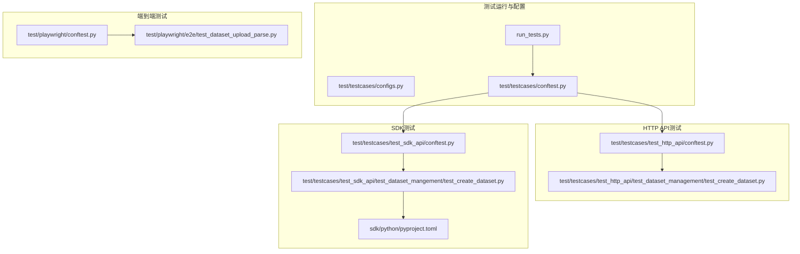
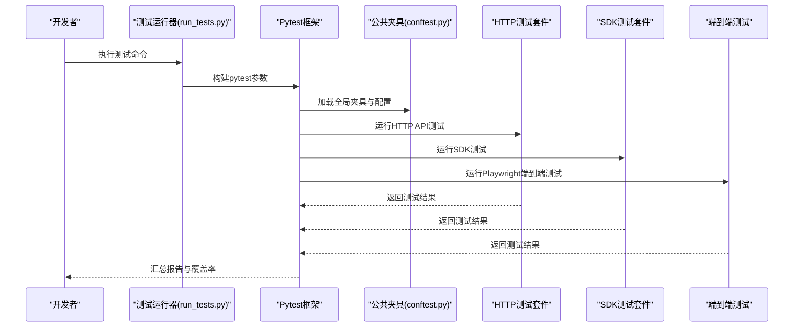
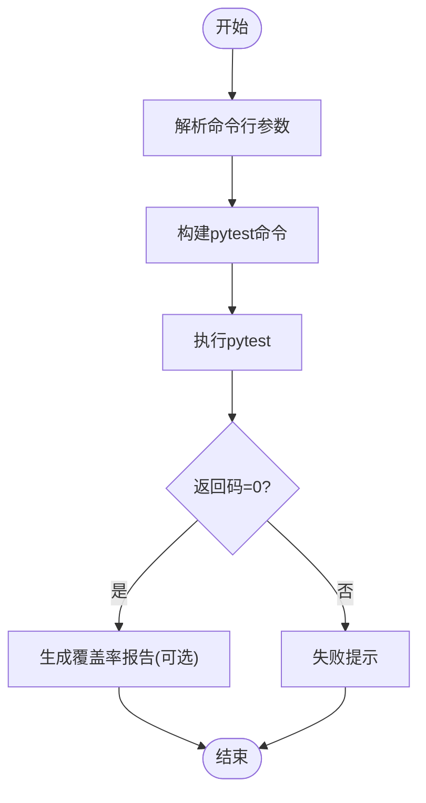
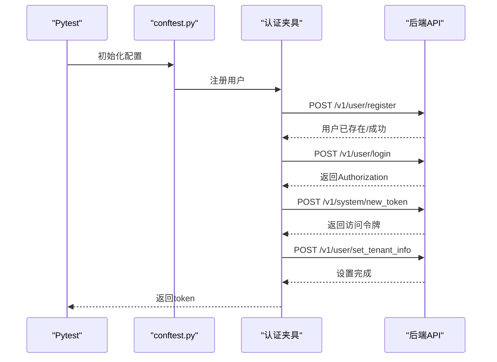
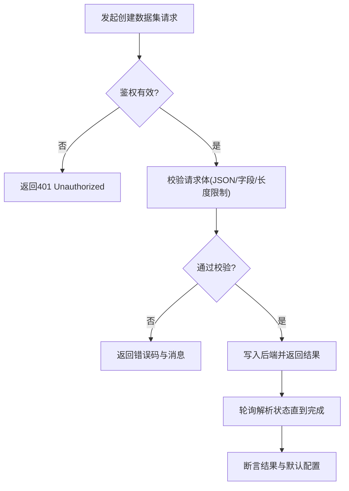
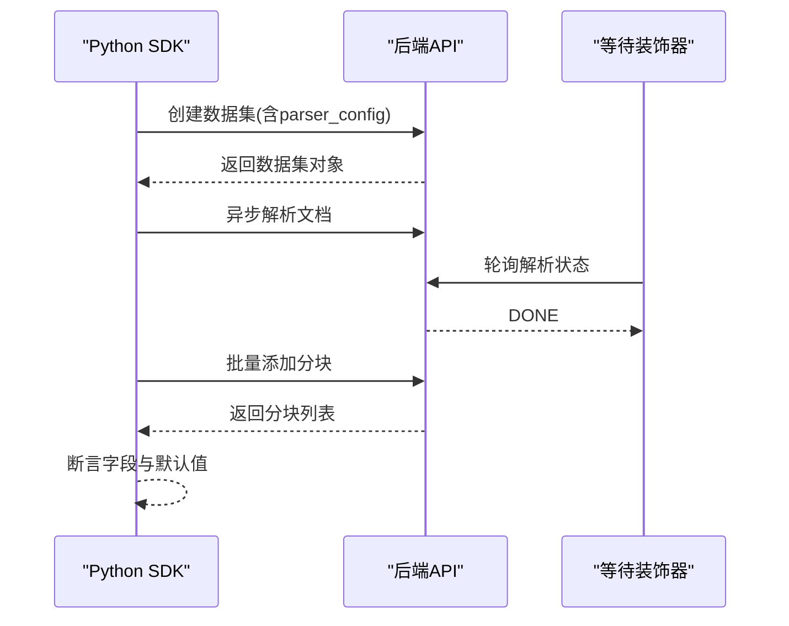
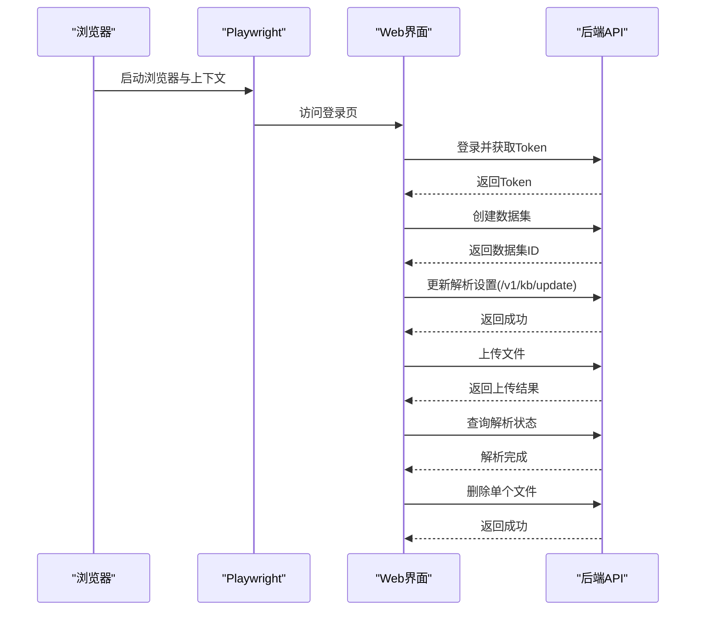
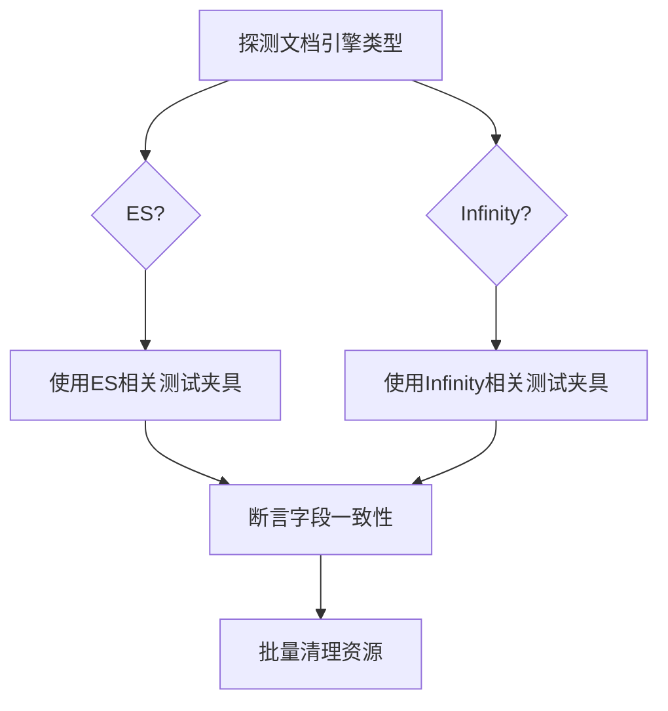
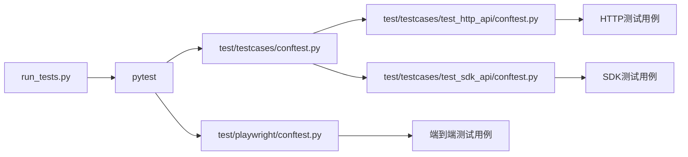

# 集成测试方案

<cite>
**本文档引用的文件**
- [test/README.md](file://test/README.md)
- [run_tests.py](file://run_tests.py)
- [test/testcases/conftest.py](file://test/testcases/conftest.py)
- [test/testcases/configs.py](file://test/testcases/configs.py)
- [test/testcases/test_http_api/conftest.py](file://test/testcases/test_http_api/conftest.py)
- [test/testcases/test_sdk_api/conftest.py](file://test/testcases/test_sdk_api/conftest.py)
- [test/testcases/test_http_api/test_dataset_management/test_create_dataset.py](file://test/testcases/test_http_api/test_dataset_management/test_create_dataset.py)
- [test/testcases/test_sdk_api/test_dataset_mangement/test_create_dataset.py](file://test/testcases/test_sdk_api/test_dataset_mangement/test_create_dataset.py)
- [test/playwright/conftest.py](file://test/playwright/conftest.py)
- [test/playwright/e2e/test_dataset_upload_parse.py](file://test/playwright/e2e/test_dataset_upload_parse.py)
- [test/testcases/libs/auth.py](file://test/testcases/libs/auth.py)
- [test/testcases/utils/engine_utils.py](file://test/testcases/utils/engine_utils.py)
- [sdk/python/pyproject.toml](file://sdk/python/pyproject.toml)
</cite>

## 目录
1. [引言](#引言)
2. [项目结构](#项目结构)
3. [核心组件](#核心组件)
4. [架构总览](#架构总览)
5. [详细组件分析](#详细组件分析)
6. [依赖关系分析](#依赖关系分析)
7. [性能考虑](#性能考虑)
8. [故障排查指南](#故障排查指南)
9. [结论](#结论)
10. [附录](#附录)

## 引言
本集成测试方案面向RAGFlow的端到端测试，覆盖测试环境搭建、测试数据准备、测试流程设计、API接口测试（RESTful API、WebSocket通信、MCP服务器）、数据库测试、SDK测试（Python SDK、JavaScript SDK）以及测试结果分析与质量保障方法。目标是帮助开发者建立完善的集成测试体系，确保各模块协同工作稳定可靠。

## 项目结构
RAGFlow的测试体系由多层构成：单元测试运行器、HTTP API测试套件、SDK测试套件、Playwright端到端测试、以及通用配置与工具模块。整体结构如下：

**图表来源**
- [run_tests.py:1-275](file://run_tests.py#L1-L275)
- [test/testcases/configs.py:1-70](file://test/testcases/configs.py#L1-L70)
- [test/testcases/conftest.py:1-232](file://test/testcases/conftest.py#L1-L232)
- [test/testcases/test_http_api/conftest.py:1-165](file://test/testcases/test_http_api/conftest.py#L1-L165)
- [test/testcases/test_sdk_api/conftest.py:1-178](file://test/testcases/test_sdk_api/conftest.py#L1-L178)
- [test/testcases/test_http_api/test_dataset_management/test_create_dataset.py:1-742](file://test/testcases/test_http_api/test_dataset_management/test_create_dataset.py#L1-L742)
- [test/testcases/test_sdk_api/test_dataset_mangement/test_create_dataset.py:1-698](file://test/testcases/test_sdk_api/test_dataset_mangement/test_create_dataset.py#L1-L698)
- [test/playwright/conftest.py:1-800](file://test/playwright/conftest.py#L1-L800)
- [test/playwright/e2e/test_dataset_upload_parse.py:1-743](file://test/playwright/e2e/test_dataset_upload_parse.py#L1-L743)
- [sdk/python/pyproject.toml:1-32](file://sdk/python/pyproject.toml#L1-L32)

**章节来源**
- [test/README.md:1-98](file://test/README.md#L1-L98)
- [run_tests.py:1-275](file://run_tests.py#L1-L275)
- [test/testcases/conftest.py:1-232](file://test/testcases/conftest.py#L1-L232)

## 核心组件
- 测试运行器：统一入口，支持并行执行、覆盖率统计、标记过滤等能力。
- 公共配置与夹具：提供认证、租户初始化、LLM模型注入、环境变量读取等。
- HTTP API测试：基于requests封装，覆盖数据集创建、上传解析、会话管理等场景。
- SDK测试：基于Python SDK，覆盖数据集、文档、分块、聊天助手等对象操作。
- 端到端测试：基于Playwright，模拟真实用户在Web界面中的上传、解析、删除流程。
- 工具与辅助：文档引擎探测、RSA加密、响应捕获、超时等待等。

**章节来源**
- [run_tests.py:34-190](file://run_tests.py#L34-L190)
- [test/testcases/conftest.py:98-232](file://test/testcases/conftest.py#L98-L232)
- [test/testcases/libs/auth.py:1-35](file://test/testcases/libs/auth.py#L1-L35)
- [test/testcases/utils/engine_utils.py:1-48](file://test/testcases/utils/engine_utils.py#L1-L48)

## 架构总览
下图展示了从测试运行器到具体测试用例的调用链路与数据流：

**图表来源**
- [run_tests.py:96-189](file://run_tests.py#L96-L189)
- [test/testcases/conftest.py:123-232](file://test/testcases/conftest.py#L123-L232)
- [test/testcases/test_http_api/conftest.py:84-165](file://test/testcases/test_http_api/conftest.py#L84-L165)
- [test/testcases/test_sdk_api/conftest.py:87-178](file://test/testcases/test_sdk_api/conftest.py#L87-L178)
- [test/playwright/conftest.py:687-750](file://test/playwright/conftest.py#L687-L750)

## 详细组件分析

### 测试环境搭建与运行器
- 支持并行执行（通过pytest-xdist）、覆盖率统计（HTML与终端报告）、标记过滤（p1/p2/p3）。
- 默认在test/unit_test目录下执行，可指定特定测试文件或目录。
- 提供彩色输出与中断处理，便于本地调试。

**图表来源**
- [run_tests.py:96-189](file://run_tests.py#L96-L189)

**章节来源**
- [run_tests.py:34-190](file://run_tests.py#L34-L190)

### 公共配置与认证夹具
- 通过环境变量HOST_ADDRESS、VERSION、ZHIPU_AI_API_KEY等控制测试行为。
- 自动注册/登录，生成Authorization Token，并设置租户信息与默认模型。
- 提供HTTP/Web认证适配器，统一请求头注入。

**图表来源**
- [test/testcases/conftest.py:130-232](file://test/testcases/conftest.py#L130-L232)
- [test/testcases/libs/auth.py:19-35](file://test/testcases/libs/auth.py#L19-L35)

**章节来源**
- [test/testcases/configs.py:16-31](file://test/testcases/configs.py#L16-L31)
- [test/testcases/conftest.py:98-232](file://test/testcases/conftest.py#L98-L232)
- [test/testcases/libs/auth.py:1-35](file://test/testcases/libs/auth.py#L1-L35)

### HTTP API测试策略
- 使用RAGFlowHttpApiAuth统一注入Authorization头。
- 基于装饰器wait_for实现异步任务轮询（如文档解析完成）。
- 覆盖数据集创建的鉴权、请求体校验、并发压力、边界值与异常路径。
- 支持多种文件类型上传与批量清理资源。

**图表来源**
- [test/testcases/test_http_api/conftest.py:46-56](file://test/testcases/test_http_api/conftest.py#L46-L56)
- [test/testcases/test_http_api/test_dataset_management/test_create_dataset.py:29-121](file://test/testcases/test_http_api/test_dataset_management/test_create_dataset.py#L29-L121)

**章节来源**
- [test/testcases/test_http_api/conftest.py:1-165](file://test/testcases/test_http_api/conftest.py#L1-L165)
- [test/testcases/test_http_api/test_dataset_management/test_create_dataset.py:1-742](file://test/testcases/test_http_api/test_dataset_management/test_create_dataset.py#L1-L742)

### SDK测试策略（Python）
- 基于RAGFlow客户端，自动注入base_url与版本号。
- 通过DataSet/Document/Chunk等对象进行链式操作，支持并发与批量。
- 与HTTP测试保持一致的断言策略与边界条件覆盖。

**图表来源**
- [test/testcases/test_sdk_api/conftest.py:49-61](file://test/testcases/test_sdk_api/conftest.py#L49-L61)
- [test/testcases/test_sdk_api/test_dataset_mangement/test_create_dataset.py:67-120](file://test/testcases/test_sdk_api/test_dataset_mangement/test_create_dataset.py#L67-L120)

**章节来源**
- [test/testcases/test_sdk_api/conftest.py:1-178](file://test/testcases/test_sdk_api/conftest.py#L1-L178)
- [test/testcases/test_sdk_api/test_dataset_mangement/test_create_dataset.py:1-698](file://test/testcases/test_sdk_api/test_dataset_mangement/test_create_dataset.py#L1-L698)
- [sdk/python/pyproject.toml:26-32](file://sdk/python/pyproject.toml#L26-L32)

### 端到端测试（Playwright）
- 登录、创建数据集、设置解析参数、上传文件、等待解析完成、删除文件。
- 通过响应捕获断言关键请求负载（如/kb/update），确保设置正确下发。
- 提供步骤化流程与快照，便于问题定位与回归。

**图表来源**
- [test/playwright/conftest.py:687-750](file://test/playwright/conftest.py#L687-L750)
- [test/playwright/e2e/test_dataset_upload_parse.py:210-579](file://test/playwright/e2e/test_dataset_upload_parse.py#L210-L579)

**章节来源**
- [test/playwright/conftest.py:1-800](file://test/playwright/conftest.py#L1-L800)
- [test/playwright/e2e/test_dataset_upload_parse.py:1-743](file://test/playwright/e2e/test_dataset_upload_parse.py#L1-L743)

### 数据库测试实施方案
- 连接测试：通过engine_utils探测当前文档引擎类型（Elasticsearch/Infinity），避免硬编码差异。
- 事务处理测试：在HTTP/Sdk测试中，利用批量创建与清理夹具，验证幂等性与回滚语义。
- 数据一致性验证：对比SDK与HTTP API返回的对象字段，确保跨客户端一致性；对解析后的文档与分块数量进行断言。

**图表来源**
- [test/testcases/utils/engine_utils.py:22-48](file://test/testcases/utils/engine_utils.py#L22-L48)
- [test/testcases/test_http_api/conftest.py:84-165](file://test/testcases/test_http_api/conftest.py#L84-L165)
- [test/testcases/test_sdk_api/conftest.py:122-178](file://test/testcases/test_sdk_api/conftest.py#L122-L178)

**章节来源**
- [test/testcases/utils/engine_utils.py:1-48](file://test/testcases/utils/engine_utils.py#L1-L48)
- [test/testcases/test_http_api/conftest.py:1-165](file://test/testcases/test_http_api/conftest.py#L1-L165)
- [test/testcases/test_sdk_api/conftest.py:1-178](file://test/testcases/test_sdk_api/conftest.py#L1-L178)

### WebSocket与MCP服务器测试
- 当前仓库未发现直接的WebSocket与MCP服务器测试用例。
- 建议策略：基于现有HTTP/Sdk测试模式扩展，增加连接握手、消息收发、错误重连等场景；结合MCP工具调用链路进行端到端验证。

[本节为概念性建议，不直接分析具体文件，故无“章节来源”]

## 依赖关系分析
- 测试运行器依赖pytest及其插件（并行、覆盖率）。
- 公共夹具依赖requests与环境变量，负责认证与租户初始化。
- HTTP/Sdk测试依赖公共夹具提供的token与默认模型配置。
- 端到端测试依赖Playwright与浏览器驱动，同时依赖后端API的可用性。

**图表来源**
- [run_tests.py:96-189](file://run_tests.py#L96-L189)
- [test/testcases/conftest.py:123-232](file://test/testcases/conftest.py#L123-L232)
- [test/testcases/test_http_api/conftest.py:84-165](file://test/testcases/test_http_api/conftest.py#L84-L165)
- [test/testcases/test_sdk_api/conftest.py:87-178](file://test/testcases/test_sdk_api/conftest.py#L87-L178)
- [test/playwright/conftest.py:687-750](file://test/playwright/conftest.py#L687-L750)

**章节来源**
- [run_tests.py:96-189](file://run_tests.py#L96-L189)
- [test/testcases/conftest.py:123-232](file://test/testcases/conftest.py#L123-L232)

## 性能考虑
- 并行执行：使用pytest-xdist提升吞吐，注意共享资源竞争与限流。
- 覆盖率：开启HTML与终端报告，定位热点路径与未覆盖分支。
- 超时与重试：对异步任务（解析、索引）采用指数退避与最大重试次数。
- 资源清理：批量删除数据集、文档、会话，避免磁盘与内存泄漏。

[本节提供通用指导，不直接分析具体文件，故无“章节来源”]

## 故障排查指南
- 环境变量缺失：检查HOST_ADDRESS、ZHIPU_AI_API_KEY等是否正确设置。
- 认证失败：确认登录流程与Token刷新逻辑，关注401/403错误。
- 文档引擎差异：通过engine_utils探测当前引擎类型，切换对应测试夹具。
- 端到端失败：启用PW_TRACE与网络日志，捕获关键请求负载与页面错误。

**章节来源**
- [test/testcases/configs.py:16-31](file://test/testcases/configs.py#L16-L31)
- [test/testcases/conftest.py:130-232](file://test/testcases/conftest.py#L130-L232)
- [test/testcases/utils/engine_utils.py:22-48](file://test/testcases/utils/engine_utils.py#L22-L48)
- [test/playwright/conftest.py:730-750](file://test/playwright/conftest.py#L730-L750)

## 结论
通过统一的测试运行器、标准化的夹具与断言策略、覆盖HTTP/Sdk/E2E的多层测试，RAGFlow能够系统性地验证端到端功能与稳定性。建议持续完善WebSocket与MCP测试，强化数据库一致性与性能指标监控，以形成闭环的质量保障体系。

## 附录
- 快速开始：参考test/README.md中的部署与运行说明。
- 标记等级：p1（冒烟）、p2（核心）、p3（全量）用于控制测试规模与优先级。
- 数据引擎：支持Elasticsearch与Infinity，可通过环境变量切换。

**章节来源**
- [test/README.md:1-98](file://test/README.md#L1-L98)
- [test/testcases/conftest.py:98-112](file://test/testcases/conftest.py#L98-L112)