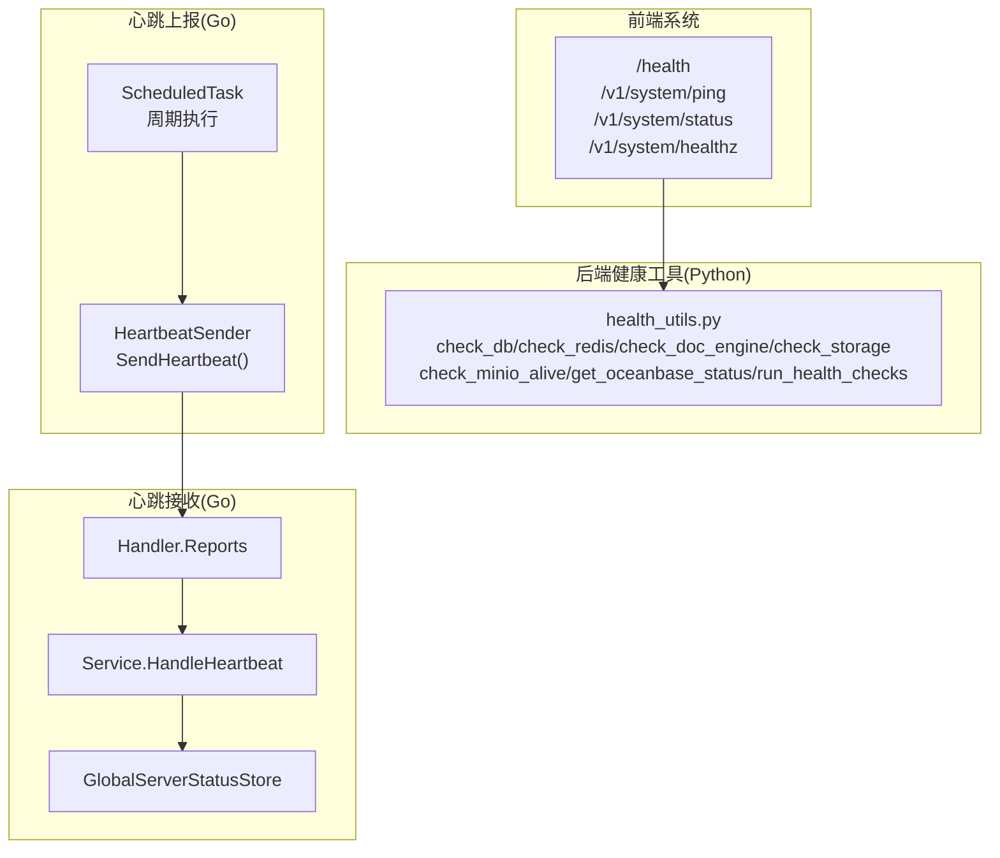
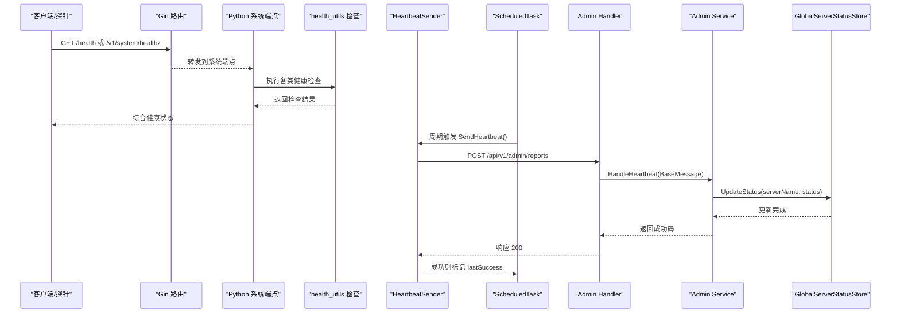
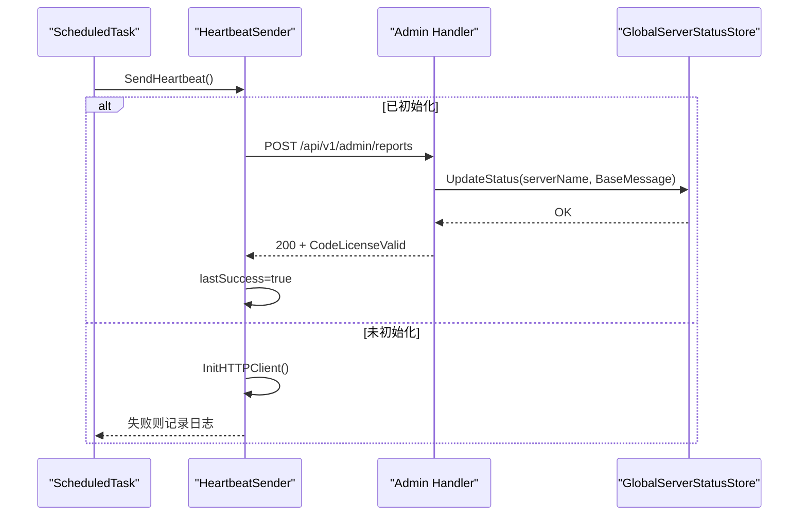
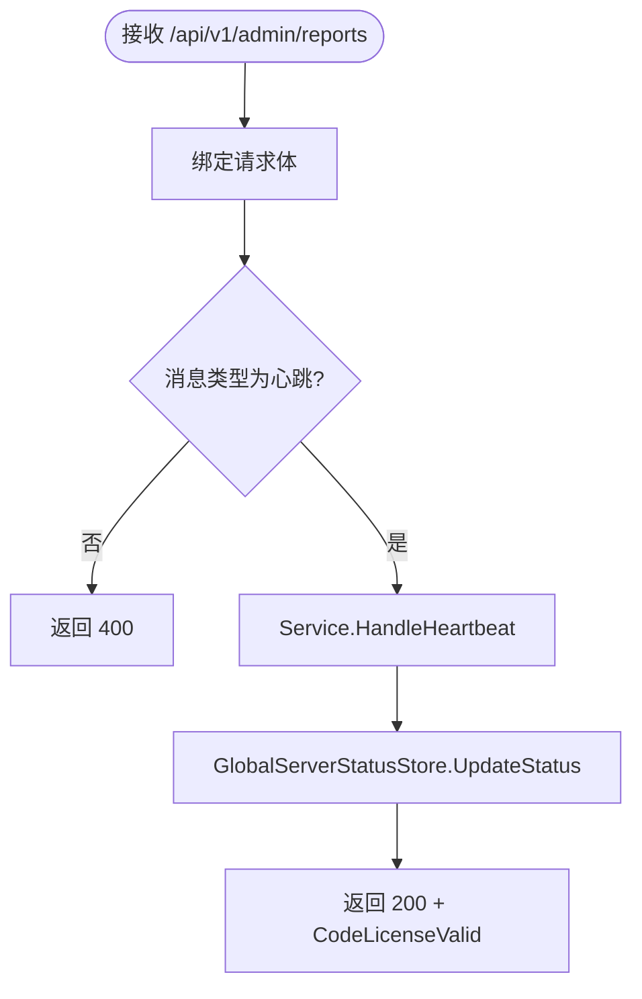
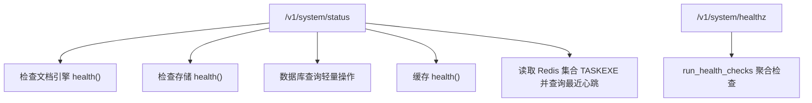
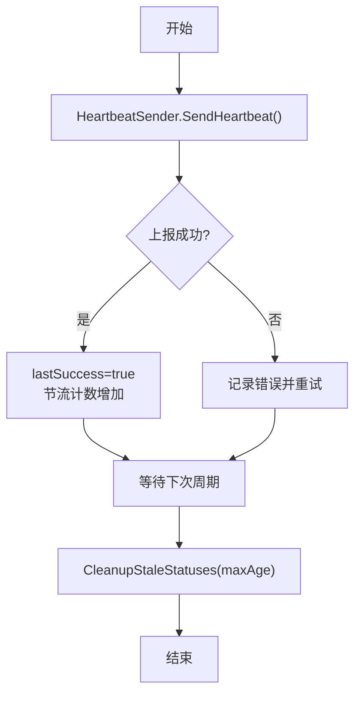
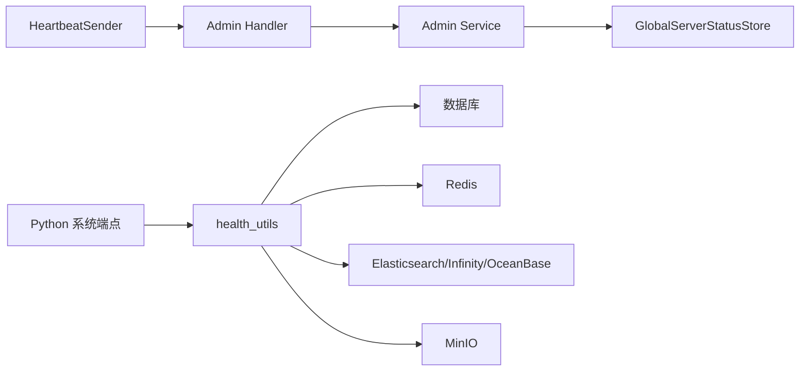

# 健康检查

<cite>
**本文引用的文件**
- [internal/service/heartbeat_sender.go](file://internal/service/heartbeat_sender.go)
- [internal/admin/handler.go](file://internal/admin/handler.go)
- [internal/admin/service.go](file://internal/admin/service.go)
- [internal/admin/heartbeat.go](file://internal/admin/heartbeat.go)
- [cmd/server_main.go](file://cmd/server_main.go)
- [api/apps/system_app.py](file://api/apps/system_app.py)
- [api/utils/health_utils.py](file://api/utils/health_utils.py)
- [internal/utility/scheduled_task.go](file://internal/utility/scheduled_task.go)
- [internal/router/router.go](file://internal/router/router.go)
</cite>

## 目录
1. [简介](#简介)
2. [项目结构](#项目结构)
3. [核心组件](#核心组件)
4. [架构总览](#架构总览)
5. [详细组件分析](#详细组件分析)
6. [依赖关系分析](#依赖关系分析)
7. [性能考量](#性能考量)
8. [故障排查指南](#故障排查指南)
9. [结论](#结论)
10. [附录：配置与扩展指南](#附录配置与扩展指南)

## 简介
本文件面向 RAGFlow 的健康检查体系，系统化阐述其设计原理与实现细节，覆盖服务可用性检测、依赖服务监控、自动故障转移（基于心跳与状态清理）等核心能力；并提供 HTTP 端点检查、数据库连接检查、存储服务检查、第三方 API 连通性检查等多类检查机制说明，以及心跳检测的发送、超时处理与状态恢复流程。最后给出配置建议与扩展方法，帮助读者在生产环境中稳定落地健康检查。

## 项目结构
RAGFlow 的健康检查由“前端系统端点”“后端健康工具函数”“心跳上报与接收”“定时任务调度”四部分协同构成：
- 前端系统端点：提供 /health、/v1/system/ping、/v1/system/status、/v1/system/healthz 等健康检查接口
- 后端健康工具：Python 层 health_utils 提供数据库、缓存、文档引擎、对象存储、MinIO、OceanBase 等检查
- 心跳上报与接收：Go 层 HeartbeatSender 定时向管理端上报心跳，管理端 Handler/Service 接收并维护全局状态
- 定时任务调度：Go 层 ScheduledTask 提供周期任务框架，用于心跳发送与状态上报

图表来源
- [internal/router/router.go:80-85](file://internal/router/router.go#L80-L85)
- [api/apps/system_app.py:174-177](file://api/apps/system_app.py#L174-L177)
- [api/utils/health_utils.py:329-365](file://api/utils/health_utils.py#L329-L365)
- [internal/service/heartbeat_sender.go:79-143](file://internal/service/heartbeat_sender.go#L79-L143)
- [internal/utility/scheduled_task.go:99-122](file://internal/utility/scheduled_task.go#L99-L122)
- [internal/admin/handler.go:1109-1142](file://internal/admin/handler.go#L1109-L1142)
- [internal/admin/service.go:1571-1586](file://internal/admin/service.go#L1571-L1586)
- [internal/admin/heartbeat.go:9-77](file://internal/admin/heartbeat.go#L9-L77)

章节来源
- [internal/router/router.go:80-85](file://internal/router/router.go#L80-L85)
- [api/apps/system_app.py:174-177](file://api/apps/system_app.py#L174-L177)
- [api/utils/health_utils.py:329-365](file://api/utils/health_utils.py#L329-L365)
- [internal/service/heartbeat_sender.go:79-143](file://internal/service/heartbeat_sender.go#L79-L143)
- [internal/utility/scheduled_task.go:99-122](file://internal/utility/scheduled_task.go#L99-L122)
- [internal/admin/handler.go:1109-1142](file://internal/admin/handler.go#L1109-L1142)
- [internal/admin/service.go:1571-1586](file://internal/admin/service.go#L1571-L1586)
- [internal/admin/heartbeat.go:9-77](file://internal/admin/heartbeat.go#L9-L77)

## 核心组件
- 健康检查端点
  - /health：轻量级存活探测
  - /v1/system/ping：应用层可达性探测
  - /v1/system/status：综合依赖检查（文档引擎、存储、数据库、缓存、任务执行器心跳）
  - /v1/system/healthz：聚合健康检查，返回整体状态
- 健康检查工具（Python）
  - 数据库/缓存/文档引擎/存储：轻量查询或健康接口调用
  - MinIO：访问 /minio/health/live
  - OceanBase：获取健康与性能指标并判定健康状态
  - 任务执行器心跳：从 Redis 集合读取最近心跳记录
- 心跳上报（Go）
  - HeartbeatSender：构造心跳消息并上报至管理端 /api/v1/admin/reports
  - ScheduledTask：周期调度心跳发送
- 心跳接收与状态管理（Go）
  - Handler.Reports：接收心跳并校验消息类型
  - Service.HandleHeartbeat：更新全局状态存储
  - GlobalServerStatusStore：线程安全的状态存储与过期清理

章节来源
- [internal/router/router.go:80-85](file://internal/router/router.go#L80-L85)
- [api/apps/system_app.py:112-171](file://api/apps/system_app.py#L112-L171)
- [api/utils/health_utils.py:34-365](file://api/utils/health_utils.py#L34-L365)
- [internal/service/heartbeat_sender.go:79-143](file://internal/service/heartbeat_sender.go#L79-L143)
- [internal/utility/scheduled_task.go:99-122](file://internal/utility/scheduled_task.go#L99-L122)
- [internal/admin/handler.go:1109-1142](file://internal/admin/handler.go#L1109-L1142)
- [internal/admin/service.go:1571-1586](file://internal/admin/service.go#L1571-L1586)
- [internal/admin/heartbeat.go:9-77](file://internal/admin/heartbeat.go#L9-L77)

## 架构总览
下图展示健康检查从“请求入口”到“状态持久化”的全链路：

图表来源
- [internal/router/router.go:80-85](file://internal/router/router.go#L80-L85)
- [api/apps/system_app.py:174-177](file://api/apps/system_app.py#L174-L177)
- [api/utils/health_utils.py:329-365](file://api/utils/health_utils.py#L329-L365)
- [internal/service/heartbeat_sender.go:79-143](file://internal/service/heartbeat_sender.go#L79-L143)
- [internal/utility/scheduled_task.go:99-122](file://internal/utility/scheduled_task.go#L99-L122)
- [internal/admin/handler.go:1109-1142](file://internal/admin/handler.go#L1109-L1142)
- [internal/admin/service.go:1571-1586](file://internal/admin/service.go#L1571-L1586)
- [internal/admin/heartbeat.go:20-33](file://internal/admin/heartbeat.go#L20-L33)

## 详细组件分析

### 心跳发送与上报（Go）
- 角色与职责
  - HeartbeatSender：封装心跳消息字段（服务名、类型、主机、端口、版本、时间戳），序列化后通过 HTTP 客户端 POST 到管理端
  - ScheduledTask：以固定间隔触发 SendHeartbeat，避免重复执行与并发冲突
- 关键行为
  - 首次或配置变更时初始化 HTTP 客户端（含超时）
  - 若上次上报成功且未超过尝试阈值，则跳过本次上报
  - 上报成功后更新内部状态，用于节流控制
- 错误处理
  - 初始化失败、网络错误、响应非 200、响应码非许可码均视为失败并记录日志

图表来源
- [internal/service/heartbeat_sender.go:79-143](file://internal/service/heartbeat_sender.go#L79-L143)
- [internal/admin/handler.go:1109-1142](file://internal/admin/handler.go#L1109-L1142)
- [internal/admin/service.go:1571-1586](file://internal/admin/service.go#L1571-L1586)
- [internal/admin/heartbeat.go:20-33](file://internal/admin/heartbeat.go#L20-L33)
- [internal/utility/scheduled_task.go:99-122](file://internal/utility/scheduled_task.go#L99-L122)

章节来源
- [internal/service/heartbeat_sender.go:79-143](file://internal/service/heartbeat_sender.go#L79-L143)
- [internal/utility/scheduled_task.go:99-122](file://internal/utility/scheduled_task.go#L99-L122)
- [cmd/server_main.go:240-261](file://cmd/server_main.go#L240-L261)

### 心跳接收与状态管理（Go）
- Handler.Reports
  - 校验请求体与消息类型（仅支持心跳）
  - 设置默认时间戳
  - 调用 Service.HandleHeartbeat 并按返回码响应
- Service.HandleHeartbeat
  - 将心跳消息写入全局状态存储 GlobalServerStatusStore
- GlobalServerStatusStore
  - 支持按类型筛选、移除、清理过期状态
  - 清理策略：根据最大年龄过滤长时间未上报的服务

图表来源
- [internal/admin/handler.go:1109-1142](file://internal/admin/handler.go#L1109-L1142)
- [internal/admin/service.go:1571-1586](file://internal/admin/service.go#L1571-L1586)
- [internal/admin/heartbeat.go:20-33](file://internal/admin/heartbeat.go#L20-L33)

章节来源
- [internal/admin/handler.go:1109-1142](file://internal/admin/handler.go#L1109-L1142)
- [internal/admin/service.go:1571-1586](file://internal/admin/service.go#L1571-L1586)
- [internal/admin/heartbeat.go:66-76](file://internal/admin/heartbeat.go#L66-L76)

### 健康检查端点与工具（Python）
- 端点
  - /v1/system/status：对文档引擎、存储、数据库、缓存进行检查，并收集任务执行器心跳
  - /v1/system/healthz：聚合检查结果，返回整体状态
- 健康工具
  - 数据库/缓存/文档引擎/存储：轻量查询或健康接口调用
  - MinIO：访问 /minio/health/live，支持 http/https 与证书验证开关
  - OceanBase：组合健康信息与性能指标，按延迟阈值判定健康/降级
  - 任务执行器心跳：从 Redis 集合 TASKEXE 读取各执行器最近心跳记录

图表来源
- [api/apps/system_app.py:112-171](file://api/apps/system_app.py#L112-L171)
- [api/utils/health_utils.py:329-365](file://api/utils/health_utils.py#L329-L365)
- [api/utils/health_utils.py:256-275](file://api/utils/health_utils.py#L256-L275)
- [api/utils/health_utils.py:136-216](file://api/utils/health_utils.py#L136-L216)
- [api/utils/health_utils.py:308-327](file://api/utils/health_utils.py#L308-L327)

章节来源
- [api/apps/system_app.py:112-171](file://api/apps/system_app.py#L112-L171)
- [api/utils/health_utils.py:329-365](file://api/utils/health_utils.py#L329-L365)
- [api/utils/health_utils.py:256-275](file://api/utils/health_utils.py#L256-L275)
- [api/utils/health_utils.py:136-216](file://api/utils/health_utils.py#L136-L216)
- [api/utils/health_utils.py:308-327](file://api/utils/health_utils.py#L308-L327)

### HTTP 端点检查
- /health：快速存活探测，返回简单状态
- /v1/system/ping：应用层可达性探测
- /v1/system/healthz：聚合健康检查，按检查结果返回 200 或 500

章节来源
- [internal/router/router.go:80-85](file://internal/router/router.go#L80-L85)
- [api/apps/system_app.py:174-182](file://api/apps/system_app.py#L174-L182)
- [api/apps/system_app.py:174-177](file://api/apps/system_app.py#L174-L177)

### 数据库连接检查
- Go 层：通过 SQL 执行轻量查询（如 SELECT 1）判断连接可用性
- Python 层：通过数据库连接执行轻量查询并统计耗时

章节来源
- [internal/admin/service.go:1032-1064](file://internal/admin/service.go#L1032-L1064)
- [api/apps/system_app.py:128-142](file://api/apps/system_app.py#L128-L142)
- [api/utils/health_utils.py:34-42](file://api/utils/health_utils.py#L34-L42)

### 存储服务检查
- 文档引擎（Elasticsearch/Infinity/OceanBase）：调用各自 health 接口
- 对象存储（MinIO）：访问 /minio/health/live，支持 http/https 与证书验证
- OceanBase：返回健康与性能指标，按阈值判定健康/降级

章节来源
- [api/apps/system_app.py:102-127](file://api/apps/system_app.py#L102-L127)
- [api/utils/health_utils.py:72-101](file://api/utils/health_utils.py#L72-L101)
- [api/utils/health_utils.py:256-275](file://api/utils/health_utils.py#L256-L275)
- [api/utils/health_utils.py:136-216](file://api/utils/health_utils.py#L136-L216)

### 第三方 API 连通性检查
- RAGFlow 服务自身：通过本地 HTTP 请求 /v1/system/ping 进行可达性检查
- MinIO：通过 /minio/health/live 检查第三方对象存储服务连通性

章节来源
- [api/utils/health_utils.py:290-306](file://api/utils/health_utils.py#L290-L306)
- [api/utils/health_utils.py:256-275](file://api/utils/health_utils.py#L256-L275)

### 心跳检测与超时处理
- 发送侧节流：连续成功后进行计数节流，降低上报频率
- 接收侧清理：按最大年龄清理长时间未上报的服务，避免脏数据堆积
- 状态恢复：当心跳持续到达时，状态被刷新；若清理后仍无心跳，状态视为过期

图表来源
- [internal/service/heartbeat_sender.go:82-88](file://internal/service/heartbeat_sender.go#L82-L88)
- [internal/admin/heartbeat.go:66-76](file://internal/admin/heartbeat.go#L66-L76)

章节来源
- [internal/service/heartbeat_sender.go:82-88](file://internal/service/heartbeat_sender.go#L82-L88)
- [internal/admin/heartbeat.go:66-76](file://internal/admin/heartbeat.go#L66-L76)

## 依赖关系分析
- 组件耦合
  - 心跳发送依赖管理端配置与 HTTP 客户端构建
  - 心跳接收依赖全局状态存储，提供按类型筛选与清理能力
  - 系统端点依赖健康工具函数，后者依赖数据库、缓存、存储等外部组件
- 外部依赖
  - 管理端：接收心跳并维护全局状态
  - 文档引擎：Elasticsearch/Infinity/OceanBase
  - 存储：MinIO、对象存储实现
  - 缓存：Redis

图表来源
- [internal/service/heartbeat_sender.go:79-143](file://internal/service/heartbeat_sender.go#L79-L143)
- [internal/admin/handler.go:1109-1142](file://internal/admin/handler.go#L1109-L1142)
- [internal/admin/service.go:1571-1586](file://internal/admin/service.go#L1571-L1586)
- [internal/admin/heartbeat.go:9-77](file://internal/admin/heartbeat.go#L9-L77)
- [api/apps/system_app.py:112-171](file://api/apps/system_app.py#L112-L171)
- [api/utils/health_utils.py:329-365](file://api/utils/health_utils.py#L329-L365)

章节来源
- [internal/service/heartbeat_sender.go:79-143](file://internal/service/heartbeat_sender.go#L79-L143)
- [internal/admin/handler.go:1109-1142](file://internal/admin/handler.go#L1109-L1142)
- [internal/admin/service.go:1571-1586](file://internal/admin/service.go#L1571-L1586)
- [internal/admin/heartbeat.go:9-77](file://internal/admin/heartbeat.go#L9-L77)
- [api/apps/system_app.py:112-171](file://api/apps/system_app.py#L112-L171)
- [api/utils/health_utils.py:329-365](file://api/utils/health_utils.py#L329-L365)

## 性能考量
- 心跳节流：成功后进行计数节流，减少管理端压力与网络开销
- 超时控制：心跳与健康检查均设置合理超时，避免阻塞
- 聚合检查：/v1/system/healthz 聚合多项检查，统一返回，便于探针快速判断
- 清理策略：定期清理过期心跳，避免状态表膨胀

## 故障排查指南
- 心跳上报失败
  - 检查管理端配置是否正确（主机、端口、超时）
  - 查看心跳发送日志，确认是否初始化失败或网络错误
  - 确认管理端 Handler 是否正确处理心跳消息类型
- 管理端无心跳
  - 检查 GlobalServerStatusStore 是否存在对应服务条目
  - 使用清理策略（按最大年龄）确认是否被清理
- 健康检查异常
  - /v1/system/status：逐项检查文档引擎、存储、数据库、缓存
  - /v1/system/healthz：关注聚合状态与元信息中的错误详情
  - MinIO：确认 scheme 与证书验证配置
  - OceanBase：关注延迟与连接池指标

章节来源
- [internal/service/heartbeat_sender.go:91-96](file://internal/service/heartbeat_sender.go#L91-L96)
- [internal/admin/handler.go:1125-1132](file://internal/admin/handler.go#L1125-L1132)
- [internal/admin/heartbeat.go:66-76](file://internal/admin/heartbeat.go#L66-L76)
- [api/apps/system_app.py:112-171](file://api/apps/system_app.py#L112-L171)
- [api/utils/health_utils.py:256-275](file://api/utils/health_utils.py#L256-L275)
- [api/utils/health_utils.py:136-216](file://api/utils/health_utils.py#L136-L216)

## 结论
RAGFlow 的健康检查体系通过“端点检查 + 心跳上报 + 状态管理 + 定时清理”的组合，实现了对服务可用性、依赖服务与第三方 API 的全面监控。心跳机制提供了服务状态的实时反馈与恢复检测，配合健康端点与工具函数，可满足生产环境的可观测性需求。建议结合业务 SLA 设定检查间隔与阈值，并在管理端启用定期清理策略以维持状态表健康。

## 附录：配置与扩展指南

### 健康检查配置要点
- 检查间隔
  - 心跳上报：建议 3 秒（已内置），可根据负载调整
  - 其他健康检查：/v1/system/healthz 为一次性聚合检查，适合探针周期性拉取
- 失败阈值与告警
  - 心跳失败：可通过管理端状态与清理策略感知；建议在探针侧设置失败次数阈值并触发告警
  - 健康端点：/v1/system/healthz 在整体不健康时返回 500，可用于探针告警
- MinIO 与证书
  - 通过配置项控制 scheme 与证书验证，确保在自签证书场景下的连通性

章节来源
- [cmd/server_main.go:251-259](file://cmd/server_main.go#L251-L259)
- [api/utils/health_utils.py:236-253](file://api/utils/health_utils.py#L236-L253)
- [api/apps/system_app.py:174-177](file://api/apps/system_app.py#L174-L177)

### 扩展方法
- 添加新的健康检查项
  - 在 Python 端新增检查函数，遵循现有模式（捕获异常、返回状态与耗时/错误信息）
  - 在 /v1/system/status 或 /v1/system/healthz 中集成新检查
- 自定义心跳上报
  - 可复用 HeartbeatSender 与 ScheduledTask，按需修改上报内容与周期
  - 如需上报其他类型报告，可在 Handler 中扩展消息类型校验与处理逻辑
- 处理复杂依赖关系
  - 将依赖链路拆分为多个独立检查项，分别上报与告警
  - 使用 GlobalServerStatusStore 的按类型筛选能力，分组监控与告警

章节来源
- [api/utils/health_utils.py:329-365](file://api/utils/health_utils.py#L329-L365)
- [internal/service/heartbeat_sender.go:79-143](file://internal/service/heartbeat_sender.go#L79-L143)
- [internal/admin/heartbeat.go:46-57](file://internal/admin/heartbeat.go#L46-L57)