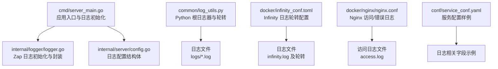
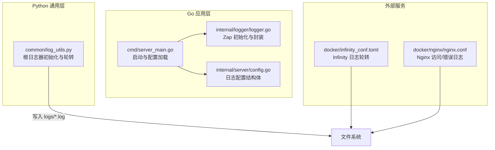
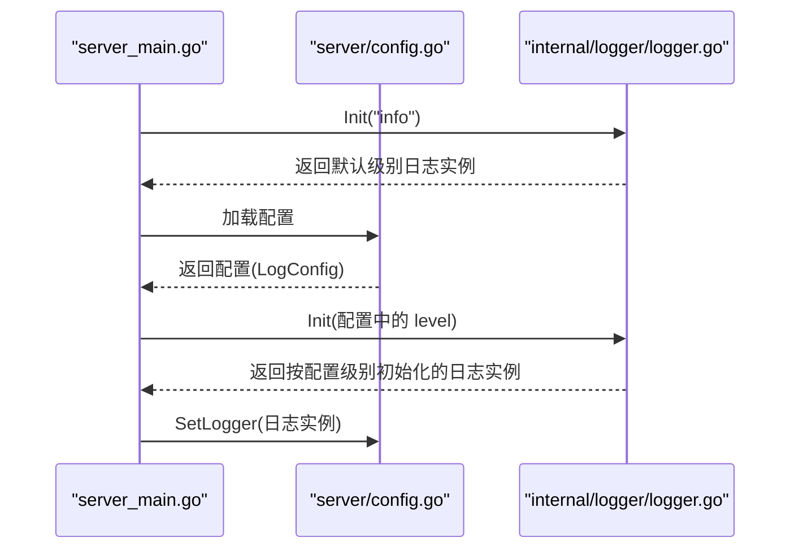
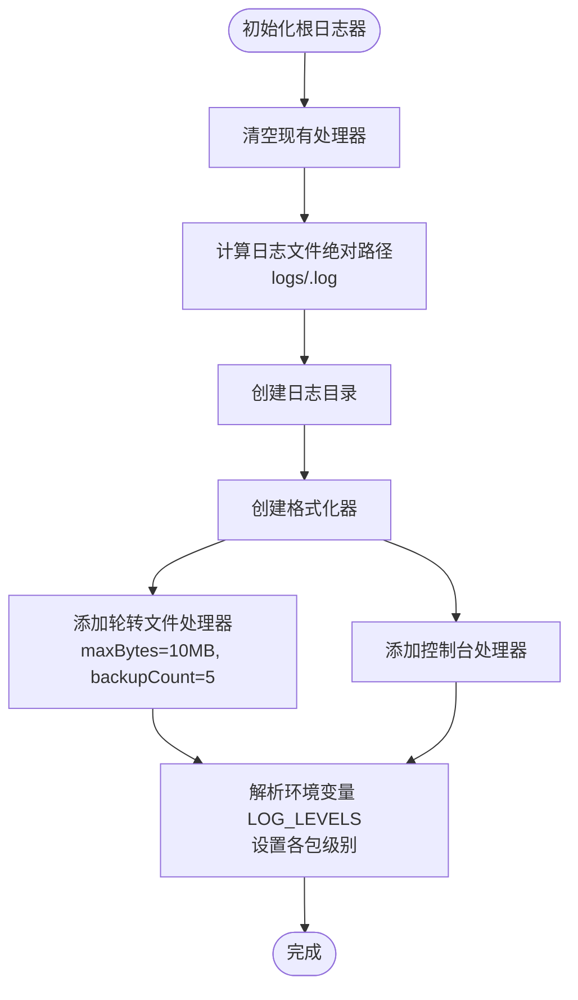
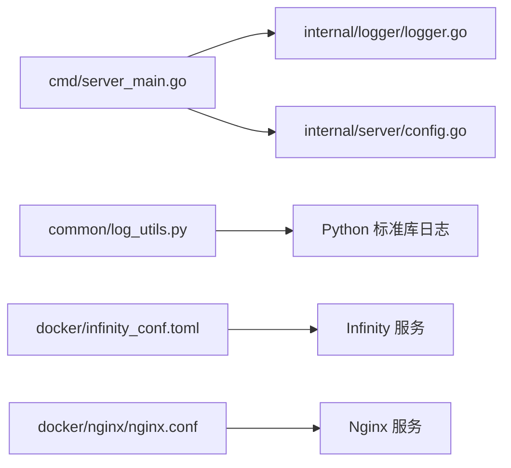

# 日志管理

<cite>
**本文引用的文件**   
- [internal/logger/logger.go](file://internal/logger/logger.go)
- [internal/server/config.go](file://internal/server/config.go)
- [cmd/server_main.go](file://cmd/server_main.go)
- [common/log_utils.py](file://common/log_utils.py)
- [docker/infinity_conf.toml](file://docker/infinity_conf.toml)
- [docker/nginx/nginx.conf](file://docker/nginx/nginx.conf)
- [internal/logger/README.md](file://internal/logger/README.md)
- [conf/service_conf.yaml](file://conf/service_conf.yaml)
</cite>

## 目录
1. [简介](#简介)
2. [项目结构](#项目结构)
3. [核心组件](#核心组件)
4. [架构总览](#架构总览)
5. [详细组件分析](#详细组件分析)
6. [依赖分析](#依赖分析)
7. [性能考虑](#性能考虑)
8. [故障排查指南](#故障排查指南)
9. [结论](#结论)
10. [附录](#附录)

## 简介
本文件为 RAGFlow 的日志管理系统提供全面技术文档，覆盖以下主题：
- 日志系统架构与实现：以 Go 侧的 Zap 结构化日志为核心，结合 Python 标准库日志的轮转能力，形成统一的日志输出与归档体系。
- 日志级别与输出格式：Go 侧支持 debug/info/warn/error/fatal 级别与自定义编码器；Python 侧支持按大小轮转与多处理器输出。
- 日志轮转策略：按大小轮转、备份数量控制、标准输出与文件并行输出。
- 分布式追踪与链路关联：通过请求级标识（如 webhook_id）在跨服务场景中进行日志关联与检索。
- 最佳实践：生产环境日志级别、敏感信息处理、性能优化建议。
- 查询与分析：与 ELK、Nginx 访问日志、Prometheus 指标采集的集成思路。

## 项目结构
RAGFlow 的日志相关代码主要分布在如下位置：
- Go 后端日志：internal/logger/logger.go 提供 Zap 日志初始化与封装；cmd/server_main.go 在启动阶段完成日志初始化与级别重设；internal/server/config.go 定义日志配置结构体。
- Python 前端与通用日志：common/log_utils.py 提供 Python 根日志器初始化、按大小轮转与包级别日志等级控制。
- 外部服务日志：docker/infinity_conf.toml 展示了 Infinity 引擎的日志轮转配置；docker/nginx/nginx.conf 展示了 Nginx 访问/错误日志配置。
- 文档与参考：internal/logger/README.md 提供使用说明与级别说明；conf/service_conf.yaml 提供服务配置样例（含日志相关字段）。

**图表来源**
- [cmd/server_main.go:56-96](file://cmd/server_main.go#L56-L96)
- [internal/logger/logger.go:32-86](file://internal/logger/logger.go#L32-L86)
- [internal/server/config.go:108-112](file://internal/server/config.go#L108-L112)
- [common/log_utils.py:25-73](file://common/log_utils.py#L25-L73)
- [docker/infinity_conf.toml:12-21](file://docker/infinity_conf.toml#L12-L21)
- [docker/nginx/nginx.conf:17-21](file://docker/nginx/nginx.conf#L17-L21)
- [conf/service_conf.yaml:1-160](file://conf/service_conf.yaml#L1-L160)

**章节来源**
- [cmd/server_main.go:56-96](file://cmd/server_main.go#L56-L96)
- [internal/logger/logger.go:32-86](file://internal/logger/logger.go#L32-L86)
- [internal/server/config.go:108-112](file://internal/server/config.go#L108-L112)
- [common/log_utils.py:25-73](file://common/log_utils.py#L25-L73)
- [docker/infinity_conf.toml:12-21](file://docker/infinity_conf.toml#L12-L21)
- [docker/nginx/nginx.conf:17-21](file://docker/nginx/nginx.conf#L17-L21)
- [conf/service_conf.yaml:1-160](file://conf/service_conf.yaml#L1-L160)

## 核心组件
- Go 结构化日志（Zap）
  - 初始化与级别：根据配置动态设置日志级别，支持 debug/info/warn/error/fatal。
  - 输出路径：默认输出到 stdout/stderr，可扩展为文件或远程日志系统。
  - 编码器：自定义键名与时序编码，便于下游解析与检索。
  - 封装方法：提供 Info/Error/Debug/Warn/Fatal/Sync 等便捷接口，并在 Fatal 中附加调用者信息。
- Python 根日志器与轮转
  - 初始化：创建根日志器，设置格式与处理器（文件轮转与控制台）。
  - 轮转策略：按大小轮转（默认 10MB），保留 5 个备份。
  - 包级别控制：通过环境变量对特定包设置不同级别，默认 root 为 INFO，部分第三方包降为 WARNING。
- 配置结构
  - Go 侧：LogConfig 包含 level 与 format 字段，用于控制日志级别与输出格式。
  - YAML 侧：service_conf.yaml 提供示例配置项，便于理解日志相关字段的含义与位置。

**章节来源**
- [internal/logger/logger.go:32-138](file://internal/logger/logger.go#L32-L138)
- [internal/server/config.go:108-112](file://internal/server/config.go#L108-L112)
- [common/log_utils.py:25-73](file://common/log_utils.py#L25-L73)
- [conf/service_conf.yaml:1-160](file://conf/service_conf.yaml#L1-L160)

## 架构总览
RAGFlow 的日志体系由“Go 结构化日志 + Python 根日志器 + 外部服务日志”三部分组成，配合配置驱动与轮转策略，形成统一的可观测性基础。

**图表来源**
- [cmd/server_main.go:56-96](file://cmd/server_main.go#L56-L96)
- [internal/logger/logger.go:32-86](file://internal/logger/logger.go#L32-L86)
- [internal/server/config.go:108-112](file://internal/server/config.go#L108-L112)
- [common/log_utils.py:25-73](file://common/log_utils.py#L25-L73)
- [docker/infinity_conf.toml:12-21](file://docker/infinity_conf.toml#L12-L21)
- [docker/nginx/nginx.conf:17-21](file://docker/nginx/nginx.conf#L17-L21)

## 详细组件分析

### Go 日志组件（Zap）
- 初始化流程
  - 入口在 server_main.go 中先以默认级别初始化日志，随后读取配置并根据配置重新初始化，确保最终级别来自配置。
  - logger.go 负责构建 zap.Config，设置编码器、输出路径与级别原子值，最后生成全局 Logger 与 Sugar。
- 输出格式与字段
  - 时间键、级别键、消息键、堆栈键等均采用自定义编码器配置，便于下游统一解析。
  - Fatal 方法自动附加调用者文件与行号，便于定位问题。
- 使用方式
  - 推荐通过封装好的 Info/Error/Debug/Warn/Fatal 方法记录日志。
  - 如需直接使用底层 zap，可通过 logger.Logger 或 logger.Sugar 获取。

**图表来源**
- [cmd/server_main.go:56-96](file://cmd/server_main.go#L56-L96)
- [internal/logger/logger.go:32-86](file://internal/logger/logger.go#L32-L86)
- [internal/server/config.go:718-721](file://internal/server/config.go#L718-L721)

**章节来源**
- [cmd/server_main.go:56-96](file://cmd/server_main.go#L56-L96)
- [internal/logger/logger.go:32-138](file://internal/logger/logger.go#L32-L138)
- [internal/server/config.go:108-112](file://internal/server/config.go#L108-L112)
- [internal/server/config.go:718-721](file://internal/server/config.go#L718-L721)

### Python 日志组件（根日志器与轮转）
- 初始化逻辑
  - 创建根日志器，清空已有处理器，设置日志目录与文件路径。
  - 添加两个处理器：RotatingFileHandler（按大小轮转）与 StreamHandler（控制台）。
  - 支持通过环境变量对特定包设置级别，未指定时默认 root 为 INFO，部分第三方包默认 WARNING。
- 轮转参数
  - 单文件最大大小：10MB（示例值）。
  - 备份数量：5 个。
- 异常捕获
  - 提供 log_exception 辅助函数，统一记录异常与上下文文本，便于排障。

**图表来源**
- [common/log_utils.py:25-73](file://common/log_utils.py#L25-L73)

**章节来源**
- [common/log_utils.py:25-87](file://common/log_utils.py#L25-L87)

### 外部服务日志（Infinity 与 Nginx）
- Infinity 日志轮转
  - 通过配置项 log_filename、log_dir、log_file_max_size、log_file_rotate_count 控制日志文件名、目录、单文件大小上限与轮转备份数。
  - 支持 stdout 输出与日志级别控制。
- Nginx 访问/错误日志
  - 定义访问日志格式与输出路径，便于与后端日志联动分析。
  - 错误日志输出至独立文件，便于快速定位上游问题。

**章节来源**
- [docker/infinity_conf.toml:12-21](file://docker/infinity_conf.toml#L12-L21)
- [docker/nginx/nginx.conf:17-21](file://docker/nginx/nginx.conf#L17-L21)

### 分布式追踪与链路关联
- 请求级标识
  - 在前端或代理层生成唯一请求标识（如 webhook_id），并在后续日志中携带该标识，实现跨服务日志关联。
- 关联策略
  - 在每个请求处理的关键节点（如接收、路由、调用下游、返回）记录同一标识，便于通过日志检索完整链路。
- 敏感信息处理
  - 对包含敏感信息的字段进行脱敏（如掩码、替换、不记录），并在日志中明确标注已脱敏字段。

[本节为概念性内容，不直接分析具体文件，故不附“章节来源”]

## 依赖分析
- 组件耦合
  - server_main.go 依赖 internal/logger/logger.go 进行日志初始化，并通过 internal/server/config.go 的配置决定最终日志级别。
  - common/log_utils.py 作为 Python 侧通用日志初始化模块，与 Go 侧日志互不影响但共同构成整体日志体系。
- 外部依赖
  - Go 侧依赖 go.uber.org/zap；Python 侧依赖标准库 logging 与 logging.handlers.RotatingFileHandler。
- 潜在循环依赖
  - 当前结构清晰，无明显循环依赖风险。

**图表来源**
- [cmd/server_main.go:56-96](file://cmd/server_main.go#L56-L96)
- [internal/logger/logger.go:32-86](file://internal/logger/logger.go#L32-L86)
- [internal/server/config.go:108-112](file://internal/server/config.go#L108-L112)
- [common/log_utils.py:25-73](file://common/log_utils.py#L25-L73)
- [docker/infinity_conf.toml:12-21](file://docker/infinity_conf.toml#L12-L21)
- [docker/nginx/nginx.conf:17-21](file://docker/nginx/nginx.conf#L17-L21)

**章节来源**
- [cmd/server_main.go:56-96](file://cmd/server_main.go#L56-L96)
- [internal/logger/logger.go:32-86](file://internal/logger/logger.go#L32-L86)
- [internal/server/config.go:108-112](file://internal/server/config.go#L108-L112)
- [common/log_utils.py:25-73](file://common/log_utils.py#L25-L73)

## 性能考虑
- 日志级别
  - 生产环境建议使用 info 或更高级别，避免 debug 产生的高开销。
- 输出路径
  - 优先使用 stdout/stderr，便于容器编排与集中收集；若需落盘，建议使用高性能磁盘与合理的轮转策略。
- 编码与序列化
  - 结构化日志（JSON）便于下游解析，但会增加序列化成本；文本格式更轻量，可根据需求选择。
- 轮转参数
  - 合理设置单文件大小与备份数，避免频繁轮转带来的 IO 抖动。
- 异步与缓冲
  - 在高并发场景下，建议使用异步日志或批量刷盘策略，减少阻塞。

[本节提供一般性指导，不直接分析具体文件，故不附“章节来源”]

## 故障排查指南
- 日志初始化失败
  - 检查 server_main.go 中的日志初始化顺序与配置加载是否正确。
  - 确认 internal/server/config.go 的 LogConfig 是否被正确解析。
- 日志级别不符合预期
  - 确认配置文件中的 level 字段是否生效，必要时在启动参数中强制覆盖。
- Python 日志未落盘
  - 检查 common/log_utils.py 的日志路径与权限，确认 logs 目录存在且可写。
- 轮转未生效
  - 核对 Python 轮转参数（maxBytes、backupCount）与 Infinity 的 log_file_max_size、log_file_rotate_count 设置。
- 分布式链路缺失
  - 确保请求标识在所有关键节点均被记录，必要时在网关或中间件层统一注入。

**章节来源**
- [cmd/server_main.go:56-96](file://cmd/server_main.go#L56-L96)
- [internal/server/config.go:108-112](file://internal/server/config.go#L108-L112)
- [common/log_utils.py:25-73](file://common/log_utils.py#L25-L73)
- [docker/infinity_conf.toml:12-21](file://docker/infinity_conf.toml#L12-L21)

## 结论
RAGFlow 的日志体系以结构化日志为核心，结合 Python 根日志器与外部服务日志，形成了覆盖全栈的可观测性基础。通过配置驱动的日志级别与自定义编码器，配合按大小轮转与多处理器输出，能够满足生产环境的性能与可维护性要求。同时，借助请求级标识可在分布式场景中实现跨服务日志关联，提升问题定位效率。

[本节为总结性内容，不直接分析具体文件，故不附“章节来源”]

## 附录
- 使用示例与参考
  - internal/logger/README.md 提供了 Zap 日志的使用示例与级别说明，可作为快速上手参考。
- 配置参考
  - conf/service_conf.yaml 展示了服务配置样例，有助于理解日志相关字段的位置与命名规范。

**章节来源**
- [internal/logger/README.md:1-71](file://internal/logger/README.md#L1-L71)
- [conf/service_conf.yaml:1-160](file://conf/service_conf.yaml#L1-L160)