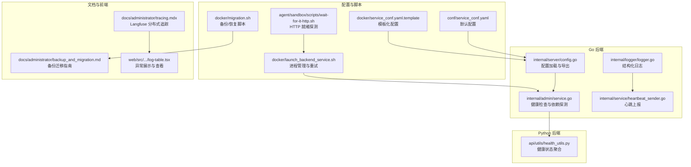
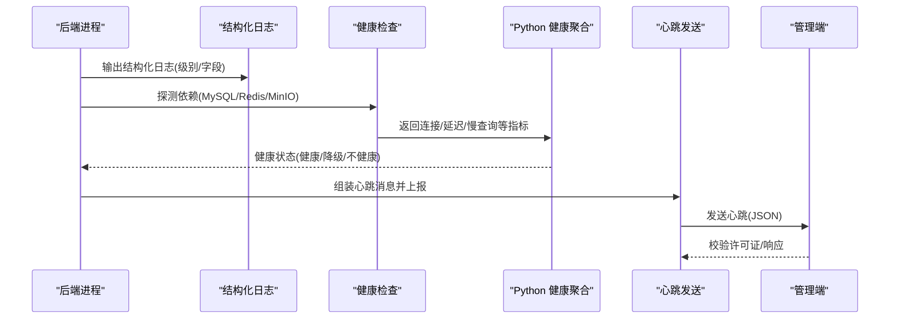
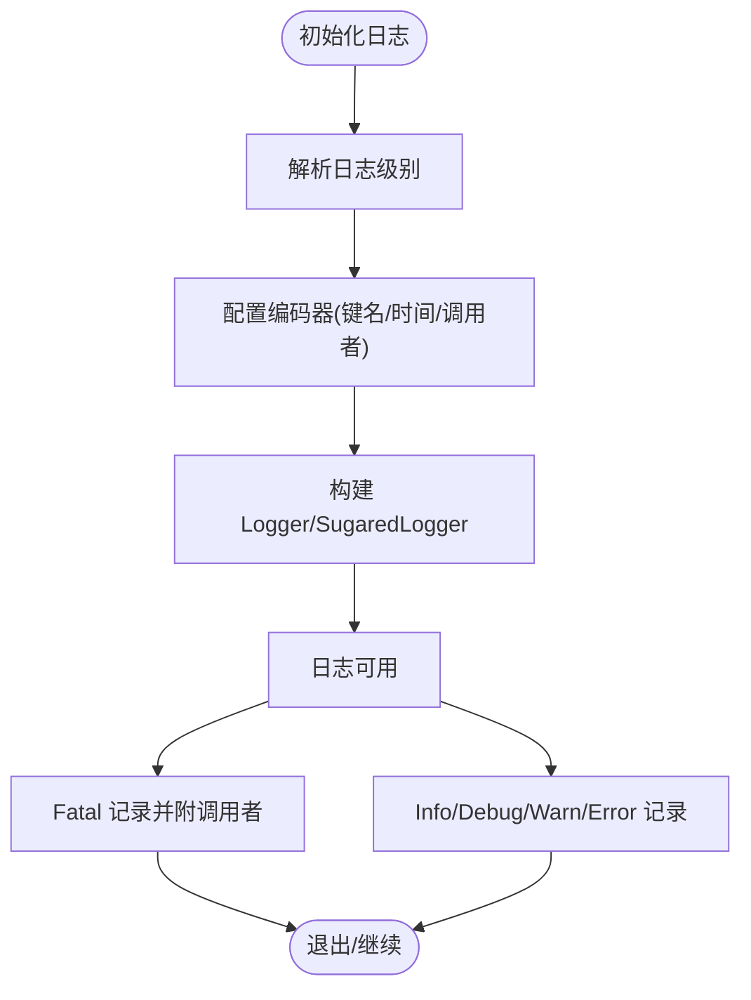
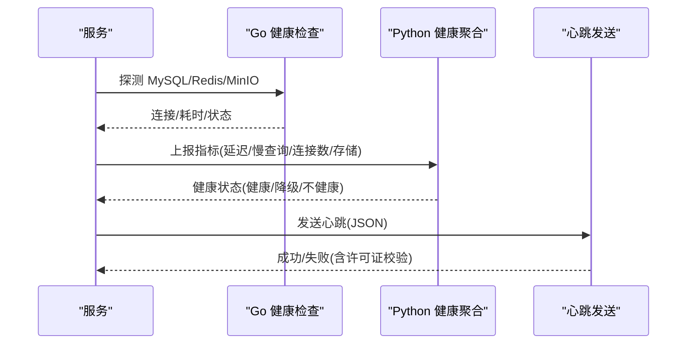
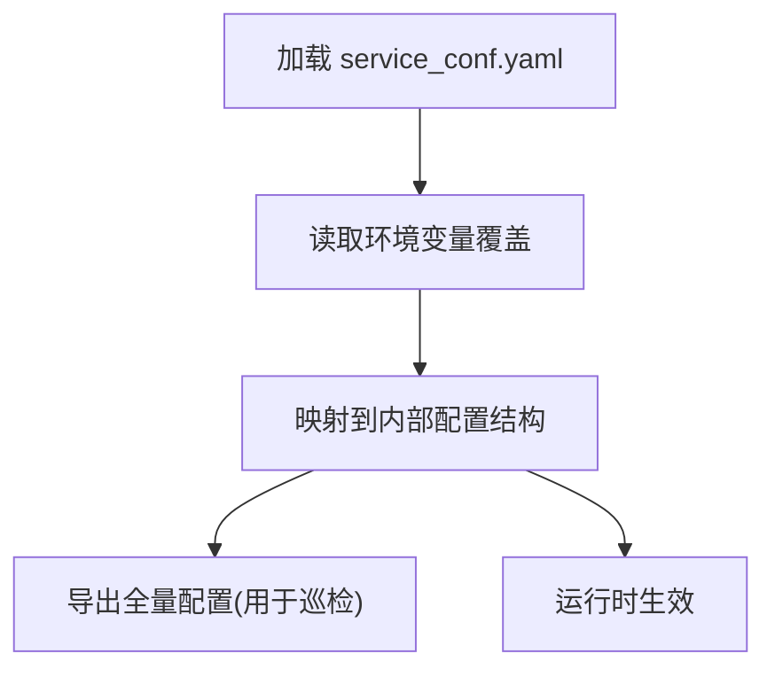
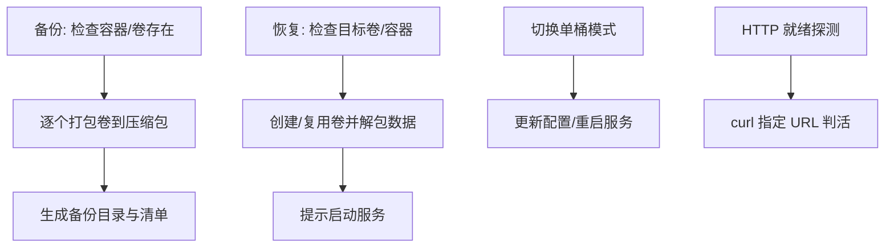
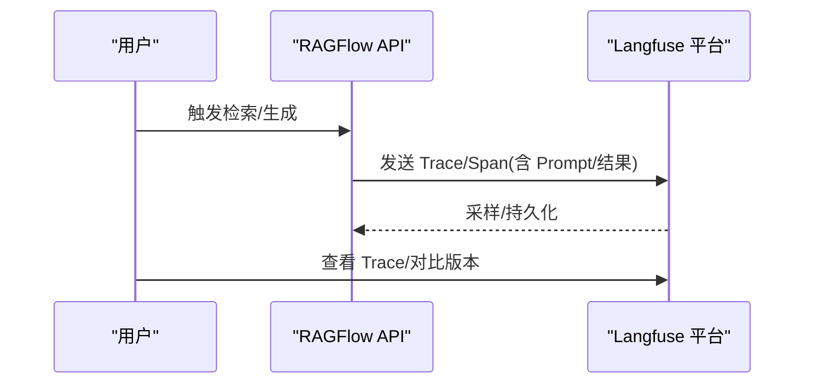
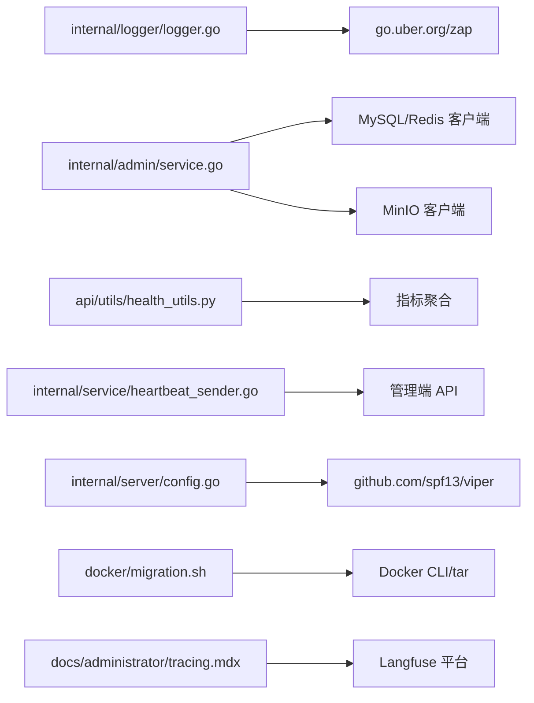

# 监控与运维

<cite>
**本文引用的文件**
- [internal/logger/logger.go](file://internal/logger/logger.go)
- [internal/logger/README.md](file://internal/logger/README.md)
- [api/utils/health_utils.py](file://api/utils/health_utils.py)
- [internal/admin/service.go](file://internal/admin/service.go)
- [internal/service/heartbeat_sender.go](file://internal/service/heartbeat_sender.go)
- [internal/common/status_message.go](file://internal/common/status_message.go)
- [docker/migration.sh](file://docker/migration.sh)
- [docs/administrator/backup_and_migration.md](file://docs/administrator/backup_and_migration.md)
- [docker/launch_backend_service.sh](file://docker/launch_backend_service.sh)
- [conf/service_conf.yaml](file://conf/service_conf.yaml)
- [docker/service_conf.yaml.template](file://docker/service_conf.yaml.template)
- [internal/server/config.go](file://internal/server/config.go)
- [tools/es-to-oceanbase-migration/src/es_ob_migration/progress.py](file://tools/es-to-oceanbase-migration/src/es_ob_migration/progress.py)
- [web/src/pages/user-setting/data-source/data-source-detail-page/log-table.tsx](file://web/src/pages/user-setting/data-source/data-source-detail-page/log-table.tsx)
- [agent/sandbox/scripts/wait-for-it-http.sh](file://agent/sandbox/scripts/wait-for-it-http.sh)
- [docs/administrator/tracing.mdx](file://docs/administrator/tracing.mdx)
</cite>

## 目录
1. [简介](#简介)
2. [项目结构](#项目结构)
3. [核心组件](#核心组件)
4. [架构总览](#架构总览)
5. [详细组件分析](#详细组件分析)
6. [依赖关系分析](#依赖关系分析)
7. [性能考量](#性能考量)
8. [故障排除指南](#故障排除指南)
9. [结论](#结论)
10. [附录](#附录)

## 简介
本文件面向运维工程师与平台管理员，系统化梳理 RAGFlow 的监控与运维能力，覆盖以下主题：
- 监控指标：性能指标采集、错误率统计、资源使用监控等
- 日志管理：日志级别配置、日志轮转策略、分布式追踪
- 健康检查：服务可用性检测、依赖服务监控、自动故障转移
- 运维工具与脚本：数据库迁移、系统备份、性能调优
- 故障排除与容量规划：常见问题定位、性能优化建议、容量规划指引

## 项目结构
RAGFlow 的监控与运维涉及多层实现：
- Go 后端通过统一日志库输出结构化日志，并提供心跳上报与健康检查接口
- Python 后端提供健康状态聚合与指标封装
- 配置体系支持环境变量注入与模板化配置
- Docker 脚本提供启动、重试、备份与恢复能力
- 文档提供分布式追踪集成与备份迁移指南

**图表来源**
- [internal/logger/logger.go:1-139](file://internal/logger/logger.go#L1-L139)
- [internal/admin/service.go:1032-1332](file://internal/admin/service.go#L1032-L1332)
- [internal/service/heartbeat_sender.go:98-143](file://internal/service/heartbeat_sender.go#L98-L143)
- [internal/server/config.go:196-768](file://internal/server/config.go#L196-L768)
- [api/utils/health_utils.py:174-216](file://api/utils/health_utils.py#L174-L216)
- [conf/service_conf.yaml:1-160](file://conf/service_conf.yaml#L1-L160)
- [docker/service_conf.yaml.template:1-172](file://docker/service_conf.yaml.template#L1-L172)
- [docker/migration.sh:1-350](file://docker/migration.sh#L1-L350)
- [docker/launch_backend_service.sh:1-130](file://docker/launch_backend_service.sh#L1-L130)
- [agent/sandbox/scripts/wait-for-it-http.sh:1-31](file://agent/sandbox/scripts/wait-for-it-http.sh#L1-L31)
- [docs/administrator/backup_and_migration.md:1-314](file://docs/administrator/backup_and_migration.md#L1-L314)
- [docs/administrator/tracing.mdx:1-75](file://docs/administrator/tracing.mdx#L1-L75)
- [web/src/pages/user-setting/data-source/data-source-detail-page/log-table.tsx:93-126](file://web/src/pages/user-setting/data-source/data-source-detail-page/log-table.tsx#L93-L126)

**章节来源**
- [internal/logger/logger.go:1-139](file://internal/logger/logger.go#L1-L139)
- [internal/admin/service.go:1032-1332](file://internal/admin/service.go#L1032-L1332)
- [internal/service/heartbeat_sender.go:98-143](file://internal/service/heartbeat_sender.go#L98-L143)
- [internal/server/config.go:196-768](file://internal/server/config.go#L196-L768)
- [api/utils/health_utils.py:174-216](file://api/utils/health_utils.py#L174-L216)
- [conf/service_conf.yaml:1-160](file://conf/service_conf.yaml#L1-L160)
- [docker/service_conf.yaml.template:1-172](file://docker/service_conf.yaml.template#L1-L172)
- [docker/migration.sh:1-350](file://docker/migration.sh#L1-L350)
- [docker/launch_backend_service.sh:1-130](file://docker/launch_backend_service.sh#L1-L130)
- [agent/sandbox/scripts/wait-for-it-http.sh:1-31](file://agent/sandbox/scripts/wait-for-it-http.sh#L1-L31)
- [docs/administrator/backup_and_migration.md:1-314](file://docs/administrator/backup_and_migration.md#L1-L314)
- [docs/administrator/tracing.mdx:1-75](file://docs/administrator/tracing.mdx#L1-L75)
- [web/src/pages/user-setting/data-source/data-source-detail-page/log-table.tsx:93-126](file://web/src/pages/user-setting/data-source/data-source-detail-page/log-table.tsx#L93-L126)

## 核心组件
- 结构化日志（Go）：统一编码器、级别控制、致命日志带调用者信息、同步刷新
- 健康检查（Go/Python）：连接性、延迟、慢查询、连接数、存储使用等指标聚合
- 心跳上报：周期性上报服务状态到管理端
- 配置体系：YAML 默认配置 + 模板化环境变量注入 + 全量配置导出
- 备份与迁移：Docker 卷打包/解包、单桶/多桶对象存储模式切换
- 进程管理与重试：后端服务与任务执行器的自愈启动
- 分布式追踪：Langfuse 集成，可视化检索与生成链路

**章节来源**
- [internal/logger/logger.go:32-138](file://internal/logger/logger.go#L32-L138)
- [api/utils/health_utils.py:174-216](file://api/utils/health_utils.py#L174-L216)
- [internal/admin/service.go:1032-1332](file://internal/admin/service.go#L1032-L1332)
- [internal/service/heartbeat_sender.go:98-143](file://internal/service/heartbeat_sender.go#L98-L143)
- [internal/server/config.go:196-768](file://internal/server/config.go#L196-L768)
- [docker/migration.sh:151-293](file://docker/migration.sh#L151-L293)
- [docker/launch_backend_service.sh:70-115](file://docker/launch_backend_service.sh#L70-L115)
- [docs/administrator/tracing.mdx:18-73](file://docs/administrator/tracing.mdx#L18-L73)

## 架构总览
下图展示监控与运维关键路径：日志输出、健康检查、心跳上报、配置与脚本协同。

**图表来源**
- [internal/logger/logger.go:108-138](file://internal/logger/logger.go#L108-L138)
- [internal/admin/service.go:1032-1332](file://internal/admin/service.go#L1032-L1332)
- [api/utils/health_utils.py:174-216](file://api/utils/health_utils.py#L174-L216)
- [internal/service/heartbeat_sender.go:98-143](file://internal/service/heartbeat_sender.go#L98-L143)

## 详细组件分析

### 日志管理
- 结构化日志
  - 编码器键名、时间格式、时长编码、调用者信息可选
  - 支持致命日志附加调用者位置
  - 提供 Info/Error/Debug/Warn/Fatal/Sync 方法
- 日志级别
  - 通过初始化参数选择 debug/info/warn/error
  - 未安装依赖时回退至标准库
- 使用建议
  - 生产环境建议 info 级别，调试问题时临时提升到 debug
  - 所有业务事件与错误均应携带上下文字段，便于检索与告警

**图表来源**
- [internal/logger/logger.go:32-86](file://internal/logger/logger.go#L32-L86)
- [internal/logger/logger.go:95-138](file://internal/logger/logger.go#L95-L138)

**章节来源**
- [internal/logger/logger.go:32-138](file://internal/logger/logger.go#L32-L138)
- [internal/logger/README.md:1-71](file://internal/logger/README.md#L1-L71)

### 健康检查机制
- Go 侧健康检查
  - MySQL/Redis/MinIO 等依赖服务连通性与耗时检测
  - 返回服务名、状态、耗时、消息或错误
- Python 侧健康聚合
  - 聚合连接状态、延迟、慢查询、连接数、存储使用等指标
  - 基于阈值判定健康/降级/不健康
- 心跳上报
  - 定期向管理端发送心跳，包含服务类型、版本、主机、端口等
  - 校验许可证有效性，失败时记录错误

**图表来源**
- [internal/admin/service.go:1032-1332](file://internal/admin/service.go#L1032-L1332)
- [api/utils/health_utils.py:174-216](file://api/utils/health_utils.py#L174-L216)
- [internal/service/heartbeat_sender.go:98-143](file://internal/service/heartbeat_sender.go#L98-L143)

**章节来源**
- [internal/admin/service.go:1032-1332](file://internal/admin/service.go#L1032-L1332)
- [api/utils/health_utils.py:174-216](file://api/utils/health_utils.py#L174-L216)
- [internal/service/heartbeat_sender.go:98-143](file://internal/service/heartbeat_sender.go#L98-L143)

### 配置与环境注入
- 默认配置
  - 服务监听地址、端口、数据库、对象存储、搜索引擎、缓存等
- 模板化配置
  - 通过环境变量覆盖默认值，支持单桶/多桶对象存储模式
- 配置导出
  - 导出所有配置项，便于巡检与排障

**图表来源**
- [conf/service_conf.yaml:1-160](file://conf/service_conf.yaml#L1-L160)
- [docker/service_conf.yaml.template:1-172](file://docker/service_conf.yaml.template#L1-L172)
- [internal/server/config.go:212-768](file://internal/server/config.go#L212-L768)

**章节来源**
- [conf/service_conf.yaml:1-160](file://conf/service_conf.yaml#L1-L160)
- [docker/service_conf.yaml.template:1-172](file://docker/service_conf.yaml.template#L1-L172)
- [internal/server/config.go:212-768](file://internal/server/config.go#L212-L768)

### 运维工具与脚本
- 备份与恢复
  - 自动打包/解包 Docker 卷（MySQL/MinIO/Redis/Elasticsearch）
  - 支持项目名前缀、体积检查、覆盖确认
- 单桶/多桶模式切换
  - 通过配置与环境变量切换对象存储模式，提供 IAM 示例与迁移步骤
- 启动与自愈
  - 后端服务与任务执行器的多进程启动与重试逻辑
  - HTTP 就绪探测脚本，等待上游服务可用

**图表来源**
- [docker/migration.sh:151-293](file://docker/migration.sh#L151-L293)
- [docs/administrator/backup_and_migration.md:14-314](file://docs/administrator/backup_and_migration.md#L14-L314)
- [docker/launch_backend_service.sh:70-115](file://docker/launch_backend_service.sh#L70-L115)
- [agent/sandbox/scripts/wait-for-it-http.sh:18-31](file://agent/sandbox/scripts/wait-for-it-http.sh#L18-L31)

**章节来源**
- [docker/migration.sh:1-350](file://docker/migration.sh#L1-L350)
- [docs/administrator/backup_and_migration.md:1-314](file://docs/administrator/backup_and_migration.md#L1-L314)
- [docker/launch_backend_service.sh:1-130](file://docker/launch_backend_service.sh#L1-L130)
- [agent/sandbox/scripts/wait-for-it-http.sh:1-31](file://agent/sandbox/scripts/wait-for-it-http.sh#L1-L31)

### 分布式追踪
- 集成 Langfuse
  - 每个请求以“ragflow-”为前缀生成 Trace，包含检索、排序、生成等 Span
  - 可查看 Prompt、检索文档、LLM 响应等元数据
- 使用流程
  - 获取公钥/密钥/主机，按租户维度配置
  - 启动后自动采样，无需代码改动

**图表来源**
- [docs/administrator/tracing.mdx:18-73](file://docs/administrator/tracing.mdx#L18-L73)

**章节来源**
- [docs/administrator/tracing.mdx:1-75](file://docs/administrator/tracing.mdx#L1-L75)

## 依赖关系分析
- 日志依赖：Go 标准库回退；生产建议安装依赖以启用结构化日志
- 健康检查依赖：MySQL/Redis/MinIO 客户端库；Python 侧对数据库指标进行汇总
- 配置依赖：Viper 解析 YAML/环境变量；模板化配置支持多环境
- 运维脚本依赖：Docker CLI、tar、curl、mc（可选）

**图表来源**
- [internal/logger/logger.go:19-30](file://internal/logger/logger.go#L19-L30)
- [internal/admin/service.go:1032-1332](file://internal/admin/service.go#L1032-L1332)
- [api/utils/health_utils.py:174-216](file://api/utils/health_utils.py#L174-L216)
- [internal/service/heartbeat_sender.go:98-143](file://internal/service/heartbeat_sender.go#L98-L143)
- [internal/server/config.go:212-222](file://internal/server/config.go#L212-L222)
- [docker/migration.sh:65-78](file://docker/migration.sh#L65-L78)
- [docs/administrator/tracing.mdx:18-73](file://docs/administrator/tracing.mdx#L18-L73)

**章节来源**
- [internal/logger/logger.go:19-30](file://internal/logger/logger.go#L19-L30)
- [internal/admin/service.go:1032-1332](file://internal/admin/service.go#L1032-L1332)
- [api/utils/health_utils.py:174-216](file://api/utils/health_utils.py#L174-L216)
- [internal/service/heartbeat_sender.go:98-143](file://internal/service/heartbeat_sender.go#L98-L143)
- [internal/server/config.go:212-222](file://internal/server/config.go#L212-L222)
- [docker/migration.sh:65-78](file://docker/migration.sh#L65-L78)
- [docs/administrator/tracing.mdx:18-73](file://docs/administrator/tracing.mdx#L18-L73)

## 性能考量
- 日志级别与开销
  - debug 级别会显著增加 IO 与序列化开销，建议仅在定位问题时开启
- 健康检查频率与阈值
  - 合理设置延迟阈值（如小于 1 秒），避免误判
  - 对慢查询与连接数进行持续观察，结合数据库参数调优
- 进程与资源
  - 任务执行器数量与工作线程数需与 CPU/内存匹配，避免过度竞争
- 存储后端
  - 单桶模式减少桶列表开销，但需评估 IAM 策略与权限范围
- 迁移与备份
  - 大数据量迁移建议离峰执行，关注网络与磁盘 IO

[本节为通用指导，无需特定文件引用]

## 故障排除指南
- 日志无法输出/回退到标准库
  - 检查依赖是否安装；确认初始化是否成功
  - 参考日志包说明文档
- 健康检查显示不健康
  - 核对数据库/缓存/对象存储连接串、凭据与网络连通
  - 关注延迟与慢查询指标，必要时调整阈值
- 心跳上报失败
  - 校验许可证有效性；检查网络与代理配置
- 备份/恢复失败
  - 确认无容器占用目标卷；遵循脚本提示进行覆盖确认
  - 检查备份文件完整性与体积
- 追踪不可见
  - 确认 Langfuse 凭据正确且已保存到租户配置
  - 使用“ragflow-”前缀过滤 Trace

**章节来源**
- [internal/logger/README.md:55-71](file://internal/logger/README.md#L55-L71)
- [internal/admin/service.go:1032-1332](file://internal/admin/service.go#L1032-L1332)
- [internal/service/heartbeat_sender.go:122-133](file://internal/service/heartbeat_sender.go#L122-L133)
- [docker/migration.sh:151-293](file://docker/migration.sh#L151-L293)
- [docs/administrator/tracing.mdx:29-73](file://docs/administrator/tracing.mdx#L29-L73)

## 结论
RAGFlow 在监控与运维方面提供了完善的基础设施：结构化日志、健康检查与心跳上报、配置体系、备份迁移脚本以及 Langfuse 分布式追踪。通过合理配置日志级别、健康阈值与资源参数，结合脚本化的备份/恢复与单桶/多桶模式切换，可有效保障系统稳定性与可维护性。

[本节为总结，无需特定文件引用]

## 附录
- 异常详情展示
  - 前端可在数据源详情页查看异常堆栈，辅助快速定位问题

**章节来源**
- [web/src/pages/user-setting/data-source/data-source-detail-page/log-table.tsx:93-126](file://web/src/pages/user-setting/data-source/data-source-detail-page/log-table.tsx#L93-L126)