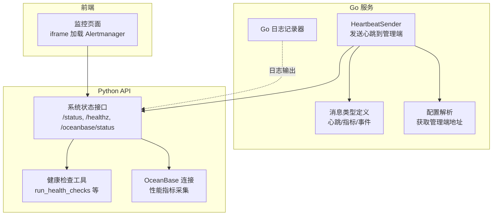
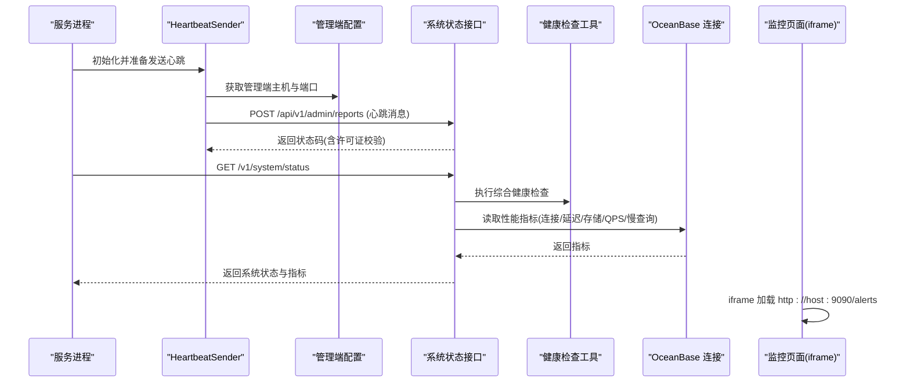
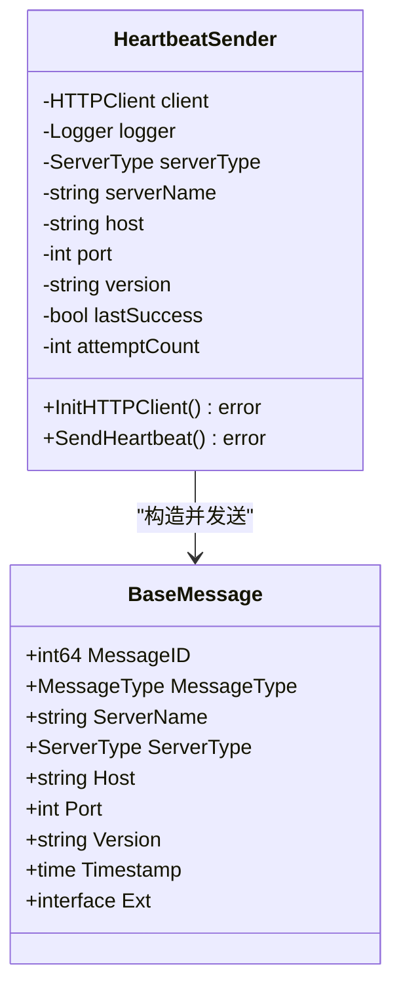
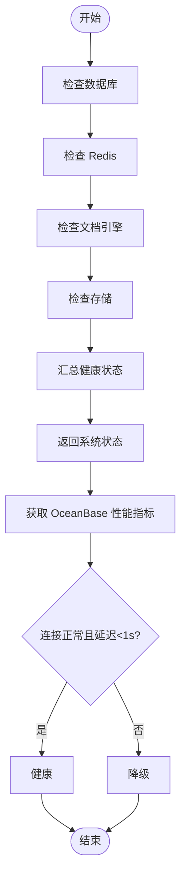
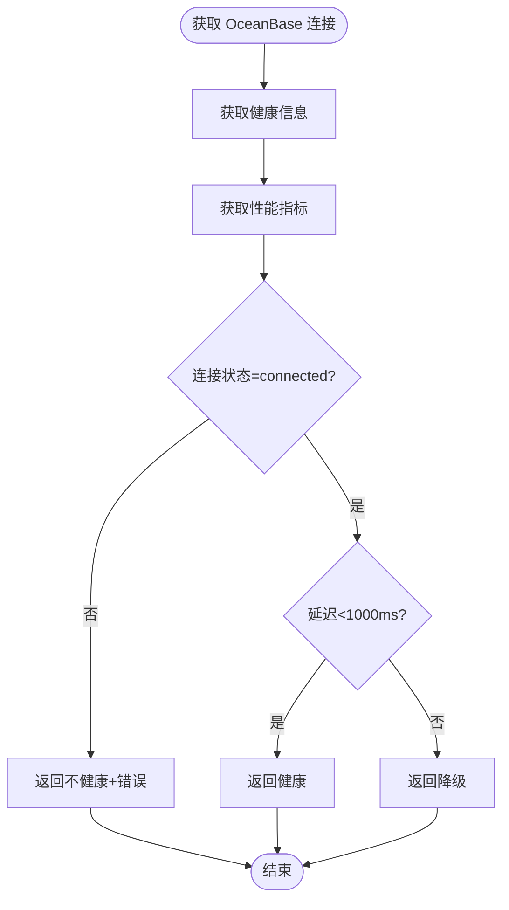
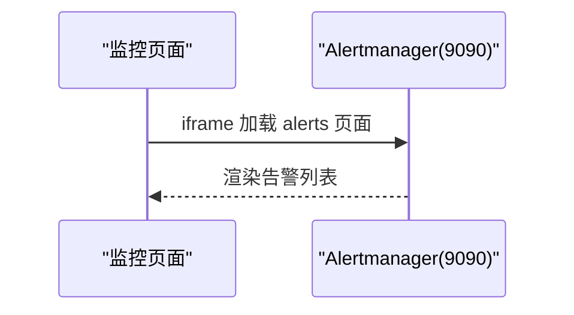
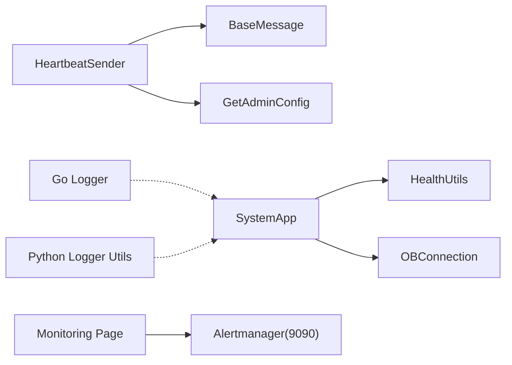

# 系统监控

<cite>
**本文引用的文件**
- [internal/common/status_message.go](file://internal/common/status_message.go)
- [internal/service/heartbeat_sender.go](file://internal/service/heartbeat_sender.go)
- [api/utils/health_utils.py](file://api/utils/health_utils.py)
- [api/apps/system_app.py](file://api/apps/system_app.py)
- [web/src/pages/admin/monitoring.tsx](file://web/src/pages/admin/monitoring.tsx)
- [internal/server/config.go](file://internal/server/config.go)
- [internal/logger/logger.go](file://internal/logger/logger.go)
- [common/log_utils.py](file://common/log_utils.py)
- [conf/system_settings.json](file://conf/system_settings.json)
- [rag/utils/ob_conn.py](file://rag/utils/ob_conn.py)
- [test/testcases/test_web_api/test_system_app/test_system_routes_unit.py](file://test/testcases/test_web_api/test_system_app/test_system_routes_unit.py)
</cite>

## 目录
1. [简介](#简介)
2. [项目结构](#项目结构)
3. [核心组件](#核心组件)
4. [架构总览](#架构总览)
5. [详细组件分析](#详细组件分析)
6. [依赖关系分析](#依赖关系分析)
7. [性能考量](#性能考量)
8. [故障排查指南](#故障排查指南)
9. [结论](#结论)
10. [附录](#附录)

## 简介
本技术文档聚焦于 RAGFlow 的系统监控能力，覆盖健康检查、性能指标采集、错误率统计、资源使用监控、数据采集与存储、监控仪表板与告警集成、配置与扩展等方面。文档以代码为依据，结合可视化图示，帮助运维与开发人员快速理解并部署监控体系。

## 项目结构
RAGFlow 的监控相关能力主要分布在以下模块：
- 后端 Go 服务：心跳上报、消息类型定义、配置解析与日志
- Python API 层：健康检查与系统状态接口、OceanBase 性能指标聚合
- 前端管理界面：通过 iframe 集成外部 Prometheus Alertmanager 告警面板
- 配置与日志：系统设置项、日志级别与输出格式

**图表来源**
- [internal/service/heartbeat_sender.go:79-143](file://internal/service/heartbeat_sender.go#L79-L143)
- [internal/common/status_message.go:23-33](file://internal/common/status_message.go#L23-L33)
- [internal/server/config.go:710-716](file://internal/server/config.go#L710-L716)
- [api/apps/system_app.py:65-171](file://api/apps/system_app.py#L65-L171)
- [api/utils/health_utils.py:329-365](file://api/utils/health_utils.py#L329-L365)
- [web/src/pages/admin/monitoring.tsx:10-13](file://web/src/pages/admin/monitoring.tsx#L10-L13)
- [internal/logger/logger.go:108-138](file://internal/logger/logger.go#L108-L138)

**章节来源**
- [internal/service/heartbeat_sender.go:1-144](file://internal/service/heartbeat_sender.go#L1-L144)
- [internal/common/status_message.go:1-34](file://internal/common/status_message.go#L1-L34)
- [internal/server/config.go:710-716](file://internal/server/config.go#L710-L716)
- [api/apps/system_app.py:65-218](file://api/apps/system_app.py#L65-L218)
- [api/utils/health_utils.py:1-365](file://api/utils/health_utils.py#L1-L365)
- [web/src/pages/admin/monitoring.tsx:1-19](file://web/src/pages/admin/monitoring.tsx#L1-L19)
- [internal/logger/logger.go:50-138](file://internal/logger/logger.go#L50-L138)
- [common/log_utils.py:42-86](file://common/log_utils.py#L42-L86)

## 核心组件
- 心跳上报与消息模型
  - 消息类型与服务器类型在 Go 侧统一定义，用于区分心跳、指标、事件三类消息。
  - HeartbeatSender 负责周期性向管理端发送心跳，并处理响应码（如许可证校验）。
- 健康检查与系统状态
  - Python 层提供 run_health_checks 综合检查数据库、Redis、文档引擎、存储；系统状态接口返回各组件健康与耗时。
  - OceanBase 状态接口聚合连接、延迟、存储、QPS、慢查询、连接池等指标。
- 监控仪表板与告警
  - 管理端监控页通过 iframe 加载本地 9090 端口的 Alertmanager 告警页面，实现外部告警展示。
- 日志与配置
  - Go 日志器与 Python 日志工具分别负责后端日志输出与级别控制；系统设置 JSON 提供邮件、沙箱等可配置项。

**章节来源**
- [internal/common/status_message.go:7-33](file://internal/common/status_message.go#L7-L33)
- [internal/service/heartbeat_sender.go:31-143](file://internal/service/heartbeat_sender.go#L31-L143)
- [api/utils/health_utils.py:329-365](file://api/utils/health_utils.py#L329-L365)
- [api/apps/system_app.py:65-218](file://api/apps/system_app.py#L65-L218)
- [web/src/pages/admin/monitoring.tsx:10-13](file://web/src/pages/admin/monitoring.tsx#L10-L13)
- [internal/logger/logger.go:108-138](file://internal/logger/logger.go#L108-L138)
- [common/log_utils.py:42-86](file://common/log_utils.py#L42-L86)
- [conf/system_settings.json:1-88](file://conf/system_settings.json#L1-L88)

## 架构总览
下图展示了从服务端到 API、再到前端监控面板的整体交互路径，以及外部 Alertmanager 的集成方式。

**图表来源**
- [internal/service/heartbeat_sender.go:59-143](file://internal/service/heartbeat_sender.go#L59-L143)
- [internal/server/config.go:710-716](file://internal/server/config.go#L710-L716)
- [api/apps/system_app.py:65-218](file://api/apps/system_app.py#L65-L218)
- [api/utils/health_utils.py:136-216](file://api/utils/health_utils.py#L136-L216)
- [web/src/pages/admin/monitoring.tsx:10-13](file://web/src/pages/admin/monitoring.tsx#L10-L13)

## 详细组件分析

### 心跳与消息模型
- 消息模型定义了报告 ID、消息类型、服务器标识、版本、时间戳等字段，支持统一上报与识别。
- HeartbeatSender 在首次或失败后初始化 HTTP 客户端，构造心跳消息并通过 /api/v1/admin/reports 发送；对非 200 响应进行错误码解析（如许可证校验）。

**图表来源**
- [internal/common/status_message.go:23-33](file://internal/common/status_message.go#L23-L33)
- [internal/service/heartbeat_sender.go:31-143](file://internal/service/heartbeat_sender.go#L31-L143)

**章节来源**
- [internal/common/status_message.go:1-34](file://internal/common/status_message.go#L1-L34)
- [internal/service/heartbeat_sender.go:1-144](file://internal/service/heartbeat_sender.go#L1-L144)

### 健康检查与系统状态
- 综合健康检查：检查数据库、Redis、文档引擎、存储连通性与耗时，汇总为整体健康状态。
- 系统状态接口：返回各组件状态、耗时及错误信息；同时拉取任务执行器的心跳集合，用于评估任务侧存活。
- OceanBase 状态：返回连接状态、延迟、存储使用、QPS、慢查询数、连接池等指标，并按延迟阈值判定健康/降级。

**图表来源**
- [api/utils/health_utils.py:329-365](file://api/utils/health_utils.py#L329-L365)
- [api/apps/system_app.py:65-171](file://api/apps/system_app.py#L65-L171)
- [api/utils/health_utils.py:136-216](file://api/utils/health_utils.py#L136-L216)

**章节来源**
- [api/utils/health_utils.py:329-365](file://api/utils/health_utils.py#L329-L365)
- [api/apps/system_app.py:65-218](file://api/apps/system_app.py#L65-L218)

### OceanBase 性能指标采集
- 指标来源：连接状态、延迟、存储使用、QPS、慢查询数、连接池统计。
- 计算与聚合：通过连接对象获取健康信息与性能指标，按阈值判定健康状态，异常时回填错误信息。

**图表来源**
- [api/utils/health_utils.py:136-216](file://api/utils/health_utils.py#L136-L216)
- [rag/utils/ob_conn.py:376-411](file://rag/utils/ob_conn.py#L376-L411)

**章节来源**
- [api/utils/health_utils.py:104-216](file://api/utils/health_utils.py#L104-L216)
- [rag/utils/ob_conn.py:376-411](file://rag/utils/ob_conn.py#L376-L411)

### 监控仪表板与告警集成
- 前端监控页通过 iframe 加载本地 9090 端口的 Alertmanager 告警页面，实现外部告警展示。
- 管理端配置提供获取管理端主机与端口的能力，确保心跳上报目标正确。

**图表来源**
- [web/src/pages/admin/monitoring.tsx:10-13](file://web/src/pages/admin/monitoring.tsx#L10-L13)
- [internal/server/config.go:710-716](file://internal/server/config.go#L710-L716)

**章节来源**
- [web/src/pages/admin/monitoring.tsx:1-19](file://web/src/pages/admin/monitoring.tsx#L1-L19)
- [internal/server/config.go:710-716](file://internal/server/config.go#L710-L716)

### 日志与配置
- Go 日志器：统一编码格式、时间格式、级别控制，支持 Fatal/Info/Error/Debug/Warn 等方法。
- Python 日志工具：支持按包名设置日志级别，便于精细化调试。
- 系统设置 JSON：包含邮件、沙箱等配置项，便于运维调整。

**章节来源**
- [internal/logger/logger.go:50-138](file://internal/logger/logger.go#L50-L138)
- [common/log_utils.py:42-86](file://common/log_utils.py#L42-L86)
- [conf/system_settings.json:1-88](file://conf/system_settings.json#L1-L88)

## 依赖关系分析
- Go 心跳发送依赖消息模型与管理端配置；对外通过 HTTP 客户端上报。
- Python 系统状态依赖健康检查工具与 OceanBase 连接；前端通过 iframe 依赖本地 9090 端口。
- 日志系统贯穿 Go 与 Python 两端，提供统一的可观测性基础。

**图表来源**
- [internal/service/heartbeat_sender.go:59-143](file://internal/service/heartbeat_sender.go#L59-L143)
- [internal/common/status_message.go:23-33](file://internal/common/status_message.go#L23-L33)
- [internal/server/config.go:710-716](file://internal/server/config.go#L710-L716)
- [api/apps/system_app.py:65-218](file://api/apps/system_app.py#L65-L218)
- [api/utils/health_utils.py:329-365](file://api/utils/health_utils.py#L329-L365)
- [web/src/pages/admin/monitoring.tsx:10-13](file://web/src/pages/admin/monitoring.tsx#L10-L13)
- [internal/logger/logger.go:108-138](file://internal/logger/logger.go#L108-L138)
- [common/log_utils.py:42-86](file://common/log_utils.py#L42-L86)

**章节来源**
- [internal/service/heartbeat_sender.go:1-144](file://internal/service/heartbeat_sender.go#L1-L144)
- [api/apps/system_app.py:65-218](file://api/apps/system_app.py#L65-L218)
- [api/utils/health_utils.py:329-365](file://api/utils/health_utils.py#L329-L365)
- [web/src/pages/admin/monitoring.tsx:1-19](file://web/src/pages/admin/monitoring.tsx#L1-L19)

## 性能考量
- 健康检查耗时：各组件检查均记录耗时，便于定位慢点。
- OceanBase 指标：延迟阈值（例如小于 1 秒）用于判定健康/降级，避免误报。
- 心跳节流：心跳发送存在成功后的尝试计数与失败重试逻辑，降低网络压力。
- 日志级别：通过环境变量与配置文件控制日志级别，平衡可观测性与性能。

**章节来源**
- [api/apps/system_app.py:100-171](file://api/apps/system_app.py#L100-L171)
- [api/utils/health_utils.py:188-192](file://api/utils/health_utils.py#L188-L192)
- [internal/service/heartbeat_sender.go:82-89](file://internal/service/heartbeat_sender.go#L82-L89)
- [common/log_utils.py:48-70](file://common/log_utils.py#L48-L70)

## 故障排查指南
- 心跳上报失败
  - 检查管理端配置是否正确（主机与端口），确认 HTTP 客户端初始化成功。
  - 关注响应码解析，若非许可证有效，需检查授权配置。
- 系统状态异常
  - 查看 /status 接口返回的各组件状态与错误信息；结合 /healthz 的综合健康结果定位问题。
  - 对 OceanBase，关注延迟、慢查询、连接池等指标，必要时扩大连接池或优化查询。
- 告警面板无数据
  - 确认本地 9090 端口可用且 Alertmanager 正常运行；检查浏览器跨域与证书配置。
- 日志问题
  - Go 日志器输出格式与级别；Python 日志工具按包名设置级别；必要时提升至 DEBUG 观察细节。

**章节来源**
- [internal/service/heartbeat_sender.go:59-143](file://internal/service/heartbeat_sender.go#L59-L143)
- [api/apps/system_app.py:65-218](file://api/apps/system_app.py#L65-L218)
- [api/utils/health_utils.py:136-216](file://api/utils/health_utils.py#L136-L216)
- [web/src/pages/admin/monitoring.tsx:10-13](file://web/src/pages/admin/monitoring.tsx#L10-L13)
- [internal/logger/logger.go:108-138](file://internal/logger/logger.go#L108-L138)
- [common/log_utils.py:42-86](file://common/log_utils.py#L42-L86)

## 结论
RAGFlow 的监控体系以“健康检查 + 指标采集 + 心跳上报 + 外部告警面板”为核心，既满足基础可用性验证，又提供 OceanBase 等关键组件的深度指标观测。通过统一的消息模型与日志规范，运维人员可以快速定位问题并进行配置优化。

## 附录

### 监控指标定义与计算方法
- 连接状态：数据库、Redis、文档引擎、存储的连通性检查结果。
- 延迟（毫秒）：各组件健康检查耗时；OceanBase 延迟阈值用于健康/降级判定。
- 存储使用（用量/总量）：OceanBase 数据库大小统计。
- QPS（每秒查询数）：基于进程列表估算的近似值。
- 慢查询数：慢查询统计。
- 连接池统计：活跃连接数、最大连接数。
- 任务执行器存活：通过 Redis 集合与有序集合中的心跳记录判断。

**章节来源**
- [api/utils/health_utils.py:136-216](file://api/utils/health_utils.py#L136-L216)
- [rag/utils/ob_conn.py:376-411](file://rag/utils/ob_conn.py#L376-L411)
- [api/apps/system_app.py:159-169](file://api/apps/system_app.py#L159-L169)

### 监控数据采集、存储与展示流程
- 实时采集：健康检查工具与 OceanBase 连接在请求时动态采集指标。
- 历史存储：心跳消息由 HeartbeatSender 上报至管理端，具体持久化取决于管理端实现。
- 展示：系统状态接口返回当前状态与指标；前端通过 iframe 展示外部 Alertmanager 告警。

**章节来源**
- [api/utils/health_utils.py:329-365](file://api/utils/health_utils.py#L329-L365)
- [api/apps/system_app.py:65-218](file://api/apps/system_app.py#L65-L218)
- [web/src/pages/admin/monitoring.tsx:10-13](file://web/src/pages/admin/monitoring.tsx#L10-L13)
- [internal/service/heartbeat_sender.go:79-143](file://internal/service/heartbeat_sender.go#L79-L143)

### 告警机制与阈值
- 阈值设定：OceanBase 延迟阈值（小于 1000ms）作为健康/降级分界。
- 触发条件：健康检查综合失败或 OceanBase 指标异常。
- 通知渠道：通过 Alertmanager 面板集中展示，具体通知策略由外部系统配置决定。

**章节来源**
- [api/utils/health_utils.py:188-192](file://api/utils/health_utils.py#L188-L192)
- [web/src/pages/admin/monitoring.tsx:10-13](file://web/src/pages/admin/monitoring.tsx#L10-L13)

### 配置方法与扩展接口
- 管理端配置：通过配置解析函数获取管理端主机与端口，用于心跳上报。
- 系统设置：通过系统设置 JSON 调整邮件、沙箱等参数。
- 扩展接口：可在系统状态接口中增加新的健康检查与指标采集，保持与现有消息模型一致。

**章节来源**
- [internal/server/config.go:710-716](file://internal/server/config.go#L710-L716)
- [conf/system_settings.json:1-88](file://conf/system_settings.json#L1-L88)
- [api/apps/system_app.py:65-218](file://api/apps/system_app.py#L65-L218)

### 单元测试参考
- 测试用例覆盖健康检查返回值、OceanBase 状态接口、任务执行器心跳等场景，可用于回归验证。

**章节来源**
- [test/testcases/test_web_api/test_system_app/test_system_routes_unit.py:168-235](file://test/testcases/test_web_api/test_system_app/test_system_routes_unit.py#L168-L235)