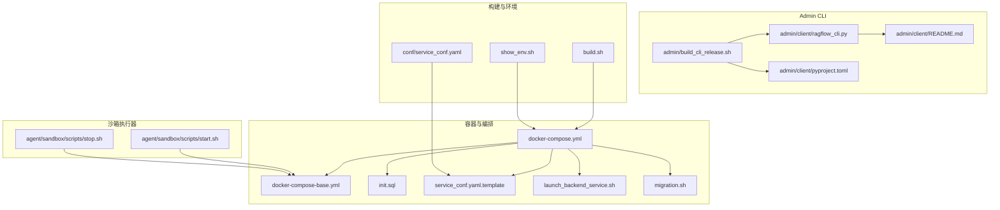
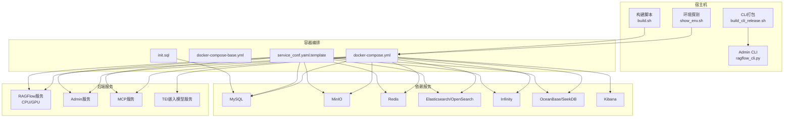
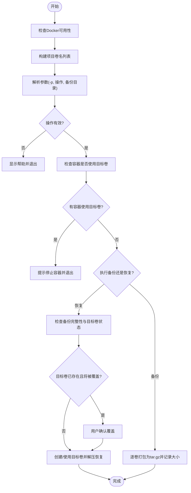
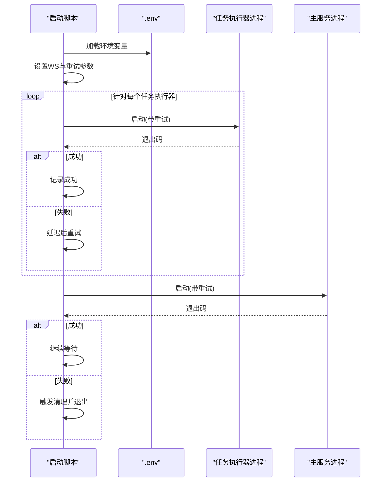
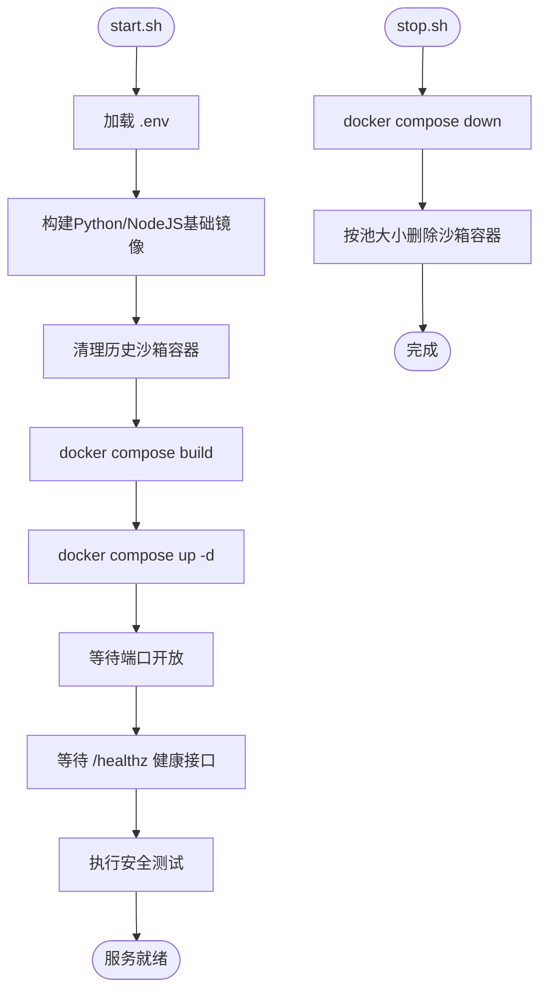
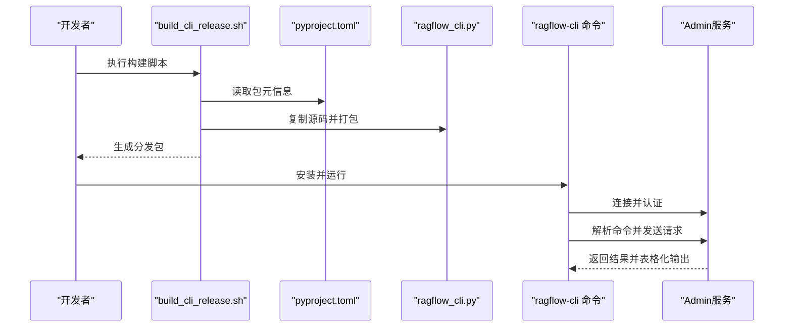
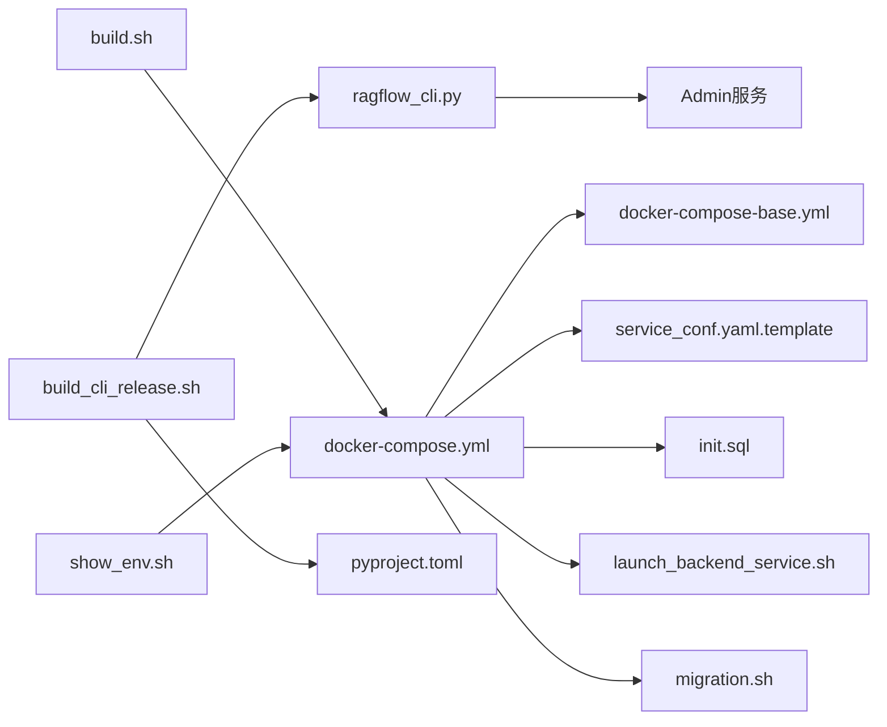

# 运维工具

<cite>
**本文引用的文件**
- [admin/build_cli_release.sh](file://admin/build_cli_release.sh)
- [docker/docker-compose.yml](file://docker/docker-compose.yml)
- [docker/docker-compose-base.yml](file://docker/docker-compose-base.yml)
- [docker/migration.sh](file://docker/migration.sh)
- [docker/launch_backend_service.sh](file://docker/launch_backend_service.sh)
- [agent/sandbox/scripts/start.sh](file://agent/sandbox/scripts/start.sh)
- [agent/sandbox/scripts/stop.sh](file://agent/sandbox/scripts/stop.sh)
- [build.sh](file://build.sh)
- [show_env.sh](file://show_env.sh)
- [admin/client/ragflow_cli.py](file://admin/client/ragflow_cli.py)
- [admin/client/README.md](file://admin/client/README.md)
- [admin/client/pyproject.toml](file://admin/client/pyproject.toml)
- [conf/service_conf.yaml](file://conf/service_conf.yaml)
- [docker/service_conf.yaml.template](file://docker/service_conf.yaml.template)
- [docker/init.sql](file://docker/init.sql)
</cite>

## 目录
1. [简介](#简介)
2. [项目结构](#项目结构)
3. [核心组件](#核心组件)
4. [架构总览](#架构总览)
5. [详细组件分析](#详细组件分析)
6. [依赖关系分析](#依赖关系分析)
7. [性能考量](#性能考量)
8. [故障排查指南](#故障排查指南)
9. [结论](#结论)
10. [附录](#附录)

## 简介
本操作指南面向RAGFlow的运维工程师与平台管理员，系统性梳理并实操化说明各类运维脚本与工具，覆盖数据库迁移、服务启动与容器编排、CLI发布工具、系统配置与环境检查、以及日常备份与恢复、性能调优、容量规划与安全加固等运维场景。文档以“可执行、可验证、可扩展”为目标，既适合初学者快速上手，也便于资深工程师进行深度定制与优化。

## 项目结构
围绕运维主题，仓库中与运维直接相关的目录与文件主要包括：
- docker：容器编排与运行时脚本（compose、入口脚本、迁移脚本、后端启动脚本）
- agent/sandbox/scripts：沙箱执行器的启动/停止脚本与健康检查脚本
- admin/client：Admin服务CLI客户端源码与发布脚本
- conf：系统默认配置样例
- 其他：构建脚本、环境探测脚本

图表来源
- [docker/docker-compose.yml:1-135](file://docker/docker-compose.yml#L1-L135)
- [docker/docker-compose-base.yml:1-326](file://docker/docker-compose-base.yml#L1-L326)
- [docker/service_conf.yaml.template:1-172](file://docker/service_conf.yaml.template#L1-L172)
- [docker/init.sql:1-2](file://docker/init.sql#L1-L2)
- [docker/launch_backend_service.sh:1-130](file://docker/launch_backend_service.sh#L1-L130)
- [docker/migration.sh:1-350](file://docker/migration.sh#L1-L350)
- [agent/sandbox/scripts/start.sh:1-73](file://agent/sandbox/scripts/start.sh#L1-L73)
- [agent/sandbox/scripts/stop.sh:1-41](file://agent/sandbox/scripts/stop.sh#L1-L41)
- [admin/client/ragflow_cli.py:1-323](file://admin/client/ragflow_cli.py#L1-L323)
- [admin/client/README.md:1-137](file://admin/client/README.md#L1-L137)
- [admin/build_cli_release.sh:1-47](file://admin/build_cli_release.sh#L1-L47)
- [admin/client/pyproject.toml:1-28](file://admin/client/pyproject.toml#L1-L28)
- [build.sh:1-215](file://build.sh#L1-L215)
- [show_env.sh:1-63](file://show_env.sh#L1-L63)
- [conf/service_conf.yaml:1-160](file://conf/service_conf.yaml#L1-L160)

章节来源
- [docker/docker-compose.yml:1-135](file://docker/docker-compose.yml#L1-L135)
- [docker/docker-compose-base.yml:1-326](file://docker/docker-compose-base.yml#L1-L326)
- [docker/service_conf.yaml.template:1-172](file://docker/service_conf.yaml.template#L1-L172)
- [docker/init.sql:1-2](file://docker/init.sql#L1-L2)
- [docker/launch_backend_service.sh:1-130](file://docker/launch_backend_service.sh#L1-L130)
- [docker/migration.sh:1-350](file://docker/migration.sh#L1-L350)
- [agent/sandbox/scripts/start.sh:1-73](file://agent/sandbox/scripts/start.sh#L1-L73)
- [agent/sandbox/scripts/stop.sh:1-41](file://agent/sandbox/scripts/stop.sh#L1-L41)
- [admin/client/ragflow_cli.py:1-323](file://admin/client/ragflow_cli.py#L1-L323)
- [admin/client/README.md:1-137](file://admin/client/README.md#L1-L137)
- [admin/build_cli_release.sh:1-47](file://admin/build_cli_release.sh#L1-L47)
- [admin/client/pyproject.toml:1-28](file://admin/client/pyproject.toml#L1-L28)
- [build.sh:1-215](file://build.sh#L1-L215)
- [show_env.sh:1-63](file://show_env.sh#L1-L63)
- [conf/service_conf.yaml:1-160](file://conf/service_conf.yaml#L1-L160)

## 核心组件
- 容器编排与服务依赖
  - docker-compose.yml：定义RAGFlow服务（CPU/GPU）、Admin服务、MCP服务、Nginx代理等，并通过depends_on与健康检查确保启动顺序与依赖满足。
  - docker-compose-base.yml：集中定义MySQL、MinIO、Redis、Elasticsearch/OpenSearch、Infinity、OceanBase/SeekDB、TEI、沙箱执行器管理器等基础服务及其健康检查、资源限制与网络。
- 数据库初始化与迁移
  - init.sql：初始化MySQL数据库与默认库。
  - migration.sh：一键备份/恢复MySQL、MinIO、Redis、Elasticsearch卷数据，支持自定义项目名与备份目录，具备体积校验与交互确认。
- 后端服务启动
  - launch_backend_service.sh：加载.env、设置工作进程数与重试机制，统一启动主服务与多个任务执行器，支持优雅退出与子进程回收。
- 沙箱执行器生命周期
  - start.sh：构建基础镜像、清理旧容器、拉起服务、等待端口开放与健康接口、执行安全测试。
  - stop.sh：停止服务并清理沙箱容器。
- CLI发布与使用
  - build_cli_release.sh：打包Admin CLI为可分发包，生成构建产物并校验。
  - ragflow_cli.py：Admin CLI客户端，支持解析命令、认证登录、表格化输出与单命令模式。
  - README.md：Admin服务与CLI使用说明、命令清单与示例。
  - pyproject.toml：CLI包元信息与依赖声明。
- 构建与环境
  - build.sh：Go服务与C++绑定的构建脚本，支持全量/仅C++/仅Go/清理/运行。
  - show_env.sh：采集操作系统、内核、Docker、Python版本等环境信息。
  - service_conf.yaml 与 service_conf.yaml.template：系统默认配置与模板，支持变量注入与多后端切换。

章节来源
- [docker/docker-compose.yml:1-135](file://docker/docker-compose.yml#L1-L135)
- [docker/docker-compose-base.yml:1-326](file://docker/docker-compose-base.yml#L1-L326)
- [docker/init.sql:1-2](file://docker/init.sql#L1-L2)
- [docker/migration.sh:1-350](file://docker/migration.sh#L1-L350)
- [docker/launch_backend_service.sh:1-130](file://docker/launch_backend_service.sh#L1-L130)
- [agent/sandbox/scripts/start.sh:1-73](file://agent/sandbox/scripts/start.sh#L1-L73)
- [agent/sandbox/scripts/stop.sh:1-41](file://agent/sandbox/scripts/stop.sh#L1-L41)
- [admin/build_cli_release.sh:1-47](file://admin/build_cli_release.sh#L1-L47)
- [admin/client/ragflow_cli.py:1-323](file://admin/client/ragflow_cli.py#L1-L323)
- [admin/client/README.md:1-137](file://admin/client/README.md#L1-L137)
- [admin/client/pyproject.toml:1-28](file://admin/client/pyproject.toml#L1-L28)
- [build.sh:1-215](file://build.sh#L1-L215)
- [show_env.sh:1-63](file://show_env.sh#L1-L63)
- [conf/service_conf.yaml:1-160](file://conf/service_conf.yaml#L1-L160)
- [docker/service_conf.yaml.template:1-172](file://docker/service_conf.yaml.template#L1-L172)

## 架构总览
下图展示RAGFlow在容器环境下的整体架构与运维脚本交互关系：

图表来源
- [docker/docker-compose.yml:1-135](file://docker/docker-compose.yml#L1-L135)
- [docker/docker-compose-base.yml:1-326](file://docker/docker-compose-base.yml#L1-L326)
- [docker/service_conf.yaml.template:1-172](file://docker/service_conf.yaml.template#L1-L172)
- [docker/init.sql:1-2](file://docker/init.sql#L1-L2)
- [show_env.sh:1-63](file://show_env.sh#L1-L63)
- [build.sh:1-215](file://build.sh#L1-L215)
- [admin/client/ragflow_cli.py:1-323](file://admin/client/ragflow_cli.py#L1-L323)
- [admin/build_cli_release.sh:1-47](file://admin/build_cli_release.sh#L1-L47)

## 详细组件分析

### 数据库迁移工具（migration.sh）
- 功能概述
  - 支持备份与恢复指定Docker Compose项目的数据卷（MySQL、MinIO、Redis、Elasticsearch），自动检测目标卷、提示用户停止相关容器、交互式确认覆盖风险、按步骤执行压缩/解压与写入。
- 关键流程
  - 参数解析：支持 -p 指定项目名、backup/restore 操作与备份目录参数。
  - 卷名构建：基于项目名拼接标准卷名。
  - 安全检查：扫描运行中的容器是否挂载目标卷，避免边备份边写入导致不一致。
  - 备份：逐个卷打包到tar.gz，记录大小与位置。
  - 恢复：若目标卷不存在则创建；若存在则警告覆盖风险并要求确认；逐个卷解压恢复。
- 注意事项
  - 必须在停止对应容器后再执行备份/恢复，否则会报错并给出解决建议。
  - 恢复前建议先备份当前数据，防止不可逆覆盖。
  - 若使用非默认项目名，请务必配合 -p 使用，否则无法匹配正确卷名。

图表来源
- [docker/migration.sh:1-350](file://docker/migration.sh#L1-L350)

章节来源
- [docker/migration.sh:1-350](file://docker/migration.sh#L1-L350)

### 后端服务启动脚本（launch_backend_service.sh）
- 功能概述
  - 加载 .env，设置运行时库路径与工作进程数（WS），启动多个任务执行器与主服务，内置最大重试次数与信号处理，实现优雅退出。
- 关键流程
  - 环境加载：从脚本所在目录读取 .env 并注入环境变量。
  - 进程管理：循环启动任务执行器与主服务，记录子进程PID，捕获SIGINT/SIGTERM后逐一终止。
  - 重试逻辑：每个任务执行器与主服务最多重试固定次数，失败则触发清理流程。
- 注意事项
  - WS 默认为1，如需提升并发请在 .env 中设置。
  - 建议结合容器编排的健康检查与重启策略，确保服务高可用。

图表来源
- [docker/launch_backend_service.sh:1-130](file://docker/launch_backend_service.sh#L1-L130)

章节来源
- [docker/launch_backend_service.sh:1-130](file://docker/launch_backend_service.sh#L1-L130)

### 沙箱执行器生命周期（start.sh / stop.sh）
- 功能概述
  - start.sh：构建基础镜像、清理旧容器、拉起服务、等待端口开放与健康接口、执行安全测试。
  - stop.sh：停止服务并清理沙箱容器。
- 关键流程
  - start.sh：读取 .env 的端口与池大小，构建Python/NodeJS基础镜像，删除历史容器，执行 docker compose up -d，等待端口与 /healthz 接口，最后运行安全测试脚本。
  - stop.sh：执行 docker compose down，并按池大小批量删除沙箱容器。
- 注意事项
  - 如 .env 缺失，将使用默认值，可能影响端口与镜像名称。
  - 健康检查脚本（wait-for-it.sh / wait-for-it-http.sh）位于同目录，确保服务就绪后再进行后续步骤。

图表来源
- [agent/sandbox/scripts/start.sh:1-73](file://agent/sandbox/scripts/start.sh#L1-L73)
- [agent/sandbox/scripts/stop.sh:1-41](file://agent/sandbox/scripts/stop.sh#L1-L41)

章节来源
- [agent/sandbox/scripts/start.sh:1-73](file://agent/sandbox/scripts/start.sh#L1-L73)
- [agent/sandbox/scripts/stop.sh:1-41](file://agent/sandbox/scripts/stop.sh#L1-L41)

### Admin CLI 发布与使用（build_cli_release.sh / ragflow_cli.py / README.md / pyproject.toml）
- 发布流程
  - 清理旧构建目录，准备源代码与包元信息，设置PYTHONPATH并调用构建工具生成分发包，最后列出生成产物。
- 使用流程
  - 安装CLI包后，通过命令行连接Admin服务，输入超级用户密码登录，进入交互式或单命令模式执行管理操作。
- 命令能力
  - 列表/查看服务、用户管理（增删改查、启用/禁用）、数据集与Agent查询、元命令（帮助、退出）等。
- 注意事项
  - 在容器环境中启用Admin服务需要在 docker-compose 中添加相应命令参数。
  - 单命令模式下用户名在管理员模式下可省略，默认邮箱为内置管理员地址。

图表来源
- [admin/build_cli_release.sh:1-47](file://admin/build_cli_release.sh#L1-L47)
- [admin/client/pyproject.toml:1-28](file://admin/client/pyproject.toml#L1-L28)
- [admin/client/ragflow_cli.py:1-323](file://admin/client/ragflow_cli.py#L1-L323)
- [admin/client/README.md:1-137](file://admin/client/README.md#L1-L137)

章节来源
- [admin/build_cli_release.sh:1-47](file://admin/build_cli_release.sh#L1-L47)
- [admin/client/ragflow_cli.py:1-323](file://admin/client/ragflow_cli.py#L1-L323)
- [admin/client/README.md:1-137](file://admin/client/README.md#L1-L137)
- [admin/client/pyproject.toml:1-28](file://admin/client/pyproject.toml#L1-L28)

### 构建与环境检查（build.sh / show_env.sh）
- build.sh
  - 检查C++与Go依赖，构建C++静态库与Go二进制，支持清理与运行，提供帮助信息与示例。
- show_env.sh
  - 采集并打印操作系统、内核、Docker、Python版本等信息，便于问题定位与兼容性评估。

章节来源
- [build.sh:1-215](file://build.sh#L1-L215)
- [show_env.sh:1-63](file://show_env.sh#L1-L63)

### 配置与初始化（service_conf.yaml / service_conf.yaml.template / init.sql）
- service_conf.yaml.template
  - 提供变量化的配置模板，涵盖RAGFlow/Admin服务、MySQL、MinIO、Elasticsearch/OpenSearch、Infinity、OceanBase/SeekDB、Redis、TEI等，便于在不同环境灵活替换。
- service_conf.yaml
  - 默认配置样例，便于本地快速验证。
- init.sql
  - 初始化MySQL数据库与默认库，确保首次启动可用。

章节来源
- [docker/service_conf.yaml.template:1-172](file://docker/service_conf.yaml.template#L1-L172)
- [conf/service_conf.yaml:1-160](file://conf/service_conf.yaml#L1-L160)
- [docker/init.sql:1-2](file://docker/init.sql#L1-L2)

## 依赖关系分析
- 组件耦合
  - docker-compose.yml 依赖 docker-compose-base.yml 提供的基础服务与健康检查。
  - 后端服务启动脚本与容器编排共同保障服务依赖顺序与可用性。
  - Admin CLI 依赖 Admin 服务暴露的HTTP接口，遵循 README 中的使用说明。
- 外部依赖
  - Docker、Compose、MinIO、Elasticsearch/OpenSearch、MySQL、Valkey/Redis、Infinity、OceanBase/SeekDB、TEI等。
- 可能的循环依赖
  - 当前结构以编排文件为主导，服务间通过健康检查与depends_on建立单向依赖，未见明显循环。

图表来源
- [docker/docker-compose.yml:1-135](file://docker/docker-compose.yml#L1-L135)
- [docker/docker-compose-base.yml:1-326](file://docker/docker-compose-base.yml#L1-L326)
- [docker/service_conf.yaml.template:1-172](file://docker/service_conf.yaml.template#L1-L172)
- [docker/init.sql:1-2](file://docker/init.sql#L1-L2)
- [docker/launch_backend_service.sh:1-130](file://docker/launch_backend_service.sh#L1-L130)
- [docker/migration.sh:1-350](file://docker/migration.sh#L1-L350)
- [admin/client/ragflow_cli.py:1-323](file://admin/client/ragflow_cli.py#L1-L323)
- [admin/build_cli_release.sh:1-47](file://admin/build_cli_release.sh#L1-L47)
- [admin/client/pyproject.toml:1-28](file://admin/client/pyproject.toml#L1-L28)
- [build.sh:1-215](file://build.sh#L1-L215)
- [show_env.sh:1-63](file://show_env.sh#L1-L63)

章节来源
- [docker/docker-compose.yml:1-135](file://docker/docker-compose.yml#L1-L135)
- [docker/docker-compose-base.yml:1-326](file://docker/docker-compose-base.yml#L1-L326)
- [docker/service_conf.yaml.template:1-172](file://docker/service_conf.yaml.template#L1-L172)
- [docker/init.sql:1-2](file://docker/init.sql#L1-L2)
- [docker/launch_backend_service.sh:1-130](file://docker/launch_backend_service.sh#L1-L130)
- [docker/migration.sh:1-350](file://docker/migration.sh#L1-L350)
- [admin/client/ragflow_cli.py:1-323](file://admin/client/ragflow_cli.py#L1-L323)
- [admin/build_cli_release.sh:1-47](file://admin/build_cli_release.sh#L1-L47)
- [admin/client/pyproject.toml:1-28](file://admin/client/pyproject.toml#L1-L28)
- [build.sh:1-215](file://build.sh#L1-L215)
- [show_env.sh:1-63](file://show_env.sh#L1-L63)

## 性能考量
- 资源与健康检查
  - 基础服务均配置了健康检查与内存限制，确保异常时能及时发现与重启。
- 并发与重试
  - 启动脚本支持多任务执行器与最大重试次数，提升稳定性但需关注资源占用。
- 存储与索引
  - Elasticsearch/OpenSearch与Infinity的磁盘水位线配置有助于避免磁盘打满导致的性能退化。
- 网络与代理
  - 启动脚本显式清除了Docker可能设置的HTTP代理，避免请求异常。

章节来源
- [docker/docker-compose-base.yml:1-326](file://docker/docker-compose-base.yml#L1-L326)
- [docker/launch_backend_service.sh:1-130](file://docker/launch_backend_service.sh#L1-L130)

## 故障排查指南
- Docker不可用或权限不足
  - 现象：迁移脚本报错提示Docker不可访问。
  - 处理：启动Docker服务，确认当前用户加入docker组。
- 目标卷被容器占用
  - 现象：迁移脚本检测到运行中的容器正在使用目标卷，拒绝继续。
  - 处理：停止相关容器后再执行备份/恢复。
- 备份文件缺失
  - 现象：恢复时提示缺少某个备份文件。
  - 处理：确认备份目录中包含所有预期文件，或重新执行备份。
- 端口冲突或服务未就绪
  - 现象：沙箱启动后健康检查超时。
  - 处理：检查端口映射、防火墙与服务日志，确保端口开放且健康接口可达。
- Admin CLI认证失败
  - 现象：登录提示连接失败或凭证错误。
  - 处理：确认Admin服务已启动、端口正确、凭据无误；必要时在容器编排中启用Admin服务。

章节来源
- [docker/migration.sh:66-138](file://docker/migration.sh#L66-L138)
- [docker/migration.sh:214-236](file://docker/migration.sh#L214-L236)
- [agent/sandbox/scripts/start.sh:63-70](file://agent/sandbox/scripts/start.sh#L63-L70)
- [admin/client/README.md:20-43](file://admin/client/README.md#L20-L43)
- [admin/client/ragflow_cli.py:122-140](file://admin/client/ragflow_cli.py#L122-L140)

## 结论
本文档系统化梳理了RAGFlow的运维工具链，覆盖容器编排、服务启动、CLI发布、配置管理与数据迁移等关键环节。通过遵循脚本参数与流程规范，结合健康检查与重试机制，可显著提升系统的稳定性与可维护性。建议在生产环境中配套完善的监控告警、定期备份与演练，确保变更可控、回滚可行。

## 附录
- 常用运维场景速查
  - 备份：使用迁移脚本的 backup 操作，指定项目名与备份目录。
  - 恢复：使用迁移脚本的 restore 操作，确认备份文件完整并接受覆盖风险。
  - 启动：通过容器编排文件启动，或使用启动脚本在宿主机侧启动后端服务。
  - CLI：安装Admin CLI后连接Admin服务，执行用户与服务管理命令。
  - 构建：使用构建脚本生成Go二进制与C++绑定，或直接使用容器镜像。
  - 环境：使用环境探测脚本收集系统与依赖版本信息，辅助排障。