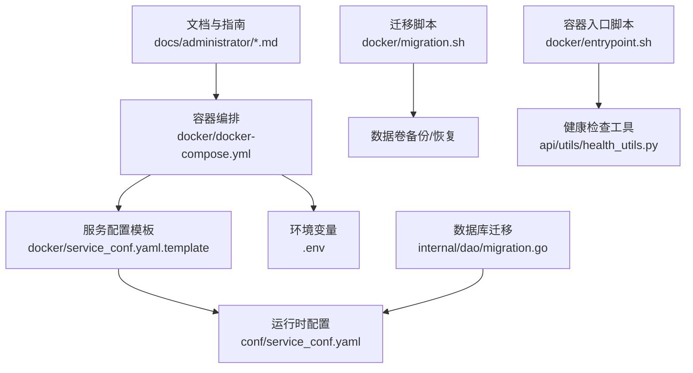
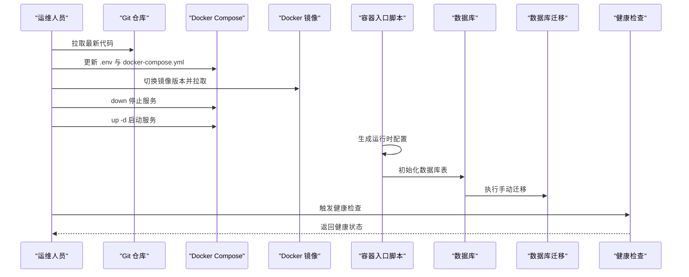
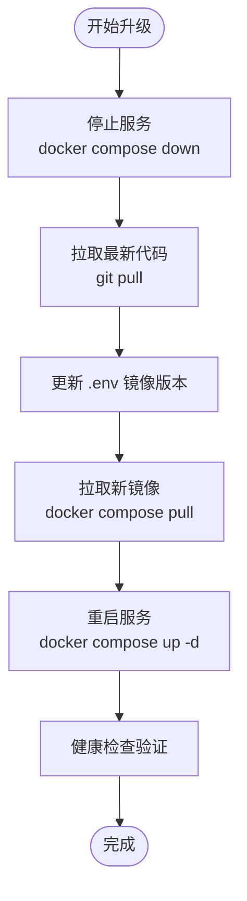
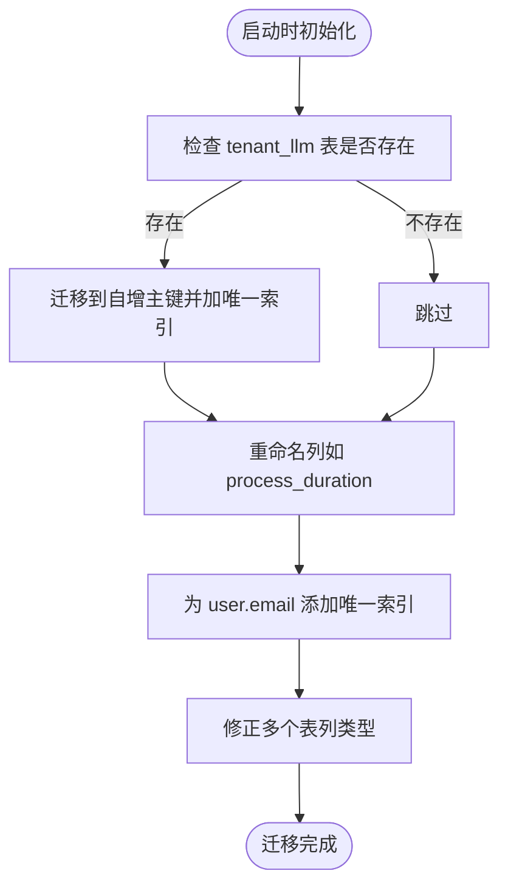
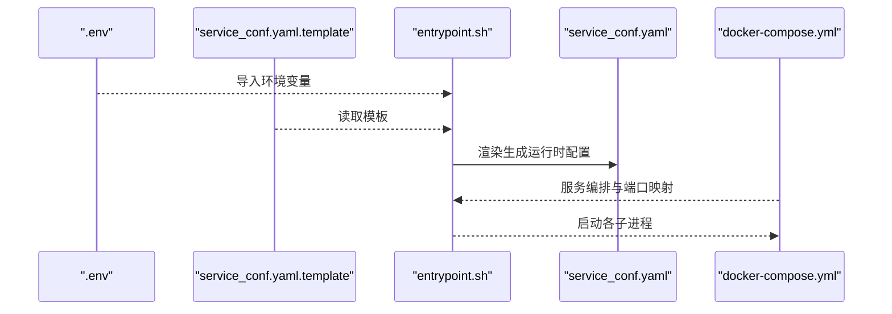
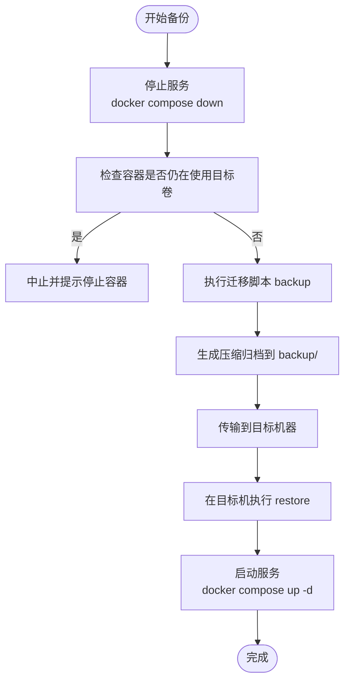
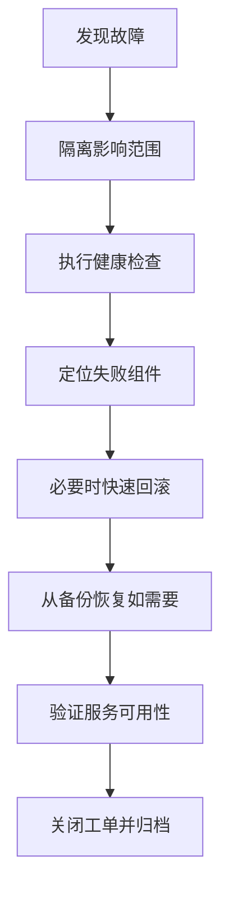
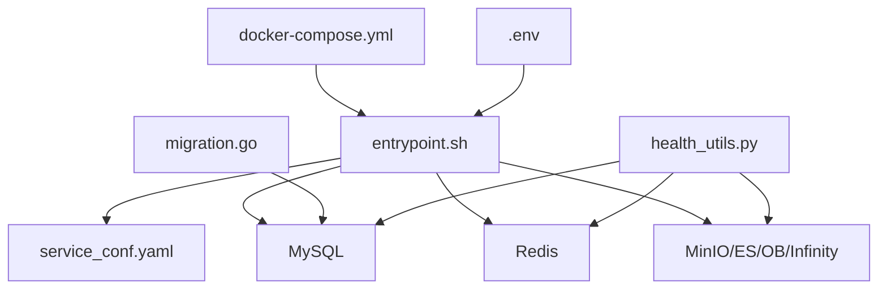

# 升级与维护

<cite>
**本文引用的文件**
- [升级说明（upgrade_ragflow.mdx）](file://docs/administrator/upgrade_ragflow.mdx)
- [备份与迁移（backup_and_migration.md）](file://docs/administrator/backup_and_migration.md)
- [迁移脚本（migration.sh）](file://docker/migration.sh)
- [数据库迁移入口（migration.go）](file://internal/dao/migration.go)
- [Docker Compose 配置（docker-compose.yml）](file://docker/docker-compose.yml)
- [配置模板（service_conf.yaml.template）](file://docker/service_conf.yaml.template)
- [运行时配置（service_conf.yaml）](file://conf/service_conf.yaml)
- [环境变量文件（.env）](file://docker/.env)
- [初始化 SQL（init.sql）](file://docker/init.sql)
- [容器入口脚本（entrypoint.sh）](file://docker/entrypoint.sh)
- [健康检查工具（health_utils.py）](file://api/utils/health_utils.py)
- [配置指南（configurations.md）](file://docs/administrator/configurations.md)
- [可观测性与追踪（tracing.mdx）](file://docs/administrator/tracing.mdx)
</cite>

## 目录
1. [简介](#简介)
2. [项目结构](#项目结构)
3. [核心组件](#核心组件)
4. [架构总览](#架构总览)
5. [详细组件分析](#详细组件分析)
6. [依赖关系分析](#依赖关系分析)
7. [性能考量](#性能考量)
8. [故障排查指南](#故障排查指南)
9. [结论](#结论)
10. [附录](#附录)

## 简介
本文件面向 RAGFlow 运维团队，提供系统化的升级与维护指南。内容覆盖版本升级流程（含数据库迁移、配置更新、服务重启）、数据备份策略（数据库、对象存储、索引与日志）、热修复方案（紧急补丁、快速回滚、零停机更新）、日常维护任务清单、故障处理流程以及运维最佳实践。所有步骤均基于仓库内现有文档与脚本进行梳理与落地。

## 项目结构
RAGFlow 的运维相关能力主要分布在以下位置：
- 文档：docs/administrator 下的升级、备份、配置、可观测性等文档
- 容器编排：docker/docker-compose.yml 及其基础文件
- 配置模板：docker/service_conf.yaml.template 与 conf/service_conf.yaml
- 迁移与备份：docker/migration.sh 脚本
- 数据库迁移：internal/dao/migration.go
- 容器入口与启动：docker/entrypoint.sh
- 健康检查：api/utils/health_utils.py

图表来源
- [升级说明（upgrade_ragflow.mdx）](file://docs/administrator/upgrade_ragflow.mdx)
- [备份与迁移（backup_and_migration.md）](file://docs/administrator/backup_and_migration.md)
- [迁移脚本（migration.sh）](file://docker/migration.sh)
- [数据库迁移入口（migration.go）](file://internal/dao/migration.go)
- [Docker Compose 配置（docker-compose.yml）](file://docker/docker-compose.yml)
- [配置模板（service_conf.yaml.template）](file://docker/service_conf.yaml.template)
- [运行时配置（service_conf.yaml）](file://conf/service_conf.yaml)
- [环境变量文件（.env）](file://docker/.env)
- [容器入口脚本（entrypoint.sh）](file://docker/entrypoint.sh)
- [健康检查工具（health_utils.py）](file://api/utils/health_utils.py)

章节来源
- [升级说明（upgrade_ragflow.mdx）](file://docs/administrator/upgrade_ragflow.mdx)
- [备份与迁移（backup_and_migration.md）](file://docs/administrator/backup_and_migration.md)
- [迁移脚本（migration.sh）](file://docker/migration.sh)
- [数据库迁移入口（migration.go）](file://internal/dao/migration.go)
- [Docker Compose 配置（docker-compose.yml）](file://docker/docker-compose.yml)
- [配置指南（configurations.md）](file://docs/administrator/configurations.md)

## 核心组件
- 升级与回滚
  - 代码与镜像同步升级：先停止服务、拉取最新代码、切换镜像版本、拉取并重启
  - 夜间版与正式版两种升级路径
- 数据库迁移
  - Go 层手动迁移：复合主键转自增主键、列名修正、唯一索引添加、列类型修正
- 配置管理
  - .env 环境变量与 service_conf.yaml 模板驱动运行时配置生成
  - Docker Compose 控制服务暴露端口与资源
- 备份与迁移
  - 使用迁移脚本打包/恢复 MySQL、MinIO、Redis、Elasticsearch 数据卷
- 健康检查与可观测性
  - 健康检查工具对数据库、缓存、文档引擎、存储、RAGFlow 服务、任务执行器进行探测
  - 集成 Langfuse 进行链路追踪与调试

章节来源
- [升级说明（upgrade_ragflow.mdx）](file://docs/administrator/upgrade_ragflow.mdx)
- [数据库迁移入口（migration.go）](file://internal/dao/migration.go)
- [配置指南（configurations.md）](file://docs/administrator/configurations.md)
- [备份与迁移（backup_and_migration.md）](file://docs/administrator/backup_and_migration.md)
- [迁移脚本（migration.sh）](file://docker/migration.sh)
- [容器入口脚本（entrypoint.sh）](file://docker/entrypoint.sh)
- [健康检查工具（health_utils.py）](file://api/utils/health_utils.py)
- [可观测性与追踪（tracing.mdx）](file://docs/administrator/tracing.mdx)

## 架构总览
下图展示升级与维护涉及的关键流程与组件交互：

图表来源
- [升级说明（upgrade_ragflow.mdx）](file://docs/administrator/upgrade_ragflow.mdx)
- [容器入口脚本（entrypoint.sh）](file://docker/entrypoint.sh)
- [数据库迁移入口（migration.go）](file://internal/dao/migration.go)
- [健康检查工具（health_utils.py）](file://api/utils/health_utils.py)

## 详细组件分析

### 升级流程（夜间版与正式版）
- 夜间版升级要点
  - 停止服务、拉取代码、更新 .env 中镜像版本为 nightly、拉取镜像并重启
  - 注意：升级本身不删除历史数据，但 docker compose down -v 会删除数据卷
- 正式版升级要点
  - 切换到目标标签（如 v0.24.0），其余步骤同夜间版
- 离线环境升级
  - 在有网环境保存镜像为 tar，拷贝至目标服务器后加载镜像

图表来源
- [升级说明（upgrade_ragflow.mdx）](file://docs/administrator/upgrade_ragflow.mdx)

章节来源
- [升级说明（upgrade_ragflow.mdx）](file://docs/administrator/upgrade_ragflow.mdx)

### 数据库迁移（Go 层）
- 主要迁移动作
  - tenant_llm 表：复合主键迁移到自增主键，并添加唯一索引
  - 列名修正：task/document 表 process_duation → process_duration
  - user.email 添加唯一索引（无重复时）
  - 多个表列类型修正（top_k、api_key、dialog_id、canvas_template、system_settings、knowledgebase 时间字段等）

图表来源
- [数据库迁移入口（migration.go）](file://internal/dao/migration.go)

章节来源
- [数据库迁移入口（migration.go）](file://internal/dao/migration.go)

### 配置文件更新与服务重启策略
- 配置来源
  - .env：环境变量（如 RAGFLOW_IMAGE、端口、时区等）
  - service_conf.yaml.template：服务配置模板，容器启动时由入口脚本根据 .env 渲染为 conf/service_conf.yaml
  - docker-compose.yml：服务编排、端口映射、卷挂载、重启策略
- 重启策略
  - 配置更新需重启容器生效
  - 入口脚本负责渲染配置、等待依赖服务就绪、按参数启动 Web/任务/数据同步/MCP/Admin 服务

图表来源
- [容器入口脚本（entrypoint.sh）](file://docker/entrypoint.sh)
- [配置指南（configurations.md）](file://docs/administrator/configurations.md)
- [配置模板（service_conf.yaml.template）](file://docker/service_conf.yaml.template)
- [运行时配置（service_conf.yaml）](file://conf/service_conf.yaml)
- [Docker Compose 配置（docker-compose.yml）](file://docker/docker-compose.yml)
- [环境变量文件（.env）](file://docker/.env)

章节来源
- [容器入口脚本（entrypoint.sh）](file://docker/entrypoint.sh)
- [配置指南（configurations.md）](file://docs/administrator/configurations.md)
- [配置模板（service_conf.yaml.template）](file://docker/service_conf.yaml.template)
- [运行时配置（service_conf.yaml）](file://conf/service_conf.yaml)
- [Docker Compose 配置（docker-compose.yml）](file://docker/docker-compose.yml)
- [环境变量文件（.env）](file://docker/.env)

### 数据备份策略
- 备份范围
  - MySQL、MinIO、Redis、Elasticsearch 数据卷
- 备份流程
  - 停止服务（避免 -v 删除卷）
  - 使用迁移脚本 backup 创建压缩归档
  - 支持自定义备份目录与项目名前缀
- 恢复流程
  - 目标机器准备空环境，使用迁移脚本 restore 解压到对应数据卷
  - 如卷已存在会提示覆盖风险并确认
- 单桶模式迁移
  - 通过 service_conf.yaml 或环境变量切换单桶模式，必要时迁移已有数据

图表来源
- [备份与迁移（backup_and_migration.md）](file://docs/administrator/backup_and_migration.md)
- [迁移脚本（migration.sh）](file://docker/migration.sh)

章节来源
- [备份与迁移（backup_and_migration.md）](file://docs/administrator/backup_and_migration.md)
- [迁移脚本（migration.sh）](file://docker/migration.sh)

### 热修复与快速回滚
- 紧急补丁
  - 优先采用“镜像版本回退”或“切换到上一个稳定标签”的方式
  - 若需临时修复代码，建议在隔离环境验证后合并并重新构建镜像
- 快速回滚
  - 回到上一个已知稳定版本：切换代码标签、回滚镜像版本、重启服务
  - 使用迁移脚本确保数据一致性（如需）
- 零停机更新
  - 通过多副本/滚动更新策略（结合编排文件与负载均衡）实现
  - 入口脚本支持禁用 Web/任务/数据同步等组件，便于分阶段上线

章节来源
- [升级说明（upgrade_ragflow.mdx）](file://docs/administrator/upgrade_ragflow.mdx)
- [容器入口脚本（entrypoint.sh）](file://docker/entrypoint.sh)

### 维护任务清单
- 日常维护
  - 定期清理：清理过期日志、临时文件；释放对象存储冗余数据
  - 性能监控：关注数据库连接数、缓存命中率、文档引擎延迟、存储容量
  - 安全更新：镜像与依赖更新、密钥轮换、访问控制加固
  - 许可证与合规：第三方组件许可证审计
- 周期性任务
  - 数据库备份与校验
  - 对象存储与索引健康巡检
  - 配置模板与运行时配置一致性核对

章节来源
- [健康检查工具（health_utils.py）](file://api/utils/health_utils.py)
- [配置指南（configurations.md）](file://docs/administrator/configurations.md)

### 故障处理流程
- 常见问题
  - 服务无法启动：检查入口脚本渲染的运行时配置、依赖服务健康状态
  - 数据库异常：查看迁移是否成功、连接参数是否正确
  - 存储不可用：确认 MinIO/ES/OB 状态与证书配置
- 应急响应
  - 快速回滚至上一稳定版本
  - 使用迁移脚本恢复最近一次备份
  - 通过健康检查工具定位具体组件
- 问题跟踪
  - 记录事件时间、影响范围、处理步骤与根因分析
  - 结合 Langfuse 追踪请求链路，辅助定位检索/生成瓶颈

图表来源
- [健康检查工具（health_utils.py）](file://api/utils/health_utils.py)
- [容器入口脚本（entrypoint.sh）](file://docker/entrypoint.sh)
- [备份与迁移（backup_and_migration.md）](file://docs/administrator/backup_and_migration.md)

章节来源
- [健康检查工具（health_utils.py）](file://api/utils/health_utils.py)
- [可观测性与追踪（tracing.mdx）](file://docs/administrator/tracing.mdx)

### 运维最佳实践
- 变更管理
  - 所有变更必须通过受控分支与 CI/CD 流程
  - 升级前进行预生产验证与数据备份
- 发布策略
  - 分阶段发布（灰度/蓝绿），配合健康检查与自动回滚
  - 版本标签化与镜像签名
- 监控告警
  - 建立数据库、缓存、存储、文档引擎与应用层健康指标
  - 配置阈值告警与自动化处置
- 容量规划
  - 基于查询 QPS、索引增长速率与对象存储用量制定扩容计划
  - 评估 GPU/任务执行器资源需求

章节来源
- [健康检查工具（health_utils.py）](file://api/utils/health_utils.py)
- [配置指南（configurations.md）](file://docs/administrator/configurations.md)

## 依赖关系分析
- 组件耦合
  - 容器入口脚本依赖 .env 与模板渲染运行时配置
  - 服务重启策略与编排文件强关联
  - 数据库迁移在启动阶段执行，依赖运行时配置中的数据库连接
- 外部依赖
  - MySQL、MinIO、Redis、Elasticsearch/OceanBase/Infinity 等作为后端依赖
  - Langfuse 用于链路追踪与调试

图表来源
- [容器入口脚本（entrypoint.sh）](file://docker/entrypoint.sh)
- [运行时配置（service_conf.yaml）](file://conf/service_conf.yaml)
- [Docker Compose 配置（docker-compose.yml）](file://docker/docker-compose.yml)
- [环境变量文件（.env）](file://docker/.env)
- [数据库迁移入口（migration.go）](file://internal/dao/migration.go)
- [健康检查工具（health_utils.py）](file://api/utils/health_utils.py)

章节来源
- [容器入口脚本（entrypoint.sh）](file://docker/entrypoint.sh)
- [运行时配置（service_conf.yaml）](file://conf/service_conf.yaml)
- [Docker Compose 配置（docker-compose.yml）](file://docker/docker-compose.yml)
- [环境变量文件（.env）](file://docker/.env)
- [数据库迁移入口（migration.go）](file://internal/dao/migration.go)
- [健康检查工具（health_utils.py）](file://api/utils/health_utils.py)

## 性能考量
- 数据库层
  - 合理设置最大连接数与超时，避免连接池耗尽
  - 定期清理慢查询与冗余索引
- 缓存层
  - 关注命中率与内存占用，按需调整容量与淘汰策略
- 文档引擎
  - 根据实际场景选择 ES/Infinity/OceanBase 并调优参数
- 存储层
  - 对象存储访问路径优化，单桶模式可减少桶列表开销
- 任务执行器
  - 根据并发与 GPU 资源动态调整 worker 数量

## 故障排查指南
- 健康检查
  - 使用健康检查工具对数据库、缓存、文档引擎、存储、RAGFlow 服务、任务执行器进行探测
  - 关注延迟与错误详情，定位异常组件
- 日志与追踪
  - 查看容器日志与应用日志，结合 Langfuse 追踪请求链路
- 配置核对
  - 确认 .env 与模板渲染后的运行时配置一致
  - 确认编排文件端口映射与网络连通性

章节来源
- [健康检查工具（health_utils.py）](file://api/utils/health_utils.py)
- [可观测性与追踪（tracing.mdx）](file://docs/administrator/tracing.mdx)

## 结论
通过规范的升级流程、完善的备份与迁移机制、严格的健康检查与可观测性体系，RAGFlow 可在生产环境中实现安全、可控、可追溯的持续演进。建议将本文所述流程纳入标准作业手册，并结合自动化工具进一步提升效率与可靠性。

## 附录
- 快速参考
  - 升级：停止服务 → 拉取代码 → 切换镜像 → 拉取镜像 → 重启服务 → 健康检查
  - 备份：停止服务 → 迁移脚本 backup → 传输 → 目标机 restore → 启动服务
  - 回滚：切换到上一稳定标签 → 回滚镜像 → 重启服务 → 健康检查
  - 配置：更新 .env 与模板 → 入口脚本渲染 → 重启容器生效