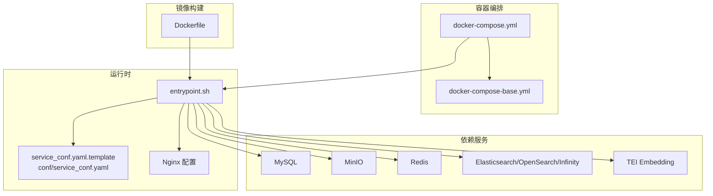
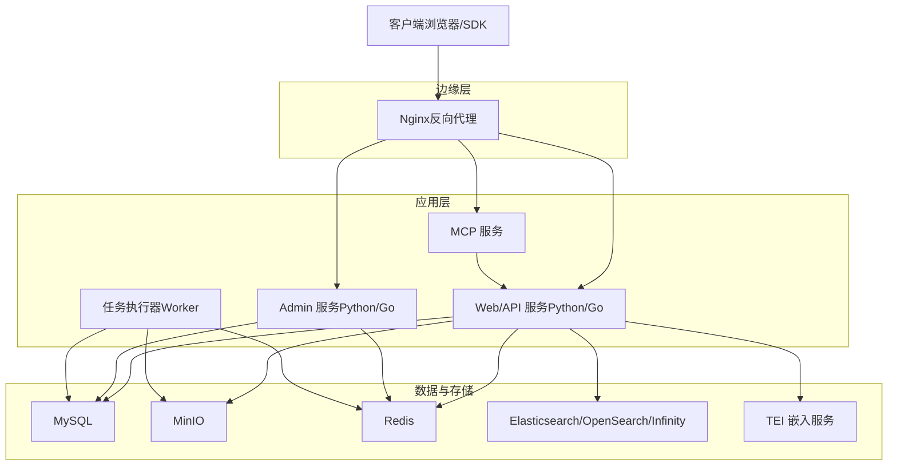
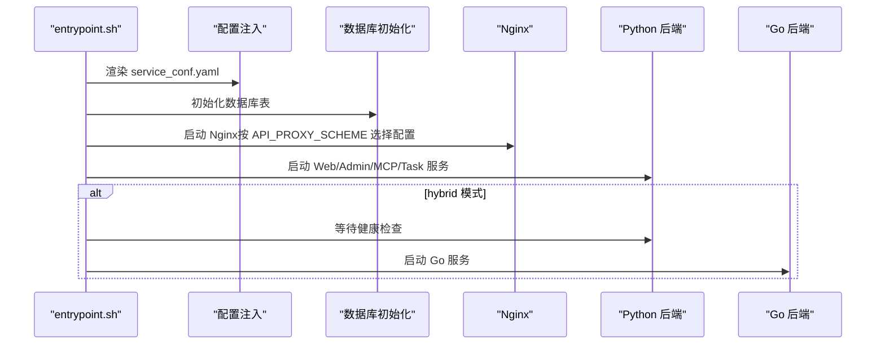
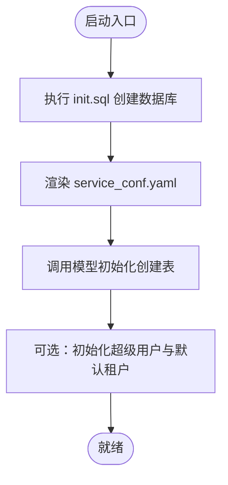
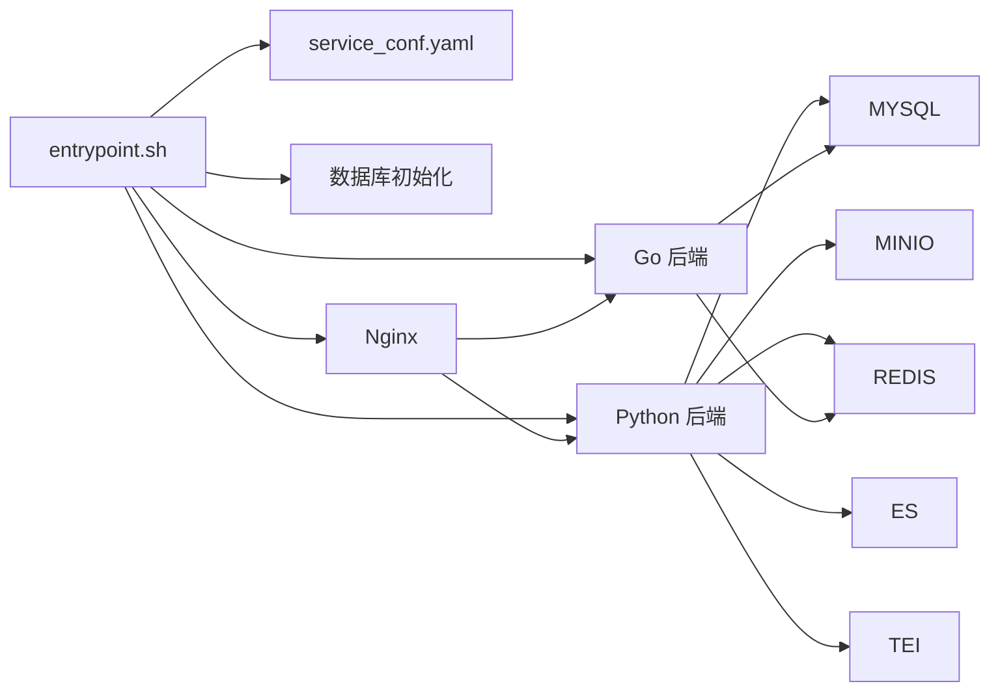

# 生产环境部署

<cite>
**本文引用的文件**   
- [docker-compose.yml](file://docker/docker-compose.yml)
- [docker-compose-base.yml](file://docker/docker-compose-base.yml)
- [Dockerfile](file://Dockerfile)
- [README.md（Docker 部署）](file://docker/README.md)
- [service_conf.yaml.template](file://docker/service_conf.yaml.template)
- [service_conf.yaml](file://conf/service_conf.yaml)
- [entrypoint.sh](file://docker/entrypoint.sh)
- [init.sql](file://docker/init.sql)
- [migration.sh](file://docker/migration.sh)
- [ragflow.conf.golang](file://docker/nginx/ragflow.conf.golang)
- [Chart.yaml](file://helm/Chart.yaml)
- [values.yaml](file://helm/values.yaml)
- [db_models.py](file://api/db/db_models.py)
- [init_data.py](file://api/db/init_data.py)
</cite>

## 目录
1. [简介](#简介)
2. [项目结构](#项目结构)
3. [核心组件](#核心组件)
4. [架构总览](#架构总览)
5. [详细组件分析](#详细组件分析)
6. [依赖关系分析](#依赖关系分析)
7. [性能考量](#性能考量)
8. [故障排查指南](#故障排查指南)
9. [结论](#结论)
10. [附录](#附录)

## 简介
本文件面向生产环境部署 RAGFlow，围绕容器化部署方案（Docker Compose 与 Helm）、镜像构建、服务编排、数据库初始化、Nginx 反向代理、环境变量配置以及部署验证进行系统性说明。内容基于仓库中的 Docker 编排、Nginx 配置、服务配置模板、入口脚本与 Helm Chart 进行整理，确保读者可按步骤完成从基础设施到应用上线的全流程部署。

## 项目结构
RAGFlow 的生产部署主要由以下部分组成：
- 容器编排：docker-compose.yml 与 docker-compose-base.yml 组合，定义应用与依赖服务（MySQL、MinIO、Redis、Elasticsearch/OpenSearch/Infinity、TEI 等）。
- 镜像构建：Dockerfile 定义多阶段构建流程，包含前端打包、Python 环境、Nginx、依赖安装与运行时入口。
- 入口脚本：entrypoint.sh 负责服务配置注入、数据库初始化、Nginx 与后端服务启动、任务执行器与 MCP/Admin 服务管理。
- 服务配置：service_conf.yaml.template 作为模板，通过环境变量渲染生成 conf/service_conf.yaml；conf/service_conf.yaml 提供默认示例。
- Web 代理：Nginx 配置文件用于静态资源、API 路由与缓存策略。
- 迁移工具：migration.sh 支持备份与恢复 MySQL、MinIO、Redis、Elasticsearch 数据卷。
- Helm 部署：Chart.yaml 与 values.yaml 提供在 Kubernetes 上的一键部署参数与资源规格。

图表来源
- [docker-compose.yml:1-135](file://docker/docker-compose.yml#L1-L135)
- [docker-compose-base.yml:1-326](file://docker/docker-compose-base.yml#L1-L326)
- [Dockerfile:1-220](file://Dockerfile#L1-L220)
- [entrypoint.sh:150-340](file://docker/entrypoint.sh#L150-L340)
- [service_conf.yaml.template:1-172](file://docker/service_conf.yaml.template#L1-L172)
- [ragflow.conf.golang:1-34](file://docker/nginx/ragflow.conf.golang#L1-L34)

章节来源
- [docker-compose.yml:1-135](file://docker/docker-compose.yml#L1-L135)
- [docker-compose-base.yml:1-326](file://docker/docker-compose-base.yml#L1-L326)
- [Dockerfile:1-220](file://Dockerfile#L1-L220)
- [entrypoint.sh:150-340](file://docker/entrypoint.sh#L150-L340)
- [service_conf.yaml.template:1-172](file://docker/service_conf.yaml.template#L1-L172)
- [ragflow.conf.golang:1-34](file://docker/nginx/ragflow.conf.golang#L1-L34)

## 核心组件
- 应用服务（CPU/GPU）：通过 ragflow-cpu/ragflow-gpu 两个服务暴露 Web、Admin、MCP、Go 后端等端口，并挂载日志与配置模板。
- 依赖服务：MySQL、MinIO、Redis、Elasticsearch/OpenSearch/Infinity、TEI（嵌入模型服务）、Kibana（可选）。
- 入口脚本：负责渲染 service_conf.yaml、初始化数据库表、启动 Nginx 与后端服务、任务执行器、MCP/Admin 服务。
- Nginx：根据 API_PROXY_SCHEME 切换不同后端代理模式，提供静态资源缓存与 API 路由。
- Helm Chart：提供 Kubernetes 部署参数、存储与资源请求/限制、Ingress/Service 类型等。

章节来源
- [docker-compose.yml:4-135](file://docker/docker-compose.yml#L4-L135)
- [docker-compose-base.yml:176-326](file://docker/docker-compose-base.yml#L176-L326)
- [entrypoint.sh:150-340](file://docker/entrypoint.sh#L150-L340)
- [ragflow.conf.golang:1-34](file://docker/nginx/ragflow.conf.golang#L1-L34)
- [Chart.yaml:1-25](file://helm/Chart.yaml#L1-L25)
- [values.yaml:1-266](file://helm/values.yaml#L1-L266)

## 架构总览
下图展示生产环境典型拓扑：客户端经 Nginx 反向代理访问 Web/API/Admin/MCP 端点；后端服务根据 API_PROXY_SCHEME 选择 Go 或 Python 实现；数据持久化由 MySQL、MinIO、Redis、Elasticsearch/OpenSearch/Infinity 与 TEI 提供；任务执行器通过 Redis 消息队列异步处理。

图表来源
- [docker-compose.yml:4-135](file://docker/docker-compose.yml#L4-L135)
- [docker-compose-base.yml:176-326](file://docker/docker-compose-base.yml#L176-L326)
- [entrypoint.sh:266-337](file://docker/entrypoint.sh#L266-L337)
- [ragflow.conf.golang:13-21](file://docker/nginx/ragflow.conf.golang#L13-L21)

## 详细组件分析

### 容器化部署与服务编排
- docker-compose.yml
  - 定义 ragflow-cpu 与 ragflow-gpu 两套服务，分别映射 Web、Admin、MCP、Go/HTTP 端口，挂载日志目录与配置模板。
  - 通过 env_file 引入 .env，使用 profiles 控制 GPU 能力与 MCP/Admin 开关。
- docker-compose-base.yml
  - 定义 MySQL、MinIO、Redis、Elasticsearch/OpenSearch/Infinity、TEI、Kibana 等依赖服务及其健康检查、端口映射、卷与内存限制。
  - 使用 .env 注入环境变量，如 EXPOSE_MYSQL_PORT、MINIO_*、REDIS_*、ES_PORT、STACK_VERSION 等。

章节来源
- [docker-compose.yml:1-135](file://docker/docker-compose.yml#L1-L135)
- [docker-compose-base.yml:1-326](file://docker/docker-compose-base.yml#L1-L326)

### 镜像构建流程
- 多阶段构建：基础镜像安装系统依赖、Nginx、uv、Node.js、ODBC 驱动、Chrome/Chromedriver 等；构建阶段安装 Python 依赖并打包前端；生产阶段复制运行时产物与 Nginx 配置。
- 运行时入口：Dockerfile 最终 ENTRYPOINT 指向 ./entrypoint.sh，实现配置注入、数据库初始化与服务启动。

章节来源
- [Dockerfile:1-220](file://Dockerfile#L1-L220)

### 入口脚本与启动序列
- 配置注入：读取 service_conf.yaml.template，将其中 ${VAR:-default} 替换为环境变量值，输出 conf/service_conf.yaml。
- 数据库初始化：调用数据库模型初始化逻辑，创建所需表结构。
- 服务启动：
  - 根据 API_PROXY_SCHEME 选择 Nginx 配置文件（golang/python/hybrid）。
  - 启动 Nginx 与后端（Python/Go），Admin 服务同理。
  - 可选：启动数据同步、MCP 服务、任务执行器（支持范围或固定数量）。
- 健康检查：等待后端健康端点可用后再启动对应 Go 服务（hybrid 模式）。

图表来源
- [entrypoint.sh:150-340](file://docker/entrypoint.sh#L150-L340)
- [service_conf.yaml.template:1-172](file://docker/service_conf.yaml.template#L1-172)

章节来源
- [entrypoint.sh:150-340](file://docker/entrypoint.sh#L150-L340)

### 数据库初始化与表结构
- 初始化 SQL：通过 docker-compose-base.yml 将 init.sql 挂载至 MySQL 初始化文件路径，创建 rag_flow 数据库并切换使用。
- 表结构创建：entrypoint.sh 在启动时调用数据库模型初始化逻辑，创建应用所需的表。
- 数据模型：db_models.py 定义了 BaseModel、JSONField、LongTextField 等字段类型与模型基类，适配不同数据库类型（MySQL/OceanBase/Postgres）。
- 初始数据：init_data.py 提供超级用户、LLM 工厂、知识库、画布模板等初始化流程，便于首次部署快速可用。

图表来源
- [docker-compose-base.yml:182-194](file://docker/docker-compose-base.yml#L182-L194)
- [entrypoint.sh:236-240](file://docker/entrypoint.sh#L236-L240)
- [db_models.py:152-200](file://api/db/db_models.py#L152-L200)
- [init_data.py:49-109](file://api/db/init_data.py#L49-L109)

章节来源
- [docker-compose-base.yml:176-202](file://docker/docker-compose-base.yml#L176-L202)
- [entrypoint.sh:236-240](file://docker/entrypoint.sh#L236-L240)
- [db_models.py:152-200](file://api/db/db_models.py#L152-L200)
- [init_data.py:49-109](file://api/db/init_data.py#L49-L109)

### Nginx 反向代理配置
- 配置文件：提供 golang/python/hybrid 三种后端模式的 Nginx 配置，按 API_PROXY_SCHEME 动态选择。
- 路由规则：
  - /api/v1/admin → Admin 服务（127.0.0.1:9383）
  - /v1 或 /api → Web/API 服务（127.0.0.1:9382/9380）
  - / → 前端静态资源（web/dist）
- 缓存策略：对 /static 下的 css/js/media 设置长期缓存与日志关闭。

章节来源
- [ragflow.conf.golang:1-34](file://docker/nginx/ragflow.conf.golang#L1-L34)
- [entrypoint.sh:178-197](file://docker/entrypoint.sh#L178-L197)

### 环境变量与服务配置
- Docker 环境变量（.env）：包含 MySQL、MinIO、Redis、Elasticsearch/Kibana、资源限制、时区、最大文件大小、批处理大小等。
- 服务配置模板（service_conf.yaml.template）：定义 ragflow、mysql、minio、es/os/infinity、oceanbase、redis、user_default_llm 等配置项，支持通过环境变量覆盖默认值。
- 默认配置（service_conf.yaml）：提供示例值，便于本地开发与调试。

章节来源
- [README.md（Docker 部署）:23-271](file://docker/README.md#L23-L271)
- [service_conf.yaml.template:1-172](file://docker/service_conf.yaml.template#L1-L172)
- [service_conf.yaml:1-160](file://conf/service_conf.yaml#L1-L160)

### Helm 部署（Kubernetes）
- Chart.yaml：声明应用类型与版本。
- values.yaml：集中管理环境变量、依赖镜像与版本、存储容量、资源请求/限制、Ingress/Service 类型等。
- 适用场景：在 Kubernetes 集群中一键部署 RAGFlow 及其依赖，便于弹性扩缩容与云原生运维。

章节来源
- [Chart.yaml:1-25](file://helm/Chart.yaml#L1-L25)
- [values.yaml:1-266](file://helm/values.yaml#L1-L266)

## 依赖关系分析
- 组件耦合：
  - 应用服务依赖 MySQL、MinIO、Redis、Elasticsearch/OpenSearch/Infinity、TEI。
  - 入口脚本负责统一初始化与启动顺序，降低各服务间耦合。
- 外部依赖：
  - Docker Compose 与 Docker Engine
  - Nginx、Python 3.12、Node.js、uv、Chrome/Chromedriver
  - 可选：Kibana、Helm（Kubernetes）

图表来源
- [entrypoint.sh:150-340](file://docker/entrypoint.sh#L150-L340)
- [docker-compose.yml:4-135](file://docker/docker-compose.yml#L4-L135)
- [docker-compose-base.yml:176-326](file://docker/docker-compose-base.yml#L176-L326)

## 性能考量
- 内存与连接池：通过 MEM_LIMIT 控制容器内存上限；MySQL max_connections、stale_timeout、max_allowed_packet 等参数影响并发与稳定性。
- 批处理与文件大小：DOC_BULK_SIZE、EMBEDDING_BATCH_SIZE、MAX_CONTENT_LENGTH 影响解析与向量化吞吐量与资源占用。
- 存储与索引：Elasticsearch/OpenSearch/Infinity 的存储容量与副本策略需结合业务规模规划。
- 嵌入模型：TEI 模型加载与 truncate 参数影响推理延迟与显存占用（GPU 模式）。

章节来源
- [docker-compose-base.yml:22-27, 182-190](file://docker/docker-compose-base.yml#L22-L27,L182-L190)
- [README.md（Docker 部署）:107-121](file://docker/README.md#L107-L121)

## 故障排查指南
- 健康检查失败
  - 检查依赖服务健康状态（MySQL、MinIO、Redis、ES/OS、Infinity）与端口映射。
  - 查看容器日志与 ragflow-logs 挂载目录。
- 数据库未初始化
  - 确认 init.sql 是否正确挂载并执行；entrypoint.sh 是否成功调用数据库初始化。
- Nginx 404 或路由异常
  - 确认 API_PROXY_SCHEME 对应的 Nginx 配置已生效；/api 与 /v1 路由是否指向正确后端端口。
- 迁移与备份
  - 使用 migration.sh 备份/恢复 MySQL、MinIO、Redis、Elasticsearch 数据卷；注意停止相关容器后再执行。
- Kubernetes 部署
  - 检查 values.yaml 中镜像、存储、资源与 Ingress 配置；确认 Service/Ingress 类型与域名解析。

章节来源
- [docker-compose-base.yml:27-32, 197-202, 219-224, 237-242, 92-97](file://docker/docker-compose-base.yml#L27-L32,L197-L202,L219-L224,L237-L242,L92-L97)
- [entrypoint.sh:242-258](file://docker/entrypoint.sh#L242-L258)
- [migration.sh:65-138, 151-200, 202-293](file://docker/migration.sh#L65-L138,L151-L200,L202-L293)

## 结论
通过 Docker Compose 与 Helm，RAGFlow 提供了可复用、可扩展的生产级部署方案。结合入口脚本的配置注入与数据库初始化能力，配合 Nginx 的多后端代理模式，可在单机或集群环境中快速上线。建议在生产中关注资源规划、存储容量、安全加固（HTTPS、认证）与监控告警，以保障高可用与高性能。

## 附录

### A. 生产环境部署步骤（Docker Compose）
- 准备 .env 与 service_conf.yaml.template，按需调整数据库、对象存储、Redis、时区、文件大小、批处理等参数。
- 启动依赖服务与应用服务：
  - docker compose -f docker/docker-compose.yml up -d
- 首次初始化：
  - 确认 MySQL 健康并执行 init.sql；入口脚本会自动创建数据库与表。
  - 如需初始化超级用户，可通过入口脚本参数启用。
- 访问与验证：
  - Web：http://host:SVR_WEB_HTTP_PORT
  - Admin：http://host:ADMIN_SVR_HTTP_PORT
  - API：http://host:SVR_HTTP_PORT
  - MCP：http://host:SVR_MCP_PORT（如启用）

章节来源
- [docker-compose.yml:1-135](file://docker/docker-compose.yml#L1-L135)
- [docker-compose-base.yml:176-202](file://docker/docker-compose-base.yml#L176-L202)
- [entrypoint.sh:236-240](file://docker/entrypoint.sh#L236-L240)

### B. 生产环境配置要点
- 硬件资源
  - CPU/GPU：根据模型与并发需求配置容器资源与 GPU 设备分配。
  - 内存：MEM_LIMIT 控制容器内存上限，避免 OOM。
- 网络
  - 端口映射：SVR_WEB_HTTP_PORT、SVR_HTTP_PORT、ADMIN_SVR_HTTP_PORT、SVR_MCP_PORT、GO_HTTP_PORT、GO_ADMIN_PORT。
  - Ingress/LoadBalancer：Kubernetes 场景下通过 values.yaml 配置 Service 类型与 Ingress。
- 存储
  - 卷：esdata01、infinity_data、mysql_data、minio_data、redis_data 等按需扩容。
  - 对象存储：MinIO/兼容 S3/OSS/GCS 配置于 service_conf.yaml.template。
- 安全
  - HTTPS：参考 README 中 Let’s Encrypt 获取证书与 Nginx HTTPS 配置。
  - 认证：MySQL/MinIO/Redis 密码、Elasticsearch/OpenSearch 用户名密码。

章节来源
- [docker-compose-base.yml:301-326](file://docker/docker-compose-base.yml#L301-L326)
- [README.md（Docker 部署）:200-271](file://docker/README.md#L200-L271)
- [service_conf.yaml.template:1-172](file://docker/service_conf.yaml.template#L1-L172)

### C. 数据库初始化流程
- 执行 init.sql 创建 rag_flow 数据库并切换使用。
- 入口脚本调用数据库模型初始化逻辑创建表。
- 可选：初始化超级用户与默认租户、LLM 工厂、知识库模板等。

章节来源
- [docker-compose-base.yml:182-194](file://docker/docker-compose-base.yml#L182-L194)
- [entrypoint.sh:236-240](file://docker/entrypoint.sh#L236-L240)
- [init_data.py:49-109](file://api/db/init_data.py#L49-L109)

### D. Nginx 反向代理配置指南
- 选择后端模式：API_PROXY_SCHEME=golang/python/hybrid。
- 路由规则：/api/v1/admin → Admin；/v1 或 /api → Web/API；/ → 前端静态资源。
- 缓存：/static 下资源长期缓存，提升前端加载性能。
- HTTPS：挂载证书文件并切换到 HTTPS 配置文件。

章节来源
- [entrypoint.sh:178-197](file://docker/entrypoint.sh#L178-L197)
- [ragflow.conf.golang:1-34](file://docker/nginx/ragflow.conf.golang#L1-L34)
- [README.md（Docker 部署）:200-271](file://docker/README.md#L200-L271)

### E. 环境变量配置说明
- MySQL：MYSQL_PASSWORD、MYSQL_PORT、EXPOSE_MYSQL_PORT、MYSQL_DBNAME 等。
- MinIO：MINIO_USER、MINIO_PASSWORD、MINIO_PORT、MINIO_CONSOLE_PORT、MINIO_BUCKET 等。
- Redis：REDIS_PASSWORD、REDIS_PORT。
- Elasticsearch/OpenSearch：STACK_VERSION、ELASTIC_PASSWORD、OPENSEARCH_PASSWORD、ES_PORT/OS_PORT。
- 资源与行为：MEM_LIMIT、TZ、MAX_CONTENT_LENGTH、DOC_BULK_SIZE、EMBEDDING_BATCH_SIZE。
- 服务端口：SVR_HTTP_PORT、SVR_WEB_HTTP_PORT、SVR_WEB_HTTPS_PORT、ADMIN_SVR_HTTP_PORT、SVR_MCP_PORT、GO_HTTP_PORT、GO_ADMIN_PORT。

章节来源
- [README.md（Docker 部署）:23-121](file://docker/README.md#L23-L121)

### F. 部署验证步骤
- 健康检查：等待各依赖服务健康；入口脚本会轮询后端健康端点。
- 功能测试：访问 Web/Admin/API/MCP 端点，确认静态资源与接口响应。
- 性能基准：结合业务场景压测 API 与嵌入模型推理延迟，调整批处理大小与资源配额。

章节来源
- [entrypoint.sh:242-258](file://docker/entrypoint.sh#L242-L258)
- [docker-compose-base.yml:27-32, 63-67, 92-97, 197-202, 219-224, 237-242](file://docker/docker-compose-base.yml#L27-L32,L63-L67,L92-L97,L197-L202,L219-L224,L237-L242)