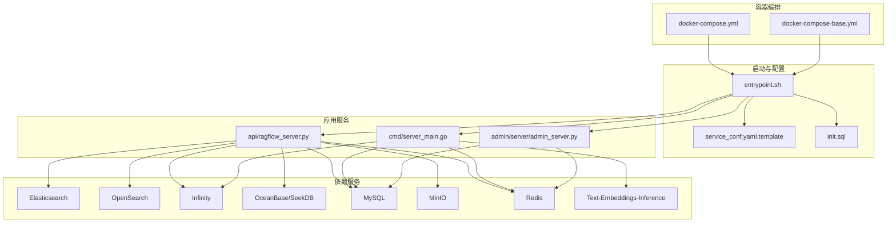
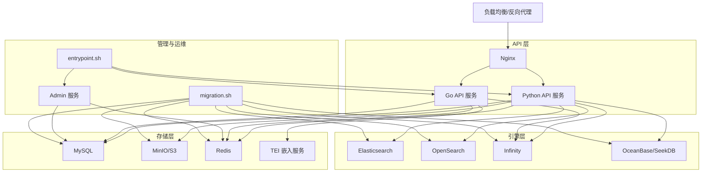
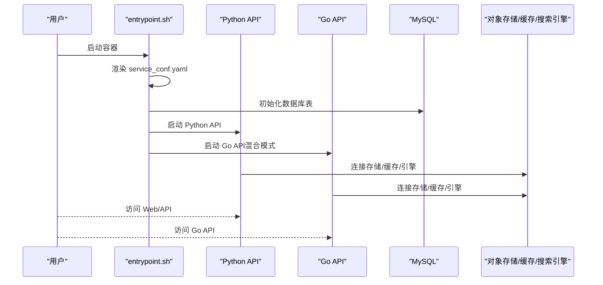
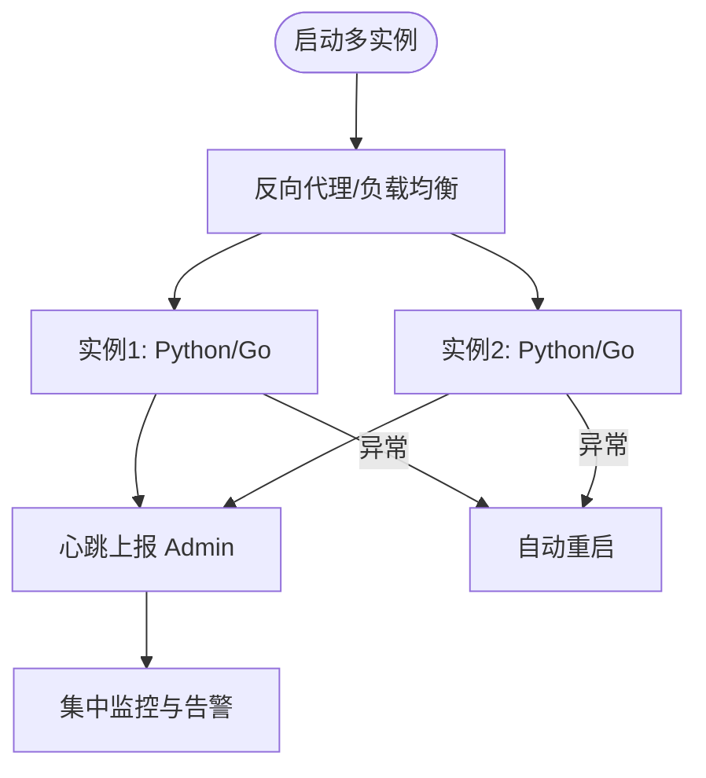
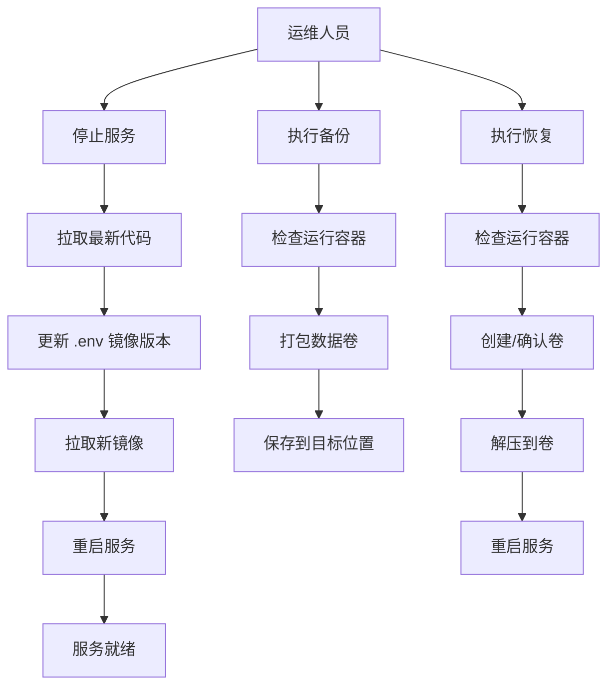
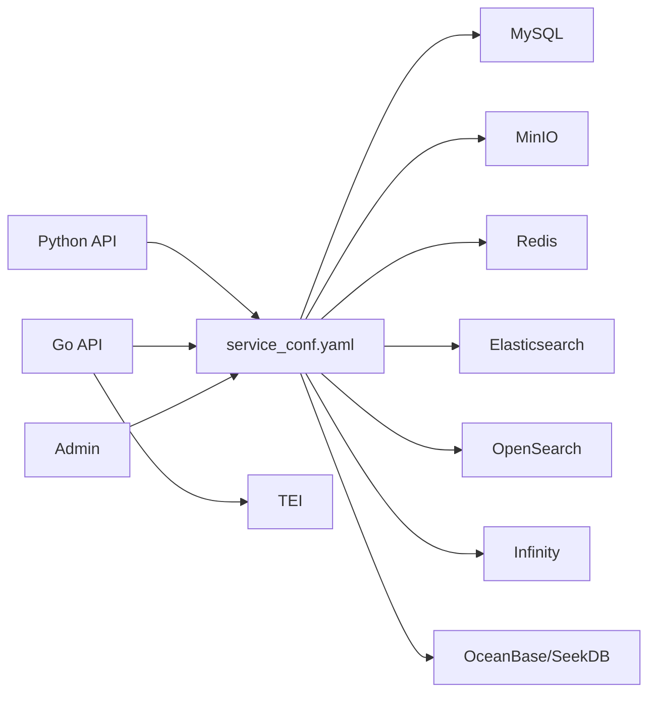

# 部署指南

<cite>
**本文引用的文件**
- [docker/docker-compose.yml](file://docker/docker-compose.yml)
- [docker/docker-compose-base.yml](file://docker/docker-compose-base.yml)
- [docker/service_conf.yaml.template](file://docker/service_conf.yaml.template)
- [docker/entrypoint.sh](file://docker/entrypoint.sh)
- [docker/migration.sh](file://docker/migration.sh)
- [docker/init.sql](file://docker/init.sql)
- [Dockerfile](file://Dockerfile)
- [cmd/server_main.go](file://cmd/server_main.go)
- [api/ragflow_server.py](file://api/ragflow_server.py)
- [admin/server/admin_server.py](file://admin/server/admin_server.py)
- [helm/Chart.yaml](file://helm/Chart.yaml)
- [helm/values.yaml](file://helm/values.yaml)
- [helm/templates/ragflow.yaml](file://helm/templates/ragflow.yaml)
- [docs/administrator/upgrade_ragflow.mdx](file://docs/administrator/upgrade_ragflow.mdx)
- [docs/administrator/backup_and_migration.md](file://docs/administrator/backup_and_migration.md)
- [docs/administrator/configurations.md](file://docs/administrator/configurations.md)
</cite>

## 目录
1. [简介](#简介)
2. [项目结构](#项目结构)
3. [核心组件](#核心组件)
4. [架构总览](#架构总览)
5. [详细组件分析](#详细组件分析)
6. [依赖关系分析](#依赖关系分析)
7. [性能考虑](#性能考虑)
8. [故障排查指南](#故障排查指南)
9. [结论](#结论)
10. [附录](#附录)

## 简介
本指南面向运维工程师与平台管理员，系统性阐述 RAGFlow 在生产环境中的部署与运维实践，覆盖容器化部署、高可用架构、升级与维护、多环境配置（云平台/本地/混合）以及安全加固与性能优化建议。内容基于仓库内 Docker Compose、Helm Chart、启动脚本与官方文档整理而成，确保可落地、可验证。

## 项目结构
RAGFlow 的部署由“容器编排 + 启动入口 + 配置模板 + 运维脚本”构成，核心文件如下：
- 容器编排：docker/docker-compose.yml 与 docker/docker-compose-base.yml
- 启动入口：docker/entrypoint.sh 负责按参数组合启动 Web/Go 服务、任务执行器、数据同步与 Admin 服务
- 配置模板：docker/service_conf.yaml.template 动态生成运行时配置
- 应用入口：Python API 服务 api/ragflow_server.py 与 Go API 服务 cmd/server_main.go
- 运维工具：docker/migration.sh 提供数据卷备份/恢复能力
- 包管理：Dockerfile 定义镜像构建与运行时环境
- 平台部署：helm/* 提供 Kubernetes 部署方案

图表来源
- [docker/docker-compose.yml:1-135](file://docker/docker-compose.yml#L1-L135)
- [docker/docker-compose-base.yml:1-326](file://docker/docker-compose-base.yml#L1-L326)
- [docker/entrypoint.sh:150-340](file://docker/entrypoint.sh#L150-L340)
- [docker/service_conf.yaml.template:1-172](file://docker/service_conf.yaml.template#L1-L172)
- [docker/init.sql:1-2](file://docker/init.sql#L1-L2)
- [api/ragflow_server.py:100-155](file://api/ragflow_server.py#L100-L155)
- [cmd/server_main.go:45-153](file://cmd/server_main.go#L45-L153)
- [admin/server/admin_server.py:42-85](file://admin/server/admin_server.py#L42-L85)

章节来源
- [docker/docker-compose.yml:1-135](file://docker/docker-compose.yml#L1-L135)
- [docker/docker-compose-base.yml:1-326](file://docker/docker-compose-base.yml#L1-L326)
- [docker/entrypoint.sh:150-340](file://docker/entrypoint.sh#L150-L340)
- [docker/service_conf.yaml.template:1-172](file://docker/service_conf.yaml.template#L1-L172)
- [docker/init.sql:1-2](file://docker/init.sql#L1-L2)
- [api/ragflow_server.py:100-155](file://api/ragflow_server.py#L100-L155)
- [cmd/server_main.go:45-153](file://cmd/server_main.go#L45-L153)
- [admin/server/admin_server.py:42-85](file://admin/server/admin_server.py#L42-L85)

## 核心组件
- 启动入口与控制流
  - entrypoint.sh 支持通过参数启用/禁用 Web 服务、任务执行器、数据同步、Admin 服务与 MCP 服务器；根据 API_PROXY_SCHEME 切换 Nginx 配置；负责初始化 Docling 模型与数据库表；在“混合模式”下协调 Python 与 Go 服务的健康检查与启动顺序。
- 应用服务
  - Python API 服务：api/ragflow_server.py 初始化数据库、运行时配置与插件，启动 WSGI HTTP 服务。
  - Go API 服务：cmd/server_main.go 初始化日志、配置、数据库、缓存、存储工厂、分词器与查询构建器，注册路由并启动 HTTP 服务，同时向 Admin 服务上报心跳。
  - Admin 服务：admin/server/admin_server.py 基于 Flask 启动管理后台，负责认证与会话。
- 配置体系
  - service_conf.yaml.template 通过环境变量动态渲染，定义数据库、对象存储、搜索引擎、缓存、嵌入服务等连接参数。
  - .env 与 docker-compose.yml 提供端口映射、镜像版本、资源限制等环境变量。
- 数据与持久化
  - MySQL、MinIO、Redis、Elasticsearch/OpenSearch/Infinity/OceanBase/SeekDB 使用 Docker 卷持久化；init.sql 初始化数据库。
- 运维脚本
  - migration.sh 提供备份/恢复所有数据卷（MySQL、MinIO、Redis、Elasticsearch/OpenSearch/Infinity/SeekDB）的能力，并进行前置校验与交互确认。

章节来源
- [docker/entrypoint.sh:150-340](file://docker/entrypoint.sh#L150-L340)
- [api/ragflow_server.py:100-155](file://api/ragflow_server.py#L100-L155)
- [cmd/server_main.go:45-153](file://cmd/server_main.go#L45-L153)
- [admin/server/admin_server.py:42-85](file://admin/server/admin_server.py#L42-L85)
- [docker/service_conf.yaml.template:1-172](file://docker/service_conf.yaml.template#L1-L172)
- [docker/docker-compose.yml:1-135](file://docker/docker-compose.yml#L1-L135)
- [docker/docker-compose-base.yml:1-326](file://docker/docker-compose-base.yml#L1-L326)
- [docker/migration.sh:1-350](file://docker/migration.sh#L1-L350)
- [docker/init.sql:1-2](file://docker/init.sql#L1-L2)

## 架构总览
RAGFlow 生产部署采用“容器化 + 多引擎 + 双栈服务”的架构：
- 容器层：以 Docker Compose 编排，统一管理 API、Admin、搜索引擎、数据库、对象存储、缓存与嵌入服务。
- 服务层：Python API 与 Go API 双栈服务，支持混合模式（Nginx 转发至 Python/Go），提升吞吐与稳定性。
- 引擎层：支持 Elasticsearch、OpenSearch、Infinity、OceanBase/SeekDB 多种文档检索后端，满足不同规模与合规要求。
- 存储层：MySQL（元数据）、MinIO/S3 兼容对象存储（文件）、Redis（缓存/会话）。
- 运维层：entrypoint.sh 统一入口，migration.sh 数据迁移与备份，Helm Chart 支持 Kubernetes 部署。

图表来源
- [docker/entrypoint.sh:150-340](file://docker/entrypoint.sh#L150-L340)
- [docker/docker-compose.yml:1-135](file://docker/docker-compose.yml#L1-L135)
- [docker/docker-compose-base.yml:1-326](file://docker/docker-compose-base.yml#L1-L326)
- [api/ragflow_server.py:100-155](file://api/ragflow_server.py#L100-L155)
- [cmd/server_main.go:45-153](file://cmd/server_main.go#L45-L153)
- [admin/server/admin_server.py:42-85](file://admin/server/admin_server.py#L42-L85)
- [docker/migration.sh:1-350](file://docker/migration.sh#L1-L350)

## 详细组件分析

### 容器化部署（Docker Compose）
- 服务编排
  - docker-compose.yml 定义 ragflow-cpu/gpu 两个服务，挂载日志目录与配置模板，暴露 Web/API/Admin/MCP/Go 端口，设置重启策略与额外主机映射。
  - docker-compose-base.yml 定义依赖服务：Elasticsearch/OpenSearch、Infinity、OceanBase/SeekDB、MySQL、MinIO、Redis、TEI、Kibana 等，含健康检查、资源限制与持久化卷。
- 启动流程
  - entrypoint.sh 解析参数，动态渲染 service_conf.yaml，按 API_PROXY_SCHEME 切换 Nginx 配置，启动数据库初始化与 Docling 检查，随后启动 Python/Go API 与 Admin 服务，并在混合模式下等待健康检查后启动对应后端。
- 配置注入
  - service_conf.yaml.template 通过环境变量渲染，包含数据库、搜索引擎、对象存储、缓存、嵌入服务等连接参数；init.sql 在首次启动时创建默认数据库。

图表来源
- [docker/entrypoint.sh:150-340](file://docker/entrypoint.sh#L150-L340)
- [docker/service_conf.yaml.template:1-172](file://docker/service_conf.yaml.template#L1-L172)
- [docker/init.sql:1-2](file://docker/init.sql#L1-L2)
- [api/ragflow_server.py:100-155](file://api/ragflow_server.py#L100-L155)
- [cmd/server_main.go:45-153](file://cmd/server_main.go#L45-L153)

章节来源
- [docker/docker-compose.yml:1-135](file://docker/docker-compose.yml#L1-L135)
- [docker/docker-compose-base.yml:1-326](file://docker/docker-compose-base.yml#L1-L326)
- [docker/entrypoint.sh:150-340](file://docker/entrypoint.sh#L150-L340)
- [docker/service_conf.yaml.template:1-172](file://docker/service_conf.yaml.template#L1-L172)
- [docker/init.sql:1-2](file://docker/init.sql#L1-L2)

### 高可用与多实例部署
- 多实例与负载均衡
  - 在容器编排层面，可通过复制 ragflow 服务副本并在反向代理层做健康检查与轮询实现横向扩展；Go API 服务内置心跳上报 Admin 服务，便于集中监控。
- 数据一致性与状态
  - MySQL/MinIO/Redis/搜索引擎均使用持久化卷；对象存储与数据库需确保多副本或外部托管以满足高可用。
- 故障恢复
  - entrypoint.sh 对各子进程采用“失败自动重启 + 无限循环”策略；migration.sh 提供离线备份/恢复，降低故障影响面。

图表来源
- [cmd/server_main.go:240-261](file://cmd/server_main.go#L240-L261)
- [docker/entrypoint.sh:308-337](file://docker/entrypoint.sh#L308-L337)

章节来源
- [cmd/server_main.go:240-261](file://cmd/server_main.go#L240-L261)
- [docker/entrypoint.sh:308-337](file://docker/entrypoint.sh#L308-L337)

### 升级与维护流程
- 版本升级
  - 升级需同步更新代码与镜像，遵循官方文档步骤：停止服务、拉取最新代码、更新 .env 中镜像版本、拉取镜像并重启。
- 离线升级
  - 在具备网络的环境保存镜像，拷贝到目标服务器加载后重启。
- 数据备份与恢复
  - 使用 migration.sh 执行备份/恢复，脚本会检查运行中容器、确认目标卷、打包压缩数据卷并解压还原，支持自定义项目名与备份目录。

图表来源
- [docs/administrator/upgrade_ragflow.mdx:18-102](file://docs/administrator/upgrade_ragflow.mdx#L18-L102)
- [docker/migration.sh:151-293](file://docker/migration.sh#L151-L293)

章节来源
- [docs/administrator/upgrade_ragflow.mdx:18-102](file://docs/administrator/upgrade_ragflow.mdx#L18-L102)
- [docker/migration.sh:151-293](file://docker/migration.sh#L151-L293)

### 不同部署环境配置指南
- 云平台部署（Kubernetes）
  - 使用 Helm Chart：Chart.yaml 描述 Chart 信息；values.yaml 提供全局环境变量与各组件资源/存储/服务类型配置；templates/ragflow.yaml 定义 Deployment/Service/Ingress。
- 本地部署（Docker）
  - 使用 docker-compose.yml 与 docker-compose-base.yml，结合 .env 与 service_conf.yaml.template 完成端口映射、镜像版本与后端选择。
- 混合部署
  - 通过 API_PROXY_SCHEME 与混合模式，Nginx 将请求转发至 Python 或 Go 后端，实现渐进式迁移与性能优化。

章节来源
- [helm/Chart.yaml:1-25](file://helm/Chart.yaml#L1-L25)
- [helm/values.yaml:1-266](file://helm/values.yaml#L1-L266)
- [helm/templates/ragflow.yaml:1-150](file://helm/templates/ragflow.yaml#L1-L150)
- [docker/docker-compose.yml:1-135](file://docker/docker-compose.yml#L1-L135)
- [docker/docker-compose-base.yml:1-326](file://docker/docker-compose-base.yml#L1-L326)
- [docker/entrypoint.sh:178-197](file://docker/entrypoint.sh#L178-L197)

## 依赖关系分析
- 组件耦合
  - Python API 与 Go API 共享同一配置源（service_conf.yaml）与后端服务（MySQL、MinIO、Redis、搜索引擎），通过 Nginx/反向代理对外提供统一入口。
- 外部依赖
  - Elasticsearch/OpenSearch/Infinity/OceanBase/SeekDB、MySQL、MinIO、Redis、TEI、Kibana 等均为独立容器，通过网络与卷进行连接与持久化。
- 循环依赖
  - 未发现直接循环依赖；Admin 服务与 API 服务通过心跳上报与配置共享实现弱耦合。

图表来源
- [docker/service_conf.yaml.template:1-172](file://docker/service_conf.yaml.template#L1-L172)
- [api/ragflow_server.py:100-155](file://api/ragflow_server.py#L100-L155)
- [cmd/server_main.go:45-153](file://cmd/server_main.go#L45-L153)
- [admin/server/admin_server.py:42-85](file://admin/server/admin_server.py#L42-L85)

章节来源
- [docker/service_conf.yaml.template:1-172](file://docker/service_conf.yaml.template#L1-L172)
- [api/ragflow_server.py:100-155](file://api/ragflow_server.py#L100-L155)
- [cmd/server_main.go:45-153](file://cmd/server_main.go#L45-L153)
- [admin/server/admin_server.py:42-85](file://admin/server/admin_server.py#L42-L85)

## 性能考虑
- 双栈服务与混合模式
  - Go API 服务具备更低延迟与更高吞吐潜力；在混合模式下，Nginx 可按策略将请求分流至 Python/Go，实现性能与兼容性的平衡。
- 资源与并发
  - 通过 .env 设置 MEM_LIMIT 控制内存上限；MySQL 通过 max_connections 与 stale_timeout 控制连接池；Redis 使用 LRU 策略限制内存占用。
- 搜索引擎与向量库
  - Elasticsearch/OpenSearch/Infinity/OceanBase/SeekDB 的存储容量与副本数应与业务规模匹配；合理设置磁盘水位阈值与健康检查间隔。
- 嵌入服务
  - TEI 模型与端口通过 .env 配置，建议根据 GPU/CPU 场景选择合适镜像与模型。

章节来源
- [docker/docker-compose-base.yml:176-202](file://docker/docker-compose-base.yml#L176-L202)
- [docker/docker-compose-base.yml:225-241](file://docker/docker-compose-base.yml#L225-L241)
- [docker/docker-compose-base.yml:244-276](file://docker/docker-compose-base.yml#L244-L276)
- [docs/administrator/configurations.md:65-127](file://docs/administrator/configurations.md#L65-L127)

## 故障排查指南
- 启动失败
  - 检查 entrypoint.sh 日志与容器健康检查输出；确认 service_conf.yaml 是否正确渲染；验证数据库初始化是否成功。
- 数据不一致或丢失
  - 使用 migration.sh 备份/恢复数据卷；注意不要误用 -v 参数删除卷；确认项目名与备份目录一致。
- 端口冲突或访问异常
  - 校验 docker-compose.yml 端口映射与 .env 中端口变量；确认防火墙与安全组放行。
- Admin 服务不可达
  - 确认 Admin 服务已启用并监听 9381 端口；检查与 API 服务的心跳上报状态。

章节来源
- [docker/entrypoint.sh:242-258](file://docker/entrypoint.sh#L242-L258)
- [docker/migration.sh:65-138](file://docker/migration.sh#L65-L138)
- [docs/administrator/backup_and_migration.md:46-148](file://docs/administrator/backup_and_migration.md#L46-L148)

## 结论
通过容器化编排、双栈服务与多引擎支持，RAGFlow 能够在多样化环境中实现稳定、可扩展与可维护的生产部署。配合迁移脚本与 Helm Chart，可在云平台与本地环境快速落地。建议在上线前完成端到端演练（升级、备份、恢复、扩容/缩容），并建立完善的监控与告警体系。

## 附录
- 最佳实践清单
  - 使用独立项目名与备份目录，避免跨环境混淆。
  - 在生产环境启用 TLS 与最小权限访问策略。
  - 对数据库与对象存储实施定期备份与异地容灾。
  - 通过 Helm/Compose 的资源限制与健康检查保障稳定性。
- 安全加固要点
  - 严格管理 .env 与 service_conf.yaml 中的密钥与敏感参数。
  - 限制 Admin 服务暴露范围，仅对内网开放或通过 VPN/网关访问。
  - 定期更新镜像与依赖，修补已知漏洞。