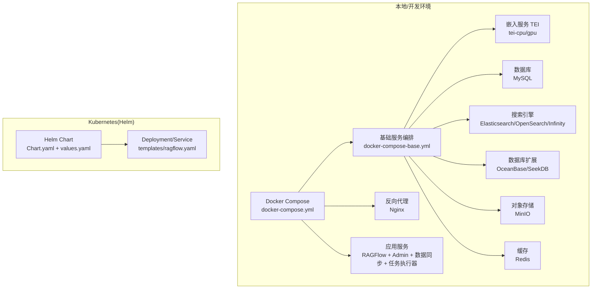
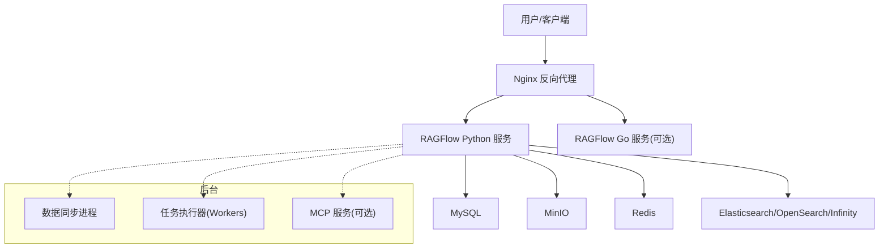
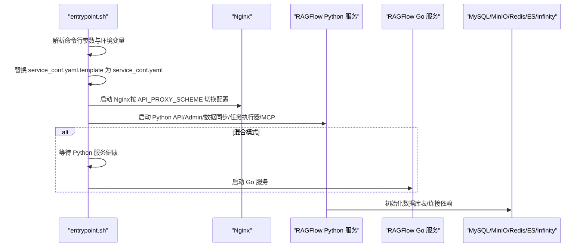
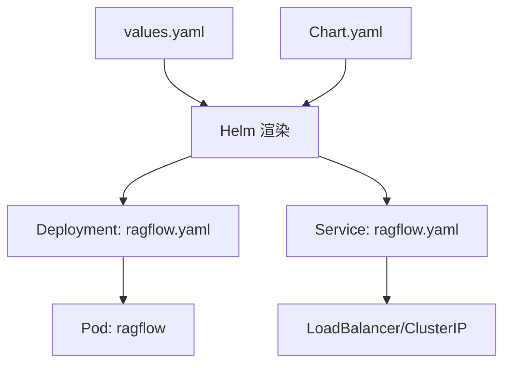
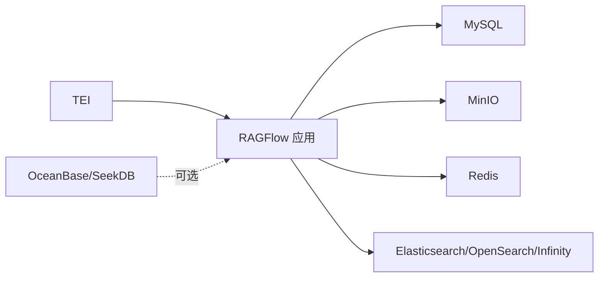

# 部署环境场景

<cite>
**本文引用的文件**
- [docker-compose.yml](file://docker/docker-compose.yml)
- [docker-compose-base.yml](file://docker/docker-compose-base.yml)
- [docker-compose-macos.yml](file://docker/docker-compose-macos.yml)
- [docker-compose-CN-oc9.yml](file://docker/docker-compose-CN-oc9.yml)
- [service_conf.yaml.template](file://docker/service_conf.yaml.template)
- [service_conf.yaml](file://conf/service_conf.yaml)
- [Dockerfile](file://Dockerfile)
- [entrypoint.sh](file://docker/entrypoint.sh)
- [Chart.yaml](file://helm/Chart.yaml)
- [values.yaml](file://helm/values.yaml)
- [ragflow.yaml](file://helm/templates/ragflow.yaml)
- [configurations.md](file://docs/administrator/configurations.md)
</cite>

## 目录
1. [简介](#简介)
2. [项目结构](#项目结构)
3. [核心组件](#核心组件)
4. [架构总览](#架构总览)
5. [详细组件分析](#详细组件分析)
6. [依赖关系分析](#依赖关系分析)
7. [性能考量](#性能考量)
8. [故障排查指南](#故障排查指南)
9. [结论](#结论)
10. [附录](#附录)

## 简介
本指南面向不同部署环境场景，系统化梳理 RAGFlow 的云原生与本地部署方案，覆盖以下主题：
- 云平台部署：AWS、Azure、GCP 等主流云服务的容器与托管数据库/对象存储/缓存等资源编排思路
- 本地部署：物理服务器、虚拟机、开发环境的单机与多节点部署要点
- 混合部署：公有云与私有云结合、多数据中心、边缘计算等复杂场景的实施路径
- 操作系统支持：Linux 发行版、macOS、Windows（WSL）的差异化配置与注意事项
- 资源规划：CPU、内存、存储、网络的规划建议与性能评估方法
- 自动化工具链：Ansible、Terraform、CI/CD 流水线的集成实践

## 项目结构
RAGFlow 提供多套部署入口与配置模板，核心包括：
- Docker Compose：用于本地与开发环境的一键编排，包含后端服务（MySQL、MinIO、Redis、Elasticsearch/OpenSearch/Infinity、OceanBase/SeekDB）、嵌入服务（Text-Embeddings-Inference）以及应用服务（RAGFlow 前后端）
- Helm Chart：用于 Kubernetes 集群的标准化发布，支持多种文档引擎与外部依赖
- 配置模板：.env 环境变量、service_conf.yaml.template 动态生成 service_conf.yaml，控制后端服务连接与默认模型
- 启动脚本：entrypoint.sh 负责按参数启动 Web、Admin、数据同步、任务执行器、MCP 服务，并根据 API_PROXY_SCHEME 切换 Nginx 配置

图表来源
- [docker-compose.yml:1-135](file://docker/docker-compose.yml#L1-L135)
- [docker-compose-base.yml:1-326](file://docker/docker-compose-base.yml#L1-L326)
- [Chart.yaml:1-25](file://helm/Chart.yaml#L1-L25)
- [values.yaml:1-266](file://helm/values.yaml#L1-L266)
- [ragflow.yaml:1-150](file://helm/templates/ragflow.yaml#L1-L150)

章节来源
- [docker-compose.yml:1-135](file://docker/docker-compose.yml#L1-L135)
- [docker-compose-base.yml:1-326](file://docker/docker-compose-base.yml#L1-L326)
- [Chart.yaml:1-25](file://helm/Chart.yaml#L1-L25)
- [values.yaml:1-266](file://helm/values.yaml#L1-L266)
- [ragflow.yaml:1-150](file://helm/templates/ragflow.yaml#L1-L150)

## 核心组件
- 应用服务
  - RAGFlow API 与前端：通过 Nginx 反向代理，支持 Go/Python/混合模式切换
  - Admin 服务：独立管理接口，可启用/禁用
  - 数据同步：从各数据源拉取并入库
  - 任务执行器：基于 Redis 消息队列的异步任务处理
  - MCP 服务：可选的 MCP 协议服务入口
- 基础设施
  - MySQL：元数据与用户数据
  - 对象存储：MinIO（兼容 S3）
  - 缓存：Redis（Valkey）
  - 文档引擎：Elasticsearch、OpenSearch 或 Infinity（可选）
  - 数据库扩展：OceanBase/SeekDB（可选）
  - 嵌入服务：Text-Embeddings-Inference（TEI），支持 CPU/GPU 模式
- 配置与启动
  - .env 环境变量：控制端口、密码、镜像、时区等
  - service_conf.yaml.template：动态生成 service_conf.yaml，定义后端服务连接信息
  - entrypoint.sh：按参数启动各子进程，自动等待依赖健康检查

章节来源
- [entrypoint.sh:1-340](file://docker/entrypoint.sh#L1-L340)
- [service_conf.yaml.template:1-172](file://docker/service_conf.yaml.template#L1-L172)
- [service_conf.yaml:1-160](file://conf/service_conf.yaml#L1-L160)
- [docker-compose.yml:1-135](file://docker/docker-compose.yml#L1-L135)
- [docker-compose-base.yml:1-326](file://docker/docker-compose-base.yml#L1-L326)

## 架构总览
下图展示 Docker Compose 场景下的典型拓扑与交互流程。

图表来源
- [docker-compose.yml:1-135](file://docker/docker-compose.yml#L1-L135)
- [docker-compose-base.yml:1-326](file://docker/docker-compose-base.yml#L1-L326)
- [entrypoint.sh:266-337](file://docker/entrypoint.sh#L266-L337)

章节来源
- [docker-compose.yml:1-135](file://docker/docker-compose.yml#L1-L135)
- [docker-compose-base.yml:1-326](file://docker/docker-compose-base.yml#L1-L326)
- [entrypoint.sh:266-337](file://docker/entrypoint.sh#L266-L337)

## 详细组件分析

### 云平台部署方案（AWS/Azure/GCP）
- 容器化与编排
  - 使用 Docker Compose 或 Helm Chart 在云厂商提供的容器服务上运行（如 ECS/EKS/AKS）
  - 将 .env 中的敏感信息以密钥管理服务（AWS Secrets Manager/Azure Key Vault/GCP Secret Manager）注入
  - 文档引擎与对象存储建议使用云厂商托管版本（如托管 Elasticsearch/OpenSearch、S3 兼容存储）
- 资源与网络
  - 将数据库、对象存储、缓存置于 VPC 内部，仅暴露必要的负载均衡器端点
  - 使用安全组/防火墙策略限制访问范围，启用 TLS 终止于 Ingress/NLB
- 成本优化
  - 选择合适的实例规格与存储类型；对不常访问的数据使用分层存储
  - 利用预留实例或批量折扣；在测试环境使用 Spot 实例
  - 合理设置副本数与自动伸缩阈值，避免资源浪费

说明：本节为通用云原生部署建议，未直接分析具体文件，故不附加“章节来源”。

### 本地部署配置（物理/虚拟机/开发环境）
- 单机 Docker Compose
  - 使用 docker/docker-compose.yml 与 docker/docker-compose-base.yml 启动
  - 修改 .env 中端口映射与密码，确保宿主机端口未被占用
  - 如需 macOS 平台运行，可参考 docker/docker-compose-macos.yml 的平台限定与镜像构建
- 多节点与高可用
  - 将 MySQL、MinIO、Redis、Elasticsearch/OpenSearch/Infinity 独立部署为集群
  - 通过 service_conf.yaml.template 指定外部服务地址与凭据
- 开发环境
  - 使用 docker/docker-compose-CN-oc9.yml（非官方维护）进行快速验证，或基于标准 Compose 进行裁剪

章节来源
- [docker-compose.yml:1-135](file://docker/docker-compose.yml#L1-L135)
- [docker-compose-base.yml:1-326](file://docker/docker-compose-base.yml#L1-L326)
- [docker-compose-macos.yml:1-47](file://docker/docker-compose-macos.yml#L1-L47)
- [docker-compose-CN-oc9.yml:1-63](file://docker/docker-compose-CN-oc9.yml#L1-L63)

### 混合部署架构（公有云+私有云/多数据中心/边缘）
- 公有云与私有云结合
  - 将核心 API 与管理界面部署在公有云，数据与敏感计算迁移至私有云
  - 通过专线/VPN/VPC 对等互联，统一 Nginx/Ingress 作为入口
- 多数据中心
  - 使用 Kubernetes 多集群或多命名空间实现跨域容灾
  - 采用 Helm values.yaml 中的全局镜像仓库与拉取密钥，保证镜像一致性
- 边缘计算
  - 在边缘侧部署轻量级 TEI 与任务执行器，集中式 API 与数据库位于中心
  - 通过异步同步与增量备份保障数据一致性

章节来源
- [values.yaml:1-266](file://helm/values.yaml#L1-L266)
- [ragflow.yaml:1-150](file://helm/templates/ragflow.yaml#L1-L150)

### 操作系统支持与注意事项
- Linux（推荐）
  - 使用标准 Docker/Compose/Helm 工具链，GPU 驱动与内核版本需满足 TEI 与 GPU 部署要求
- macOS
  - 使用 docker/docker-compose-macos.yml，注意平台限定与镜像架构（linux/amd64）
  - 若需 Apple Silicon，确认镜像与依赖兼容性
- Windows
  - 推荐 WSL2 环境运行 Docker，避免 Windows 文件系统与权限问题
  - 如需 GUI 依赖（如浏览器驱动），在 WSL2 中配置显示转发

章节来源
- [docker-compose-macos.yml:1-47](file://docker/docker-compose-macos.yml#L1-L47)
- [Dockerfile:1-220](file://Dockerfile#L1-L220)

### 配置与启动流程（代码级）
- 启动顺序与健康检查
  - 依赖服务（MySQL、MinIO、Redis、Elasticsearch/OpenSearch/Infinity）先于应用服务启动并完成健康检查
  - entrypoint.sh 会轮询等待依赖就绪后再启动对应进程
- 动态配置生成
  - service_conf.yaml.template 中的环境变量占位符在容器启动时被替换为 service_conf.yaml
- Nginx 配置切换
  - 根据 API_PROXY_SCHEME 选择 golang/python/hybrid 配置文件

图表来源
- [entrypoint.sh:150-337](file://docker/entrypoint.sh#L150-L337)
- [docker-compose-base.yml:176-242](file://docker/docker-compose-base.yml#L176-L242)

章节来源
- [entrypoint.sh:150-337](file://docker/entrypoint.sh#L150-L337)
- [docker-compose-base.yml:176-242](file://docker/docker-compose-base.yml#L176-L242)

### 配置文件详解
- .env（示例字段）
  - 端口映射：SVR_HTTP_PORT、MINIO_PORT、REDIS_PORT、ES_PORT、OS_PORT、INFINITY_* 等
  - 密码与凭据：MYSQL_PASSWORD、MINIO_PASSWORD、REDIS_PASSWORD、ELASTIC_PASSWORD、OPENSEARCH_PASSWORD
  - 时区与镜像：TZ、RAGFLOW_IMAGE、TEI_IMAGE_CPU/GPU、TEI_MODEL
- service_conf.yaml.template
  - 定义 ragflow/admin、mysql、minio、es/os、infinity、oceanbase/seekdb、redis 等连接参数
  - 支持外部服务地址与凭据覆盖，便于在不同环境间切换
- service_conf.yaml
  - 由模板生成，实际生效的运行时配置

章节来源
- [configurations.md:14-245](file://docs/administrator/configurations.md#L14-L245)
- [service_conf.yaml.template:1-172](file://docker/service_conf.yaml.template#L1-L172)
- [service_conf.yaml:1-160](file://conf/service_conf.yaml#L1-L160)

### Kubernetes（Helm）部署
- Chart 与 Values
  - Chart.yaml 描述 Chart 类型与版本
  - values.yaml 定义全局镜像仓库、文档引擎、资源请求/限制、服务类型、Ingress 等
- 模板渲染
  - templates/ragflow.yaml 渲染 Deployment/Service，挂载 Nginx 配置与 service_conf 覆盖
  - 支持 Admin 服务开关与端口配置

图表来源
- [Chart.yaml:1-25](file://helm/Chart.yaml#L1-L25)
- [values.yaml:1-266](file://helm/values.yaml#L1-L266)
- [ragflow.yaml:1-150](file://helm/templates/ragflow.yaml#L1-L150)

章节来源
- [Chart.yaml:1-25](file://helm/Chart.yaml#L1-L25)
- [values.yaml:1-266](file://helm/values.yaml#L1-L266)
- [ragflow.yaml:1-150](file://helm/templates/ragflow.yaml#L1-L150)

## 依赖关系分析
- 组件耦合
  - 应用服务强依赖 MySQL、MinIO、Redis、Elasticsearch/OpenSearch/Infinity
  - TEI 作为嵌入服务可独立部署，通过 service_conf.yaml.template 指定其地址
- 外部依赖
  - 文档引擎可选：Elasticsearch、OpenSearch、Infinity
  - 对象存储：MinIO（兼容 S3）
  - 缓存：Redis（Valkey）
  - 数据库扩展：OceanBase/SeekDB（可选）

图表来源
- [docker-compose-base.yml:176-242](file://docker/docker-compose-base.yml#L176-L242)
- [service_conf.yaml.template:1-172](file://docker/service_conf.yaml.template#L1-L172)

章节来源
- [docker-compose-base.yml:176-242](file://docker/docker-compose-base.yml#L176-L242)
- [service_conf.yaml.template:1-172](file://docker/service_conf.yaml.template#L1-L172)

## 性能考量
- 资源规划建议
  - CPU：根据并发查询与嵌入计算需求，为 API 与 TEI 分配足够 CPU；任务执行器按队列长度与峰值吞吐调整副本数
  - 内存：Elasticsearch/OpenSearch/Infinity 对内存敏感，建议至少 16Gi；MySQL/MinIO/Redis 也需预留充足内存
  - 存储：对象存储容量按上传文件规模估算；数据库与日志目录需独立挂载并开启快照/备份
  - 网络：Nginx/Ingress 层做限流与超时配置，避免后端过载
- 性能评估方法
  - 基准测试：使用测试工具对检索、嵌入、推理进行压测，记录延迟与吞吐
  - 观察指标：容器 CPU/内存/磁盘 IO、数据库连接数、队列积压、错误率
  - 调优策略：分片/副本扩容、缓存命中率提升、索引优化、模型量化或降维

说明：本节提供通用指导，未直接分析具体文件，故不附加“章节来源”。

## 故障排查指南
- 启动失败
  - 检查依赖健康状态：MySQL、MinIO、Redis、ES/OS/Infinity 是否通过健康检查
  - 查看容器日志：Nginx、Python/Go 服务、任务执行器、数据同步进程
- 配置问题
  - 确认 service_conf.yaml.template 中的环境变量是否正确注入
  - 校验 .env 中端口映射与外部访问策略
- 嵌入服务异常
  - TEI 模型加载失败或端口冲突，检查 TEI_IMAGE、TEI_PORT、TEI_MODEL
- 权限与认证
  - MinIO/MySQL/Redis 凭据不匹配导致连接失败
  - OAuth/OIDC 回调地址与注册信息一致

章节来源
- [entrypoint.sh:242-258](file://docker/entrypoint.sh#L242-L258)
- [docker-compose-base.yml:27-34](file://docker/docker-compose-base.yml#L27-L34)
- [docker-compose-base.yml:197-202](file://docker/docker-compose-base.yml#L197-L202)
- [docker-compose-base.yml:219-224](file://docker/docker-compose-base.yml#L219-L224)
- [docker-compose-base.yml:237-242](file://docker/docker-compose-base.yml#L237-L242)

## 结论
RAGFlow 提供了从单机到云原生的完整部署路径。通过 Docker Compose 快速落地，借助 Helm Chart 实现规模化与标准化，配合灵活的配置模板与启动脚本，可在不同操作系统与复杂网络环境中稳定运行。建议在生产中结合云厂商托管能力与自动化工具链，持续优化资源与成本。

## 附录
- 自动化工具链集成
  - Ansible：编写 Playbook 统一安装 Docker/Compose/Helm，推送 .env 与 service_conf.yaml 模板
  - Terraform：编排 VPC、安全组、ECS/EKS/AKS、托管数据库与对象存储，输出密钥给 Helm/Compose 注入
  - CI/CD：在流水线中构建镜像、渲染 Helm Chart、执行健康检查与灰度发布

说明：本节为通用实践建议，未直接分析具体文件，故不附加“章节来源”。