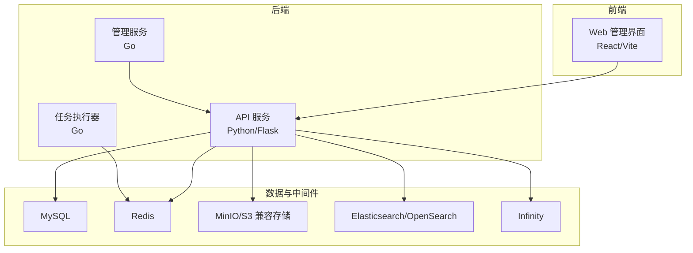
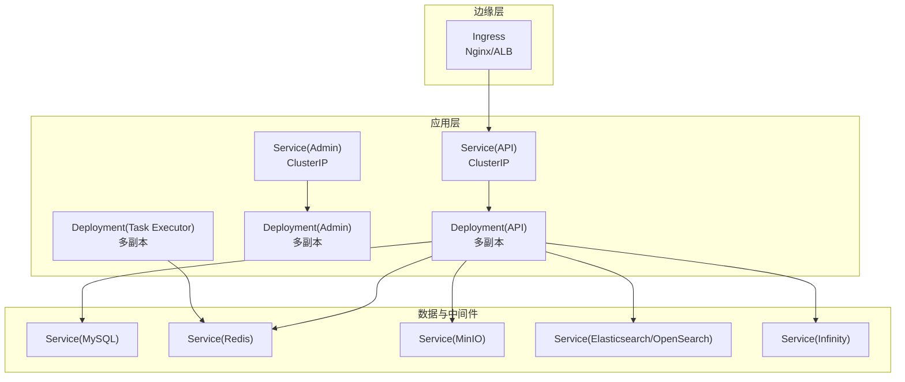
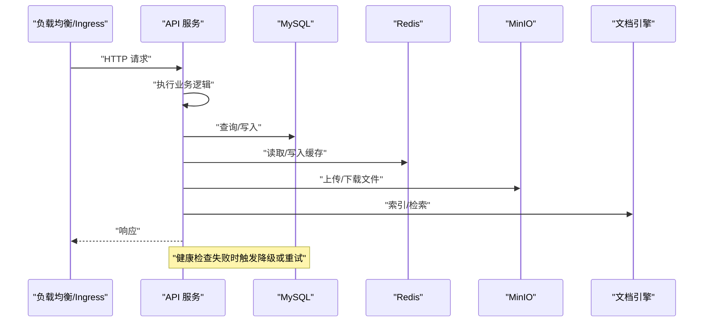
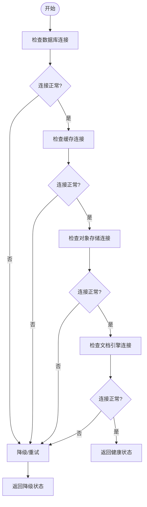
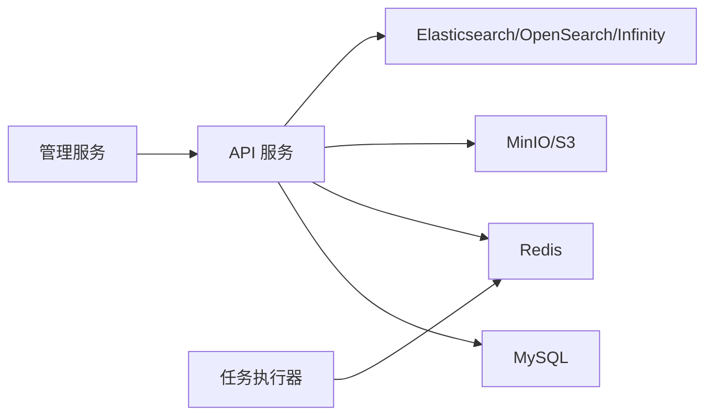

# 高可用架构

<cite>
**本文引用的文件**
- [Chart.yaml](file://helm/Chart.yaml)
- [values.yaml](file://helm/values.yaml)
- [ragflow.yaml](file://helm/templates/ragflow.yaml)
- [ingress.yaml](file://helm/templates/ingress.yaml)
- [docker-compose.yml](file://docker/docker-compose.yml)
- [service_conf.yaml](file://conf/service_conf.yaml)
- [health_utils.py](file://api/utils/health_utils.py)
- [scheduled_task.go](file://internal/utility/scheduled_task.go)
- [redis.go](file://internal/cache/redis.go)
- [common_service.py](file://api/db/services/common_service.py)
- [migration.sh](file://docker/migration.sh)
- [backup_and_migration.md](file://docs/administrator/backup_and_migration.md)
- [configurations.md](file://docs/administrator/configurations.md)
- [monitoring.tsx](file://web/src/pages/admin/monitoring.tsx)
</cite>

## 目录
1. [引言](#引言)
2. [项目结构](#项目结构)
3. [核心组件](#核心组件)
4. [架构总览](#架构总览)
5. [详细组件分析](#详细组件分析)
6. [依赖关系分析](#依赖关系分析)
7. [性能考虑](#性能考虑)
8. [故障排查指南](#故障排查指南)
9. [结论](#结论)
10. [附录](#附录)

## 引言
本技术文档面向RAGFlow在生产环境中的高可用部署与运维，围绕“多实例部署、负载均衡、服务发现”等高可用设计，系统性阐述“数据库/缓存/对象存储”的数据同步与一致性保障，以及“健康检查、自动故障转移、服务降级”等容灾策略。同时提供基于Kubernetes的容器化部署（含Helm Chart）与监控告警配置建议，并给出性能优化实践，帮助读者构建稳定、可扩展、可观测的RAGFlow平台。

## 项目结构
RAGFlow采用前后端分离与多语言混合架构：Go后端提供核心服务与任务执行，Python生态负责API与工具链，前端使用React/Vite构建管理界面；数据层由MySQL、Redis、对象存储（MinIO/S3）与文档引擎（Elasticsearch/Infinity/OpenSearch）组成；容器化与编排通过Docker Compose与Helm实现。

图示来源
- [docker-compose.yml:4-135](file://docker/docker-compose.yml#L4-L135)
- [service_conf.yaml:1-160](file://conf/service_conf.yaml#L1-L160)

章节来源
- [docker-compose.yml:1-135](file://docker/docker-compose.yml#L1-135)
- [service_conf.yaml:1-160](file://conf/service_conf.yaml#L1-L160)

## 核心组件
- 多实例与副本
  - 后端服务支持通过容器编排横向扩展，API与任务执行器均可按需增加副本数。
  - 前端通过反向代理或Ingress统一入口，结合后端服务实现水平扩展。
- 负载均衡
  - 在Kubernetes中通过Service与Ingress实现流量分发；在Docker Compose中通过端口映射与外部LB协作。
- 服务发现
  - 通过Kubernetes Service DNS或外部注册中心进行服务发现；容器内通过服务配置文件解析依赖地址。
- 数据一致性
  - 关系型数据依赖MySQL；缓存使用Redis；对象存储采用MinIO/S3；文档检索引擎支持ES/OpenSearch/Infinity。
- 容灾与恢复
  - 提供健康检查、重试与降级策略；提供数据迁移脚本与文档，确保跨环境安全迁移。

章节来源
- [docker-compose.yml:4-135](file://docker/docker-compose.yml#L4-L135)
- [service_conf.yaml:1-160](file://conf/service_conf.yaml#L1-L160)

## 架构总览
下图展示RAGFlow在Kubernetes中的典型高可用拓扑：前端通过Ingress暴露，后端API与任务执行器以Deployment运行，共享MySQL、Redis、MinIO与文档引擎。通过Helm Chart统一管理配置与资源。

图示来源
- [ingress.yaml:1-43](file://helm/templates/ingress.yaml#L1-L43)
- [ragflow.yaml:92-128](file://helm/templates/ragflow.yaml#L92-L128)
- [values.yaml:105-128](file://helm/values.yaml#L105-L128)

## 详细组件分析

### 多实例与副本配置
- Kubernetes
  - 通过Helm values定义各组件镜像、资源请求与副本策略；API与Admin服务默认以ClusterIP暴露，可通过Ingress对外提供HTTP访问。
  - 可在values中调整Deployment策略（如滚动更新参数）、资源配额与持久化存储。
- Docker Compose
  - 支持CPU/GPU两类服务模板，分别映射不同端口并挂载配置与日志目录；通过depends_on与健康检查保证启动顺序。

章节来源
- [values.yaml:77-128](file://helm/values.yaml#L77-L128)
- [docker-compose.yml:4-135](file://docker/docker-compose.yml#L4-L135)

### 负载均衡与服务发现
- Ingress路由
  - Helm模板提供Ingress资源，支持TLS与主机路径配置；可按需启用并绑定到API或Web服务。
- 服务发现
  - Pod内部通过服务配置文件解析依赖地址（如MySQL、Redis、MinIO、文档引擎），实现解耦与动态发现。

章节来源
- [ingress.yaml:1-43](file://helm/templates/ingress.yaml#L1-L43)
- [service_conf.yaml:1-160](file://conf/service_conf.yaml#L1-L160)

### 健康检查与自动故障转移
- 健康检查
  - 后端提供统一健康检查接口，覆盖数据库、缓存、文档引擎、对象存储与自身服务状态；包含延迟、慢查询、连接池等指标。
- 自动故障转移
  - 通过Kubernetes探针与外部LB健康检查联动，实现故障节点摘除与流量切换；任务执行器通过Redis心跳维持存活状态。
- 降级策略
  - 当下游依赖不可用时，可返回降级响应或延迟重试，避免级联故障。

图示来源
- [health_utils.py:329-365](file://api/utils/health_utils.py#L329-L365)
- [redis.go:165-186](file://internal/cache/redis.go#L165-L186)

章节来源
- [health_utils.py:329-365](file://api/utils/health_utils.py#L329-L365)
- [redis.go:165-186](file://internal/cache/redis.go#L165-L186)

### 数据同步与一致性保障
- 数据库
  - 采用单实例MySQL（Helm Chart默认）；生产建议引入主从复制或托管数据库（如RDS/Cloud SQL）以提升可用性与备份能力。
- 缓存
  - Redis用于消息队列与会话缓存；通过健康检查与信息采集保障可用性；任务执行器使用Redis集合与有序集维护心跳与任务分发。
- 对象存储
  - 默认使用MinIO；支持单桶模式与多桶模式；迁移文档提供跨环境数据迁移流程与脚本。
- 文档引擎
  - 支持Elasticsearch、OpenSearch与Infinity；健康检查分别针对各引擎提供状态与性能指标。

图示来源
- [health_utils.py:329-365](file://api/utils/health_utils.py#L329-L365)

章节来源
- [redis.go:410-520](file://internal/cache/redis.go#L410-L520)
- [backup_and_migration.md:14-148](file://docs/administrator/backup_and_migration.md#L14-L148)

### 故障恢复与数据迁移
- 迁移脚本
  - 提供备份与恢复流程，支持自定义项目名与备份目录；在目标机自动创建卷并解压数据。
- 迁移指南
  - 包含多桶到单桶模式切换、IAM策略示例与路径结构差异说明，便于跨云/跨环境迁移。

章节来源
- [migration.sh:151-293](file://docker/migration.sh#L151-L293)
- [backup_and_migration.md:14-148](file://docs/administrator/backup_and_migration.md#L14-L148)

### 监控与告警
- Prometheus/Grafana
  - Docker Compose示例展示了如何将RAGFlow容器与Prometheus对接；前端管理页集成Alertmanager页面，便于集中查看告警。
- 指标采集
  - 建议采集API延迟、错误率、数据库连接数、缓存命中率、对象存储可用性与文档引擎QPS等关键指标。

章节来源
- [docker-compose.yml:50-101](file://docker/docker-compose.yml#L50-L101)
- [monitoring.tsx:10-16](file://web/src/pages/admin/monitoring.tsx#L10-L16)

## 依赖关系分析
- 组件耦合
  - API服务对数据库、缓存、对象存储与文档引擎存在直接依赖；任务执行器依赖Redis进行消息分发与心跳检测。
- 外部依赖
  - Helm Chart通过values集中管理镜像版本、资源配额与服务暴露方式；Service配置文件集中管理后端依赖地址。
- 循环依赖
  - 代码层面未见循环导入；容器编排上通过Service与DNS避免直接耦合。

图示来源
- [service_conf.yaml:1-160](file://conf/service_conf.yaml#L1-L160)
- [values.yaml:105-128](file://helm/values.yaml#L105-L128)

章节来源
- [service_conf.yaml:1-160](file://conf/service_conf.yaml#L1-L160)
- [values.yaml:105-128](file://helm/values.yaml#L105-L128)

## 性能考虑
- 资源限制
  - 在Helm values中为各组件设置CPU/内存请求与限制，避免资源争抢；根据业务峰值预留缓冲。
- 并发与连接
  - 数据库最大连接数与超时配置需结合实例规格与查询特征调优；缓存连接池大小与过期策略影响命中率与内存占用。
- 缓存策略
  - 利用Redis有序集合与集合管理任务与心跳，合理设置TTL与清理策略；对热点数据进行预热与分片。
- 存储与索引
  - 对象存储采用单桶模式可降低桶列表开销；文档引擎根据查询模式选择合适的分片与副本策略。

## 故障排查指南
- 健康检查
  - 使用健康检查接口快速定位数据库、缓存、存储与引擎异常；关注延迟阈值与慢查询统计。
- 重试与降级
  - 对于瞬时性错误（如网络抖动、锁冲突）采用指数退避重试；对下游不可用场景返回降级响应。
- 任务执行器
  - 检查Redis集合与有序集中的心跳数据，确认任务执行器存活与消息堆积情况。

章节来源
- [health_utils.py:329-365](file://api/utils/health_utils.py#L329-L365)
- [common_service.py:34-75](file://api/db/services/common_service.py#L34-L75)
- [redis.go:307-344](file://internal/cache/redis.go#L307-L344)

## 结论
RAGFlow提供了清晰的高可用架构基础：通过容器化与编排实现多实例与弹性伸缩，借助健康检查与重试机制保障稳定性，配合数据迁移与监控体系实现平滑运维。建议在生产环境中进一步完善数据库主从/托管方案、缓存集群与对象存储的高可用部署，并持续优化资源配额与缓存策略以获得最佳性能与成本平衡。

## 附录
- Kubernetes部署要点
  - 使用Helm Chart安装时，先配置values中的镜像、资源与服务暴露方式；启用Ingress并配置TLS；为各有状态组件配置持久化存储。
- Docker Compose部署要点
  - 通过.env与service_conf.yaml.template注入环境变量与服务配置；注意端口映射与卷挂载；GPU实例需开启NVIDIA设备访问。
- 配置参考
  - 参考管理员文档中的配置项与最佳实践，确保各组件版本兼容与参数合理。

章节来源
- [Chart.yaml:1-25](file://helm/Chart.yaml#L1-L25)
- [values.yaml:1-266](file://helm/values.yaml#L1-L266)
- [configurations.md:1-245](file://docs/administrator/configurations.md#L1-L245)