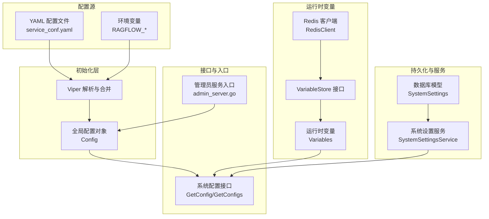
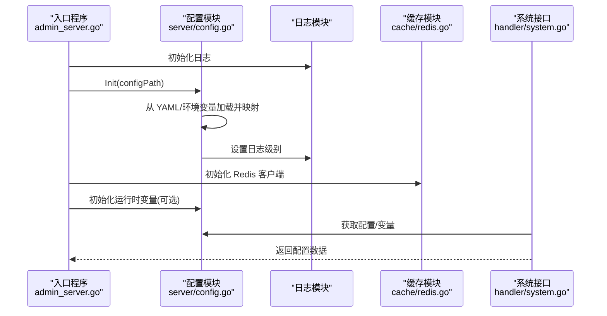
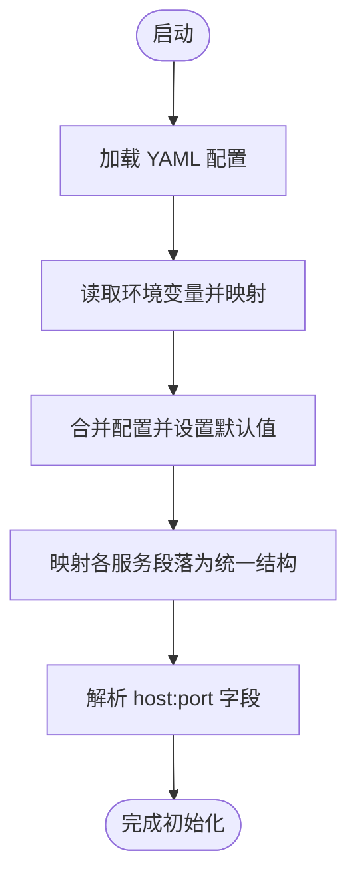
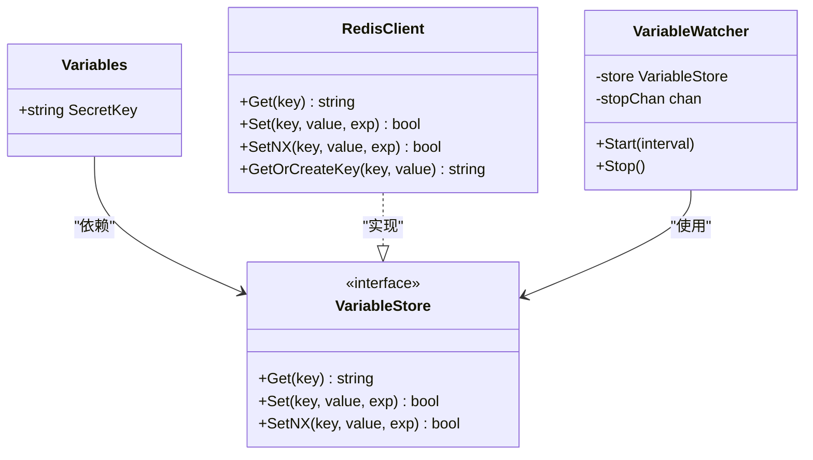
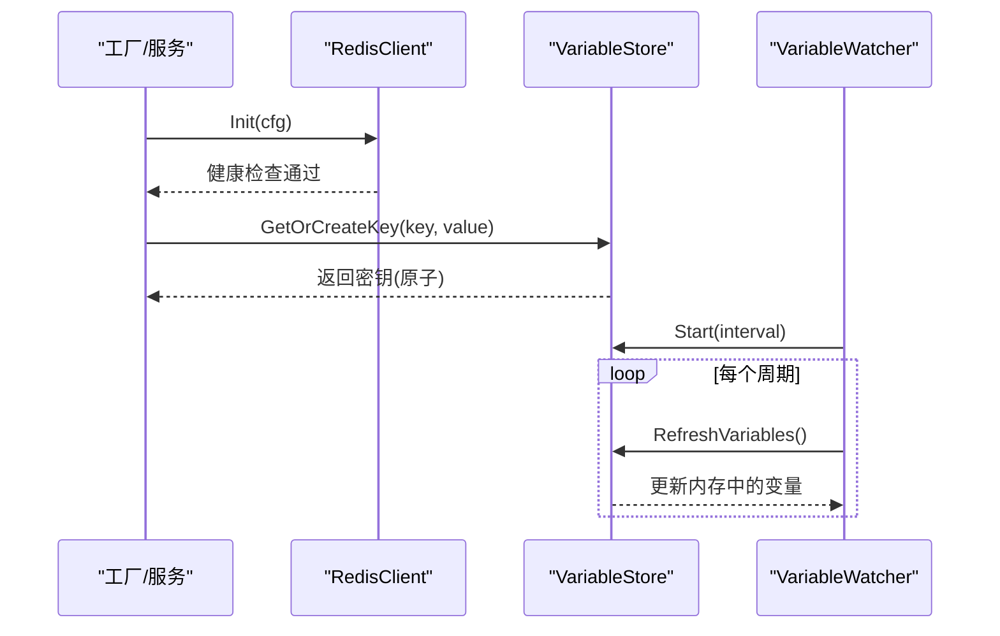
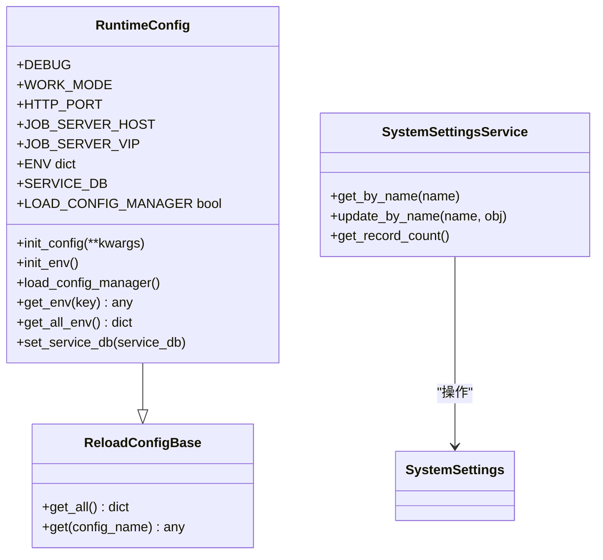
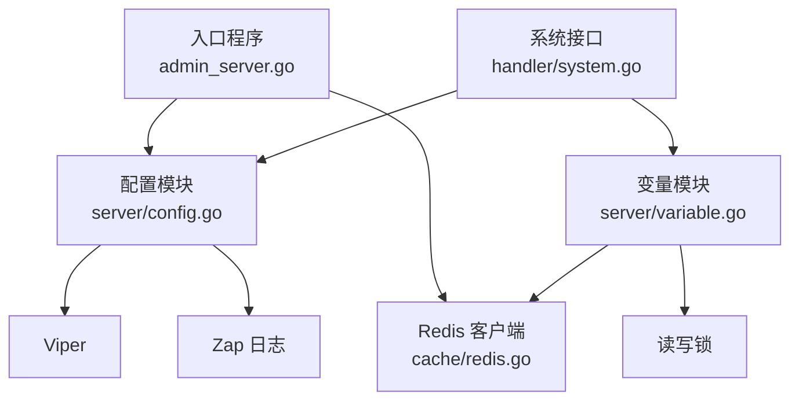

# 动态配置管理

<cite>
**本文引用的文件**
- [internal/server/config.go](file://internal/server/config.go)
- [internal/server/variable.go](file://internal/server/variable.go)
- [internal/cache/redis.go](file://internal/cache/redis.go)
- [api/db/runtime_config.py](file://api/db/runtime_config.py)
- [api/db/services/system_settings_service.py](file://api/db/services/system_settings_service.py)
- [common/config_utils.py](file://common/config_utils.py)
- [api/utils/configs.py](file://api/utils/configs.py)
- [conf/service_conf.yaml](file://conf/service_conf.yaml)
- [cmd/admin_server.go](file://cmd/admin_server.go)
- [internal/handler/system.go](file://internal/handler/system.go)
</cite>

## 目录
1. [简介](#简介)
2. [项目结构](#项目结构)
3. [核心组件](#核心组件)
4. [架构总览](#架构总览)
5. [详细组件分析](#详细组件分析)
6. [依赖分析](#依赖分析)
7. [性能考虑](#性能考虑)
8. [故障排查指南](#故障排查指南)
9. [结论](#结论)
10. [附录](#附录)

## 简介
本技术文档围绕 RAGFlow 的动态配置管理进行系统化梳理，重点覆盖以下方面：
- 配置热加载与持久化：基于 YAML 文件与环境变量的初始化与合并，支持运行时参数调整与持久化。
- 配置监听与刷新：通过 Redis 持久化存储与轮询监听，实现跨实例的配置变更感知与刷新。
- 配置验证与应用：在初始化阶段对关键字段进行校验，并在服务启动后按需应用到运行时模块。
- 配置一致性与并发控制：通过原子写入（SETNX）、分布式锁与只读互斥锁保障并发安全。
- 实际应用场景：运行时参数调整、功能开关控制、性能参数优化、密钥轮换与回滚策略。

## 项目结构
RAGFlow 的动态配置管理由多层组件协同完成：
- 配置源与初始化：YAML 配置文件与环境变量合并，生成全局配置对象。
- 运行时变量：可动态变化的运行时参数（如密钥）通过 Redis 存储并支持轮询刷新。
- 缓存与存储：Redis 客户端封装，提供原子操作与消息队列能力，支撑配置同步。
- 数据库与服务：系统设置模型与服务层负责持久化配置记录与更新。
- 接口与入口：HTTP 接口暴露配置查询，启动入口完成配置初始化与日志级别设置。

**图表来源**
- [conf/service_conf.yaml](file://conf/service_conf.yaml)
- [internal/server/config.go](file://internal/server/config.go)
- [internal/server/variable.go](file://internal/server/variable.go)
- [internal/cache/redis.go](file://internal/cache/redis.go)
- [api/db/services/system_settings_service.py](file://api/db/services/system_settings_service.py)
- [internal/handler/system.go](file://internal/handler/system.go)
- [cmd/admin_server.go](file://cmd/admin_server.go)

**章节来源**
- [conf/service_conf.yaml](file://conf/service_conf.yaml)
- [internal/server/config.go](file://internal/server/config.go)
- [internal/server/variable.go](file://internal/server/variable.go)
- [internal/cache/redis.go](file://internal/cache/redis.go)
- [api/db/services/system_settings_service.py](file://api/db/services/system_settings_service.py)
- [internal/handler/system.go](file://internal/handler/system.go)
- [cmd/admin_server.go](file://cmd/admin_server.go)

## 核心组件
- 全局配置对象与解析器
  - 通过 Viper 从 YAML 与环境变量加载配置，映射到强类型结构体，支持默认值与环境覆盖。
  - 支持打印所有配置项用于调试。
- 运行时变量与存储
  - 可动态变化的变量（如密钥）通过 Redis 原子写入与轮询刷新，确保跨实例一致。
  - 提供获取、设置、保存与刷新方法，以及监听器以周期性拉取最新值。
- 缓存与存储客户端
  - Redis 封装提供连接健康检查、键值操作、集合与有序集操作、流式消息队列等能力。
  - 使用 Lua 脚本实现原子操作（如令牌桶、条件删除），提升一致性与性能。
- 系统设置模型与服务
  - 数据库存储系统级配置，提供按名称查询与更新，自动记录时间戳。
- 配置工具与序列化
  - Python 层提供 YAML 读写、合并、加解密与安全反序列化，支持本地覆盖与加密配置读取。

**章节来源**
- [internal/server/config.go](file://internal/server/config.go)
- [internal/server/variable.go](file://internal/server/variable.go)
- [internal/cache/redis.go](file://internal/cache/redis.go)
- [api/db/services/system_settings_service.py](file://api/db/services/system_settings_service.py)
- [common/config_utils.py](file://common/config_utils.py)
- [api/utils/configs.py](file://api/utils/configs.py)

## 架构总览
动态配置管理的关键流程如下：
- 启动阶段：入口程序初始化日志与配置，根据配置设置运行模式与日志级别。
- 配置加载：Viper 从多个路径与环境变量加载 YAML，映射到全局配置对象。
- 运行时变量：初始化变量存储（Redis），原子生成或获取密钥，后续支持轮询刷新。
- 接口暴露：HTTP 接口返回当前配置与变量状态，便于运维与监控。
- 持久化与回滚：系统设置通过数据库持久化，支持更新与回滚（基于时间戳）。

**图表来源**
- [cmd/admin_server.go](file://cmd/admin_server.go)
- [internal/server/config.go](file://internal/server/config.go)
- [internal/cache/redis.go](file://internal/cache/redis.go)
- [internal/handler/system.go](file://internal/handler/system.go)

## 详细组件分析

### 配置解析与热加载（Go）
- 配置来源与优先级
  - YAML 文件：支持 conf/service_conf.yaml 与多路径查找。
  - 环境变量：前缀 RAGFLOW_ 自动映射，点号转下划线。
  - 默认值：未配置时采用默认值（如注册开关、语言、端口等）。
- 映射与转换
  - 将 ragflow、es、infinity、minio、redis、mysql、task_executor 等段落映射为统一结构，补充额外字段与服务类型。
  - 对 host:port 字符串进行解析，兼容 URL 格式。
- 打印与调试
  - 提供打印全部配置项的能力，便于排障。

**图表来源**
- [internal/server/config.go](file://internal/server/config.go)
- [conf/service_conf.yaml](file://conf/service_conf.yaml)

**章节来源**
- [internal/server/config.go](file://internal/server/config.go)
- [conf/service_conf.yaml](file://conf/service_conf.yaml)

### 运行时变量与监听（Go）
- 变量存储接口
  - 定义 VariableStore 接口，支持 Get/Set/SetNX 等原子操作。
- 密钥管理
  - 通过 GetOrCreateKey 在 Redis 中原子生成或获取密钥，避免竞态。
  - 提供刷新与保存方法，支持轮询监听与其他实例的变更感知。
- 监听器
  - VariableWatcher 使用定时器周期性调用 RefreshVariables，实现跨实例同步。

**图表来源**
- [internal/server/variable.go](file://internal/server/variable.go)
- [internal/cache/redis.go](file://internal/cache/redis.go)

**章节来源**
- [internal/server/variable.go](file://internal/server/variable.go)
- [internal/cache/redis.go](file://internal/cache/redis.go)

### 缓存与存储（Go）
- 连接与健康检查
  - 初始化 Redis 客户端，超时连接测试，健康检查与信息解析。
- 原子操作与脚本
  - 使用 Lua 脚本实现条件删除、令牌桶限流等，保证原子性与一致性。
- 消息队列
  - 基于 Redis Streams 的生产/消费模型，支持消费者组、确认与重入队。
- 键空间操作
  - 提供集合、有序集、自增 ID 等常用操作，满足配置分发场景。

**图表来源**
- [internal/cache/redis.go](file://internal/cache/redis.go)
- [internal/server/variable.go](file://internal/server/variable.go)

**章节来源**
- [internal/cache/redis.go](file://internal/cache/redis.go)
- [internal/server/variable.go](file://internal/server/variable.go)

### 系统设置持久化（Python）
- 模型与服务
  - SystemSettings 模型提供按名称查询与更新，自动记录更新时间与日期。
- 运行时配置基类
  - ReloadConfigBase 提供统一的配置读取与环境注入能力，RuntimeConfig 扩展用于运行时参数管理。

**图表来源**
- [api/db/runtime_config.py](file://api/db/runtime_config.py)
- [api/db/services/system_settings_service.py](file://api/db/services/system_settings_service.py)

**章节来源**
- [api/db/runtime_config.py](file://api/db/runtime_config.py)
- [api/db/services/system_settings_service.py](file://api/db/services/system_settings_service.py)

### 配置工具与序列化（Python）
- YAML 工具
  - 读取与合并本地与全局配置，支持密码与敏感字段脱敏输出。
- 加解密与安全反序列化
  - 支持加密数据库配置解密与受限模块的安全反序列化，降低风险面。

**章节来源**
- [common/config_utils.py](file://common/config_utils.py)
- [api/utils/configs.py](file://api/utils/configs.py)

### 接口与入口（Go）
- 系统配置接口
  - 提供获取单个配置与全部配置的接口，便于前端与运维工具使用。
- 启动入口
  - 初始化日志、配置、数据库与文档引擎，设置 Gin 运行模式，完成基础环境准备。

**章节来源**
- [internal/handler/system.go](file://internal/handler/system.go)
- [cmd/admin_server.go](file://cmd/admin_server.go)

## 依赖分析
- 组件耦合
  - 配置模块依赖 Viper 与 Zap 日志；运行时变量依赖 Redis 客户端；接口依赖配置与变量模块。
- 外部依赖
  - Redis 作为配置与密钥的共享存储；YAML 文件作为静态配置源；数据库用于系统设置持久化。
- 并发与一致性
  - 通过只读互斥锁保护变量读取，通过 Redis SETNX 与 Lua 脚本保证原子性。

**图表来源**
- [internal/server/config.go](file://internal/server/config.go)
- [internal/server/variable.go](file://internal/server/variable.go)
- [internal/cache/redis.go](file://internal/cache/redis.go)
- [internal/handler/system.go](file://internal/handler/system.go)
- [cmd/admin_server.go](file://cmd/admin_server.go)

**章节来源**
- [internal/server/config.go](file://internal/server/config.go)
- [internal/server/variable.go](file://internal/server/variable.go)
- [internal/cache/redis.go](file://internal/cache/redis.go)
- [internal/handler/system.go](file://internal/handler/system.go)
- [cmd/admin_server.go](file://cmd/admin_server.go)

## 性能考虑
- 配置加载
  - YAML 解析与环境变量映射在启动阶段完成，避免运行时重复解析开销。
- Redis 操作
  - 使用 Lua 脚本减少往返次数，SetNX 与管道（Transaction）提升原子性与吞吐。
- 刷新策略
  - VariableWatcher 使用定时器周期刷新，建议根据实例数量与变更频率调整间隔，平衡一致性与资源消耗。
- 序列化与反序列化
  - Python 层使用安全反序列化与受限模块，避免高风险操作带来的性能与安全问题。

## 故障排查指南
- 配置未生效
  - 检查 YAML 文件路径与权限，确认环境变量前缀与键名正确。
  - 使用打印接口查看当前配置是否符合预期。
- Redis 连接失败
  - 检查主机、端口、密码与 DB 是否正确；使用健康检查接口验证连通性。
- 密钥不一致
  - 确认 Redis 中密钥键存在且未被其他进程覆盖；检查轮询监听是否正常工作。
- 系统设置更新失败
  - 检查数据库连接与表结构；确认更新时间戳字段是否正确写入。

**章节来源**
- [internal/server/config.go](file://internal/server/config.go)
- [internal/cache/redis.go](file://internal/cache/redis.go)
- [internal/server/variable.go](file://internal/server/variable.go)
- [api/db/services/system_settings_service.py](file://api/db/services/system_settings_service.py)

## 结论
RAGFlow 的动态配置管理通过“静态配置 + 运行时变量 + 持久化存储”的组合，实现了配置的热加载、监听与应用。其核心优势在于：
- 启动期严格解析与校验，运行期通过 Redis 原子操作与轮询监听保障一致性。
- 接口与入口清晰分离，便于扩展与维护。
- 提供回滚与审计能力（时间戳），满足生产环境的稳定性要求。

## 附录

### 动态配置实际应用场景
- 运行时参数调整
  - 通过接口查询当前配置，结合数据库持久化实现参数变更与回滚。
- 功能开关控制
  - 将开关项纳入系统设置，配合轮询监听在多实例间同步。
- 性能参数优化
  - 调整 Redis 连接池大小、任务执行器并发度等，结合健康检查与指标监控评估效果。
- 密钥轮换与回滚
  - 使用原子生成与刷新机制，确保密钥切换期间的服务连续性。

### 最佳实践
- 配置分层与最小暴露：静态配置集中管理，敏感信息仅在运行时注入。
- 并发安全：读写分离与只读锁，原子操作优先（SETNX、Lua 脚本）。
- 观察性：开启配置打印与健康检查，建立变更审计与回滚策略。
- 测试与演练：在预生产环境验证配置变更流程与回滚机制。