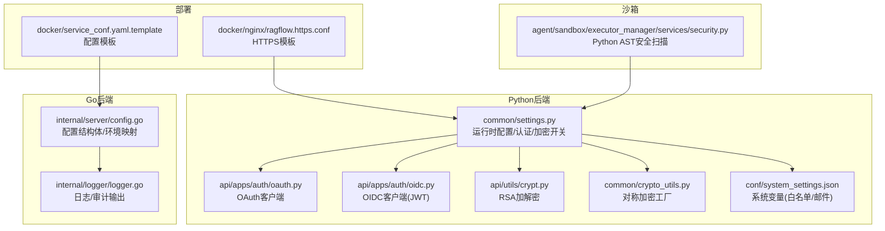
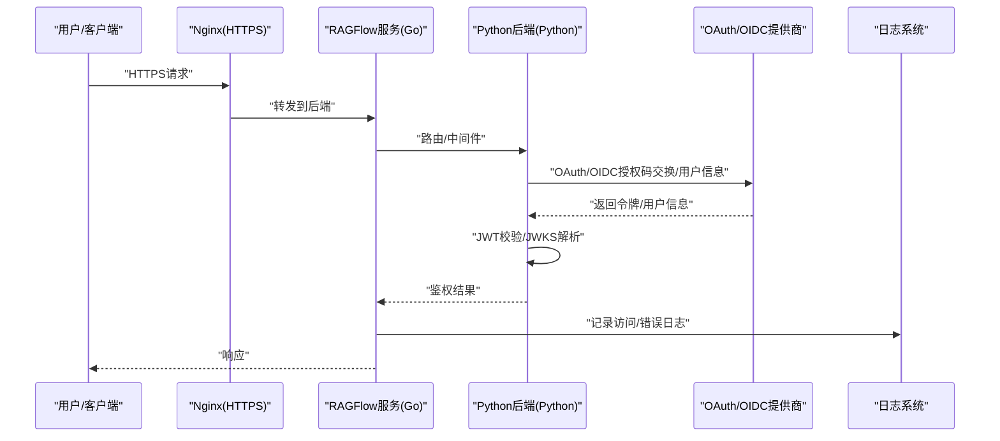
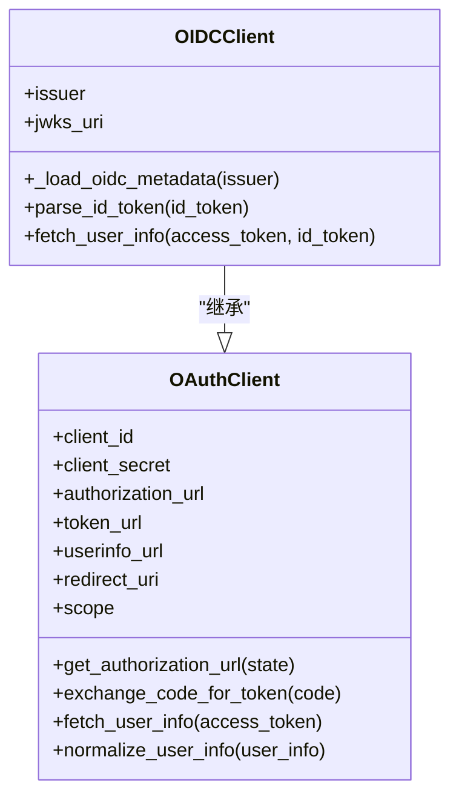
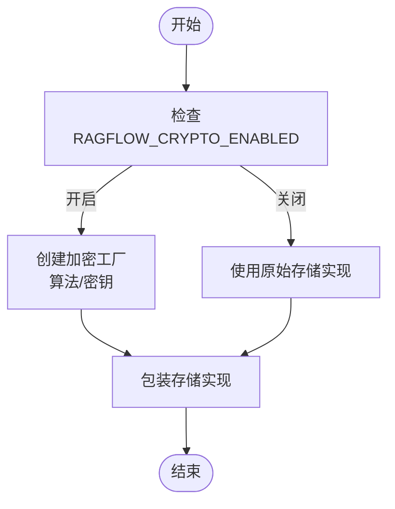
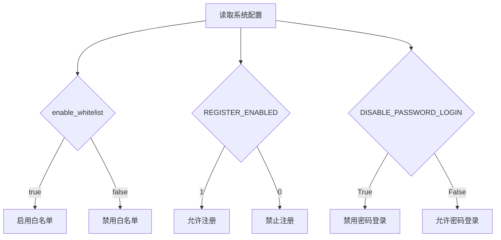
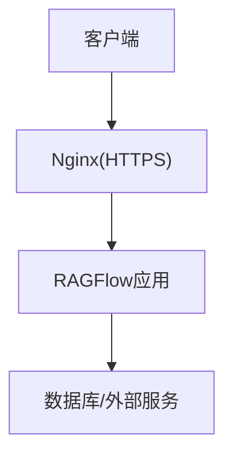
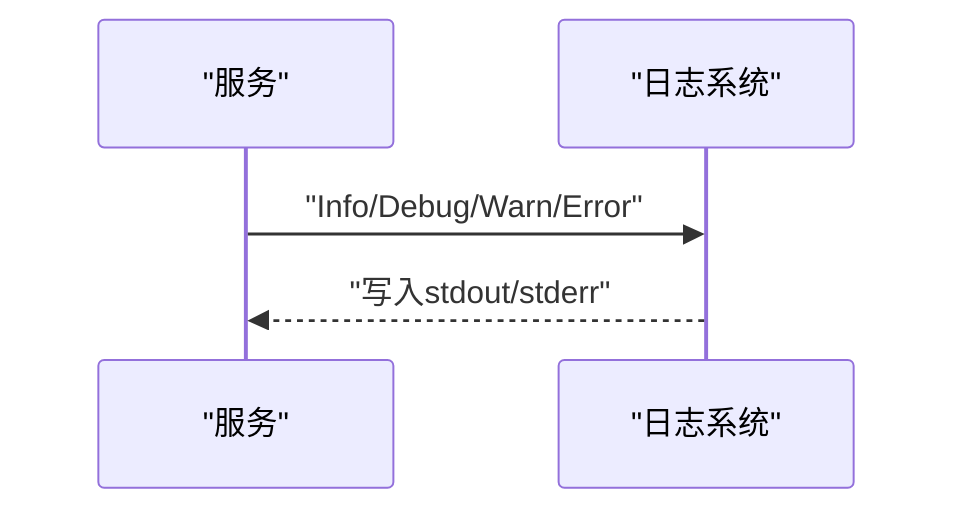
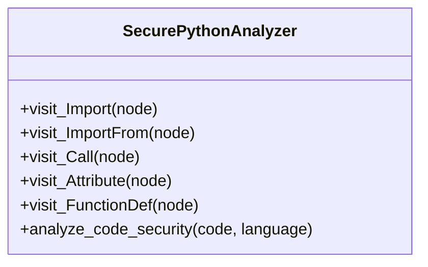
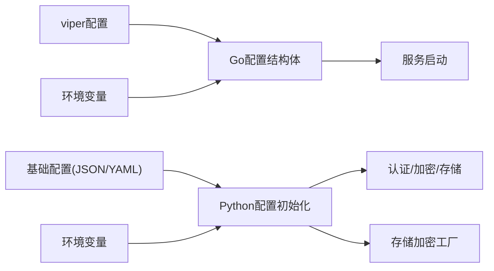

# 安全配置

<cite>
**本文引用的文件**
- [common/settings.py](file://common/settings.py)
- [internal/server/config.go](file://internal/server/config.go)
- [admin/server/config.py](file://admin/server/config.py)
- [api/apps/auth/oauth.py](file://api/apps/auth/oauth.py)
- [api/apps/auth/oidc.py](file://api/apps/auth/oidc.py)
- [api/utils/crypt.py](file://api/utils/crypt.py)
- [common/crypto_utils.py](file://common/crypto_utils.py)
- [agent/sandbox/executor_manager/services/security.py](file://agent/sandbox/executor_manager/services/security.py)
- [internal/logger/logger.go](file://internal/logger/logger.go)
- [conf/system_settings.json](file://conf/system_settings.json)
- [docker/nginx/ragflow.https.conf](file://docker/nginx/ragflow.https.conf)
- [docker/service_conf.yaml.template](file://docker/service_conf.yaml.template)
</cite>

## 目录
1. [简介](#简介)
2. [项目结构](#项目结构)
3. [核心组件](#核心组件)
4. [架构总览](#架构总览)
5. [详细组件分析](#详细组件分析)
6. [依赖分析](#依赖分析)
7. [性能考虑](#性能考虑)
8. [故障排查指南](#故障排查指南)
9. [结论](#结论)
10. [附录](#附录)

## 简介
本文件面向RAGFlow的安全配置，系统化梳理认证与授权、加密与密钥管理、访问控制、传输安全、存储加密、日志与审计、以及不同环境下的安全配置策略与最佳实践。内容覆盖API密钥、OAuth/OIDC、JWT校验、SSL/TLS、敏感信息保护、沙箱安全扫描、以及安全评估与验证方法。

## 项目结构
RAGFlow在多语言与多模块中实现安全能力：
- Python侧：认证配置、OAuth/OIDC客户端、RSA加解密、存储加密工厂、设置初始化与运行时配置加载
- Go侧：服务端配置结构体、日志与安全输出
- 沙箱侧：Python代码AST静态安全扫描
- 部署侧：Nginx HTTPS模板、容器编排模板

**图示来源**
- [common/settings.py:174-414](file://common/settings.py#L174-L414)
- [internal/server/config.go:35-202](file://internal/server/config.go#L35-L202)
- [api/apps/auth/oauth.py:32-152](file://api/apps/auth/oauth.py#L32-L152)
- [api/apps/auth/oidc.py:22-108](file://api/apps/auth/oidc.py#L22-L108)
- [api/utils/crypt.py:26-66](file://api/utils/crypt.py#L26-L66)
- [common/crypto_utils.py:256-318](file://common/crypto_utils.py#L256-L318)
- [agent/sandbox/executor_manager/services/security.py:23-174](file://agent/sandbox/executor_manager/services/security.py#L23-L174)
- [internal/logger/logger.go:34-139](file://internal/logger/logger.go#L34-L139)
- [docker/nginx/ragflow.https.conf](file://docker/nginx/ragflow.https.conf)
- [docker/service_conf.yaml.template](file://docker/service_conf.yaml.template)

**章节来源**
- [common/settings.py:174-414](file://common/settings.py#L174-L414)
- [internal/server/config.go:35-202](file://internal/server/config.go#L35-L202)

## 核心组件
- 认证与授权
  - OAuth/OIDC客户端：支持授权码流程、用户信息拉取、ID Token签名验证（JWKS）
  - 密码登录开关：禁用密码登录可强制单点登录
  - 客户端认证开关与HTTP应用密钥：用于前端或SDK侧的身份校验
- 加密与密钥管理
  - RSA加解密：用于CLI/前端与后端之间的安全交互
  - 对称加密：AES-128/256-CBC、SM4-CBC，支持通过环境变量启用并注入密钥
  - 存储加密：通过工厂模式按需包装底层存储实现透明加密
- 访问控制
  - 白名单开关：系统级白名单控制
  - 注册开关：允许/禁止新用户注册
  - 禁用密码登录：仅允许OAuth/OIDC登录
- 传输安全
  - Nginx HTTPS模板：提供TLS终止与证书配置参考
- 日志与审计
  - 结构化日志：统一时间戳、级别、消息字段，便于审计
  - 安全告警：自动化的密钥生成与安全警告提示

**章节来源**
- [api/apps/auth/oauth.py:32-152](file://api/apps/auth/oauth.py#L32-L152)
- [api/apps/auth/oidc.py:22-108](file://api/apps/auth/oidc.py#L22-L108)
- [common/settings.py:192-201](file://common/settings.py#L192-L201)
- [common/settings.py:252-258](file://common/settings.py#L252-L258)
- [api/utils/crypt.py:26-66](file://api/utils/crypt.py#L26-L66)
- [common/crypto_utils.py:256-318](file://common/crypto_utils.py#L256-L318)
- [conf/system_settings.json:4-8](file://conf/system_settings.json#L4-L8)
- [docker/nginx/ragflow.https.conf](file://docker/nginx/ragflow.https.conf)
- [internal/logger/logger.go:34-139](file://internal/logger/logger.go#L34-L139)

## 架构总览
下图展示从请求到认证、授权、加密与日志的关键路径。

**图示来源**
- [api/apps/auth/oauth.py:65-126](file://api/apps/auth/oauth.py#L65-L126)
- [api/apps/auth/oidc.py:60-86](file://api/apps/auth/oidc.py#L60-L86)
- [internal/logger/logger.go:108-139](file://internal/logger/logger.go#L108-L139)
- [docker/nginx/ragflow.https.conf](file://docker/nginx/ragflow.https.conf)

## 详细组件分析

### 组件A：认证与授权配置
- OAuth客户端
  - 支持授权URL拼装、授权码换取令牌、异步/同步用户信息获取
  - 规范化用户信息输出
- OIDC客户端
  - 基于OpenID发现元数据动态获取端点
  - 使用PyJWKClient加载JWKS并验证ID Token签名
  - 合并ID Token与用户信息接口返回
- 运行时配置
  - 客户端认证开关、HTTP应用密钥、GitHub/飞书OAuth配置
  - 禁用密码登录开关优先读取环境变量，其次读取基础配置

**图示来源**
- [api/apps/auth/oauth.py:32-152](file://api/apps/auth/oauth.py#L32-L152)
- [api/apps/auth/oidc.py:22-108](file://api/apps/auth/oidc.py#L22-L108)

**章节来源**
- [api/apps/auth/oauth.py:32-152](file://api/apps/auth/oauth.py#L32-L152)
- [api/apps/auth/oidc.py:22-108](file://api/apps/auth/oidc.py#L22-L108)
- [common/settings.py:192-201](file://common/settings.py#L192-L201)
- [common/settings.py:252-258](file://common/settings.py#L252-L258)

### 组件B：加密与密钥管理
- RSA加解密
  - 使用公钥加密、私钥解密，兼容多种输入格式
  - 用于CLI/前端与后端之间的安全交互
- 对称加密
  - 支持AES-128/256-CBC、SM4-CBC
  - 工厂模式创建实例，PBKDF2派生密钥，带魔数标识的封装格式
- 存储加密
  - 通过工厂包装底层存储实现透明加密
  - 受环境变量控制：是否启用、算法、密钥

**图示来源**
- [common/settings.py:317-336](file://common/settings.py#L317-L336)
- [common/crypto_utils.py:256-318](file://common/crypto_utils.py#L256-L318)
- [api/utils/crypt.py:26-66](file://api/utils/crypt.py#L26-L66)

**章节来源**
- [common/crypto_utils.py:256-318](file://common/crypto_utils.py#L256-L318)
- [common/settings.py:317-336](file://common/settings.py#L317-L336)
- [api/utils/crypt.py:26-66](file://api/utils/crypt.py#L26-L66)

### 组件C：访问控制与白名单
- 白名单开关：系统变量控制
- 注册开关：允许/禁止新用户注册
- 禁用密码登录：仅允许OAuth/OIDC登录
- 系统变量定义与默认值来源于系统配置JSON

**图示来源**
- [conf/system_settings.json:4-8](file://conf/system_settings.json#L4-L8)
- [common/settings.py:192-201](file://common/settings.py#L192-L201)

**章节来源**
- [conf/system_settings.json:4-8](file://conf/system_settings.json#L4-L8)
- [common/settings.py:192-201](file://common/settings.py#L192-L201)

### 组件D：传输安全（TLS/HTTPS）
- Nginx HTTPS模板提供TLS终止与证书配置参考
- 建议在生产环境启用HTTPS并配置强密码套件与安全头

**图示来源**
- [docker/nginx/ragflow.https.conf](file://docker/nginx/ragflow.https.conf)

**章节来源**
- [docker/nginx/ragflow.https.conf](file://docker/nginx/ragflow.https.conf)

### 组件E：日志与审计
- Go侧日志：结构化输出，包含时间戳、级别、消息
- Python侧日志：统一入口，便于集中采集与审计
- 安全告警：如自动密钥生成会输出安全警告提示

**图示来源**
- [internal/logger/logger.go:34-139](file://internal/logger/logger.go#L34-L139)

**章节来源**
- [internal/logger/logger.go:34-139](file://internal/logger/logger.go#L34-L139)
- [common/settings.py:150-156](file://common/settings.py#L150-L156)

### 组件F：沙箱安全扫描
- Python AST静态扫描：检测危险导入、函数调用、属性访问等
- 适用于代码执行前的静态安全审查

**图示来源**
- [agent/sandbox/executor_manager/services/security.py:23-174](file://agent/sandbox/executor_manager/services/security.py#L23-L174)

**章节来源**
- [agent/sandbox/executor_manager/services/security.py:23-174](file://agent/sandbox/executor_manager/services/security.py#L23-L174)

## 依赖分析
- 配置来源与优先级
  - Go服务端：优先读取配置文件，再叠加环境变量映射
  - Python运行时：读取基础配置与环境变量，动态初始化认证、存储、加密等
- 组件耦合
  - OAuth/OIDC依赖HTTP客户端
  - 存储加密依赖存储实现工厂
  - 日志系统独立于业务逻辑

**图示来源**
- [internal/server/config.go:453-702](file://internal/server/config.go#L453-L702)
- [common/settings.py:174-246](file://common/settings.py#L174-L246)

**章节来源**
- [internal/server/config.go:453-702](file://internal/server/config.go#L453-L702)
- [common/settings.py:174-246](file://common/settings.py#L174-L246)

## 性能考虑
- 加密性能
  - 对称加密采用CBC模式，建议使用硬件加速或优化密钥派生迭代次数
  - 批量处理时注意分块大小与内存占用
- 日志性能
  - 控制日志级别与字段数量，避免高频写入阻塞
- OAuth/OIDC
  - 缓存JWKS与元数据，减少网络往返
- 沙箱扫描
  - AST解析复杂度与代码规模相关，建议限制扫描范围与超时

## 故障排查指南
- 认证失败
  - 检查OAuth/OIDC配置项是否正确，授权码是否过期
  - 校验ID Token签名与受众（audience）匹配
- 加密异常
  - 确认RAGFLOW_CRYPTO_ENABLED与算法、密钥环境变量
  - 检查存储实现是否被正确包装
- 密钥问题
  - 自动密钥生成会触发安全警告，建议手动设置安全密钥
- 日志审计
  - 查看结构化日志中的时间戳、级别、消息与调用者信息
- 传输安全
  - 确认Nginx证书链完整、协议版本与密码套件符合安全基线

**章节来源**
- [api/apps/auth/oidc.py:60-86](file://api/apps/auth/oidc.py#L60-L86)
- [common/crypto_utils.py:256-318](file://common/crypto_utils.py#L256-L318)
- [common/settings.py:150-156](file://common/settings.py#L150-L156)
- [internal/logger/logger.go:108-139](file://internal/logger/logger.go#L108-L139)
- [docker/nginx/ragflow.https.conf](file://docker/nginx/ragflow.https.conf)

## 结论
RAGFlow在多语言栈中实现了完整的安全能力：认证与授权（OAuth/OIDC/JWT）、传输安全（HTTPS）、存储加密（对称/透明）、访问控制（白名单/注册/密码登录开关）、日志与审计（结构化输出）。通过环境变量与配置文件的灵活组合，可在不同环境中快速落地安全策略，并结合沙箱静态扫描进一步降低执行风险。

## 附录

### 不同安全级别的配置示例
- 开发环境
  - 允许注册、允许密码登录、禁用存储加密
  - 日志级别设为debug，便于定位问题
- 生产环境
  - 禁用注册、禁用密码登录、启用存储加密、HTTPS终止
  - 启用白名单、严格日志级别与保留周期
- 合规性配置
  - 强制HTTPS、最小权限原则、定期轮换密钥、审计日志归档

### 安全配置清单（要点）
- 认证
  - 启用OAuth/OIDC，配置client_id/secret与回调地址
  - 设置默认超级用户邮箱/密码/昵称
- 授权
  - enable_whitelist、REGISTER_ENABLED、DISABLE_PASSWORD_LOGIN
- 加密
  - RAGFLOW_CRYPTO_ENABLED、RAGFLOW_CRYPTO_ALGORITHM、RAGFLOW_CRYPTO_KEY
- 传输
  - Nginx HTTPS模板、证书链、密码套件
- 日志
  - 结构化输出、调用者信息、错误级别

### 安全评估与验证方法
- 代码扫描
  - 使用沙箱安全扫描器对执行代码进行AST扫描
- 配置审计
  - 检查环境变量与配置文件一致性
- 功能测试
  - OAuth/OIDC授权流程、ID Token签名校验、加密/解密通路
- 渗透测试
  - 模拟弱口令、未加密传输、越权访问等场景