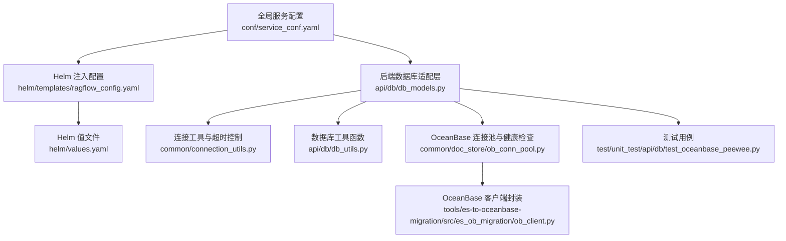
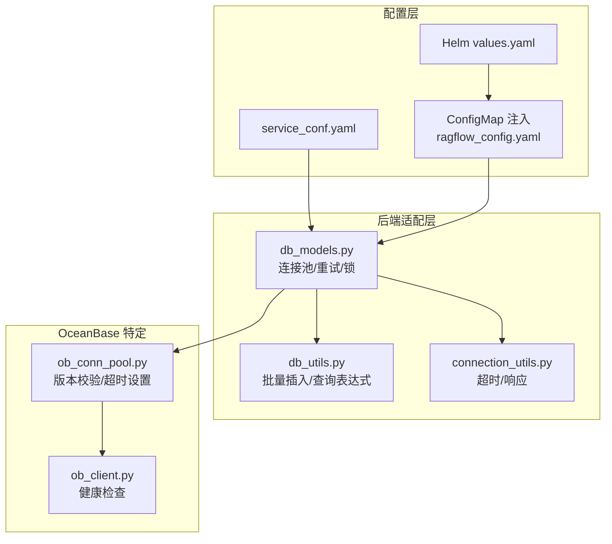
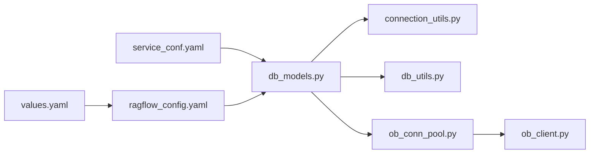

# 数据库配置

<cite>
**本文引用的文件**   
- [conf/service_conf.yaml](file://conf/service_conf.yaml)
- [helm/templates/ragflow_config.yaml](file://helm/templates/ragflow_config.yaml)
- [helm/values.yaml](file://helm/values.yaml)
- [api/db/db_models.py](file://api/db/db_models.py)
- [api/db/db_utils.py](file://api/db/db_utils.py)
- [common/connection_utils.py](file://common/connection_utils.py)
- [internal/server/config.go](file://internal/server/config.go)
- [common/doc_store/ob_conn_pool.py](file://common/doc_store/ob_conn_pool.py)
- [rag/utils/ob_conn.py](file://rag/utils/ob_conn.py)
- [tools/es-to-oceanbase-migration/src/es_ob_migration/ob_client.py](file://tools/es-to-oceanbase-migration/src/es_ob_migration/ob_client.py)
- [test/unit_test/api/db/test_oceanbase_peewee.py](file://test/unit_test/api/db/test_oceanbase_peewee.py)
</cite>

## 目录
1. [简介](#简介)
2. [项目结构](#项目结构)
3. [核心组件](#核心组件)
4. [架构总览](#架构总览)
5. [详细组件分析](#详细组件分析)
6. [依赖关系分析](#依赖关系分析)
7. [性能考量](#性能考量)
8. [故障排除指南](#故障排除指南)
9. [结论](#结论)
10. [附录](#附录)

## 简介
本技术文档聚焦于 RAGFlow 的数据库配置与管理，覆盖系统支持的数据库类型（MySQL、OceanBase、PostgreSQL）及其配置要点；详述连接参数、连接池设置、超时配置与认证信息；阐述关键参数与优化选项（最大连接数、连接/查询超时、事务隔离级别等）；并提供不同数据库类型的配置示例与最佳实践（高可用、读写分离、备份恢复），以及性能调优、监控与故障排除建议。文档同时解释连接池管理与资源优化策略，帮助读者在生产环境中稳定、高效地运行数据库层。

## 项目结构
RAGFlow 的数据库配置主要分布在以下位置：
- 全局服务配置：用于定义数据库连接参数与连接池相关字段
- Helm 配置：用于容器化部署时注入配置与环境变量
- 后端数据库适配层：封装连接池、重试机制与锁实现
- 连接工具与超时控制：统一处理超时与响应构造
- OceanBase 特定连接池与健康检查：版本校验、查询超时设置与性能指标采集
- 测试用例：验证 OceanBase 连接池与枚举值

**图表来源**
- [conf/service_conf.yaml:1-160](file://conf/service_conf.yaml#L1-L160)
- [api/db/db_models.py:260-638](file://api/db/db_models.py#L260-L638)
- [helm/templates/ragflow_config.yaml:1-95](file://helm/templates/ragflow_config.yaml#L1-L95)
- [helm/values.yaml:1-266](file://helm/values.yaml#L1-L266)
- [common/connection_utils.py:1-141](file://common/connection_utils.py#L1-L141)
- [api/db/db_utils.py:1-129](file://api/db/db_utils.py#L1-L129)
- [common/doc_store/ob_conn_pool.py:110-135](file://common/doc_store/ob_conn_pool.py#L110-L135)
- [tools/es-to-oceanbase-migration/src/es_ob_migration/ob_client.py:50-85](file://tools/es-to-oceanbase-migration/src/es_ob_migration/ob_client.py#L50-L85)
- [test/unit_test/api/db/test_oceanbase_peewee.py:41-79](file://test/unit_test/api/db/test_oceanbase_peewee.py#L41-L79)

**章节来源**
- [conf/service_conf.yaml:1-160](file://conf/service_conf.yaml#L1-L160)
- [helm/templates/ragflow_config.yaml:1-95](file://helm/templates/ragflow_config.yaml#L1-L95)
- [helm/values.yaml:1-266](file://helm/values.yaml#L1-L266)

## 核心组件
- 全局服务配置（YAML）
  - 提供数据库连接参数与连接池相关字段，如 MySQL 的名称、用户、密码、主机、端口、最大连接数、stale 超时、最大包大小等；同时包含 OceanBase 的 scheme 与 config 段落，以及 PostgreSQL 的注释段落。
- 后端数据库适配层（Python）
  - 封装了带重试的连接池数据库类（MySQL、PostgreSQL、OceanBase），并提供数据库锁实现（MySQL/MariaDB 与 PostgreSQL 的分布式锁）。
- 连接工具与超时控制（Python）
  - 提供统一的超时装饰器与异步/同步响应构造工具，便于在数据库操作中进行超时控制与错误处理。
- OceanBase 连接池与健康检查（Python/TOML）
  - 在连接池初始化时进行版本校验与查询超时设置，并提供性能指标采集能力。
- Helm 配置（YAML/TOML）
  - 通过 ConfigMap 注入服务配置，values.yaml 中定义环境变量与外部服务依赖（如 MySQL、Redis、MinIO 等）。

**章节来源**
- [api/db/db_models.py:260-638](file://api/db/db_models.py#L260-L638)
- [common/connection_utils.py:30-101](file://common/connection_utils.py#L30-L101)
- [common/doc_store/ob_conn_pool.py:110-135](file://common/doc_store/ob_conn_pool.py#L110-L135)
- [helm/templates/ragflow_config.yaml:1-95](file://helm/templates/ragflow_config.yaml#L1-L95)
- [helm/values.yaml:209-247](file://helm/values.yaml#L209-L247)

## 架构总览
下图展示了数据库配置在系统中的流转路径：从全局配置到后端适配层，再到连接池与重试机制，最终由业务模块使用。

**图表来源**
- [conf/service_conf.yaml:1-160](file://conf/service_conf.yaml#L1-L160)
- [helm/values.yaml:1-266](file://helm/values.yaml#L1-L266)
- [helm/templates/ragflow_config.yaml:1-95](file://helm/templates/ragflow_config.yaml#L1-L95)
- [api/db/db_models.py:260-638](file://api/db/db_models.py#L260-L638)
- [api/db/db_utils.py:1-129](file://api/db/db_utils.py#L1-L129)
- [common/connection_utils.py:1-141](file://common/connection_utils.py#L1-L141)
- [common/doc_store/ob_conn_pool.py:110-135](file://common/doc_store/ob_conn_pool.py#L110-L135)
- [tools/es-to-oceanbase-migration/src/es_ob_migration/ob_client.py:50-85](file://tools/es-to-oceanbase-migration/src/es_ob_migration/ob_client.py#L50-L85)

## 详细组件分析

### 数据库类型与配置要点
- MySQL
  - 支持通过全局配置文件定义连接参数与连接池相关字段（最大连接数、stale 超时、最大包大小等）。
  - 后端提供带重试的连接池数据库类，具备断线自动重连与指数回退重试能力。
- OceanBase
  - 兼容 MySQL 协议，使用 MySQL 连接池类并扩展重试机制。
  - 初始化时进行版本校验（要求不低于特定版本），并尝试设置查询超时以避免长事务阻塞。
  - 提供健康检查与性能指标采集能力。
- PostgreSQL
  - 提供独立的带重试连接池数据库类，针对 PostgreSQL 错误码与消息进行识别与重试。
  - 提供基于 advisory lock 的分布式锁实现，确保并发安全。

**章节来源**
- [conf/service_conf.yaml:7-16](file://conf/service_conf.yaml#L7-L16)
- [conf/service_conf.yaml:34-41](file://conf/service_conf.yaml#L34-L41)
- [api/db/db_models.py:260-481](file://api/db/db_models.py#L260-L481)
- [common/doc_store/ob_conn_pool.py:110-135](file://common/doc_store/ob_conn_pool.py#L110-L135)
- [rag/utils/ob_conn.py:447-474](file://rag/utils/ob_conn.py#L447-L474)

### 连接参数与认证信息
- MySQL
  - 字段：名称、用户、密码、主机、端口、字符集等。
  - 连接池：最大连接数、stale 超时、最大包大小等。
- OceanBase
  - 字段：scheme（可选 mysql 或 oceanbase）、db_name、user、password、host、port。
  - 连接池：pool_size（来自客户端配置）。
- PostgreSQL
  - 当前配置文件中以注释形式给出字段示例（名称、用户、密码、主机、端口、最大连接数、stale 超时等）。

**章节来源**
- [conf/service_conf.yaml:7-16](file://conf/service_conf.yaml#L7-L16)
- [conf/service_conf.yaml:34-41](file://conf/service_conf.yaml#L34-L41)
- [conf/service_conf.yaml:56-63](file://conf/service_conf.yaml#L56-L63)

### 连接池设置与超时配置
- 连接池参数
  - MySQL：最大连接数、stale 超时、最大包大小等。
  - OceanBase：通过客户端设置 pool_size；内部会刷新连接池以应用新设置。
- 超时配置
  - 执行 SQL 与事务开始均具备重试逻辑，失败时按指数回退等待后重连。
  - OceanBase 查询超时变量（ob_query_timeout）会被检测并设置为期望值。
- 认证信息
  - 用户名、密码、数据库名、主机与端口等均来自配置文件或环境变量映射。

**章节来源**
- [conf/service_conf.yaml:13-15](file://conf/service_conf.yaml#L13-L15)
- [api/db/db_models.py:260-481](file://api/db/db_models.py#L260-L481)
- [common/doc_store/ob_conn_pool.py:119-135](file://common/doc_store/ob_conn_pool.py#L119-L135)
- [internal/server/config.go:511-526](file://internal/server/config.go#L511-L526)

### 关键参数与优化选项
- 最大连接数
  - MySQL：通过配置项设置；OceanBase：通过客户端 pool_size 设置。
- 连接/查询超时
  - 执行与事务开始具备重试与回退等待；OceanBase 会设置并刷新查询超时。
- 事务隔离级别
  - 未在配置中显式设置；默认遵循数据库默认隔离级别。
- 批量写入优化
  - 提供批量插入工具函数，支持冲突保留策略（MySQL 与 PostgreSQL 分别处理）。

**章节来源**
- [api/db/db_utils.py:41-51](file://api/db/db_utils.py#L41-L51)
- [api/db/db_models.py:404-481](file://api/db/db_models.py#L404-L481)

### 不同数据库类型的配置示例与最佳实践
- MySQL
  - 使用全局配置文件定义连接参数与连接池字段；在容器化部署时可通过 Helm values.yaml 注入环境变量。
- OceanBase
  - 通过 scheme 选择连接方式（mysql/oceanbase）；确保版本满足最低要求；设置查询超时并刷新连接池。
  - 建议启用健康检查与性能指标采集，定期监控连接池状态与慢查询。
- PostgreSQL
  - 参考注释中的字段示例进行配置；结合分布式锁实现保证并发一致性。

**章节来源**
- [conf/service_conf.yaml:34-41](file://conf/service_conf.yaml#L34-L41)
- [common/doc_store/ob_conn_pool.py:110-135](file://common/doc_store/ob_conn_pool.py#L110-L135)
- [helm/values.yaml:209-247](file://helm/values.yaml#L209-L247)

### 高可用、读写分离、备份恢复
- 高可用
  - 建议在数据库层面采用主从复制与自动切换；在应用层通过连接池与重试机制提升容错能力。
- 读写分离
  - 可通过多实例配置与路由策略实现；需配合连接池与事务一致性控制。
- 备份恢复
  - 建议使用数据库自带的备份工具与自动化脚本；迁移工具可用于从其他存储迁移到 OceanBase。

**章节来源**
- [tools/es-to-oceanbase-migration/src/es_ob_migration/ob_client.py:50-85](file://tools/es-to-oceanbase-migration/src/es_ob_migration/ob_client.py#L50-L85)

### 性能调优参数与监控
- 性能调优
  - 调整最大连接数、stale 超时与查询超时；根据负载情况动态调整连接池大小。
- 监控
  - OceanBase 提供连接池统计与慢查询计数等指标；可结合日志与告警系统进行持续监控。

**章节来源**
- [common/doc_store/ob_conn_pool.py:110-135](file://common/doc_store/ob_conn_pool.py#L110-L135)
- [rag/utils/ob_conn.py:447-474](file://rag/utils/ob_conn.py#L447-L474)

### 故障排除指南
- 连接丢失与重试
  - MySQL/PostgreSQL/OceanBase 在执行 SQL 或事务开始时若发生连接异常，将按指数回退重试；必要时刷新连接池。
- 锁获取失败
  - PostgreSQL 的 advisory lock 与 MySQL 的 GET_LOCK/RELEASE_LOCK 在超时或异常情况下会抛出异常，需检查锁 ID 与超时设置。
- 测试验证
  - 单元测试验证 OceanBase 连接池初始化与重试参数，确保默认与自定义配置生效。

**章节来源**
- [api/db/db_models.py:260-481](file://api/db/db_models.py#L260-L481)
- [api/db/db_models.py:562-600](file://api/db/db_models.py#L562-L600)
- [api/db/db_models.py:602-638](file://api/db/db_models.py#L602-L638)
- [test/unit_test/api/db/test_oceanbase_peewee.py:41-79](file://test/unit_test/api/db/test_oceanbase_peewee.py#L41-L79)

## 依赖关系分析
- 配置到适配层
  - 全局配置文件与 Helm values.yaml 通过 ConfigMap 注入到后端；后端根据配置初始化连接池与重试策略。
- 适配层到工具
  - 数据库适配层依赖连接工具与超时控制工具，统一处理超时与响应。
- OceanBase 特定依赖
  - OceanBase 连接池依赖客户端封装与健康检查工具，确保版本与查询超时符合预期。

**图表来源**
- [conf/service_conf.yaml:1-160](file://conf/service_conf.yaml#L1-L160)
- [helm/values.yaml:1-266](file://helm/values.yaml#L1-L266)
- [helm/templates/ragflow_config.yaml:1-95](file://helm/templates/ragflow_config.yaml#L1-L95)
- [api/db/db_models.py:260-638](file://api/db/db_models.py#L260-L638)
- [common/connection_utils.py:1-141](file://common/connection_utils.py#L1-L141)
- [api/db/db_utils.py:1-129](file://api/db/db_utils.py#L1-L129)
- [common/doc_store/ob_conn_pool.py:110-135](file://common/doc_store/ob_conn_pool.py#L110-L135)
- [tools/es-to-oceanbase-migration/src/es_ob_migration/ob_client.py:50-85](file://tools/es-to-oceanbase-migration/src/es_ob_migration/ob_client.py#L50-L85)

**章节来源**
- [internal/server/config.go:511-526](file://internal/server/config.go#L511-L526)

## 性能考量
- 连接池规模
  - 根据并发请求与数据库承载能力调整最大连接数与池大小；OceanBase 通过客户端 pool_size 设置并刷新连接池。
- 超时与重试
  - 合理设置重试次数与回退系数，避免瞬时抖动导致级联放大；对查询超时进行统一管理。
- 批量写入
  - 使用批量插入工具减少往返开销，注意冲突处理策略差异（MySQL 与 PostgreSQL）。
- 监控与告警
  - 结合连接池统计与慢查询计数，建立阈值告警与自动扩缩容策略。

[本节为通用指导，无需列出具体文件来源]

## 故障排除指南
- 连接异常
  - 观察重试日志与回退等待时间；必要时手动刷新连接池。
- 锁问题
  - 检查锁 ID 与超时设置；确认当前数据库是否支持相应锁机制。
- 版本与超时
  - OceanBase 版本不满足最低要求会导致初始化失败；查询超时未正确设置可能引发长事务阻塞。

**章节来源**
- [api/db/db_models.py:260-481](file://api/db/db_models.py#L260-L481)
- [common/doc_store/ob_conn_pool.py:110-135](file://common/doc_store/ob_conn_pool.py#L110-L135)

## 结论
RAGFlow 在数据库配置方面提供了完善的 YAML/Helm 配置入口与后端适配层，支持 MySQL、OceanBase 与 PostgreSQL，并内置连接池、重试与锁机制。通过合理的参数调优与监控，可在生产环境中实现高可用、高性能与可维护的数据库层。建议结合实际负载与数据库特性，制定差异化的连接池与超时策略，并持续监控连接池状态与慢查询指标。

[本节为总结性内容，无需列出具体文件来源]

## 附录
- 配置文件路径与用途
  - 全局服务配置：定义数据库连接参数与连接池字段
  - Helm 注入配置：将服务配置注入到容器内
  - Helm 值文件：定义环境变量与外部服务依赖
- 关键实现参考
  - 数据库适配层：连接池、重试与锁
  - 连接工具：超时与响应构造
  - OceanBase：版本校验、查询超时设置与健康检查
  - 测试用例：验证连接池与枚举值

**章节来源**
- [conf/service_conf.yaml:1-160](file://conf/service_conf.yaml#L1-L160)
- [helm/templates/ragflow_config.yaml:1-95](file://helm/templates/ragflow_config.yaml#L1-L95)
- [helm/values.yaml:1-266](file://helm/values.yaml#L1-L266)
- [api/db/db_models.py:260-638](file://api/db/db_models.py#L260-L638)
- [common/connection_utils.py:1-141](file://common/connection_utils.py#L1-L141)
- [common/doc_store/ob_conn_pool.py:110-135](file://common/doc_store/ob_conn_pool.py#L110-L135)
- [test/unit_test/api/db/test_oceanbase_peewee.py:41-79](file://test/unit_test/api/db/test_oceanbase_peewee.py#L41-L79)