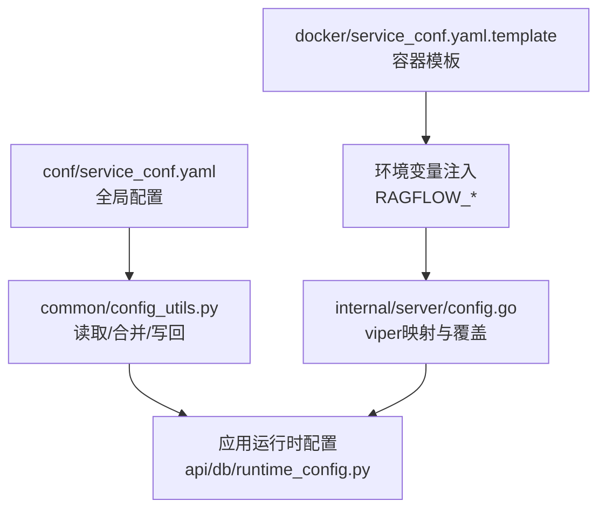
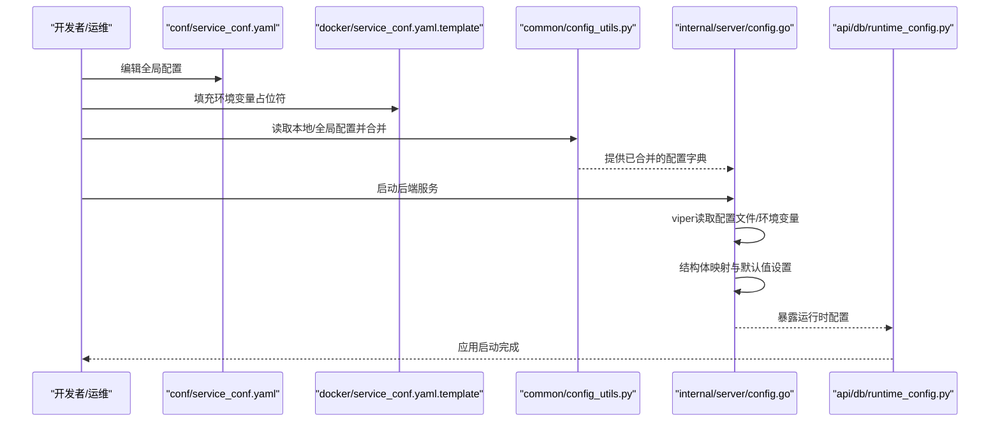
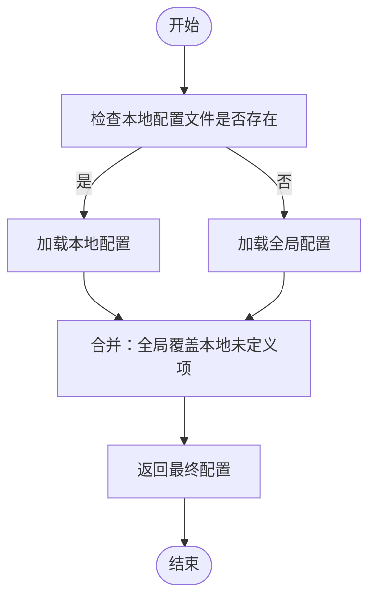
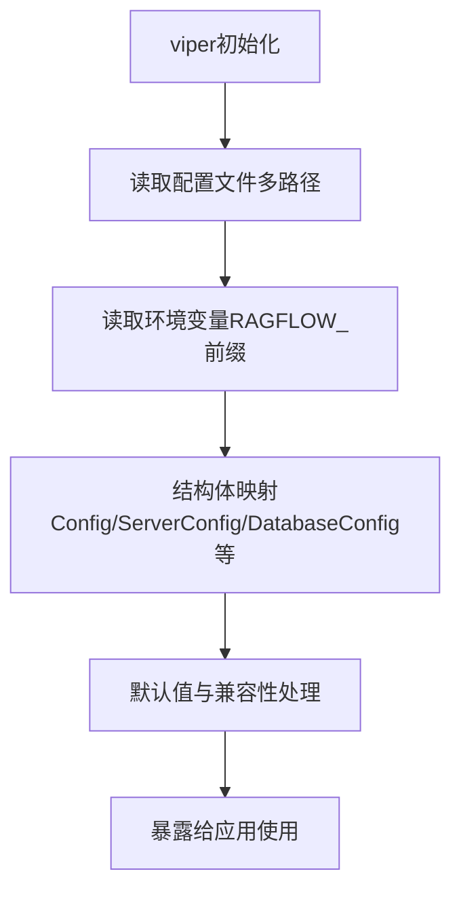
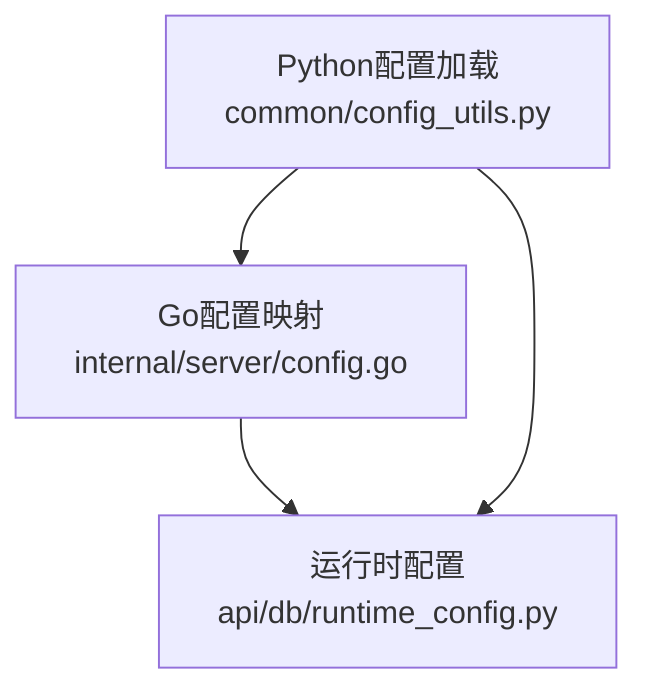

# 服务配置

<cite>
**本文引用的文件**
- [service_conf.yaml](file://conf/service_conf.yaml)
- [service_conf.yaml.template](file://docker/service_conf.yaml.template)
- [config_utils.py](file://common/config_utils.py)
- [configs.go](file://internal/server/config.go)
- [runtime_config.py](file://api/db/runtime_config.py)
</cite>

## 目录
1. [简介](#简介)
2. [项目结构](#项目结构)
3. [核心组件](#核心组件)
4. [架构总览](#架构总览)
5. [详细组件分析](#详细组件分析)
6. [依赖分析](#依赖分析)
7. [性能考虑](#性能考虑)
8. [故障排查指南](#故障排查指南)
9. [结论](#结论)
10. [附录](#附录)

## 简介
本文件面向RAGFlow服务配置，系统性解读service_conf.yaml配置文件的完整结构与各配置项的作用，覆盖RAGFlow主服务、管理服务、数据库、存储服务、检索引擎、消息队列、默认模型等关键模块。文档同时阐述配置层次结构、组织方式、环境变量覆盖机制、配置验证方法、冲突处理与迁移建议，并提供开发/生产/容器化部署的最佳实践。

## 项目结构
RAGFlow的配置体系由两部分构成：
- 全局配置：位于conf/service_conf.yaml，定义RAGFlow运行所需的核心外部依赖（数据库、对象存储、检索引擎、Redis等）以及默认模型参数。
- 容器化模板：位于docker/service_conf.yaml.template，提供基于环境变量的可替换占位符，便于在Docker或Kubernetes中动态注入配置。

此外，配置加载与解析在Python侧通过common/config_utils.py实现本地/全局合并；在Go侧通过internal/server/config.go使用viper进行类型化映射与环境变量覆盖。

图表来源
- [service_conf.yaml:1-160](file://conf/service_conf.yaml#L1-L160)
- [service_conf.yaml.template:1-172](file://docker/service_conf.yaml.template#L1-L172)
- [config_utils.py:55-75](file://common/config_utils.py#L55-L75)
- [configs.go:453-510](file://internal/server/config.go#L453-L510)
- [runtime_config.py:20-55](file://api/db/runtime_config.py#L20-L55)

章节来源
- [service_conf.yaml:1-160](file://conf/service_conf.yaml#L1-L160)
- [service_conf.yaml.template:1-172](file://docker/service_conf.yaml.template#L1-L172)
- [config_utils.py:55-75](file://common/config_utils.py#L55-L75)
- [configs.go:453-510](file://internal/server/config.go#L453-L510)
- [runtime_config.py:20-55](file://api/db/runtime_config.py#L20-L55)

## 核心组件
本节对service_conf.yaml中的顶层配置项进行逐项说明，包括含义、默认值、可选值范围与配置示例路径。

- ragflow
  - 作用：RAGFlow主服务监听地址与HTTP端口。
  - 关键字段：host、http_port。
  - 默认值：host为0.0.0.0，http_port为9380。
  - 示例路径：[service_conf.yaml:1-6](file://conf/service_conf.yaml#L1-L6)，[service_conf.yaml.template:1-6](file://docker/service_conf.yaml.template#L1-L6)。

- admin
  - 作用：管理服务监听地址与HTTP端口。
  - 关键字段：host、http_port。
  - 默认值：host为0.0.0.0，http_port为9381。
  - 示例路径：[service_conf.yaml:4-6](file://conf/service_conf.yaml#L4-L6)，[service_conf.yaml.template:4-6](file://docker/service_conf.yaml.template#L4-L6)。

- mysql
  - 作用：元数据MySQL数据库连接信息。
  - 关键字段：name、user、password、host、port、max_connections、stale_timeout、max_allowed_packet。
  - 默认值：name为rag_flow，user为root，password为infini_rag_flow，host为localhost，port为3306，max_connections为900，stale_timeout为300，max_allowed_packet为1073741824。
  - 示例路径：[service_conf.yaml:7-15](file://conf/service_conf.yaml#L7-L15)，[service_conf.yaml.template:7-15](file://docker/service_conf.yaml.template#L7-L15)。

- minio
  - 作用：对象存储MinIO连接信息。
  - 关键字段：user、password、host、bucket、prefix_path。
  - 默认值：user为rag_flow，password为infini_rag_flow，host为localhost:9000，bucket为空字符串，prefix_path为空字符串。
  - 示例路径：[service_conf.yaml:16-21](file://conf/service_conf.yaml#L16-L21)，[service_conf.yaml.template:16-25](file://docker/service_conf.yaml.template#L16-L25)。

- es
  - 作用：Elasticsearch检索引擎连接信息。
  - 关键字段：hosts、username、password。
  - 默认值：hosts为http://localhost:1200，username为elastic，password为infini_rag_flow。
  - 示例路径：[service_conf.yaml:22-25](file://conf/service_conf.yaml#L22-L25)，[service_conf.yaml.template:26-29](file://docker/service_conf.yaml.template#L26-L29)。

- os
  - 作用：OpenSearch检索引擎连接信息。
  - 关键字段：hosts、username、password。
  - 默认值：hosts为http://localhost:1201，username为admin，password为infini_rag_flow_OS_01。
  - 示例路径：[service_conf.yaml:26-29](file://conf/service_conf.yaml#L26-L29)，[service_conf.yaml.template:30-33](file://docker/service_conf.yaml.template#L30-L33)。

- infinity
  - 作用：Infinity检索引擎连接信息。
  - 关键字段：uri、postgres_port、db_name。
  - 默认值：uri为localhost:23817，postgres_port为5432，db_name为default_db。
  - 示例路径：[service_conf.yaml:30-33](file://conf/service_conf.yaml#L30-L33)，[service_conf.yaml.template:34-37](file://docker/service_conf.yaml.template#L34-L37)。

- oceanbase
  - 作用：OceanBase数据库连接信息（支持scheme=mysql或oceanbase）。
  - 关键字段：scheme、config.db_name、config.user、config.password、config.host、config.port。
  - 默认值：scheme为oceanbase，config.db_name为test，config.user为root@ragflow，config.password为infini_rag_flow，config.host为localhost，config.port为2881。
  - 示例路径：[service_conf.yaml:34-41](file://conf/service_conf.yaml#L34-L41)，[service_conf.yaml.template:38-45](file://docker/service_conf.yaml.template#L38-L45)。

- seekdb
  - 作用：SeekDB（OceanBase轻量版）连接信息。
  - 关键字段：scheme、config.db_name、config.user、config.password、config.host、config.port。
  - 默认值：scheme为oceanbase，config.db_name为ragflow_doc，config.user为root，config.password为infini_rag_flow，config.host为seekdb，config.port为2881。
  - 示例路径：[service_conf.yaml.template:46-53](file://docker/service_conf.yaml.template#L46-L53)。

- redis
  - 作用：消息队列Redis连接信息。
  - 关键字段：db、username、password、host。
  - 默认值：db为1，username为空字符串，password为infini_rag_flow，host为localhost:6379。
  - 示例路径：[service_conf.yaml:42-46](file://conf/service_conf.yaml#L42-L46)，[service_conf.yaml.template:54-58](file://docker/service_conf.yaml.template#L54-L58)。

- task_executor
  - 作用：任务执行器的消息队列类型。
  - 关键字段：message_queue_type。
  - 默认值：message_queue_type为redis。
  - 示例路径：[service_conf.yaml:47](file://conf/service_conf.yaml#L47)，[service_conf.yaml.template:54](file://docker/service_conf.yaml.template#L54)。

- user_default_llm
  - 作用：用户默认大模型配置（聊天、嵌入、重排序、ASR、图像转文本）。
  - 关键字段：default_models.chat_model、embedding_model、rerank_model、asr_model、image2text_model。
  - 默认值：嵌入模型名称为bge-m3，工厂与密钥等按需配置。
  - 示例路径：[service_conf.yaml:48-56](file://conf/service_conf.yaml#L48-L56)，[service_conf.yaml.template:59-63](file://docker/service_conf.yaml.template#L59-L63)。

- postgres（注释）
  - 作用：PostgreSQL数据库连接信息（当前为注释示例）。
  - 参考路径：[service_conf.yaml:56-63](file://conf/service_conf.yaml#L56-L63)。

- s3/oss/gcs/azure（注释）
  - 作用：S3、OSS、GCS、Azure对象存储连接信息（当前为注释示例）。
  - 参考路径：[service_conf.yaml:64-87](file://conf/service_conf.yaml#L64-L87)。

- oauth/authentication/permission/smtp/tcadp_config（注释）
  - 作用：OAuth/OIDC/GitHub等认证配置、权限控制、SMTP邮件、腾讯云TCADP等（当前为注释示例）。
  - 参考路径：[service_conf.yaml:111-160](file://conf/service_conf.yaml#L111-L160)。

章节来源
- [service_conf.yaml:1-160](file://conf/service_conf.yaml#L1-L160)
- [service_conf.yaml.template:1-172](file://docker/service_conf.yaml.template#L1-L172)

## 架构总览
RAGFlow的配置加载与生效流程如下：

图表来源
- [service_conf.yaml:1-160](file://conf/service_conf.yaml#L1-L160)
- [service_conf.yaml.template:1-172](file://docker/service_conf.yaml.template#L1-L172)
- [config_utils.py:55-75](file://common/config_utils.py#L55-L75)
- [configs.go:453-510](file://internal/server/config.go#L453-L510)
- [runtime_config.py:20-55](file://api/db/runtime_config.py#L20-L55)

## 详细组件分析

### 配置加载与合并（Python侧）
- 本地优先：优先读取conf/local.service_conf.yaml，若存在则与全局配置合并。
- 类型安全：使用ruamel.yaml安全解析，避免任意代码执行风险。
- 写回保护：通过文件锁保证并发写回的安全性。
- 敏感信息脱敏：打印配置时对密码、密钥等进行脱敏显示。

图表来源
- [config_utils.py:55-75](file://common/config_utils.py#L55-L75)

章节来源
- [config_utils.py:55-75](file://common/config_utils.py#L55-L75)

### 配置映射与环境变量覆盖（Go侧）
- viper自动发现配置文件与环境变量前缀RAGFLOW，点号键名转换为下划线。
- 支持从多个路径加载配置文件，包括./conf、./config、./internal/config、/etc/ragflow等。
- 对特定section进行结构化映射（如ragflow→ServerConfig、mysql→DatabaseConfig、minio→StorageConfig等），并设置默认值。
- 支持通过环境变量覆盖文档引擎类型、数据库类型、存储实现、语言等。

图表来源
- [configs.go:453-510](file://internal/server/config.go#L453-L510)
- [configs.go:211-368](file://internal/server/config.go#L211-L368)

章节来源
- [configs.go:453-510](file://internal/server/config.go#L453-L510)
- [configs.go:211-368](file://internal/server/config.go#L211-L368)

### 运行时配置注入
- RuntimeConfig负责将运行时参数注入到类属性，便于应用层统一读取版本、工作模式、HTTP端口、服务数据库等信息。
- 支持动态更新与环境变量注入。

章节来源
- [runtime_config.py:20-55](file://api/db/runtime_config.py#L20-L55)

## 依赖分析
- Python侧依赖ruamel.yaml进行YAML解析，使用文件锁保证并发安全。
- Go侧依赖viper进行配置读取与环境变量映射，支持多种配置源与默认值设置。
- 配置项之间存在隐式依赖关系：例如doc_engine与es/infinity的选择会影响检索引擎可用性；STORAGE_IMPL影响对象存储实现；DB_TYPE影响元数据库驱动。

图表来源
- [config_utils.py:55-75](file://common/config_utils.py#L55-L75)
- [configs.go:453-510](file://internal/server/config.go#L453-L510)
- [runtime_config.py:20-55](file://api/db/runtime_config.py#L20-L55)

章节来源
- [config_utils.py:55-75](file://common/config_utils.py#L55-L75)
- [configs.go:453-510](file://internal/server/config.go#L453-L510)
- [runtime_config.py:20-55](file://api/db/runtime_config.py#L20-L55)

## 性能考虑
- 数据库连接池：通过max_connections与stale_timeout控制连接复用与超时回收，建议结合业务QPS与实例规格调优。
- 对象存储：合理设置prefix_path以减少桶内列表扫描；在生产环境启用HTTPS与证书校验。
- 检索引擎：根据数据规模选择合适的分片与副本数；确保网络延迟与带宽满足查询需求。
- 消息队列：Redis作为任务队列时，注意持久化策略与内存上限，避免阻塞导致任务堆积。

## 故障排查指南
- 配置文件格式错误
  - 现象：启动时报“读取配置文件失败”或“反序列化错误”。
  - 处理：检查YAML缩进与语法；确认文件编码为UTF-8；必要时使用在线YAML校验工具。
  - 参考路径：[config_utils.py:28-36](file://common/config_utils.py#L28-L36)，[configs.go:476-481](file://internal/server/config.go#L476-L481)。

- 环境变量覆盖异常
  - 现象：配置未按预期被环境变量覆盖。
  - 处理：确认环境变量前缀为RAGFLOW，点号键名转换为下划线；检查viper自动环境变量读取是否生效。
  - 参考路径：[configs.go:470-473](file://internal/server/config.go#L470-L473)。

- 文档引擎/存储实现不匹配
  - 现象：检索或存储功能不可用。
  - 处理：检查DOC_ENGINE、STORAGE_IMPL与对应section配置是否一致；确认目标服务可达且凭据正确。
  - 参考路径：[configs.go:370-451](file://internal/server/config.go#L370-L451)。

- 密码/密钥安全
  - 现象：日志泄露敏感信息。
  - 处理：使用本地配置覆盖全局配置中的敏感字段；避免在日志中明文输出；生产环境建议启用加密模块与私钥解密。
  - 参考路径：[config_utils.py:82-107](file://common/config_utils.py#L82-L107)，[config_utils.py:119-144](file://common/config_utils.py#L119-L144)。

- 配置冲突与优先级
  - 现象：同一配置项出现多处定义导致行为异常。
  - 处理：遵循“本地配置覆盖全局配置”的原则；避免重复定义相同键；通过show_configs或PrintAll核对最终生效值。
  - 参考路径：[config_utils.py:68-72](file://common/config_utils.py#L68-L72)，[configs.go:732-744](file://internal/server/config.go#L732-L744)。

## 结论
service_conf.yaml是RAGFlow运行的关键枢纽，涵盖主服务、管理服务、数据库、对象存储、检索引擎、消息队列与默认模型等核心能力。通过Python侧的本地/全局合并与Go侧的viper映射，系统实现了灵活的配置加载与环境变量覆盖。建议在不同环境中采用对应的模板与最佳实践，严格管理敏感信息与冲突，确保配置的可维护性与安全性。

## 附录

### 开发环境配置建议
- 使用conf/local.service_conf.yaml进行本地覆盖，避免修改全局配置。
- 在docker/service_conf.yaml.template中设置合理的默认值与占位符，便于快速启动。
- 通过环境变量临时覆盖关键参数（如端口、主机、密码）。

### 生产环境配置建议
- 将敏感信息置于密钥管理服务或环境变量中，避免硬编码。
- 启用HTTPS与证书校验，限制访问白名单。
- 调整数据库与对象存储的连接池参数，监控资源使用情况。
- 明确DOC_ENGINE与STORAGE_IMPL，确保与基础设施一致。

### 容器化部署配置建议
- 使用docker/service_conf.yaml.template作为基础模板，通过环境变量注入。
- 在Kubernetes中使用ConfigMap/Secret管理非敏感与敏感配置。
- 为不同环境准备独立的values或env文件，避免混用。

### 配置验证方法
- Python侧：调用show_configs查看最终生效配置；检查敏感字段是否被脱敏。
- Go侧：调用PrintAll输出所有配置键值；确认结构体映射成功。
- 文件校验：使用YAML语法检查工具；核对必需字段完整性。

### 配置冲突处理
- 优先级：本地配置 > 全局配置 > 环境变量默认值。
- 同键同值：允许重复定义但以最后加载为准。
- 异常值：通过环境变量覆盖时进行类型转换与范围校验。

### 配置迁移指南
- 新增字段：在conf/service_conf.yaml中添加新section或字段，保持向后兼容。
- 字段重命名：提供过渡期的兼容逻辑（如legacy section），并在后续版本移除。
- 删除字段：先标记弃用，再在后续版本删除，确保有足够迁移窗口。
- 版本升级：结合api/db/runtime_config.py的版本注入，确保运行时感知升级。