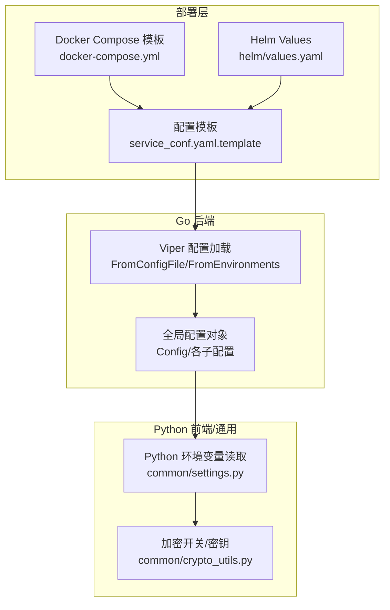
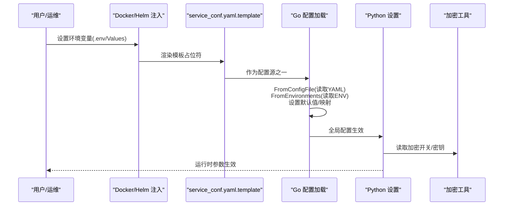
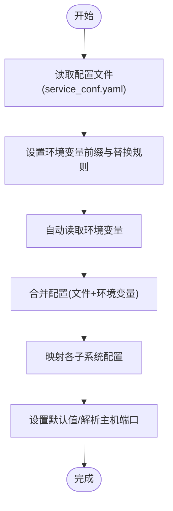
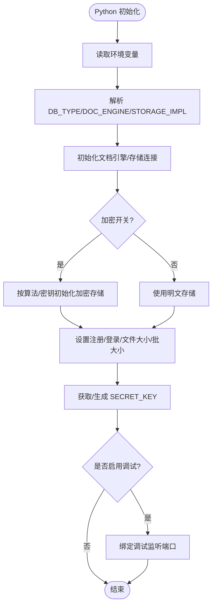
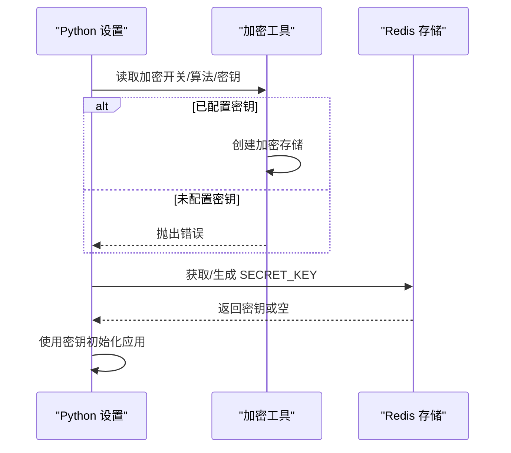

# 环境变量配置

<cite>
**本文档引用的文件**
- [internal/server/config.go](file://internal/server/config.go)
- [common/settings.py](file://common/settings.py)
- [conf/service_conf.yaml](file://conf/service_conf.yaml)
- [docker/service_conf.yaml.template](file://docker/service_conf.yaml.template)
- [docker/docker-compose.yml](file://docker/docker-compose.yml)
- [helm/values.yaml](file://helm/values.yaml)
- [admin/server/services.py](file://admin/server/services.py)
- [api/ragflow_server.py](file://api/ragflow_server.py)
- [common/crypto_utils.py](file://common/crypto_utils.py)
</cite>

## 目录
1. [简介](#简介)
2. [项目结构](#项目结构)
3. [核心组件](#核心组件)
4. [架构总览](#架构总览)
5. [详细组件分析](#详细组件分析)
6. [依赖关系分析](#依赖关系分析)
7. [性能考虑](#性能考虑)
8. [故障排查指南](#故障排查指南)
9. [结论](#结论)
10. [附录](#附录)

## 简介
本文件系统性梳理 RAGFlow 的环境变量配置体系，覆盖系统环境变量、Docker 环境变量、Kubernetes 环境变量等多部署形态，并明确各类环境变量的作用、配置方式、优先级规则与覆盖机制。内容涵盖数据库连接、存储服务、安全认证、日志配置、加密开关与密钥、调试与性能参数等，同时提供不同部署场景的配置示例与安全管理建议。

## 项目结构
RAGFlow 的环境变量配置由以下层次构成：
- Go 后端通过 Viper 读取配置文件并映射到全局配置对象，随后从环境变量覆盖默认值或文件配置。
- Python 前端与通用模块在启动时读取环境变量，用于数据库、文档引擎、存储实现、SMTP、注册开关、密码登录禁用、最大文件大小、批量处理大小、加密开关与密钥等。
- Docker 与 Helm 提供模板化环境变量注入，便于容器化部署与云原生编排。

**图表来源**
- [internal/server/config.go:453-703](file://internal/server/config.go#L453-L703)
- [common/settings.py:174-414](file://common/settings.py#L174-L414)
- [docker/docker-compose.yml:1-135](file://docker/docker-compose.yml#L1-135)
- [helm/values.yaml:1-266](file://helm/values.yaml#L1-L266)
- [docker/service_conf.yaml.template:1-172](file://docker/service_conf.yaml.template#L1-L172)

**章节来源**
- [internal/server/config.go:453-703](file://internal/server/config.go#L453-L703)
- [common/settings.py:174-414](file://common/settings.py#L174-L414)
- [docker/docker-compose.yml:1-135](file://docker/docker-compose.yml#L1-L135)
- [helm/values.yaml:1-266](file://helm/values.yaml#L1-L266)
- [docker/service_conf.yaml.template:1-172](file://docker/service_conf.yaml.template#L1-L172)

## 核心组件
- Go 配置初始化与环境变量覆盖：负责从配置文件与环境变量加载，设置默认值，解析主机与端口，映射各子系统配置（数据库、文档引擎、存储、Redis、任务执行器等）。
- Python 设置与运行时读取：负责数据库类型、文档引擎类型、存储实现、SMTP、注册开关、密码登录禁用、最大文件大小、批量向量化大小、加密开关与密钥生成/获取等。
- 加密工具：提供加密算法与密钥校验逻辑，确保敏感数据在启用加密时得到保护。
- 部署模板：Docker Compose 与 Helm Values 提供环境变量注入与默认值占位，便于容器化与云原生部署。

**章节来源**
- [internal/server/config.go:370-451](file://internal/server/config.go#L370-L451)
- [common/settings.py:140-414](file://common/settings.py#L140-L414)
- [common/crypto_utils.py:271-278](file://common/crypto_utils.py#L271-L278)
- [docker/docker-compose.yml:46](file://docker/docker-compose.yml#L46)
- [helm/values.yaml:13-76](file://helm/values.yaml#L13-L76)

## 架构总览
下图展示环境变量在不同层的读取与覆盖关系：

**图表来源**
- [docker/docker-compose.yml:46](file://docker/docker-compose.yml#L46)
- [helm/values.yaml:13-76](file://helm/values.yaml#L13-L76)
- [docker/service_conf.yaml.template:1-172](file://docker/service_conf.yaml.template#L1-172)
- [internal/server/config.go:453-703](file://internal/server/config.go#L453-L703)
- [common/settings.py:174-414](file://common/settings.py#L174-L414)
- [common/crypto_utils.py:271-278](file://common/crypto_utils.py#L271-L278)

## 详细组件分析

### Go 配置加载与环境变量覆盖
- 配置来源与顺序
  - 优先从配置文件加载（service_conf.yaml），未找到则仅使用环境变量。
  - 自动读取环境变量，前缀统一为 RAGFLOW，点号替换为下划线。
  - 从环境变量覆盖默认值或文件配置，如文档引擎类型、数据库类型、存储实现、注册开关等。
- 关键覆盖项
  - 文档引擎类型：支持 elasticsearch、infinity；不支持 opensearch/oceanbase。
  - 数据库类型：默认 mysql。
  - 存储实现：支持 minio、s3、oss；默认 minio。
  - 注册开关：REGISTER_ENABLED，默认 1。
  - 管理服务端口：基于主服务端口自动加 2。
  - 主机与端口解析：支持 host:port 或 URL 形式。
- 映射与转换
  - 将 ragflow、es、infinity、minio、redis、mysql、task_executor 等节映射为内部服务配置字典。
  - 对空 host/port 设置兜底值，删除冗余字段。

**图表来源**
- [internal/server/config.go:453-703](file://internal/server/config.go#L453-L703)
- [internal/server/config.go:370-451](file://internal/server/config.go#L370-L451)

**章节来源**
- [internal/server/config.go:453-703](file://internal/server/config.go#L453-L703)
- [internal/server/config.go:370-451](file://internal/server/config.go#L370-L451)

### Python 设置与运行时参数
- 数据库与文档引擎
  - DB_TYPE 默认 mysql；DOC_ENGINE 默认 elasticsearch。
  - 根据 DOC_ENGINE 选择 ES/Infinity/OpenSearch/OceanBase/SeekDB 并初始化连接。
- 存储实现
  - STORAGE_IMPL 默认 MINIO；可切换至 AZURE_SPN/SAS、AWS_S3、OSS、GCS、OpenDAL。
  - 支持加密存储：当启用加密时，按算法与密钥创建加密包装的存储实例。
- 认证与登录
  - REGISTER_ENABLED 可通过环境变量控制注册开关。
  - DISABLE_PASSWORD_LOGIN 可通过环境变量或配置文件控制密码登录禁用。
- 文件与批处理
  - MAX_CONTENT_LENGTH 控制单文件最大大小。
  - DOC_BULK_SIZE 控制文档解析批大小。
  - EMBEDDING_BATCH_SIZE 控制嵌入向量化批大小。
- 安全与密钥
  - SECRET_KEY 通过 Redis 获取或自动生成（警告日志提示）。
  - RAGFLOW_CRYPTO_ENABLED 开启加密；RAGFLOW_CRYPTO_ALGORITHM 指定算法；RAGFLOW_CRYPTO_KEY 提供密钥。
- 调试
  - RAGFLOW_DEBUGPY_LISTEN 可开启远程调试监听端口。

**图表来源**
- [common/settings.py:174-414](file://common/settings.py#L174-L414)
- [common/crypto_utils.py:271-278](file://common/crypto_utils.py#L271-L278)
- [api/ragflow_server.py:46-97](file://api/ragflow_server.py#L46-L97)

**章节来源**
- [common/settings.py:174-414](file://common/settings.py#L174-L414)
- [common/crypto_utils.py:271-278](file://common/crypto_utils.py#L271-L278)
- [api/ragflow_server.py:46-97](file://api/ragflow_server.py#L46-L97)

### 加密工具与密钥管理
- 加密开关与算法
  - RAGFLOW_CRYPTO_ENABLED=true 启用加密；RAGFLOW_CRYPTO_ALGORITHM 指定算法（默认 aes-256-cbc）。
  - RAGFLOW_CRYPTO_KEY 必须提供，否则抛出错误。
- 密钥生成与持久化
  - 若未显式提供 SECRET_KEY，系统会尝试从 Redis 获取或生成新的安全密钥，并记录安全警告。
- 存储封装
  - 当加密启用时，对底层存储进行加密包装；失败时回退到明文存储并记录错误。

**图表来源**
- [common/settings.py:317-335](file://common/settings.py#L317-L335)
- [common/crypto_utils.py:271-278](file://common/crypto_utils.py#L271-L278)

**章节来源**
- [common/settings.py:317-335](file://common/settings.py#L317-L335)
- [common/crypto_utils.py:271-278](file://common/crypto_utils.py#L271-L278)

### 部署环境变量配置示例

#### 本地开发
- 使用配置模板渲染 service_conf.yaml，结合 .env 注入环境变量。
- 示例要点
  - 主机与端口：RAGFLOW_HOST、SVR_HTTP_PORT、ADMIN_SVR_HTTP_PORT。
  - 数据库：MYSQL_HOST/MYSQL_PORT/MYSQL_USER/MYSQL_PASSWORD/MYSQL_DBNAME。
  - 文档引擎：DOC_ENGINE（elasticsearch/infinity/opensearch）。
  - 存储：STORAGE_IMPL（MINIO/S3/OSS/AZURE/GCS/OpenDAL）。
  - 加密：RAGFLOW_CRYPTO_ENABLED/RAGFLOW_CRYPTO_ALGORITHM/RAGFLOW_CRYPTO_KEY。
  - 调试：RAGFLOW_DEBUGPY_LISTEN。

**章节来源**
- [docker/service_conf.yaml.template:1-172](file://docker/service_conf.yaml.template#L1-L172)
- [docker/docker-compose.yml:46](file://docker/docker-compose.yml#L46)

#### Docker 部署
- 通过 docker-compose.yml 挂载模板与 .env，暴露端口映射。
- 关键点
  - env_file 指向 .env。
  - 卷挂载 service_conf.yaml.template 到容器内。
  - 端口映射：SVR_WEB_HTTP_PORT、SVR_WEB_HTTPS_PORT、SVR_HTTP_PORT、ADMIN_SVR_HTTP_PORT、SVR_MCP_PORT、GO_HTTP_PORT、GO_ADMIN_PORT。

**章节来源**
- [docker/docker-compose.yml:1-135](file://docker/docker-compose.yml#L1-L135)

#### Kubernetes(Helm) 部署
- 通过 helm/values.yaml 设置环境变量与默认值。
- 关键点
  - env 下的 DOC_ENGINE、ELASTIC_PASSWORD、MYSQL_PASSWORD、MINIO_ROOT_USER、REDIS_PASSWORD、TZ、MAX_CONTENT_LENGTH、DOC_BULK_SIZE、EMBEDDING_BATCH_SIZE 等。
  - 可通过 service_conf 与 llm_factories 在容器内生成本地配置文件。

**章节来源**
- [helm/values.yaml:13-76](file://helm/values.yaml#L13-L76)

## 依赖关系分析
- Go 配置层依赖 Viper 读取 YAML 与环境变量，再映射到内部结构体。
- Python 层依赖 Go 配置结果与自身环境变量，动态初始化连接与运行参数。
- 加密工具依赖 Python 层提供的算法与密钥，对存储进行包装。
- 部署层通过模板与 Values 提供环境变量注入，形成“模板 → 配置文件 → 环境变量”的链路。

**图表来源**
- [docker/service_conf.yaml.template:1-172](file://docker/service_conf.yaml.template#L1-172)
- [conf/service_conf.yaml:1-160](file://conf/service_conf.yaml#L1-L160)
- [internal/server/config.go:453-703](file://internal/server/config.go#L453-L703)
- [common/settings.py:174-414](file://common/settings.py#L174-L414)
- [common/crypto_utils.py:271-278](file://common/crypto_utils.py#L271-L278)
- [docker/docker-compose.yml:46](file://docker/docker-compose.yml#L46)
- [helm/values.yaml:13-76](file://helm/values.yaml#L13-L76)

**章节来源**
- [internal/server/config.go:453-703](file://internal/server/config.go#L453-L703)
- [common/settings.py:174-414](file://common/settings.py#L174-L414)
- [common/crypto_utils.py:271-278](file://common/crypto_utils.py#L271-L278)
- [docker/docker-compose.yml:46](file://docker/docker-compose.yml#L46)
- [helm/values.yaml:13-76](file://helm/values.yaml#L13-L76)

## 性能考虑
- 批处理大小
  - DOC_BULK_SIZE 控制文档解析批大小，适当增大可提升吞吐但增加内存占用。
  - EMBEDDING_BATCH_SIZE 控制嵌入向量化批大小，GPU 场景可适度调大以提升利用率。
- 最大文件大小
  - MAX_CONTENT_LENGTH 控制上传限制，需与前端 Nginx 配置一致，避免请求被拒绝。
- 文档引擎
  - 不同引擎（ES/Infinity/OpenSearch）的性能与资源占用不同，应根据数据规模与查询模式选择。
- 存储实现
  - MinIO/S3/OSS/Azure/GCS/OpenDAL 的延迟与带宽差异较大，建议在生产环境使用就近地域与高可用配置。

[本节为通用指导，无需特定文件来源]

## 故障排查指南
- 环境变量未生效
  - 确认是否正确设置 RAGFLOW 前缀与点号替换规则（Viper 自动环境变量读取）。
  - 检查配置文件与环境变量的优先级：文件配置与环境变量共同存在时，环境变量会覆盖文件中的对应项。
- 文档引擎类型错误
  - DOC_ENGINE 仅支持 elasticsearch、infinity；不支持 opensearch/oceanbase，否则会报错。
- 存储实现异常
  - STORAGE_IMPL 与对应配置段（minio/s3/oss/azure/gcs/opendal）需匹配，否则无法初始化连接。
- 加密相关错误
  - 启用加密时必须提供 RAGFLOW_CRYPTO_KEY，否则会抛出错误；同时检查算法与密钥长度。
- 端口与主机解析
  - 支持 host:port 或 URL 形式，若格式错误会导致连接失败。
- 管理服务端口冲突
  - 管理服务端口基于主服务端口自动加 2，若端口冲突请调整主服务端口。

**章节来源**
- [internal/server/config.go:370-451](file://internal/server/config.go#L370-L451)
- [internal/server/config.go:746-768](file://internal/server/config.go#L746-L768)
- [common/settings.py:317-335](file://common/settings.py#L317-L335)
- [common/crypto_utils.py:271-278](file://common/crypto_utils.py#L271-L278)

## 结论
RAGFlow 的环境变量体系通过“配置文件 + 环境变量 + 默认值”的组合，实现了灵活且可移植的部署能力。Go 层负责严格的配置解析与覆盖，Python 层负责运行时参数与加密策略，部署层通过模板与 Values 提供标准化注入。遵循本文档的优先级与覆盖规则，结合安全与性能建议，可在本地、Docker 与 Kubernetes 环境中稳定运行。

[本节为总结，无需特定文件来源]

## 附录

### 环境变量清单与用途
- 文档引擎与存储
  - DOC_ENGINE：文档检索引擎类型（elasticsearch、infinity、opensearch 等）。
  - STORAGE_IMPL：对象存储实现（MINIO、S3、OSS、AZURE_SPN/AZURE_SAS、GCS、OpenDAL）。
- 数据库与连接
  - DB_TYPE：数据库类型（mysql）。
  - MYSQL_*：MySQL 连接参数（host、port、user、password、dbname）。
  - REDIS_*：Redis 连接参数（host、port、password、db）。
  - ES_* / OS_* / INFINITY_* / OCEANBASE_*：对应检索引擎连接参数。
- 运行时参数
  - REGISTER_ENABLED：注册开关。
  - DISABLE_PASSWORD_LOGIN：禁用密码登录。
  - MAX_CONTENT_LENGTH：单文件最大大小。
  - DOC_BULK_SIZE：文档解析批大小。
  - EMBEDDING_BATCH_SIZE：嵌入向量化批大小。
- 加密与安全
  - RAGFLOW_CRYPTO_ENABLED：启用加密。
  - RAGFLOW_CRYPTO_ALGORITHM：加密算法（默认 aes-256-cbc）。
  - RAGFLOW_CRYPTO_KEY：加密密钥。
  - RAGFLOW_SECRET_KEY：应用密钥（可选），未提供时自动生成并记录安全警告。
- 调试
  - RAGFLOW_DEBUGPY_LISTEN：启用远程调试监听端口。

**章节来源**
- [internal/server/config.go:370-451](file://internal/server/config.go#L370-L451)
- [common/settings.py:174-414](file://common/settings.py#L174-L414)
- [docker/service_conf.yaml.template:1-172](file://docker/service_conf.yaml.template#L1-L172)
- [helm/values.yaml:13-76](file://helm/values.yaml#L13-L76)

### 优先级与覆盖机制
- 配置来源优先级（Go 层）
  - 配置文件（service_conf.yaml）优先于环境变量。
  - 环境变量覆盖文件中的对应项。
  - 未设置时采用默认值（如 DB_TYPE 默认 mysql、STORAGE_IMPL 默认 MINIO、DOC_ENGINE 默认 elasticsearch）。
- Python 层覆盖
  - Python 设置在 Go 配置基础上读取环境变量，进一步覆盖运行时参数（如注册开关、登录禁用、文件大小、批大小、加密开关与密钥）。
- 部署层注入
  - Docker/Helm 通过 .env 与 Values 注入环境变量，最终影响 Go 与 Python 的行为。

**章节来源**
- [internal/server/config.go:453-703](file://internal/server/config.go#L453-L703)
- [common/settings.py:174-414](file://common/settings.py#L174-L414)
- [docker/docker-compose.yml:46](file://docker/docker-compose.yml#L46)
- [helm/values.yaml:13-76](file://helm/values.yaml#L13-L76)

### 安全管理建议
- 密钥与证书
  - 使用强随机密钥，定期轮换；避免将密钥硬编码在代码或配置中。
  - 对外暴露的服务建议启用 HTTPS 与 TLS 校验。
- 最小权限
  - 数据库与对象存储使用最小权限账号；分离只读与写入账号。
- 网络隔离
  - 将数据库、搜索引擎、缓存与应用服务置于受控网络中，必要时启用防火墙与网络策略。
- 日志与审计
  - 启用必要的日志级别与审计，避免在日志中输出敏感信息。
- 配置验证
  - 在 CI/CD 中加入配置校验步骤，确保关键环境变量齐全且格式正确。
  - 使用健康检查与探针监控核心服务连通性。

[本节为通用指导，无需特定文件来源]