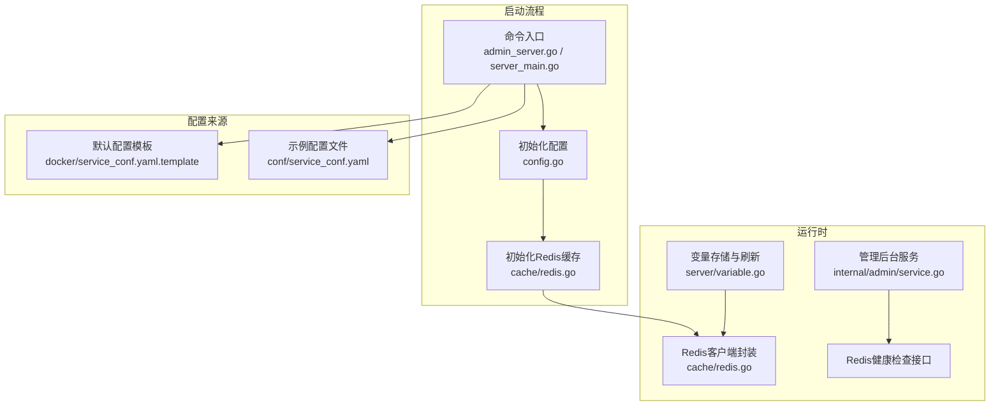
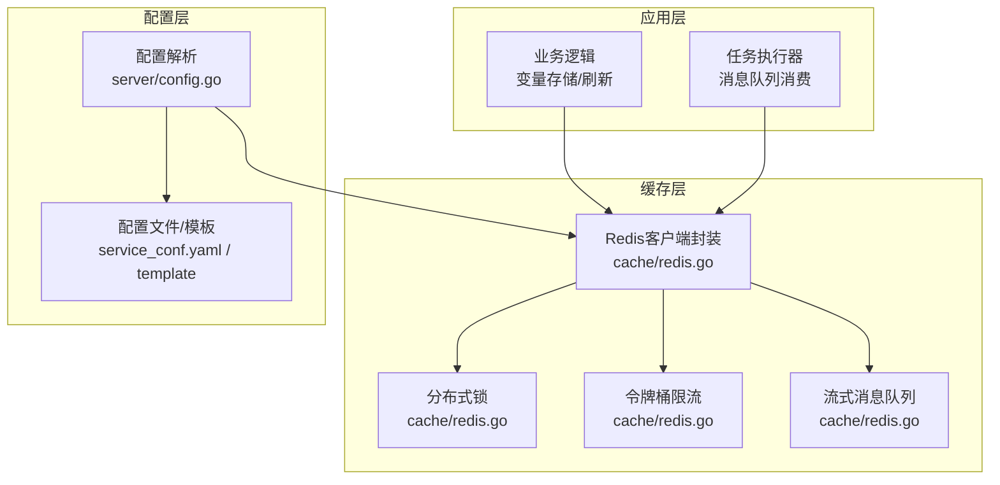
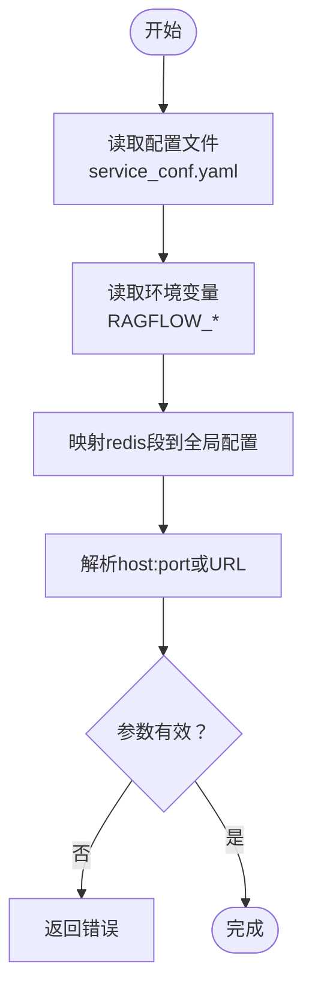
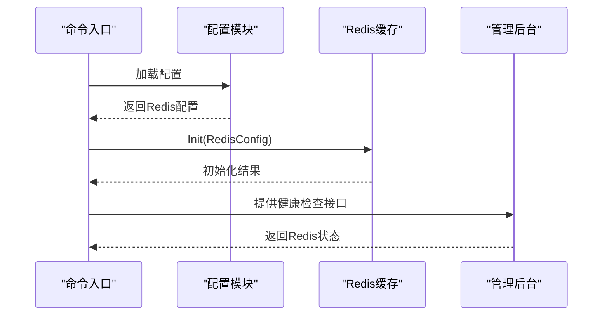
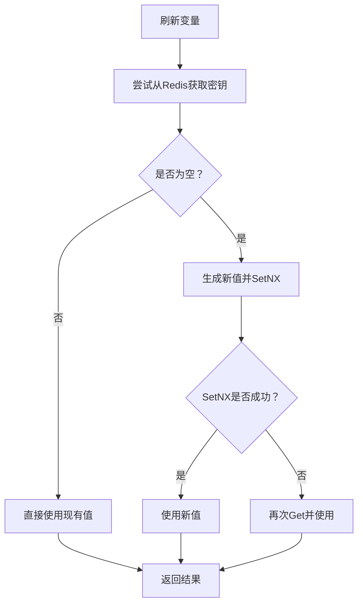
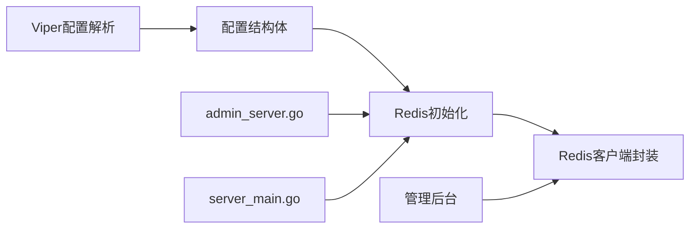

# 缓存配置

<cite>
**本文引用的文件**
- [redis.go](file://internal/cache/redis.go)
- [config.go](file://internal/server/config.go)
- [service_conf.yaml](file://conf/service_conf.yaml)
- [service_conf.yaml.template](file://docker/service_conf.yaml.template)
- [admin_server.go](file://cmd/admin_server.go)
- [server_main.go](file://cmd/server_main.go)
- [service.go](file://internal/admin/service.go)
- [variable.go](file://internal/server/variable.go)
</cite>

## 目录
1. [简介](#简介)
2. [项目结构](#项目结构)
3. [核心组件](#核心组件)
4. [架构总览](#架构总览)
5. [详细组件分析](#详细组件分析)
6. [依赖分析](#依赖分析)
7. [性能考虑](#性能考虑)
8. [故障排查指南](#故障排查指南)
9. [结论](#结论)
10. [附录](#附录)

## 简介
本文件面向RAGFlow的缓存配置与使用，聚焦于系统内置的Redis缓存能力。内容涵盖：
- 支持的缓存类型与配置方式（当前以Redis为主）
- Redis配置项详解：连接地址、认证信息、数据库选择、连接池设置等
- 高级选项：集群/哨兵模式、密码认证等
- 最佳实践与性能优化：内存、持久化、过期策略
- 监控指标、调优参数与故障处理
- 缓存一致性与数据同步机制说明

## 项目结构
RAGFlow在后端通过Go模块提供统一的Redis客户端封装，并在启动阶段完成初始化与健康检查；同时在管理界面提供Redis服务状态检测。



**图表来源**
- [admin_server.go:98-107](file://cmd/admin_server.go#L98-L107)
- [server_main.go:115-128](file://cmd/server_main.go#L115-L128)
- [config.go:544-570](file://internal/server/config.go#L544-L570)
- [redis.go:107-145](file://internal/cache/redis.go#L107-L145)
- [variable.go:136-187](file://internal/server/variable.go#L136-L187)
- [service.go:1066-1096](file://internal/admin/service.go#L1066-L1096)

**章节来源**
- [admin_server.go:98-107](file://cmd/admin_server.go#L98-L107)
- [server_main.go:115-128](file://cmd/server_main.go#L115-L128)
- [config.go:544-570](file://internal/server/config.go#L544-L570)
- [redis.go:107-145](file://internal/cache/redis.go#L107-L145)
- [service_conf.yaml:42-48](file://conf/service_conf.yaml#L42-L48)
- [service_conf.yaml.template:54-58](file://docker/service_conf.yaml.template#L54-L58)

## 核心组件
- Redis客户端封装：提供连接建立、健康检查、基础KV操作、集合/有序集操作、流式消息队列、分布式锁、令牌桶限流等能力。
- 配置解析：从配置文件与环境变量加载Redis配置，并进行格式校验与映射。
- 启动初始化：在服务启动时按顺序初始化配置、Redis客户端并进行健康检查。
- 管理后台：提供Redis健康检查接口，用于运维监控。

**章节来源**
- [redis.go:42-49](file://internal/cache/redis.go#L42-L49)
- [config.go:196-202](file://internal/server/config.go#L196-L202)
- [admin_server.go:98-107](file://cmd/admin_server.go#L98-L107)
- [service.go:1066-1096](file://internal/admin/service.go#L1066-L1096)

## 架构总览
RAGFlow的缓存层以Redis为核心，通过统一的客户端封装向上提供多种高级功能，如分布式锁、令牌桶限流、流式消息队列等。配置层负责从多源加载并校验Redis参数，确保启动阶段的可用性。



**图表来源**
- [redis.go:885-985](file://internal/cache/redis.go#L885-L985)
- [config.go:544-570](file://internal/server/config.go#L544-L570)
- [variable.go:136-187](file://internal/server/variable.go#L136-L187)

## 详细组件分析

### Redis客户端封装（cache/redis.go）
- 连接建立与健康检查：支持超时控制、Ping连通性验证、Info解析与关键指标提取。
- 基础操作：Get/Set/SetNX、对象序列化/反序列化、键存在性判断、过期与TTL管理。
- 集合与有序集：Set/Remove/Members/IsMember、ZAdd/ZCount/ZPopMin/ZRangeByScore/ZRemRangeByScore。
- 流式消息队列：生产者（XAdd）、消费者组创建与读取（XReadGroup/XInfoGroups）、ACK与Pending查询、重入队列。
- 分布式锁：基于SETNX与Lua脚本删除的原子性实现，支持阻塞获取。
- 令牌桶限流：基于Lua脚本的单Redis实例限流，支持容量与速率参数。
- 工具函数：随机睡眠、底层客户端访问等。

```mermaid
classDiagram
class RedisClient {
-client : "redis.Client"
-luaDeleteIfEqual : "Script"
-luaTokenBucket : "Script"
-config : "RedisConfig"
+Health() bool
+Info() map[string]interface{}
+Get(key) string
+Set(key, value, exp) bool
+SetNX(key, value, exp) bool
+SetObj(key, obj, exp) bool
+GetObj(key, dest) bool
+Exist(key) (bool, error)
+Expire(key, exp) bool
+TTL(key) time.Duration
+Delete(key) bool
+SAdd(key, member) bool
+SRem(key, member) bool
+SMembers(key) []string
+SIsMember(key, member) bool
+ZAdd(key, member, score) bool
+ZCount(key, min, max) int64
+ZPopMin(key, count) []Z
+ZRangeByScore(key, min, max) []string
+ZRemRangeByScore(key, min, max) int64
+QueueProduct(queue, message) bool
+QueueConsumer(queue, group, consumer, msgID) RedisMsg
+QueueInfo(queue, group) map[string]interface{}
+GetPendingMsg(queue, group) []XPendingExt
+RequeueMsg(queue, group, msgID)
+GetClient() *redis.Client
}
class DistributedLock {
-client : "RedisClient"
-lockKey : string
-lockValue : string
-timeout : time.Duration
-blockingTimeout : time.Duration
+Acquire() bool
+SpinAcquire(ctx) error
+Release() bool
}
class TokenBucket {
-client : "RedisClient"
-key : string
-capacity : float64
-rate : float64
+Allow(cost) (bool, float64)
}
RedisClient --> DistributedLock : "封装"
RedisClient --> TokenBucket : "封装"
```

**图表来源**
- [redis.go:42-49](file://internal/cache/redis.go#L42-L49)
- [redis.go:885-943](file://internal/cache/redis.go#L885-L943)
- [redis.go:945-985](file://internal/cache/redis.go#L945-L985)

**章节来源**
- [redis.go:107-145](file://internal/cache/redis.go#L107-L145)
- [redis.go:165-186](file://internal/cache/redis.go#L165-L186)
- [redis.go:188-225](file://internal/cache/redis.go#L188-L225)
- [redis.go:276-344](file://internal/cache/redis.go#L276-L344)
- [redis.go:410-534](file://internal/cache/redis.go#L410-L534)
- [redis.go:630-726](file://internal/cache/redis.go#L630-L726)
- [redis.go:801-829](file://internal/cache/redis.go#L801-L829)
- [redis.go:831-883](file://internal/cache/redis.go#L831-L883)
- [redis.go:885-985](file://internal/cache/redis.go#L885-L985)

### 配置解析与加载（server/config.go）
- Redis配置结构体包含主机、端口、密码、数据库索引。
- 配置来源优先级：配置文件 → 环境变量（前缀RAGFLOW，点号转下划线）。
- 地址解析：支持“host:port”或URL格式，自动拆分主机与端口。
- 映射逻辑：将独立的redis段映射到全局配置中，并生成额外字段用于服务发现。



**图表来源**
- [config.go:453-570](file://internal/server/config.go#L453-L570)
- [config.go:746-768](file://internal/server/config.go#L746-L768)

**章节来源**
- [config.go:196-202](file://internal/server/config.go#L196-L202)
- [config.go:453-570](file://internal/server/config.go#L453-L570)
- [config.go:746-768](file://internal/server/config.go#L746-L768)

### 启动初始化与健康检查（admin_server.go / server_main.go）
- 在服务启动时调用缓存初始化函数，传入Redis配置。
- 初始化成功后可从Redis加载变量（如密钥），失败则记录致命日志并退出。
- 管理后台提供Redis健康检查接口，返回存活状态与耗时。



**图表来源**
- [admin_server.go:98-107](file://cmd/admin_server.go#L98-L107)
- [server_main.go:115-128](file://cmd/server_main.go#L115-L128)
- [service.go:1066-1096](file://internal/admin/service.go#L1066-L1096)

**章节来源**
- [admin_server.go:98-107](file://cmd/admin_server.go#L98-L107)
- [server_main.go:115-128](file://cmd/server_main.go#L115-L128)
- [service.go:1066-1096](file://internal/admin/service.go#L1066-L1096)

### 变量存储与刷新（server/variable.go）
- 使用Redis作为变量存储介质，支持原子性生成与并发安全获取。
- 刷新流程：从Redis读取密钥，若存在则更新全局变量；失败则记录告警并回退。



**图表来源**
- [variable.go:136-187](file://internal/server/variable.go#L136-L187)

**章节来源**
- [variable.go:136-187](file://internal/server/variable.go#L136-L187)

## 依赖分析
- 配置层依赖Viper进行配置文件与环境变量解析，并对Redis配置进行格式校验与映射。
- 缓存层依赖go-redis v9，提供高阶Lua脚本、事务管道、流式消息队列等能力。
- 启动层在两个入口处均调用缓存初始化，确保服务可用性。
- 管理后台依赖缓存层提供的健康检查接口。



**图表来源**
- [config.go:453-570](file://internal/server/config.go#L453-L570)
- [redis.go:107-145](file://internal/cache/redis.go#L107-L145)
- [admin_server.go:98-107](file://cmd/admin_server.go#L98-L107)
- [server_main.go:115-128](file://cmd/server_main.go#L115-L128)
- [service.go:1066-1096](file://internal/admin/service.go#L1066-L1096)

**章节来源**
- [config.go:453-570](file://internal/server/config.go#L453-L570)
- [redis.go:107-145](file://internal/cache/redis.go#L107-L145)
- [admin_server.go:98-107](file://cmd/admin_server.go#L98-L107)
- [server_main.go:115-128](file://cmd/server_main.go#L115-L128)
- [service.go:1066-1096](file://internal/admin/service.go#L1066-L1096)

## 性能考虑
- 连接与超时
  - 默认连接超时常量用于Ping与初始化阶段，避免长时间阻塞。
  - 建议根据网络状况调整部署环境的超时参数。
- 过期策略
  - 对需要时效性的键设置合理TTL，结合业务场景使用Expire/TTL管理。
- 流式消息队列
  - 消费组创建与读取采用阻塞读取，建议在消费者侧做好重试与ACK处理。
- 分布式锁与限流
  - 分布式锁基于SETNX与Lua脚本，避免竞态；令牌桶限流适合单实例限速。
- 内存与持久化
  - 建议结合Redis内存淘汰策略与持久化方案（RDB/AOF）进行容量规划与备份策略设计。
- 并发与原子性
  - 使用SetNX、Lua脚本与管道（Pipeline）提升并发下的原子性与吞吐。

[本节为通用指导，不直接分析具体文件]

## 故障排查指南
- 启动失败
  - 若Redis初始化失败，将在启动日志中记录错误原因；请检查配置文件与网络连通性。
- 健康检查失败
  - 管理后台的Redis健康检查会返回错误信息，定位到客户端未初始化或Ping失败。
- 键值操作异常
  - 观察日志中的Warn级别错误，确认键是否存在、TTL是否正确、序列化是否成功。
- 流式消息队列
  - 检查消费者组是否创建成功、消息ID是否正确、ACK是否及时调用。
- 分布式锁与限流
  - 锁未释放导致阻塞时，可通过DeleteIfEqual清理；限流策略需结合业务流量模型调整容量与速率。

**章节来源**
- [admin_server.go:98-107](file://cmd/admin_server.go#L98-L107)
- [service.go:1066-1096](file://internal/admin/service.go#L1066-L1096)
- [redis.go:165-186](file://internal/cache/redis.go#L165-L186)
- [redis.go:276-344](file://internal/cache/redis.go#L276-L344)
- [redis.go:630-726](file://internal/cache/redis.go#L630-L726)
- [redis.go:831-883](file://internal/cache/redis.go#L831-L883)

## 结论
RAGFlow的缓存体系以Redis为核心，通过统一的客户端封装提供了丰富的高级能力，覆盖分布式锁、令牌桶限流、流式消息队列等典型场景。配置层支持灵活的文件与环境变量注入，并在启动阶段完成初始化与健康检查，保障服务可用性。结合合理的过期策略、内存与持久化配置以及监控指标，可进一步提升系统的稳定性与性能。

[本节为总结性内容，不直接分析具体文件]

## 附录

### Redis配置项说明
- host：Redis服务器地址（支持“host:port”或URL格式）
- port：Redis服务器端口
- password：Redis访问密码
- db：数据库索引（默认0）

上述字段来源于配置结构体与配置解析逻辑，地址解析与映射均在配置模块中完成。

**章节来源**
- [config.go:196-202](file://internal/server/config.go#L196-L202)
- [config.go:544-570](file://internal/server/config.go#L544-L570)
- [config.go:746-768](file://internal/server/config.go#L746-L768)

### 配置文件与模板
- 示例配置文件：包含默认的Redis配置项与数据库、对象存储等其他组件配置。
- Docker模板：提供环境变量占位符，便于容器化部署时注入配置。

**章节来源**
- [service_conf.yaml:42-48](file://conf/service_conf.yaml#L42-L48)
- [service_conf.yaml.template:54-58](file://docker/service_conf.yaml.template#L54-L58)

### 高级选项与限制说明
- 集群/哨兵模式
  - 当前缓存封装与配置解析未显式支持集群/哨兵模式参数；如需使用，请在上游部署Redis集群/哨兵并通过单实例代理或负载均衡暴露单一连接地址。
- 密码认证
  - 支持通过配置项与环境变量设置密码；建议配合TLS与最小权限原则使用。
- 连接池设置
  - 客户端库默认连接池行为由go-redis控制；如需精细化调优，可在上层通过GetClient获取底层客户端进行扩展配置。

**章节来源**
- [redis.go:115-145](file://internal/cache/redis.go#L115-L145)
- [config.go:544-570](file://internal/server/config.go#L544-L570)

### 监控指标与健康检查
- 健康检查：Ping连通性与短生命周期键读写验证。
- 服务器信息：版本、内存、客户端数、瞬时QPS等关键指标解析。
- 管理后台：提供Redis服务状态检测接口，返回存活状态与耗时。

**章节来源**
- [redis.go:165-186](file://internal/cache/redis.go#L165-L186)
- [redis.go:188-225](file://internal/cache/redis.go#L188-L225)
- [service.go:1066-1096](file://internal/admin/service.go#L1066-L1096)

### 缓存一致性与数据同步
- 原子性操作：SetNX、Lua脚本、管道（Pipeline）等手段保证并发安全。
- 分布式锁：基于SETNX与Lua脚本删除，避免竞态条件。
- 令牌桶限流：单实例限流策略，适用于请求削峰与配额控制。
- 数据同步：流式消息队列通过消费者组实现可靠投递与ACK确认，建议结合业务需求设置合理的重试与死信处理。

**章节来源**
- [redis.go:359-371](file://internal/cache/redis.go#L359-L371)
- [redis.go:831-843](file://internal/cache/redis.go#L831-L843)
- [redis.go:911-943](file://internal/cache/redis.go#L911-L943)
- [redis.go:966-985](file://internal/cache/redis.go#L966-L985)
- [redis.go:630-726](file://internal/cache/redis.go#L630-L726)