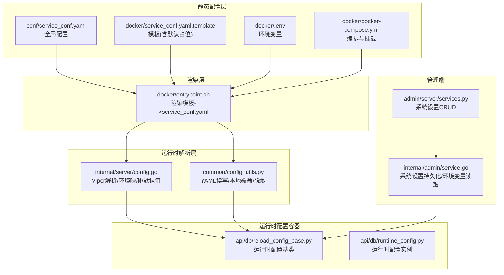
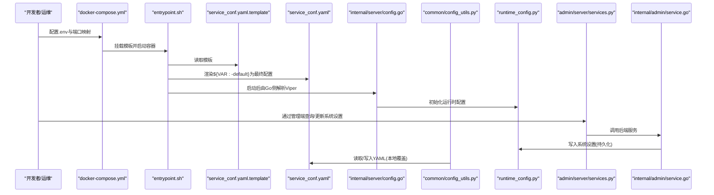
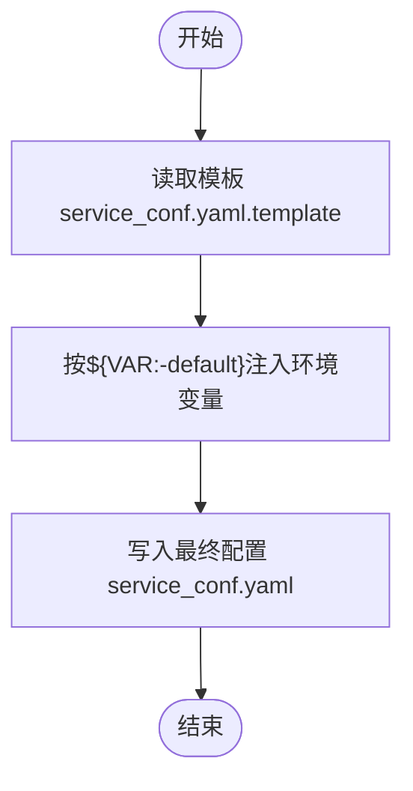
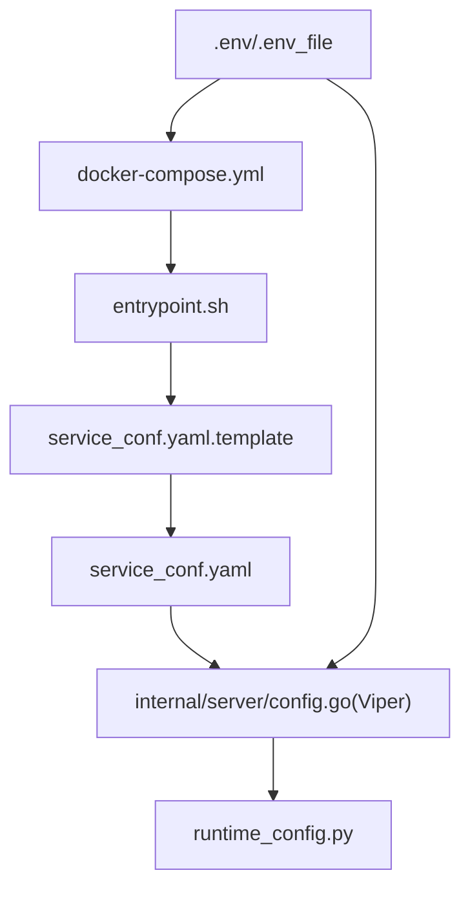
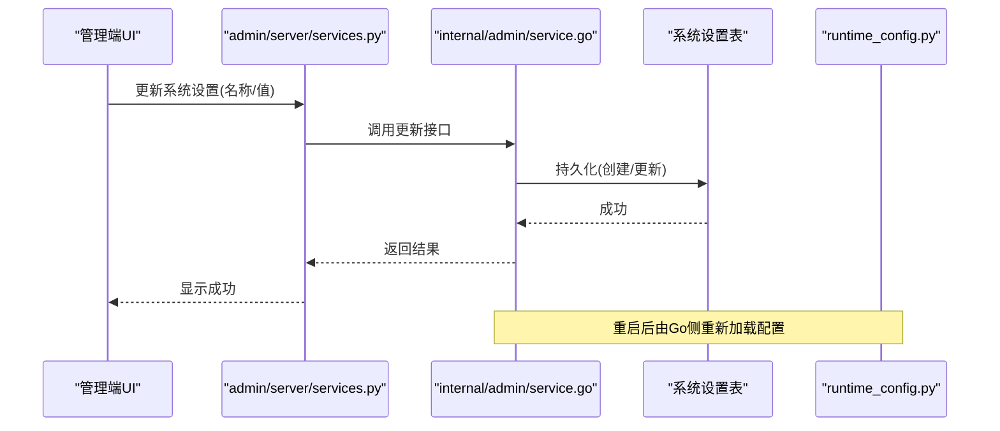
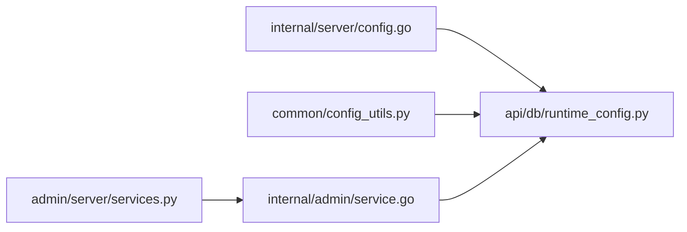

# 配置管理

<cite>
**本文引用的文件**
- [conf/service_conf.yaml](file://conf/service_conf.yaml)
- [docker/service_conf.yaml.template](file://docker/service_conf.yaml.template)
- [docker/docker-compose.yml](file://docker/docker-compose.yml)
- [docker/entrypoint.sh](file://docker/entrypoint.sh)
- [internal/server/config.go](file://internal/server/config.go)
- [common/config_utils.py](file://common/config_utils.py)
- [api/db/reload_config_base.py](file://api/db/reload_config_base.py)
- [api/db/runtime_config.py](file://api/db/runtime_config.py)
- [admin/server/services.py](file://admin/server/services.py)
- [internal/admin/service.go](file://internal/admin/service.go)
- [common/crypto_utils.py](file://common/crypto_utils.py)
</cite>

## 目录
1. [简介](#简介)
2. [项目结构](#项目结构)
3. [核心组件](#核心组件)
4. [架构总览](#架构总览)
5. [详细组件分析](#详细组件分析)
6. [依赖分析](#依赖分析)
7. [性能考虑](#性能考虑)
8. [故障排查指南](#故障排查指南)
9. [结论](#结论)
10. [附录](#附录)

## 简介
本文件面向管理员与开发者，系统性梳理 RAGFlow 的配置管理体系，覆盖以下主题：
- 配置文件结构与层次：全局配置、本地覆盖、模板化配置与环境变量注入
- 环境变量体系：系统级、Docker 级、运行时注入与优先级
- 动态配置能力：运行时配置读取、加密存储与安全更新
- 关键子系统配置：数据库、对象存储、消息队列、检索引擎、LLM 默认模型等
- 最佳实践与安全建议：最小暴露面、密钥管理、端口与网络隔离、日志级别与可观测性

## 项目结构
RAGFlow 的配置由“模板 + 环境变量注入 + 运行时合并”构成，主要位置如下：
- 全局 YAML 配置：conf/service_conf.yaml
- Docker 模板：docker/service_conf.yaml.template（支持 ${VAR:-default} 语法）
- Docker 编排：docker/docker-compose.yml（挂载模板、env_file 注入）
- 启动脚本：docker/entrypoint.sh（渲染模板到最终 service_conf.yaml）
- Go 侧配置解析：internal/server/config.go（Viper 解析、环境变量映射、默认值处理）
- Python 侧配置工具：common/config_utils.py（YAML 读写、本地覆盖、敏感字段脱敏）
- 运行时配置容器：api/db/runtime_config.py 与 api/db/reload_config_base.py（运行时读取）
- 管理端配置接口：admin/server/services.py 与 internal/admin/service.go（系统设置 CRUD）

**图表来源**
- [conf/service_conf.yaml:1-160](file://conf/service_conf.yaml#L1-L160)
- [docker/service_conf.yaml.template:1-172](file://docker/service_conf.yaml.template#L1-L172)
- [docker/docker-compose.yml:1-135](file://docker/docker-compose.yml#L1-L135)
- [docker/entrypoint.sh:151-174](file://docker/entrypoint.sh#L151-L174)
- [internal/server/config.go:453-510](file://internal/server/config.go#L453-L510)
- [common/config_utils.py:55-72](file://common/config_utils.py#L55-L72)
- [api/db/reload_config_base.py:16-28](file://api/db/reload_config_base.py#L16-L28)
- [api/db/runtime_config.py:20-55](file://api/db/runtime_config.py#L20-L55)
- [admin/server/services.py:332-412](file://admin/server/services.py#L332-L412)
- [internal/admin/service.go:1456-1487](file://internal/admin/service.go#L1456-L1487)

**章节来源**
- [conf/service_conf.yaml:1-160](file://conf/service_conf.yaml#L1-L160)
- [docker/service_conf.yaml.template:1-172](file://docker/service_conf.yaml.template#L1-L172)
- [docker/docker-compose.yml:1-135](file://docker/docker-compose.yml#L1-L135)
- [docker/entrypoint.sh:151-174](file://docker/entrypoint.sh#L151-L174)
- [internal/server/config.go:453-510](file://internal/server/config.go#L453-L510)
- [common/config_utils.py:55-72](file://common/config_utils.py#L55-L72)
- [api/db/reload_config_base.py:16-28](file://api/db/reload_config_base.py#L16-L28)
- [api/db/runtime_config.py:20-55](file://api/db/runtime_config.py#L20-L55)
- [admin/server/services.py:332-412](file://admin/server/services.py#L332-L412)
- [internal/admin/service.go:1456-1487](file://internal/admin/service.go#L1456-L1487)

## 核心组件
- 配置文件与模板
  - 全局 YAML：定义服务主机、端口、数据库、对象存储、检索引擎、Redis、任务执行器、默认 LLM 等
  - Docker 模板：通过 ${VAR:-default} 语法从环境变量注入，便于容器化部署
- 渲染与挂载
  - docker-compose.yml 将模板挂载至容器内；entrypoint.sh 在启动时将模板渲染为最终 service_conf.yaml
- 运行时解析
  - Go 侧：internal/server/config.go 使用 Viper 解析 YAML，并将环境变量映射到结构体，设置默认值
  - Python 侧：common/config_utils.py 支持本地覆盖、读写 YAML、敏感字段脱敏
- 运行时配置容器
  - api/db/runtime_config.py 提供运行时配置读取与环境注入
- 管理端配置
  - admin/server/services.py 与 internal/admin/service.go 提供系统设置的查询、更新与持久化

**章节来源**
- [conf/service_conf.yaml:1-160](file://conf/service_conf.yaml#L1-L160)
- [docker/service_conf.yaml.template:1-172](file://docker/service_conf.yaml.template#L1-L172)
- [docker/docker-compose.yml:39-46](file://docker/docker-compose.yml#L39-L46)
- [docker/entrypoint.sh:151-174](file://docker/entrypoint.sh#L151-L174)
- [internal/server/config.go:212-368](file://internal/server/config.go#L212-L368)
- [common/config_utils.py:55-72](file://common/config_utils.py#L55-L72)
- [api/db/runtime_config.py:20-55](file://api/db/runtime_config.py#L20-L55)
- [admin/server/services.py:332-412](file://admin/server/services.py#L332-L412)
- [internal/admin/service.go:1456-1487](file://internal/admin/service.go#L1456-L1487)

## 架构总览
下图展示从模板到运行时配置的完整链路，以及管理端对系统设置的读写。

**图表来源**
- [docker/docker-compose.yml:39-46](file://docker/docker-compose.yml#L39-L46)
- [docker/entrypoint.sh:151-174](file://docker/entrypoint.sh#L151-L174)
- [docker/service_conf.yaml.template:1-172](file://docker/service_conf.yaml.template#L1-L172)
- [internal/server/config.go:212-368](file://internal/server/config.go#L212-L368)
- [common/config_utils.py:55-72](file://common/config_utils.py#L55-L72)
- [api/db/runtime_config.py:20-55](file://api/db/runtime_config.py#L20-L55)
- [admin/server/services.py:332-412](file://admin/server/services.py#L332-L412)
- [internal/admin/service.go:1456-1487](file://internal/admin/service.go#L1456-L1487)

## 详细组件分析

### 1) 配置文件结构与层次
- 全局配置 conf/service_conf.yaml
  - 包含 ragflow/admin 主机与端口、MySQL、MinIO、Elasticsearch/OpenSearch、Infinity、OceanBase、Redis、任务执行器、用户默认 LLM 等
  - 未启用的外部服务以注释形式保留，便于按需开启
- Docker 模板 docker/service_conf.yaml.template
  - 使用 ${VAR:-default} 语法，支持默认值回退
  - 常见键：数据库、对象存储、检索引擎、Redis、任务执行器、默认 LLM 等
- 本地覆盖与渲染
  - docker-compose.yml 将模板挂载到容器内
  - entrypoint.sh 在启动时将模板渲染为最终 service_conf.yaml

**图表来源**
- [docker/entrypoint.sh:151-174](file://docker/entrypoint.sh#L151-L174)
- [docker/service_conf.yaml.template:1-172](file://docker/service_conf.yaml.template#L1-L172)
- [docker/docker-compose.yml:44-45](file://docker/docker-compose.yml#L44-L45)

**章节来源**
- [conf/service_conf.yaml:1-160](file://conf/service_conf.yaml#L1-L160)
- [docker/service_conf.yaml.template:1-172](file://docker/service_conf.yaml.template#L1-L172)
- [docker/docker-compose.yml:39-46](file://docker/docker-compose.yml#L39-L46)
- [docker/entrypoint.sh:151-174](file://docker/entrypoint.sh#L151-L174)

### 2) 环境变量体系与优先级
- 系统环境变量
  - Go 侧：internal/server/config.go 使用 Viper 自动读取环境变量，前缀 RAGFLOW，点号转下划线替换
  - Docker 侧：docker-compose.yml 通过 env_file 引入 .env；entrypoint.sh 支持命令行标志控制组件启停
- Docker 级变量
  - 模板中大量使用 ${VAR:-default}，如 MYSQL_HOST、MINIO_HOST、ES_HOST、REDIS_HOST 等
- 优先级与生效顺序
  - 渲染阶段：模板中的 ${VAR:-default} 优先使用容器内环境变量，否则采用默认值
  - 运行时：Go 侧 Viper 会将环境变量映射到结构体字段；若 YAML 中已有值则不被覆盖
  - 管理端：系统设置可通过管理端更新，持久化到数据库，重启后由 Go 侧重新加载

**图表来源**
- [docker/docker-compose.yml:46-46](file://docker/docker-compose.yml#L46-L46)
- [docker/entrypoint.sh:151-174](file://docker/entrypoint.sh#L151-L174)
- [internal/server/config.go:470-473](file://internal/server/config.go#L470-L473)

**章节来源**
- [internal/server/config.go:470-473](file://internal/server/config.go#L470-L473)
- [docker/docker-compose.yml:46-46](file://docker/docker-compose.yml#L46-L46)
- [docker/entrypoint.sh:151-174](file://docker/entrypoint.sh#L151-L174)

### 3) 动态配置更新机制
- 管理端系统设置
  - admin/server/services.py 提供 SettingsMgr：查询、按名获取、按名更新或创建
  - internal/admin/service.go 提供系统设置持久化逻辑，支持数据类型推断（字符串/布尔/json）
- 运行时配置读取
  - api/db/reload_config_base.py 提供统一读取接口
  - api/db/runtime_config.py 提供运行时配置容器，支持初始化、环境注入、服务数据库注入
- 配置验证与回滚
  - Go 侧在 FromEnvironments/FromConfigFile 中进行类型校验与默认值设置
  - Python 侧通过 FileLock 保证 YAML 写入原子性，避免并发冲突
- 加密与安全
  - common/config_utils.py 支持解密数据库密码（基于私钥与模块函数）
  - common/crypto_utils.py 提供多种对称加密算法封装，用于敏感数据存储

**图表来源**
- [admin/server/services.py:332-412](file://admin/server/services.py#L332-L412)
- [internal/admin/service.go:1456-1487](file://internal/admin/service.go#L1456-L1487)
- [api/db/runtime_config.py:20-55](file://api/db/runtime_config.py#L20-L55)

**章节来源**
- [admin/server/services.py:332-412](file://admin/server/services.py#L332-L412)
- [internal/admin/service.go:1456-1487](file://internal/admin/service.go#L1456-L1487)
- [api/db/reload_config_base.py:16-28](file://api/db/reload_config_base.py#L16-L28)
- [api/db/runtime_config.py:20-55](file://api/db/runtime_config.py#L20-L55)
- [common/config_utils.py:119-144](file://common/config_utils.py#L119-L144)
- [common/crypto_utils.py:256-317](file://common/crypto_utils.py#L256-L317)

### 4) 关键配置项详解
- 数据库配置
  - MySQL：主机、端口、用户名、密码、库名、字符集等
  - 可通过环境变量覆盖，或在 conf/service_conf.yaml 中直接配置
- 对象存储配置
  - MinIO：主机、端口、用户、密码、桶、路径前缀、是否启用 HTTPS、证书校验
  - S3/OSS：访问密钥、区域、端点、签名版本、寻址风格等
- 检索引擎配置
  - Elasticsearch/OpenSearch：主机、用户名、密码
  - Infinity：URI、Postgres 端口、数据库名
  - OceanBase/SeekDB：方案、数据库名、用户、密码、主机、端口
- 缓存与消息队列
  - Redis：主机、端口、密码、DB
  - 任务执行器：消息队列类型（如 Redis）
- 安全与认证
  - OAuth/OIDC/GitHub 等可选配置（注释示例）
  - SMTP 邮件服务器配置（注释示例）
- 默认 LLM
  - 用户默认 LLM：聊天模型、嵌入模型、重排序模型、ASR、图像识别等默认工厂与地址

**章节来源**
- [conf/service_conf.yaml:7-111](file://conf/service_conf.yaml#L7-L111)
- [docker/service_conf.yaml.template:7-172](file://docker/service_conf.yaml.template#L7-L172)
- [internal/server/config.go:97-202](file://internal/server/config.go#L97-L202)

### 5) 运行时配置与环境注入
- 运行时配置容器
  - runtime_config.py 提供 DEBUG、HTTP_PORT、JOB_SERVER_HOST、ENV 等运行时字段
  - init_env 注入版本信息；init_config 支持动态注入键值
- 环境变量注入
  - 管理端可读取重要环境变量（如 DOC_ENGINE、DEFAULT_SUPERUSER_*），并提供默认值
- 日志与语言
  - 日志级别与格式
  - 语言自动检测（LANG/LANGUAGE）

**章节来源**
- [api/db/runtime_config.py:20-55](file://api/db/runtime_config.py#L20-L55)
- [internal/admin/service.go:1466-1487](file://internal/admin/service.go#L1466-L1487)
- [internal/server/config.go:789-800](file://internal/server/config.go#L789-L800)

## 依赖分析
- 组件耦合
  - Go 侧配置解析与运行时容器强关联（Viper -> runtime_config）
  - Python 侧配置工具与运行时容器弱耦合（仅读取/写入 YAML）
  - 管理端服务与后端服务双向交互（CRUD -> 持久化）
- 外部依赖
  - Viper（配置解析）、Zap（日志）、ruamel.yaml（YAML 安全解析）
- 潜在风险
  - 并发写入 YAML 时的锁竞争（已通过 FileLock 保护）
  - 环境变量注入顺序不当导致的默认值覆盖

**图表来源**
- [internal/server/config.go:212-368](file://internal/server/config.go#L212-L368)
- [api/db/runtime_config.py:20-55](file://api/db/runtime_config.py#L20-L55)
- [common/config_utils.py:147-155](file://common/config_utils.py#L147-L155)
- [admin/server/services.py:332-412](file://admin/server/services.py#L332-L412)
- [internal/admin/service.go:1456-1487](file://internal/admin/service.go#L1456-L1487)

**章节来源**
- [internal/server/config.go:212-368](file://internal/server/config.go#L212-L368)
- [api/db/runtime_config.py:20-55](file://api/db/runtime_config.py#L20-L55)
- [common/config_utils.py:147-155](file://common/config_utils.py#L147-L155)
- [admin/server/services.py:332-412](file://admin/server/services.py#L332-L412)
- [internal/admin/service.go:1456-1487](file://internal/admin/service.go#L1456-L1487)

## 性能考虑
- 配置解析
  - Viper 解析与默认值设置在启动阶段完成，避免运行时重复解析
- YAML 写入
  - 使用 FileLock 保证并发安全，建议在高并发场景下减少频繁写入
- 环境变量注入
  - 模板渲染在容器启动时完成，避免运行时字符串替换开销
- 日志级别
  - 生产环境建议使用 info 或更高级别，避免 debug 造成 I/O 压力

[本节为通用指导，无需具体文件引用]

## 故障排查指南
- 配置未生效
  - 检查 docker-compose.yml 是否正确挂载模板
  - 检查 entrypoint.sh 是否成功渲染 service_conf.yaml
  - 检查 Go 侧 Viper 是否读取到配置（打印所有设置）
- 环境变量无效
  - 确认环境变量前缀与点号替换规则（RAGFLOW_ 且 . 变 _）
  - 确认 .env 文件路径与变量名一致
- 管理端设置更新失败
  - 检查系统设置表是否存在重复项（按名更新时只允许一条）
  - 检查数据类型推断是否正确（sandbox.* 推断为 json，*.enabled 推断为 boolean）
- 密码解密异常
  - 确认加密开关与模块配置正确
  - 确认私钥存在且格式正确
- 运行时配置读取不到
  - 确认 runtime_config.py 已初始化并注入了环境变量

**章节来源**
- [docker/docker-compose.yml:39-46](file://docker/docker-compose.yml#L39-L46)
- [docker/entrypoint.sh:151-174](file://docker/entrypoint.sh#L151-L174)
- [internal/server/config.go:731-744](file://internal/server/config.go#L731-L744)
- [admin/server/services.py:366-393](file://admin/server/services.py#L366-L393)
- [internal/admin/service.go:1435-1451](file://internal/admin/service.go#L1435-L1451)
- [common/config_utils.py:119-144](file://common/config_utils.py#L119-L144)

## 结论
RAGFlow 的配置管理采用“模板 + 环境变量注入 + 运行时解析”的分层设计，结合管理端系统设置与运行时配置容器，实现了灵活、可维护、可扩展的配置体系。通过合理的环境变量命名、严格的默认值与类型校验、以及安全的加密与锁机制，能够在多环境部署中保持一致性与安全性。

[本节为总结，无需具体文件引用]

## 附录

### A. 环境变量清单（节选）
- 文档引擎：DOC_ENGINE（elasticsearch/infinity，默认 elasticsearch）
- 默认超级用户：DEFAULT_SUPERUSER_EMAIL、DEFAULT_SUPERUSER_PASSWORD、DEFAULT_SUPERUSER_NICKNAME
- 注册开关：REGISTER_ENABLED
- 数据库类型：DB_TYPE（mysql，默认 mysql）
- 存储实现：STORAGE_IMPL（minio/s3/oss，默认 minio）
- 语言：LANG/LANGUAGE（自动检测）
- Docker 级变量：MYSQL_*、MINIO_*、ES_*、OS_*、INFINITY_*、OCEANBASE_*、REDIS_*、TEI_HOST 等

**章节来源**
- [internal/server/config.go:370-451](file://internal/server/config.go#L370-L451)
- [internal/admin/service.go:1466-1487](file://internal/admin/service.go#L1466-L1487)
- [docker/service_conf.yaml.template:1-172](file://docker/service_conf.yaml.template#L1-L172)

### B. 最佳实践
- 最小暴露面
  - 仅在必要时开放端口；使用防火墙限制访问
  - 将敏感配置置于 .env 并纳入版本控制忽略列表
- 密钥管理
  - 使用对称加密存储敏感数据；确保私钥安全
  - 定期轮换密钥与密码
- 端口与网络
  - 将服务置于独立网络，避免跨服务暴露
  - 使用反向代理与 TLS 终止
- 日志与监控
  - 生产环境使用 info 级别日志
  - 开启健康检查与指标导出

[本节为通用指导，无需具体文件引用]