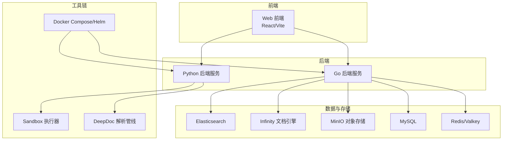
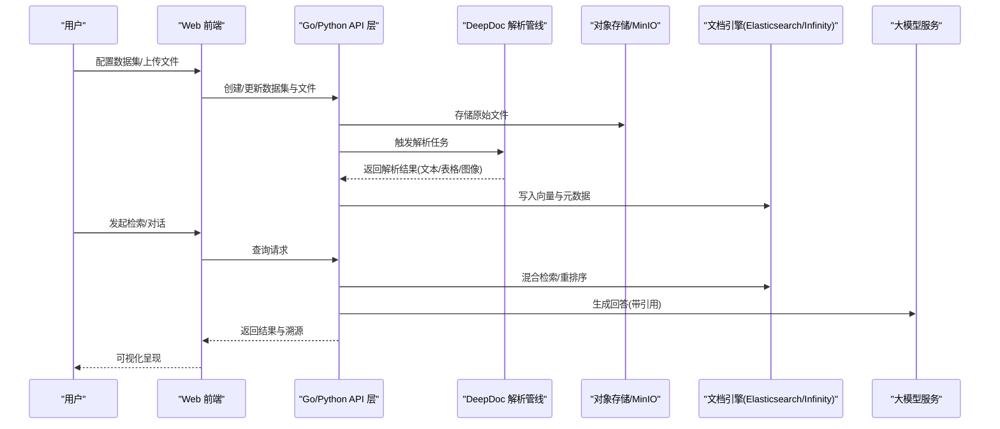
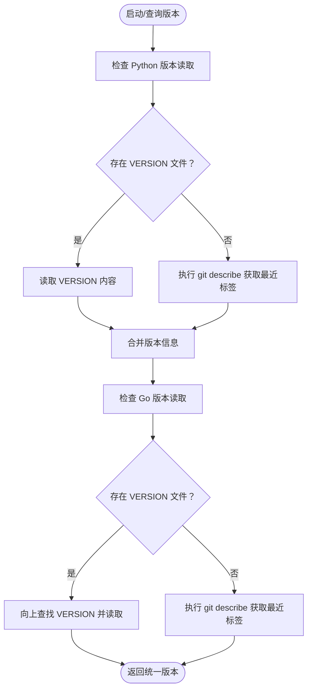
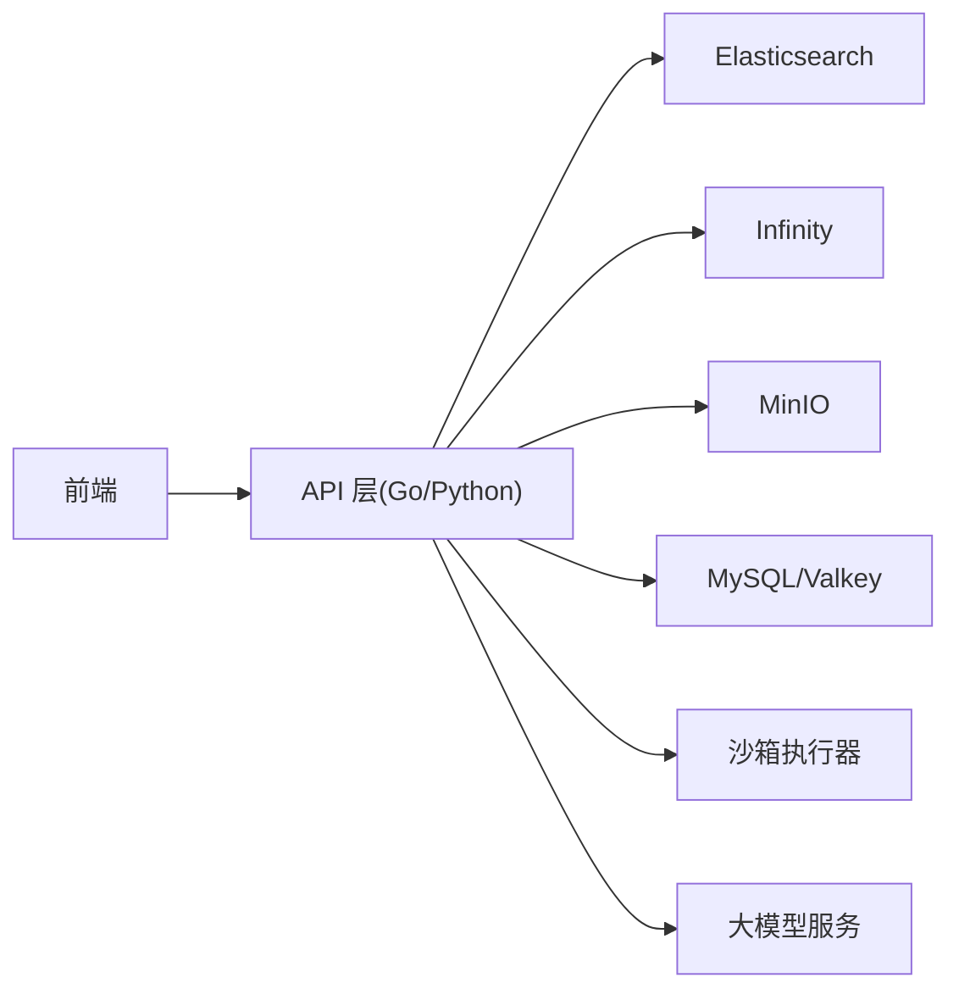

# 发展历程与路线图

<cite>
**本文引用的文件**
- [README.md](file://README.md)
- [release_notes.md](file://docs/release_notes.md)
- [quickstart.mdx](file://docs/quickstart.mdx)
- [faq.mdx](file://docs/faq.mdx)
- [versions.py](file://common/versions.py)
- [version.go](file://internal/utility/version.go)
- [pull_request_template.md](file://.github/pull_request_template.md)
</cite>

## 目录
1. [引言](#引言)
2. [项目结构](#项目结构)
3. [核心组件](#核心组件)
4. [架构总览](#架构总览)
5. [详细组件分析](#详细组件分析)
6. [依赖分析](#依赖分析)
7. [性能考虑](#性能考虑)
8. [故障排查指南](#故障排查指南)
9. [结论](#结论)
10. [附录](#附录)

## 引言
本文件系统性梳理 RAGFlow 自 2025 年以来的关键发展节点与路线图，覆盖版本发布、功能迭代、技术创新、社区建设与生态布局，并基于仓库现有资料给出未来规划方向与实施建议。内容严格基于仓库内文档与代码实现，避免臆测。

## 项目结构
RAGFlow 是一个以“深度文档理解”为核心的开源 RAG（检索增强生成）引擎，融合智能体能力，提供面向企业与个人的可扩展上下文层。项目采用多语言混合架构：后端服务由 Go 与 Python 共同支撑，前端使用现代 Web 技术栈，容器化部署通过 Docker Compose 与 Helm 提供。文档与用户指南集中于 docs 目录，便于快速上手与运维。

图表来源
- [quickstart.mdx: 40-250:40-250](file://docs/quickstart.mdx#L40-L250)
- [faq.mdx: 450-472:450-472](file://docs/faq.mdx#L450-L472)

章节来源
- [README.md: 140-254:140-254](file://README.md#L140-L254)
- [quickstart.mdx: 40-250:40-250](file://docs/quickstart.mdx#L40-L250)

## 核心组件
- 版本号与构建元信息：通过 Python 与 Go 两处版本读取逻辑，统一从仓库根目录 VERSION 文件或 git 标签推导版本信息，确保前后端一致。
- 文档引擎：默认支持 Elasticsearch，自 v0.14.0 起引入 Infinity 作为可选文档引擎，强调混合检索与高级排序能力。
- 沙箱执行器：支持本地 gVisor 与阿里云等多提供商沙箱，保障代码执行安全与可移植性。
- 多模态解析：集成 MinerU、Docling、PaddleOCR 等多种解析后端，提升 PDF/表格/图像等复杂文档处理能力。
- 智能体与工作流：自 v0.20.0 起统一编排智能体与工作流，支持 MCP 协议、运行时日志与会话管理。
- 数据源同步：支持 Confluence、S3、Notion、Discord、Google Drive 等在线数据源的增量同步。

章节来源
- [versions.py: 23-37:23-37](file://common/versions.py#L23-L37)
- [version.go: 31-66:31-66](file://internal/utility/version.go#L31-L66)
- [release_notes.md: 12-60:12-60](file://docs/release_notes.md#L12-L60)
- [release_notes.md: 167-202:167-202](file://docs/release_notes.md#L167-L202)
- [release_notes.md: 220-247:220-247](file://docs/release_notes.md#L220-L247)
- [release_notes.md: 409-410:409-410](file://docs/release_notes.md#L409-L410)
- [faq.mdx: 452-472:452-472](file://docs/faq.mdx#L452-L472)

## 架构总览
RAGFlow 的整体架构围绕“数据入湖—解析—索引—检索—生成—可视化”的闭环展开。前端负责配置与可视化；后端服务负责业务编排、任务调度与对外 API；文档引擎承担向量与全文检索；对象存储承载原始文件；沙箱执行器在受控环境中执行外部代码。

图表来源
- [quickstart.mdx: 273-354:273-354](file://docs/quickstart.mdx#L273-L354)
- [release_notes.md: 167-202:167-202](file://docs/release_notes.md#L167-L202)

## 详细组件分析

### 版本演进与里程碑（2025 年）
以下按时间倒序梳理关键版本及其新特性、改进与技术创新，帮助理解路线图制定与优先级。

- v0.24.0（2026-02-10）
  - 新增内存管理 API（HTTP/Python），支持批量元数据管理，重命名“目录页”为“页索引”，新增“思考”模式替代“推理”，优化深度研究场景召回。
  - 支持 OceanBase 替代 MySQL，新增 Kimi 2.5、Stepfun 3、doubao-embedding-vision、PaddleOCR-VL 等模型。
  - 新增 Zendesk、Bitbucket 数据源，引入多管理员账户。
  - 新增内存管理 API（HTTP/Python）。
  章节来源
  - [release_notes.md: 12-60:12-60](file://docs/release_notes.md#L12-L60)

- v0.23.1（2025-12-31）
  - 稳定性增强：修复空内存对象导致启动失败、无法删除新建空内存等问题；MDX 文件解析支持完善。
  - 新增 GitHub、Gitlab、Asana、IMAP 数据源。
  章节来源
  - [release_notes.md: 61-84:61-84](file://docs/release_notes.md#L61-L84)

- v0.23.0（2025-12-27）
  - 引入“记忆”接口，支持通过检索或消息组件配置上下文；Agent 组件重构，支持结构化输出、Webhook 触发、语音输入输出、多检索组件配置。
  - 摄入管线支持提取目录页，提升长上下文 RAG 性能；数据集支持图片/表格上下文窗口配置、父子分块策略、自动元数据生成。
  - 图数据库加速 GraphRAG 生成；文档引擎升级至 Infinity v0.6.15。
  - 新增 Google Cloud Storage、Gmail、Dropbox、WebDAV、Airtable 数据源；新增 GPT-5.2/5.1、Claude Opus 4.5、MiniMax M2、GLM-4.7、MinerU 配置界面、AI Badgr 模型提供商。
  章节来源
  - [release_notes.md: 85-140:85-140](file://docs/release_notes.md#L85-L140)

- v0.22.1（2025-11-19）
  - Agent 支持导出 Word/Markdown 输出、新增列表操作与变量聚合组件；S3 兼容数据源（如 MinIO）、JIRA 同步；Flask 异步化提升并发。
  - 新增 Gemini 3 Pro Preview。
  章节来源
  - [release_notes.md: 141-167:141-167](file://docs/release_notes.md#L141-L167)

- v0.22.0（2025-11-12）
  - 重大变更：仅提供精简版镜像（不含内置嵌入/重排模型），移除 -slim 后缀；支持五大数据源同步（S3、Google Drive、Notion、Confluence、Discord）；引入 Docling 解析器；新增图形化管理后台。
  - Agent 支持结构化输出、检索组件元数据过滤、变量聚合组件；新增交互式 Agent 模板。
  章节来源
  - [release_notes.md: 167-202:167-202](file://docs/release_notes.md#L167-L202)

- v0.21.1（2025-10-23）
  - 实验性支持 MinerU PDF 解析；UI/UX 改进；文档引擎升级至 Infinity v0.6.1；修复视频解析问题。
  章节来源
  - [release_notes.md: 203-229:203-229](file://docs/release_notes.md#L203-L229)

- v0.21.0（2025-10-15）
  - 可编排摄入管线：支持自定义数据入湖与清洗工作流；GraphRAG/RAPTOR 写入流程优化为手动批处理；长上下文 RAG：自动生成文档级目录页结构；视频文件解析扩展；新增 Admin CLI。
  章节来源
  - [release_notes.md: 220-247:220-247](file://docs/release_notes.md#L220-L247)

- v0.20.5（2025-09-10）
  - Agent 性能优化：简单任务规划/反思提速、并行工具调用优化；系统提示四大框架级提示块；SQL 组件增强为自由查询输入；恢复 Reasoning 与跨语言搜索。
  章节来源
  - [release_notes.md: 248-286:248-286](file://docs/release_notes.md#L248-L286)

- v0.20.4（2025-08-27）
  - Agent 组件完成中文本地化；新增 ENABLE_TIMEOUT_ASSERTION 环境变量；Markdown/HTML 解析增强；新增 Zhipu GLM-4.5、电商客服模板等。
  章节来源
  - [release_notes.md: 287-318:287-318](file://docs/release_notes.md#L287-L318)

- v0.20.3（2025-08-20）
  - 用户界面全面改版；搜索/聊天支持文档级元数据过滤；聊天支持三模型对比；Agent 引入引用开关与拖拽创建；修复超时机制导致的任务中断、预设问候缺失、内存泄漏等问题。
  章节来源
  - [release_notes.md: 319-350:319-350](file://docs/release_notes.md#L319-L350)

- v0.20.1（2025-08-08）
  - 检索组件支持动态指定数据集名；新增法语界面；支持 Kimi K2、Claude 4.1；新增 SQL 助手、知识库选择工作流/智能体模板。
  章节来源
  - [release_notes.md: 351-376:351-376](file://docs/release_notes.md#L351-L376)

- v0.20.0（2025-08-04）
  - 兼容性变更：Agent 与旧版本不兼容，需重建；统一编排 Agent 与工作流；完整实现 MCP 功能；提供 Agent 运行时日志与会话管理；引入更稳健的 Infinity；OpenAI 兼容 API 支持文件引用；Gitee 镜像与 Gitee AI 提供商上线。
  章节来源
  - [release_notes.md: 377-410:377-410](file://docs/release_notes.md#L377-L410)

- v0.19.1（2025-06-23）
  - 修复高并发内存泄漏、GraphRAG 下大文件冻结、Sandbox 单机上下文错误、Ollama 过度占用 CPU、代码组件缺陷；新增 Qwen 3 Embedding、Voyage 多模态 3。
  章节来源
  - [release_notes.md: 411-428:411-428](file://docs/release_notes.md#L411-L428)

- v0.19.0（2025-05-26）
  - 多语言检索支持；Agent 新增代码组件；增强图像显示；Claude 4 与 ChatGPT o3 上线；社区贡献：工具调用、Markdown 渲染、OpenSearch 文档引擎支持。
  章节来源
  - [release_notes.md: 429-445:429-445](file://docs/release_notes.md#L429-L445)

- v0.18.0（2025-04-23）
  - 移除内置重排模型；MCP 服务器启用；DeepDoc 支持 VLM 作为布局识别；OpenAI 兼容 API；注册控制；团队协作；Agent 版本控制。
  章节来源
  - [release_notes.md: 454-487:454-487](file://docs/release_notes.md#L454-L487)

- v0.17.2（2025-03-13）
  - 移除 Chat/Generate 等组件 Max_tokens 设置；新增 OpenAI 兼容 API；德语界面；加速知识图谱抽取；Tavily 搜索；QwQ 模型；CSV 支持。
  章节来源
  - [release_notes.md: 488-521:488-521](file://docs/release_notes.md#L488-L521)

- v0.17.1（2025-03-11）
  - 英文分词质量提升；Markdown 表格提取逻辑优化；SiliconFlow 模型列表更新；XLS 解析增强；Huggingface 重排模型支持；相对时间表达支持。
  章节来源
  - [release_notes.md: 522-542:522-542](file://docs/release_notes.md#L522-L542)

- v0.17.0（2025-03-03）
  - 深度研究（Agentic Reasoning）；Tavily 网络搜索增强；无需指定数据集即可开始对话；HTML 预览与引用；PDF 解析器下拉菜单；OSS 对象存储；Tag 数据集；OpenAI 兼容 API。
  章节来源
  - [release_notes.md: 548-581:548-581](file://docs/release_notes.md#L548-L581)

- v0.16.0（2025-02-06）
  - 支持 DeepSeek R1/V3；GraphRAG 重构为全库动态构建；新增迭代组件与报告生成模板；葡萄牙语界面；元数据设置；Infinity 升级；GPU 加速 DeepDoc；Tag 数据集。
  章节来源
  - [release_notes.md: 588-626:588-626](file://docs/release_notes.md#L588-L626)

- v0.15.1（2024-12-25）
  - Infinity 升级至 v0.5.2；文档解析状态日志增强；修复 SCORE/position_int 错误、嵌入模型切换问题、重复加载模型导致响应慢、RAPTOR 解析失败、表格解析信息丢失、API 杂项问题。
  章节来源
  - [release_notes.md: 627-646:627-646](file://docs/release_notes.md#L627-L646)

- v0.15.0（2024-12-18）
  - Agent 专用 API；多数据集页面评分；iframe 集成；Helm Chart；Agent 导入/导出 JSON；Agent 步进执行；日语界面；GraphRAG/RAPTOR 断点续跑；Dark Mode。
  章节来源
  - [release_notes.md: 661-694:661-694](file://docs/release_notes.md#L661-L694)

- v0.14.1（2024-11-29）
  - 新增 Infinity 配置文件；修复 Chunk 编辑显示、Elasticsearch 'Not found'、中文乱码、Polars 兼容性、Infinity 与 GraphRAG 兼容性问题。
  章节来源
  - [release_notes.md: 695-712:695-712](file://docs/release_notes.md#L695-L712)

- v0.14.0（2024-11-26）
  - 支持 Infinity 或 Elasticsearch 作为文档引擎；Agent 变量增强与自动保存；翻译/SEO 模板；HTTP/Python Agent 对话 API；同义词检索；Term Weight 计算优化；任务执行器监控增强；Redis 替换为 Valkey；印尼/西班牙/越南界面。
  章节来源
  - [release_notes.md: 713-760:713-760](file://docs/release_notes.md#L713-L760)

- v0.13.0（2024-10-31）
  - 团队管理；Agent UI 改进；General 分块方法支持 Markdown；Agent 内置 invoke 工具；Dify 知识库 API；GLM4-9B/Yi-Lightning；HTTP/Python 数据集/文件/聊天 API。
  章节来源
  - [release_notes.md: 760-790:760-790](file://docs/release_notes.md#L760-L790)

- v0.12.0（2024-09-30）
  - 提供精简版 Docker 镜像（不含内置嵌入/重排模型）；多轮对话优化；移除 LLM 供应商；OpenTTS/SparkTTS；General 分块方法 Excel 到 HTML 开关。
  章节来源
  - [release_notes.md: 790-800:790-800](file://docs/release_notes.md#L790-L800)

章节来源
- [release_notes.md: 12-800:12-800](file://docs/release_notes.md#L12-L800)

### 版本号与构建元信息
- Python 版本读取：优先读取项目根目录 VERSION 文件，否则回退到 git 描述命令，返回最近匹配 v* 标签及提交计数。
- Go 版本读取：从可执行文件所在路径向上查找 VERSION 文件，若未找到则回退到 git 描述命令。
- 版本格式解读：v主.次.修订-提交数-g短提交哈希，用于区分稳定版与开发版。

图表来源
- [versions.py: 23-37:23-37](file://common/versions.py#L23-L37)
- [version.go: 31-66:31-66](file://internal/utility/version.go#L31-L66)

章节来源
- [versions.py: 23-37:23-37](file://common/versions.py#L23-L37)
- [version.go: 31-66:31-66](file://internal/utility/version.go#L31-L66)
- [faq.mdx: 37-60:37-60](file://docs/faq.mdx#L37-L60)

### 文档引擎与数据源演进
- 文档引擎：v0.14.0 引入 Infinity 作为可选引擎，强调混合检索与高级排序；后续版本持续升级至 v0.6.15/0.6.5，显著提升检索性能与稳定性。
- 数据源：从 v0.12.0 的基础类型逐步扩展至 v0.22.0 的五大数据源同步（S3/Google Drive/Notion/Confluence/Discord），再到 v0.23.0 的 Google Cloud Storage/Gmail/Dropbox/WebDAV/Airtable，覆盖企业常用协作与云存储平台。

章节来源
- [release_notes.md: 111-112:111-112](file://docs/release_notes.md#L111-L112)
- [release_notes.md: 180-181:180-181](file://docs/release_notes.md#L180-L181)
- [release_notes.md: 114-120:114-120](file://docs/release_notes.md#L114-L120)

### 智能体与工作流统一
- v0.20.0 起统一编排智能体与工作流，支持多 Agent 配置、计划与反思、可视化功能；MCP 完整实现，支持 MCP Server 导入、Agent 作为 MCP 客户端、RAGFlow 自身作为 MCP Server。
- v0.23.0 引入“记忆”接口，支持通过检索或消息组件配置上下文；Agent 支持结构化输出、Webhook 触发、语音输入输出、多检索组件配置。
- v0.24.0 新增“思考”模式，替代“推理”，并优化深度研究场景召回。

章节来源
- [release_notes.md: 387-394:387-394](file://docs/release_notes.md#L387-L394)
- [release_notes.md: 94-99:94-99](file://docs/release_notes.md#L94-L99)
- [release_notes.md: 27-29:27-29](file://docs/release_notes.md#L27-L29)

### 多模态解析与 OCR 能力
- v0.21.1 引入 MinerU PDF 解析实验性支持；v0.22.0 支持 Docling 作为解析器；v0.24.0 支持 PaddleOCR 两种模式（官方 API 与自托管服务）。
- 解析管线支持 PDF/表格/图像等复杂文档，结合 VLM 模型进行布局识别与 OCR，显著提升长上下文 RAG 的准确性。

章节来源
- [release_notes.md: 209-210:209-210](file://docs/release_notes.md#L209-L210)
- [release_notes.md: 182-183:182-183](file://docs/release_notes.md#L182-L183)
- [release_notes.md: 590-666:590-666](file://docs/faq.mdx#L590-L666)

### 社区贡献与生态建设
- 社区贡献：工具调用、Markdown 图片渲染、OpenSearch 文档引擎支持等。
- 贡献流程：遵循 Pull Request 模板，明确问题背景、类型分类（Bug Fix/New Feature/Documentation/Refactoring/Performance Improvement/Other）。
- 社区渠道：Discord、Twitter、GitHub Discussions。

章节来源
- [release_notes.md: 440-445:440-445](file://docs/release_notes.md#L440-L445)
- [pull_request_template.md: 1-13:1-13](file://.github/pull_request_template.md#L1-L13)
- [README.md: 404-414:404-414](file://README.md#L404-L414)

## 依赖分析
- 前后端耦合：前端通过 HTTP/Python API 与后端交互；Go 侧负责核心编排与文档引擎对接；Python 侧负责解析管线与沙箱执行。
- 外部依赖：Elasticsearch/Infinity 作为文档引擎；MinIO 作为对象存储；MySQL/Valkey 作为元数据与缓存；Docker Compose/Helm 作为部署编排。
- 潜在风险：文档引擎切换（ES/Infinity）与数据迁移；多提供商沙箱兼容性；第三方 OCR/解析服务可用性。

图表来源
- [quickstart.mdx: 40-250:40-250](file://docs/quickstart.mdx#L40-L250)
- [faq.mdx: 452-472:452-472](file://docs/faq.mdx#L452-L472)

章节来源
- [quickstart.mdx: 40-250:40-250](file://docs/quickstart.mdx#L40-L250)
- [faq.mdx: 452-472:452-472](file://docs/faq.mdx#L452-L472)

## 性能考虑
- 检索性能：Term Weight 计算优化减少 50% 检索时间；混合检索与重排序策略持续优化。
- 解析吞吐：通过环境变量控制批大小（DOC_BULK_SIZE/EMBEDDING_BATCH_SIZE），平衡吞吐与内存占用。
- 并发与阻塞：Flask 从同步迁移到异步，提升并发与避免上游 LLM 请求阻塞。
- GPU 加速：DeepDoc 支持 GPU 加速，结合 vLLM/Docling Serve 等远程服务实现分布式部署。

章节来源
- [release_notes.md: 724-726:724-726](file://docs/release_notes.md#L724-L726)
- [release_notes.md: 155-155:155-155](file://docs/release_notes.md#L155-L155)
- [faq.mdx: 480-483:480-483](file://docs/faq.mdx#L480-L483)

## 故障排查指南
- 启动异常：确认 vm.max_map_count 设置；查看容器健康状态与日志；必要时重启服务。
- 解析卡顿：检查 HuggingFace 访问与缓存；调整 MEM_LIMIT；必要时增加内存。
- 文档引擎：ES 不可用时检查集群状态与端口映射；可切换至 Infinity 并注意数据清理。
- API 集成：参考 HTTP/Python API 文档与示例，确保正确配置认证与参数。

章节来源
- [faq.mdx: 146-333:146-333](file://docs/faq.mdx#L146-L333)
- [faq.mdx: 335-472:335-472](file://docs/faq.mdx#L335-L472)

## 结论
RAGFlow 在 2025 年实现了从“文档解析—检索—生成”的全链路能力跃升，重点在于：
- 文档引擎与数据源的双引擎策略与持续扩展；
- 智能体与工作流的统一编排与 MCP 协议落地；
- 多模态解析与 OCR 的工程化能力；
- 社区驱动的功能迭代与生态建设。

未来建议聚焦于：长上下文与知识图谱的深度融合、多租户权限与企业合规、SaaS 化与多云部署方案、以及更丰富的行业模板与自动化编排。

## 附录
- 快速开始与部署：参见快速入门文档，涵盖 Docker 部署、LLM 配置、数据集创建与文件解析干预、AI 聊天搭建。
- 版本与升级：遵循各版本发布说明中的兼容性变更与升级步骤，确保前后端版本一致。
- 社区与贡献：通过 Pull Request 模板提交改进，关注 Issue/讨论区获取最新动态。

章节来源
- [quickstart.mdx: 13-363:13-363](file://docs/quickstart.mdx#L13-L363)
- [release_notes.md: 12-800:12-800](file://docs/release_notes.md#L12-L800)
- [README.md: 400-414:400-414](file://README.md#L400-L414)