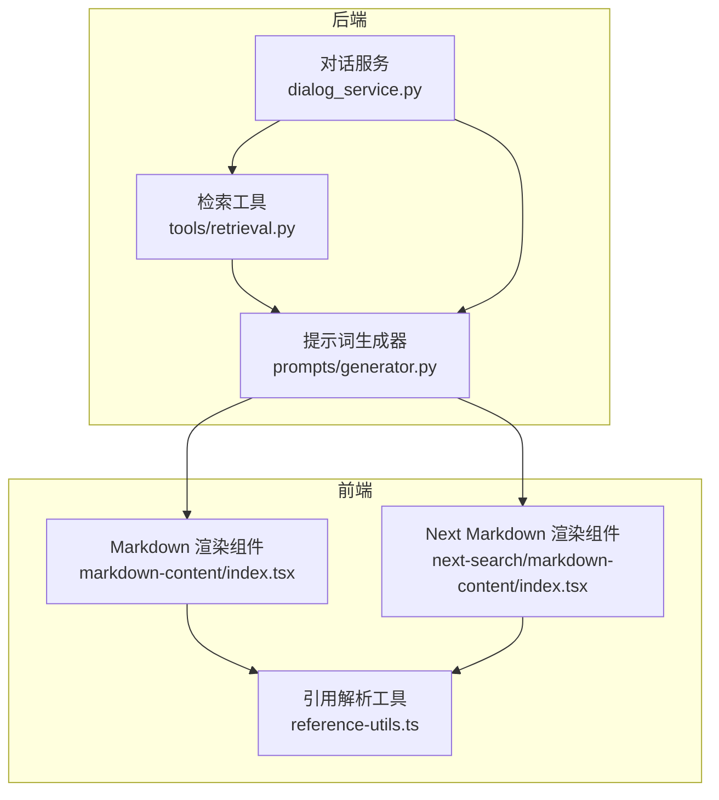
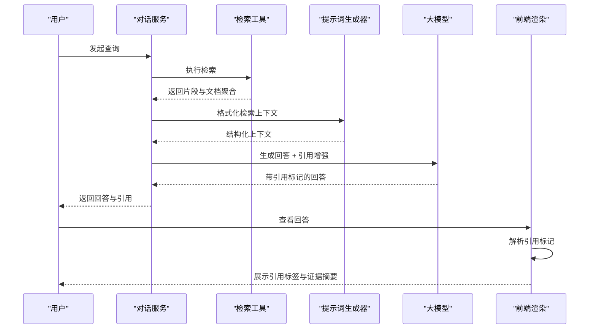
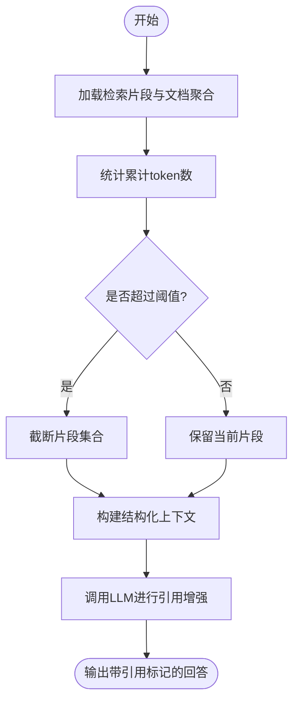
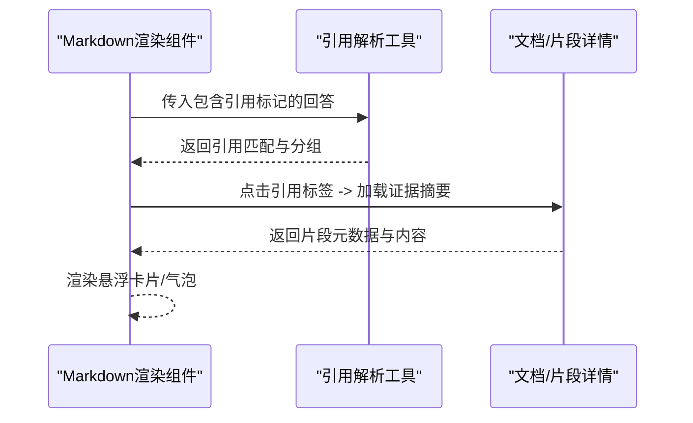
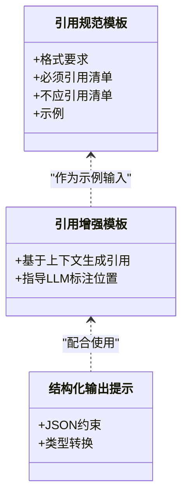
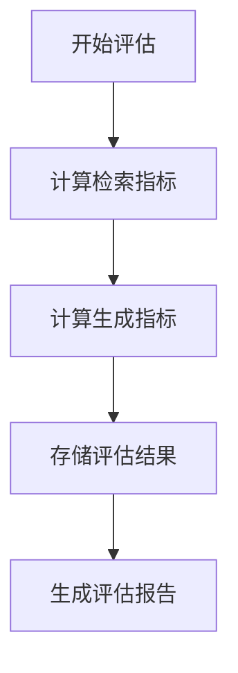

# 可信引用与溯源

<cite>
**本文引用的文件**
- [rag/prompts/citation_prompt.md](file://rag/prompts/citation_prompt.md)
- [rag/prompts/citation_plus.md](file://rag/prompts/citation_plus.md)
- [rag/prompts/generator.py](file://rag/prompts/generator.py)
- [rag/prompts/structured_output_prompt.md](file://rag/prompts/structured_output_prompt.md)
- [agent/component/agent_with_tools.py](file://agent/component/agent_with_tools.py)
- [agent/tools/retrieval.py](file://agent/tools/retrieval.py)
- [api/db/services/dialog_service.py](file://api/db/services/dialog_service.py)
- [web/src/components/markdown-content/index.tsx](file://web/src/components/markdown-content/index.tsx)
- [web/src/pages/next-search/markdown-content/index.tsx](file://web/src/pages/next-search/markdown-content/index.tsx)
- [web/src/components/markdown-content/reference-utils.ts](file://web/src/components/markdown-content/reference-utils.ts)
- [api/db/services/evaluation_service.py](file://api/db/services/evaluation_service.py)
- [api/db/db_models.py](file://api/db/db_models.py)
</cite>

## 目录
1. [引言](#引言)
2. [项目结构](#项目结构)
3. [核心组件](#核心组件)
4. [架构总览](#架构总览)
5. [详细组件分析](#详细组件分析)
6. [依赖关系分析](#依赖关系分析)
7. [性能考量](#性能考量)
8. [故障排查指南](#故障排查指南)
9. [结论](#结论)
10. [附录](#附录)

## 引言
本文件系统性阐述 RAGFlow 在“可信引用与溯源”方面的设计与实现，重点覆盖以下方面：
- 基于证据的可信回答：如何在生成阶段引入结构化引用，确保事实性陈述具备可追溯来源。
- 引用生成算法与证据匹配策略：从检索到引用标注的端到端流程。
- 引用可视化展示与溯源链路追踪：前端如何解析与渲染引用标记，以及如何通过弹出层呈现证据摘要。
- 结构化引用对“幻觉”的抑制作用：通过严格的引用规则与结构化输出，降低不可验证信息的产生。
- 高风险场景优势：在学术研究、法律咨询、医疗诊断等领域，强调可验证性与可审计性。
- 引用配置选项、可视化定制与质量评估方法：帮助用户按需调优并进行效果评估。

## 项目结构
围绕“可信引用与溯源”，RAGFlow 的关键路径横跨后端服务、检索工具、提示词工程与前端渲染四个层面：
- 后端服务：对话服务负责组织检索结果与生成流程，并在必要时启动链路追踪。
- 检索工具：将检索到的片段与文档聚合写入画布引用，供后续引用生成使用。
- 提示词工程：定义引用规范与引用增强提示模板，统一引用格式与标注策略。
- 前端渲染：解析引用标记，提供悬浮卡片或气泡展示证据摘要，支持点击跳转。

**图表来源**
- [api/db/services/dialog_service.py:717-747](file://api/db/services/dialog_service.py#L717-L747)
- [agent/tools/retrieval.py:227-258](file://agent/tools/retrieval.py#L227-L258)
- [rag/prompts/generator.py:102-147](file://rag/prompts/generator.py#L102-L147)
- [web/src/components/markdown-content/index.tsx:212-234](file://web/src/components/markdown-content/index.tsx#L212-L234)
- [web/src/pages/next-search/markdown-content/index.tsx:327-349](file://web/src/pages/next-search/markdown-content/index.tsx#L327-L349)
- [web/src/components/markdown-content/reference-utils.ts:13-25](file://web/src/components/markdown-content/reference-utils.ts#L13-L25)

**章节来源**
- [api/db/services/dialog_service.py:717-747](file://api/db/services/dialog_service.py#L717-L747)
- [agent/tools/retrieval.py:227-258](file://agent/tools/retrieval.py#L227-L258)
- [rag/prompts/generator.py:102-147](file://rag/prompts/generator.py#L102-L147)
- [web/src/components/markdown-content/index.tsx:212-234](file://web/src/components/markdown-content/index.tsx#L212-L234)
- [web/src/pages/next-search/markdown-content/index.tsx:327-349](file://web/src/pages/next-search/markdown-content/index.tsx#L327-L349)
- [web/src/components/markdown-content/reference-utils.ts:13-25](file://web/src/components/markdown-content/reference-utils.ts#L13-L25)

## 核心组件
- 引用提示词与模板
  - 引用规范模板：定义引用格式、标注位置、禁止事项与示例，确保输出严格可验证。
  - 引用增强模板：在已有文本基础上，结合提供的上下文，生成符合规范的引用标注。
  - 结构化输出提示：约束模型以 JSON 形式输出，便于下游结构化处理与校验。
- 引用生成器
  - 将检索到的片段与文档元数据格式化为“ID-标题-元数据-内容”的结构化上下文，控制上下文长度，避免超出模型上下文限制。
- 检索与引用写入
  - 检索工具将匹配到的片段与文档聚合写入画布引用，供后续引用生成使用。
- 对话服务与链路追踪
  - 对话服务在生成过程中记录 prompt 与引用信息，并在需要时启动链路追踪（如 Langfuse）。
- 前端引用解析与可视化
  - 解析引用标记，渲染为可交互的引用标签；悬浮卡片或气泡展示证据摘要，支持点击跳转至原文档。

**章节来源**
- [rag/prompts/citation_prompt.md:1-123](file://rag/prompts/citation_prompt.md#L1-L123)
- [rag/prompts/citation_plus.md:1-14](file://rag/prompts/citation_plus.md#L1-L14)
- [rag/prompts/structured_output_prompt.md:1-16](file://rag/prompts/structured_output_prompt.md#L1-L16)
- [rag/prompts/generator.py:102-147](file://rag/prompts/generator.py#L102-L147)
- [agent/tools/retrieval.py:227-258](file://agent/tools/retrieval.py#L227-L258)
- [api/db/services/dialog_service.py:717-747](file://api/db/services/dialog_service.py#L717-L747)
- [web/src/components/markdown-content/index.tsx:212-234](file://web/src/components/markdown-content/index.tsx#L212-L234)
- [web/src/pages/next-search/markdown-content/index.tsx:327-349](file://web/src/pages/next-search/markdown-content/index.tsx#L327-L349)
- [web/src/components/markdown-content/reference-utils.ts:13-25](file://web/src/components/markdown-content/reference-utils.ts#L13-L25)

## 架构总览
下图展示了从检索到引用生成再到前端可视化的端到端流程，以及关键的数据结构与交互点。

**图表来源**
- [api/db/services/dialog_service.py:717-747](file://api/db/services/dialog_service.py#L717-L747)
- [agent/tools/retrieval.py:227-258](file://agent/tools/retrieval.py#L227-L258)
- [rag/prompts/generator.py:102-147](file://rag/prompts/generator.py#L102-L147)
- [web/src/components/markdown-content/index.tsx:212-234](file://web/src/components/markdown-content/index.tsx#L212-L234)

## 详细组件分析

### 组件A：引用生成与证据匹配
- 引用生成算法
  - 输入：检索到的片段集合与文档聚合信息。
  - 处理：计算片段内容的 token 数量，累计不超过阈值，避免溢出；同时加载文档元数据，拼接为结构化上下文。
  - 输出：形如“ID-标题-元数据-内容”的上下文列表，供引用增强提示词使用。
- 证据匹配策略
  - 优先保留与问题最相关的片段，必要时结合知识图谱检索结果进行加权排序。
  - 在检索完成后，将片段与文档聚合写入画布引用，保证引用生成阶段可访问。
- 引用增强流程
  - 使用“引用增强模板”与“引用规范模板”，指导模型在回答末尾添加规范化的引用标记，确保每条可验证事实均有来源支撑。

**图表来源**
- [rag/prompts/generator.py:102-147](file://rag/prompts/generator.py#L102-L147)
- [agent/tools/retrieval.py:227-258](file://agent/tools/retrieval.py#L227-L258)

**章节来源**
- [rag/prompts/generator.py:102-147](file://rag/prompts/generator.py#L102-L147)
- [agent/tools/retrieval.py:227-258](file://agent/tools/retrieval.py#L227-L258)

### 组件B：引用可视化与溯源链路追踪
- 引用可视化
  - 前端解析回答中的引用标记，将其替换为可交互的标签；悬浮卡片或气泡展示对应片段的元数据与内容摘要。
  - 支持点击跳转至原文档或对应页面，实现“所见即所得”的溯源体验。
- 溯源链路追踪
  - 对话服务在生成过程中记录 prompt 与引用信息，并在需要时启动链路追踪（如 Langfuse），用于性能监控与审计。

**图表来源**
- [web/src/components/markdown-content/index.tsx:212-234](file://web/src/components/markdown-content/index.tsx#L212-L234)
- [web/src/pages/next-search/markdown-content/index.tsx:327-349](file://web/src/pages/next-search/markdown-content/index.tsx#L327-L349)
- [web/src/components/markdown-content/reference-utils.ts:13-25](file://web/src/components/markdown-content/reference-utils.ts#L13-L25)

**章节来源**
- [web/src/components/markdown-content/index.tsx:212-234](file://web/src/components/markdown-content/index.tsx#L212-L234)
- [web/src/pages/next-search/markdown-content/index.tsx:327-349](file://web/src/pages/next-search/markdown-content/index.tsx#L327-L349)
- [web/src/components/markdown-content/reference-utils.ts:13-25](file://web/src/components/markdown-content/reference-utils.ts#L13-L25)
- [api/db/services/dialog_service.py:717-747](file://api/db/services/dialog_service.py#L717-L747)

### 组件C：结构化引用与“幻觉”抑制
- 结构化引用
  - 通过严格的引用规范模板，要求在句子末尾添加规范化的引用标记，且每个引用需对应具体事实，避免空泛或主观表述。
  - 引用增强模板在已有回答基础上进行二次加工，确保引用与事实一一对应。
- 幻觉抑制
  - 仅对可验证的事实进行引用标注，排除常见知识与过渡语句。
  - 通过结构化输出提示约束模型输出 JSON，便于进一步校验与审计。
- 高风险领域优势
  - 学术研究：精确标注数据、统计与因果关系来源，满足同行评审要求。
  - 法律咨询：对判例、法条与时间线进行可追溯标注，降低误用风险。
  - 医疗诊断：对症状、检查与治疗建议提供来源标注，提升安全性与合规性。

**图表来源**
- [rag/prompts/citation_prompt.md:1-123](file://rag/prompts/citation_prompt.md#L1-L123)
- [rag/prompts/citation_plus.md:1-14](file://rag/prompts/citation_plus.md#L1-L14)
- [rag/prompts/structured_output_prompt.md:1-16](file://rag/prompts/structured_output_prompt.md#L1-L16)

**章节来源**
- [rag/prompts/citation_prompt.md:1-123](file://rag/prompts/citation_prompt.md#L1-L123)
- [rag/prompts/citation_plus.md:1-14](file://rag/prompts/citation_plus.md#L1-L14)
- [rag/prompts/structured_output_prompt.md:1-16](file://rag/prompts/structured_output_prompt.md#L1-L16)

### 组件D：引用配置选项与质量评估
- 引用配置选项
  - 引用规范模板可按需扩展“必须引用清单”与“不应引用清单”，以适配不同领域。
  - 引用增强模板可注入自定义示例，提升模型在特定场景下的标注一致性。
- 质量评估方法
  - 检索指标：精确率、召回率、F1、命中率、MRR，用于评估检索到的相关片段数量与顺序。
  - 生成指标：答案长度、是否存在答案等基础指标；未来可扩展“忠实度”“相关性”等 LLM-as-judge 指标。
  - 数据结构：评估运行与结果以结构化形式存储，便于复盘与优化。

**图表来源**
- [api/db/services/evaluation_service.py:447-523](file://api/db/services/evaluation_service.py#L447-L523)
- [api/db/db_models.py:1286-1303](file://api/db/db_models.py#L1286-L1303)

**章节来源**
- [api/db/services/evaluation_service.py:447-523](file://api/db/services/evaluation_service.py#L447-L523)
- [api/db/db_models.py:1286-1303](file://api/db/db_models.py#L1286-L1303)

## 依赖关系分析
- 组件耦合
  - 检索工具与提示词生成器紧密耦合：前者提供上下文，后者负责格式化与长度控制。
  - 对话服务与前端渲染解耦：服务侧只负责产出标准化回答与引用，前端负责解析与展示。
- 关键依赖链
  - 检索 → 上下文格式化 → 引用增强 → 回答输出 → 引用解析 → 可视化展示。
- 潜在循环依赖
  - 当前结构清晰，未发现循环依赖；若后续扩展提示词模板，应避免模板间相互引用导致的循环。

**图表来源**
- [agent/tools/retrieval.py:227-258](file://agent/tools/retrieval.py#L227-L258)
- [rag/prompts/generator.py:102-147](file://rag/prompts/generator.py#L102-L147)
- [api/db/services/dialog_service.py:717-747](file://api/db/services/dialog_service.py#L717-L747)
- [web/src/components/markdown-content/index.tsx:212-234](file://web/src/components/markdown-content/index.tsx#L212-L234)
- [web/src/components/markdown-content/reference-utils.ts:13-25](file://web/src/components/markdown-content/reference-utils.ts#L13-L25)

**章节来源**
- [agent/tools/retrieval.py:227-258](file://agent/tools/retrieval.py#L227-L258)
- [rag/prompts/generator.py:102-147](file://rag/prompts/generator.py#L102-L147)
- [api/db/services/dialog_service.py:717-747](file://api/db/services/dialog_service.py#L717-L747)
- [web/src/components/markdown-content/index.tsx:212-234](file://web/src/components/markdown-content/index.tsx#L212-L234)
- [web/src/components/markdown-content/reference-utils.ts:13-25](file://web/src/components/markdown-content/reference-utils.ts#L13-L25)

## 性能考量
- 上下文长度控制：在格式化上下文时，根据最大 token 阈值进行截断，避免超出模型上下文限制。
- 检索与生成并行：在可能的情况下，检索与生成阶段可并行推进，缩短端到端延迟。
- 前端渲染优化：对引用标记的解析与渲染采用轻量级组件，避免重复计算与过度重绘。
- 评估开销：评估指标计算与存储应考虑批量处理与异步写入，避免阻塞主线程。

## 故障排查指南
- 引用缺失或格式错误
  - 检查提示词模板是否正确注入，确认引用规范与增强模板的组合逻辑。
  - 核对上下文格式化函数是否正确截断与拼接。
- 引用无法点击或悬浮卡片不显示
  - 检查前端引用解析工具是否正确识别引用标记，确认渲染组件的事件绑定与状态管理。
- 评估指标异常
  - 核对评估服务中检索 ID 与相关 ID 的映射，确保计算精度与召回率的分母与分子一致。
- 链路追踪未生效
  - 确认对话服务中链路追踪初始化与更新逻辑是否被正确触发。

**章节来源**
- [rag/prompts/generator.py:102-147](file://rag/prompts/generator.py#L102-L147)
- [web/src/components/markdown-content/reference-utils.ts:13-25](file://web/src/components/markdown-content/reference-utils.ts#L13-L25)
- [api/db/services/evaluation_service.py:447-523](file://api/db/services/evaluation_service.py#L447-L523)
- [api/db/services/dialog_service.py:717-747](file://api/db/services/dialog_service.py#L717-L747)

## 结论
RAGFlow 通过“严格的引用规范 + 结构化的上下文 + 可交互的可视化 + 审计级的链路追踪”，实现了从检索到生成再到溯源的全链路可信引用体系。该体系在高风险领域具备显著优势，能够有效降低“幻觉”风险，提升回答的可验证性与可审计性。结合可扩展的配置选项与完善的评估方法，用户可在不同场景下持续优化引用质量与用户体验。

## 附录
- 引用配置建议
  - 学术研究：强化“定量数据、因果关系、技术定义”等必须引用项。
  - 法律咨询：增加“判例号、法条编号、时间线”等引用字段。
  - 医疗诊断：强调“症状描述、检查结果、治疗方案”等来源标注。
- 可视化定制
  - 自定义引用标签样式与悬浮卡片布局，提升可读性与易用性。
  - 支持多语言与双向文本渲染，确保引用位置在 RTL 语言中也符合逻辑末端。
- 质量评估
  - 建议定期导出评估结果，结合人工抽检，持续改进检索与引用生成策略。