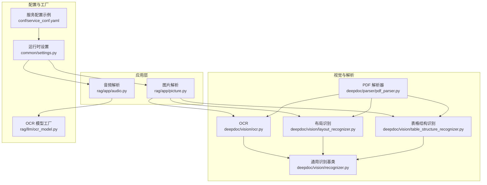
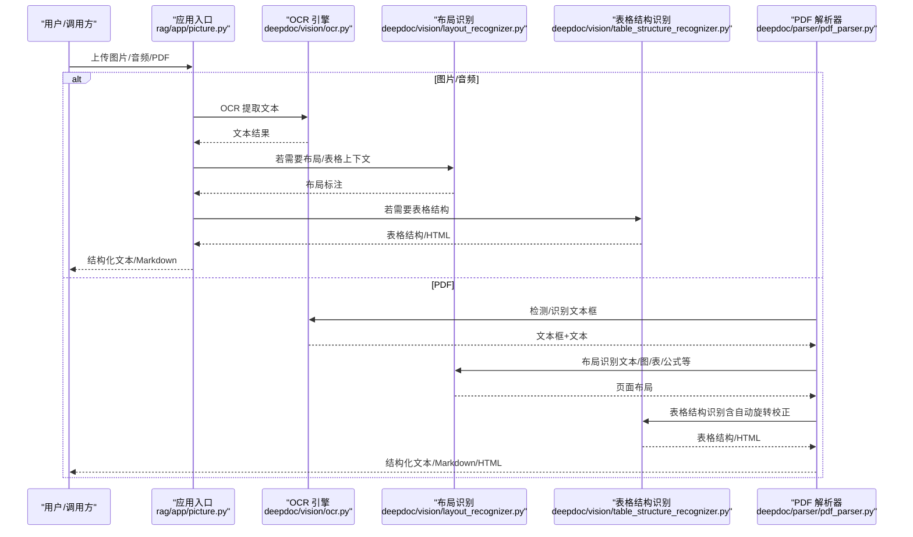
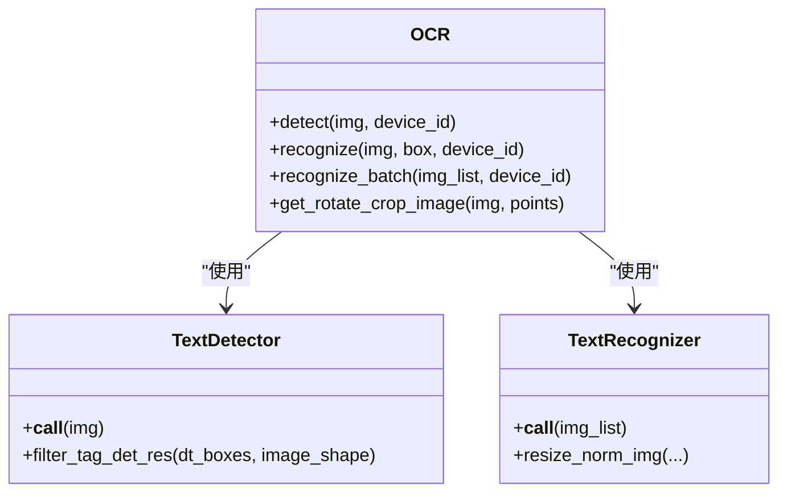
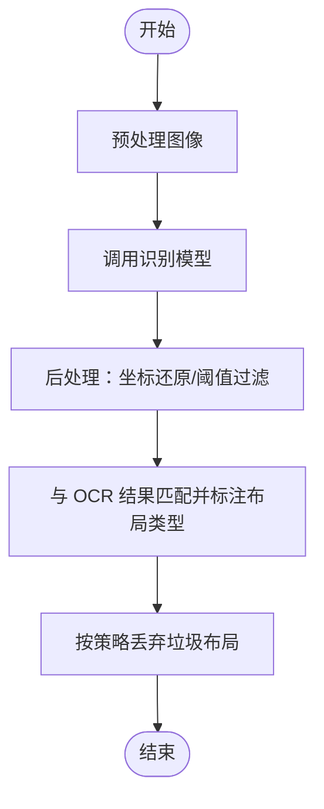
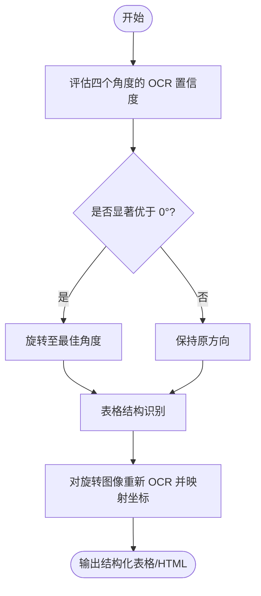
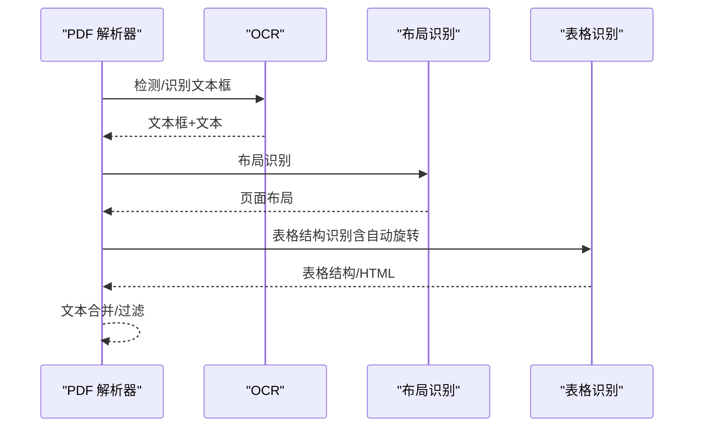
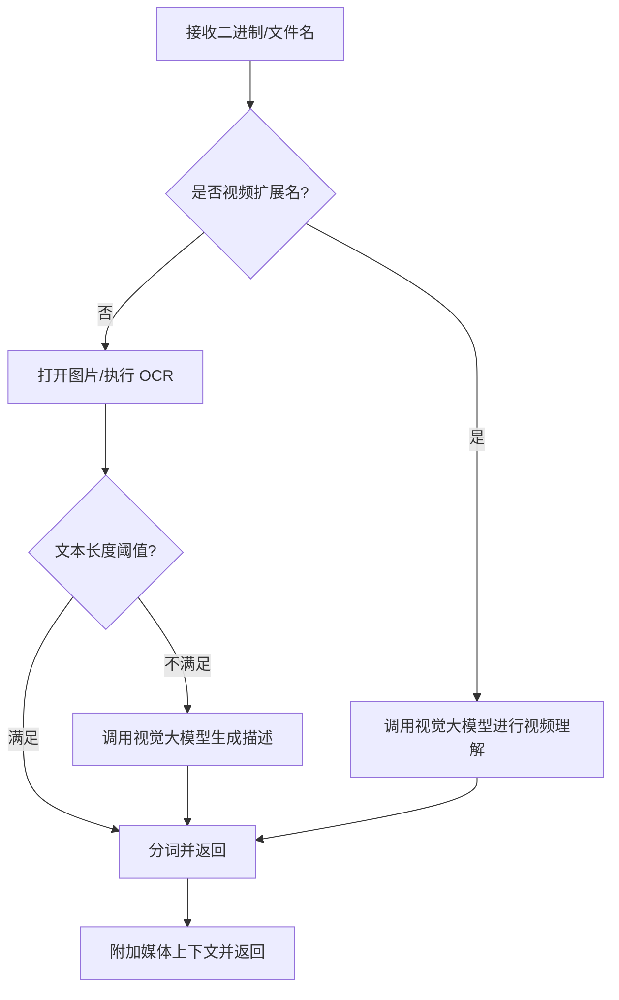
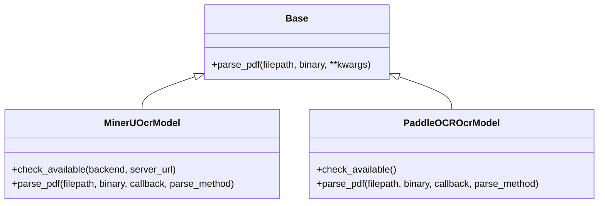
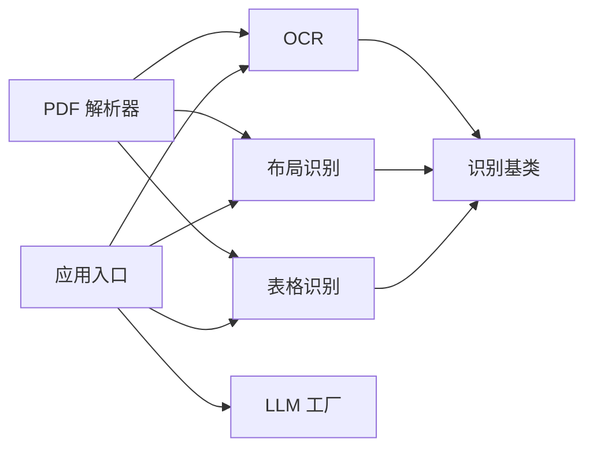

# 多模态处理能力

<cite>
**本文引用的文件**
- [deepdoc/vision/__init__.py](file://deepdoc/vision/__init__.py)
- [deepdoc/vision/ocr.py](file://deepdoc/vision/ocr.py)
- [deepdoc/vision/layout_recognizer.py](file://deepdoc/vision/layout_recognizer.py)
- [deepdoc/vision/table_structure_recognizer.py](file://deepdoc/vision/table_structure_recognizer.py)
- [deepdoc/vision/recognizer.py](file://deepdoc/vision/recognizer.py)
- [deepdoc/parser/pdf_parser.py](file://deepdoc/parser/pdf_parser.py)
- [rag/app/picture.py](file://rag/app/picture.py)
- [rag/app/audio.py](file://rag/app/audio.py)
- [rag/llm/ocr_model.py](file://rag/llm/ocr_model.py)
- [common/settings.py](file://common/settings.py)
- [conf/service_conf.yaml](file://conf/service_conf.yaml)
</cite>

## 目录
1. [简介](#简介)
2. [项目结构](#项目结构)
3. [核心组件](#核心组件)
4. [架构总览](#架构总览)
5. [详细组件分析](#详细组件分析)
6. [依赖分析](#依赖分析)
7. [性能考虑](#性能考虑)
8. [故障排查指南](#故障排查指南)
9. [结论](#结论)
10. [附录](#附录)

## 简介
本文件系统化阐述 RAGFlow 的多模态处理能力，覆盖文本、图像、表格、音频等多模态输入的解析、理解与生成流程。重点说明：
- 多模态模型的集成方式与运行时选择
- 模态转换机制（如 PDF → 图像/表格/文本）
- 特征融合策略（布局、OCR、表格结构识别）
- 输出格式控制（Markdown/HTML/纯文本）
- 视觉模型在 PDF 中图片、表格、图表理解的应用
- 单一模态处理的局限性与 RAGFlow 综合优势
- 多模态配置项、模型选择指南与性能优化建议

## 项目结构
RAGFlow 的多模态处理主要分布在以下模块：
- 视觉与解析：deepdoc/vision（OCR、布局识别、表格结构识别）、deepdoc/parser（PDF 解析流水线）
- 应用层：rag/app（图片/音频解析入口）
- LLM 适配：rag/llm（OCR 模型工厂封装）
- 运行时配置：common/settings、conf/service_conf.yaml

**图示来源**
- [deepdoc/vision/ocr.py:542-758](file://deepdoc/vision/ocr.py#L542-L758)
- [deepdoc/vision/layout_recognizer.py:33-157](file://deepdoc/vision/layout_recognizer.py#L33-L157)
- [deepdoc/vision/table_structure_recognizer.py:30-111](file://deepdoc/vision/table_structure_recognizer.py#L30-L111)
- [deepdoc/vision/recognizer.py:31-443](file://deepdoc/vision/recognizer.py#L31-L443)
- [deepdoc/parser/pdf_parser.py:56-110](file://deepdoc/parser/pdf_parser.py#L56-L110)
- [rag/app/picture.py:37-96](file://rag/app/picture.py#L37-L96)
- [rag/app/audio.py:38-65](file://rag/app/audio.py#L38-L65)
- [common/settings.py:218-240](file://common/settings.py#L218-L240)
- [conf/service_conf.yaml:49-110](file://conf/service_conf.yaml#L49-L110)

**章节来源**
- [deepdoc/vision/__init__.py:16-90](file://deepdoc/vision/__init__.py#L16-L90)
- [deepdoc/parser/pdf_parser.py:56-110](file://deepdoc/parser/pdf_parser.py#L56-L110)
- [rag/app/picture.py:37-96](file://rag/app/picture.py#L37-L96)
- [rag/app/audio.py:38-65](file://rag/app/audio.py#L38-L65)
- [common/settings.py:218-240](file://common/settings.py#L218-L240)
- [conf/service_conf.yaml:49-110](file://conf/service_conf.yaml#L49-L110)

## 核心组件
- OCR 引擎：支持检测与识别，具备多设备并行与 GPU/CPU 自适应
- 布局识别：将页面划分为文本、标题、表格、图、公式等区域
- 表格结构识别：识别行列、表头、跨列/跨行合并等结构，并可输出 HTML
- PDF 解析器：统一调度 OCR、布局、表格识别，完成文本与结构融合
- 图片/音频应用入口：根据内容长度与语言策略选择直接 OCR 或调用视觉/语音大模型
- LLM 工厂：封装外部 OCR 能力（如 PaddleOCR、MinerU）的接入与参数管理
- 运行时配置：统一管理默认模型、并发设备数、存储与文档引擎等

**章节来源**
- [deepdoc/vision/ocr.py:139-758](file://deepdoc/vision/ocr.py#L139-L758)
- [deepdoc/vision/layout_recognizer.py:33-157](file://deepdoc/vision/layout_recognizer.py#L33-L157)
- [deepdoc/vision/table_structure_recognizer.py:30-111](file://deepdoc/vision/table_structure_recognizer.py#L30-L111)
- [deepdoc/parser/pdf_parser.py:56-110](file://deepdoc/parser/pdf_parser.py#L56-L110)
- [rag/app/picture.py:37-96](file://rag/app/picture.py#L37-L96)
- [rag/app/audio.py:38-65](file://rag/app/audio.py#L38-L65)
- [rag/llm/ocr_model.py:25-149](file://rag/llm/ocr_model.py#L25-L149)
- [common/settings.py:218-240](file://common/settings.py#L218-L240)

## 架构总览
RAGFlow 的多模态处理采用“前端解析 + 视觉识别 + 结构融合 + LLM 生成”的分层架构。PDF 等多模态输入经由解析器统一调度，OCR 与布局识别先验知识指导表格结构识别，最终形成可用于检索与生成的结构化文本。

**图示来源**
- [rag/app/picture.py:37-96](file://rag/app/picture.py#L37-L96)
- [deepdoc/vision/ocr.py:542-758](file://deepdoc/vision/ocr.py#L542-L758)
- [deepdoc/vision/layout_recognizer.py:63-157](file://deepdoc/vision/layout_recognizer.py#L63-L157)
- [deepdoc/vision/table_structure_recognizer.py:54-111](file://deepdoc/vision/table_structure_recognizer.py#L54-L111)
- [deepdoc/parser/pdf_parser.py:413-560](file://deepdoc/parser/pdf_parser.py#L413-L560)

## 详细组件分析

### OCR 引擎（文本提取与识别）
- 支持检测与识别两个阶段，具备批量处理与排序策略
- 自动加载 ONNX 模型，支持 GPU/CPU 执行，具备显存收缩与线程控制
- 针对倾斜文本提供旋转裁剪与多方向评分，提升识别精度

**图示来源**
- [deepdoc/vision/ocr.py:420-540](file://deepdoc/vision/ocr.py#L420-L540)
- [deepdoc/vision/ocr.py:139-418](file://deepdoc/vision/ocr.py#L139-L418)
- [deepdoc/vision/ocr.py:542-758](file://deepdoc/vision/ocr.py#L542-L758)

**章节来源**
- [deepdoc/vision/ocr.py:139-758](file://deepdoc/vision/ocr.py#L139-L758)

### 布局识别（页面结构理解）
- 将页面划分为标题、文本、图、图注、表、表注、页眉页脚、参考文献、公式等
- 对 OCR 结果进行布局标注，过滤垃圾布局（页眉/页脚/参考文献等）
- 支持 TensorRT DLA 推理客户端加速

**图示来源**
- [deepdoc/vision/layout_recognizer.py:63-157](file://deepdoc/vision/layout_recognizer.py#L63-L157)
- [deepdoc/vision/recognizer.py:415-437](file://deepdoc/vision/recognizer.py#L415-L437)

**章节来源**
- [deepdoc/vision/layout_recognizer.py:33-157](file://deepdoc/vision/layout_recognizer.py#L33-L157)
- [deepdoc/vision/recognizer.py:31-111](file://deepdoc/vision/recognizer.py#L31-L111)

### 表格结构识别（TSR）与自动旋转
- 识别表格行列、表头、跨列/跨行合并等结构
- 支持 ONNX 与 Ascend（可选）两种实现
- 自动旋转：对扫描版 PDF 的表格进行 0/90/180/270° 评估，选择最佳方向，再进行 OCR 与坐标映射

**图示来源**
- [deepdoc/parser/pdf_parser.py:322-411](file://deepdoc/parser/pdf_parser.py#L322-L411)
- [deepdoc/parser/pdf_parser.py:413-560](file://deepdoc/parser/pdf_parser.py#L413-L560)
- [deepdoc/vision/table_structure_recognizer.py:54-111](file://deepdoc/vision/table_structure_recognizer.py#L54-L111)

**章节来源**
- [deepdoc/parser/pdf_parser.py:322-560](file://deepdoc/parser/pdf_parser.py#L322-L560)
- [deepdoc/vision/table_structure_recognizer.py:30-111](file://deepdoc/vision/table_structure_recognizer.py#L30-L111)

### PDF 解析流水线（统一调度）
- 统一初始化 OCR、布局识别、表格识别与上下文模型
- 流水线包含：OCR → 布局分析 → 表格分析 → 文本合并/过滤 → 输出
- 支持并行设备数配置，自动选择 ONNX/Ascend 布局识别器

**图示来源**
- [deepdoc/parser/pdf_parser.py:56-110](file://deepdoc/parser/pdf_parser.py#L56-L110)
- [deepdoc/parser/pdf_parser.py:798-800](file://deepdoc/parser/pdf_parser.py#L798-L800)
- [deepdoc/parser/pdf_parser.py:413-560](file://deepdoc/parser/pdf_parser.py#L413-L560)

**章节来源**
- [deepdoc/parser/pdf_parser.py:56-110](file://deepdoc/parser/pdf_parser.py#L56-L110)
- [deepdoc/parser/pdf_parser.py:798-800](file://deepdoc/parser/pdf_parser.py#L798-L800)

### 图片与音频应用入口
- 图片：若 OCR 文本过长则直接分词；否则调用视觉大模型生成描述，再进行分词与上下文附加
- 音频：调用语音转文本模型进行转录，再进行分词

**图示来源**
- [rag/app/picture.py:37-96](file://rag/app/picture.py#L37-L96)
- [rag/app/audio.py:38-65](file://rag/app/audio.py#L38-L65)

**章节来源**
- [rag/app/picture.py:37-96](file://rag/app/picture.py#L37-L96)
- [rag/app/audio.py:38-65](file://rag/app/audio.py#L38-L65)

### LLM 工厂与外部 OCR 能力集成
- MinerU/PaddleOCR 工厂：解析配置、检查可用性、调用远程解析接口
- 支持多种参数来源（UI 配置、环境变量）

**图示来源**
- [rag/llm/ocr_model.py:25-149](file://rag/llm/ocr_model.py#L25-L149)

**章节来源**
- [rag/llm/ocr_model.py:25-149](file://rag/llm/ocr_model.py#L25-L149)

## 依赖分析
- 模块耦合
  - PDF 解析器依赖 OCR、布局识别、表格识别与上下文模型
  - 应用入口依赖 OCR 与 LLM 工厂
  - 视觉识别组件共享通用识别基类
- 外部依赖
  - ONNXRuntime、OpenCV、HuggingFace Hub、TensorRT DLA（可选）
- 配置依赖
  - 默认模型、并发设备数、存储与文档引擎通过运行时配置注入

**图示来源**
- [deepdoc/parser/pdf_parser.py:56-110](file://deepdoc/parser/pdf_parser.py#L56-L110)
- [deepdoc/vision/recognizer.py:31-111](file://deepdoc/vision/recognizer.py#L31-L111)
- [rag/app/picture.py:37-96](file://rag/app/picture.py#L37-L96)
- [rag/llm/ocr_model.py:25-149](file://rag/llm/ocr_model.py#L25-L149)

**章节来源**
- [deepdoc/parser/pdf_parser.py:56-110](file://deepdoc/parser/pdf_parser.py#L56-L110)
- [deepdoc/vision/recognizer.py:31-111](file://deepdoc/vision/recognizer.py#L31-L111)
- [rag/app/picture.py:37-96](file://rag/app/picture.py#L37-L96)
- [rag/llm/ocr_model.py:25-149](file://rag/llm/ocr_model.py#L25-L149)

## 性能考虑
- 并行与设备
  - 通过环境变量控制并行设备数，支持多 GPU 并行推理
  - OCR 支持线程数与显存限制配置，避免内存溢出
- 模型与硬件
  - 布局识别支持 ONNX 与 Ascend 两种实现，可根据部署环境选择
  - 布局识别可使用 TensorRT DLA 加速（需配置服务端）
- I/O 与批处理
  - OCR/识别器支持批处理，减少调用开销
  - 图片/音频入口对小尺寸图片跳过大模型，降低延迟

**章节来源**
- [common/settings.py:370-380](file://common/settings.py#L370-L380)
- [deepdoc/vision/ocr.py:96-136](file://deepdoc/vision/ocr.py#L96-L136)
- [deepdoc/vision/layout_recognizer.py:58-62](file://deepdoc/vision/layout_recognizer.py#L58-L62)
- [rag/app/picture.py:113-129](file://rag/app/picture.py#L113-L129)

## 故障排查指南
- OCR/识别失败
  - 检查模型下载与缓存路径、GPU/CPU 提供商配置
  - 关注显存收缩与线程数设置
- 布局/表格识别异常
  - 确认阈值与 NMS 参数是否合理
  - 检查 TensorRT DLA 服务端连通性（如启用）
- PDF 表格方向问题
  - 确认自动旋转开关与阈值策略
  - 检查旋转后坐标映射逻辑
- 外部 OCR 服务不可达
  - 使用工厂提供的可用性检查方法
  - 校验配置项（URL、算法、Token）

**章节来源**
- [deepdoc/vision/ocr.py:96-136](file://deepdoc/vision/ocr.py#L96-L136)
- [deepdoc/vision/layout_recognizer.py:58-62](file://deepdoc/vision/layout_recognizer.py#L58-L62)
- [deepdoc/parser/pdf_parser.py:322-411](file://deepdoc/parser/pdf_parser.py#L322-L411)
- [rag/llm/ocr_model.py:72-94](file://rag/llm/ocr_model.py#L72-L94)

## 结论
RAGFlow 的多模态处理以“OCR + 布局 + 表格识别 + LLM 生成”为核心路径，针对 PDF、图片、音频等多模态输入提供了从底层感知到高层语义的完整链路。其优势在于：
- 统一的解析流水线与灵活的模型选择
- 面向表格的自动旋转与结构重建
- 针对不同内容长度的策略化处理（直接 OCR 或调用视觉/语音大模型）
- 可扩展的工厂模式与运行时配置

## 附录

### 多模态配置选项与模型选择指南
- 默认模型与工厂
  - 在运行时配置中设置默认模型名称、工厂与基础地址
  - 支持“模型名@工厂”格式，便于区分不同供应商
- 并发与设备
  - 通过环境变量设置并行设备数，启用多 GPU 并行
- 存储与文档引擎
  - 支持多种后端（Elasticsearch/OpenSearch/Infinity/OceanBase），按需切换
- 视觉/表格识别实现
  - 布局识别：ONNX（默认）或 Ascend（可选）
  - 表格识别：ONNX（默认）或 Ascend（可选）

**章节来源**
- [common/settings.py:218-240](file://common/settings.py#L218-L240)
- [common/settings.py:370-380](file://common/settings.py#L370-L380)
- [conf/service_conf.yaml:49-110](file://conf/service_conf.yaml#L49-L110)
- [deepdoc/vision/layout_recognizer.py:58-62](file://deepdoc/vision/layout_recognizer.py#L58-L62)
- [deepdoc/vision/table_structure_recognizer.py:55-65](file://deepdoc/vision/table_structure_recognizer.py#L55-L65)