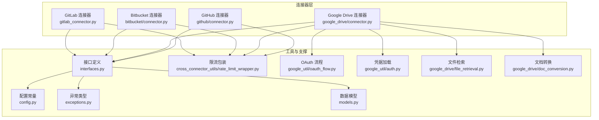
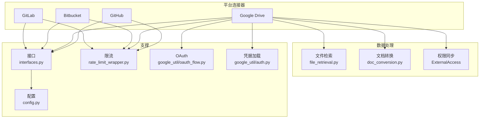
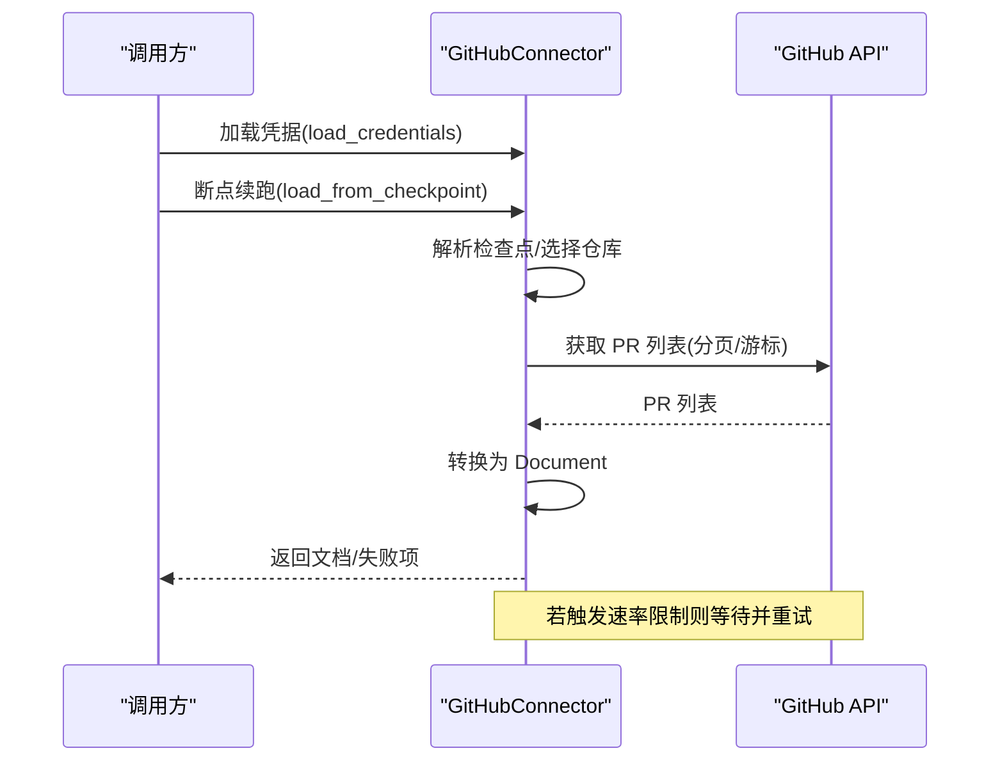
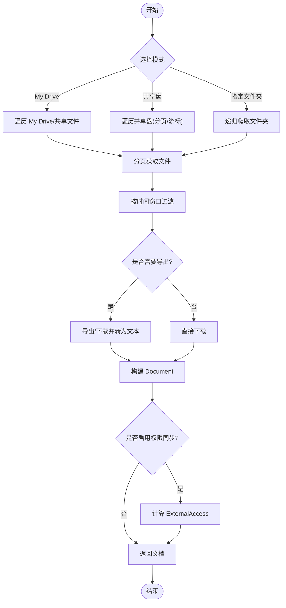
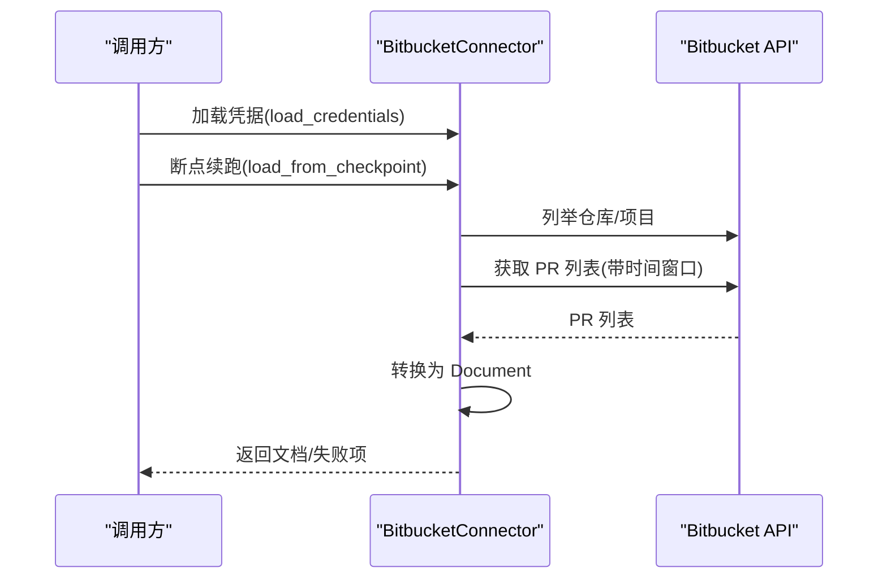
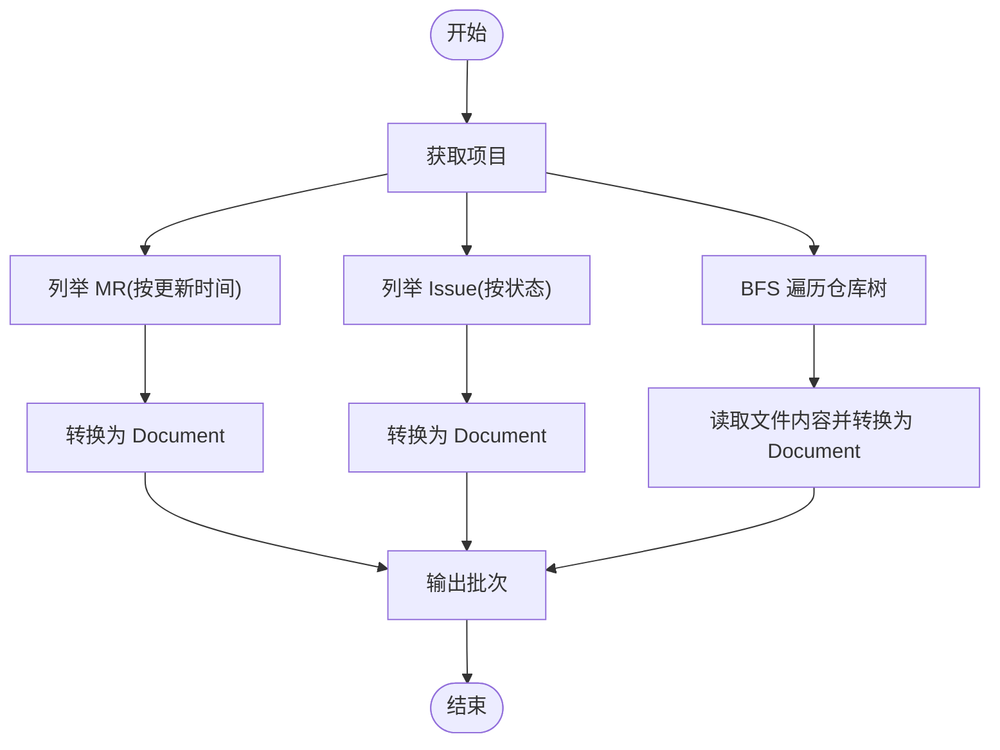
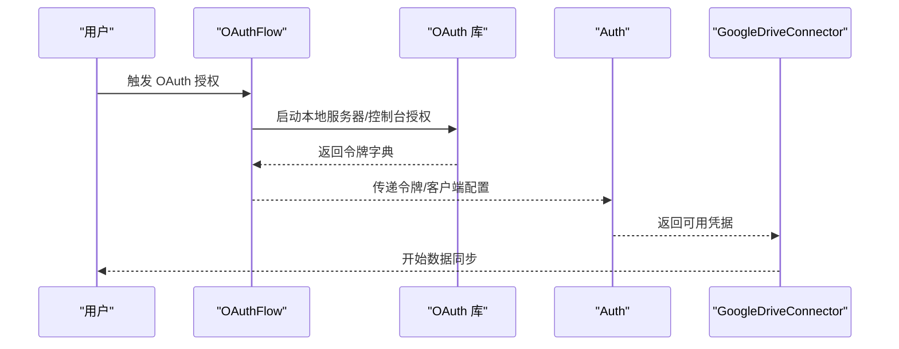
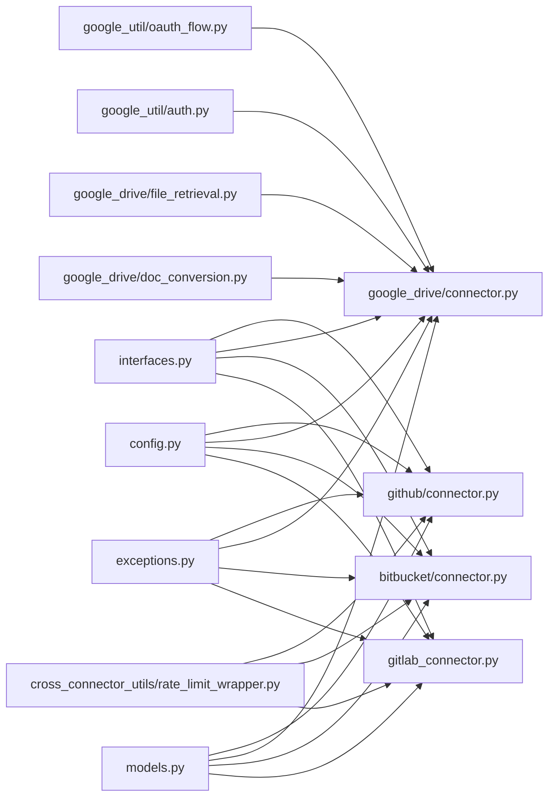

# 云存储服务集成

<cite>
**本文档引用的文件**
- [common/data_source/github/connector.py](file://common/data_source/github/connector.py)
- [common/data_source/google_drive/connector.py](file://common/data_source/google_drive/connector.py)
- [common/data_source/bitbucket/connector.py](file://common/data_source/bitbucket/connector.py)
- [common/data_source/gitlab_connector.py](file://common/data_source/gitlab_connector.py)
- [common/data_source/google_util/oauth_flow.py](file://common/data_source/google_util/oauth_flow.py)
- [common/data_source/google_util/auth.py](file://common/data_source/google_util/auth.py)
- [common/data_source/google_drive/file_retrieval.py](file://common/data_source/google_drive/file_retrieval.py)
- [common/data_source/google_drive/doc_conversion.py](file://common/data_source/google_drive/doc_conversion.py)
- [common/data_source/cross_connector_utils/rate_limit_wrapper.py](file://common/data_source/cross_connector_utils/rate_limit_wrapper.py)
- [common/data_source/interfaces.py](file://common/data_source/interfaces.py)
- [common/data_source/config.py](file://common/data_source/config.py)
- [common/data_source/exceptions.py](file://common/data_source/exceptions.py)
- [common/data_source/models.py](file://common/data_source/models.py)
</cite>

## 目录
1. [简介](#简介)
2. [项目结构](#项目结构)
3. [核心组件](#核心组件)
4. [架构总览](#架构总览)
5. [详细组件分析](#详细组件分析)
6. [依赖关系分析](#依赖关系分析)
7. [性能考虑](#性能考虑)
8. [故障排除指南](#故障排除指南)
9. [结论](#结论)
10. [附录](#附录)

## 简介
本文件系统性阐述 RAGFlow 如何集成主流云存储与协作平台（Google Drive、GitHub、GitLab、Bitbucket 等），覆盖认证流程、API 调用限制处理、文件树遍历策略、增量同步机制、权限控制与版本管理、配置步骤与故障排除，并通过图示与路径引用帮助读者快速定位实现细节。

## 项目结构
RAGFlow 的云存储集成采用“连接器（Connector）”抽象，统一了不同平台的数据拉取、转换与权限同步能力。核心目录与职责如下：
- common/data_source：各平台连接器与通用工具
  - github/connector.py：GitHub 连接器，支持 PR/Issue 增量同步与权限同步
  - google_drive/connector.py：Google Drive 连接器，支持多用户模拟、共享盘/文件夹爬取、权限同步
  - bitbucket/connector.py：Bitbucket 连接器，基于 API Token 的 PR 同步
  - gitlab_connector.py：GitLab 连接器，支持 MR/Issue/代码文件同步
  - google_util/*：Google OAuth 流程与凭据加载
  - google_drive/file_retrieval.py：文件检索与分页策略
  - google_drive/doc_conversion.py：文件下载、导出与内容提取
  - cross_connector_utils/rate_limit_wrapper.py：通用限流包装器
  - interfaces.py：连接器接口定义
  - config.py：全局配置常量（如大小阈值、批大小）
  - exceptions.py：连接器异常类型
  - models.py：文档、检查点、外部访问等模型

图表来源
- [common/data_source/github/connector.py:413-792](file://common/data_source/github/connector.py#L413-L792)
- [common/data_source/google_drive/connector.py:112-767](file://common/data_source/google_drive/connector.py#L112-L767)
- [common/data_source/bitbucket/connector.py:58-303](file://common/data_source/bitbucket/connector.py#L58-L303)
- [common/data_source/gitlab_connector.py:161-314](file://common/data_source/gitlab_connector.py#L161-L314)
- [common/data_source/google_util/oauth_flow.py:107-121](file://common/data_source/google_util/oauth_flow.py#L107-L121)
- [common/data_source/google_util/auth.py:37-127](file://common/data_source/google_util/auth.py#L37-L127)
- [common/data_source/google_drive/file_retrieval.py:1-347](file://common/data_source/google_drive/file_retrieval.py#L1-L347)
- [common/data_source/google_drive/doc_conversion.py:418-566](file://common/data_source/google_drive/doc_conversion.py#L418-L566)
- [common/data_source/cross_connector_utils/rate_limit_wrapper.py:1-126](file://common/data_source/cross_connector_utils/rate_limit_wrapper.py#L1-L126)
- [common/data_source/interfaces.py:21-103](file://common/data_source/interfaces.py#L21-L103)
- [common/data_source/config.py:1-307](file://common/data_source/config.py#L1-L307)
- [common/data_source/exceptions.py:1-30](file://common/data_source/exceptions.py#L1-L30)
- [common/data_source/models.py:89-156](file://common/data_source/models.py#L89-L156)

章节来源
- [common/data_source/interfaces.py:21-103](file://common/data_source/interfaces.py#L21-L103)
- [common/data_source/config.py:1-307](file://common/data_source/config.py#L1-L307)

## 核心组件
- 连接器接口族
  - LoadConnector/PollConnector：一次性加载或轮询增量
  - CheckpointedConnector：可断点续传的增量同步
  - SlimConnectorWithPermSync：仅获取文档 ID 并进行权限同步
- 数据模型
  - Document/SlimDocument：文档对象与精简文档对象
  - ConnectorCheckpoint：检查点状态
  - ExternalAccess：外部访问控制信息
- 配置与异常
  - config.py 提供大小阈值、批大小、超时等全局参数
  - exceptions.py 定义凭证缺失、过期、权限不足等异常

章节来源
- [common/data_source/interfaces.py:21-103](file://common/data_source/interfaces.py#L21-L103)
- [common/data_source/models.py:89-156](file://common/data_source/models.py#L89-L156)
- [common/data_source/config.py:100-202](file://common/data_source/config.py#L100-L202)
- [common/data_source/exceptions.py:1-30](file://common/data_source/exceptions.py#L1-L30)

## 架构总览
下图展示了 RAGFlow 云存储集成的整体架构：连接器负责从平台拉取数据，文件检索与转换模块负责遍历与解析，权限同步模块负责外部访问控制，限流与重试保障稳定性。

图表来源
- [common/data_source/google_drive/connector.py:112-767](file://common/data_source/google_drive/connector.py#L112-L767)
- [common/data_source/google_drive/file_retrieval.py:1-347](file://common/data_source/google_drive/file_retrieval.py#L1-L347)
- [common/data_source/google_drive/doc_conversion.py:418-566](file://common/data_source/google_drive/doc_conversion.py#L418-L566)
- [common/data_source/google_util/oauth_flow.py:107-121](file://common/data_source/google_util/oauth_flow.py#L107-L121)
- [common/data_source/google_util/auth.py:37-127](file://common/data_source/google_util/auth.py#L37-L127)
- [common/data_source/cross_connector_utils/rate_limit_wrapper.py:1-126](file://common/data_source/cross_connector_utils/rate_limit_wrapper.py#L1-L126)
- [common/data_source/interfaces.py:21-103](file://common/data_source/interfaces.py#L21-L103)
- [common/data_source/config.py:100-202](file://common/data_source/config.py#L100-L202)

## 详细组件分析

### GitHub 连接器（GitHubConnector）
- 认证与初始化
  - 使用 Token 认证，支持自定义基础 URL
  - 支持单仓库、多仓库、组织/用户所有仓库三种模式
- 增量同步与检查点
  - 多阶段状态机：开始 → PR → Issue → 下一仓库
  - 支持偏移分页与游标回退两种分页策略，自动处理大集合场景
  - 检查点保存当前仓库、页码、游标 URL、已检索数量等
- 文档转换
  - 将 PR/Issue 转换为 Document，包含元数据（状态、标签、时间戳等）
- 权限同步
  - 可选开启，按仓库维度获取外部访问权限
- API 限流
  - 捕获速率限制异常并等待后重试，最多重试固定次数

图表来源
- [common/data_source/github/connector.py:413-792](file://common/data_source/github/connector.py#L413-L792)
- [common/data_source/github/connector.py:515-740](file://common/data_source/github/connector.py#L515-L740)
- [common/data_source/github/connector.py:158-218](file://common/data_source/github/connector.py#L158-L218)

章节来源
- [common/data_source/github/connector.py:413-792](file://common/data_source/github/connector.py#L413-L792)
- [common/data_source/github/connector.py:515-740](file://common/data_source/github/connector.py#L515-L740)
- [common/data_source/github/connector.py:158-218](file://common/data_source/github/connector.py#L158-L218)

### Google Drive 连接器（GoogleDriveConnector）
- 认证与凭据
  - 支持 OAuth 令牌与服务账号两种方式
  - OAuth 支持交互式本地服务器授权与控制台回退
  - 服务账号可模拟组织内任意用户进行文件检索
- 文件遍历策略
  - 支持 My Drive、共享盘、指定文件夹三种模式
  - 分页与游标结合，支持每阶段最大页数控制
  - 共享盘/文件夹爬取时缓存中间结果，避免重复遍历
- 文档转换与导出
  - 对 Google Apps 类型文件执行导出为文本/表格/PPT
  - 对图片按配置决定是否允许下载
  - 超过大小阈值的文件跳过
- 权限同步
  - 生成精简文档 ID 并附带外部访问信息
  - 支持基于域与管理员服务的权限判定
- 增量同步
  - 基于修改时间窗口过滤，支持断点续传

图表来源
- [common/data_source/google_drive/connector.py:112-767](file://common/data_source/google_drive/connector.py#L112-L767)
- [common/data_source/google_drive/file_retrieval.py:107-180](file://common/data_source/google_drive/file_retrieval.py#L107-L180)
- [common/data_source/google_drive/doc_conversion.py:418-566](file://common/data_source/google_drive/doc_conversion.py#L418-L566)

章节来源
- [common/data_source/google_drive/connector.py:112-767](file://common/data_source/google_drive/connector.py#L112-L767)
- [common/data_source/google_util/oauth_flow.py:107-121](file://common/data_source/google_util/oauth_flow.py#L107-L121)
- [common/data_source/google_util/auth.py:37-127](file://common/data_source/google_util/auth.py#L37-L127)
- [common/data_source/google_drive/file_retrieval.py:107-180](file://common/data_source/google_drive/file_retrieval.py#L107-L180)
- [common/data_source/google_drive/doc_conversion.py:418-566](file://common/data_source/google_drive/doc_conversion.py#L418-L566)

### Bitbucket 连接器（BitbucketConnector）
- 认证
  - 使用邮箱 + API Token 的方式
- 增量同步
  - 支持工作区/项目/仓库三种目标范围
  - 基于“next”链接的分页续跑
  - 时间窗口过滤（updated_on）
- 文档转换
  - 将 PR 映射为文档，包含状态、作者、链接等元数据

图表来源
- [common/data_source/bitbucket/connector.py:58-303](file://common/data_source/bitbucket/connector.py#L58-L303)
- [common/data_source/bitbucket/connector.py:108-256](file://common/data_source/bitbucket/connector.py#L108-L256)

章节来源
- [common/data_source/bitbucket/connector.py:58-303](file://common/data_source/bitbucket/connector.py#L58-L303)

### GitLab 连接器（GitlabConnector）
- 认证与验证
  - 使用私有令牌与实例 URL
  - 支持项目存在性与权限校验
- 增量同步
  - MR/Issue/代码文件三类对象分别处理
  - 代码文件使用广度优先遍历（BFS）树形目录
  - 支持基于最后提交时间的增量过滤
- 文档转换
  - MR/Issue 转换为文档
  - 代码文件读取默认分支内容并生成文档

图表来源
- [common/data_source/gitlab_connector.py:161-314](file://common/data_source/gitlab_connector.py#L161-L314)

章节来源
- [common/data_source/gitlab_connector.py:161-314](file://common/data_source/gitlab_connector.py#L161-L314)

### OAuth 认证流程（Google）
- 本地服务器授权
  - 自动打开浏览器，支持超时与控制台回退
  - 支持环境变量覆盖请求作用域与超时
- 凭据加载与刷新
  - 支持 OAuth 交互式与上传式两种方式
  - 自动刷新与敏感信息脱敏存储

图表来源
- [common/data_source/google_util/oauth_flow.py:52-104](file://common/data_source/google_util/oauth_flow.py#L52-L104)
- [common/data_source/google_util/auth.py:37-127](file://common/data_source/google_util/auth.py#L37-L127)

章节来源
- [common/data_source/google_util/oauth_flow.py:107-121](file://common/data_source/google_util/oauth_flow.py#L107-L121)
- [common/data_source/google_util/auth.py:37-127](file://common/data_source/google_util/auth.py#L37-L127)

## 依赖关系分析
- 组件耦合
  - 连接器均依赖统一接口（interfaces.py），便于扩展新平台
  - Google Drive 连接器依赖 OAuth 工具链与文件检索/转换模块
  - GitHub/Bitbucket/GitLab 连接器各自独立，遵循相同接口契约
- 外部依赖
  - 第三方 SDK：PyGithub、google-api-python-client、gitlab、httpx
  - 通用工具：限流包装器、配置常量、异常类型、数据模型

图表来源
- [common/data_source/interfaces.py:21-103](file://common/data_source/interfaces.py#L21-L103)
- [common/data_source/github/connector.py:413-792](file://common/data_source/github/connector.py#L413-L792)
- [common/data_source/google_drive/connector.py:112-767](file://common/data_source/google_drive/connector.py#L112-L767)
- [common/data_source/bitbucket/connector.py:58-303](file://common/data_source/bitbucket/connector.py#L58-L303)
- [common/data_source/gitlab_connector.py:161-314](file://common/data_source/gitlab_connector.py#L161-L314)
- [common/data_source/google_util/oauth_flow.py:107-121](file://common/data_source/google_util/oauth_flow.py#L107-L121)
- [common/data_source/google_util/auth.py:37-127](file://common/data_source/google_util/auth.py#L37-L127)
- [common/data_source/google_drive/file_retrieval.py:1-347](file://common/data_source/google_drive/file_retrieval.py#L1-L347)
- [common/data_source/google_drive/doc_conversion.py:418-566](file://common/data_source/google_drive/doc_conversion.py#L418-L566)
- [common/data_source/cross_connector_utils/rate_limit_wrapper.py:1-126](file://common/data_source/cross_connector_utils/rate_limit_wrapper.py#L1-L126)
- [common/data_source/config.py:100-202](file://common/data_source/config.py#L100-L202)
- [common/data_source/exceptions.py:1-30](file://common/data_source/exceptions.py#L1-L30)
- [common/data_source/models.py:89-156](file://common/data_source/models.py#L89-L156)

章节来源
- [common/data_source/interfaces.py:21-103](file://common/data_source/interfaces.py#L21-L103)
- [common/data_source/config.py:100-202](file://common/data_source/config.py#L100-L202)

## 性能考虑
- 批处理与并发
  - Google Drive 连接器通过线程池并发模拟多个用户，提升大规模组织的遍历效率
  - 各连接器支持批量输出文档批次，降低内存峰值
- 限流与重试
  - GitHub/Bitbucket/GitLab 连接器内置速率限制处理与指数退避
  - 通用限流包装器提供 HTTP 请求级限流
- 存储与大小控制
  - 通过配置项控制文件大小阈值与批大小，避免超大文件影响性能
- 增量策略
  - 基于修改时间窗口与检查点，减少全量扫描

章节来源
- [common/data_source/google_drive/connector.py:508-598](file://common/data_source/google_drive/connector.py#L508-L598)
- [common/data_source/cross_connector_utils/rate_limit_wrapper.py:1-126](file://common/data_source/cross_connector_utils/rate_limit_wrapper.py#L1-L126)
- [common/data_source/config.py:100-202](file://common/data_source/config.py#L100-L202)

## 故障排除指南
- 凭证问题
  - 缺少凭据：抛出“缺少凭据”异常
  - 凭证过期/无效：抛出“凭证过期”异常
  - 权限不足：抛出“权限不足”异常
- Google Drive
  - OAuth 作用域变更：根据提示在 Google Cloud Console 中补充缺失作用域或使用环境变量覆盖
  - 403/404/401：连接器会尝试切换用户或跳过，记录详细日志
- GitHub
  - 速率限制：自动等待并重试；必要时调整基础 URL 或使用企业版端点
- Bitbucket
  - API Token 未正确配置：校验邮箱与 Token
- GitLab
  - 项目不存在或不可访问：校验 URL 与令牌

章节来源
- [common/data_source/exceptions.py:1-30](file://common/data_source/exceptions.py#L1-L30)
- [common/data_source/google_util/oauth_flow.py:87-95](file://common/data_source/google_util/oauth_flow.py#L87-L95)
- [common/data_source/google_drive/doc_conversion.py:496-508](file://common/data_source/google_drive/doc_conversion.py#L496-L508)
- [common/data_source/github/connector.py:189-200](file://common/data_source/github/connector.py#L189-L200)
- [common/data_source/bitbucket/connector.py:312-346](file://common/data_source/bitbucket/connector.py#L312-L346)
- [common/data_source/gitlab_connector.py:187-216](file://common/data_source/gitlab_connector.py#L187-L216)

## 结论
RAGFlow 的云存储集成以统一接口为核心，针对不同平台特性实现了稳健的认证、遍历、转换与权限同步能力。通过检查点与增量策略、限流与重试机制、以及可配置的大小阈值与批处理，系统在保证可靠性的同时兼顾性能与可维护性。建议在生产环境中结合平台配额与组织规模，合理配置 OAuth 作用域、批大小与并发度，并定期校验凭据有效性。

## 附录

### 平台配置与认证步骤（概要）
- GitHub
  - 准备个人访问令牌（Token），设置基础 URL（可选）
  - 选择单仓库/多仓库/组织/用户模式
  - 参考路径：[common/data_source/github/connector.py:429-446](file://common/data_source/github/connector.py#L429-L446)
- Google Drive（OAuth）
  - 在 Google Cloud Console 创建 OAuth 客户端，运行 OAuth 流程
  - 支持本地服务器与控制台两种授权方式
  - 参考路径：[common/data_source/google_util/oauth_flow.py:52-104](file://common/data_source/google_util/oauth_flow.py#L52-L104)
- Google Drive（服务账号）
  - 生成服务账号密钥，在 Google Workspace 中授权共享盘/文件夹
  - 参考路径：[common/data_source/google_util/auth.py:110-127](file://common/data_source/google_util/auth.py#L110-L127)
- Bitbucket
  - 准备邮箱与 API Token
  - 参考路径：[common/data_source/bitbucket/connector.py:91-100](file://common/data_source/bitbucket/connector.py#L91-L100)
- GitLab
  - 准备实例 URL 与私有令牌
  - 参考路径：[common/data_source/gitlab_connector.py:181-185](file://common/data_source/gitlab_connector.py#L181-L185)

### 关键流程代码示例路径
- GitHub 增量同步与检查点
  - [common/data_source/github/connector.py:529-740](file://common/data_source/github/connector.py#L529-L740)
- Google Drive 文件遍历与导出
  - [common/data_source/google_drive/file_retrieval.py:107-180](file://common/data_source/google_drive/file_retrieval.py#L107-L180)
  - [common/data_source/google_drive/doc_conversion.py:418-566](file://common/data_source/google_drive/doc_conversion.py#L418-L566)
- Bitbucket PR 同步
  - [common/data_source/bitbucket/connector.py:182-256](file://common/data_source/bitbucket/connector.py#L182-L256)
- GitLab 增量同步
  - [common/data_source/gitlab_connector.py:218-314](file://common/data_source/gitlab_connector.py#L218-L314)
- 通用限流包装
  - [common/data_source/cross_connector_utils/rate_limit_wrapper.py:93-114](file://common/data_source/cross_connector_utils/rate_limit_wrapper.py#L93-L114)