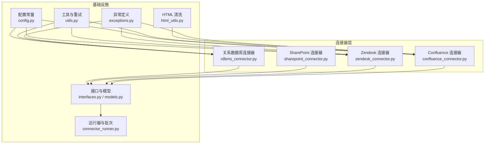
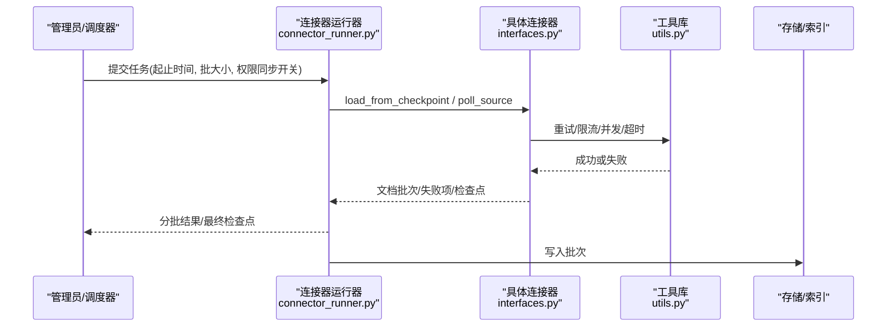
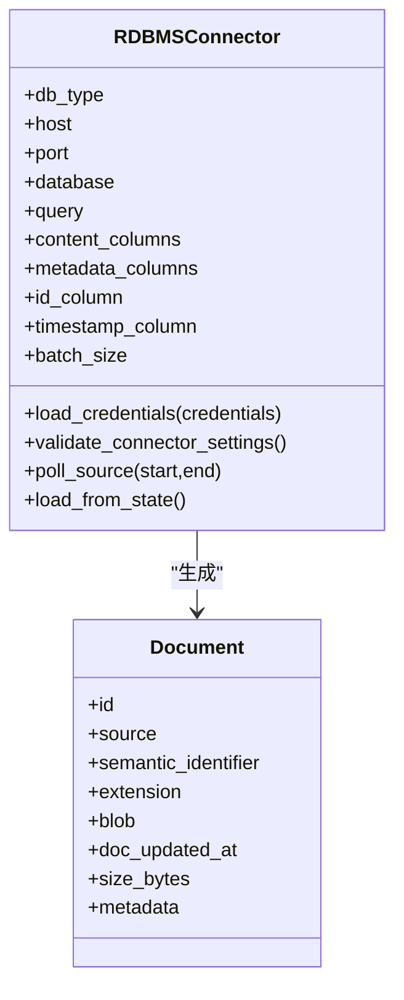
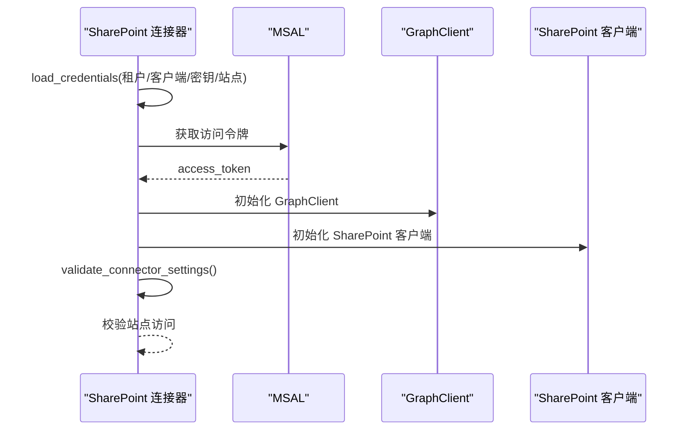
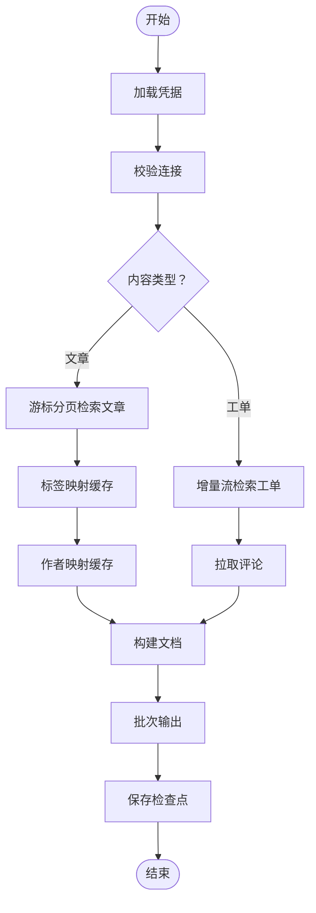
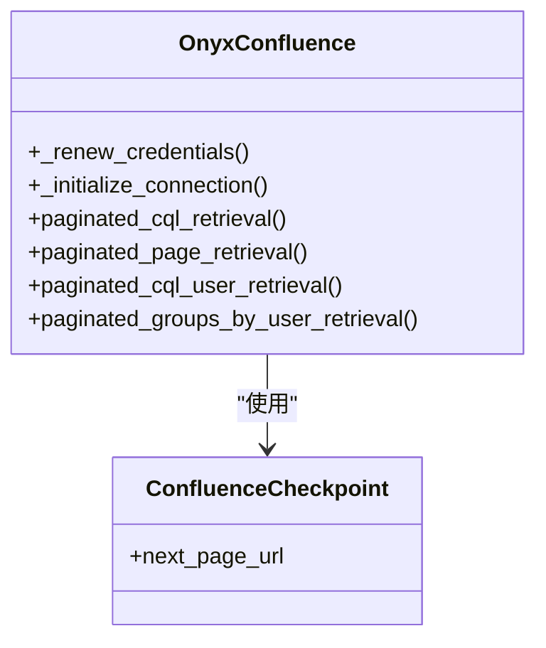
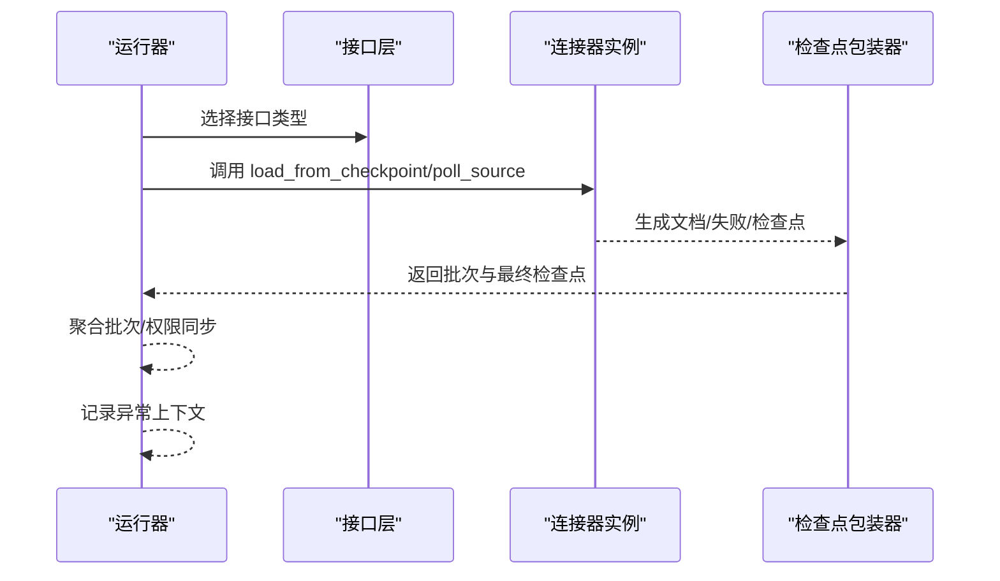
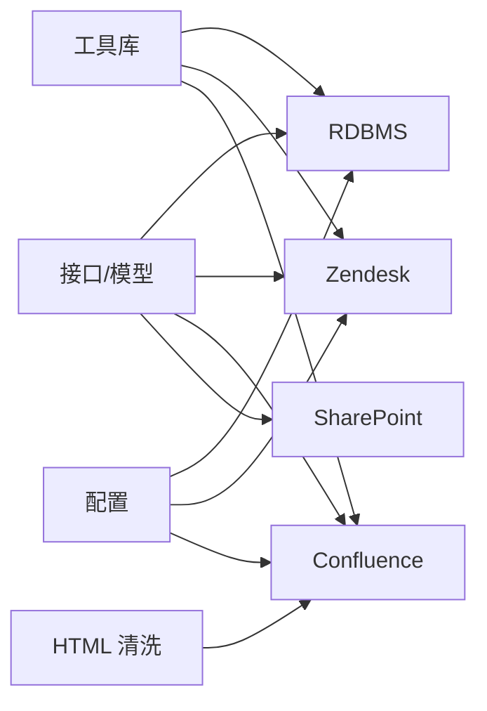

# 企业数据源集成

<cite>
**本文档引用的文件**
- [rdbms_connector.py](file://common/data_source/rdbms_connector.py)
- [sharepoint_connector.py](file://common/data_source/sharepoint_connector.py)
- [zendesk_connector.py](file://common/data_source/zendesk_connector.py)
- [confluence_connector.py](file://common/data_source/confluence_connector.py)
- [interfaces.py](file://common/data_source/interfaces.py)
- [models.py](file://common/data_source/models.py)
- [config.py](file://common/data_source/config.py)
- [connector_runner.py](file://common/data_source/connector_runner.py)
- [utils.py](file://common/data_source/utils.py)
- [html_utils.py](file://common/data_source/html_utils.py)
- [exceptions.py](file://common/data_source/exceptions.py)
</cite>

## 目录
1. [简介](#简介)
2. [项目结构](#项目结构)
3. [核心组件](#核心组件)
4. [架构总览](#架构总览)
5. [详细组件分析](#详细组件分析)
6. [依赖关系分析](#依赖关系分析)
7. [性能考量](#性能考量)
8. [故障排查指南](#故障排查指南)
9. [结论](#结论)
10. [附录](#附录)

## 简介
本文件面向企业级部署场景，系统化阐述 RAGFlow 的数据源集成功能与架构设计，覆盖关系型数据库（MySQL/PostgreSQL）、SharePoint 文档库、Zendesk 客户支持、Jira 项目管理等系统的连接与同步机制。重点包括：
- 数据库连接器的实现、SQL 查询优化、数据映射策略与增量同步机制
- 企业级数据的安全访问、权限控制与合规要求
- 企业部署的配置指南、性能调优与运维管理建议
- 面向多系统的统一接口抽象、错误处理与重试退避策略

## 项目结构
RAGFlow 将各类外部系统抽象为“连接器”，通过统一接口定义与运行时编排，实现批量与增量索引、权限同步与失败恢复。

**图表来源**
- [rdbms_connector.py:25-374](file://common/data_source/rdbms_connector.py#L25-L374)
- [sharepoint_connector.py:21-121](file://common/data_source/sharepoint_connector.py#L21-L121)
- [zendesk_connector.py:347-632](file://common/data_source/zendesk_connector.py#L347-L632)
- [confluence_connector.py:54-800](file://common/data_source/confluence_connector.py#L54-L800)
- [interfaces.py:21-420](file://common/data_source/interfaces.py#L21-L420)
- [models.py:89-156](file://common/data_source/models.py#L89-L156)
- [config.py:16-307](file://common/data_source/config.py#L16-L307)
- [connector_runner.py:91-217](file://common/data_source/connector_runner.py#L91-L217)
- [utils.py:105-1285](file://common/data_source/utils.py#L105-L1285)
- [html_utils.py:66-220](file://common/data_source/html_utils.py#L66-L220)
- [exceptions.py:4-30](file://common/data_source/exceptions.py#L4-L30)

**章节来源**
- [interfaces.py:21-420](file://common/data_source/interfaces.py#L21-L420)
- [models.py:89-156](file://common/data_source/models.py#L89-L156)
- [config.py:16-307](file://common/data_source/config.py#L16-L307)
- [connector_runner.py:91-217](file://common/data_source/connector_runner.py#L91-L217)
- [utils.py:105-1285](file://common/data_source/utils.py#L105-L1285)
- [html_utils.py:66-220](file://common/data_source/html_utils.py#L66-L220)
- [exceptions.py:4-30](file://common/data_source/exceptions.py#L4-L30)

## 核心组件
- 统一接口与模型：定义加载、轮询、检查点、权限同步等通用能力，以及文档、简档、检查点等数据模型。
- 运行器：封装批次生成、时间范围切片、权限同步开关、异常日志增强等通用流程。
- 工具与重试：统一的速率限制、指数退避重试、超时控制、并发执行等基础设施。
- HTML 清洗：对网页/富文本进行结构化抽取与格式化，保障文本质量。
- 异常体系：针对凭证缺失、验证失败、权限不足、速率限制等场景的专用异常类型。

**章节来源**
- [interfaces.py:21-420](file://common/data_source/interfaces.py#L21-L420)
- [models.py:89-156](file://common/data_source/models.py#L89-L156)
- [connector_runner.py:91-217](file://common/data_source/connector_runner.py#L91-L217)
- [utils.py:105-1285](file://common/data_source/utils.py#L105-L1285)
- [html_utils.py:66-220](file://common/data_source/html_utils.py#L66-L220)
- [exceptions.py:4-30](file://common/data_source/exceptions.py#L4-L30)

## 架构总览
RAGFlow 采用“连接器 + 运行器 + 工具库”的分层架构：
- 连接器负责具体系统对接与数据提取
- 运行器负责生命周期管理（批次、时间窗口、权限同步）
- 工具库提供重试、限流、并发、超时等横切能力
- 模型与接口确保不同连接器的一致性契约

**图表来源**
- [connector_runner.py:119-195](file://common/data_source/connector_runner.py#L119-L195)
- [interfaces.py:21-103](file://common/data_source/interfaces.py#L21-L103)
- [utils.py:112-158](file://common/data_source/utils.py#L112-L158)

## 详细组件分析

### 关系数据库连接器（MySQL/PostgreSQL）
- 能力概述
  - 支持 MySQL 与 PostgreSQL
  - 基于 SQL 查询提取数据，可指定内容列、元数据列、主键列与时间戳列
  - 支持全量与增量同步；增量基于时间戳过滤
  - 自动将行转为文档对象，构建语义标识与更新时间
- 关键实现要点
  - 凭证加载与连接建立：按驱动导入与异常转换
  - 查询构建与增量过滤：自动拼接 WHERE 条件，兼容不同数据库的时间格式
  - 行到文档映射：将多列内容拼接为文本，JSON 字段序列化，时间字段标准化
  - 批次输出：按配置批量产出文档
  - 全量/增量入口：load_from_state 与 poll_source
- 性能与优化
  - 使用批量游标读取与内存批处理
  - 建议在查询中使用合适的索引与分区，避免全表扫描
  - 增量同步需确保时间戳列具备索引
- 安全与合规
  - 仅传输必要列，避免敏感字段进入文档
  - 使用只读账户与最小权限原则
  - 对导出数据进行脱敏与加密

**图表来源**
- [rdbms_connector.py:25-374](file://common/data_source/rdbms_connector.py#L25-L374)
- [models.py:89-101](file://common/data_source/models.py#L89-L101)

**章节来源**
- [rdbms_connector.py:25-374](file://common/data_source/rdbms_connector.py#L25-L374)
- [config.py:107-108](file://common/data_source/config.py#L107-L108)
- [models.py:89-101](file://common/data_source/models.py#L89-L101)

### SharePoint 文档库连接器
- 能力概述
  - 基于 Microsoft Graph 与 SharePoint SDK
  - 通过应用凭据获取访问令牌，初始化 Graph 与 SharePoint 客户端
  - 提供校验、轮询、检查点与权限同步接口占位
- 安全与权限
  - 使用客户端机密凭据（Client Secret）与应用权限
  - 严格校验站点访问权限，401/403 明确提示
- 当前状态
  - 示例实现为简化版本，生产环境建议完善轮询与权限同步逻辑

**图表来源**
- [sharepoint_connector.py:29-78](file://common/data_source/sharepoint_connector.py#L29-L78)

**章节来源**
- [sharepoint_connector.py:21-121](file://common/data_source/sharepoint_connector.py#L21-L121)
- [exceptions.py:4-30](file://common/data_source/exceptions.py#L4-L30)

### Zendesk 客户支持连接器
- 能力概述
  - 支持文章与工单两类内容类型
  - 文章：基于游标分页与内容标签缓存，支持增量时间过滤
  - 工单：基于增量时间流，支持评论与作者信息提取
  - 提供检查点、权限同步、失败项记录与断点续传
- 关键流程
  - 认证：邮箱/令牌组合，支持速率限制与 429 处理
  - 文章检索：游标分页 + 标签映射缓存 + 作者映射缓存
  - 工单检索：增量流 + 评论拉取 + 作者信息
  - 文档映射：标题/正文/元数据/所有者/更新时间
- 错误处理
  - 401/403/404 等状态码映射为专用异常
  - 速率限制自动退避与重试

**图表来源**
- [zendesk_connector.py:347-552](file://common/data_source/zendesk_connector.py#L347-L552)

**章节来源**
- [zendesk_connector.py:347-632](file://common/data_source/zendesk_connector.py#L347-L632)
- [utils.py:112-158](file://common/data_source/utils.py#L112-L158)
- [config.py:283-285](file://common/data_source/config.py#L283-L285)

### Confluence 连接器（企业知识库）
- 能力概述
  - 支持云与服务器/数据中心两种模式
  - 基于自定义封装的 Confluence 客户端，内置速率限制与重试
  - 支持用户、组、权限等权限同步能力
  - 提供 CQL 查询、分页、扩展字段处理与附件过滤
- 关键特性
  - 动态凭据刷新：支持 OAuth 刷新与 Redis 缓存
  - 扩展字段回退：问题扩展替换与逐条回退策略
  - 用户资料覆盖：支持强制注入用户信息以提升一致性
- 安全与合规
  - 令牌作用域与探活机制
  - 权限同步与外部访问控制模型

**图表来源**
- [confluence_connector.py:63-800](file://common/data_source/confluence_connector.py#L63-L800)
- [models.py:131-134](file://common/data_source/models.py#L131-L134)

**章节来源**
- [confluence_connector.py:63-800](file://common/data_source/confluence_connector.py#L63-L800)
- [utils.py:944-967](file://common/data_source/utils.py#L944-L967)
- [models.py:131-134](file://common/data_source/models.py#L131-L134)

### 统一接口与运行器
- 接口抽象
  - LoadConnector/PollConnector/CheckpointedConnector 等定义统一契约
  - 简化文档接口与权限同步接口，便于不同系统对齐
- 运行器职责
  - 时间窗口切片、批次聚合、权限同步开关、异常日志增强
  - 检查点包装器：保证每次迭代返回唯一检查点
- 模型与数据
  - Document/SlimDocument/ConnectorCheckpoint/ConnectorFailure 等统一数据结构

**图表来源**
- [interfaces.py:21-103](file://common/data_source/interfaces.py#L21-L103)
- [connector_runner.py:119-195](file://common/data_source/connector_runner.py#L119-L195)
- [models.py:131-156](file://common/data_source/models.py#L131-L156)

**章节来源**
- [interfaces.py:21-420](file://common/data_source/interfaces.py#L21-L420)
- [connector_runner.py:91-217](file://common/data_source/connector_runner.py#L91-L217)
- [models.py:131-156](file://common/data_source/models.py#L131-L156)

## 依赖关系分析
- 连接器依赖统一接口与模型，确保行为一致
- 工具库提供横切能力（重试、限流、并发、超时），被各连接器复用
- 配置模块集中管理批次大小、时间缓冲、跳过标签等参数
- HTML 清洗用于富文本抽取，降低噪声

**图表来源**
- [interfaces.py:21-420](file://common/data_source/interfaces.py#L21-L420)
- [utils.py:105-1285](file://common/data_source/utils.py#L105-L1285)
- [config.py:107-307](file://common/data_source/config.py#L107-L307)
- [html_utils.py:66-220](file://common/data_source/html_utils.py#L66-L220)

**章节来源**
- [interfaces.py:21-420](file://common/data_source/interfaces.py#L21-L420)
- [utils.py:105-1285](file://common/data_source/utils.py#L105-L1285)
- [config.py:107-307](file://common/data_source/config.py#L107-L307)
- [html_utils.py:66-220](file://common/data_source/html_utils.py#L66-L220)

## 性能考量
- 批处理与并发
  - 使用批量游标与固定批次大小，减少网络往返
  - 并发执行函数与生成器并行合并，提高吞吐
- 速率限制与退避
  - 统一的速率限制装饰器与指数退避重试
  - 针对 429/403 等响应的智能等待策略
- 超时与健壮性
  - 针对易挂起的外部调用设置超时
  - 对分页与扩展字段进行回退策略（如替换扩展字段、逐条回退）
- 存储与解析
  - HTML 清洗与可选的 trafilatura 抽取，平衡精度与性能
  - 对大附件与超长文本设置阈值，避免内存压力

**章节来源**
- [utils.py:112-158](file://common/data_source/utils.py#L112-L158)
- [utils.py:1200-1285](file://common/data_source/utils.py#L1200-L1285)
- [utils.py:578-598](file://common/data_source/utils.py#L578-L598)
- [html_utils.py:51-64](file://common/data_source/html_utils.py#L51-L64)
- [config.py:107-108](file://common/data_source/config.py#L107-L108)

## 故障排查指南
- 常见异常与定位
  - 凭证缺失/过期：检查凭据加载与刷新流程
  - 权限不足：确认应用权限与站点访问授权
  - 速率限制：查看重试与退避日志，调整调用频率
  - 连接失败：核对网络连通性与超时设置
- 日志与诊断
  - 运行器捕获异常并打印局部变量上下文，便于定位
  - 检查点包装器确保每次迭代返回唯一检查点，便于断点续传
- 建议流程
  - 先 validate_connector_settings，再执行 load_from_state/poll_source
  - 对失败项单独记录并重试，结合 CONTINUE_ON_CONNECTOR_FAILURE 控制策略

**章节来源**
- [exceptions.py:4-30](file://common/data_source/exceptions.py#L4-L30)
- [connector_runner.py:196-217](file://common/data_source/connector_runner.py#L196-L217)
- [config.py:142-144](file://common/data_source/config.py#L142-L144)

## 结论
RAGFlow 的企业数据源集成以统一接口为核心，辅以完善的工具库与运行器，实现了对关系型数据库、SharePoint、Zendesk、Confluence 等系统的稳定接入与高效同步。通过检查点、权限同步、重试退避与批次化处理，满足企业对可靠性、安全性与合规性的要求。建议在生产环境中结合业务特点优化查询与索引、严格控制凭据与权限、合理配置批次与并发，并持续监控与迭代。

## 附录

### 企业部署配置清单
- 关系型数据库
  - 设置只读账号与最小权限
  - 在查询中使用索引列与分区，启用增量时间戳列
  - 调整 INDEX_BATCH_SIZE 与数据库连接池参数
- SharePoint
  - 配置应用注册与客户端密钥，授予站点访问权限
  - 校验站点 URL 与租户信息
- Zendesk
  - 配置子域、邮箱与令牌
  - 合理设置 calls_per_minute，避免 429
  - 配置 ZENDESK_CONNECTOR_SKIP_ARTICLE_LABELS 跳过无关标签
- Confluence
  - 选择云/服务器模式，配置 OAuth 或个人访问令牌
  - 设置 CONFLUENCE_TIMEZONE_OFFSET 与同步时间缓冲
  - 配置用户资料覆盖与附件大小阈值

**章节来源**
- [config.py:107-307](file://common/data_source/config.py#L107-L307)
- [rdbms_connector.py:336-373](file://common/data_source/rdbms_connector.py#L336-L373)
- [sharepoint_connector.py:63-78](file://common/data_source/sharepoint_connector.py#L63-L78)
- [zendesk_connector.py:361-376](file://common/data_source/zendesk_connector.py#L361-L376)
- [confluence_connector.py:77-125](file://common/data_source/confluence_connector.py#L77-L125)