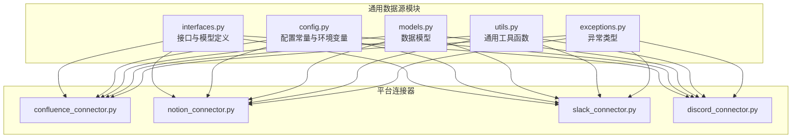
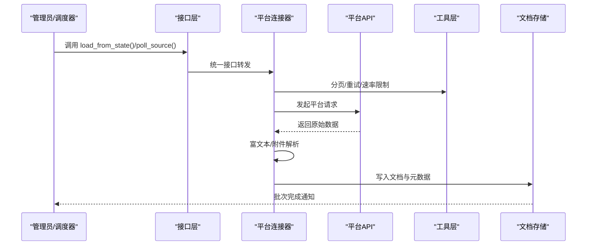
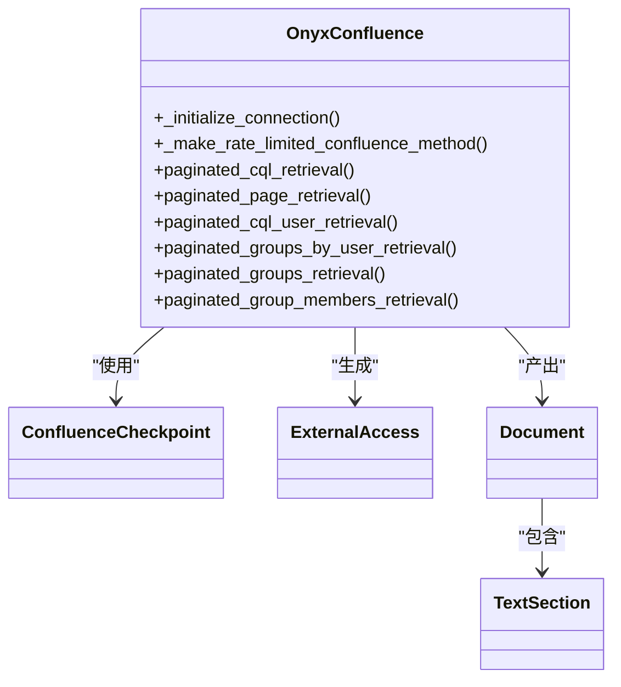
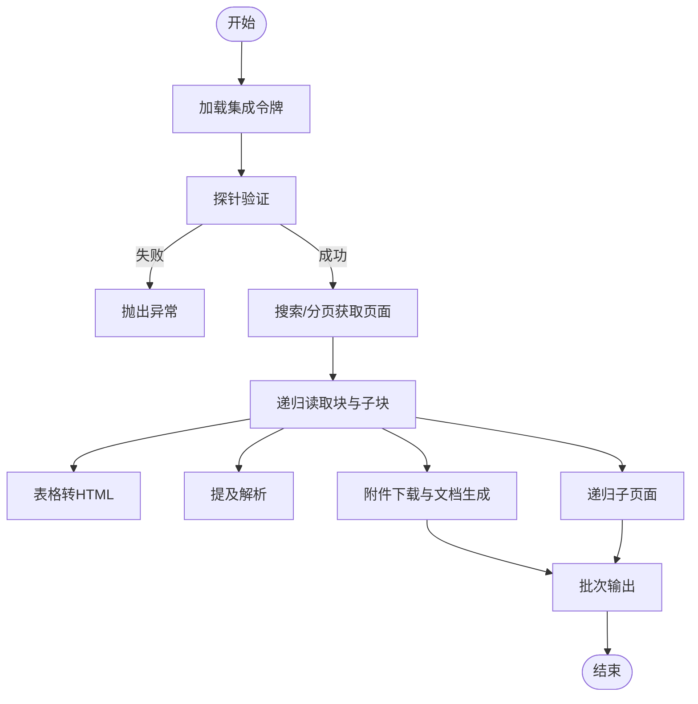
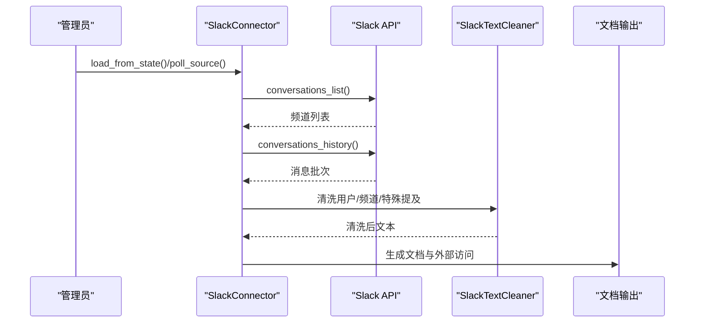
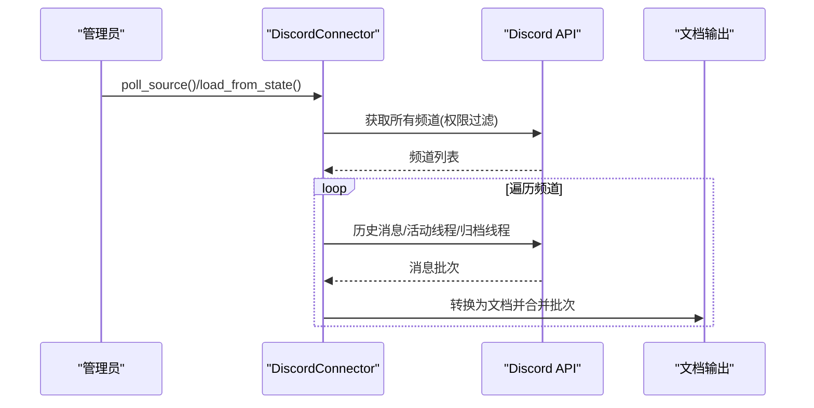
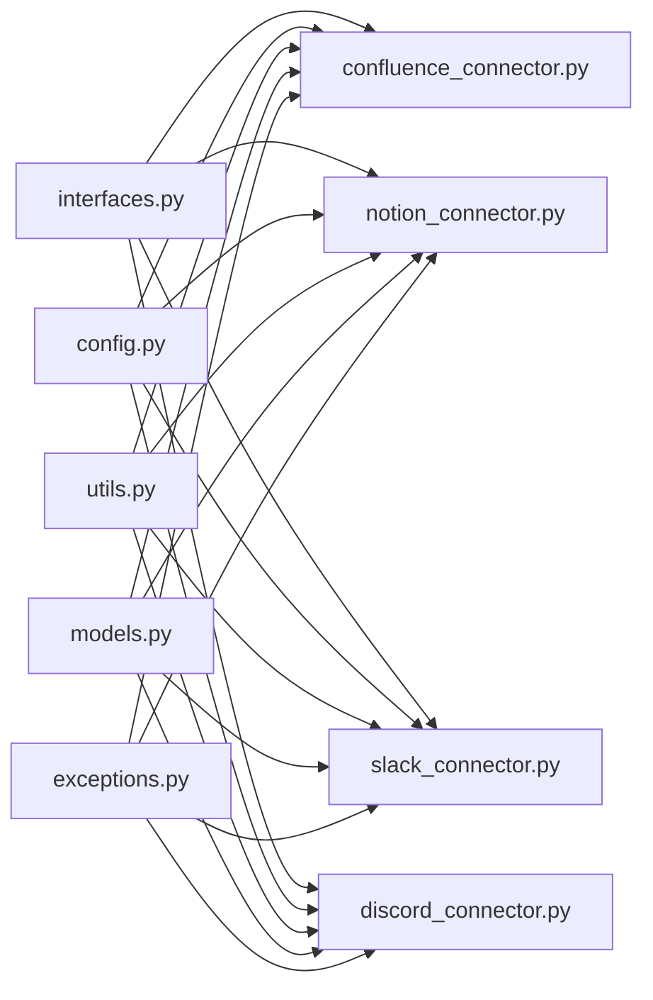

# 协作平台集成

<cite>
**本文引用的文件**
- [confluence_connector.py](file://common/data_source/confluence_connector.py)
- [notion_connector.py](file://common/data_source/notion_connector.py)
- [slack_connector.py](file://common/data_source/slack_connector.py)
- [discord_connector.py](file://common/data_source/discord_connector.py)
- [interfaces.py](file://common/data_source/interfaces.py)
- [config.py](file://common/data_source/config.py)
- [models.py](file://common/data_source/models.py)
- [utils.py](file://common/data_source/utils.py)
- [exceptions.py](file://common/data_source/exceptions.py)
- [README.md](file://README.md)
</cite>

## 目录
1. [简介](#简介)
2. [项目结构](#项目结构)
3. [核心组件](#核心组件)
4. [架构总览](#架构总览)
5. [详细组件分析](#详细组件分析)
6. [依赖关系分析](#依赖关系分析)
7. [性能考量](#性能考量)
8. [故障排查指南](#故障排查指南)
9. [结论](#结论)
10. [附录](#附录)

## 简介
本文件系统性阐述 RAGFlow 如何集成企业级协作工具：Confluence 文档管理、Notion 知识库、Slack 团队沟通与 Discord 社区平台。内容覆盖各平台 API 使用方式、数据提取策略、权限继承处理、富文本与附件管理、用户权限控制、实时事件监听（概念性）、最佳实践、性能优化与安全配置。

## 项目结构
协作平台集成位于通用数据源模块 common/data_source 下，采用“按平台拆分”的文件组织方式，统一通过接口层进行抽象，便于扩展与维护。

图表来源
- [interfaces.py:1-420](file://common/data_source/interfaces.py#L1-L420)
- [config.py:1-307](file://common/data_source/config.py#L1-L307)
- [models.py:1-320](file://common/data_source/models.py#L1-L320)
- [utils.py:1-1285](file://common/data_source/utils.py#L1-L1285)
- [exceptions.py:1-30](file://common/data_source/exceptions.py#L1-L30)
- [confluence_connector.py:1-2107](file://common/data_source/confluence_connector.py#L1-L2107)
- [notion_connector.py:1-656](file://common/data_source/notion_connector.py#L1-L656)
- [slack_connector.py:1-665](file://common/data_source/slack_connector.py#L1-L665)
- [discord_connector.py:1-342](file://common/data_source/discord_connector.py#L1-L342)

章节来源
- [README.md:1-414](file://README.md#L1-L414)

## 核心组件
- 接口层：定义加载、轮询、凭证、简化文档与检查点等统一接口，确保不同平台实现一致的调用契约。
- 配置层：集中管理索引批大小、超时、限流、OAuth 客户端信息、平台特定阈值等。
- 模型层：统一文档、外部访问、专家信息、通道/消息等数据结构，支撑跨平台一致性。
- 工具层：封装分页、重试、速率限制、链接构建、时间解析、对象存储下载等通用能力。
- 异常层：标准化凭证缺失、验证失败、权限不足、过期、意外错误等异常类型。
- 平台连接器：分别实现 Confluence、Notion、Slack、Discord 的数据拉取、富文本解析、附件处理、权限同步与校验。

章节来源
- [interfaces.py:1-420](file://common/data_source/interfaces.py#L1-L420)
- [config.py:1-307](file://common/data_source/config.py#L1-L307)
- [models.py:1-320](file://common/data_source/models.py#L1-L320)
- [utils.py:1-1285](file://common/data_source/utils.py#L1-L1285)
- [exceptions.py:1-30](file://common/data_source/exceptions.py#L1-L30)

## 架构总览
RAGFlow 的协作平台集成遵循“统一接口 + 平台适配器”模式。上层通过统一的加载/轮询接口触发，底层连接器对接具体平台 API；工具层提供重试、分页、速率限制与清理；配置层提供可调参数；模型层保证跨平台文档结构一致。

图表来源
- [interfaces.py:21-46](file://common/data_source/interfaces.py#L21-L46)
- [confluence_connector.py:649-711](file://common/data_source/confluence_connector.py#L649-L711)
- [notion_connector.py:560-604](file://common/data_source/notion_connector.py#L560-L604)
- [slack_connector.py:534-565](file://common/data_source/slack_connector.py#L534-L565)
- [discord_connector.py:308-317](file://common/data_source/discord_connector.py#L308-L317)
- [utils.py:578-598](file://common/data_source/utils.py#L578-L598)

## 详细组件分析

### Confluence 连接器
- 认证与探针
  - 支持个人访问令牌与 OAuth 2.0 刷新机制；内置探针连接以验证连通性与权限范围。
  - 动态凭据更新与 Redis 缓存，避免并发冲突。
- 数据提取
  - 基于 CQL 查询与分页检索页面、评论、附件；对问题扩展字段自动替换与逐条恢复策略。
  - 用户组与成员查询支持云版与服务版差异。
- 权限与外部访问
  - 提供外部访问模型，支持邮箱、群组与公开标记；权限同步接口预留。
- 富文本与附件
  - 页面体格式转换与表格/公式/提及等富文本抽取；附件大小与类型过滤。
- 错误处理与限流
  - 统一 HTTP 错误处理与指数退避；429/403 特殊分支；超时保护。

图表来源
- [confluence_connector.py:63-441](file://common/data_source/confluence_connector.py#L63-L441)
- [interfaces.py:131-134](file://common/data_source/interfaces.py#L131-L134)
- [models.py:10-101](file://common/data_source/models.py#L10-L101)

章节来源
- [confluence_connector.py:1-2107](file://common/data_source/confluence_connector.py#L1-L2107)
- [config.py:148-241](file://common/data_source/config.py#L148-L241)
- [models.py:10-101](file://common/data_source/models.py#L10-L101)
- [interfaces.py:108-154](file://common/data_source/interfaces.py#L108-L154)

### Notion 连接器
- 认证与校验
  - Bearer Token 注入到请求头；提供最小化探针验证（读取根页面或搜索）。
- 数据提取
  - 递归读取页面块、子块、表格转 HTML、公式抽取、提及解析（日期/页面/数据库/链接预览）。
  - 文件/图片/视频/音频块下载并生成附件文档；标题路径缓存与循环检测。
- 富文本与附件
  - 丰富文本抽取与拼接；附件命名与标题/描述组合；时间戳用于增量轮询。
- 增量轮询
  - 基于最后编辑时间窗口筛选；游标分页与批量输出。

图表来源
- [notion_connector.py:555-644](file://common/data_source/notion_connector.py#L555-L644)
- [utils.py:812-828](file://common/data_source/utils.py#L812-L828)

章节来源
- [notion_connector.py:1-656](file://common/data_source/notion_connector.py#L1-L656)
- [config.py:123-134](file://common/data_source/config.py#L123-L134)
- [utils.py:796-828](file://common/data_source/utils.py#L796-L828)

### Slack 连接器
- 认证与校验
  - Bot Token 初始化；快速客户端用于探针；权限范围校验（channels:read 等）。
- 数据提取
  - 分页获取频道列表与历史消息；线程消息合并为文档；默认过滤机器人与非信息类 subtype。
  - 用户名清洗与专家信息缓存；消息链接构造。
- 权限与外部访问
  - 外部访问模型与权限同步接口预留；简化版本未实现完整权限同步。
- 增量轮询
  - 基于时间窗口与游标分页；支持回调停止信号。

图表来源
- [slack_connector.py:461-637](file://common/data_source/slack_connector.py#L461-L637)
- [utils.py:578-598](file://common/data_source/utils.py#L578-L598)

章节来源
- [slack_connector.py:1-665](file://common/data_source/slack_connector.py#L1-L665)
- [utils.py:638-717](file://common/data_source/utils.py#L638-L717)
- [models.py:10-101](file://common/data_source/models.py#L10-L101)

### Discord 连接器
- 认证与校验
  - Bot Token 加载；最小化校验流程。
- 数据提取
  - 异步遍历服务器/频道；历史消息与活动/已归档线程；消息类型过滤（默认类型）。
  - 文档合并：按批聚合相同时间窗口内的消息，形成大文档。
- 增量轮询
  - 基于起止时间窗口与 Discord 时间起点修正。

图表来源
- [discord_connector.py:231-317](file://common/data_source/discord_connector.py#L231-L317)

章节来源
- [discord_connector.py:1-342](file://common/data_source/discord_connector.py#L1-L342)
- [config.py:107-108](file://common/data_source/config.py#L107-L108)

## 依赖关系分析
- 平台连接器均依赖接口层的统一契约，确保 load_from_state、poll_source、validate_connector_settings 等方法一致。
- 工具层提供分页、重试、速率限制、时间解析、链接构造等横切能力，被多平台复用。
- 配置层集中管理平台阈值、批大小、超时、OAuth 参数等，降低硬编码耦合。
- 模型层统一文档结构，减少平台间差异带来的映射成本。

图表来源
- [interfaces.py:1-420](file://common/data_source/interfaces.py#L1-L420)
- [config.py:1-307](file://common/data_source/config.py#L1-L307)
- [utils.py:1-1285](file://common/data_source/utils.py#L1-L1285)
- [models.py:1-320](file://common/data_source/models.py#L1-L320)
- [exceptions.py:1-30](file://common/data_source/exceptions.py#L1-L30)
- [confluence_connector.py:1-2107](file://common/data_source/confluence_connector.py#L1-L2107)
- [notion_connector.py:1-656](file://common/data_source/notion_connector.py#L1-L656)
- [slack_connector.py:1-665](file://common/data_source/slack_connector.py#L1-L665)
- [discord_connector.py:1-342](file://common/data_source/discord_connector.py#L1-L342)

章节来源
- [interfaces.py:1-420](file://common/data_source/interfaces.py#L1-L420)
- [config.py:1-307](file://common/data_source/config.py#L1-L307)
- [utils.py:1-1285](file://common/data_source/utils.py#L1-L1285)
- [models.py:1-320](file://common/data_source/models.py#L1-L320)
- [exceptions.py:1-30](file://common/data_source/exceptions.py#L1-L30)

## 性能考量
- 批处理与分页
  - 统一批大小（如 INDEX_BATCH_SIZE）与平台默认分页上限（如 Slack 的 _SLACK_LIMIT）协同，平衡吞吐与内存占用。
- 并发与重试
  - 工具层提供线程池并行执行与指数退避重试；合理设置最大工作线程数，避免平台限流与资源争用。
- 速率限制
  - 平台侧 429/403 处理与统一退避策略；必要时启用“带宽节流”装饰器或限速器。
- 存储与对象下载
  - 对象存储下载带宽与大小阈值控制，避免超大附件拖慢索引；对图片 MIME 类型白名单过滤。
- 时间窗口与增量
  - 基于最后修改时间的增量轮询，减少全量扫描；注意平台时间精度与时区偏移。

章节来源
- [config.py:107-117](file://common/data_source/config.py#L107-L117)
- [utils.py:112-158](file://common/data_source/utils.py#L112-L158)
- [utils.py:1080-1123](file://common/data_source/utils.py#L1080-L1123)
- [utils.py:1190-1255](file://common/data_source/utils.py#L1190-L1255)

## 故障排查指南
- 凭证问题
  - 缺失凭证：抛出 ConnectorMissingCredentialError；确认环境变量与令牌注入。
  - 过期/无效：CredentialExpiredError；检查 OAuth 刷新流程与有效期。
  - 权限不足：InsufficientPermissionsError；核对 scopes 与共享范围。
- 平台错误
  - 403/429：统一处理与退避；必要时调整批大小与并发度。
  - 404：资源不存在或未共享；检查目标 ID 与可见性。
- 未知错误
  - UnexpectedValidationError；记录响应与头部，定位上游异常。
- Confluence 特定
  - 扩展字段问题：自动替换与逐条恢复；检查云/服务版差异。
  - 用户组/成员查询：服务版对斜杠名称不友好，避免使用含斜杠的组名。
- Notion 特定
  - 递归查找：开启递归时注意循环引用与深度限制；使用路径缓存提升性能。
- Slack 特定
  - 频道不可见：先加入再读取；私有频道需具备相应 scope。
  - 线程消息：过滤非信息类 subtype，避免噪音。
- Discord 特定
  - 代理：若网络受限，可通过 https_proxy/http_proxy 设置；注意异步事件循环生命周期。

章节来源
- [exceptions.py:1-30](file://common/data_source/exceptions.py#L1-L30)
- [confluence_connector.py:596-648](file://common/data_source/confluence_connector.py#L596-L648)
- [notion_connector.py:606-644](file://common/data_source/notion_connector.py#L606-L644)
- [slack_connector.py:575-637](file://common/data_source/slack_connector.py#L575-L637)
- [discord_connector.py:183-186](file://common/data_source/discord_connector.py#L183-L186)

## 结论
RAGFlow 的协作平台集成以统一接口为核心，结合平台专用连接器与通用工具层，实现了对 Confluence、Notion、Slack、Discord 的稳定接入。通过严格的错误处理、速率限制与增量轮询策略，能够在大规模企业环境中高效、安全地同步知识资产。建议在生产部署中结合本文最佳实践与性能优化建议，持续监控与迭代。

## 附录

### 平台集成最佳实践
- 凭证管理
  - 使用 OAuth 2.0 令牌与刷新流程；对云平台使用 scoped URL 与云 ID 解析。
  - 将令牌与密钥置于安全位置，避免硬编码；使用分布式锁与缓存降低并发风险。
- 数据质量
  - 启用富文本清理与链接策略；对附件设置大小与类型阈值；对图片 MIME 白名单过滤。
- 权限控制
  - 利用外部访问模型与权限同步接口，确保文档访问边界与平台一致。
- 增量同步
  - 基于时间窗口的轮询；对平台差异（如 Discord Epoch）做兼容处理。
- 监控与告警
  - 记录速率限制与重试次数；对异常状态码与响应体进行结构化日志采集。

### 实现示例与配置要点
- Confluence
  - 使用 OnyxConfluence 初始化连接，设置 is_cloud、url、凭据提供者；调用 paginated_cql_retrieval 或用户/组查询接口。
  - 关键配置：CONFLUENCE_CONNECTOR_ATTACHMENT_SIZE_THRESHOLD、CONFLUENCE_TIMEZONE_OFFSET。
- Notion
  - 设置集成令牌；选择是否递归索引；使用 _fetch_page/_read_blocks 读取块与附件。
  - 关键配置：NOTION_CONNECTOR_DISABLE_RECURSIVE_PAGE_LOOKUP、INDEX_BATCH_SIZE。
- Slack
  - 使用 WebClient 初始化；调用 conversations_list 与 conversations_history；启用 SlackTextCleaner 清洗。
  - 关键配置：INDEX_BATCH_SIZE、SLACK_NUM_THREADS、MAX_RETRIES。
- Discord
  - 使用 Bot Token；遍历频道与线程；按批合并文档。
  - 关键配置：INDEX_BATCH_SIZE、proxy 环境变量。

章节来源
- [confluence_connector.py:77-125](file://common/data_source/confluence_connector.py#L77-L125)
- [notion_connector.py:55-70](file://common/data_source/notion_connector.py#L55-L70)
- [slack_connector.py:518-527](file://common/data_source/slack_connector.py#L518-L527)
- [discord_connector.py:242-246](file://common/data_source/discord_connector.py#L242-L246)
- [config.py:148-241](file://common/data_source/config.py#L148-L241)
- [config.py:123-134](file://common/data_source/config.py#L123-L134)
- [config.py:107-117](file://common/data_source/config.py#L107-L117)