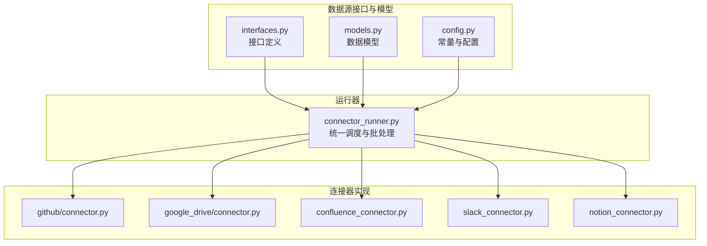
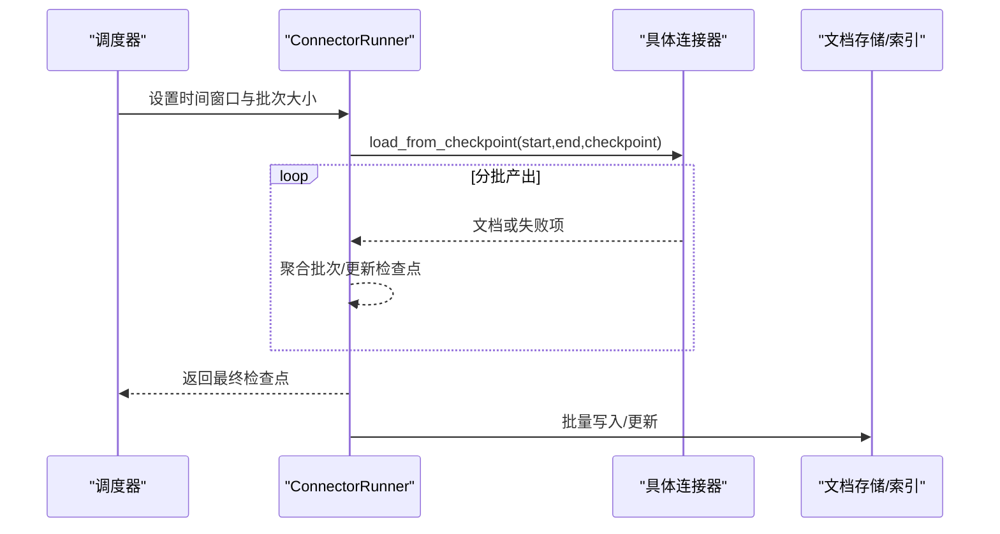
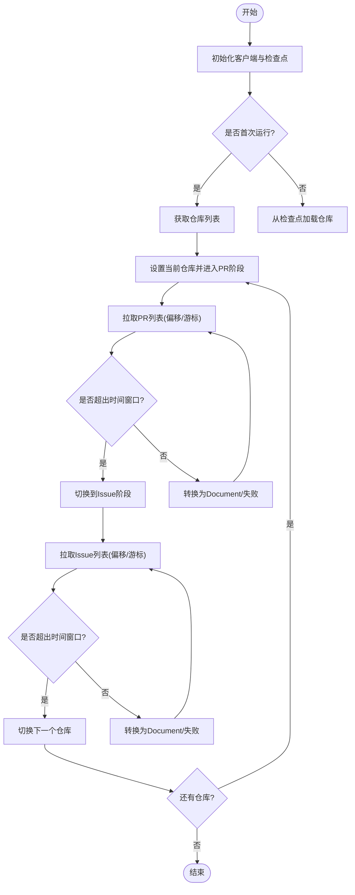
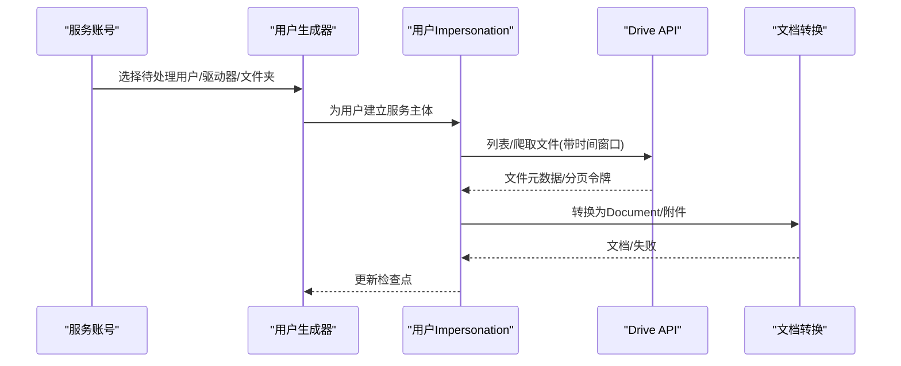
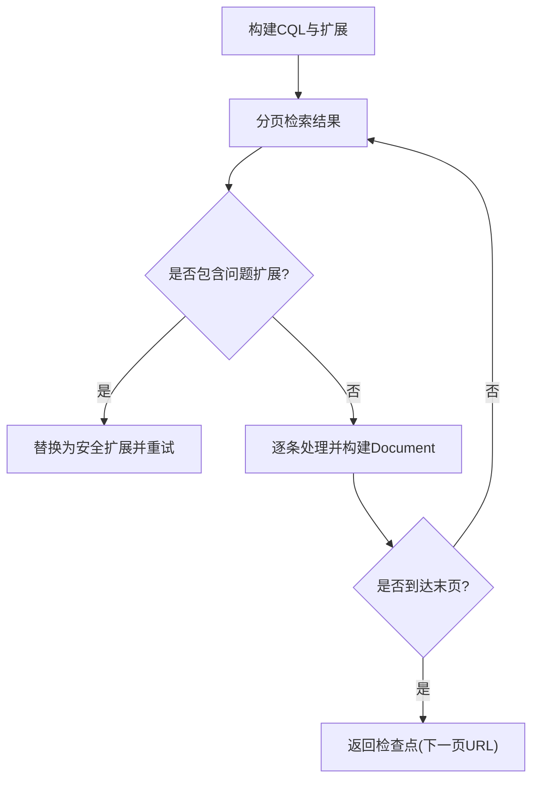
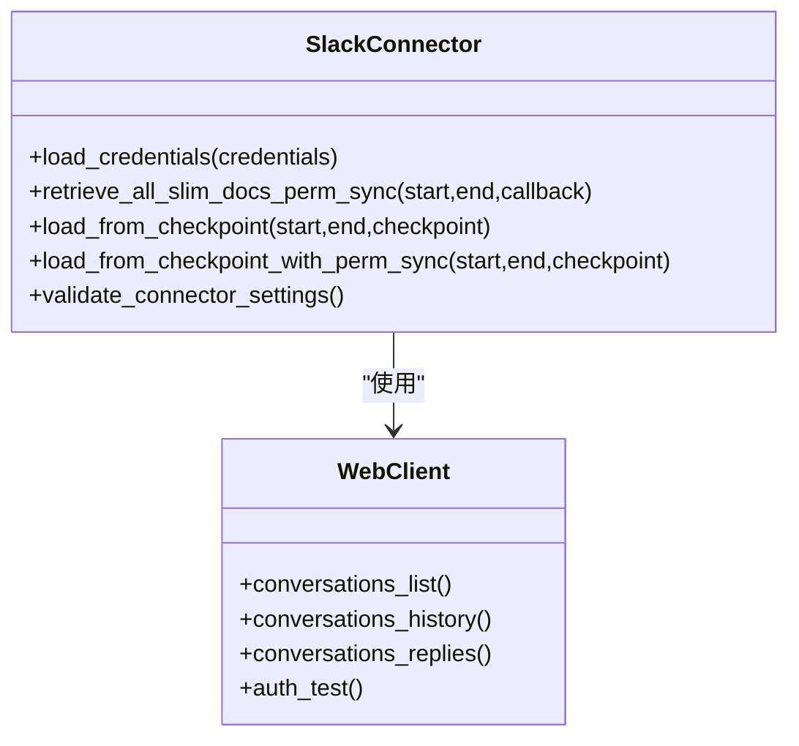
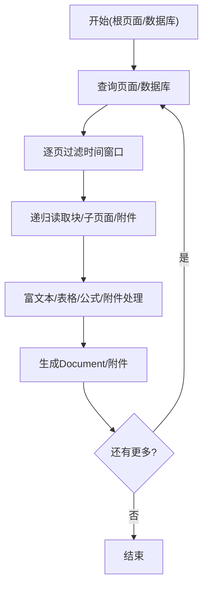
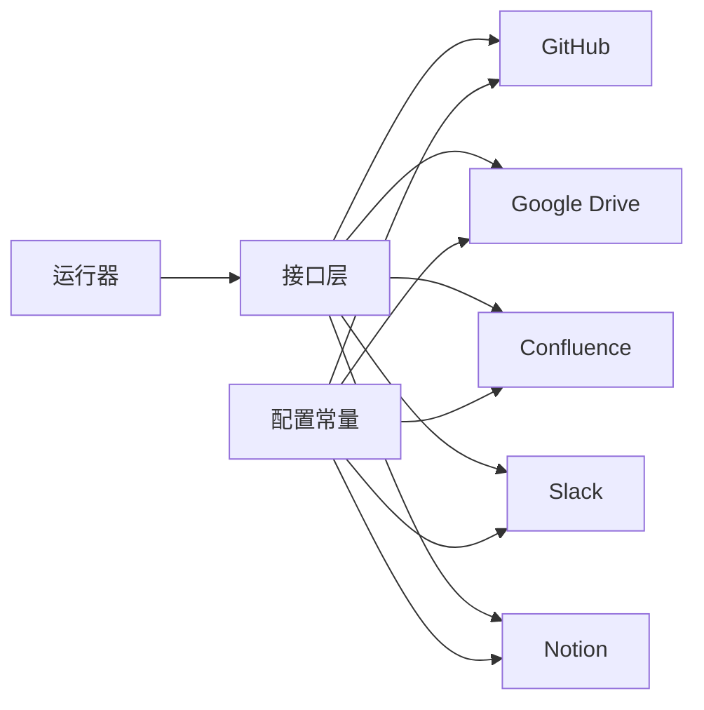

# 异构数据源兼容

<cite>
**本文引用的文件**
- [common/data_source/__init__.py](file://common/data_source/__init__.py)
- [common/data_source/interfaces.py](file://common/data_source/interfaces.py)
- [common/data_source/models.py](file://common/data_source/models.py)
- [common/data_source/config.py](file://common/data_source/config.py)
- [common/data_source/connector_runner.py](file://common/data_source/connector_runner.py)
- [common/data_source/github/connector.py](file://common/data_source/github/connector.py)
- [common/data_source/google_drive/connector.py](file://common/data_source/google_drive/connector.py)
- [common/data_source/confluence_connector.py](file://common/data_source/confluence_connector.py)
- [common/data_source/slack_connector.py](file://common/data_source/slack_connector.py)
- [common/data_source/notion_connector.py](file://common/data_source/notion_connector.py)
</cite>

## 目录
1. [简介](#简介)
2. [项目结构](#项目结构)
3. [核心组件](#核心组件)
4. [架构总览](#架构总览)
5. [详细组件分析](#详细组件分析)
6. [依赖分析](#依赖分析)
7. [性能考虑](#性能考虑)
8. [故障排查指南](#故障排查指南)
9. [结论](#结论)
10. [附录](#附录)

## 简介
本文件系统性阐述 RAGFlow 的“异构数据源兼容”能力：如何以统一接口抽象不同来源与格式（结构化、半结构化、非结构化）的数据，如何通过连接器设计实现认证、增量同步与冲突处理，以及如何在统一的知识抽取与索引流程中完成从多源到一致语义表示的转换。本文面向开发者与运维人员，既提供代码级架构图示，也给出可操作的配置与开发规范。

## 项目结构
RAGFlow 将“数据源连接器”集中放置于 common/data_source 目录下，按来源拆分子模块，统一通过接口层与运行时编排器进行调度。核心目录与文件如下：
- 接口与模型：interfaces.py、models.py、config.py
- 连接器运行器：connector_runner.py
- 典型连接器实现：github/connector.py、google_drive/connector.py、confluence_connector.py、slack_connector.py、notion_connector.py
- 导出入口：__init__.py 汇总所有可用连接器类型

图表来源
- [common/data_source/interfaces.py:1-420](file://common/data_source/interfaces.py#L1-L420)
- [common/data_source/models.py:1-320](file://common/data_source/models.py#L1-L320)
- [common/data_source/config.py:1-307](file://common/data_source/config.py#L1-L307)
- [common/data_source/connector_runner.py:1-217](file://common/data_source/connector_runner.py#L1-L217)
- [common/data_source/github/connector.py:1-973](file://common/data_source/github/connector.py#L1-L973)
- [common/data_source/google_drive/connector.py:1-1258](file://common/data_source/google_drive/connector.py#L1-L1258)
- [common/data_source/confluence_connector.py:1-2107](file://common/data_source/confluence_connector.py#L1-L2107)
- [common/data_source/slack_connector.py:1-665](file://common/data_source/slack_connector.py#L1-L665)
- [common/data_source/notion_connector.py:1-656](file://common/data_source/notion_connector.py#L1-L656)

章节来源
- [common/data_source/__init__.py:1-89](file://common/data_source/__init__.py#L1-L89)
- [common/data_source/config.py:1-307](file://common/data_source/config.py#L1-L307)

## 核心组件
- 统一接口层
  - Load/Poll/Credentials/Slim/Checkpointed 等接口，确保不同来源的连接器遵循一致的生命周期与契约。
  - 基类 BaseConnector 提供通用元数据解析、校验钩子、图片处理开关等能力。
- 数据模型层
  - Document、SlimDocument、ConnectorCheckpoint、ConnectorFailure 等统一承载文档、权限、失败信息与检查点状态。
- 配置与常量层
  - DocumentSource 枚举统一标识来源；各连接器的超时、批量、阈值等参数集中管理。
- 运行器层
  - ConnectorRunner 负责时间窗口切片、批次聚合、异常日志增强与不同连接器类型的适配。

章节来源
- [common/data_source/interfaces.py:21-420](file://common/data_source/interfaces.py#L21-L420)
- [common/data_source/models.py:89-156](file://common/data_source/models.py#L89-L156)
- [common/data_source/config.py:41-307](file://common/data_source/config.py#L41-L307)
- [common/data_source/connector_runner.py:91-217](file://common/data_source/connector_runner.py#L91-L217)

## 架构总览
RAGFlow 的异构数据源兼容采用“接口抽象 + 统一运行器 + 多连接器实现”的分层架构。运行器根据时间范围与批次大小驱动各连接器产出 Document 或失败项，同时支持权限同步与检查点恢复。

图表来源
- [common/data_source/connector_runner.py:119-173](file://common/data_source/connector_runner.py#L119-L173)
- [common/data_source/interfaces.py:261-298](file://common/data_source/interfaces.py#L261-L298)

## 详细组件分析

### GitHub 连接器（结构化/半结构化）
- 设计要点
  - 支持 PR 与 Issue 的双阶段遍历，使用偏移分页与游标回退策略应对大集合场景。
  - 通过 ExternalAccess 获取仓库级权限上下文，支持权限同步。
  - 时间窗口过滤：基于 updated_at 逆序推进，命中 start/end 边界即停止。
- 认证与速率限制
  - 使用 Token 认证；遇到速率限制自动休眠重试，最大重试次数受控。
- 增量同步
  - 检查点包含阶段、页码、游标 URL、已取数量等，保证断点续跑不重复。
- 冲突处理
  - 转换失败生成 ConnectorFailure 并继续；游标过期自动回退至偏移模式。

图表来源
- [common/data_source/github/connector.py:515-740](file://common/data_source/github/connector.py#L515-L740)

章节来源
- [common/data_source/github/connector.py:413-800](file://common/data_source/github/connector.py#L413-L800)

### Google Drive 连接器（半结构化/非结构化）
- 设计要点
  - 支持 My Drive、共享盘、指定文件夹三种模式；服务账号模式下并发模拟多用户检索。
  - 通过 RetrievedDriveFile 包装文件与用户/阶段信息，统一后续转换。
  - 支持权限同步上下文构建，控制附件大小与字符数阈值。
- 认证与速率限制
  - 支持 OAuth 与服务账号两种凭据；对 401/403/刷新错误进行降级处理。
- 增量同步
  - CompletionMap 记录每个用户的阶段、游标、完成时间与已访问父节点集合。
- 冲突处理
  - 文件夹爬取与文件检索分离，避免重复；未完成的文件夹在后续继续。

图表来源
- [common/data_source/google_drive/connector.py:508-600](file://common/data_source/google_drive/connector.py#L508-L600)

章节来源
- [common/data_source/google_drive/connector.py:112-767](file://common/data_source/google_drive/connector.py#L112-L767)

### Confluence 连接器（半结构化/结构化）
- 设计要点
  - 自定义 OnyxConfluence 包装 Atlassian 客户端，内置重试、扩展字段替换与游标/偏移混合分页。
  - 支持用户组/成员查询、空间权限读取，构建 ExternalAccess。
  - CQL 查询与扩展字段组合，兼顾性能与完整性。
- 认证与速率限制
  - 支持个人访问令牌与 OAuth Cloud；动态轮换令牌并缓存到 Redis。
- 增量同步
  - 检查点保存 next_page_url，支持断点续跑。
- 冲突处理
  - 对 500 错误采用逐条回退策略；问题扩展字段自动替换。

图表来源
- [common/data_source/confluence_connector.py:498-684](file://common/data_source/confluence_connector.py#L498-L684)

章节来源
- [common/data_source/confluence_connector.py:63-441](file://common/data_source/confluence_connector.py#L63-L441)

### Slack 连接器（半结构化/非结构化）
- 设计要点
  - 支持频道筛选（正则/精确）、消息过滤（机器人/非信息类）、线程转文档。
  - 提供简化版权限同步接口，支持外部访问上下文注入。
- 认证与速率限制
  - WebClient 配置重试处理器；验证阶段检测 invalid_auth/missing_scope 等典型错误。
- 增量同步
  - 当前简化版本未实现完整检查点，但保留接口以适配未来扩展。
- 冲突处理
  - 已处理线程去重；异常消息封装为 ConnectorFailure。

图表来源
- [common/data_source/slack_connector.py:461-638](file://common/data_source/slack_connector.py#L461-L638)

章节来源
- [common/data_source/slack_connector.py:461-665](file://common/data_source/slack_connector.py#L461-L665)

### Notion 连接器（半结构化/非结构化）
- 设计要点
  - 递归抓取页面块、数据库查询、表格渲染、富文本与公式抽取；支持附件下载与元数据生成。
  - 可选根页面递归索引，构建层级路径辅助语义标识。
- 认证与速率限制
  - Notion-Version 2022-06-28；对 404/403/429 等错误进行分类处理。
- 增量同步
  - 基于 last_edited_time 的时间窗口过滤与分页游标推进。
- 冲突处理
  - 不支持的块类型跳过；下载失败生成空文档并继续。

图表来源
- [common/data_source/notion_connector.py:546-604](file://common/data_source/notion_connector.py#L546-L604)

章节来源
- [common/data_source/notion_connector.py:46-645](file://common/data_source/notion_connector.py#L46-L645)

## 依赖分析
- 组件耦合
  - 各连接器均依赖统一接口层（CheckpointedConnector、SlimConnector 等），降低上层调用复杂度。
  - 运行器与连接器之间通过 CheckpointOutputWrapper 解耦，屏蔽连接器内部返回细节。
- 外部依赖
  - GitHub：PyGithub；Google Drive：google-api-python-client、OAuth/Service Account；Confluence：atlassian-python-api；Slack：slack-sdk；Notion：requests + Notion API。
- 配置与常量
  - DocumentSource 枚举统一来源标识；各连接器通过 config.py 中的阈值、批量、超时等参数控制行为。

图表来源
- [common/data_source/interfaces.py:203-298](file://common/data_source/interfaces.py#L203-L298)
- [common/data_source/connector_runner.py:91-173](file://common/data_source/connector_runner.py#L91-L173)
- [common/data_source/config.py:41-120](file://common/data_source/config.py#L41-L120)

章节来源
- [common/data_source/__init__.py:26-88](file://common/data_source/__init__.py#L26-L88)
- [common/data_source/config.py:41-120](file://common/data_source/config.py#L41-L120)

## 性能考虑
- 批量与并发
  - 运行器按批次聚合输出，减少下游写入压力；Google Drive 在服务账号模式下使用线程池并发模拟多用户。
- 速率限制与退避
  - GitHub/Confluence/Slack/Notion 均内置重试与退避策略；Google Drive 对 401/403/刷新错误进行降级。
- 资源控制
  - 各连接器通过 size/char count/页大小等阈值限制单文档体积与处理成本。
- 权限同步开销
  - 权限同步通常较昂贵，建议仅在需要时启用，并结合缓存与增量策略。

## 故障排查指南
- 常见错误类型
  - 凭证缺失/过期：ConnectorMissingCredentialError、CredentialExpiredError
  - 权限不足：InsufficientPermissionsError
  - 参数校验失败：ConnectorValidationError、UnexpectedValidationError
- 定位手段
  - 运行器捕获异常并记录局部变量，便于快速定位上下文。
  - 检查点包装器确保每次迭代返回明确的文档/失败/检查点三元组，便于恢复。
- 处理建议
  - GitHub：关注游标过期与速率限制，必要时回退偏移分页。
  - Google Drive：确认凭据范围与用户访问权限，适当降低并发与页大小。
  - Confluence：优先使用安全扩展字段，关注 500 错误的逐条回退。
  - Slack：核对 bot token scope 与频道可见性。
  - Notion：检查集成权限与资源可见性，关注 429 限流。

章节来源
- [common/data_source/connector_runner.py:196-217](file://common/data_source/connector_runner.py#L196-L217)
- [common/data_source/github/connector.py:138-156](file://common/data_source/github/connector.py#L138-L156)
- [common/data_source/google_drive/connector.py:756-762](file://common/data_source/google_drive/connector.py#L756-L762)
- [common/data_source/confluence_connector.py:396-416](file://common/data_source/confluence_connector.py#L396-L416)
- [common/data_source/slack_connector.py:607-637](file://common/data_source/slack_connector.py#L607-L637)
- [common/data_source/notion_connector.py:629-644](file://common/data_source/notion_connector.py#L629-L644)

## 结论
RAGFlow 通过统一接口、标准化模型与运行器编排，成功将 GitHub、Google Drive、Confluence、Slack、Notion 等异构数据源纳入一致的增量索引流程。连接器在认证、速率限制、权限同步与检查点恢复方面具备完善的工程化实践，能够稳定支撑多源知识抽取与索引。建议在生产环境中结合业务需求启用权限同步、合理设置阈值与批量，并持续监控各连接器的错误指标以保障稳定性。

## 附录

### 数据源配置指南（节选）
- 通用配置键
  - REQUEST_TIMEOUT_SECONDS：请求超时（秒）
  - CONTINUE_ON_CONNECTOR_FAILURE：连接器失败时是否继续
  - INDEX_BATCH_SIZE：索引批次大小
- 来源特定配置
  - GitHub：GITHUB_CONNECTOR_BASE_URL（自建/GHE 场景）
  - Google Drive：GOOGLE_DRIVE_CONNECTOR_SIZE_THRESHOLD、MAX_DRIVE_WORKERS
  - Confluence：CONFLUENCE_CONNECTOR_LABELS_TO_SKIP、CONFLUENCE_TIMEZONE_OFFSET、CONFLUENCE_SYNC_TIME_BUFFER_SECONDS
  - Slack：OAUTH_SLACK_CLIENT_ID/SECRET、SLACK_NUM_THREADS
  - Notion：NOTION_CONNECTOR_DISABLE_RECURSIVE_PAGE_LOOKUP
  - Jira/Zendesk/Airtable/Asana/IMAP/Web/DingTalk 等均有对应阈值与开关

章节来源
- [common/data_source/config.py:16-307](file://common/data_source/config.py#L16-L307)

### 连接器开发规范
- 必须实现的接口
  - load_credentials：加载凭据并返回新凭据字典（如需刷新）
  - load_from_state/poll_source/load_from_checkpoint：按生命周期提供文档批次
  - build_dummy_checkpoint/validate_checkpoint_json：检查点序列化/反序列化
  - validate_connector_settings：最小化连通性与权限校验
- 建议实现的能力
  - parse_metadata：将元数据解析为提示词上下文
  - set_allow_images：根据应用设置允许/禁止图片下载
  - validate_perm_sync：权限同步校验钩子
- 错误处理
  - 将单条对象转换失败封装为 ConnectorFailure，避免中断整体流程
  - 对外部 API 的限流/错误进行重试与退避

章节来源
- [common/data_source/interfaces.py:203-343](file://common/data_source/interfaces.py#L203-L343)
- [common/data_source/models.py:131-156](file://common/data_source/models.py#L131-L156)