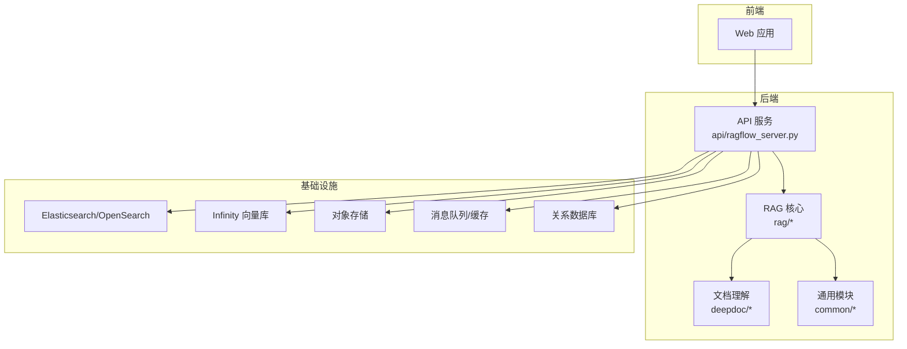
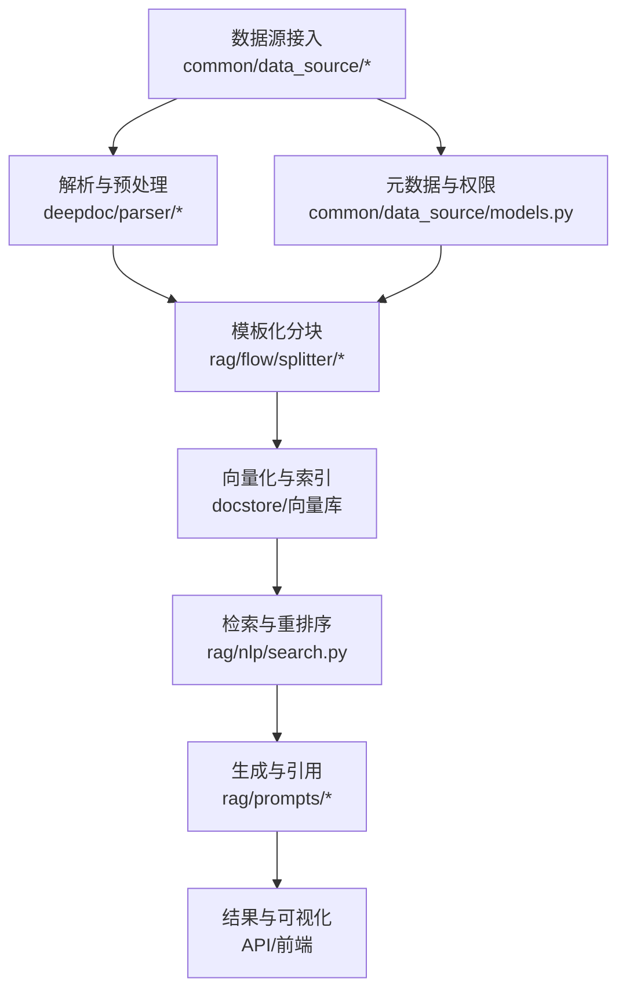
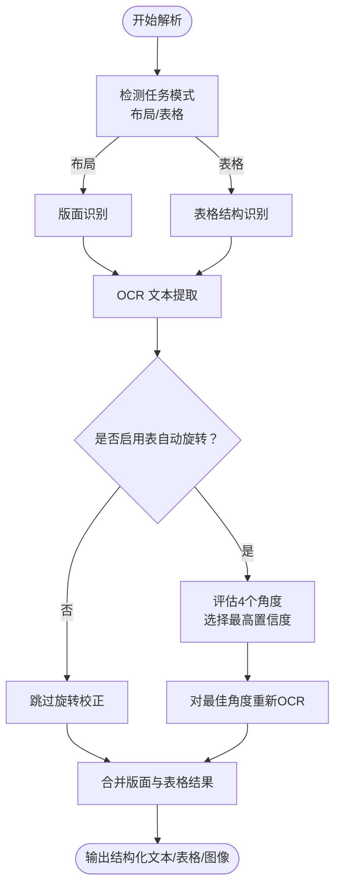
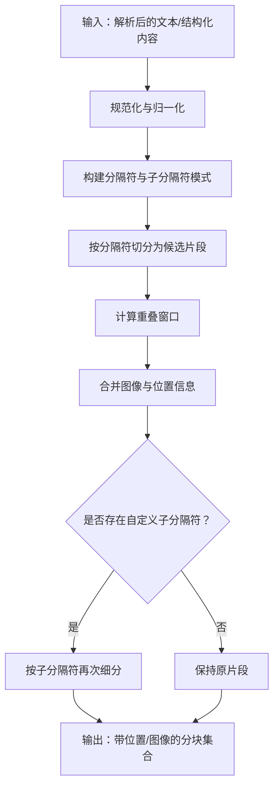
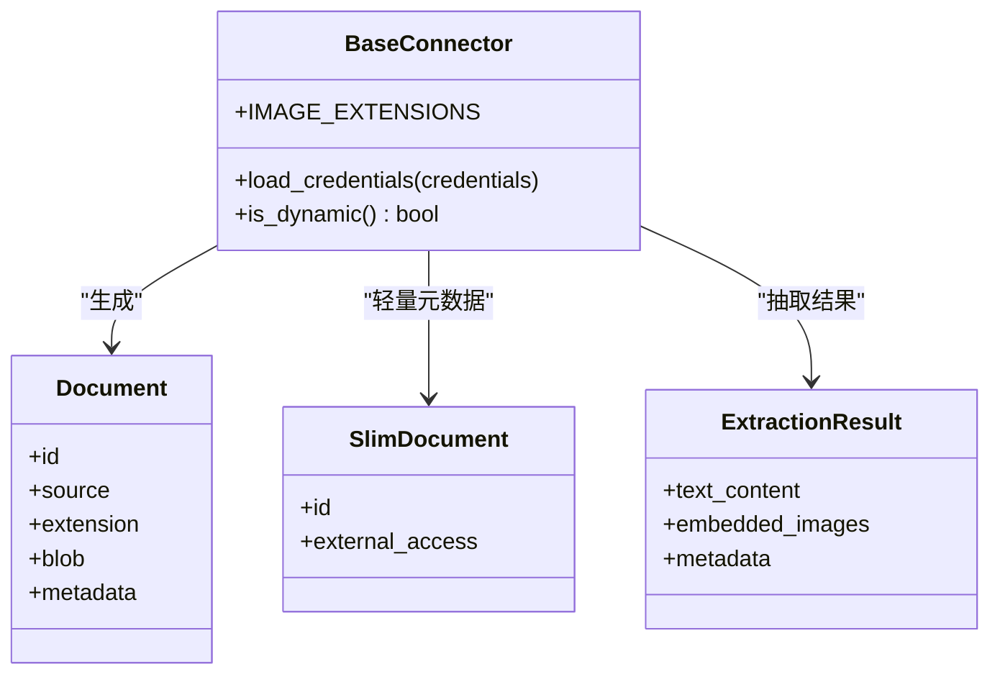
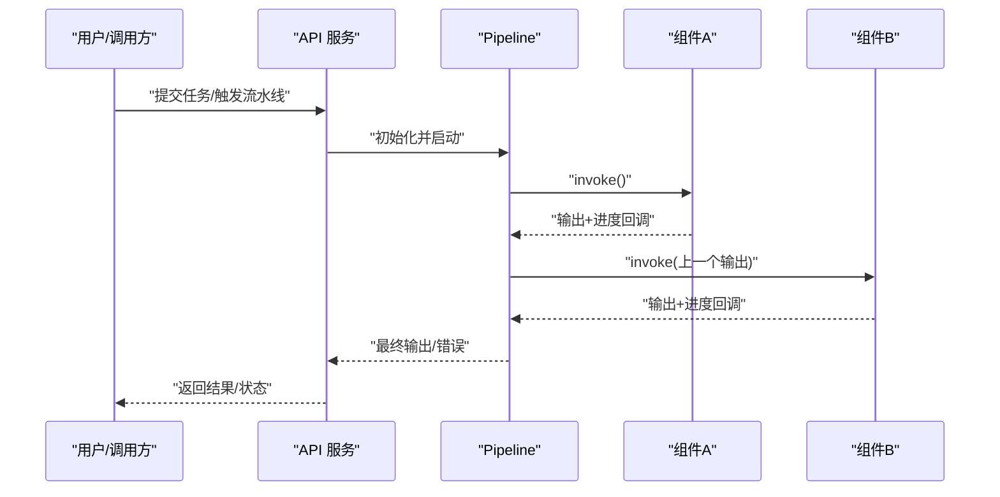
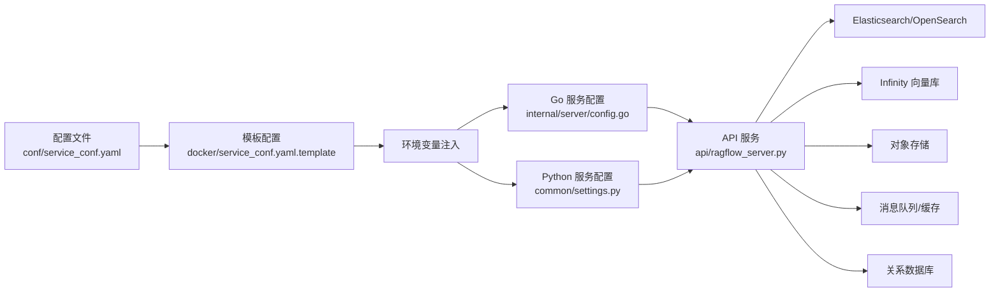

# 核心特性与优势

<cite>
**本文引用的文件**
- [README.md](file://README.md)
- [deepdoc/README.md](file://deepdoc/README.md)
- [rag/flow/pipeline.py](file://rag/flow/pipeline.py)
- [rag/flow/base.py](file://rag/flow/base.py)
- [rag/flow/splitter/splitter.py](file://rag/flow/splitter/splitter.py)
- [common/data_source/interfaces.py](file://common/data_source/interfaces.py)
- [common/data_source/models.py](file://common/data_source/models.py)
- [api/ragflow_server.py](file://api/ragflow_server.py)
- [conf/service_conf.yaml](file://conf/service_conf.yaml)
- [docker/service_conf.yaml.template](file://docker/service_conf.yaml.template)
- [internal/server/config.go](file://internal/server/config.go)
- [api/db/services/tenant_llm_service.py](file://api/db/services/tenant_llm_service.py)
- [rag/benchmark.py](file://rag/benchmark.py)
- [api/db/services/evaluation_service.py](file://api/db/services/evaluation_service.py)
- [deepdoc/vision/t_recognizer.py](file://deepdoc/vision/t_recognizer.py)
- [deepdoc/parser/pdf_parser.py](file://deepdoc/parser/pdf_parser.py)
- [common/settings.py](file://common/settings.py)
</cite>

## 目录
1. [引言](#引言)
2. [项目结构](#项目结构)
3. [核心组件](#核心组件)
4. [架构总览](#架构总览)
5. [详细组件分析](#详细组件分析)
6. [依赖关系分析](#依赖关系分析)
7. [性能考量](#性能考量)
8. [故障排查指南](#故障排查指南)
9. [结论](#结论)
10. [附录](#附录)

## 引言
本文件聚焦RAGFlow的六大核心特性：深度文档理解、模板化分块、可信引用、异构数据源兼容、自动化RAG工作流与多模态处理能力。我们将从技术实现原理、业务价值、使用场景、性能指标与配置要点等方面进行系统阐述，并给出特性间的协同与组合使用建议，帮助读者高效落地高质量的RAG应用。

## 项目结构
RAGFlow采用前后端分离与模块化设计，后端由Python服务与Go服务构成，前端为Web应用；知识处理链路由“解析-分块-检索-生成”组成，支持可编排的流水线与多模态能力。核心目录与职责概览：
- api：REST API入口与服务层，负责对外接口与任务编排
- rag：RAG核心算法与流程，含分块、检索、提示词工程、评估
- deepdoc：文档理解与多模态视觉处理（OCR、版面识别、表格结构识别）
- common：通用工具、数据源抽象、连接与配置
- docker/helm：容器化部署与配置模板
- internal：Go侧服务与配置加载
- conf：系统默认配置样例

图表来源
- [api/ragflow_server.py:1-155](file://api/ragflow_server.py#L1-L155)
- [conf/service_conf.yaml:1-160](file://conf/service_conf.yaml#L1-L160)

章节来源
- [README.md:140-144](file://README.md#L140-L144)
- [api/ragflow_server.py:1-155](file://api/ragflow_server.py#L1-L155)
- [conf/service_conf.yaml:1-160](file://conf/service_conf.yaml#L1-L160)

## 核心组件
- 流水线引擎：通过可编排的组件图实现RAG工作流的自动调度与进度追踪
- 模板化分块：基于规则与自定义模式的文本切片，兼顾可控性与可解释性
- 可信引用：可视化分块与可追溯引用，降低幻觉风险
- 异构数据源：统一抽象与多协议适配，覆盖结构化/半结构化/非结构化
- 自动化RAG：多召回+融合重排序，提供直观API与可配置模型栈
- 多模态处理：OCR、版面识别、表格结构识别与图像描述，增强复杂文档理解

章节来源
- [README.md:111-139](file://README.md#L111-L139)
- [rag/flow/pipeline.py:28-176](file://rag/flow/pipeline.py#L28-L176)
- [rag/flow/splitter/splitter.py:52-173](file://rag/flow/splitter/splitter.py#L52-L173)
- [common/data_source/interfaces.py:203-210](file://common/data_source/interfaces.py#L203-L210)
- [common/data_source/models.py:69-102](file://common/data_source/models.py#L69-L102)

## 架构总览
RAGFlow的系统架构围绕“解析-分块-索引-检索-生成-输出”闭环展开，支持多模型工厂与多向量后端切换，具备可观测性与可扩展性。

图表来源
- [deepdoc/parser/pdf_parser.py:413-438](file://deepdoc/parser/pdf_parser.py#L413-L438)
- [rag/flow/splitter/splitter.py:52-173](file://rag/flow/splitter/splitter.py#L52-L173)
- [common/data_source/models.py:69-102](file://common/data_source/models.py#L69-L102)

## 详细组件分析

### 特性一：深度文档理解（Deep Document Understanding）
- 技术实现
  - 视觉理解：OCR、版面识别、表格结构识别（TSR），支持表自动旋转提升精度
  - 解析器：针对PDF、DOCX、XLSX、PPTX、TXT等格式的结构化解析与语义重组
  - 多模态：结合OCR与版面信息，对图片内文本与表格进行高保真重建
- 业务价值
  - 面向复杂版式与扫描件，显著提升非结构化数据的可检索性
  - 降低人工清洗成本，提高下游RAG质量
- 使用场景
  - 合规文档、财务报表、专利说明书、学术论文等
- 性能与指标
  - 表自动旋转与OCR置信度评估可减少错检漏检，提升召回与准确率
- 配置与调优
  - 通过环境变量控制表自动旋转策略
  - 在解析器参数中设置阈值与模式（布局/表格）

图表来源
- [deepdoc/vision/t_recognizer.py:36-186](file://deepdoc/vision/t_recognizer.py#L36-L186)
- [deepdoc/parser/pdf_parser.py:413-438](file://deepdoc/parser/pdf_parser.py#L413-L438)

章节来源
- [deepdoc/README.md:46-147](file://deepdoc/README.md#L46-L147)
- [deepdoc/vision/t_recognizer.py:36-186](file://deepdoc/vision/t_recognizer.py#L36-L186)
- [deepdoc/parser/pdf_parser.py:413-438](file://deepdoc/parser/pdf_parser.py#L413-L438)

### 特性二：模板化分块（Template-based Chunking）
- 技术实现
  - 基于分隔符与自定义子分隔符的规则分块，支持叠加重叠窗口
  - 对Markdown/HTML/纯文本进行一致性切片，并保留位置与图像关联
  - 支持自定义子分隔符模式，按需拆分子段
- 业务价值
  - 将长文档按主题/结构切分，提升检索相关性与生成可控性
  - 分块可解释性强，便于人工干预与质量治理
- 使用场景
  - 法律合同、产品文档、技术规范、培训材料
- 性能与指标
  - 合理的重叠窗口可提升跨段问答召回；过度重叠会增加索引规模
- 配置与调优
  - 设置分隔符列表、重叠比例、块大小、表格/图像上下文长度

图表来源
- [rag/flow/splitter/splitter.py:52-173](file://rag/flow/splitter/splitter.py#L52-L173)

章节来源
- [README.md:119-123](file://README.md#L119-L123)
- [rag/flow/splitter/splitter.py:52-173](file://rag/flow/splitter/splitter.py#L52-L173)

### 特性三：可信引用（Grounded Citations）
- 技术实现
  - 分块可视化：前端可查看分块边界与来源位置
  - 引用追踪：输出包含关键引用快照与可追溯的来源标识
  - 与检索结果联动，确保回答可溯源
- 业务价值
  - 显著降低LLM幻觉，提升回答可信度与合规性
  - 便于审计与人工复核
- 使用场景
  - 医疗咨询、法律问答、金融风控、合规审查
- 性能与指标
  - 引用覆盖率与可追溯性是关键指标；需平衡召回与误召回

章节来源
- [README.md:124-128](file://README.md#L124-L128)

### 特性四：异构数据源兼容（Heterogeneous Data Sources）
- 技术实现
  - 统一抽象：BaseConnector定义加载凭证、增量/全量拉取、权限与扩展能力
  - 模型定义：Document/SlimDocument/ExtractionResult等模型支撑不同阶段的数据形态
  - 扩展点：通过Provider/Connector实现对多种平台（如Notion、Slack、Confluence、S3等）的适配
- 业务价值
  - 一套RAG系统覆盖企业内部文档、协作平台、云存储与外部网站
  - 降低重复开发与维护成本
- 使用场景
  - 跨系统知识汇聚、智能客服、知识检索门户
- 配置与调优
  - 通过配置文件或环境变量注入凭证与目标范围

图表来源
- [common/data_source/interfaces.py:203-210](file://common/data_source/interfaces.py#L203-L210)
- [common/data_source/models.py:69-102](file://common/data_source/models.py#L69-L102)

章节来源
- [README.md:129-132](file://README.md#L129-L132)
- [common/data_source/interfaces.py:203-210](file://common/data_source/interfaces.py#L203-L210)
- [common/data_source/models.py:69-102](file://common/data_source/models.py#L69-L102)

### 特性五：自动化RAG工作流（Automated RAG Workflow）
- 技术实现
  - 可编排流水线：Pipeline基于组件图顺序执行，支持并发与错误传播
  - 组件基类：ProcessBase封装超时、回调、异常兜底与耗时统计
  - 运行时观测：通过Redis记录组件进度与日志，支持取消与回溯
- 业务价值
  - 从“上传-解析-分块-索引-检索-生成-输出”的全链路自动化
  - 降低运维与调参门槛，提升稳定性与可观测性
- 使用场景
  - 企业知识库自动更新、批量文档入库、多租户知识管理
- 配置与调优
  - 通过DSL定义流水线，设置组件超时、日志持久化等参数

图表来源
- [rag/flow/pipeline.py:117-176](file://rag/flow/pipeline.py#L117-L176)
- [rag/flow/base.py:41-64](file://rag/flow/base.py#L41-L64)

章节来源
- [README.md:133-139](file://README.md#L133-L139)
- [rag/flow/pipeline.py:28-176](file://rag/flow/pipeline.py#L28-L176)
- [rag/flow/base.py:33-64](file://rag/flow/base.py#L33-L64)

### 特性六：多模态处理能力（Multimodal Processing）
- 技术实现
  - OCR与版面识别：定位文本区域、绘制标注、输出HTML/图像
  - 表格结构识别：识别行列、跨行/合并单元格，重建语义表格
  - 图像描述：结合多模态模型对PDF/DOCX中的图进行描述
- 业务价值
  - 将扫描件、图片、表格等非文本内容转化为可检索的结构化文本
  - 提升复杂文档的整体理解与问答质量
- 使用场景
  - 审计底稿、财务报表、专利附图、培训课件
- 配置与调优
  - 通过命令行参数或解析器API控制阈值、模式与自动旋转

章节来源
- [README.md:100-101](file://README.md#L100-L101)
- [deepdoc/vision/t_recognizer.py:36-186](file://deepdoc/vision/t_recognizer.py#L36-L186)
- [deepdoc/parser/pdf_parser.py:413-438](file://deepdoc/parser/pdf_parser.py#L413-L438)

## 依赖关系分析
RAGFlow在运行时依赖多种后端组件与配置，以下图展示关键依赖与配置映射关系：

图表来源
- [conf/service_conf.yaml:1-160](file://conf/service_conf.yaml#L1-L160)
- [docker/service_conf.yaml.template:1-172](file://docker/service_conf.yaml.template#L1-L172)
- [internal/server/config.go:663-687](file://internal/server/config.go#L663-L687)
- [common/settings.py:218-230](file://common/settings.py#L218-L230)
- [api/ragflow_server.py:1-155](file://api/ragflow_server.py#L1-L155)

章节来源
- [conf/service_conf.yaml:1-160](file://conf/service_conf.yaml#L1-L160)
- [docker/service_conf.yaml.template:1-172](file://docker/service_conf.yaml.template#L1-L172)
- [internal/server/config.go:663-687](file://internal/server/config.go#L663-L687)
- [common/settings.py:218-230](file://common/settings.py#L218-L230)
- [api/ragflow_server.py:1-155](file://api/ragflow_server.py#L1-L155)

## 性能考量
- 检索与排序
  - 多路召回+融合重排序可提升检索质量；需权衡延迟与吞吐
  - 向量维度与索引类型影响检索速度与精度
- 分块策略
  - 合理的分隔符与重叠窗口可提升跨段问答召回
  - 图像/表格上下文长度需结合存储与检索成本评估
- 并发与可观测性
  - 组件超时与日志持久化有助于定位瓶颈
  - 通过Redis记录组件轨迹，支持取消与回溯
- 评测与基准
  - 提供基准脚本与评估服务，支持ndcg@10、map@5、mrr@10等指标
  - 支持MS MARCO、TriviaQA、MIRACL等数据集评估

章节来源
- [rag/benchmark.py:40-315](file://rag/benchmark.py#L40-L315)
- [api/db/services/evaluation_service.py:525-569](file://api/db/services/evaluation_service.py#L525-L569)

## 故障排查指南
- 启动与健康检查
  - 确认容器与服务已就绪，查看服务日志与心跳
- 配置问题
  - 检查配置文件与环境变量是否正确注入
  - 确认模型工厂、API密钥与基础地址配置一致
- 运行时异常
  - 查看组件回调日志与Redis轨迹，定位失败节点
  - 检查超时设置与资源限制
- 数据源同步
  - 校验凭证与权限范围，确认增量/全量同步策略

章节来源
- [api/ragflow_server.py:74-155](file://api/ragflow_server.py#L74-L155)
- [internal/server/config.go:663-687](file://internal/server/config.go#L663-L687)
- [api/db/services/tenant_llm_service.py:120-137](file://api/db/services/tenant_llm_service.py#L120-L137)
- [rag/flow/pipeline.py:43-105](file://rag/flow/pipeline.py#L43-L105)

## 结论
RAGFlow通过“深度文档理解+模板化分块+可信引用+异构数据源+自动化工作流+多模态处理”的六大特性，形成从数据接入到高质量问答的完整闭环。其可编排的流水线、可控的分块策略与可视化引用机制，在准确性、效率与可扩展性方面相较传统RAG系统具有明显优势。配合完善的配置体系与评测能力，RAGFlow能够满足从个人到大型企业的多样化应用场景。

## 附录
- 快速开始与部署
  - 参考项目自述文件中的“Get Started”与“Configurations”章节
- API与SDK
  - 通过REST API与Python SDK进行集成，支持批量导入、检索与评估
- 模板与DSL
  - 使用可编排的流水线DSL定义RAG工作流，按需扩展组件

章节来源
- [README.md:146-275](file://README.md#L146-L275)
- [README.md:276-298](file://README.md#L276-L298)