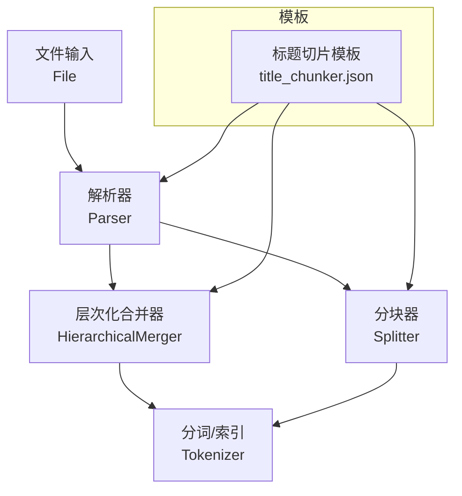
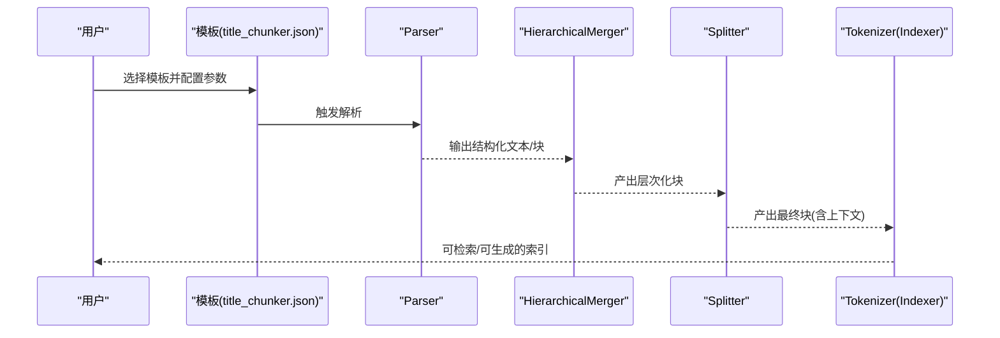
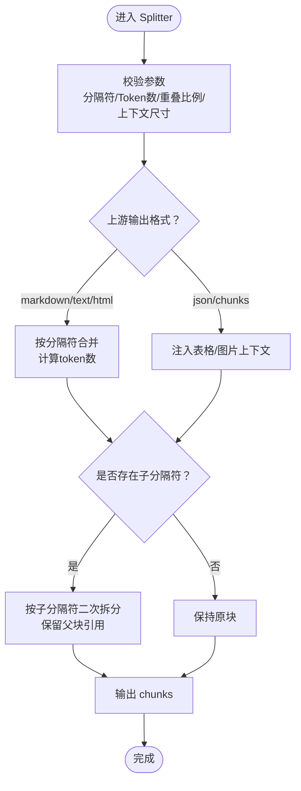
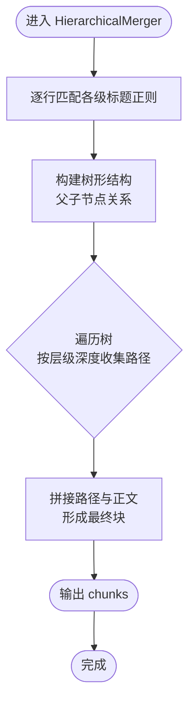
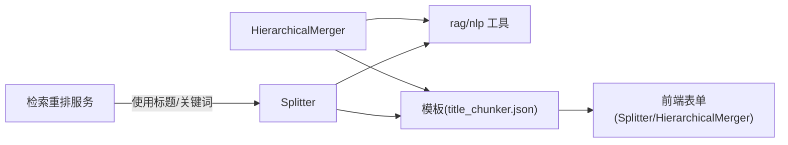

# 模板化分块

<cite>
**本文引用的文件**
- [rag/flow/splitter/splitter.py](file://rag/flow/splitter/splitter.py)
- [rag/flow/splitter/schema.py](file://rag/flow/splitter/schema.py)
- [rag/flow/hierarchical_merger/hierarchical_merger.py](file://rag/flow/hierarchical_merger/hierarchical_merger.py)
- [rag/nlp/__init__.py](file://rag/nlp/__init__.py)
- [agent/templates/title_chunker.json](file://agent/templates/title_chunker.json)
- [web/src/pages/agent/form/splitter-form/index.tsx](file://web/src/pages/agent/form/splitter-form/index.tsx)
- [web/src/pages/agent/form/hierarchical-merger-form/index.tsx](file://web/src/pages/agent/form/hierarchical-merger-form/index.tsx)
- [internal/service/nlp/reranker.go](file://internal/service/nlp/reranker.go)
</cite>

## 目录
1. [简介](#简介)
2. [项目结构](#项目结构)
3. [核心组件](#核心组件)
4. [架构总览](#架构总览)
5. [详细组件分析](#详细组件分析)
6. [依赖关系分析](#依赖关系分析)
7. [性能考量](#性能考量)
8. [故障排查指南](#故障排查指南)
9. [结论](#结论)
10. [附录：模板选择与自定义指南](#附录模板选择与自定义指南)

## 简介
本篇文档系统阐述 RAGFlow 的“模板化分块”能力，重点解释其如何通过预设模板（如“标题切片”）与可配置的分块策略，实现对文档的智能、可解释、可复现的片段化处理。文档对比传统“固定长度/固定分隔符”的简单分块方式，突出模板化分块在以下方面的优势：
- 标题驱动的层次化分块，确保语义一致性与上下文完整性
- 基于 token 数量的动态控制，兼顾检索质量与生成开销
- 可解释的规则与可视化模板，便于用户理解与调优
- 支持表格/图片等多媒体上下文增强，提升下游检索与问答效果

## 项目结构
围绕模板化分块的关键代码分布在如下模块：
- 分块执行器：Splitter（基于正则分隔符与自定义子分隔符进行文本合并）
- 层次化合并器：HierarchicalMerger（基于标题层级表达式进行树形合并）
- 文本处理与工具：rag/nlp（包含分块合并、上下文拼接、标题树构建等算法）
- 模板定义：agent/templates（内置“标题切片”模板 DSL）
- 前端表单：web/src/pages/agent/form（Splitter 与 HierarchicalMerger 的参数配置界面）

图表来源
- [agent/templates/title_chunker.json:15-134](file://agent/templates/title_chunker.json#L15-L134)
- [rag/flow/hierarchical_merger/hierarchical_merger.py:46-206](file://rag/flow/hierarchical_merger/hierarchical_merger.py#L46-L206)
- [rag/flow/splitter/splitter.py:52-174](file://rag/flow/splitter/splitter.py#L52-L174)

章节来源
- [agent/templates/title_chunker.json:1-371](file://agent/templates/title_chunker.json#L1-L371)
- [rag/flow/splitter/splitter.py:1-174](file://rag/flow/splitter/splitter.py#L1-L174)
- [rag/flow/hierarchical_merger/hierarchical_merger.py:1-206](file://rag/flow/hierarchical_merger/hierarchical_merger.py#L1-L206)

## 核心组件
- Splitter（分块器）
  - 职责：根据输出格式（markdown/text/html/json/chunks）进行分块；支持自定义分隔符与子分隔符；支持重叠比例；支持表格/图片上下文注入。
  - 关键点：使用正则分隔符与自定义子分隔符进行二次切分，保证语义边界与 token 控制的协同。
- HierarchicalMerger（层次化合并器）
  - 职责：基于正则表达式识别各级标题，构建树形结构并按层级深度合并，形成语义一致的块。
  - 关键点：通过“层级表达式”与“目标层级深度”，将标题路径与正文内容组合，确保上下文完整性。
- rag/nlp 工具
  - 职责：提供分块合并、上下文拼接、标题树构建、token 计数与截断等底层能力。
  - 关键点：支持表格/图片上下文扩展、句子级截断、树形遍历生成多粒度块。

章节来源
- [rag/flow/splitter/splitter.py:31-174](file://rag/flow/splitter/splitter.py#L31-L174)
- [rag/flow/hierarchical_merger/hierarchical_merger.py:32-206](file://rag/flow/hierarchical_merger/hierarchical_merger.py#L32-L206)
- [rag/nlp/__init__.py:1362-1592](file://rag/nlp/__init__.py#L1362-L1592)

## 架构总览
模板化分块的典型流程如下：
- 用户选择模板（如“标题切片”），模板中定义 Parser、HierarchicalMerger、Splitter 与 Indexer 的连接关系与参数
- Parser 输出结构化文本（markdown/text/html/json/chunks）
- HierarchicalMerger 基于标题层级表达式进行树形合并，形成语义块
- Splitter 在必要时进行细粒度分块与上下文增强
- Indexer 对最终块进行向量化与全文索引

图表来源
- [agent/templates/title_chunker.json:15-134](file://agent/templates/title_chunker.json#L15-L134)
- [rag/flow/hierarchical_merger/hierarchical_merger.py:49-206](file://rag/flow/hierarchical_merger/hierarchical_merger.py#L49-L206)
- [rag/flow/splitter/splitter.py:55-174](file://rag/flow/splitter/splitter.py#L55-L174)

## 详细组件分析

### 组件一：Splitter（分块器）
- 设计要点
  - 输入校验：分隔符、token 数、重叠比例、表格/图片上下文尺寸
  - 多格式适配：markdown/text/html/json/chunks
  - 自定义子分隔符：在主分块后，按子分隔符进一步细分，保留父块引用
  - 上下文增强：对 json 结果中的表格/图片注入上下文，提升检索相关性
- 数据流与复杂度
  - 主分块采用“按分隔符拆分 + token 计数 + 重叠拼接”的策略，时间复杂度近似 O(N)，空间复杂度 O(N)
  - 子分隔符二次拆分在每个主块上进行，整体仍线性可控
- 错误处理
  - 输入模型校验失败时设置错误输出
  - 图像写入异步任务异常时统一捕获并取消其余任务，避免资源泄漏

图表来源
- [rag/flow/splitter/splitter.py:31-174](file://rag/flow/splitter/splitter.py#L31-L174)
- [rag/flow/splitter/schema.py:20-39](file://rag/flow/splitter/schema.py#L20-L39)

章节来源
- [rag/flow/splitter/splitter.py:31-174](file://rag/flow/splitter/splitter.py#L31-L174)
- [rag/flow/splitter/schema.py:1-39](file://rag/flow/splitter/schema.py#L1-L39)

### 组件二：HierarchicalMerger（层次化合并器）
- 设计要点
  - 使用正则表达式识别各级标题，构建树形结构
  - 通过“目标层级深度”控制合并粒度，既可仅保留标题路径，也可包含正文
  - 针对非标题行，自动归入最近的父标题下，保证上下文完整性
- 数据流与复杂度
  - 时间复杂度 O(L)，L 为行数；空间复杂度 O(L)
  - 树形遍历时按层级深度收集路径，形成最终块序列
- 错误处理
  - 输入模型校验失败时设置错误输出
  - 图像写入异步任务异常时统一捕获并取消其余任务

图表来源
- [rag/flow/hierarchical_merger/hierarchical_merger.py:49-206](file://rag/flow/hierarchical_merger/hierarchical_merger.py#L49-L206)
- [rag/nlp/__init__.py:1512-1592](file://rag/nlp/__init__.py#L1512-L1592)

章节来源
- [rag/flow/hierarchical_merger/hierarchical_merger.py:32-206](file://rag/flow/hierarchical_merger/hierarchical_merger.py#L32-L206)
- [rag/nlp/__init__.py:1512-1592](file://rag/nlp/__init__.py#L1512-L1592)

### 组件三：rag/nlp 工具（分块与上下文）
- 分块合并与上下文拼接
  - 提供表格/图片上下文扩展函数，按需在块前后拼接若干句
  - 支持句子级截断，保证 token 数不超阈值
- 标题树构建
  - 基于标题层级与深度限制，递归生成标题路径与正文块
- token 计算与截断
  - 提供从尾部/头部截断的辅助函数，用于上下文拼接与重叠控制

章节来源
- [rag/nlp/__init__.py:1362-1592](file://rag/nlp/__init__.py#L1362-L1592)

### 组件四：模板定义（以“标题切片”为例）
- 模板组成
  - 包含 File、Parser、HierarchicalMerger、Tokenizer 四个节点
  - Parser 根据文件类型选择输出格式（json/markdown/text）
  - HierarchicalMerger 通过正则表达式定义各级标题匹配规则
  - 最终输出到 Tokenizer 进行索引
- 适用场景
  - 具有明确标题层级的文档（手册、合同、报告、论文等）

章节来源
- [agent/templates/title_chunker.json:15-134](file://agent/templates/title_chunker.json#L15-L134)

### 组件五：前端参数配置（Splitter 与 HierarchicalMerger 表单）
- Splitter 表单
  - 参数：chunk_token_size、image_table_context_window、delimiters、enable_children、children_delimiters、overlapped_percent
  - 校验：正则表达式有效性、数值范围
- HierarchicalMerger 表单
  - 参数：hierarchy、levels（每层正则表达式数组）
  - 校验：正则表达式有效性

章节来源
- [web/src/pages/agent/form/splitter-form/index.tsx:23-62](file://web/src/pages/agent/form/splitter-form/index.tsx#L23-L62)
- [web/src/pages/agent/form/hierarchical-merger-form/index.tsx:34-191](file://web/src/pages/agent/form/hierarchical-merger-form/index.tsx#L34-L191)

## 依赖关系分析
- 组件耦合
  - Splitter 与 HierarchicalMerger 均依赖上游输出格式（json/markdown/text/html/chunks）
  - 两者均依赖 rag/nlp 的分块与上下文工具
- 外部集成
  - 模板通过 JSON DSL 定义节点与连接，前端表单负责参数校验与渲染
  - 检索重排服务会利用标题、关键词等字段进行加权混合相似度计算

图表来源
- [rag/flow/hierarchical_merger/hierarchical_merger.py:26-29](file://rag/flow/hierarchical_merger/hierarchical_merger.py#L26-L29)
- [rag/flow/splitter/splitter.py:25-28](file://rag/flow/splitter/splitter.py#L25-L28)
- [agent/templates/title_chunker.json:15-134](file://agent/templates/title_chunker.json#L15-L134)
- [internal/service/nlp/reranker.go:188-214](file://internal/service/nlp/reranker.go#L188-L214)

章节来源
- [rag/flow/hierarchical_merger/hierarchical_merger.py:1-206](file://rag/flow/hierarchical_merger/hierarchical_merger.py#L1-L206)
- [rag/flow/splitter/splitter.py:1-174](file://rag/flow/splitter/splitter.py#L1-L174)
- [internal/service/nlp/reranker.go:188-214](file://internal/service/nlp/reranker.go#L188-L214)

## 性能考量
- 时间复杂度
  - Splitter 与 HierarchicalMerger 均为线性或近似线性，适合大规模文档批处理
- 内存占用
  - 主要受 token 数与上下文窗口影响；合理设置 chunk_token_size 与上下文尺寸可平衡内存与质量
- 异步 I/O
  - 图像写入采用异步并发，异常时统一取消，避免阻塞
- 检索重排
  - 标题、关键词、问题词等多维权重融合，有助于在高召回基础上提升精排效果

## 故障排查指南
- 常见问题
  - 输入参数校验失败：检查分隔符、正则表达式、token 数、重叠比例是否合法
  - 上下文注入异常：确认表格/图片上下文尺寸是否过大导致 token 超限
  - 图像写入失败：查看异步任务日志，确认存储实现可用性
- 排查步骤
  - 逐步缩小范围：先验证 Parser 输出格式，再检查 HierarchicalMerger 的层级表达式，最后定位 Splitter 的分隔符与上下文
  - 调整参数：降低 token 数、减少上下文尺寸、简化子分隔符规则

章节来源
- [rag/flow/splitter/splitter.py:55-174](file://rag/flow/splitter/splitter.py#L55-L174)
- [rag/flow/hierarchical_merger/hierarchical_merger.py:49-206](file://rag/flow/hierarchical_merger/hierarchical_merger.py#L49-L206)

## 结论
RAGFlow 的模板化分块通过“标题驱动 + token 控制 + 上下文增强”的组合策略，在保证语义一致性的同时，显著提升了检索与生成的质量。相比传统固定分块，模板化分块更贴合结构化文档的阅读与理解习惯，且具备良好的可解释性与可调优性。

## 附录：模板选择与自定义指南

### 模板选择指南
- 适用“标题切片”模板的文档类型
  - 具有明确标题层级的文档：产品手册、法律合同、研究论文、技术规范等
- 不适用的场景
  - 无层级结构或层级混乱的文档，建议优先清洗标题或改用 Splitter 的自定义分隔符策略

章节来源
- [agent/templates/title_chunker.json:8-12](file://agent/templates/title_chunker.json#L8-L12)

### 自定义模板开发
- 建议步骤
  - 明确文档结构与分块粒度：确定标题层级表达式与目标层级深度
  - 设置 Splitter 参数：合理设置 token 数与重叠比例，必要时启用子分隔符
  - 注入上下文：对表格/图片设置合适的上下文窗口，提升检索相关性
  - 验证与迭代：通过前端表单校验与小批量测试，逐步优化正则表达式与参数

章节来源
- [web/src/pages/agent/form/hierarchical-merger-form/index.tsx:34-191](file://web/src/pages/agent/form/hierarchical-merger-form/index.tsx#L34-L191)
- [web/src/pages/agent/form/splitter-form/index.tsx:23-62](file://web/src/pages/agent/form/splitter-form/index.tsx#L23-L62)

### 性能调优建议
- 合理设置 token 数：根据下游模型与检索引擎的限制，平衡块大小与上下文
- 控制重叠比例：适度重叠可提升检索召回，但会增加索引体积与查询成本
- 优化标题正则：确保正则覆盖常见标题样式，避免误判导致的碎片化
- 图像/表格上下文：按需开启，避免过长上下文导致 token 超限

章节来源
- [rag/flow/splitter/splitter.py:31-46](file://rag/flow/splitter/splitter.py#L31-L46)
- [rag/flow/hierarchical_merger/hierarchical_merger.py:32-43](file://rag/flow/hierarchical_merger/hierarchical_merger.py#L32-L43)