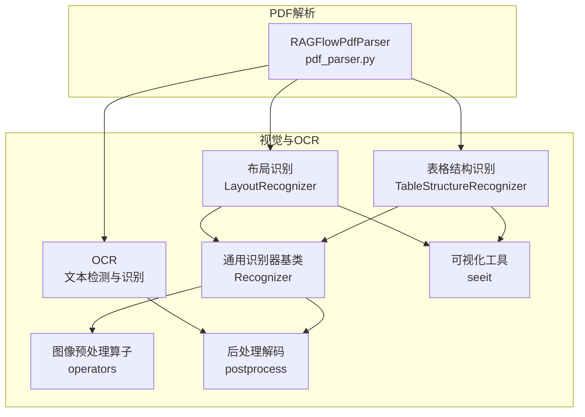
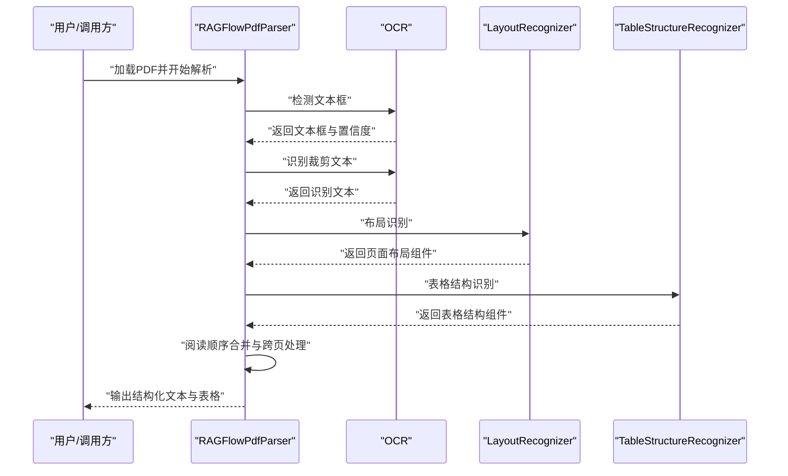
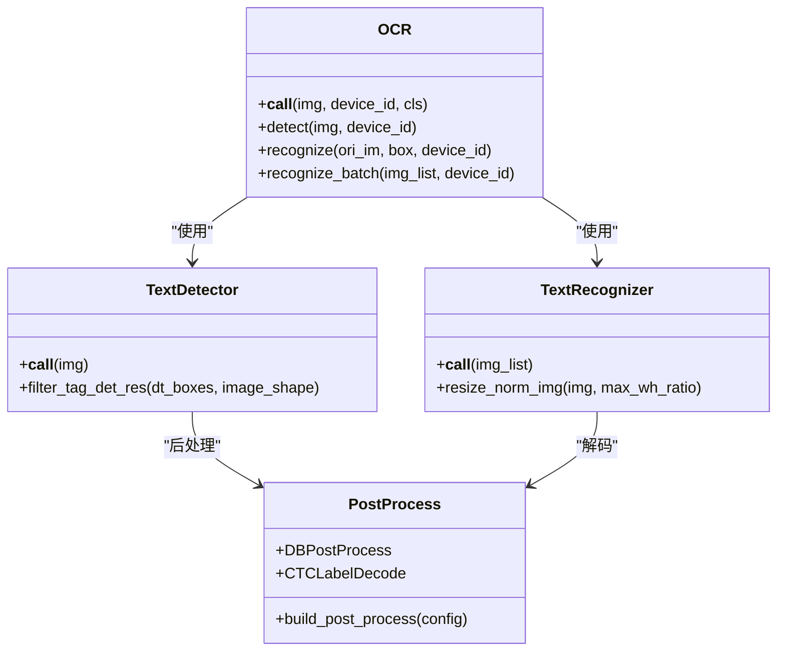
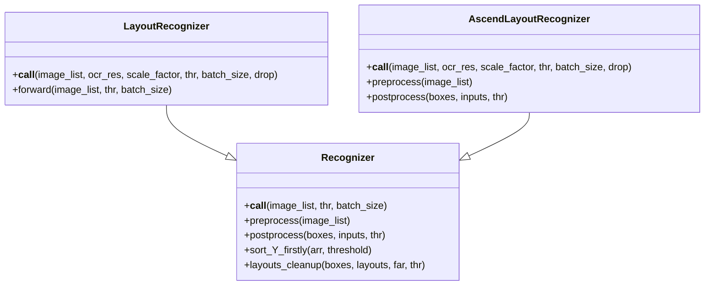
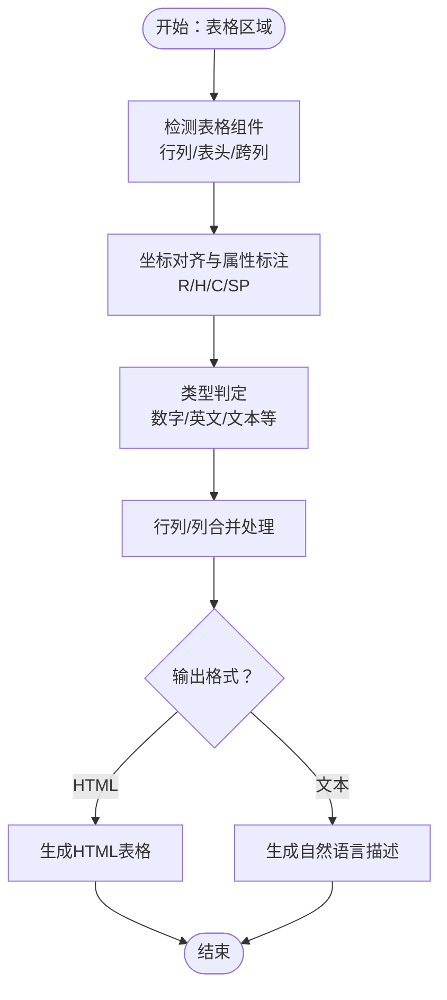
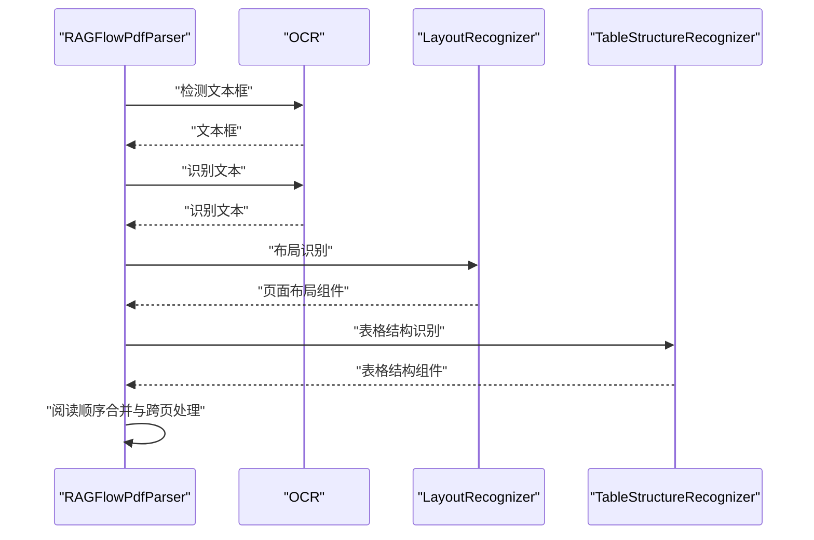
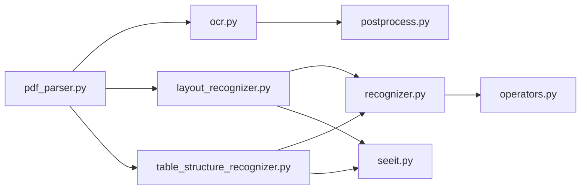

# OCR与视觉识别

<cite>
**本文引用的文件**
- [deepdoc/vision/ocr.py](file://deepdoc/vision/ocr.py)
- [deepdoc/vision/layout_recognizer.py](file://deepdoc/vision/layout_recognizer.py)
- [deepdoc/vision/table_structure_recognizer.py](file://deepdoc/vision/table_structure_recognizer.py)
- [deepdoc/vision/recognizer.py](file://deepdoc/vision/recognizer.py)
- [deepdoc/vision/postprocess.py](file://deepdoc/vision/postprocess.py)
- [deepdoc/vision/operators.py](file://deepdoc/vision/operators.py)
- [deepdoc/vision/t_recognizer.py](file://deepdoc/vision/t_recognizer.py)
- [deepdoc/vision/seeit.py](file://deepdoc/vision/seeit.py)
- [deepdoc/parser/pdf_parser.py](file://deepdoc/parser/pdf_parser.py)
- [common/settings.py](file://common/settings.py)
- [deepdoc/README_zh.md](file://deepdoc/README_zh.md)
</cite>

## 目录
1. [简介](#简介)
2. [项目结构](#项目结构)
3. [核心组件](#核心组件)
4. [架构总览](#架构总览)
5. [详细组件分析](#详细组件分析)
6. [依赖分析](#依赖分析)
7. [性能考虑](#性能考虑)
8. [故障排查指南](#故障排查指南)
9. [结论](#结论)
10. [附录](#附录)

## 简介
本章节面向RAGFlow的OCR与视觉识别能力，系统阐述其在扫描文档文字识别、表格结构识别、布局分析与图像内容理解方面的实现方式与工程实践。文档覆盖算法选择、识别精度优化、多语言支持、复杂图像处理策略，以及视觉理解与文本解析的融合路径，并提供配置参数、性能调优与质量评估方法。

## 项目结构
RAGFlow的视觉与OCR能力主要集中在deepdoc/vision子模块，围绕OCR、布局识别、表格结构识别三大能力构建，配合PDF解析器完成端到端的文档理解流程。关键文件与职责如下：
- OCR模块：负责文本检测与识别，支持ONNXRuntime推理与多GPU并行。
- 布局识别：基于YOLOv10等模型对页面元素进行分类与定位。
- 表格结构识别：对表格区域进行行列、表头、跨列合并等结构化抽取。
- PDF解析器：串联OCR、布局与表格识别，完成阅读顺序合并与跨页处理。
- 工具与后处理：提供图像预处理算子、后处理解码与可视化工具。

**图表来源**
- [deepdoc/vision/ocr.py:542-758](file://deepdoc/vision/ocr.py#L542-L758)
- [deepdoc/vision/layout_recognizer.py:33-175](file://deepdoc/vision/layout_recognizer.py#L33-L175)
- [deepdoc/vision/table_structure_recognizer.py:30-111](file://deepdoc/vision/table_structure_recognizer.py#L30-L111)
- [deepdoc/vision/recognizer.py:31-443](file://deepdoc/vision/recognizer.py#L31-L443)
- [deepdoc/vision/operators.py:28-737](file://deepdoc/vision/operators.py#L28-L737)
- [deepdoc/vision/postprocess.py:25-371](file://deepdoc/vision/postprocess.py#L25-L371)
- [deepdoc/vision/seeit.py:23-88](file://deepdoc/vision/seeit.py#L23-L88)
- [deepdoc/parser/pdf_parser.py:56-110](file://deepdoc/parser/pdf_parser.py#L56-L110)

**章节来源**
- [deepdoc/README_zh.md:48-128](file://deepdoc/README_zh.md#L48-L128)

## 核心组件
- OCR（文本检测与识别）
  - 文本检测器：基于DB风格的检测网络，输出文本框边界。
  - 文本识别器：基于CTC解码的识别网络，支持多语言字典与空格字符。
  - 多设备并行：支持PARALLEL_DEVICES配置，按GPU数量分片推理。
  - 模型加载：ONNXRuntime加载，支持CPU/GPU执行提供者与内存策略。
- 布局识别（Layout Recognition）
  - 支持YOLOv10与Ascend两种实现，统一接口封装。
  - 输出页面级布局组件，含类型、置信度与边界框。
- 表格结构识别（Table Structure Recognition）
  - 对表格区域进行行列、表头、跨列合并等结构化抽取。
  - 提供HTML与自然语言描述两种输出格式。
- PDF解析器（RAGFlowPdfParser）
  - 融合OCR、布局与表格识别，完成阅读顺序合并与跨页处理。
  - 支持表格自动旋转，提升旋转表格的识别与结构化效果。

**章节来源**
- [deepdoc/vision/ocr.py:139-758](file://deepdoc/vision/ocr.py#L139-L758)
- [deepdoc/vision/layout_recognizer.py:33-457](file://deepdoc/vision/layout_recognizer.py#L33-L457)
- [deepdoc/vision/table_structure_recognizer.py:30-613](file://deepdoc/vision/table_structure_recognizer.py#L30-L613)
- [deepdoc/parser/pdf_parser.py:56-110](file://deepdoc/parser/pdf_parser.py#L56-L110)

## 架构总览
RAGFlow的视觉识别采用“检测-识别-理解-融合”的流水线架构：
- 图像输入经OCR检测得到候选文本框；
- 识别器对裁剪图像进行文字识别；
- 布局识别器对整页进行组件分类与定位；
- 表格结构识别器对表格区域进行结构化抽取；
- PDF解析器将上述结果按阅读顺序合并，生成最终可检索的文本块。

**图表来源**
- [deepdoc/parser/pdf_parser.py:413-598](file://deepdoc/parser/pdf_parser.py#L413-L598)
- [deepdoc/vision/ocr.py:714-758](file://deepdoc/vision/ocr.py#L714-L758)
- [deepdoc/vision/layout_recognizer.py:63-157](file://deepdoc/vision/layout_recognizer.py#L63-L157)
- [deepdoc/vision/table_structure_recognizer.py:54-111](file://deepdoc/vision/table_structure_recognizer.py#L54-L111)

## 详细组件分析

### OCR组件分析
- 文本检测（TextDetector）
  - 使用DB风格后处理，支持阈值过滤与NMS后处理。
  - 支持动态输入尺寸适配，保证批处理一致性。
- 文本识别（TextRecognizer）
  - CTCLabelDecode解码，支持空格字符与字典路径配置。
  - 批量推理与排序，提升吞吐。
- OCR入口（OCR）
  - 统一调用检测与识别，支持旋转校正与置信度过滤。
  - 支持多设备并行，按设备ID路由推理。
- 模型加载与运行时
  - ONNXRuntime会话选项与线程数控制，GPU内存限制与Arena收缩策略。
  - 支持环境变量控制推理行为（线程数、显存限制、Arena策略等）。

**图表来源**
- [deepdoc/vision/ocr.py:420-758](file://deepdoc/vision/ocr.py#L420-L758)
- [deepdoc/vision/postprocess.py:25-371](file://deepdoc/vision/postprocess.py#L25-L371)

**章节来源**
- [deepdoc/vision/ocr.py:139-758](file://deepdoc/vision/ocr.py#L139-L758)
- [deepdoc/vision/postprocess.py:25-371](file://deepdoc/vision/postprocess.py#L25-L371)

### 布局识别组件分析
- 识别器基类（Recognizer）
  - 统一预处理、推理与后处理流程，支持批处理与NMS过滤。
  - 提供坐标排序、重叠计算与布局清理等工具函数。
- YOLOv10布局识别（LayoutRecognizer4YOLOv10）
  - 针对YOLOv10输出的后处理，包含缩放因子与NMS逻辑。
- Ascend布局识别（AscendLayoutRecognizer）
  - 基于Ascend OM模型的推理封装，支持pad与scale因子还原。
- 页面布局融合
  - 将OCR文本与布局组件匹配，标注布局类型并过滤垃圾内容。

**图表来源**
- [deepdoc/vision/recognizer.py:31-443](file://deepdoc/vision/recognizer.py#L31-L443)
- [deepdoc/vision/layout_recognizer.py:33-457](file://deepdoc/vision/layout_recognizer.py#L33-L457)

**章节来源**
- [deepdoc/vision/recognizer.py:31-443](file://deepdoc/vision/recognizer.py#L31-L443)
- [deepdoc/vision/layout_recognizer.py:33-457](file://deepdoc/vision/layout_recognizer.py#L33-L457)

### 表格结构识别组件分析
- 表格组件抽取
  - 对表格区域进行行列、表头、跨列合并等组件识别。
  - 基于布局重叠与空间关系进行属性标注（R/H/C/SP）。
- 结构化输出
  - 提供HTML表格与自然语言描述两种输出，支持标题提取与跨页处理。
- Ascend与ONNX双实现
  - 支持通过环境变量切换TSR实现类型。

**图表来源**
- [deepdoc/vision/table_structure_recognizer.py:54-613](file://deepdoc/vision/table_structure_recognizer.py#L54-L613)
- [deepdoc/vision/layout_recognizer.py:517-559](file://deepdoc/vision/layout_recognizer.py#L517-L559)

**章节来源**
- [deepdoc/vision/table_structure_recognizer.py:30-613](file://deepdoc/vision/table_structure_recognizer.py#L30-L613)

### PDF解析器与视觉理解融合
- 流程概览
  - OCR检测与识别 → 布局识别 → 表格结构识别 → 阅读顺序合并 → 跨页处理。
- 表格自动旋转
  - 评估四个旋转角度的OCR置信度，选择最佳角度并重OCR与结构化。
- 阅读顺序与合并
  - 基于上下距离、列ID与布局类型，使用X/Y优先排序与上下拼接模型完成最终文本块合并。

**图表来源**
- [deepdoc/parser/pdf_parser.py:413-598](file://deepdoc/parser/pdf_parser.py#L413-L598)

**章节来源**
- [deepdoc/parser/pdf_parser.py:413-598](file://deepdoc/parser/pdf_parser.py#L413-L598)

## 依赖分析
- 组件耦合
  - OCR与布局识别/表格识别共享统一的预处理与后处理接口（Recognizer基类）。
  - PDF解析器聚合OCR、布局与表格识别，形成端到端流程。
- 外部依赖
  - ONNXRuntime（推理）、OpenCV（图像处理）、Shapely/Pyclipper（几何与NMS）、Pillow（图像I/O）。
- 环境与配置
  - PARALLEL_DEVICES控制多GPU并行；ONNXRuntime线程与GPU内存相关环境变量影响性能与稳定性。

**图表来源**
- [deepdoc/parser/pdf_parser.py:42-90](file://deepdoc/parser/pdf_parser.py#L42-L90)
- [deepdoc/vision/ocr.py:22-34](file://deepdoc/vision/ocr.py#L22-L34)
- [deepdoc/vision/layout_recognizer.py:28-30](file://deepdoc/vision/layout_recognizer.py#L28-L30)
- [deepdoc/vision/table_structure_recognizer.py:24-27](file://deepdoc/vision/table_structure_recognizer.py#L24-L27)
- [deepdoc/vision/recognizer.py:25-29](file://deepdoc/vision/recognizer.py#L25-L29)
- [deepdoc/vision/postprocess.py:17-22](file://deepdoc/vision/postprocess.py#L17-L22)
- [deepdoc/vision/operators.py:17-25](file://deepdoc/vision/operators.py#L17-L25)
- [deepdoc/vision/seeit.py:17-20](file://deepdoc/vision/seeit.py#L17-L20)

**章节来源**
- [common/settings.py:127-379](file://common/settings.py#L127-L379)

## 性能考虑
- 并行与资源
  - PARALLEL_DEVICES决定多GPU并行数量；ONNXRuntime线程数由OCR_INTRA_OP_NUM_THREADS/OCR_INTER_OP_NUM_THREADS控制。
  - GPU显存限制与Arena策略可通过OCR_GPU_MEM_LIMIT_MB与OCR_ARENA_EXTEND_STRATEGY调节。
- 推理优化
  - 批处理大小与输入尺寸适配，减少填充与缩放开销。
  - 后处理阶段的NMS与阈值过滤降低冗余输出。
- 表格自动旋转
  - 在旋转表格场景下，先评估四个角度的OCR置信度，再进行TSR与重OCR，显著提升准确性。

**章节来源**
- [deepdoc/vision/ocr.py:96-136](file://deepdoc/vision/ocr.py#L96-L136)
- [deepdoc/parser/pdf_parser.py:322-411](file://deepdoc/parser/pdf_parser.py#L322-L411)

## 故障排查指南
- 模型下载与路径
  - 若HuggingFace镜像访问受限，可通过HF_ENDPOINT环境变量切换镜像源。
- GPU可用性
  - 当CUDA不可用时回退至CPU执行提供者；若需GPU，请确认torch.cuda可用且设备ID有效。
- 显存不足
  - 适当降低OCR_GPU_MEM_LIMIT_MB或启用OCR_GPUMEM_ARENA_SHRINKAGE以释放显存。
- 布局/表格识别异常
  - 调整阈值（如layout/threshold）与NMS参数；检查输入图像尺寸与归一化是否一致。
- 可视化与调试
  - 使用seeit.draw_box保存带标注的图像，辅助定位问题区域。

**章节来源**
- [deepdoc/vision/ocr.py:544-553](file://deepdoc/vision/ocr.py#L544-L553)
- [deepdoc/vision/seeit.py:23-56](file://deepdoc/vision/seeit.py#L23-L56)

## 结论
RAGFlow的OCR与视觉识别体系以模块化设计为核心，通过OCR检测与识别、布局识别与表格结构识别的协同，结合PDF解析器的端到端流程，实现了对扫描文档的高精度理解。在多语言、复杂图像与旋转表格等挑战场景下，系统提供了可配置的性能调优与质量保障手段，满足生产级应用需求。

## 附录

### OCR配置参数与调优要点
- 环境变量
  - OCR_INTRA_OP_NUM_THREADS：模型内部线程数
  - OCR_INTER_OP_NUM_THREADS：模型间线程数
  - OCR_GPU_MEM_LIMIT_MB：GPU显存上限（MB）
  - OCR_ARENA_EXTEND_STRATEGY：Arena扩展策略
  - OCR_GPUMEM_ARENA_SHRINKAGE：启用GPU内存Arena收缩
- 关键参数
  - drop_score：识别置信度阈值
  - 检测后处理阈值：DBPostProcess的thresh、box_thresh、unclip_ratio等
  - 识别后处理：CTCLabelDecode的字典路径与空格字符支持

**章节来源**
- [deepdoc/vision/ocr.py:587-758](file://deepdoc/vision/ocr.py#L587-L758)
- [deepdoc/vision/postprocess.py:41-259](file://deepdoc/vision/postprocess.py#L41-L259)

### 表格自动旋转与质量评估
- 自动旋转流程
  - 评估四个角度的OCR置信度，选择最佳角度并重OCR与TSR。
- 质量评估
  - 通过对比旋转前后的OCR置信度与表格结构召回率评估效果。
  - 可通过环境变量控制开关：TABLE_AUTO_ROTATE=true/false。

**章节来源**
- [deepdoc/README_zh.md:106-128](file://deepdoc/README_zh.md#L106-L128)
- [deepdoc/parser/pdf_parser.py:322-411](file://deepdoc/parser/pdf_parser.py#L322-L411)