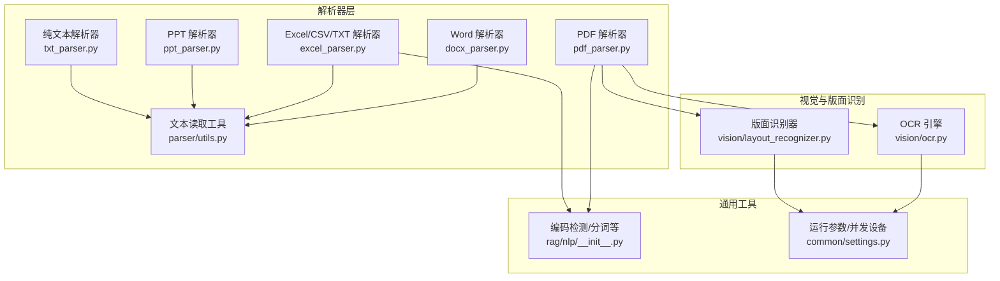
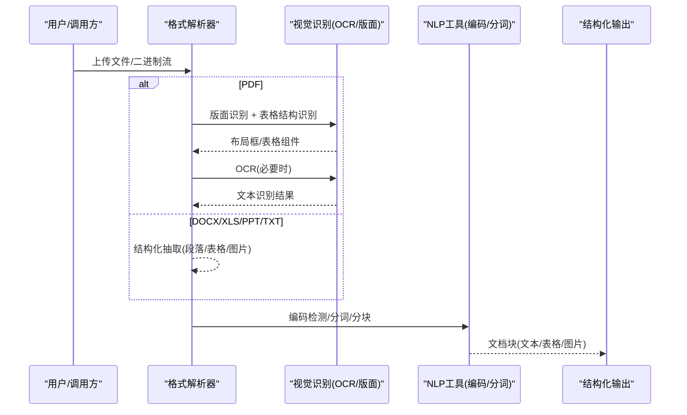
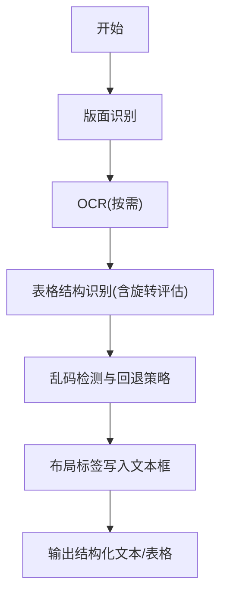
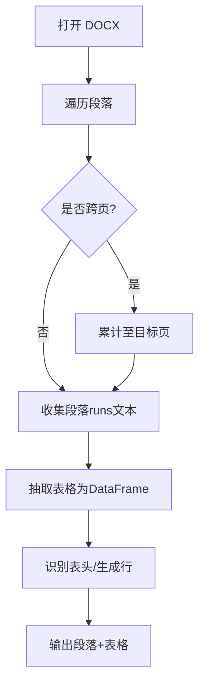
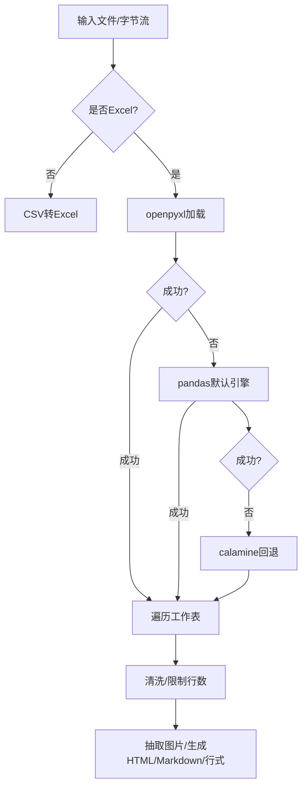
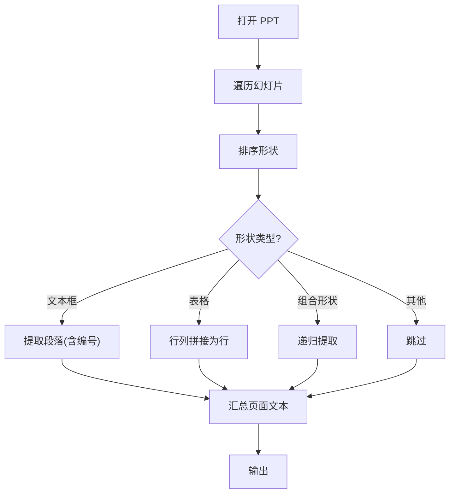
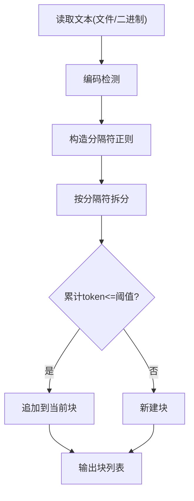
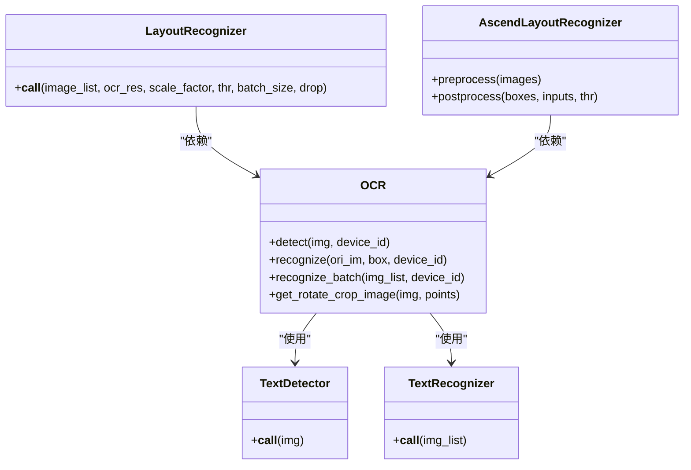
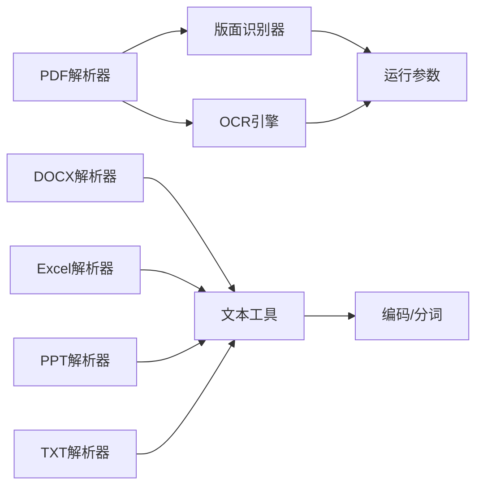

# 多格式文档解析

<cite>
**本文引用的文件**
- [deepdoc/parser/pdf_parser.py](file://deepdoc/parser/pdf_parser.py)
- [deepdoc/parser/docx_parser.py](file://deepdoc/parser/docx_parser.py)
- [deepdoc/parser/excel_parser.py](file://deepdoc/parser/excel_parser.py)
- [deepdoc/parser/ppt_parser.py](file://deepdoc/parser/ppt_parser.py)
- [deepdoc/parser/txt_parser.py](file://deepdoc/parser/txt_parser.py)
- [deepdoc/parser/utils.py](file://deepdoc/parser/utils.py)
- [deepdoc/vision/ocr.py](file://deepdoc/vision/ocr.py)
- [deepdoc/vision/layout_recognizer.py](file://deepdoc/vision/layout_recognizer.py)
- [common/settings.py](file://common/settings.py)
- [rag/nlp/__init__.py](file://rag/nlp/__init__.py)
</cite>

## 目录
1. [简介](#简介)
2. [项目结构](#项目结构)
3. [核心组件](#核心组件)
4. [架构总览](#架构总览)
5. [详细组件分析](#详细组件分析)
6. [依赖分析](#依赖分析)
7. [性能考量](#性能考量)
8. [故障排查指南](#故障排查指南)
9. [结论](#结论)
10. [附录](#附录)

## 简介
本文件系统性阐述 RAGFlow 的多格式文档解析能力，覆盖 PDF、Word（DOCX）、Excel（含 CSV/TXT）、PPT 演示文稿与纯文本等格式。重点说明各类格式的解析策略、关键技术实现（如版面布局识别、OCR、表格结构识别、编码检测与容错）、性能优化方法、格式特定配置项、解析质量评估与常见问题处理，以及跨格式差异处理、编码转换与兼容性保障。

## 项目结构
RAGFlow 将解析器按格式划分在 deepdoc/parser 下，视觉与版面识别位于 deepdoc/vision，通用 NLP 工具与编码检测位于 rag/nlp，全局运行参数与并发设备数由 common/settings 提供。

图示来源
- [deepdoc/parser/pdf_parser.py:56-110](file://deepdoc/parser/pdf_parser.py#L56-L110)
- [deepdoc/parser/docx_parser.py:31-185](file://deepdoc/parser/docx_parser.py#L31-L185)
- [deepdoc/parser/excel_parser.py:29-318](file://deepdoc/parser/excel_parser.py#L29-L318)
- [deepdoc/parser/ppt_parser.py:22-106](file://deepdoc/parser/ppt_parser.py#L22-L106)
- [deepdoc/parser/txt_parser.py:23-68](file://deepdoc/parser/txt_parser.py#L23-L68)
- [deepdoc/parser/utils.py:20-33](file://deepdoc/parser/utils.py#L20-L33)
- [deepdoc/vision/ocr.py:542-758](file://deepdoc/vision/ocr.py#L542-L758)
- [deepdoc/vision/layout_recognizer.py:33-158](file://deepdoc/vision/layout_recognizer.py#L33-L158)
- [common/settings.py:127-379](file://common/settings.py#L127-L379)
- [rag/nlp/__init__.py:54-73](file://rag/nlp/__init__.py#L54-L73)

章节来源
- [deepdoc/parser/pdf_parser.py:56-110](file://deepdoc/parser/pdf_parser.py#L56-L110)
- [deepdoc/parser/docx_parser.py:31-185](file://deepdoc/parser/docx_parser.py#L31-L185)
- [deepdoc/parser/excel_parser.py:29-318](file://deepdoc/parser/excel_parser.py#L29-L318)
- [deepdoc/parser/ppt_parser.py:22-106](file://deepdoc/parser/ppt_parser.py#L22-L106)
- [deepdoc/parser/txt_parser.py:23-68](file://deepdoc/parser/txt_parser.py#L23-L68)
- [deepdoc/parser/utils.py:20-33](file://deepdoc/parser/utils.py#L20-L33)
- [deepdoc/vision/ocr.py:542-758](file://deepdoc/vision/ocr.py#L542-L758)
- [deepdoc/vision/layout_recognizer.py:33-158](file://deepdoc/vision/layout_recognizer.py#L33-L158)
- [common/settings.py:127-379](file://common/settings.py#L127-L379)
- [rag/nlp/__init__.py:54-73](file://rag/nlp/__init__.py#L54-L73)

## 核心组件
- PDF 解析器：结合版面识别、OCR、表格结构识别与文本清洗，处理复杂排版、乱码与字体子集问题，支持旋转校正与多设备并行。
- Word（DOCX）解析器：逐段落提取文本与表格，识别图片，基于样式与页边界进行分块。
- Excel（含 CSV/TXT）解析器：自动识别文件类型，优先使用 openpyxl，失败时回退 pandas 或 calamine；支持图像抽取与行列计数优化。
- PPT 解析器：按形状排序与层级提取文本、列表与表格，兼容多种形状类型。
- 纯文本解析器：基于 UTF 编码检测与自定义分隔符切分，结合 token 计数控制分块大小。
- 视觉识别：OCR 文本检测与识别、版面布局识别（ONNX/Ascend），支持多 GPU 并行。
- 通用工具：编码检测（chardet + 常用编码表）、分词与 token 计数、位置信息处理。

章节来源
- [deepdoc/parser/pdf_parser.py:56-110](file://deepdoc/parser/pdf_parser.py#L56-L110)
- [deepdoc/parser/docx_parser.py:31-185](file://deepdoc/parser/docx_parser.py#L31-L185)
- [deepdoc/parser/excel_parser.py:29-318](file://deepdoc/parser/excel_parser.py#L29-L318)
- [deepdoc/parser/ppt_parser.py:22-106](file://deepdoc/parser/ppt_parser.py#L22-L106)
- [deepdoc/parser/txt_parser.py:23-68](file://deepdoc/parser/txt_parser.py#L23-L68)
- [deepdoc/vision/ocr.py:542-758](file://deepdoc/vision/ocr.py#L542-L758)
- [deepdoc/vision/layout_recognizer.py:33-158](file://deepdoc/vision/layout_recognizer.py#L33-L158)
- [rag/nlp/__init__.py:54-73](file://rag/nlp/__init__.py#L54-L73)

## 架构总览
下图展示从输入到结构化输出的关键流程：格式专用解析器负责抽取文本与表格，PDF 还会触发版面识别与 OCR；随后统一经 NLP 工具进行编码检测、分词与 token 计数，最终形成可嵌入检索的文档块。

图示来源
- [deepdoc/parser/pdf_parser.py:798-800](file://deepdoc/parser/pdf_parser.py#L798-L800)
- [deepdoc/parser/docx_parser.py:161-185](file://deepdoc/parser/docx_parser.py#L161-L185)
- [deepdoc/parser/excel_parser.py:263-292](file://deepdoc/parser/excel_parser.py#L263-L292)
- [deepdoc/parser/ppt_parser.py:87-106](file://deepdoc/parser/ppt_parser.py#L87-L106)
- [deepdoc/parser/txt_parser.py:24-68](file://deepdoc/parser/txt_parser.py#L24-L68)
- [deepdoc/vision/ocr.py:669-758](file://deepdoc/vision/ocr.py#L669-L758)
- [deepdoc/vision/layout_recognizer.py:63-158](file://deepdoc/vision/layout_recognizer.py#L63-L158)
- [rag/nlp/__init__.py:54-73](file://rag/nlp/__init__.py#L54-L73)

## 详细组件分析

### PDF 解析器（复杂度与策略）
- 版面识别与布局标注：通过 LayoutRecognizer 对页面图像进行版面分类（文本、标题、图表、表格、公式等），并将其映射到 OCR 文本框上，剔除页眉页脚等垃圾区域。
- OCR 容错与乱码处理：对 pdfplumber 提取的字符进行“不可打印/私用区/替换字符”检测，以及“字体子集 + ASCII 符号”导致的乱码模式识别，必要时回退到 OCR；同时对 CID 占位符进行识别与清理。
- 表格结构识别与旋转校正：对表格区域进行多角度评估（0°/90°/180°/270°），以 OCR 置信度与区域数量综合评分选择最佳方向；对旋转后的表格重新 OCR 并映射坐标。
- 并发与设备管理：根据环境变量设置并行设备数，初始化多个推理会话，避免 GPU/CPU 资源争用。
- 关键实现要点
  - 版面识别与 OCR 结果融合：将版面标签写入每个文本框，便于后续结构化处理。
  - 表格旋转与坐标变换：记录原始与旋转后坐标，确保表格单元与文本对齐。
  - 乱码检测策略：两类主要乱码场景分别采用不同阈值与规则，提升鲁棒性。
- 性能优化
  - 使用缩放因子与批量处理减少计算开销。
  - 多设备并行与内存回收，降低长文档处理延迟。
  - 仅在必要时启用 OCR，优先使用 pdfplumber 的高置信文本。

图示来源
- [deepdoc/parser/pdf_parser.py:798-800](file://deepdoc/parser/pdf_parser.py#L798-L800)
- [deepdoc/parser/pdf_parser.py:204-255](file://deepdoc/parser/pdf_parser.py#L204-L255)
- [deepdoc/parser/pdf_parser.py:322-411](file://deepdoc/parser/pdf_parser.py#L322-L411)
- [deepdoc/parser/pdf_parser.py:413-560](file://deepdoc/parser/pdf_parser.py#L413-L560)
- [deepdoc/parser/pdf_parser.py:707-797](file://deepdoc/parser/pdf_parser.py#L707-L797)

章节来源
- [deepdoc/parser/pdf_parser.py:56-110](file://deepdoc/parser/pdf_parser.py#L56-L110)
- [deepdoc/parser/pdf_parser.py:181-200](file://deepdoc/parser/pdf_parser.py#L181-L200)
- [deepdoc/parser/pdf_parser.py:204-321](file://deepdoc/parser/pdf_parser.py#L204-L321)
- [deepdoc/parser/pdf_parser.py:322-411](file://deepdoc/parser/pdf_parser.py#L322-L411)
- [deepdoc/parser/pdf_parser.py:413-560](file://deepdoc/parser/pdf_parser.py#L413-L560)
- [deepdoc/parser/pdf_parser.py:707-797](file://deepdoc/parser/pdf_parser.py#L707-L797)
- [deepdoc/parser/pdf_parser.py:798-800](file://deepdoc/parser/pdf_parser.py#L798-L800)

### Word（DOCX）解析器
- 段落与页边界：遍历段落，依据“最后渲染分页符”标记页码，按范围截取目标页。
- 表格结构化：将表格转为 DataFrame 后，基于列首模式与数值分布识别表头，生成带前缀的键值行，合并为行级字符串或整段文本。
- 图片抽取：从段落内 XPath 查找图片，尝试直接读取图像 blob，失败时回退到 related_part.blob，封装为 LazyImage 供后续处理。
- 输出：返回段落文本元组列表与表格行列表。

图示来源
- [deepdoc/parser/docx_parser.py:161-185](file://deepdoc/parser/docx_parser.py#L161-L185)
- [deepdoc/parser/docx_parser.py:72-160](file://deepdoc/parser/docx_parser.py#L72-L160)

章节来源
- [deepdoc/parser/docx_parser.py:31-185](file://deepdoc/parser/docx_parser.py#L31-L185)

### Excel（含 CSV/TXT）解析器
- 文件类型识别：通过文件头判断是否为 ZIP/OLE 容器，非 Excel 时尝试 CSV 转 Excel。
- 加载策略：优先 openpyxl（data_only），失败则 pandas 默认引擎，再失败回退 calamine；同时提供 DataFrame 到 Workbook 的转换。
- 数据清洗：移除非法字符，清理空白列，限制实际行数以提升性能。
- 图像抽取：遍历工作表中的图片对象，记录锚定单元格范围与类型，封装 LazyImage。
- 分块输出：HTML/Markdown/行式三类输出，HTML 支持分块表格输出，Markdown 直接导出。
- 行数统计：对 xls/xlsx/CSV/TXT 统计有效行数，用于任务规划。

图示来源
- [deepdoc/parser/excel_parser.py:30-67](file://deepdoc/parser/excel_parser.py#L30-L67)
- [deepdoc/parser/excel_parser.py:110-154](file://deepdoc/parser/excel_parser.py#L110-L154)
- [deepdoc/parser/excel_parser.py:204-247](file://deepdoc/parser/excel_parser.py#L204-L247)
- [deepdoc/parser/excel_parser.py:249-262](file://deepdoc/parser/excel_parser.py#L249-L262)
- [deepdoc/parser/excel_parser.py:263-314](file://deepdoc/parser/excel_parser.py#L263-L314)

章节来源
- [deepdoc/parser/excel_parser.py:29-318](file://deepdoc/parser/excel_parser.py#L29-L318)

### PPT 解析器
- 形状排序：按 top/left 排序，缓存排序结果，提升重复访问性能。
- 文本提取：优先从文本框提取段落，处理编号/项目符号；表格形状按行列拼接为行级文本；组合形状递归提取。
- 输出：按页聚合文本，返回页面级文本列表。

图示来源
- [deepdoc/parser/ppt_parser.py:87-106](file://deepdoc/parser/ppt_parser.py#L87-L106)
- [deepdoc/parser/ppt_parser.py:27-86](file://deepdoc/parser/ppt_parser.py#L27-L86)

章节来源
- [deepdoc/parser/ppt_parser.py:22-106](file://deepdoc/parser/ppt_parser.py#L22-L106)

### 纯文本解析器
- 编码检测：优先使用 chardet，若置信度不足则遍历常用编码表，失败回退 UTF-8。
- 分块策略：基于自定义分隔符集合（中英文标点、换行、感叹号等）拆分，结合 token 计数控制每块大小，避免越界。

图示来源
- [deepdoc/parser/utils.py:20-33](file://deepdoc/parser/utils.py#L20-L33)
- [deepdoc/parser/txt_parser.py:24-68](file://deepdoc/parser/txt_parser.py#L24-L68)
- [rag/nlp/__init__.py:54-73](file://rag/nlp/__init__.py#L54-L73)

章节来源
- [deepdoc/parser/utils.py:20-33](file://deepdoc/parser/utils.py#L20-L33)
- [deepdoc/parser/txt_parser.py:23-68](file://deepdoc/parser/txt_parser.py#L23-L68)
- [rag/nlp/__init__.py:54-73](file://rag/nlp/__init__.py#L54-L73)

### 视觉识别与版面识别
- OCR 引擎：支持 ONNX 推理，自动选择 CUDA/CPU Provider，多设备并行；提供检测、识别、批量识别接口；支持旋转裁剪与置信度过滤。
- 版面识别：支持 ONNX 与 Ascend OM 模型，将版面类别映射到 OCR 文本框，过滤页眉页脚与参考文献等垃圾布局。
- 配置项
  - OCR_INTRA_OP_NUM_THREADS/OCR_INTER_OP_NUM_THREADS：控制线程数。
  - OCR_GPU_MEM_LIMIT_MB/OCR_ARENA_EXTEND_STRATEGY：GPU 内存上限与分配策略。
  - OCR_GPUMEM_ARENA_SHRINKAGE：启用 VRAM 回收。
  - PARALLEL_DEVICES：并行设备数（来自 settings）。

图示来源
- [deepdoc/vision/ocr.py:542-758](file://deepdoc/vision/ocr.py#L542-L758)
- [deepdoc/vision/layout_recognizer.py:33-158](file://deepdoc/vision/layout_recognizer.py#L33-L158)
- [deepdoc/vision/layout_recognizer.py:240-457](file://deepdoc/vision/layout_recognizer.py#L240-L457)

章节来源
- [deepdoc/vision/ocr.py:542-758](file://deepdoc/vision/ocr.py#L542-L758)
- [deepdoc/vision/layout_recognizer.py:33-158](file://deepdoc/vision/layout_recognizer.py#L33-L158)
- [deepdoc/vision/layout_recognizer.py:240-457](file://deepdoc/vision/layout_recognizer.py#L240-L457)
- [common/settings.py:127-379](file://common/settings.py#L127-L379)

## 依赖分析
- 组件耦合
  - PDF 解析器强依赖版面识别与 OCR；DOCX/Excel/PPT/TXT 相对独立，但均依赖通用 NLP 工具进行编码与分词。
  - 视觉识别模块通过公共接口被 PDF 与版面识别器复用，具备良好的内聚性。
- 外部依赖
  - ONNXRuntime、OpenCV、Pillow、pandas、openpyxl、docx、pptx 等。
- 并发与资源
  - 通过 PARALLEL_DEVICES 控制多设备并行；OCR 提供 GPU/CPU Provider 自动切换与内存回收策略。

图示来源
- [deepdoc/parser/pdf_parser.py:798-800](file://deepdoc/parser/pdf_parser.py#L798-L800)
- [deepdoc/parser/docx_parser.py:161-185](file://deepdoc/parser/docx_parser.py#L161-L185)
- [deepdoc/parser/excel_parser.py:263-292](file://deepdoc/parser/excel_parser.py#L263-L292)
- [deepdoc/parser/ppt_parser.py:87-106](file://deepdoc/parser/ppt_parser.py#L87-L106)
- [deepdoc/parser/txt_parser.py:24-68](file://deepdoc/parser/txt_parser.py#L24-L68)
- [deepdoc/vision/ocr.py:542-758](file://deepdoc/vision/ocr.py#L542-L758)
- [deepdoc/vision/layout_recognizer.py:33-158](file://deepdoc/vision/layout_recognizer.py#L33-L158)
- [rag/nlp/__init__.py:54-73](file://rag/nlp/__init__.py#L54-L73)
- [common/settings.py:127-379](file://common/settings.py#L127-L379)

章节来源
- [common/settings.py:127-379](file://common/settings.py#L127-L379)
- [rag/nlp/__init__.py:54-73](file://rag/nlp/__init__.py#L54-L73)

## 性能考量
- 并行与设备
  - 设置 PARALLEL_DEVICES 以启用多 GPU/CPU 并行推理，显著缩短长文档处理时间。
  - OCR 线程参数（OCR_INTRA_OP_NUM_THREADS/OCR_INTER_OP_NUM_THREADS）与 GPU 内存上限（OCR_GPU_MEM_LIMIT_MB）影响吞吐与稳定性。
- 批量与缩放
  - 版面识别与 OCR 支持批量处理与缩放因子，减少冗余计算。
- 数据预处理
  - Excel 限制实际行数、清理非法字符；PDF 仅在必要时触发 OCR；PPT 对形状排序结果进行缓存。
- 内存回收
  - OCR 在推理后主动释放资源，避免长时间运行内存泄漏。

章节来源
- [common/settings.py:127-379](file://common/settings.py#L127-L379)
- [deepdoc/vision/ocr.py:96-136](file://deepdoc/vision/ocr.py#L96-L136)
- [deepdoc/parser/excel_parser.py:155-196](file://deepdoc/parser/excel_parser.py#L155-L196)
- [deepdoc/parser/pdf_parser.py:798-800](file://deepdoc/parser/pdf_parser.py#L798-L800)

## 故障排查指南
- PDF 乱码/乱码比例过高
  - 现象：文本框中出现私用区字符、替换字符或 CID 占位符。
  - 处理：检查乱码检测逻辑是否触发回退；确认字体子集与 ASCII 符号比例阈值；必要时手动提高 OCR 置信度阈值。
- 表格识别方向错误
  - 现象：表格被旋转但未正确校正。
  - 处理：确认旋转评估函数的阈值与评分策略；检查坐标映射与重 OCR 流程。
- Excel 打不开/读取异常
  - 现象：openpyxl 报错，pandas 默认引擎失败。
  - 处理：启用 calamine 回退；检查文件头与编码；对 CSV/TXT 进行编码检测与清洗。
- PPT 文本缺失
  - 现象：某些形状未被识别。
  - 处理：确认形状类型分支与递归提取逻辑；检查排序缓存是否命中。
- 纯文本分块过大
  - 现象：token 数超过阈值。
  - 处理：调整分隔符集合与阈值；确保编码检测正确。

章节来源
- [deepdoc/parser/pdf_parser.py:204-321](file://deepdoc/parser/pdf_parser.py#L204-L321)
- [deepdoc/parser/pdf_parser.py:322-411](file://deepdoc/parser/pdf_parser.py#L322-L411)
- [deepdoc/parser/excel_parser.py:30-67](file://deepdoc/parser/excel_parser.py#L30-L67)
- [deepdoc/parser/ppt_parser.py:27-86](file://deepdoc/parser/ppt_parser.py#L27-L86)
- [deepdoc/parser/txt_parser.py:24-68](file://deepdoc/parser/txt_parser.py#L24-L68)
- [rag/nlp/__init__.py:54-73](file://rag/nlp/__init__.py#L54-L73)

## 结论
RAGFlow 的多格式解析体系以“格式专用 + 视觉增强 + 通用工具”为核心，针对 PDF 的复杂排版与乱码、Word 的结构化表格、Excel 的多引擎容错、PPT 的混合内容与纯文本的高效分块，提供了稳健且可扩展的解析链路。通过版面识别、OCR 与表格结构识别，结合编码检测与 token 控制，实现了高质量、高性能的文档结构化输出。

## 附录
- 格式特定配置项
  - OCR 线程与内存：OCR_INTRA_OP_NUM_THREADS、OCR_INTER_OP_NUM_THREADS、OCR_GPU_MEM_LIMIT_MB、OCR_ARENA_EXTEND_STRATEGY、OCR_GPUMEM_ARENA_SHRINKAGE
  - 并行设备：PARALLEL_DEVICES（来自 settings）
- 解析质量评估建议
  - PDF：对比 OCR 与 pdfplumber 的文本一致性、表格方向正确率、乱码比例。
  - Excel：对比 openpyxl/pandas/calamine 的加载成功率与数据完整性。
  - PPT：统计文本覆盖率与表格行拼接准确率。
  - TXT：验证编码检测与分块 token 数分布。
- 兼容性与编码转换
  - 优先使用 chardet + 常用编码表兜底；对 Excel 非标准格式尝试 CSV 转换；PDF 通过乱码检测与回退策略提升鲁棒性。