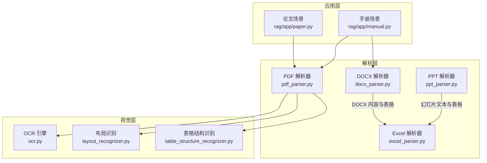
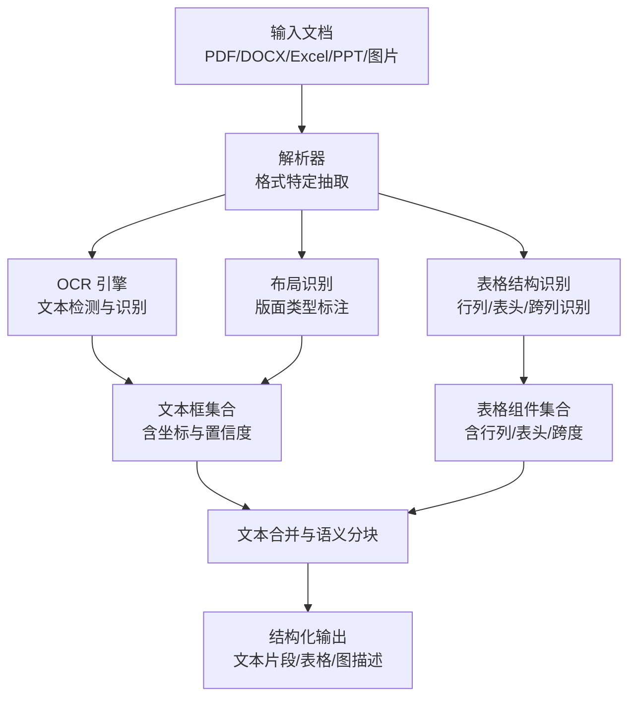
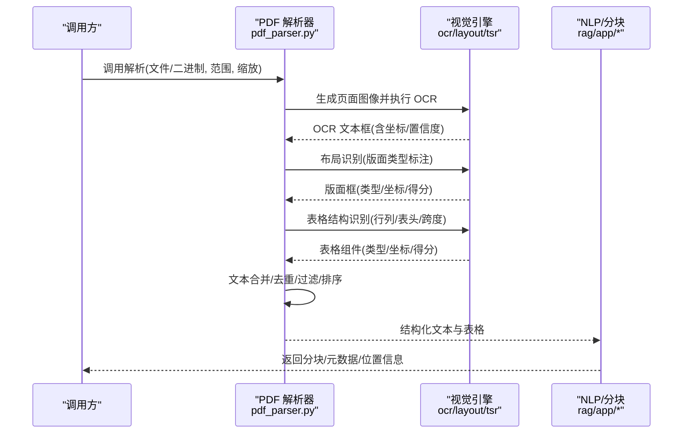
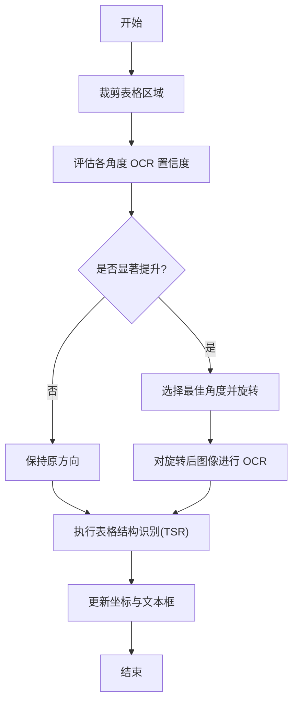
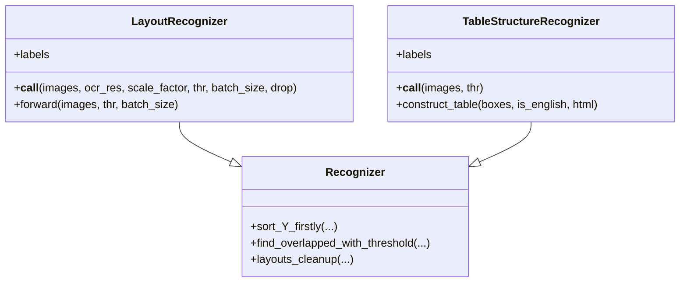
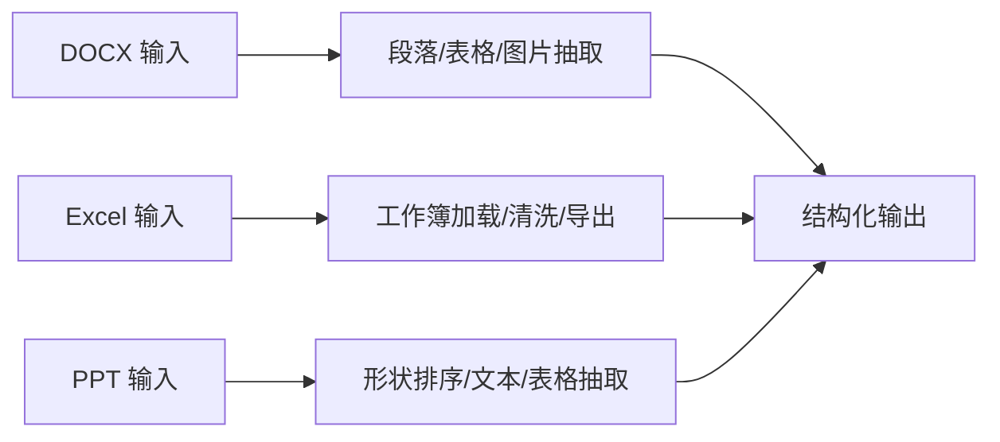
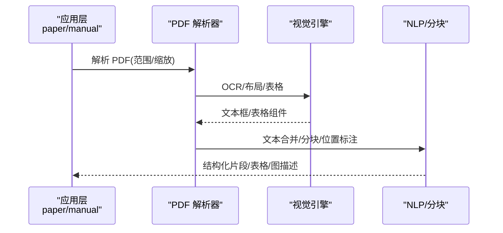
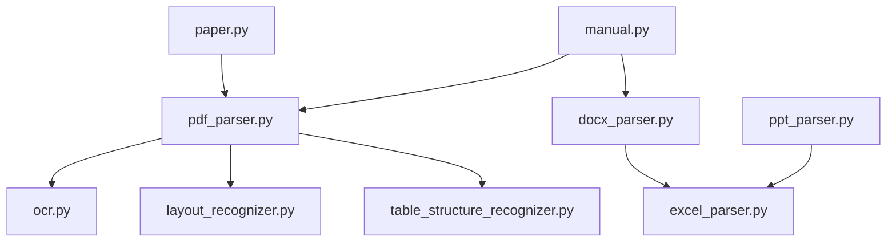

# 深度文档理解

<cite>
**本文引用的文件**
- [deepdoc/parser/__init__.py](file://deepdoc/parser/__init__.py)
- [deepdoc/parser/pdf_parser.py](file://deepdoc/parser/pdf_parser.py)
- [deepdoc/parser/docx_parser.py](file://deepdoc/parser/docx_parser.py)
- [deepdoc/parser/excel_parser.py](file://deepdoc/parser/excel_parser.py)
- [deepdoc/parser/ppt_parser.py](file://deepdoc/parser/ppt_parser.py)
- [deepdoc/vision/__init__.py](file://deepdoc/vision/__init__.py)
- [deepdoc/vision/ocr.py](file://deepdoc/vision/ocr.py)
- [deepdoc/vision/layout_recognizer.py](file://deepdoc/vision/layout_recognizer.py)
- [deepdoc/vision/table_structure_recognizer.py](file://deepdoc/vision/table_structure_recognizer.py)
- [deepdoc/README.md](file://deepdoc/README.md)
- [rag/app/paper.py](file://rag/app/paper.py)
- [rag/app/manual.py](file://rag/app/manual.py)
- [common/parser_config_utils.py](file://common/parser_config_utils.py)
- [web/src/components/paddleocr-options-form-field.tsx](file://web/src/components/paddleocr-options-form-field.tsx)
- [conf/service_conf.yaml](file://conf/service_conf.yaml)
</cite>

## 目录
1. [简介](#简介)
2. [项目结构](#项目结构)
3. [核心组件](#核心组件)
4. [架构总览](#架构总览)
5. [详细组件分析](#详细组件分析)
6. [依赖关系分析](#依赖关系分析)
7. [性能考量](#性能考量)
8. [故障排查指南](#故障排查指南)
9. [结论](#结论)
10. [附录](#附录)

## 简介
本文件系统性阐述 RAGFlow 的“深度文档理解”能力，聚焦于多格式文档的高质量解析与结构化抽取。RAGFlow 将“视觉理解（OCR、版面布局、表格结构）”与“语义理解（分段、标题层级、表格/图描述）”深度融合，覆盖 PDF、Word、Excel、PPT、图片等复杂格式，实现从原始文档到可检索知识的高保真转换。

RAGFlow 的优势在于：
- 面向复杂文档的端到端流水线：OCR + 布局分析 + 表格结构识别 + 文本合并与语义分块
- 多模型融合与可插拔：支持 ONNX、Ascend、MinerU、PaddleOCR 等多种推理后端
- 上下文完整性：通过位置标注、媒体上下文注入、标题层级与段落合并策略，保持信息连贯
- 可配置与可扩展：通过配置项控制布局识别、表格旋转、OCR 线程与显存策略等

## 项目结构
围绕“深度文档理解”，代码主要分布在以下模块：
- deepdoc/parser：多格式解析器入口与实现（PDF、DOCX、Excel、PPT、TXT 等）
- deepdoc/vision：OCR、布局识别、表格结构识别等视觉能力
- rag/app：面向具体场景（论文、手册、问答等）的解析流程封装
- common：通用工具与配置归一化
- web：前端配置表单（如 PaddleOCR 选项）

**图表来源**
- [deepdoc/parser/pdf_parser.py:56-110](file://deepdoc/parser/pdf_parser.py#L56-L110)
- [deepdoc/vision/ocr.py:542-586](file://deepdoc/vision/ocr.py#L542-L586)
- [deepdoc/vision/layout_recognizer.py:33-57](file://deepdoc/vision/layout_recognizer.py#L33-L57)
- [deepdoc/vision/table_structure_recognizer.py:30-53](file://deepdoc/vision/table_structure_recognizer.py#L30-L53)
- [rag/app/paper.py:31-147](file://rag/app/paper.py#L31-L147)
- [rag/app/manual.py:32-134](file://rag/app/manual.py#L32-L134)

**章节来源**
- [deepdoc/parser/__init__.py:17-41](file://deepdoc/parser/__init__.py#L17-L41)
- [deepdoc/vision/__init__.py:22-89](file://deepdoc/vision/__init__.py#L22-L89)
- [deepdoc/README.md:107-147](file://deepdoc/README.md#L107-L147)

## 核心组件
- 多格式解析器
  - PDF：统一的版面布局、OCR、表格结构识别与文本合并流程
  - DOCX：段落、表格、图片抽取与问答式结构化输出
  - Excel：行列清洗、HTML/Markdown 导出、图片锚点提取
  - PPT：形状排序、文本/表格抽取
- 视觉理解
  - OCR：检测 + 识别 + 批量处理 + 设备选择
  - 布局识别：ONNX/Ascend/YOLOv10 多实现，支持垃圾区域过滤
  - 表格结构识别：列/行/表头/跨行跨列单元格识别与 HTML/自然语言重建
- 应用编排
  - 论文场景：标题、作者、摘要抽取 + 分节 + 表格/图描述增强
  - 手册场景：问答式结构 + 图片 + 表格 + 位置标注 + 分块

**章节来源**
- [deepdoc/parser/pdf_parser.py:56-110](file://deepdoc/parser/pdf_parser.py#L56-L110)
- [deepdoc/parser/docx_parser.py:31-185](file://deepdoc/parser/docx_parser.py#L31-L185)
- [deepdoc/parser/excel_parser.py:29-318](file://deepdoc/parser/excel_parser.py#L29-L318)
- [deepdoc/parser/ppt_parser.py:22-106](file://deepdoc/parser/ppt_parser.py#L22-L106)
- [deepdoc/vision/ocr.py:542-758](file://deepdoc/vision/ocr.py#L542-L758)
- [deepdoc/vision/layout_recognizer.py:33-457](file://deepdoc/vision/layout_recognizer.py#L33-L457)
- [deepdoc/vision/table_structure_recognizer.py:30-613](file://deepdoc/vision/table_structure_recognizer.py#L30-L613)
- [rag/app/paper.py:31-260](file://rag/app/paper.py#L31-L260)
- [rag/app/manual.py:32-288](file://rag/app/manual.py#L32-L288)

## 架构总览
RAGFlow 的“深度文档理解”采用“解析器 + 视觉引擎 + 应用编排”的分层设计。解析器负责格式特定的内容抽取，视觉引擎提供 OCR、布局与表格结构识别，应用层根据业务目标进行流程编排与结果整合。

**图表来源**
- [deepdoc/parser/pdf_parser.py:798-800](file://deepdoc/parser/pdf_parser.py#L798-L800)
- [deepdoc/vision/ocr.py:669-758](file://deepdoc/vision/ocr.py#L669-L758)
- [deepdoc/vision/layout_recognizer.py:63-157](file://deepdoc/vision/layout_recognizer.py#L63-L157)
- [deepdoc/vision/table_structure_recognizer.py:54-111](file://deepdoc/vision/table_structure_recognizer.py#L54-L111)

## 详细组件分析

### PDF 深度解析流水线
PDF 是最复杂的格式，RAGFlow 提供完整的端到端流程：页面图像生成 → OCR → 布局识别 → 表格结构识别 → 文本合并与过滤 → 结果输出。

**图表来源**
- [rag/app/paper.py:36-147](file://rag/app/paper.py#L36-L147)
- [rag/app/manual.py:37-134](file://rag/app/manual.py#L37-L134)
- [deepdoc/parser/pdf_parser.py:707-797](file://deepdoc/parser/pdf_parser.py#L707-L797)
- [deepdoc/vision/ocr.py:669-758](file://deepdoc/vision/ocr.py#L669-L758)
- [deepdoc/vision/layout_recognizer.py:63-157](file://deepdoc/vision/layout_recognizer.py#L63-L157)
- [deepdoc/vision/table_structure_recognizer.py:54-111](file://deepdoc/vision/table_structure_recognizer.py#L54-L111)

**章节来源**
- [rag/app/paper.py:31-260](file://rag/app/paper.py#L31-L260)
- [rag/app/manual.py:32-288](file://rag/app/manual.py#L32-L288)
- [deepdoc/parser/pdf_parser.py:56-110](file://deepdoc/parser/pdf_parser.py#L56-L110)

### OCR 引擎与表格自动旋转
- OCR：支持多设备并行，提供检测、识别、批量识别与旋转矫正
- 表格自动旋转：对扫描版表格尝试 0°/90°/180°/270°，以 OCR 置信度选择最佳方向，再进行 TSR 与二次 OCR

**图表来源**
- [deepdoc/parser/pdf_parser.py:322-411](file://deepdoc/parser/pdf_parser.py#L322-L411)
- [deepdoc/parser/pdf_parser.py:413-516](file://deepdoc/parser/pdf_parser.py#L413-L516)
- [deepdoc/parser/pdf_parser.py:560-706](file://deepdoc/parser/pdf_parser.py#L560-L706)

**章节来源**
- [deepdoc/vision/ocr.py:542-758](file://deepdoc/vision/ocr.py#L542-L758)
- [deepdoc/README.md:107-131](file://deepdoc/README.md#L107-L131)

### 布局识别与表格结构识别
- 布局识别：支持 ONNX、Ascend、YOLOv10 三种实现，可过滤页眉页脚参考等垃圾区域
- 表格结构识别：识别列/行/表头/投影行头/跨列单元格，并可输出 HTML 或自然语言描述

**图表来源**
- [deepdoc/vision/layout_recognizer.py:33-157](file://deepdoc/vision/layout_recognizer.py#L33-L157)
- [deepdoc/vision/table_structure_recognizer.py:30-111](file://deepdoc/vision/table_structure_recognizer.py#L30-L111)
- [deepdoc/vision/layout_recognizer.py:163-238](file://deepdoc/vision/layout_recognizer.py#L163-L238)
- [deepdoc/vision/layout_recognizer.py:240-457](file://deepdoc/vision/layout_recognizer.py#L240-L457)

**章节来源**
- [deepdoc/vision/layout_recognizer.py:33-457](file://deepdoc/vision/layout_recognizer.py#L33-L457)
- [deepdoc/vision/table_structure_recognizer.py:30-613](file://deepdoc/vision/table_structure_recognizer.py#L30-L613)

### DOCX/Excel/PPT 抽取
- DOCX：按段落抽取文本与图片，表格转为结构化文本或 HTML
- Excel：多引擎回退（openpyxl/pandas/calamine），清洗非法字符，导出 HTML/Markdown，提取图片锚点
- PPT：按形状排序，抽取文本/表格，处理分页符

**图表来源**
- [deepdoc/parser/docx_parser.py:31-185](file://deepdoc/parser/docx_parser.py#L31-L185)
- [deepdoc/parser/excel_parser.py:29-318](file://deepdoc/parser/excel_parser.py#L29-L318)
- [deepdoc/parser/ppt_parser.py:22-106](file://deepdoc/parser/ppt_parser.py#L22-L106)

**章节来源**
- [deepdoc/parser/docx_parser.py:31-185](file://deepdoc/parser/docx_parser.py#L31-L185)
- [deepdoc/parser/excel_parser.py:29-318](file://deepdoc/parser/excel_parser.py#L29-L318)
- [deepdoc/parser/ppt_parser.py:22-106](file://deepdoc/parser/ppt_parser.py#L22-L106)

### 场景化应用：论文与手册
- 论文场景：抽取标题、作者、摘要，按标题层级合并分段，增强表格/图描述，支持位置标注
- 手册场景：问答式结构（问题/答案），支持图片拼接，表格转 HTML，分块时保留位置信息

**图表来源**
- [rag/app/paper.py:149-260](file://rag/app/paper.py#L149-L260)
- [rag/app/manual.py:136-288](file://rag/app/manual.py#L136-L288)

**章节来源**
- [rag/app/paper.py:31-260](file://rag/app/paper.py#L31-L260)
- [rag/app/manual.py:32-288](file://rag/app/manual.py#L32-L288)

## 依赖关系分析
- 组件耦合
  - PDF 解析器强依赖视觉引擎（OCR/布局/TSR），并通过应用层进行流程编排
  - DOCX/Excel/PPT 解析器相对独立，但可与视觉能力结合用于增强（如表格/图描述）
- 外部依赖
  - ONNXRuntime/CUDA、Ascend 推理、HuggingFace 模型下载
  - 多线程/多 GPU 并行与内存管理（OCR 线程数、GPU 显存限制等）

**图表来源**
- [deepdoc/parser/pdf_parser.py:42-90](file://deepdoc/parser/pdf_parser.py#L42-L90)
- [deepdoc/vision/ocr.py:542-586](file://deepdoc/vision/ocr.py#L542-L586)
- [deepdoc/vision/layout_recognizer.py:33-57](file://deepdoc/vision/layout_recognizer.py#L33-L57)
- [deepdoc/vision/table_structure_recognizer.py:30-53](file://deepdoc/vision/table_structure_recognizer.py#L30-L53)
- [rag/app/paper.py:31-66](file://rag/app/paper.py#L31-L66)
- [rag/app/manual.py:32-66](file://rag/app/manual.py#L32-L66)

**章节来源**
- [deepdoc/parser/pdf_parser.py:42-110](file://deepdoc/parser/pdf_parser.py#L42-L110)
- [deepdoc/vision/ocr.py:542-586](file://deepdoc/vision/ocr.py#L542-L586)
- [deepdoc/vision/layout_recognizer.py:33-57](file://deepdoc/vision/layout_recognizer.py#L33-L57)
- [deepdoc/vision/table_structure_recognizer.py:30-53](file://deepdoc/vision/table_structure_recognizer.py#L30-L53)
- [rag/app/paper.py:31-66](file://rag/app/paper.py#L31-L66)
- [rag/app/manual.py:32-66](file://rag/app/manual.py#L32-L66)

## 性能考量
- OCR 并行与设备选择
  - 支持多设备并行（PARALLEL_DEVICES），每个设备独立加载模型，减少串行瓶颈
  - 环境变量控制线程数与显存上限，避免 GPU 内存溢出
- 表格自动旋转
  - 默认启用，通过多角度 OCR 置信度评分选择最优方向，提高 TSR 准确率
- 布局/TSR 批处理
  - 批大小可调，平衡吞吐与延迟
- 文本合并与过滤
  - 布局过滤、垃圾文本剔除、两栏布局排序优化，减少冗余与噪声

**章节来源**
- [deepdoc/vision/ocr.py:71-136](file://deepdoc/vision/ocr.py#L71-L136)
- [deepdoc/vision/ocr.py:100-133](file://deepdoc/vision/ocr.py#L100-L133)
- [deepdoc/parser/pdf_parser.py:413-411](file://deepdoc/parser/pdf_parser.py#L413-L411)
- [deepdoc/vision/layout_recognizer.py:63-157](file://deepdoc/vision/layout_recognizer.py#L63-L157)

## 故障排查指南
- 模型下载失败
  - 设置镜像环境变量以加速 HuggingFace 下载
- OCR/布局/TSR 推理异常
  - 检查设备可用性与显存限制，适当降低批大小或线程数
- 表格识别不准确
  - 关闭自动旋转或调整阈值；确认表格图像清晰度
- 字体编码/乱码
  - PDF 中存在子集字体或 CID 占位符时，解析器会触发 OCR 回退策略
- 布局误判
  - 调整布局识别阈值，或切换不同布局识别实现（ONNX/Ascend/YOLOv10）

**章节来源**
- [deepdoc/README.md:40-44](file://deepdoc/README.md#L40-L44)
- [deepdoc/parser/pdf_parser.py:205-321](file://deepdoc/parser/pdf_parser.py#L205-L321)
- [deepdoc/vision/layout_recognizer.py:63-157](file://deepdoc/vision/layout_recognizer.py#L63-L157)
- [deepdoc/vision/table_structure_recognizer.py:54-111](file://deepdoc/vision/table_structure_recognizer.py#L54-L111)

## 结论
RAGFlow 的“深度文档理解”通过“格式解析 + 视觉理解 + 语义编排”的协同，实现了对复杂文档的高精度结构化抽取。其在 OCR、布局识别、表格结构识别上的多模型融合与工程化优化，显著提升了准确性与鲁棒性；同时，针对论文与手册等场景的定制化流程，确保了上下文完整性与检索质量。

## 附录

### 配置选项速览
- 布局识别选择与模型名
  - 支持字符串后缀指定模型工厂：例如 “MinerU@模型名”、“PaddleOCR@模型名”
  - 归一化函数将字符串转换为识别器类型与模型名
- OCR/TSR/布局识别运行参数
  - OCR 线程数、GPU 显存上限、Arena 策略、GPU 内存收缩开关
- 前端配置（PaddleOCR 选项）
  - 当布局识别选择 PaddleOCR 时，前端展示相关参数表单项

**章节来源**
- [common/parser_config_utils.py:20-33](file://common/parser_config_utils.py#L20-L33)
- [web/src/components/paddleocr-options-form-field.tsx:9-39](file://web/src/components/paddleocr-options-form-field.tsx#L9-L39)
- [deepdoc/vision/ocr.py:100-133](file://deepdoc/vision/ocr.py#L100-L133)

### 系统服务配置参考
- 数据库、对象存储、搜索引擎、Redis 等基础服务地址与凭据
- 任务执行队列类型（Redis）

**章节来源**
- [conf/service_conf.yaml:1-160](file://conf/service_conf.yaml#L1-L160)