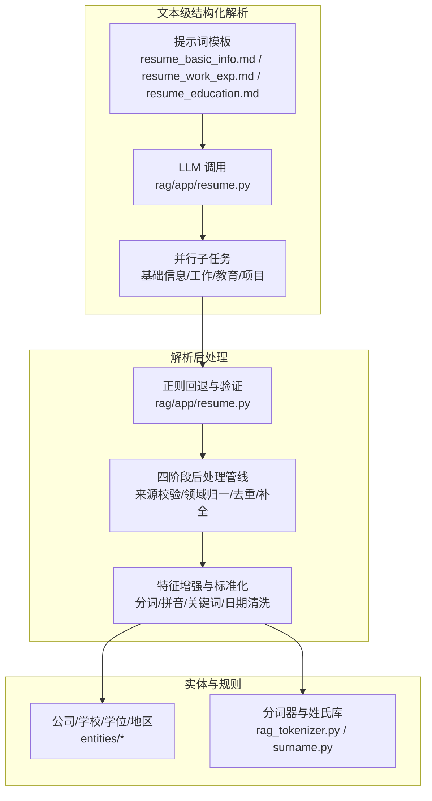
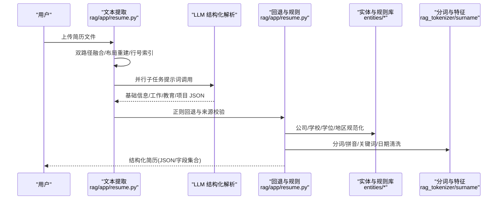
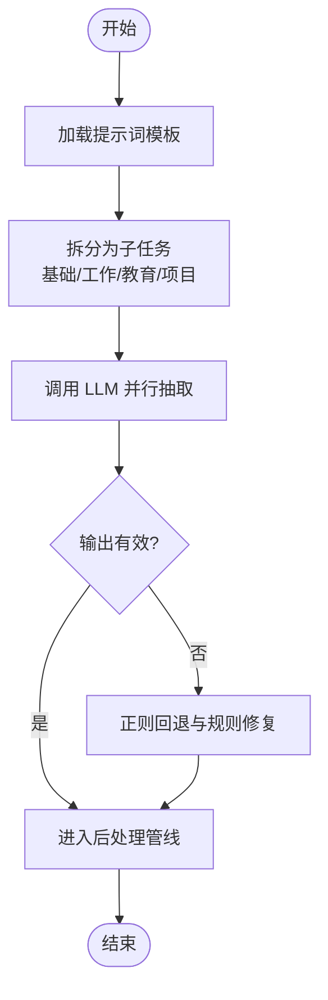
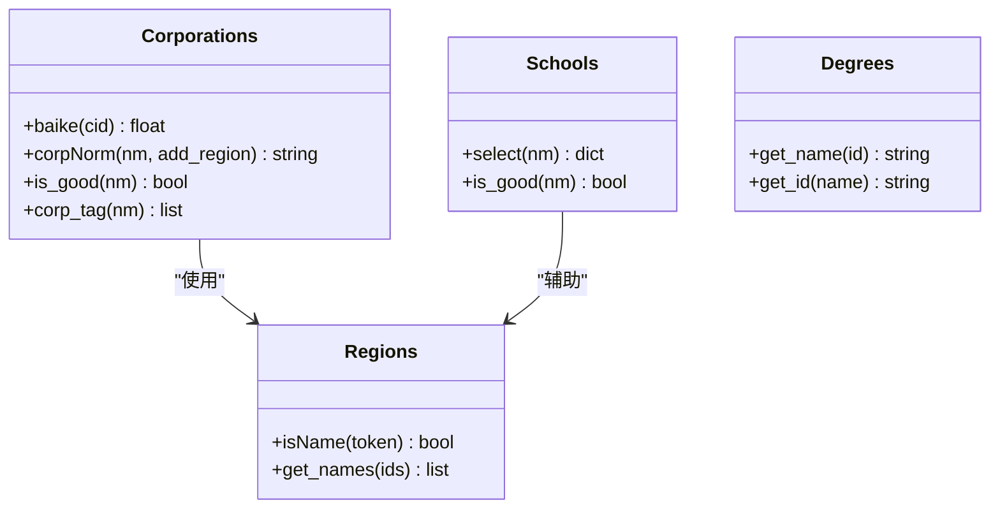
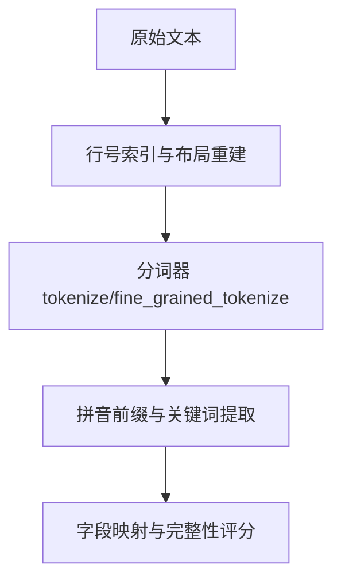
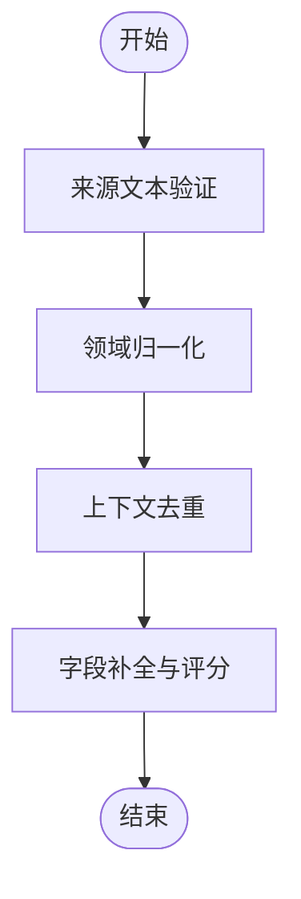
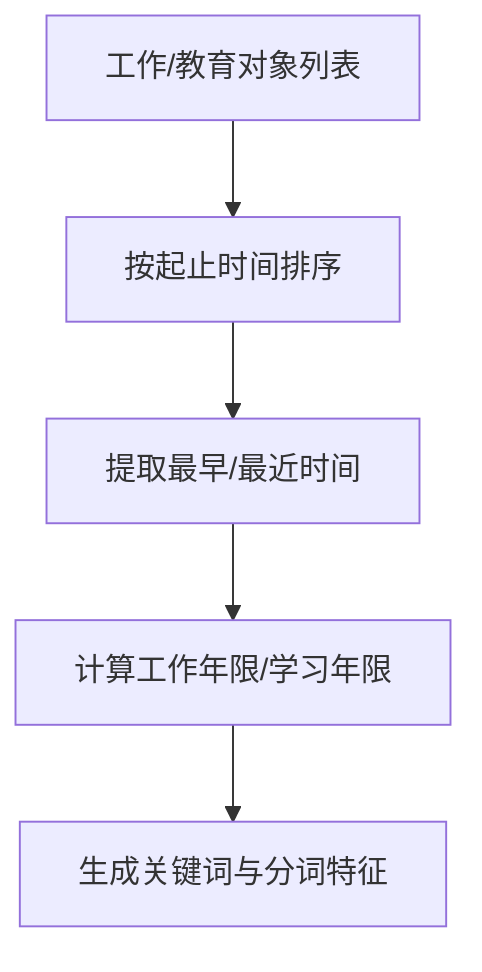
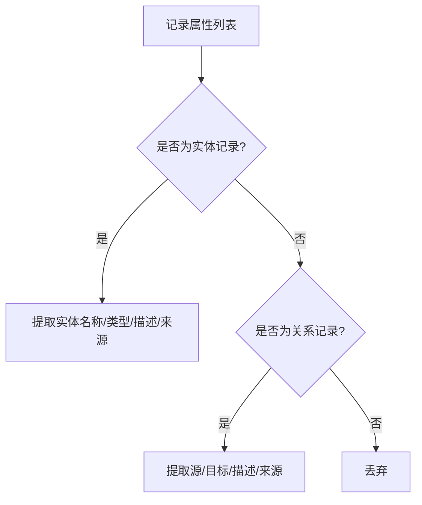
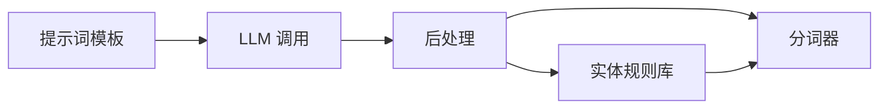

# 语义理解与信息抽取

<cite>
**本文档引用的文件**
- [deepdoc/parser/resume/__init__.py](file://deepdoc/parser/resume/__init__.py)
- [deepdoc/parser/resume/step_one.py](file://deepdoc/parser/resume/step_one.py)
- [deepdoc/parser/resume/step_two.py](file://deepdoc/parser/resume/step_two.py)
- [deepdoc/parser/resume/entities/__init__.py](file://deepdoc/parser/resume/entities/__init__.py)
- [deepdoc/parser/resume/entities/corporations.py](file://deepdoc/parser/resume/entities/corporations.py)
- [deepdoc/parser/resume/entities/degrees.py](file://deepdoc/parser/resume/entities/degrees.py)
- [deepdoc/parser/resume/entities/schools.py](file://deepdoc/parser/resume/entities/schools.py)
- [rag/nlp/rag_tokenizer.py](file://rag/nlp/rag_tokenizer.py)
- [rag/nlp/surname.py](file://rag/nlp/surname.py)
- [rag/app/resume.py](file://rag/app/resume.py)
- [rag/prompts/resume_system.md](file://rag/prompts/resume_system.md)
- [rag/prompts/resume_system_en.md](file://rag/prompts/resume_system_en.md)
- [rag/prompts/resume_basic_info.md](file://rag/prompts/resume_basic_info.md)
- [rag/prompts/resume_work_exp.md](file://rag/prompts/resume_work_exp.md)
- [rag/prompts/resume_education.md](file://rag/prompts/resume_education.md)
- [rag/graphrag/utils.py](file://rag/graphrag/utils.py)
</cite>

## 目录
1. [简介](#简介)
2. [项目结构](#项目结构)
3. [核心组件](#核心组件)
4. [架构总览](#架构总览)
5. [详细组件分析](#详细组件分析)
6. [依赖分析](#依赖分析)
7. [性能考虑](#性能考虑)
8. [故障排查指南](#故障排查指南)
9. [结论](#结论)
10. [附录](#附录)

## 简介
本文件聚焦 RAGFlow 的语义理解与信息抽取能力，尤其是简历解析场景下的高级语义理解、结构化信息抽取与上下文保持机制。文档覆盖以下方面：
- 实体识别：公司、学校、学位、地区等领域的规范化与特征抽取
- 关系建模：基于工作经历、教育背景的时间序列与层级关系
- 属性提取：从非结构化文本中抽取姓名、联系方式、技能标签、语言能力、证书、期望职位与城市等关键属性
- 上下文保持：通过分阶段提示词与多轮结构化解析，确保抽取结果与原文位置映射一致
- 配置选项、精度评估与定制化开发建议：面向不同语言与领域的优化策略

## 项目结构
RAGFlow 的信息抽取由两部分协同实现：
- 文本级结构化解析：基于提示词与大模型的并行子任务抽取（基础信息、工作经历、教育背景、项目经验等）
- 解析后数据处理：对结构化结果进行规范化、去重、补全与特征增强（如关键词、分词、拼音前缀等）

图示来源
- [rag/app/resume.py:2056-2148](file://rag/app/resume.py#L2056-L2148)
- [rag/prompts/resume_basic_info.md:1-39](file://rag/prompts/resume_basic_info.md#L1-L39)
- [rag/prompts/resume_work_exp.md:1-39](file://rag/prompts/resume_work_exp.md#L1-L39)
- [rag/prompts/resume_education.md:1-31](file://rag/prompts/resume_education.md#L1-L31)
- [deepdoc/parser/resume/entities/corporations.py:1-129](file://deepdoc/parser/resume/entities/corporations.py#L1-L129)
- [deepdoc/parser/resume/entities/schools.py:1-92](file://deepdoc/parser/resume/entities/schools.py#L1-L92)
- [deepdoc/parser/resume/entities/degrees.py:1-45](file://deepdoc/parser/resume/entities/degrees.py#L1-L45)
- [rag/nlp/rag_tokenizer.py:1-58](file://rag/nlp/rag_tokenizer.py#L1-L58)
- [rag/nlp/surname.py:1-145](file://rag/nlp/surname.py#L1-L145)

章节来源
- [rag/app/resume.py:2056-2148](file://rag/app/resume.py#L2056-L2148)
- [rag/prompts/resume_basic_info.md:1-39](file://rag/prompts/resume_basic_info.md#L1-L39)
- [rag/prompts/resume_work_exp.md:1-39](file://rag/prompts/resume_work_exp.md#L1-L39)
- [rag/prompts/resume_education.md:1-31](file://rag/prompts/resume_education.md#L1-L31)

## 核心组件
- 提示词与结构化解析
  - 基础信息抽取：姓名、性别、年龄、电话、邮箱、出生日期、工作年限、现居地、期望城市、期望职位、技能、语言、证书、自我评价
  - 工作经历抽取：公司、职位、是否实习、起止时间、描述行号范围
  - 教育背景抽取：学校、专业、学位、院系、起止时间、描述行号范围
- 实体与规则库
  - 公司：规范化、标签、百科长度、好公司判定
  - 学校：别名匹配、排名、好学校判定
  - 学位：ID/名称映射
  - 地区：名称识别与规范化
  - 分词器与姓氏库：中文分词、细粒度分词、拼音前缀、数字/字母/中文判断
- 后处理管线
  - 正则回退与来源校验
  - 领域归一（日期、公司类型、政治面貌等）
  - 上下文去重（同一公司/学校多次出现）
  - 字段补全（缺失值填充、完整性评分）

章节来源
- [rag/prompts/resume_basic_info.md:1-39](file://rag/prompts/resume_basic_info.md#L1-L39)
- [rag/prompts/resume_work_exp.md:1-39](file://rag/prompts/resume_work_exp.md#L1-L39)
- [rag/prompts/resume_education.md:1-31](file://rag/prompts/resume_education.md#L1-L31)
- [deepdoc/parser/resume/entities/corporations.py:1-129](file://deepdoc/parser/resume/entities/corporations.py#L1-L129)
- [deepdoc/parser/resume/entities/schools.py:1-92](file://deepdoc/parser/resume/entities/schools.py#L1-L92)
- [deepdoc/parser/resume/entities/degrees.py:1-45](file://deepdoc/parser/resume/entities/degrees.py#L1-L45)
- [rag/nlp/rag_tokenizer.py:1-58](file://rag/nlp/rag_tokenizer.py#L1-L58)
- [rag/nlp/surname.py:1-145](file://rag/nlp/surname.py#L1-L145)
- [rag/app/resume.py:1791-2051](file://rag/app/resume.py#L1791-L2051)

## 架构总览
RAGFlow 的简历解析采用“提示词驱动 + 规则增强”的混合架构：
- 提示词模板定义结构化输出约束，保证字段一致性
- 大模型并行执行多个子任务，提升吞吐
- 回退策略：当 LLM 输出异常时，使用正则与领域规则进行修复
- 后处理管线：统一来源校验、领域归一、去重与补全，形成高质量结构化简历

图示来源
- [rag/app/resume.py:2056-2148](file://rag/app/resume.py#L2056-L2148)
- [rag/prompts/resume_basic_info.md:1-39](file://rag/prompts/resume_basic_info.md#L1-L39)
- [rag/prompts/resume_work_exp.md:1-39](file://rag/prompts/resume_work_exp.md#L1-L39)
- [rag/prompts/resume_education.md:1-31](file://rag/prompts/resume_education.md#L1-L31)
- [deepdoc/parser/resume/entities/corporations.py:1-129](file://deepdoc/parser/resume/entities/corporations.py#L1-L129)
- [deepdoc/parser/resume/entities/schools.py:1-92](file://deepdoc/parser/resume/entities/schools.py#L1-L92)
- [rag/nlp/rag_tokenizer.py:1-58](file://rag/nlp/rag_tokenizer.py#L1-L58)
- [rag/nlp/surname.py:1-145](file://rag/nlp/surname.py#L1-L145)

## 详细组件分析

### 组件A：提示词与结构化解析
- 设计要点
  - 使用带行号索引的文本，确保描述段落可溯源
  - 明确字段清单与示例，降低歧义
  - 对中文/英文简历分别给出优先策略（中文优先取中文，英文优先取英文）
- 关键流程
  - 基础信息：前 8000 字符足够定位关键字段
  - 工作/教育：使用全文避免截断导致的遗漏
  - 项目经验：结合索引指针定位描述范围
- 输出形态
  - JSON 字典，字段按模板严格定义，便于后续特征增强与检索

图示来源
- [rag/prompts/resume_system.md:1-3](file://rag/prompts/resume_system.md#L1-L3)
- [rag/prompts/resume_system_en.md:1-3](file://rag/prompts/resume_system_en.md#L1-L3)
- [rag/app/resume.py:1268-1294](file://rag/app/resume.py#L1268-L1294)

章节来源
- [rag/prompts/resume_basic_info.md:1-39](file://rag/prompts/resume_basic_info.md#L1-L39)
- [rag/prompts/resume_work_exp.md:1-39](file://rag/prompts/resume_work_exp.md#L1-L39)
- [rag/prompts/resume_education.md:1-31](file://rag/prompts/resume_education.md#L1-L31)
- [rag/app/resume.py:1268-1294](file://rag/app/resume.py#L1268-L1294)

### 组件B：实体识别与规范化
- 公司实体
  - 规范化：去除噪声、公司后缀、地区标注，保留核心名称
  - 标签：根据字典映射生成公司标签（如“好公司”“综合/行业类”等）
  - 百科长度：用于打分与排序
- 学校实体
  - 别名匹配：支持中英名称与别名表
  - 排名：结合外部排名表生成等级关键词
  - 好学校：基于名单与关键词判定
- 学位实体
  - ID/名称双向映射，支持多种输入形态
- 地区实体
  - 名称识别与拼接，支持中文地名与常见后缀清理

图示来源
- [deepdoc/parser/resume/entities/corporations.py:1-129](file://deepdoc/parser/resume/entities/corporations.py#L1-L129)
- [deepdoc/parser/resume/entities/schools.py:1-92](file://deepdoc/parser/resume/entities/schools.py#L1-L92)
- [deepdoc/parser/resume/entities/degrees.py:1-45](file://deepdoc/parser/resume/entities/degrees.py#L1-L45)
- [deepdoc/parser/resume/entities/__init__.py:1-15](file://deepdoc/parser/resume/entities/__init__.py#L1-L15)

章节来源
- [deepdoc/parser/resume/entities/corporations.py:1-129](file://deepdoc/parser/resume/entities/corporations.py#L1-L129)
- [deepdoc/parser/resume/entities/schools.py:1-92](file://deepdoc/parser/resume/entities/schools.py#L1-L92)
- [deepdoc/parser/resume/entities/degrees.py:1-45](file://deepdoc/parser/resume/entities/degrees.py#L1-L45)

### 组件C：分词器与上下文保持
- 分词器
  - 支持中文/英文/数字/符号混合文本
  - 细粒度分词用于关键词提取与相似度计算
  - 在特定引擎模式下直接透传原文以减少开销
- 姓氏库
  - 用于姓名清洗与拼音前缀生成
- 上下文保持
  - 行号索引用于描述段落溯源
  - 完整文本归一化用于字段存在性校验

图示来源
- [rag/nlp/rag_tokenizer.py:1-58](file://rag/nlp/rag_tokenizer.py#L1-L58)
- [rag/nlp/surname.py:1-145](file://rag/nlp/surname.py#L1-L145)
- [rag/app/resume.py:2056-2148](file://rag/app/resume.py#L2056-L2148)

章节来源
- [rag/nlp/rag_tokenizer.py:1-58](file://rag/nlp/rag_tokenizer.py#L1-L58)
- [rag/nlp/surname.py:1-145](file://rag/nlp/surname.py#L1-L145)
- [rag/app/resume.py:2056-2148](file://rag/app/resume.py#L2056-L2148)

### 组件D：后处理管线（四阶段）
- 来源文本验证：确保关键字段在原文中可找到
- 领域归一：日期格式、公司类型、政治面貌等标准化
- 上下文去重：合并重复公司/学校条目，保留最新或最佳记录
- 字段补全：填充缺失字段，生成完整性评分

图示来源
- [rag/app/resume.py:1791-2051](file://rag/app/resume.py#L1791-L2051)

章节来源
- [rag/app/resume.py:1791-2051](file://rag/app/resume.py#L1791-L2051)

### 组件E：关系建模与上下文保持
- 时间序列关系：按起止时间排序工作/教育经历，生成最早/最近时间、工作年限等派生特征
- 层级关系：公司-职位、学校-专业、学位-专业等多层级字段组合
- 上下文保持：通过行号范围定位描述段落，便于检索与溯源

图示来源
- [deepdoc/parser/resume/step_two.py:259-399](file://deepdoc/parser/resume/step_two.py#L259-L399)
- [deepdoc/parser/resume/step_two.py:446-678](file://deepdoc/parser/resume/step_two.py#L446-L678)

章节来源
- [deepdoc/parser/resume/step_two.py:259-399](file://deepdoc/parser/resume/step_two.py#L259-L399)
- [deepdoc/parser/resume/step_two.py:446-678](file://deepdoc/parser/resume/step_two.py#L446-L678)

### 组件F：通用关系抽取（GraphRAG 辅助）
- 单实体抽取：从记录中提取实体名称、类型与描述，并绑定来源块键
- 单关系抽取：从记录中提取源/目标实体、关系描述与权重
- 适用于通用文档的关系建模与知识图谱构建

图示来源
- [rag/graphrag/utils.py:235-262](file://rag/graphrag/utils.py#L235-L262)

章节来源
- [rag/graphrag/utils.py:235-262](file://rag/graphrag/utils.py#L235-L262)

## 依赖分析
- 组件耦合
  - 提示词模板与 LLM 调用强耦合，需保证字段清单一致
  - 后处理依赖实体规则库与分词器，规则库变更直接影响规范化效果
- 外部依赖
  - 分词器封装底层引擎，不同引擎模式影响性能与输出
  - 规则库依赖 CSV/JSON 文件，需确保路径与编码正确
- 循环依赖
  - 未发现循环导入；模块职责清晰，接口稳定

图示来源
- [rag/app/resume.py:2056-2148](file://rag/app/resume.py#L2056-L2148)
- [rag/prompts/resume_basic_info.md:1-39](file://rag/prompts/resume_basic_info.md#L1-L39)
- [rag/prompts/resume_work_exp.md:1-39](file://rag/prompts/resume_work_exp.md#L1-L39)
- [rag/prompts/resume_education.md:1-31](file://rag/prompts/resume_education.md#L1-L31)
- [deepdoc/parser/resume/entities/corporations.py:1-129](file://deepdoc/parser/resume/entities/corporations.py#L1-L129)
- [deepdoc/parser/resume/entities/schools.py:1-92](file://deepdoc/parser/resume/entities/schools.py#L1-L92)
- [rag/nlp/rag_tokenizer.py:1-58](file://rag/nlp/rag_tokenizer.py#L1-L58)

章节来源
- [rag/app/resume.py:2056-2148](file://rag/app/resume.py#L2056-L2148)
- [rag/prompts/resume_basic_info.md:1-39](file://rag/prompts/resume_basic_info.md#L1-L39)
- [rag/prompts/resume_work_exp.md:1-39](file://rag/prompts/resume_work_exp.md#L1-L39)
- [rag/prompts/resume_education.md:1-31](file://rag/prompts/resume_education.md#L1-L31)

## 性能考虑
- 引擎模式选择
  - 在特定文档引擎下，分词器可直接透传原文，减少分词开销
- 并行子任务
  - 基础信息与工作/教育/项目经验可并行执行，缩短端到端延迟
- 正则回退
  - 在 LLM 输出异常时快速回退，避免整体失败
- 特征缓存
  - 关键实体（公司/学校/学位）可建立本地缓存，降低重复计算

## 故障排查指南
- LLM 输出为空或格式错误
  - 检查提示词模板字段是否与调用参数一致
  - 启用正则回退逻辑，核对回退规则覆盖率
- 实体识别不准确
  - 校验规则库文件是否存在且编码正确
  - 调整公司/学校名称清洗策略（噪声词、后缀、地区）
- 分词与拼音异常
  - 确认分词器引擎模式与配置
  - 检查文本编码与特殊字符处理
- 上下文溯源丢失
  - 确保文本提取阶段保留行号索引
  - 校验描述段落行号范围是否正确

章节来源
- [rag/app/resume.py:1791-2051](file://rag/app/resume.py#L1791-L2051)
- [rag/nlp/rag_tokenizer.py:1-58](file://rag/nlp/rag_tokenizer.py#L1-L58)
- [deepdoc/parser/resume/entities/corporations.py:1-129](file://deepdoc/parser/resume/entities/corporations.py#L1-L129)
- [deepdoc/parser/resume/entities/schools.py:1-92](file://deepdoc/parser/resume/entities/schools.py#L1-L92)

## 结论
RAGFlow 的信息抽取体系通过“提示词约束 + 多轮结构化解析 + 规则增强 + 后处理管线”的组合，实现了简历解析中的高级语义理解与稳健的结构化抽取。其关键优势在于：
- 明确的字段约束与并行子任务设计，显著提升抽取稳定性与吞吐
- 丰富的实体规则库与分词器，保障实体识别与特征提取质量
- 四阶段后处理确保结果可溯源、可复核、可扩展

## 附录

### 信息抽取配置选项
- 提示词语言
  - 中文/英文双模板，按语言参数切换
- 字段清单
  - 基础信息、工作经历、教育背景、项目经验等字段均可按需启用/禁用
- 引擎模式
  - 分词器在特定引擎模式下可透传原文，减少分词成本

章节来源
- [rag/prompts/resume_system.md:1-3](file://rag/prompts/resume_system.md#L1-L3)
- [rag/prompts/resume_system_en.md:1-3](file://rag/prompts/resume_system_en.md#L1-L3)
- [rag/nlp/rag_tokenizer.py:1-58](file://rag/nlp/rag_tokenizer.py#L1-L58)

### 精度评估与定制化开发
- 评估指标
  - 字段命中率、完整性评分、实体归一化准确率、描述段落溯源命中率
- 定制化建议
  - 针对特定行业（如金融/互联网）扩展公司标签与好公司名单
  - 针对特定高校扩展别名表与排名数据
  - 针对多语言简历，完善正则回退策略与提示词模板

### 领域特定策略
- 公司类型归一：针对外企/国企/民企/事业单位等进行统一映射
- 政治面貌清洗：仅保留“党员/团员/群众”等标准分类
- 日期清洗：统一为“YYYY.MM”或“YYYY”格式，处理“至今”等边界情况

章节来源
- [rag/app/resume.py:1791-2051](file://rag/app/resume.py#L1791-L2051)
- [deepdoc/parser/resume/step_two.py:495-517](file://deepdoc/parser/resume/step_two.py#L495-L517)