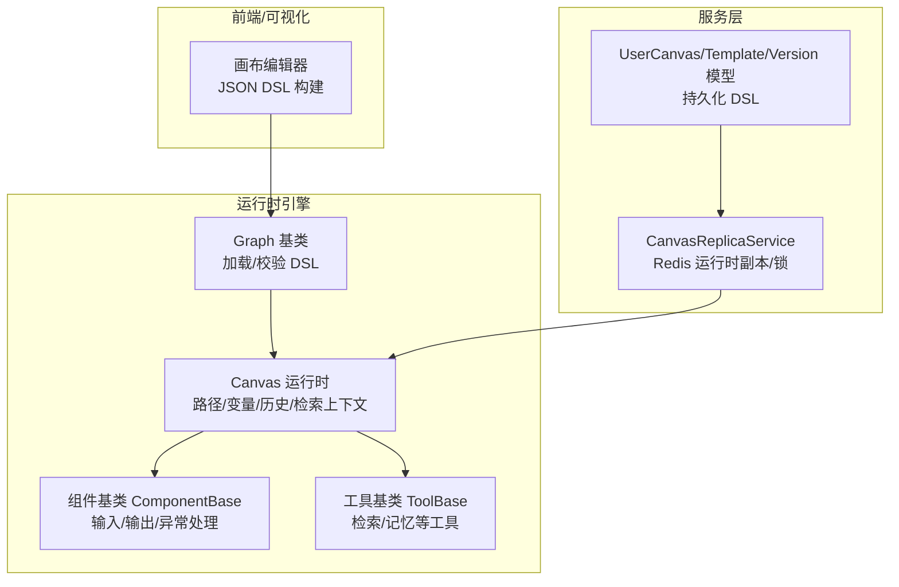
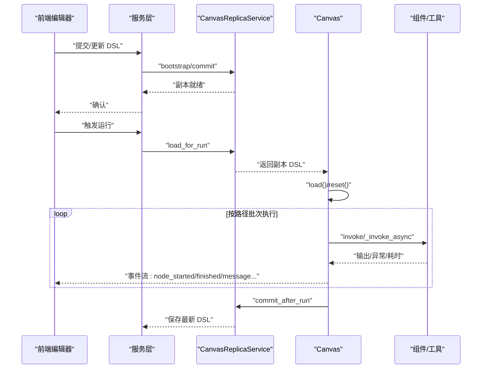
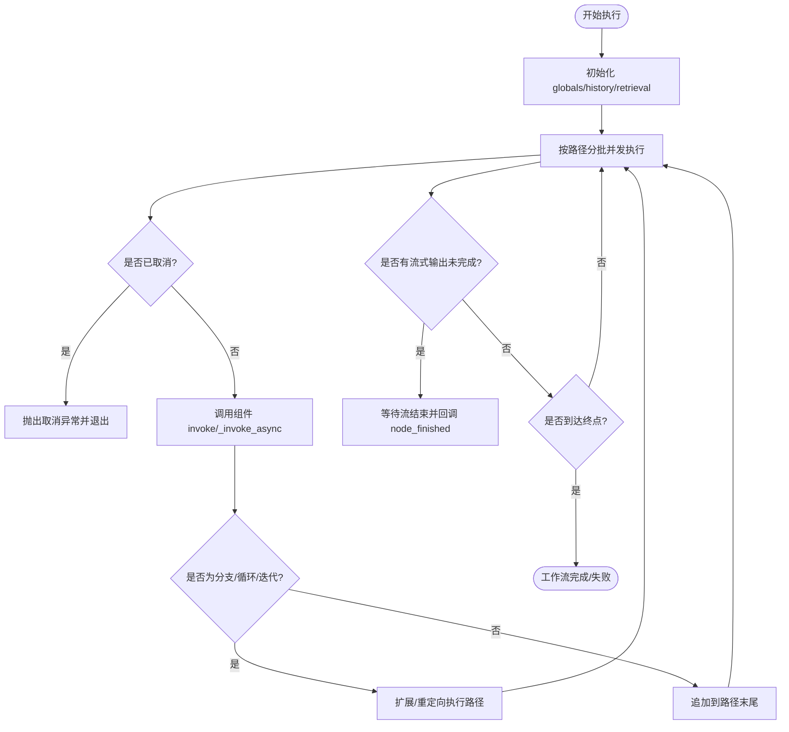
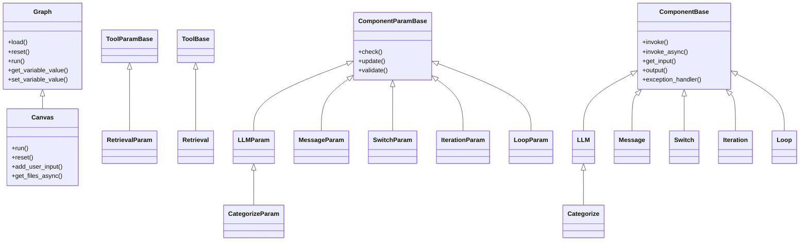

# 工作流编排与执行

<cite>
**本文引用的文件**   
- [canvas.py](file://agent/canvas.py)
- [base.py](file://agent/component/base.py)
- [__init__.py](file://agent/component/__init__.py)
- [canvas_replica_service.py](file://api/apps/services/canvas_replica_service.py)
- [canvas.go](file://internal/model/canvas.go)
- [llm.py](file://agent/component/llm.py)
- [iteration.py](file://agent/component/iteration.py)
- [loop.py](file://agent/component/loop.py)
- [retrieval.py](file://agent/tools/retrieval.py)
- [message.py](file://agent/component/message.py)
- [categorize.py](file://agent/component/categorize.py)
- [switch.py](file://agent/component/switch.py)
</cite>

## 目录
1. [简介](#简介)
2. [项目结构](#项目结构)
3. [核心组件](#核心组件)
4. [架构总览](#架构总览)
5. [详细组件分析](#详细组件分析)
6. [依赖分析](#依赖分析)
7. [性能考量](#性能考量)
8. [故障排查指南](#故障排查指南)
9. [结论](#结论)
10. [附录](#附录)

## 简介
本文件围绕 RAGFlow 的“工作流编排与执行”能力，系统阐述其可视化编辑器、组件连接、执行顺序控制、状态管理、生命周期与并发策略、错误处理与恢复机制，以及面向高效 RAG 处理管道的设计与优化建议。重点覆盖从数据预处理、特征提取、检索排序到答案生成的端到端编排流程，并给出最佳实践与监控方法。

## 项目结构
RAGFlow 的工作流以“画布（Canvas）+ 组件（Component）+ 工具（Tool）”为核心模型，通过 JSON DSL 描述节点、连线、变量与全局状态；运行时由 Canvas 负责解析、调度与状态维护；组件与工具实现具体业务逻辑；服务层负责运行时副本（replica）持久化与分布式锁保障一致性；后端模型定义了画布与模板的数据结构。

图示来源
- [canvas.py:42-165](file://agent/canvas.py#L42-L165)
- [base.py:365-585](file://agent/component/base.py#L365-L585)
- [canvas_replica_service.py:26-259](file://api/apps/services/canvas_replica_service.py#L26-L259)
- [canvas.go:20-69](file://internal/model/canvas.go#L20-L69)

章节来源
- [canvas.py:42-165](file://agent/canvas.py#L42-L165)
- [base.py:365-585](file://agent/component/base.py#L365-L585)
- [canvas_replica_service.py:26-259](file://api/apps/services/canvas_replica_service.py#L26-L259)
- [canvas.go:20-69](file://internal/model/canvas.go#L20-L69)

## 核心组件
- Graph/Canvas：负责加载 DSL、构建组件实例、维护执行路径、变量解析与写回、取消与日志清理、TTS 音频拼接等。
- ComponentBase/ComponentParamBase：统一组件参数校验、输入输出管理、超时与异常处理、父子关系与上下游查询、调试输入注入。
- ToolBase/ToolParamBase：统一工具参数校验、输入元素解析、超时控制、与检索/记忆等外部能力集成。
- CanvasReplicaService：以 Redis 为载体的运行时副本管理，支持读取/替换/提交，配合分布式锁保证并发安全。
- 内部模型：UserCanvas、CanvasTemplate、UserCanvasVersion，承载 DSL 的持久化与版本化。

章节来源
- [canvas.py:83-165](file://agent/canvas.py#L83-L165)
- [base.py:40-200](file://agent/component/base.py#L40-L200)
- [base.py:365-585](file://agent/component/base.py#L365-L585)
- [canvas_replica_service.py:26-259](file://api/apps/services/canvas_replica_service.py#L26-L259)
- [canvas.go:20-69](file://internal/model/canvas.go#L20-L69)

## 架构总览
工作流执行采用事件驱动与异步并发相结合的方式：
- 可视化编辑器导出 JSON DSL，包含组件、上游/下游关系、执行路径、全局变量与检索上下文。
- Canvas 在运行时加载 DSL，实例化各组件，按路径顺序批量并发执行，支持条件分支与循环迭代。
- 组件间通过变量引用（sys/env/组件输出）解耦，Canvas 提供统一的变量解析与写入接口。
- 执行过程中产生节点事件（node_started/node_finished/message/message_end/workflow_*），用于前端实时反馈与审计。
- 运行时副本在 Redis 中保存当前运行态，支持中断后恢复与并发安全。

图示来源
- [canvas_replica_service.py:140-259](file://api/apps/services/canvas_replica_service.py#L140-L259)
- [canvas.py:375-668](file://agent/canvas.py#L375-L668)

章节来源
- [canvas_replica_service.py:140-259](file://api/apps/services/canvas_replica_service.py#L140-L259)
- [canvas.py:375-668](file://agent/canvas.py#L375-L668)

## 详细组件分析

### 1) 可视化编辑器与 DSL 结构
- DSL 包含 components（组件定义与上下游）、path（执行路径）、history（对话历史）、globals（全局变量）、retrieval/memory（检索/记忆上下文）。
- Canvas.load() 将 DSL 解析为组件对象，校验参数并建立组件实例；支持自定义请求头透传。
- 变量系统支持 sys.env.（环境变量）、组件输出（cpn_id@output_key）与表达式求值；Canvas 提供 get/set 变量与路径解析。

章节来源
- [canvas.py:42-165](file://agent/canvas.py#L42-L165)
- [canvas.py:166-279](file://agent/canvas.py#L166-L279)

### 2) 执行引擎与并发控制
- Canvas.run() 作为主执行入口，维护执行路径、历史与检索上下文，按批次并发执行可调度组件。
- 使用线程池与信号量控制并发度，避免阻塞 IO；对同步/异步组件分别调度。
- 支持用户填充（UserFillUp）节点打断，收集额外输入后再继续执行。
- 错误处理：组件异常可设置默认值或跳转分支；Canvas 层记录错误并终止后续执行。

图示来源
- [canvas.py:375-668](file://agent/canvas.py#L375-L668)

章节来源
- [canvas.py:375-668](file://agent/canvas.py#L375-L668)

### 3) 组件基类与参数校验
- ComponentParamBase：统一参数校验（数值范围、布尔、字符串非空等），支持 JSON Schema 式验证与废弃参数提示。
- ComponentBase：封装 invoke/invoke_async、超时装饰器、错误记录、输出管理、父子关系与上下游查询、调试输入注入、异常处理策略（默认值/跳转）。

章节来源
- [base.py:40-200](file://agent/component/base.py#L40-L200)
- [base.py:365-585](file://agent/component/base.py#L365-L585)

### 4) 组件发现与动态导入
- 通过 agent.component.__init__ 动态扫描并注册组件类，支持从多个模块空间查找类名，便于扩展新组件。

章节来源
- [__init__.py:51-59](file://agent/component/__init__.py#L51-L59)

### 5) LLM 组件：提示词构造、流式输出与结构化输出
- LLMParam/LLM：支持系统提示词与多轮消息拼装、图片数据注入、引用切片与引用提示、流式增量输出、结构化 JSON 输出与自动修复。
- 支持在下游为 Message 时进行流式输出，否则一次性输出；异常时可设置默认值或错误标记。

章节来源
- [llm.py:34-120](file://agent/component/llm.py#L34-L120)
- [llm.py:227-446](file://agent/component/llm.py#L227-L446)

### 6) 检索组件：向量化检索、重排、目录增强与跨语言
- RetrievalParam/Retrieval：支持知识库检索、记忆检索、元数据过滤、跨语言扩展、TOC 增强、KG 融合；输出正式化内容与 JSON 切片列表，并写入检索上下文。
- 通过 LLMBundle 与检索引擎对接，支持取消检测与超时控制。

章节来源
- [retrieval.py:37-84](file://agent/tools/retrieval.py#L37-L84)
- [retrieval.py:88-318](file://agent/tools/retrieval.py#L88-L318)

### 7) 消息组件：模板渲染、流式输出与格式转换
- MessageParam/Message：支持随机选择内容模板、Jinja2 渲染、变量注入、流式输出、TTS 音频拼接、内存落盘与格式转换（Markdown/HTML/PDF/DOCX/XLSX）。
- 对异步生成器进行消费与缓存，确保流式稳定性与断点续传。

章节来源
- [message.py:41-110](file://agent/component/message.py#L41-L110)
- [message.py:111-210](file://agent/component/message.py#L111-L210)
- [message.py:253-450](file://agent/component/message.py#L253-L450)

### 8) 分类与切换：条件分支与路由
- Categorize：基于类别描述与示例进行分类，输出类别名与下一跳组件 ID 列表。
- Switch：支持多种比较运算符与逻辑组合，根据上游变量值选择下一跳。

章节来源
- [categorize.py:30-98](file://agent/component/categorize.py#L30-L98)
- [categorize.py:108-166](file://agent/component/categorize.py#L108-L166)
- [switch.py:25-61](file://agent/component/switch.py#L25-L61)
- [switch.py:64-141](file://agent/component/switch.py#L64-L141)

### 9) 迭代与循环：批量处理与终止条件
- Iteration/Loop：提供批量项处理与循环变量初始化，支持最大循环次数与终止条件；与迭代/循环子项组件配合使用。

章节来源
- [iteration.py:27-72](file://agent/component/iteration.py#L27-L72)
- [loop.py:20-80](file://agent/component/loop.py#L20-L80)

### 10) 运行时副本与生命周期管理
- CanvasReplicaService：以 Redis 为载体，提供副本创建/加载/替换/提交与分布式锁，确保并发安全与状态一致性。
- 内部模型：UserCanvas/CanvasTemplate/UserCanvasVersion，支撑 DSL 的持久化与版本化。

章节来源
- [canvas_replica_service.py:26-259](file://api/apps/services/canvas_replica_service.py#L26-L259)
- [canvas.go:20-69](file://internal/model/canvas.go#L20-L69)

## 依赖分析
- 组件与工具均继承自统一基类，遵循一致的参数校验、输入输出、异常处理与超时控制规范。
- Canvas 通过组件类工厂动态加载组件，降低耦合度，便于扩展。
- 运行时副本服务与模型层解耦，便于替换存储介质与扩展版本策略。

图示来源
- [canvas.py:42-165](file://agent/canvas.py#L42-L165)
- [base.py:40-200](file://agent/component/base.py#L40-L200)
- [base.py:365-585](file://agent/component/base.py#L365-L585)
- [llm.py:34-120](file://agent/component/llm.py#L34-L120)
- [retrieval.py:37-84](file://agent/tools/retrieval.py#L37-L84)
- [message.py:41-110](file://agent/component/message.py#L41-L110)
- [categorize.py:30-98](file://agent/component/categorize.py#L30-L98)
- [switch.py:25-61](file://agent/component/switch.py#L25-L61)
- [iteration.py:27-72](file://agent/component/iteration.py#L27-L72)
- [loop.py:20-80](file://agent/component/loop.py#L20-L80)

章节来源
- [canvas.py:42-165](file://agent/canvas.py#L42-L165)
- [base.py:40-200](file://agent/component/base.py#L40-L200)
- [base.py:365-585](file://agent/component/base.py#L365-L585)

## 性能考量
- 并发与限流
  - Canvas 使用线程池与信号量限制并发，避免 CPU/IO 抖动；组件内部也通过超时装饰器防止阻塞。
  - 可通过环境变量调整最大并发与组件执行超时，平衡吞吐与稳定性。
- 流式输出
  - LLM 与 Message 支持流式增量输出，前端可边收边展示，提升感知速度；注意缓冲区大小与音频拼接开销。
- 检索与重排
  - 合理设置 top_n/top_k、相似度阈值与关键词权重，减少无关切片进入后续处理链路。
  - 使用目录增强与跨语言扩展时，评估额外推理成本。
- 存储与序列化
  - 运行时副本采用 Redis 序列化存储，注意键值大小与 TTL 设置；必要时拆分大字段或压缩。
- 缓存与复用
  - 对重复检索结果与模型配置进行缓存，减少重复计算；对图片/附件进行去重与压缩。

## 故障排查指南
- 取消与恢复
  - Canvas 提供任务取消标志位与 Redis 标记，组件在关键阶段检查取消状态并抛出异常；取消后会清理日志与取消标记。
- 错误处理策略
  - 组件异常可通过“默认值/跳转”策略缓解；若无策略则记录错误并终止后续执行。
- 日志与事件
  - Canvas 产出节点级事件与工作流事件，前端可据此定位卡顿与异常节点；同时支持工具调用追踪记录。
- 变量引用问题
  - 若上游未就绪，Canvas 会将下游节点移出本次执行批次，待上游完成后继续；检查变量表达式与上游组件输出键名。
- 模板渲染与格式转换
  - Message 的 Jinja2 渲染失败不会阻断流程，但可能导致输出为空；关注格式转换依赖（如 pypandoc）安装与权限。

章节来源
- [canvas.py:271-281](file://agent/canvas.py#L271-L281)
- [base.py:407-447](file://agent/component/base.py#L407-L447)
- [message.py:181-210](file://agent/component/message.py#L181-L210)

## 结论
RAGFlow 的工作流编排以“DSL + 运行时副本 + 组件化执行”为核心，具备良好的扩展性与可观测性。通过统一的参数校验、异常处理与并发控制，能够在复杂 RAG 管道中稳定地组织数据预处理、特征提取、检索排序与答案生成。结合流式输出、分布式锁与事件流，可满足生产级的交互体验与可靠性要求。

## 附录
- 最佳实践
  - 明确组件职责边界，尽量将业务规则抽象为参数与模板，减少硬编码。
  - 使用 Switch/Categorize 实现条件路由，避免长链路中的分支混乱。
  - 对高延迟组件（LLM/检索）启用流式输出与超时控制，提升用户体验。
  - 通过 CanvasReplicaService 保障并发安全与状态一致性，避免竞态。
- 监控建议
  - 关注节点耗时、错误率与取消率；利用事件流与工具调用追踪定位瓶颈。
  - 对检索命中率、重排效果与最终答案质量建立指标闭环。
- 版本与回滚
  - 利用 UserCanvasVersion 记录关键变更；出现问题时快速回滚至上一个稳定版本。