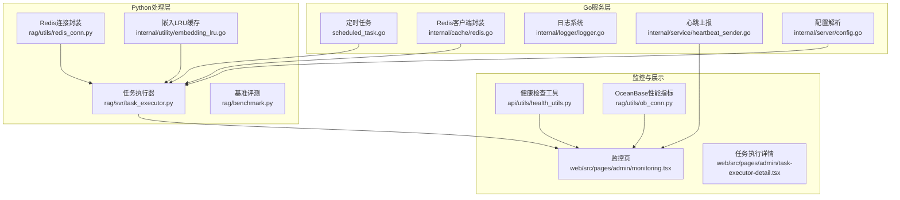
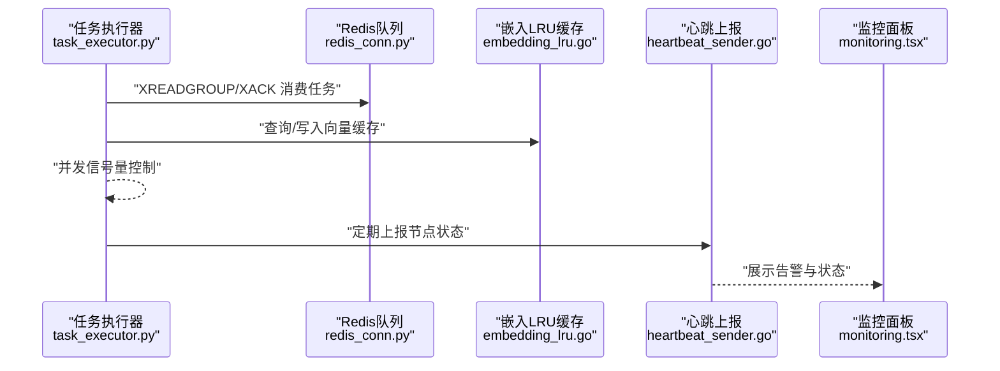
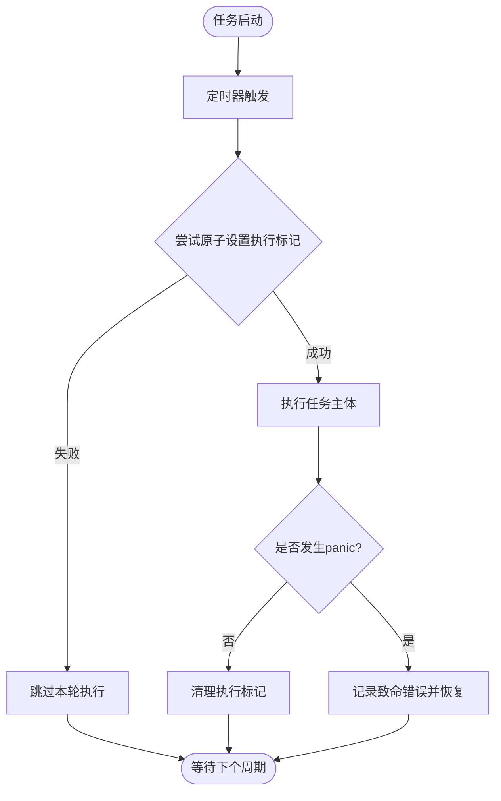
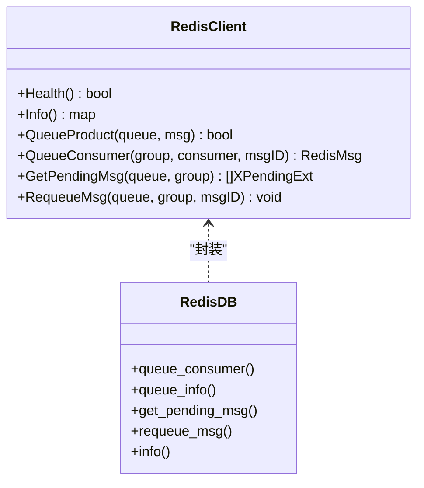
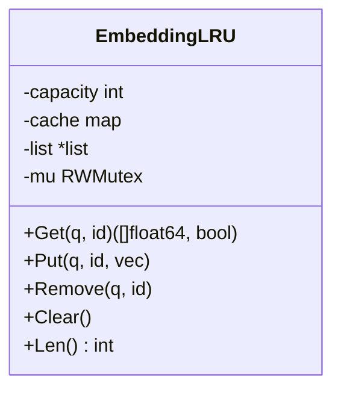
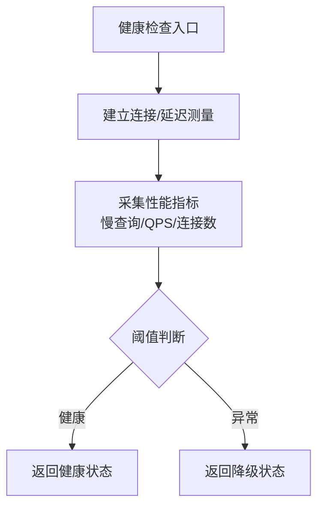
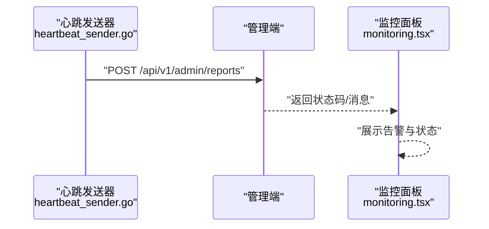
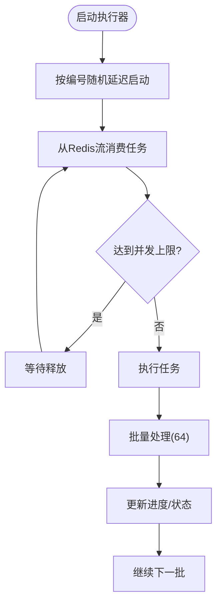
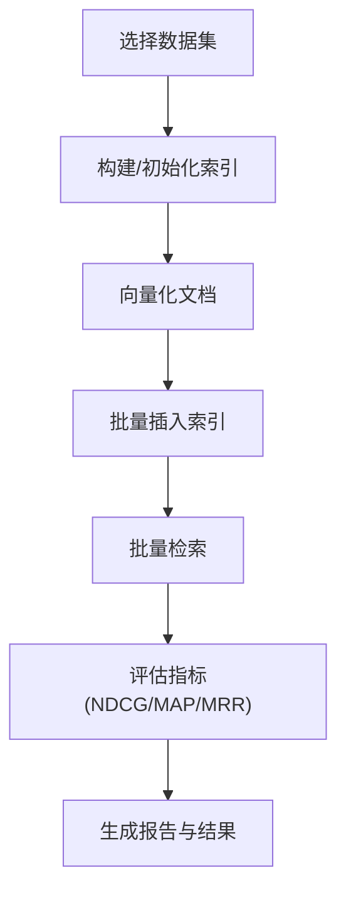
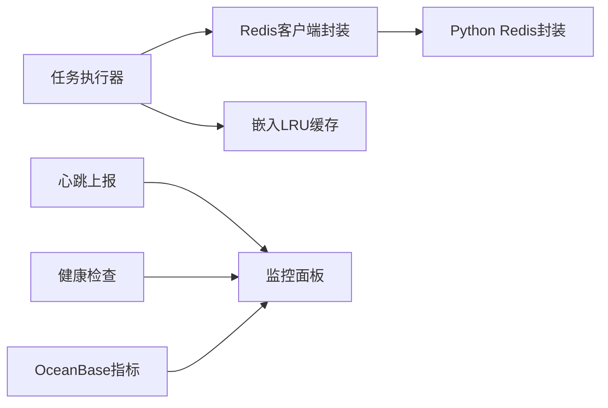

# 性能优化与监控

<cite>
**本文引用的文件**
- [internal/utility/scheduled_task.go](file://internal/utility/scheduled_task.go)
- [internal/cache/redis.go](file://internal/cache/redis.go)
- [rag/utils/redis_conn.py](file://rag/utils/redis_conn.py)
- [internal/utility/embedding_lru.go](file://internal/utility/embedding_lru.go)
- [rag/benchmark.py](file://rag/benchmark.py)
- [internal/logger/logger.go](file://internal/logger/logger.go)
- [api/utils/health_utils.py](file://api/utils/health_utils.py)
- [rag/utils/ob_conn.py](file://rag/utils/ob_conn.py)
- [internal/service/heartbeat_sender.go](file://internal/service/heartbeat_sender.go)
- [web/src/pages/admin/monitoring.tsx](file://web/src/pages/admin/monitoring.tsx)
- [web/src/pages/admin/task-executor-detail.tsx](file://web/src/pages/admin/task-executor-detail.tsx)
- [api/db/joint_services/memory_message_service.py](file://api/db/joint_services/memory_message_service.py)
- [internal/server/config.go](file://internal/server/config.go)
- [rag/svr/task_executor.py](file://rag/svr/task_executor.py)
</cite>

## 目录
1. [简介](#简介)
2. [项目结构](#项目结构)
3. [核心组件](#核心组件)
4. [架构总览](#架构总览)
5. [详细组件分析](#详细组件分析)
6. [依赖分析](#依赖分析)
7. [性能考量](#性能考量)
8. [故障排查指南](#故障排查指南)
9. [结论](#结论)
10. [附录](#附录)

## 简介
本文件聚焦于RAGFlow在性能优化与监控方面的设计与实现，覆盖缓存策略、并发控制、资源调度、瓶颈识别、工作流执行状态监控、性能指标采集与异常告警、批量处理优化、内存管理、网络I/O优化以及计算资源利用等方面。文档同时提供性能调优建议、监控仪表板配置思路与故障诊断方法，帮助运维与开发人员在生产环境中稳定高效地运行系统。

## 项目结构
RAGFlow采用多语言混合架构：Go语言负责后端服务（如心跳上报、定时任务、缓存封装）、Python负责数据处理与检索（如任务执行器、基准评测）、前端负责监控面板展示。关键性能相关模块分布如下：
- Go侧：定时任务与健康检查、Redis客户端封装、日志系统、心跳上报、配置解析
- Python侧：任务执行器（并发限流、批处理、队列消费）、Redis消息队列、嵌入向量LRU缓存、基准评测脚本
- 前端：监控页面集成Prometheus Alertmanager，展示告警信息

图表来源
- [internal/utility/scheduled_task.go:79-156](file://internal/utility/scheduled_task.go#L79-L156)
- [internal/cache/redis.go:107-145](file://internal/cache/redis.go#L107-L145)
- [rag/utils/redis_conn.py:114-146](file://rag/utils/redis_conn.py#L114-L146)
- [internal/utility/embedding_lru.go:24-46](file://internal/utility/embedding_lru.go#L24-L46)
- [rag/benchmark.py:40-90](file://rag/benchmark.py#L40-L90)
- [api/utils/health_utils.py:174-216](file://api/utils/health_utils.py#L174-L216)
- [rag/utils/ob_conn.py:376-411](file://rag/utils/ob_conn.py#L376-L411)
- [internal/service/heartbeat_sender.go:79-143](file://internal/service/heartbeat_sender.go#L79-L143)
- [web/src/pages/admin/monitoring.tsx:1-19](file://web/src/pages/admin/monitoring.tsx#L1-L19)
- [web/src/pages/admin/task-executor-detail.tsx:140-173](file://web/src/pages/admin/task-executor-detail.tsx#L140-L173)

章节来源
- [internal/utility/scheduled_task.go:79-156](file://internal/utility/scheduled_task.go#L79-L156)
- [internal/cache/redis.go:107-145](file://internal/cache/redis.go#L107-L145)
- [rag/utils/redis_conn.py:114-146](file://rag/utils/redis_conn.py#L114-L146)
- [internal/utility/embedding_lru.go:24-46](file://internal/utility/embedding_lru.go#L24-L46)
- [rag/benchmark.py:40-90](file://rag/benchmark.py#L40-L90)
- [api/utils/health_utils.py:174-216](file://api/utils/health_utils.py#L174-L216)
- [rag/utils/ob_conn.py:376-411](file://rag/utils/ob_conn.py#L376-L411)
- [internal/service/heartbeat_sender.go:79-143](file://internal/service/heartbeat_sender.go#L79-L143)
- [web/src/pages/admin/monitoring.tsx:1-19](file://web/src/pages/admin/monitoring.tsx#L1-L19)
- [web/src/pages/admin/task-executor-detail.tsx:140-173](file://web/src/pages/admin/task-executor-detail.tsx#L140-L173)

## 核心组件
- 定时任务与并发控制：通过Go的定时任务框架实现周期性任务，并使用原子标志避免重叠执行；配合信号量实现任务级并发限制。
- Redis缓存与消息队列：提供高性能键值存储、分布式锁、有序集合、流式队列等能力，支撑任务编排与状态持久化。
- 嵌入向量LRU缓存：针对相似查询场景进行向量结果缓存，降低重复计算成本。
- 健康检查与性能指标：对数据库、存储、外部服务进行健康探测与性能度量，支持慢查询统计、QPS估算等。
- 心跳上报与监控面板：定期上报节点状态到管理端，前端集成Alertmanager展示告警。
- 基准评测：提供大规模检索评测流程，便于评估召回质量与性能表现。

章节来源
- [internal/utility/scheduled_task.go:124-142](file://internal/utility/scheduled_task.go#L124-L142)
- [internal/cache/redis.go:60-105](file://internal/cache/redis.go#L60-L105)
- [rag/utils/redis_conn.py:60-124](file://rag/utils/redis_conn.py#L60-L124)
- [internal/utility/embedding_lru.go:24-46](file://internal/utility/embedding_lru.go#L24-L46)
- [api/utils/health_utils.py:174-216](file://api/utils/health_utils.py#L174-L216)
- [rag/utils/ob_conn.py:376-411](file://rag/utils/ob_conn.py#L376-L411)
- [internal/service/heartbeat_sender.go:79-143](file://internal/service/heartbeat_sender.go#L79-L143)
- [rag/benchmark.py:40-90](file://rag/benchmark.py#L40-L90)

## 架构总览
RAGFlow的性能与监控体系围绕“任务执行器 + 缓存 + 队列 + 指标采集 + 心跳上报”展开。任务执行器通过环境变量控制并发上限，使用Redis流进行消息编排；缓存层包含嵌入向量LRU与Redis键值缓存；监控层通过健康检查与心跳上报将状态可视化。

图表来源
- [rag/svr/task_executor.py:124-133](file://rag/svr/task_executor.py#L124-L133)
- [rag/utils/redis_conn.py:399-444](file://rag/utils/redis_conn.py#L399-L444)
- [internal/utility/embedding_lru.go:55-72](file://internal/utility/embedding_lru.go#L55-L72)
- [internal/service/heartbeat_sender.go:79-143](file://internal/service/heartbeat_sender.go#L79-L143)
- [web/src/pages/admin/monitoring.tsx:1-19](file://web/src/pages/admin/monitoring.tsx#L1-L19)

## 详细组件分析

### 组件A：定时任务与并发控制
- 设计要点
  - 使用原子标志防止任务重叠执行，确保任务串行化安全。
  - 通过Ticker周期触发与停止通道控制生命周期。
  - 提供运行中状态查询接口，便于上层监控。
- 并发控制
  - 任务执行前通过原子CAS设置执行标记，若已在执行则跳过本次周期。
  - 异常恢复：捕获panic并记录致命错误，避免进程崩溃。
- 调优建议
  - 合理设置任务间隔，避免频繁唤醒；对长耗时任务启用独立任务或拆分子任务。

图表来源
- [internal/utility/scheduled_task.go:124-142](file://internal/utility/scheduled_task.go#L124-L142)

章节来源
- [internal/utility/scheduled_task.go:79-156](file://internal/utility/scheduled_task.go#L79-L156)

### 组件B：Redis缓存与消息队列
- 设计要点
  - 封装Lua脚本实现原子操作（删除相等值、令牌桶限流）。
  - 支持Stream消费者组、Pending消息查询、重新入队等。
  - 提供Info聚合返回Redis关键指标（内存、客户端数、QPS等）。
- 使用场景
  - 任务执行器通过队列拉取任务，使用分布式锁保证幂等。
  - 作为通用KV缓存，承载轻量元数据与计数器。
- 调优建议
  - 合理设置过期时间与淘汰策略；对热点键使用TTL保护。
  - 对高吞吐场景开启管道与批处理，减少RTT。

图表来源
- [internal/cache/redis.go:60-105](file://internal/cache/redis.go#L60-L105)
- [internal/cache/redis.go:630-726](file://internal/cache/redis.go#L630-L726)
- [rag/utils/redis_conn.py:37-58](file://rag/utils/redis_conn.py#L37-L58)
- [rag/utils/redis_conn.py:399-444](file://rag/utils/redis_conn.py#L399-L444)

章节来源
- [internal/cache/redis.go:107-145](file://internal/cache/redis.go#L107-L145)
- [rag/utils/redis_conn.py:114-146](file://rag/utils/redis_conn.py#L114-L146)
- [rag/utils/redis_conn.py:399-444](file://rag/utils/redis_conn.py#L399-L444)

### 组件C：嵌入向量LRU缓存
- 设计要点
  - 复合键（问题+向量ID）避免误命中；线程安全的读写锁。
  - LRU链表维护访问顺序，容量超限时淘汰最久未使用项。
- 性能收益
  - 显著降低重复查询的嵌入计算与向量检索开销。
- 调优建议
  - 根据内存与命中率调整容量；对高频短语可考虑分片缓存。

图表来源
- [internal/utility/embedding_lru.go:24-46](file://internal/utility/embedding_lru.go#L24-L46)
- [internal/utility/embedding_lru.go:55-72](file://internal/utility/embedding_lru.go#L55-L72)
- [internal/utility/embedding_lru.go:74-102](file://internal/utility/embedding_lru.go#L74-L102)

章节来源
- [internal/utility/embedding_lru.go:24-46](file://internal/utility/embedding_lru.go#L24-L46)
- [internal/utility/embedding_lru.go:55-72](file://internal/utility/embedding_lru.go#L55-L72)
- [internal/utility/embedding_lru.go:74-102](file://internal/utility/embedding_lru.go#L74-L102)

### 组件D：健康检查与性能指标
- 设计要点
  - 对数据库、存储等外部依赖进行连通性与延迟检测。
  - 从OceanBase提取慢查询、QPS、连接池等指标，辅助定位瓶颈。
- 可视化
  - 健康状态与指标通过管理端接口返回，前端监控页展示。

图表来源
- [api/utils/health_utils.py:174-216](file://api/utils/health_utils.py#L174-L216)
- [rag/utils/ob_conn.py:376-411](file://rag/utils/ob_conn.py#L376-L411)

章节来源
- [api/utils/health_utils.py:174-216](file://api/utils/health_utils.py#L174-L216)
- [rag/utils/ob_conn.py:376-411](file://rag/utils/ob_conn.py#L376-L411)

### 组件E：心跳上报与监控面板
- 设计要点
  - 定期向管理端上报节点状态、版本、主机与端口等信息。
  - 前端监控页集成Alertmanager，展示实时告警。
- 运维价值
  - 快速发现节点离线、服务异常与资源紧张。

图表来源
- [internal/service/heartbeat_sender.go:79-143](file://internal/service/heartbeat_sender.go#L79-L143)
- [web/src/pages/admin/monitoring.tsx:1-19](file://web/src/pages/admin/monitoring.tsx#L1-L19)

章节来源
- [internal/service/heartbeat_sender.go:79-143](file://internal/service/heartbeat_sender.go#L79-L143)
- [web/src/pages/admin/monitoring.tsx:1-19](file://web/src/pages/admin/monitoring.tsx#L1-L19)

### 组件F：任务执行器与批处理优化
- 设计要点
  - 通过环境变量控制并发上限（任务、分块、嵌入、对象存储），使用信号量限制并行度。
  - 批大小固定为64，结合队列迭代器与未确认消息处理，提升吞吐。
  - 启动时按消费者编号进行随机抖动，避免连接风暴。
- 监控指标
  - 前端任务执行详情页展示完成/失败任务柱状图，便于观察执行趋势。

图表来源
- [rag/svr/task_executor.py:124-133](file://rag/svr/task_executor.py#L124-L133)
- [rag/svr/task_executor.py:177-200](file://rag/svr/task_executor.py#L177-L200)
- [web/src/pages/admin/task-executor-detail.tsx:140-173](file://web/src/pages/admin/task-executor-detail.tsx#L140-L173)

章节来源
- [rag/svr/task_executor.py:83-133](file://rag/svr/task_executor.py#L83-L133)
- [rag/svr/task_executor.py:177-200](file://rag/svr/task_executor.py#L177-L200)
- [web/src/pages/admin/task-executor-detail.tsx:140-173](file://web/src/pages/admin/task-executor-detail.tsx#L140-L173)

### 组件G：基准评测与性能评估
- 设计要点
  - 支持MS MARCO、TriviaQA、MIRACL等数据集，自动构建索引、向量化与插入。
  - 通过检索器执行查询，计算NDCG@10、MAP@5、MRR@10等指标。
- 应用场景
  - 在不同硬件与配置下对比检索性能，指导参数调优。

图表来源
- [rag/benchmark.py:91-130](file://rag/benchmark.py#L91-L130)
- [rag/benchmark.py:247-286](file://rag/benchmark.py#L247-L286)

章节来源
- [rag/benchmark.py:40-90](file://rag/benchmark.py#L40-L90)
- [rag/benchmark.py:247-286](file://rag/benchmark.py#L247-L286)

## 依赖分析
- 组件耦合
  - 任务执行器依赖Redis队列与嵌入LRU缓存；缓存与队列均依赖Redis客户端封装。
  - 心跳上报依赖管理端配置；监控面板依赖心跳与健康检查数据。
- 外部依赖
  - Redis、OceanBase、管理端服务等外部系统影响整体性能与可用性。
- 循环依赖
  - 当前模块间以单向依赖为主，未见循环导入。

图表来源
- [rag/svr/task_executor.py:124-133](file://rag/svr/task_executor.py#L124-L133)
- [internal/cache/redis.go:107-145](file://internal/cache/redis.go#L107-L145)
- [rag/utils/redis_conn.py:114-146](file://rag/utils/redis_conn.py#L114-L146)
- [internal/service/heartbeat_sender.go:79-143](file://internal/service/heartbeat_sender.go#L79-L143)
- [web/src/pages/admin/monitoring.tsx:1-19](file://web/src/pages/admin/monitoring.tsx#L1-L19)
- [api/utils/health_utils.py:174-216](file://api/utils/health_utils.py#L174-L216)
- [rag/utils/ob_conn.py:376-411](file://rag/utils/ob_conn.py#L376-L411)

章节来源
- [internal/cache/redis.go:107-145](file://internal/cache/redis.go#L107-L145)
- [rag/utils/redis_conn.py:114-146](file://rag/utils/redis_conn.py#L114-L146)
- [internal/service/heartbeat_sender.go:79-143](file://internal/service/heartbeat_sender.go#L79-L143)
- [web/src/pages/admin/monitoring.tsx:1-19](file://web/src/pages/admin/monitoring.tsx#L1-L19)
- [api/utils/health_utils.py:174-216](file://api/utils/health_utils.py#L174-L216)
- [rag/utils/ob_conn.py:376-411](file://rag/utils/ob_conn.py#L376-L411)

## 性能考量
- 缓存策略
  - 嵌入向量LRU：针对相似问题快速命中，显著降低重复计算。
  - Redis KV缓存：用于轻量元数据与计数器，注意TTL与淘汰策略。
- 并发控制
  - 通过信号量限制任务、分块、嵌入与对象存储并发，避免资源争用。
  - 定时任务采用原子CAS避免重叠执行，保障稳定性。
- 资源调度
  - 任务执行器按消费者编号随机延迟启动，缓解连接风暴。
  - 批大小固定为64，平衡吞吐与延迟。
- 瓶颈识别
  - 健康检查与OceanBase指标（慢查询、QPS、连接数）辅助定位数据库瓶颈。
  - 监控面板展示告警，结合心跳上报定位节点异常。
- 内存管理
  - 嵌入LRU容量可控，避免内存膨胀；必要时清理缓存或调整容量。
  - 任务执行过程中的进度与状态更新需及时关闭连接，避免句柄泄漏。
- 网络I/O优化
  - Redis批处理与管道减少RTT；队列消费采用阻塞读取，降低CPU占用。
- 计算资源利用
  - 通过并发上限与批处理提升吞吐；基准评测用于对比不同配置下的性能差异。

[本节为通用性能指导，不直接分析具体文件]

## 故障排查指南
- 健康检查失败
  - 检查数据库连接字符串、认证信息与网络连通性；关注慢查询与连接池状态。
- Redis异常
  - 查看Info指标（内存、客户端数、QPS）；确认消费者组是否存在、Pending消息堆积。
  - 使用重入队功能处理死信消息。
- 任务执行停滞
  - 检查并发上限是否过低导致饥饿；查看任务执行详情柱状图识别失败峰值。
  - 关注启动延迟与连接风暴规避逻辑。
- 心跳与告警
  - 确认管理端地址与端口配置正确；查看监控面板Alertmanager页面定位告警来源。

章节来源
- [api/utils/health_utils.py:174-216](file://api/utils/health_utils.py#L174-L216)
- [rag/utils/ob_conn.py:376-411](file://rag/utils/ob_conn.py#L376-L411)
- [rag/utils/redis_conn.py:472-482](file://rag/utils/redis_conn.py#L472-L482)
- [web/src/pages/admin/monitoring.tsx:1-19](file://web/src/pages/admin/monitoring.tsx#L1-L19)
- [web/src/pages/admin/task-executor-detail.tsx:140-173](file://web/src/pages/admin/task-executor-detail.tsx#L140-L173)

## 结论
RAGFlow在性能优化方面通过缓存（嵌入LRU与Redis）、并发控制（信号量与定时任务）、批处理（固定批大小与队列消费）与资源调度（启动延迟）形成完整闭环；在监控方面通过健康检查、OceanBase指标、心跳上报与前端监控面板实现可观测性。结合基准评测与持续调优，可在不同规模与场景下获得稳定高效的性能表现。

[本节为总结性内容，不直接分析具体文件]

## 附录
- 性能调优清单
  - 调整并发上限（任务/分块/嵌入/对象存储）以匹配硬件资源。
  - 优化Redis批处理与TTL策略，减少内存压力。
  - 启用嵌入LRU并根据命中率调整容量。
  - 使用基准评测对比不同配置的检索性能。
- 监控仪表板配置
  - 集成Alertmanager并配置告警规则（连接失败、慢查询、QPS骤降等）。
  - 在监控页展示健康检查与心跳上报数据，便于实时观测。
- 故障诊断流程
  - 从健康检查与OceanBase指标入手定位数据库瓶颈；
  - 结合Redis队列与任务执行详情排查队列积压与失败原因；
  - 通过心跳与告警确认节点状态与服务可用性。

[本节为通用指导，不直接分析具体文件]