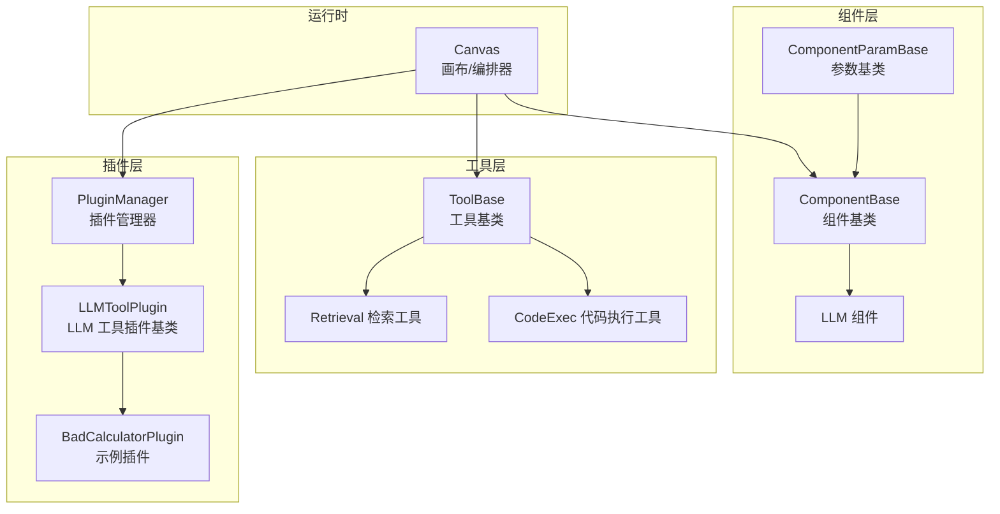
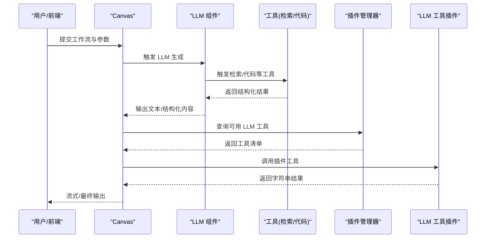
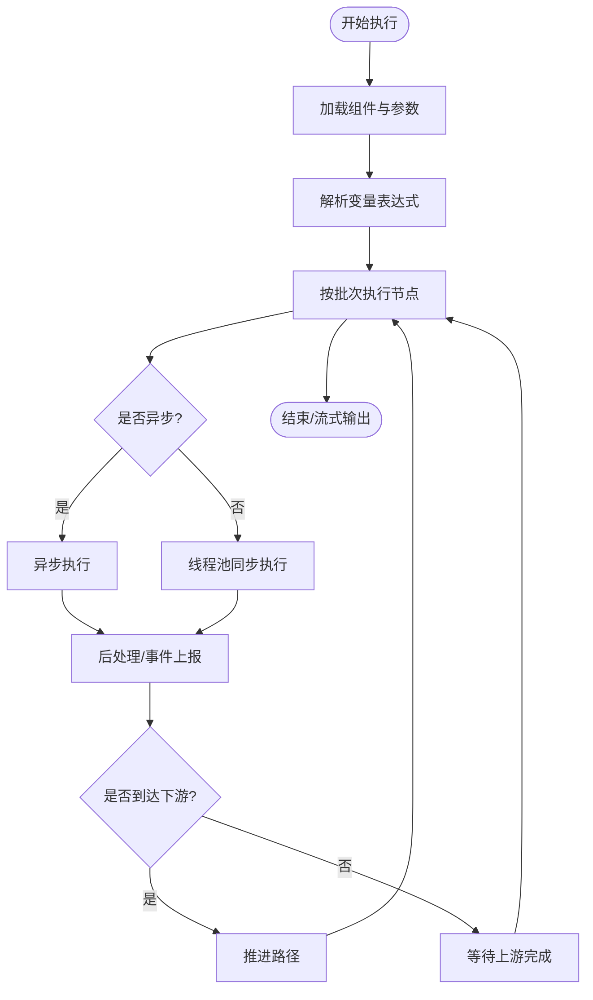
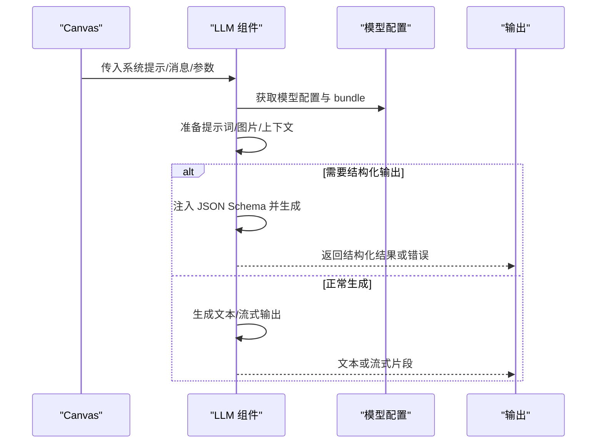
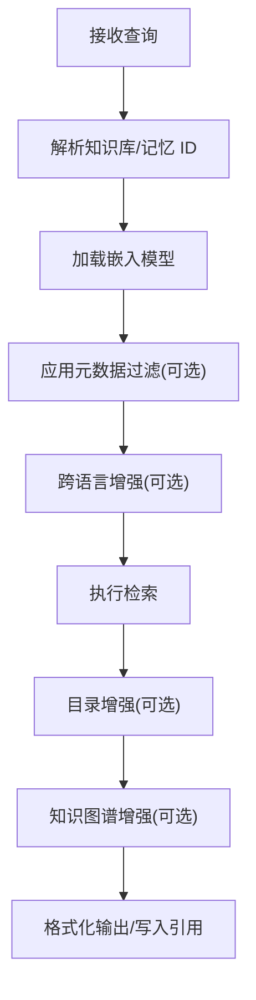
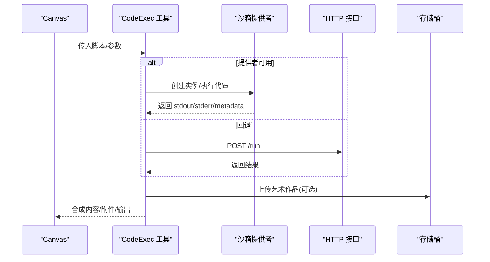
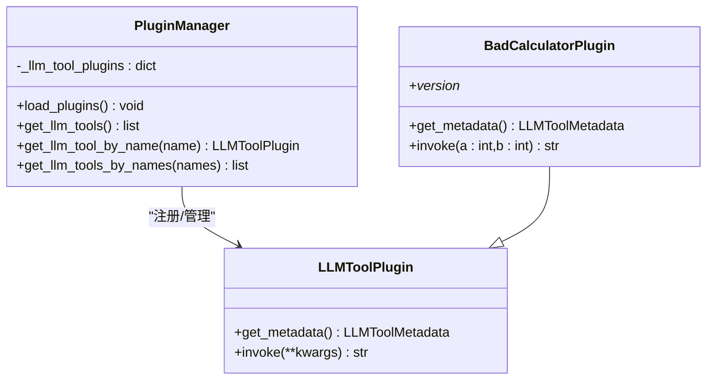
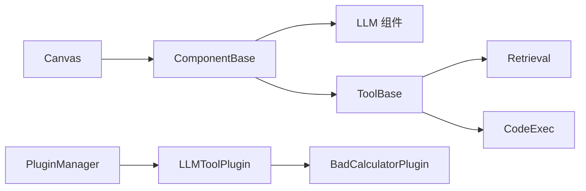

# 组件系统与插件机制

<cite>
**本文引用的文件**
- [agent/plugin/__init__.py](file://agent/plugin/__init__.py)
- [agent/plugin/plugin_manager.py](file://agent/plugin/plugin_manager.py)
- [agent/plugin/common.py](file://agent/plugin/common.py)
- [agent/plugin/llm_tool_plugin.py](file://agent/plugin/llm_tool_plugin.py)
- [agent/plugin/embedded_plugins/llm_tools/bad_calculator.py](file://agent/plugin/embedded_plugins/llm_tools/bad_calculator.py)
- [agent/plugin/README.md](file://agent/plugin/README.md)
- [agent/component/base.py](file://agent/component/base.py)
- [agent/component/llm.py](file://agent/component/llm.py)
- [agent/tools/base.py](file://agent/tools/base.py)
- [agent/tools/retrieval.py](file://agent/tools/retrieval.py)
- [agent/tools/code_exec.py](file://agent/tools/code_exec.py)
- [agent/tools/__init__.py](file://agent/tools/__init__.py)
- [agent/sandbox/client.py](file://agent/sandbox/client.py)
- [agent/canvas.py](file://agent/canvas.py)
</cite>

## 目录
1. [简介](#简介)
2. [项目结构](#项目结构)
3. [核心组件](#核心组件)
4. [架构总览](#架构总览)
5. [详细组件分析](#详细组件分析)
6. [依赖分析](#依赖分析)
7. [性能考量](#性能考量)
8. [故障排查指南](#故障排查指南)
9. [结论](#结论)
10. [附录](#附录)

## 简介
本文件系统性阐述 RAGFlow 的组件化架构与插件机制，重点覆盖以下方面：
- 组件系统设计模式与运行时控制流
- 插件加载机制与标准化接口
- 内置组件能力与典型使用场景（LLM 调用、检索、代码执行、HTTP 请求等）
- 自定义组件与插件开发流程、错误处理与性能优化建议
- 插件发布与版本管理策略

## 项目结构
RAGFlow 的组件与插件主要分布在 agent 子模块中：
- 组件层：以抽象基类为核心，定义统一的输入输出、参数校验、异常处理与并发控制
- 工具层：面向具体任务（检索、代码执行等）的可复用组件
- 插件层：通过插件库动态加载 LLM 工具插件
- 运行时：Canvas/Graph 负责编排组件执行、变量传递与事件流

图表来源
- [agent/component/base.py:365-585](file://agent/component/base.py#L365-L585)
- [agent/component/llm.py:83-455](file://agent/component/llm.py#L83-L455)
- [agent/tools/base.py:123-213](file://agent/tools/base.py#L123-L213)
- [agent/tools/retrieval.py:85-325](file://agent/tools/retrieval.py#L85-L325)
- [agent/tools/code_exec.py:150-567](file://agent/tools/code_exec.py#L150-L567)
- [agent/plugin/plugin_manager.py:11-46](file://agent/plugin/plugin_manager.py#L11-L46)
- [agent/plugin/llm_tool_plugin.py:22-52](file://agent/plugin/llm_tool_plugin.py#L22-L52)
- [agent/plugin/embedded_plugins/llm_tools/bad_calculator.py:5-38](file://agent/plugin/embedded_plugins/llm_tools/bad_calculator.py#L5-L38)
- [agent/canvas.py:42-150](file://agent/canvas.py#L42-L150)

章节来源
- [agent/canvas.py:42-150](file://agent/canvas.py#L42-L150)
- [agent/component/base.py:365-585](file://agent/component/base.py#L365-L585)
- [agent/tools/base.py:123-213](file://agent/tools/base.py#L123-L213)
- [agent/plugin/plugin_manager.py:11-46](file://agent/plugin/plugin_manager.py#L11-L46)

## 核心组件
本节聚焦组件系统的核心抽象与运行时行为。

- 组件基类与参数基类
  - ComponentBase：统一的组件生命周期、输入输出、异常处理、超时控制与并发限制
  - ComponentParamBase：参数更新、校验、序列化与调试输入支持
- 工具基类与工具参数基类
  - ToolBase：继承组件基类，提供工具元信息生成、同步/异步调用封装
  - ToolParamBase：从 meta 初始化输入与默认值，生成 OpenAI 风格函数定义
- LLM 组件
  - 负责系统提示、消息构造、图像数据处理、结构化输出、流式输出与重试机制
- Canvas/Graph
  - 负责组件图的加载、变量解析、路径推进、事件流与取消信号

章节来源
- [agent/component/base.py:40-585](file://agent/component/base.py#L40-L585)
- [agent/tools/base.py:79-213](file://agent/tools/base.py#L79-L213)
- [agent/component/llm.py:34-455](file://agent/component/llm.py#L34-L455)
- [agent/canvas.py:42-150](file://agent/canvas.py#L42-L150)

## 架构总览
RAGFlow 的组件系统采用“组件 + 工具 + 插件”的分层设计，Canvas 负责编排，组件负责职责单一的计算单元，工具提供领域能力，插件扩展 LLM 的外部工具调用。

图表来源
- [agent/canvas.py:375-668](file://agent/canvas.py#L375-L668)
- [agent/component/llm.py:367-445](file://agent/component/llm.py#L367-L445)
- [agent/tools/retrieval.py:297-318](file://agent/tools/retrieval.py#L297-L318)
- [agent/tools/code_exec.py:154-240](file://agent/tools/code_exec.py#L154-L240)
- [agent/plugin/plugin_manager.py:17-45](file://agent/plugin/plugin_manager.py#L17-L45)

## 详细组件分析

### 组件系统与运行时（Canvas/Graph）
- 加载与参数校验：根据 DSL 动态构建组件实例，参数对象负责校验与更新
- 变量解析：支持表达式替换与跨组件变量引用
- 并发执行：批处理节点，按上游满足度推进，支持异步/同步混合
- 事件流：节点开始/结束、消息流、TTS 音频、取消与错误处理
- 取消机制：基于 Redis 标记的任务取消

图表来源
- [agent/canvas.py:435-648](file://agent/canvas.py#L435-L648)

章节来源
- [agent/canvas.py:42-150](file://agent/canvas.py#L42-L150)
- [agent/canvas.py:375-668](file://agent/canvas.py#L375-L668)

### LLM 组件
- 参数与校验：温度、采样、惩罚项、最大 token、系统提示与用户提示模板
- 图像处理：自动提取 data:image 数据、去重、按模型类型切换
- 结构化输出：注入 JSON Schema，失败时重试并修复
- 流式输出：对 think 标记进行透明透传，支持取消
- 异常处理：重试、默认值回退、错误记录

图表来源
- [agent/component/llm.py:227-445](file://agent/component/llm.py#L227-L445)

章节来源
- [agent/component/llm.py:34-455](file://agent/component/llm.py#L34-L455)

### 检索工具（Retrieval）
- 支持知识库检索与记忆检索，可选重排模型与跨语言增强
- 元数据过滤：支持手动/半自动/自动三种方式
- 输出格式：正式化内容与 JSON 块列表，自动写入引用缓存

图表来源
- [agent/tools/retrieval.py:88-258](file://agent/tools/retrieval.py#L88-L258)

章节来源
- [agent/tools/retrieval.py:37-325](file://agent/tools/retrieval.py#L37-L325)

### 代码执行工具（CodeExec）
- 支持 Python/NodeJS，提供沙箱执行与 HTTP 回退
- 艺术品上传与生命周期管理（MinIO/S3）
- 输出解析与内容拼接：标准输出、错误、附件解析与文本化

图表来源
- [agent/tools/code_exec.py:154-240](file://agent/tools/code_exec.py#L154-L240)
- [agent/sandbox/client.py:138-191](file://agent/sandbox/client.py#L138-L191)

章节来源
- [agent/tools/code_exec.py:66-567](file://agent/tools/code_exec.py#L66-L567)
- [agent/sandbox/client.py:39-240](file://agent/sandbox/client.py#L39-L240)

### 插件机制（LLM 工具插件）
- 插件类型：llm_tools
- 插件管理：递归扫描 embedded_plugins，加载并注册 LLM 工具
- 插件接口：get_metadata（描述与参数）、invoke（执行逻辑，返回字符串）
- 元数据到 OpenAI 工具定义转换

图表来源
- [agent/plugin/llm_tool_plugin.py:22-52](file://agent/plugin/llm_tool_plugin.py#L22-L52)
- [agent/plugin/plugin_manager.py:11-46](file://agent/plugin/plugin_manager.py#L11-L46)
- [agent/plugin/embedded_plugins/llm_tools/bad_calculator.py:5-38](file://agent/plugin/embedded_plugins/llm_tools/bad_calculator.py#L5-L38)

章节来源
- [agent/plugin/plugin_manager.py:11-46](file://agent/plugin/plugin_manager.py#L11-L46)
- [agent/plugin/llm_tool_plugin.py:7-52](file://agent/plugin/llm_tool_plugin.py#L7-L52)
- [agent/plugin/embedded_plugins/llm_tools/bad_calculator.py:5-38](file://agent/plugin/embedded_plugins/llm_tools/bad_calculator.py#L5-L38)
- [agent/plugin/README.md:1-98](file://agent/plugin/README.md#L1-L98)

### 工具自动发现与导入
- 工具包通过扫描 agent/tools 下的模块，动态导入所有公开类，便于在 Canvas 中按名称实例化

章节来源
- [agent/tools/__init__.py:25-48](file://agent/tools/__init__.py#L25-L48)

## 依赖分析
- 组件与工具共享基类体系，确保一致的生命周期与错误处理
- Canvas 作为编排中心，耦合组件与工具；插件通过管理器解耦
- 工具之间相互独立，可通过 LLM 组合调用

图表来源
- [agent/canvas.py:42-150](file://agent/canvas.py#L42-L150)
- [agent/component/base.py:365-585](file://agent/component/base.py#L365-L585)
- [agent/tools/base.py:123-213](file://agent/tools/base.py#L123-L213)
- [agent/tools/retrieval.py:85-325](file://agent/tools/retrieval.py#L85-L325)
- [agent/tools/code_exec.py:150-567](file://agent/tools/code_exec.py#L150-L567)
- [agent/plugin/plugin_manager.py:11-46](file://agent/plugin/plugin_manager.py#L11-L46)
- [agent/plugin/llm_tool_plugin.py:22-52](file://agent/plugin/llm_tool_plugin.py#L22-L52)
- [agent/plugin/embedded_plugins/llm_tools/bad_calculator.py:5-38](file://agent/plugin/embedded_plugins/llm_tools/bad_calculator.py#L5-L38)

章节来源
- [agent/canvas.py:42-150](file://agent/canvas.py#L42-L150)
- [agent/component/base.py:365-585](file://agent/component/base.py#L365-L585)
- [agent/tools/base.py:123-213](file://agent/tools/base.py#L123-L213)
- [agent/plugin/plugin_manager.py:11-46](file://agent/plugin/plugin_manager.py#L11-L46)

## 性能考量
- 并发与限流
  - 组件级并发信号量与线程池，避免阻塞
  - Canvas 批处理与异步优先策略
- 超时与重试
  - 组件与工具均提供超时装饰器与重试次数配置
- I/O 与网络
  - 检索与 LLM 调用需关注模型与向量引擎延迟
  - 代码执行工具优先使用沙箱提供者，回退 HTTP 时注意端口与超时
- 输出与内存
  - 大块内容应分段流式输出，避免一次性占用内存
  - 艺术品上传需设置生命周期策略，降低存储成本

## 故障排查指南
- 通用错误
  - 检查组件参数校验与必填字段
  - 查看组件输出中的 _ERROR 字段
  - 关注 Canvas 的事件流与取消标记
- LLM 组件
  - 结构化输出解析失败时会重试并给出错误提示
  - 图像数据需符合 data:image/ 前缀规范
- 检索工具
  - 确认知识库/记忆 ID 存在且嵌入模型一致
  - 元数据过滤表达式需正确解析变量
- 代码执行工具
  - 沙箱提供者未配置时会抛出运行时错误
  - HTTP 回退失败时检查端点可达性与超时设置
  - 艺术品上传失败时检查存储桶生命周期与权限

章节来源
- [agent/component/base.py:407-447](file://agent/component/base.py#L407-L447)
- [agent/component/llm.py:367-445](file://agent/component/llm.py#L367-L445)
- [agent/tools/retrieval.py:297-318](file://agent/tools/retrieval.py#L297-L318)
- [agent/tools/code_exec.py:154-240](file://agent/tools/code_exec.py#L154-L240)
- [agent/sandbox/client.py:138-191](file://agent/sandbox/client.py#L138-L191)

## 结论
RAGFlow 的组件系统通过统一的基类与 Canvas 编排，实现了高内聚、低耦合的可扩展架构。插件机制进一步增强了 LLM 的外部工具调用能力，工具层则提供了检索、代码执行等常见能力。遵循本文的开发与优化建议，可在保证稳定性的同时快速扩展新功能。

## 附录

### 开发自定义组件/插件最佳实践
- 组件开发
  - 继承 ComponentBase 或 ToolBase，实现 _invoke/_invoke_async
  - 使用 ComponentParamBase 定义参数与校验规则
  - 明确输入输出键名，必要时提供 get_input_form
- 工具开发
  - 在 agent/tools 下新增模块，导出公开类
  - 使用 ToolParamBase 的 meta 定义函数签名
- 插件开发
  - 在 embedded_plugins/llm_tools 下新建插件文件
  - 实现 get_metadata 与 invoke，返回字符串结果
  - 设置版本号，启动后可在日志中确认加载成功

章节来源
- [agent/tools/base.py:79-135](file://agent/tools/base.py#L79-L135)
- [agent/plugin/README.md:13-98](file://agent/plugin/README.md#L13-L98)