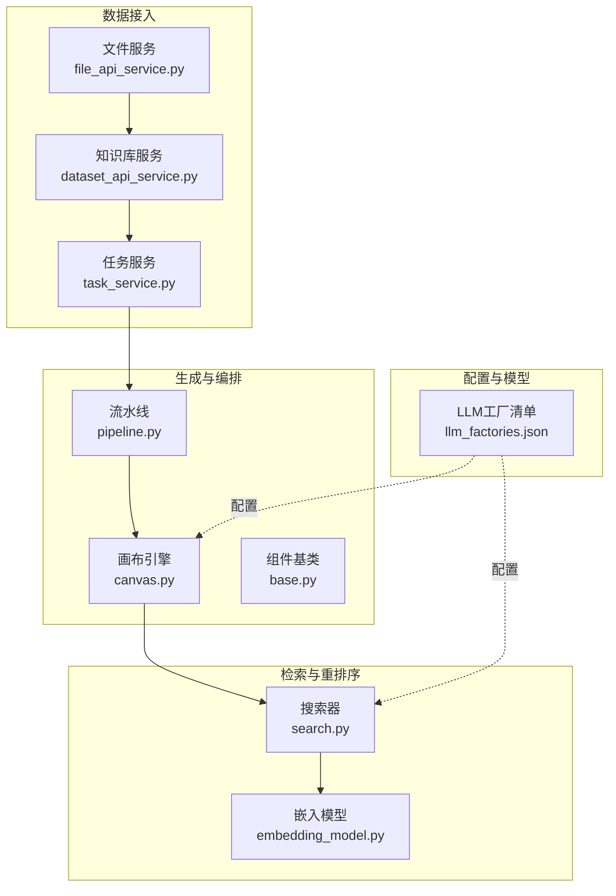
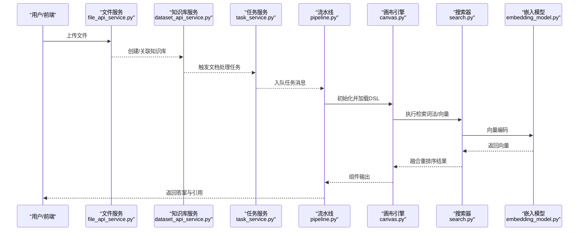
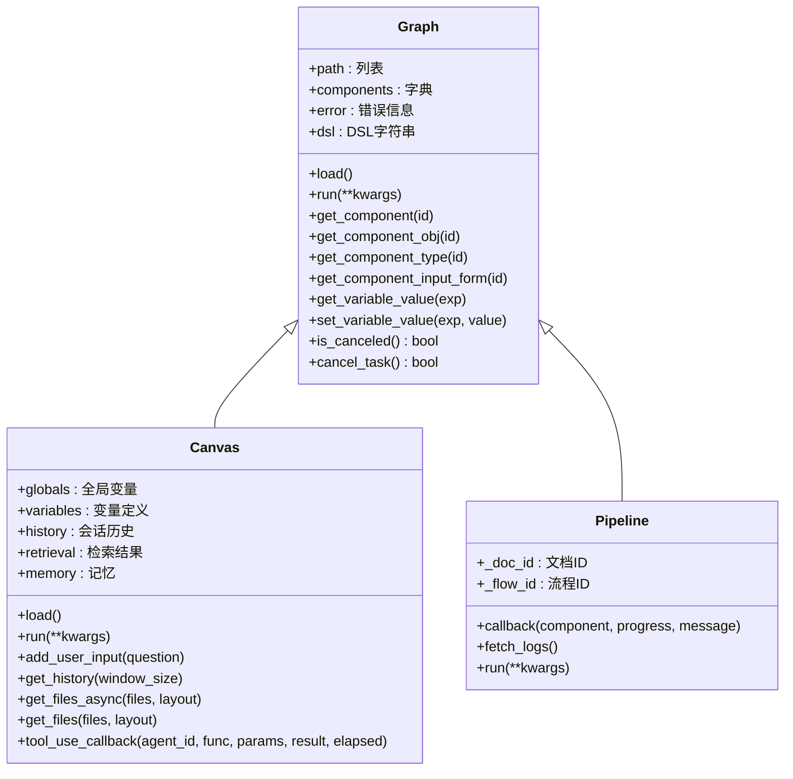
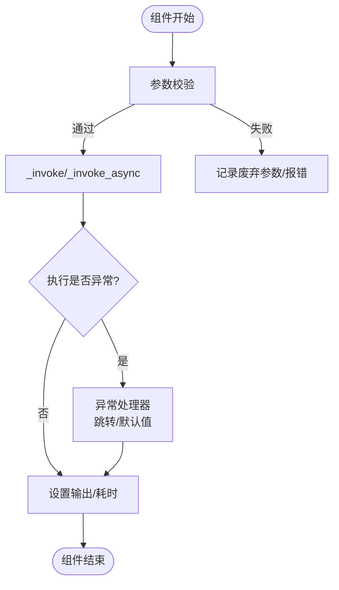
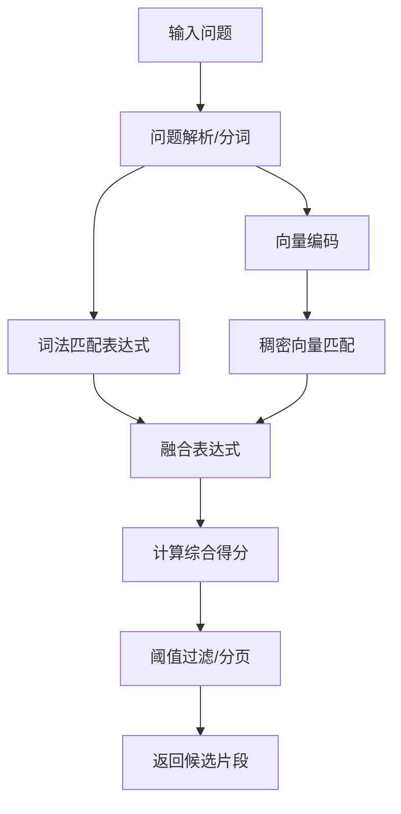
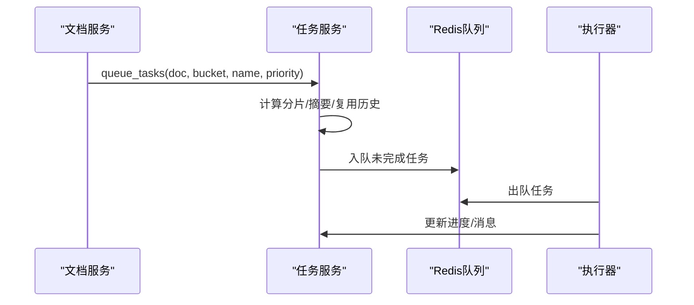
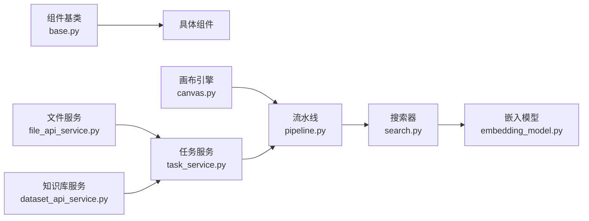

# 自动化RAG工作流

<cite>
**本文档引用的文件**
- [README.md](file://README.md)
- [pipeline.py](file://rag/flow/pipeline.py)
- [canvas.py](file://agent/canvas.py)
- [base.py](file://agent/component/base.py)
- [dataset_api_service.py](file://api/apps/services/dataset_api_service.py)
- [file_api_service.py](file://api/apps/services/file_api_service.py)
- [task_service.py](file://api/db/services/task_service.py)
- [embedding_model.py](file://rag/llm/embedding_model.py)
- [search.py](file://rag/nlp/search.py)
- [llm_factories.json](file://conf/llm_factories.json)
</cite>

## 目录
1. [引言](#引言)
2. [项目结构](#项目结构)
3. [核心组件](#核心组件)
4. [架构总览](#架构总览)
5. [详细组件分析](#详细组件分析)
6. [依赖关系分析](#依赖关系分析)
7. [性能考量](#性能考量)
8. [故障排除指南](#故障排除指南)
9. [结论](#结论)
10. [附录](#附录)

## 引言
本文件聚焦于RAGFlow的自动化RAG工作流能力，系统阐述从文档上传、解析与索引构建，到检索、融合重排序、生成与最终答案呈现的完整端到端流水线。重点包括：
- 工作流编排机制：基于图（Graph）的组件化执行引擎，支持并发与分支控制
- 组件化设计：统一的组件抽象与参数校验体系，便于扩展与复用
- 并行处理策略：线程池与异步协程结合，提升吞吐
- 错误恢复机制：取消信号、异常处理与回退路径
- LLM与嵌入模型配置：多厂商适配与工厂模式
- 多召回融合重排序：词法+向量+特征的加权融合
- 性能监控与质量评估：进度追踪、日志与可视化
- 对比手动RAG流程：在可扩展性、稳定性与易用性上的优势

## 项目结构
RAGFlow采用分层架构，围绕“数据接入—解析索引—检索融合—生成回答—结果交付”主线组织代码：
- 数据接入与管理：文件服务、知识库服务、任务队列
- 检索与重排序：向量化检索、词法检索、融合重排序
- 生成与编排：Agent画布（Canvas）与组件（Component）执行引擎
- 配置与模型：LLM工厂清单、嵌入模型适配器

**图表来源**
- [file_api_service.py:32-102](file://api/apps/services/file_api_service.py#L32-L102)
- [dataset_api_service.py:33-91](file://api/apps/services/dataset_api_service.py#L33-L91)
- [task_service.py:355-460](file://api/db/services/task_service.py#L355-L460)
- [pipeline.py:28-176](file://rag/flow/pipeline.py#L28-L176)
- [canvas.py:42-800](file://agent/canvas.py#L42-L800)
- [base.py:365-585](file://agent/component/base.py#L365-L585)
- [search.py:36-716](file://rag/nlp/search.py#L36-L716)
- [embedding_model.py:36-800](file://rag/llm/embedding_model.py#L36-L800)
- [llm_factories.json:1-800](file://conf/llm_factories.json#L1-L800)

**章节来源**
- [README.md:111-139](file://README.md#L111-L139)
- [file_api_service.py:32-102](file://api/apps/services/file_api_service.py#L32-L102)
- [dataset_api_service.py:33-91](file://api/apps/services/dataset_api_service.py#L33-L91)
- [task_service.py:355-460](file://api/db/services/task_service.py#L355-L460)
- [pipeline.py:28-176](file://rag/flow/pipeline.py#L28-L176)
- [canvas.py:42-800](file://agent/canvas.py#L42-L800)
- [base.py:365-585](file://agent/component/base.py#L365-L585)
- [search.py:36-716](file://rag/nlp/search.py#L36-L716)
- [embedding_model.py:36-800](file://rag/llm/embedding_model.py#L36-L800)
- [llm_factories.json:1-800](file://conf/llm_factories.json#L1-L800)

## 核心组件
- 流水线（Pipeline）：继承自图（Graph），负责按拓扑顺序调度组件执行，支持回调与进度上报
- 画布（Canvas）：承载全局变量、历史记录与检索上下文，驱动组件的并发执行与分支控制
- 组件（Component）：统一的组件抽象，包含输入输出、参数校验、异常处理与超时控制
- 搜索器（Dealer）：封装检索请求，支持词法检索、向量检索与融合重排序
- 嵌入模型：多厂商适配的嵌入编码器，支持批量编码与令牌统计
- 任务服务：文档处理任务的队列化管理、进度追踪与取消控制

**章节来源**
- [pipeline.py:28-176](file://rag/flow/pipeline.py#L28-L176)
- [canvas.py:283-800](file://agent/canvas.py#L283-L800)
- [base.py:365-585](file://agent/component/base.py#L365-L585)
- [search.py:36-716](file://rag/nlp/search.py#L36-L716)
- [embedding_model.py:36-800](file://rag/llm/embedding_model.py#L36-L800)
- [task_service.py:57-554](file://api/db/services/task_service.py#L57-L554)

## 架构总览
RAGFlow的自动化RAG工作流以“任务驱动 + 组件编排”的方式运行：
- 文档上传后由任务服务创建处理任务，写入Redis队列
- 执行器拉取任务，调用流水线/画布引擎执行组件链路
- 检索阶段通过词法与向量双通道召回，融合重排序后返回候选片段
- 生成阶段根据上下文与提示词生成答案，同时进行引用标注与高亮

**图表来源**
- [file_api_service.py:32-102](file://api/apps/services/file_api_service.py#L32-L102)
- [dataset_api_service.py:33-91](file://api/apps/services/dataset_api_service.py#L33-L91)
- [task_service.py:355-460](file://api/db/services/task_service.py#L355-L460)
- [pipeline.py:117-176](file://rag/flow/pipeline.py#L117-L176)
- [canvas.py:375-668](file://agent/canvas.py#L375-L668)
- [search.py:364-520](file://rag/nlp/search.py#L364-L520)
- [embedding_model.py:45-122](file://rag/llm/embedding_model.py#L45-L122)

## 详细组件分析

### 流水线（Pipeline）与画布（Canvas）
- 流水线负责按拓扑序调度组件，支持回调记录与进度更新；当组件抛错或被取消时，触发回退逻辑
- 画布负责全局状态管理（sys变量、历史、检索聚合）、并发执行（线程池+异步协程）、分支与循环控制、异常处理与回退

**图表来源**
- [canvas.py:42-800](file://agent/canvas.py#L42-L800)
- [pipeline.py:28-176](file://rag/flow/pipeline.py#L28-L176)

**章节来源**
- [canvas.py:283-800](file://agent/canvas.py#L283-L800)
- [pipeline.py:28-176](file://rag/flow/pipeline.py#L28-L176)

### 组件（Component）基类与参数校验
- 组件基类提供统一的生命周期：初始化、输入解析、执行、输出、错误处理与超时控制
- 参数校验：支持内置类型检查、范围约束、冗余字段检测与废弃参数警告
- 异常处理：支持“跳转到其他分支”“设置默认值”等策略

**图表来源**
- [base.py:365-585](file://agent/component/base.py#L365-L585)

**章节来源**
- [base.py:40-585](file://agent/component/base.py#L40-L585)

### 检索与融合重排序
- 词法检索：对问题进行分词与关键词提取，构造匹配表达式
- 向量检索：使用嵌入模型对查询进行编码，构造稠密向量匹配表达式
- 融合重排序：将词法相似度、向量相似度与特征分数（如PageRank、标签特征）加权融合
- 分页与阈值：支持分页窗口与相似度阈值过滤，保证结果质量与性能

**图表来源**
- [search.py:74-171](file://rag/nlp/search.py#L74-L171)
- [search.py:364-520](file://rag/nlp/search.py#L364-L520)

**章节来源**
- [search.py:36-716](file://rag/nlp/search.py#L36-L716)
- [embedding_model.py:36-800](file://rag/llm/embedding_model.py#L36-L800)

### 任务队列与进度追踪
- 任务服务负责创建任务、分片（按页/行）、计算摘要、复用历史块、写入Redis队列
- 进度追踪：持续更新任务进度、消息与耗时，支持取消信号与异常恢复

**图表来源**
- [task_service.py:355-460](file://api/db/services/task_service.py#L355-L460)
- [task_service.py:298-347](file://api/db/services/task_service.py#L298-L347)

**章节来源**
- [task_service.py:57-554](file://api/db/services/task_service.py#L57-L554)

### LLM与嵌入模型配置
- LLM工厂清单：集中描述各厂商模型能力、最大上下文、工具支持等
- 嵌入模型适配：统一接口，支持OpenAI、DashScope、本地Ollama等多种后端
- 配置应用：通过服务配置与环境变量选择具体模型与URL

**章节来源**
- [llm_factories.json:1-800](file://conf/llm_factories.json#L1-L800)
- [embedding_model.py:36-800](file://rag/llm/embedding_model.py#L36-L800)

## 依赖关系分析
- 组件依赖：组件基类提供统一接口，具体组件通过参数对象注入行为
- 编排依赖：流水线依赖画布的全局状态与并发执行能力
- 检索依赖：搜索器依赖嵌入模型与文档存储连接
- 任务依赖：任务服务依赖存储与Redis队列，支撑大规模并发

**图表来源**
- [base.py:365-585](file://agent/component/base.py#L365-L585)
- [canvas.py:42-800](file://agent/canvas.py#L42-L800)
- [pipeline.py:28-176](file://rag/flow/pipeline.py#L28-L176)
- [search.py:36-716](file://rag/nlp/search.py#L36-L716)
- [embedding_model.py:36-800](file://rag/llm/embedding_model.py#L36-L800)
- [task_service.py:355-460](file://api/db/services/task_service.py#L355-L460)
- [file_api_service.py:32-102](file://api/apps/services/file_api_service.py#L32-L102)
- [dataset_api_service.py:33-91](file://api/apps/services/dataset_api_service.py#L33-L91)

**章节来源**
- [base.py:365-585](file://agent/component/base.py#L365-L585)
- [canvas.py:42-800](file://agent/canvas.py#L42-L800)
- [pipeline.py:28-176](file://rag/flow/pipeline.py#L28-L176)
- [search.py:36-716](file://rag/nlp/search.py#L36-L716)
- [embedding_model.py:36-800](file://rag/llm/embedding_model.py#L36-L800)
- [task_service.py:355-460](file://api/db/services/task_service.py#L355-L460)
- [file_api_service.py:32-102](file://api/apps/services/file_api_service.py#L32-L102)
- [dataset_api_service.py:33-91](file://api/apps/services/dataset_api_service.py#L33-L91)

## 性能考量
- 并发与限流：组件级并发信号量、线程池大小、组件执行超时控制
- 检索优化：分页窗口与阈值过滤、向量维度与相似度权重、融合权重调优
- 存储与索引：文档引擎切换（Elasticsearch/Infinity）与索引字段设计
- 任务复用：基于摘要的任务块复用，减少重复计算
- 监控与可观测性：进度消息、日志键、异常堆栈与耗时统计

**章节来源**
- [base.py:367-449](file://agent/component/base.py#L367-L449)
- [search.py:380-520](file://rag/nlp/search.py#L380-L520)
- [task_service.py:462-506](file://api/db/services/task_service.py#L462-L506)
- [README.md:140-144](file://README.md#L140-L144)

## 故障排除指南
- 取消与回退：任务取消信号通过Redis键传播，组件在执行前检查并快速返回
- 异常处理：组件异常可配置“跳转到其他分支”或“设置默认值”，避免整条链路中断
- 进度追踪：通过任务服务的进度消息定位卡点，结合日志键查看组件执行轨迹
- 模型与网络：嵌入模型支持多种后端，若某厂商接口异常，可切换至其他后端或本地模型
- 知识库与索引：确认索引是否存在、字段映射是否正确，必要时重建索引

**章节来源**
- [task_service.py:517-524](file://api/db/services/task_service.py#L517-L524)
- [base.py:567-582](file://agent/component/base.py#L567-L582)
- [pipeline.py:43-104](file://rag/flow/pipeline.py#L43-L104)
- [embedding_model.py:36-800](file://rag/llm/embedding_model.py#L36-L800)

## 结论
RAGFlow通过“组件化 + 并行化 + 融合重排序”的自动化RAG工作流，在以下方面显著优于传统手动RAG：
- 可扩展性：多厂商模型与文档引擎可插拔，支持横向扩展
- 稳定性：完善的异常处理、取消机制与进度追踪，降低人工干预成本
- 易用性：从上传到生成的一键式流程，降低技术门槛

## 附录
- 工作流设计指南
  - 使用模板化的DSL定义组件与连接，确保可维护性
  - 合理设置并发度与超时，避免资源争用
  - 在检索阶段启用融合重排序，并根据业务调整权重
- 性能优化建议
  - 优先启用任务块复用，减少重复解析
  - 调整分页窗口与相似度阈值，平衡召回与性能
  - 选择合适的嵌入模型与文档引擎，满足延迟与精度要求
- 故障排除清单
  - 检查Redis队列与任务状态
  - 审核组件参数与异常处理器配置
  - 核对模型可用性与网络连通性
  - 验证索引存在性与字段映射