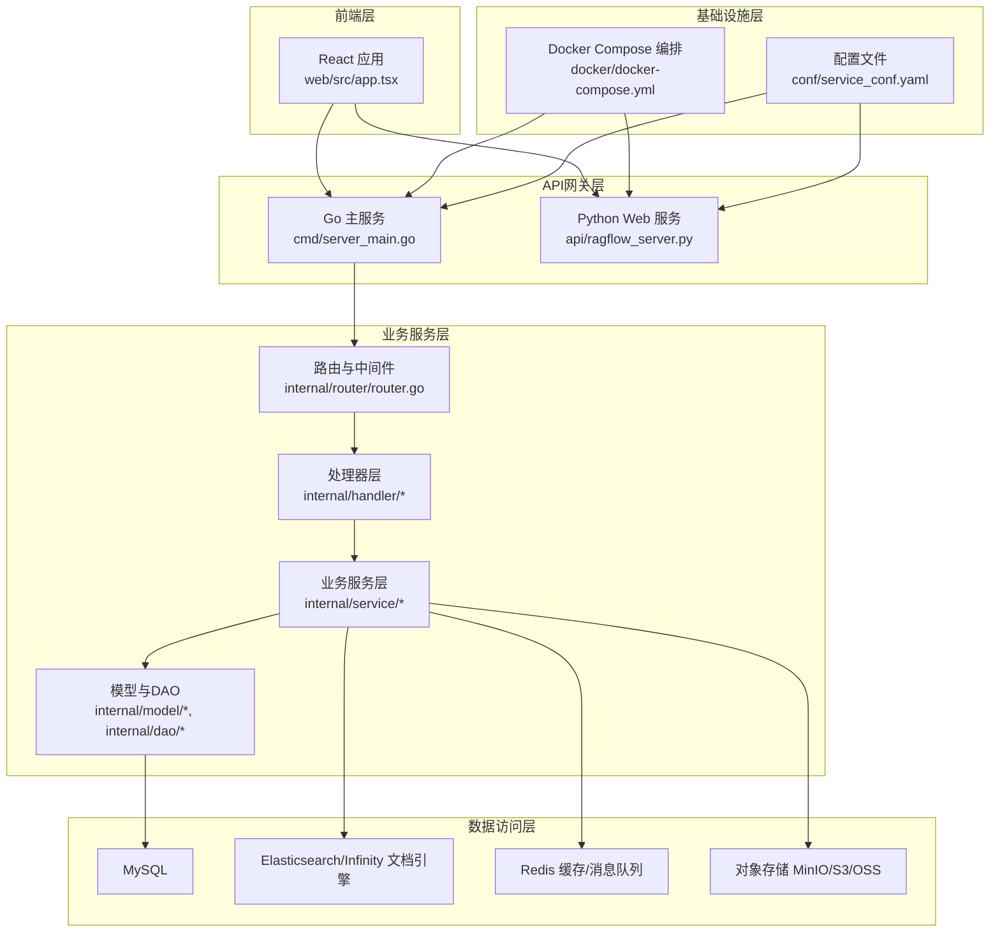
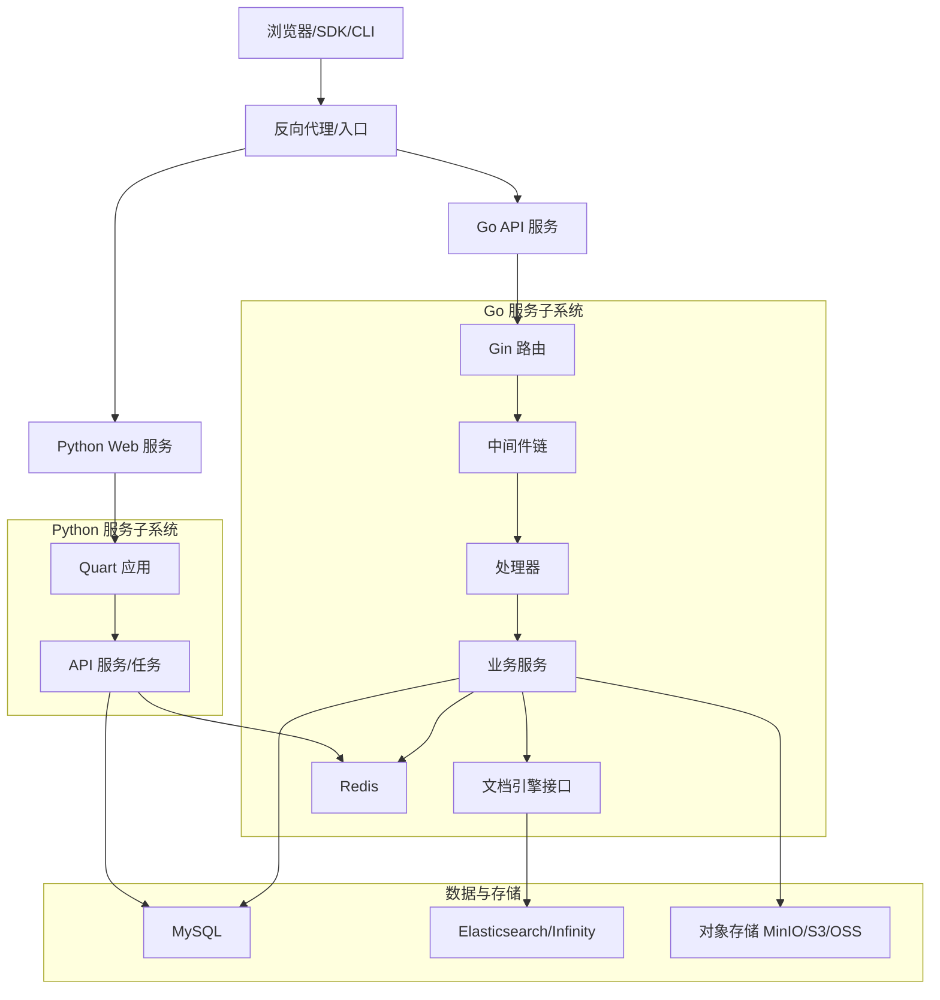
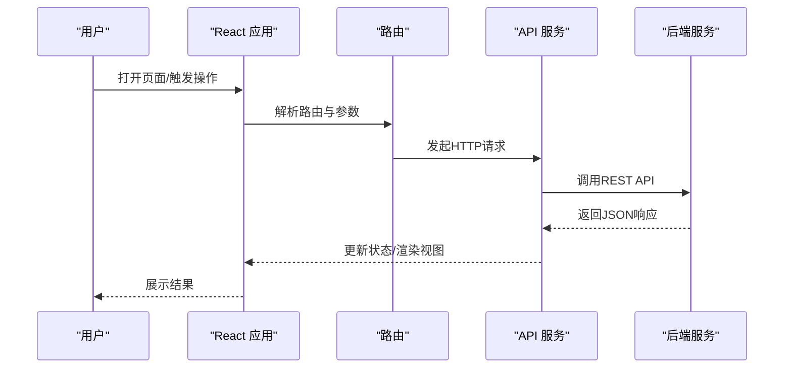
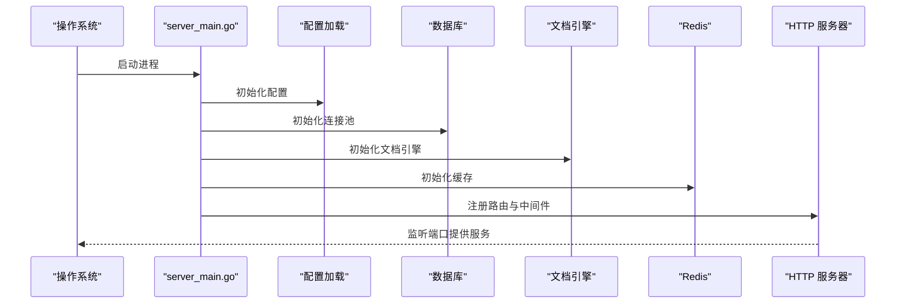
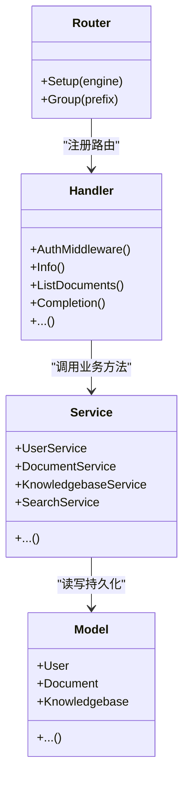
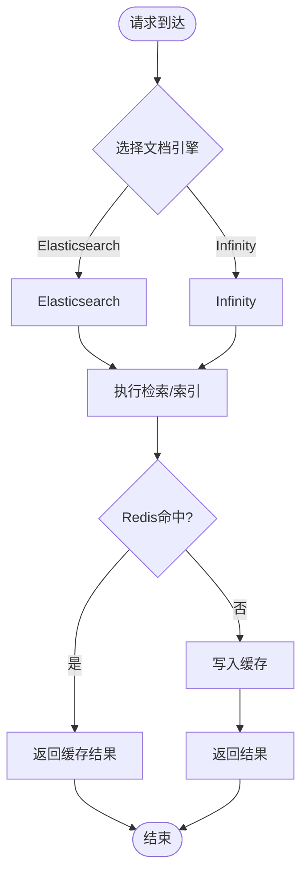
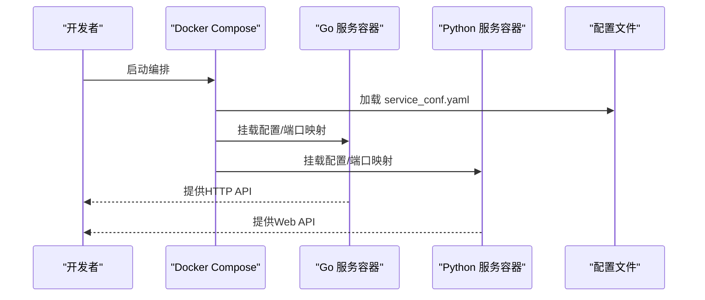
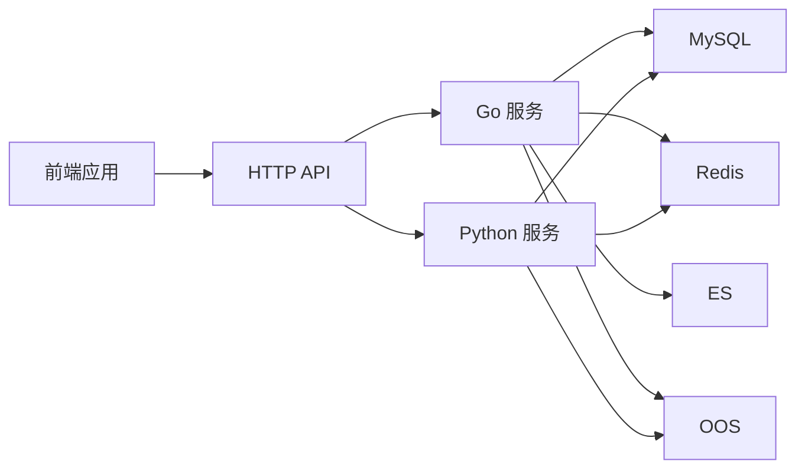

# 系统架构概览

<cite>
**本文档引用的文件**
- [README.md](file://README.md)
- [api/ragflow_server.py](file://api/ragflow_server.py)
- [cmd/server_main.go](file://cmd/server_main.go)
- [web/src/app.tsx](file://web/src/app.tsx)
- [internal/server/config.go](file://internal/server/config.go)
- [api/apps/api_app.py](file://api/apps/api_app.py)
- [internal/router/router.go](file://internal/router/router.go)
- [docker/docker-compose.yml](file://docker/docker-compose.yml)
- [conf/service_conf.yaml](file://conf/service_conf.yaml)
- [internal/engine/engine.go](file://internal/engine/engine.go)
- [internal/handler/common.go](file://internal/handler/common.go)
- [internal/model/base.go](file://internal/model/base.go)
- [rag/utils/redis_conn.py](file://rag/utils/redis_conn.py)
- [internal/common/status_message.go](file://internal/common/status_message.go)
</cite>

## 目录
1. [引言](#引言)
2. [项目结构](#项目结构)
3. [核心组件](#核心组件)
4. [架构总览](#架构总览)
5. [详细组件分析](#详细组件分析)
6. [依赖关系分析](#依赖关系分析)
7. [性能考量](#性能考量)
8. [故障排查指南](#故障排查指南)
9. [结论](#结论)
10. [附录](#附录)

## 引言
本文件面向RAGFlow项目的系统架构概览，聚焦于整体设计与分层职责，涵盖前后端分离、微服务设计、事件驱动与可插拔引擎等关键技术选型。文档从架构视角解释前端React应用层、API网关层、业务服务层、数据访问层与基础设施层之间的协作关系，并给出架构图表与组件交互图，帮助读者快速理解系统如何协同工作、如何扩展以及如何演进。

## 项目结构
RAGFlow采用多语言混合架构：
- 前端：基于React + TypeScript的单页应用（SPA），通过路由与状态管理提供用户界面与交互。
- 后端Go服务：作为主服务进程，负责路由注册、中间件、业务编排与对外HTTP服务。
- Python服务：作为Web后端，提供REST API、任务调度与数据库交互。
- 基础设施：通过Docker Compose编排MySQL、Redis、对象存储与搜索引擎等依赖服务。
- 配置中心：以YAML配置文件与环境变量结合的方式集中管理运行时参数。

**图表来源**
- [web/src/app.tsx:1-178](file://web/src/app.tsx#L1-L178)
- [cmd/server_main.go:1-280](file://cmd/server_main.go#L1-L280)
- [api/ragflow_server.py:1-155](file://api/ragflow_server.py#L1-L155)
- [internal/router/router.go:1-259](file://internal/router/router.go#L1-L259)
- [docker/docker-compose.yml:1-135](file://docker/docker-compose.yml#L1-L135)
- [conf/service_conf.yaml:1-160](file://conf/service_conf.yaml#L1-L160)

**章节来源**
- [README.md:140-144](file://README.md#L140-L144)
- [docker/docker-compose.yml:1-135](file://docker/docker-compose.yml#L1-L135)
- [conf/service_conf.yaml:1-160](file://conf/service_conf.yaml#L1-L160)

## 核心组件
- 前端应用（React）：负责用户界面、国际化、主题切换与路由管理，使用Ant Design与TanStack Query进行组件化与数据缓存。
- Go主服务：初始化配置、加载模型工厂、建立路由、注册中间件并启动HTTP服务；同时维护心跳上报与优雅停机。
- Python Web服务：负责数据库初始化、运行时配置加载、插件管理与定时任务（如进度更新）。
- 路由与处理器：统一暴露REST API，按资源域划分（用户、知识库、对话、文件、搜索等），并提供鉴权中间件。
- 数据与引擎：支持Elasticsearch与Infinity两种文档检索引擎；MySQL用于元数据存储；Redis用于缓存与消息队列；对象存储适配MinIO/S3/OSS。
- 配置与编排：通过YAML配置文件与环境变量组合，Docker Compose统一编排所有依赖服务。

**章节来源**
- [web/src/app.tsx:1-178](file://web/src/app.tsx#L1-L178)
- [cmd/server_main.go:155-280](file://cmd/server_main.go#L155-L280)
- [api/ragflow_server.py:74-155](file://api/ragflow_server.py#L74-L155)
- [internal/router/router.go:78-259](file://internal/router/router.go#L78-L259)
- [internal/server/config.go:32-202](file://internal/server/config.go#L32-L202)
- [docker/docker-compose.yml:1-135](file://docker/docker-compose.yml#L1-L135)
- [conf/service_conf.yaml:1-160](file://conf/service_conf.yaml#L1-L160)

## 架构总览
RAGFlow采用“前端-后端-引擎-存储”的分层架构，强调：
- 前后端分离：前端独立部署，后端以HTTP API提供能力。
- 微服务化：Go主服务与Python Web服务分别承担路由与业务逻辑，便于独立扩展与演进。
- 可插拔引擎：文档检索引擎支持Elasticsearch与Infinity，可通过配置切换。
- 事件驱动与消息队列：Redis作为消息队列与分布式锁，支撑异步任务与幂等处理。
- 配置即代码：通过YAML与环境变量统一管理，便于CI/CD与多环境部署。

**图表来源**
- [cmd/server_main.go:155-280](file://cmd/server_main.go#L155-L280)
- [internal/router/router.go:78-259](file://internal/router/router.go#L78-L259)
- [api/ragflow_server.py:74-155](file://api/ragflow_server.py#L74-L155)
- [internal/engine/engine.go:39-70](file://internal/engine/engine.go#L39-L70)

## 详细组件分析

### 前端应用层（React）
- 职责：提供国际化、主题切换、路由与全局状态管理；通过QueryClient实现请求缓存与重试策略。
- 关键点：使用Ant Design主题算法与多语言包；在开发模式下启用WhyDidYouRender辅助调试；响应式断点配置提升跨设备体验。

**图表来源**
- [web/src/app.tsx:171-178](file://web/src/app.tsx#L171-L178)

**章节来源**
- [web/src/app.tsx:1-178](file://web/src/app.tsx#L1-L178)

### API网关层（Go主服务）
- 职责：初始化日志、配置、数据库、文档引擎与缓存；注册路由与中间件；启动HTTP服务；维护心跳上报与优雅停机。
- 关键点：Gin框架的中间件链（日志、恢复）；按组划分受保护路由；健康检查端点；命令行参数覆盖端口配置。

**图表来源**
- [cmd/server_main.go:45-153](file://cmd/server_main.go#L45-L153)
- [internal/server/config.go:211-368](file://internal/server/config.go#L211-L368)

**章节来源**
- [cmd/server_main.go:155-280](file://cmd/server_main.go#L155-L280)
- [internal/server/config.go:32-202](file://internal/server/config.go#L32-L202)

### 业务服务层（Go/Python）
- Go侧：路由注册、处理器注入、服务实例化与中间件装配；对外暴露REST API。
- Python侧：数据库表初始化、运行时配置加载、超级用户初始化、插件管理与后台任务（如进度更新）。

**图表来源**
- [internal/router/router.go:25-76](file://internal/router/router.go#L25-L76)
- [internal/handler/common.go:26-37](file://internal/handler/common.go#L26-L37)
- [internal/model/base.go:25-81](file://internal/model/base.go#L25-L81)

**章节来源**
- [internal/router/router.go:78-259](file://internal/router/router.go#L78-L259)
- [internal/handler/common.go:1-38](file://internal/handler/common.go#L1-L38)
- [internal/model/base.go:1-81](file://internal/model/base.go#L1-L81)

### 数据访问层与引擎
- 文档引擎：抽象接口支持Elasticsearch与Infinity两种实现，通过配置动态选择。
- 元数据存储：MySQL承载用户、租户、知识库、对话等结构化数据。
- 缓存与消息：Redis用于缓存、分布式锁与消息队列（Stream/XREAD/XACK）。
- 对象存储：适配MinIO/S3/OSS，统一文件上传与归档。

**图表来源**
- [internal/engine/engine.go:39-70](file://internal/engine/engine.go#L39-L70)
- [conf/service_conf.yaml:22-33](file://conf/service_conf.yaml#L22-L33)
- [rag/utils/redis_conn.py:472-508](file://rag/utils/redis_conn.py#L472-L508)

**章节来源**
- [internal/engine/engine.go:1-70](file://internal/engine/engine.go#L1-L70)
- [conf/service_conf.yaml:16-98](file://conf/service_conf.yaml#L16-L98)
- [rag/utils/redis_conn.py:472-508](file://rag/utils/redis_conn.py#L472-L508)

### 配置与编排
- 配置来源：优先YAML配置文件，其次环境变量；支持动态覆盖端口、存储类型、文档引擎类型等。
- 编排方式：Docker Compose统一启动Go与Python服务，挂载配置文件与日志目录，映射端口并设置重启策略。

**图表来源**
- [docker/docker-compose.yml:1-135](file://docker/docker-compose.yml#L1-L135)
- [conf/service_conf.yaml:1-160](file://conf/service_conf.yaml#L1-L160)

**章节来源**
- [docker/docker-compose.yml:1-135](file://docker/docker-compose.yml#L1-L135)
- [conf/service_conf.yaml:1-160](file://conf/service_conf.yaml#L1-L160)

## 依赖关系分析
- 组件耦合：Go服务通过接口与抽象引擎解耦，业务服务通过DAO与模型解耦；前端仅依赖HTTP API。
- 外部依赖：MySQL、Redis、对象存储与文档引擎构成数据与检索基础设施；Docker Compose提供编排与网络。
- 运行时依赖：配置加载顺序影响服务启动；Redis用于分布式锁与消息队列；心跳上报用于运维可观测性。

**图表来源**
- [internal/server/config.go:32-202](file://internal/server/config.go#L32-L202)
- [internal/common/status_message.go:15-33](file://internal/common/status_message.go#L15-L33)

**章节来源**
- [internal/server/config.go:32-202](file://internal/server/config.go#L32-L202)
- [internal/common/status_message.go:1-33](file://internal/common/status_message.go#L1-L33)

## 性能考量
- 缓存策略：Redis作为热点数据缓存与消息队列，降低数据库与引擎压力；建议对高频查询结果进行合理TTL与失效策略。
- 并发与限流：Gin中间件链包含恢复机制；建议在网关层增加限流与熔断策略，避免级联故障。
- 存储与索引：根据文档引擎类型选择合适的分片与副本策略；对象存储建议开启压缩与CDN加速。
- 启动与热身：配置文件与环境变量加载应尽早完成；数据库与引擎初始化失败需快速失败并告警。

## 故障排查指南
- 心跳与可观测性：Go服务通过心跳上报到管理服务，异常时会记录错误并更新状态；检查心跳间隔与网络连通性。
- 分布式锁与队列：Redis Stream/XREAD/XACK用于消息消费与重试；若出现积压，检查消费者组与Pending消息。
- 日志与配置：查看容器日志与配置打印；确认端口映射、环境变量与配置文件路径正确。

**章节来源**
- [internal/common/status_message.go:15-33](file://internal/common/status_message.go#L15-L33)
- [rag/utils/redis_conn.py:472-508](file://rag/utils/redis_conn.py#L472-L508)
- [api/ragflow_server.py:74-155](file://api/ragflow_server.py#L74-L155)

## 结论
RAGFlow通过清晰的分层与可插拔设计，实现了前后端分离、微服务化与事件驱动的现代化架构。Go服务负责路由与编排，Python服务负责业务与任务，Redis与多种存储共同支撑高可用与高性能。配置即代码与Docker编排简化了部署与运维。未来可在网关层引入更细粒度的限流与熔断、增强可观测性与自动化治理，持续提升系统的弹性与可扩展性。

## 附录
- 架构演进方向：逐步引入服务网格与事件溯源，增强跨服务一致性与可观测性；探索无服务器化与边缘计算场景。
- 技术权衡：Go服务偏向高性能与低延迟，Python服务偏向易扩展与生态丰富；两者配合满足不同负载特征。
- 扩展性考虑：通过抽象引擎接口与配置切换，平滑迁移检索引擎；通过插件体系扩展工具与能力。