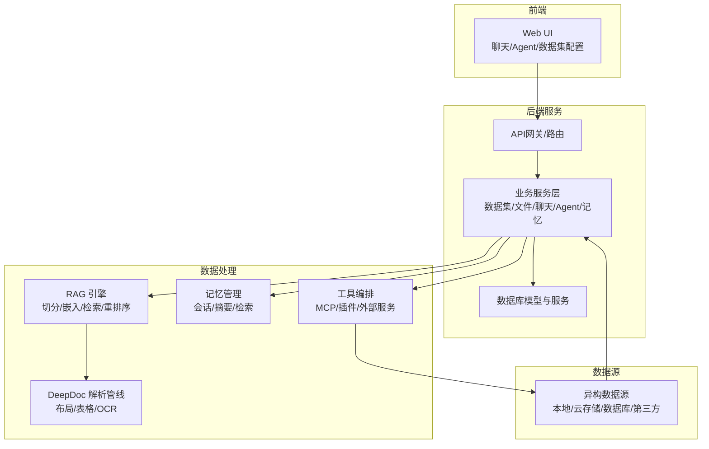
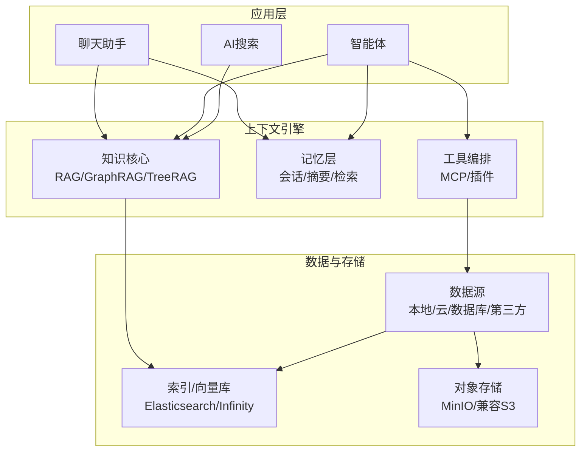
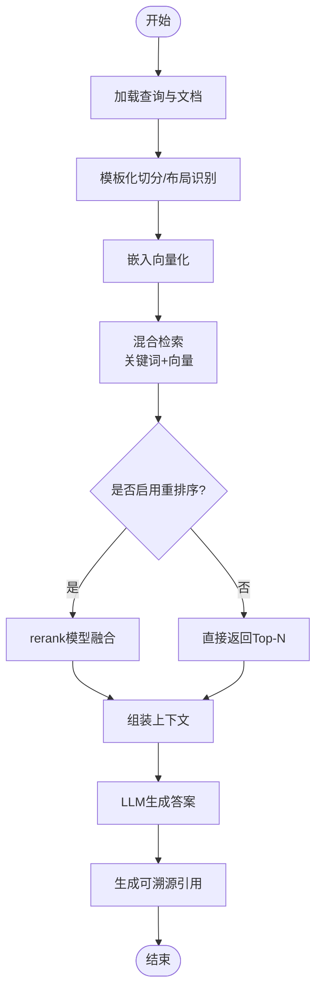
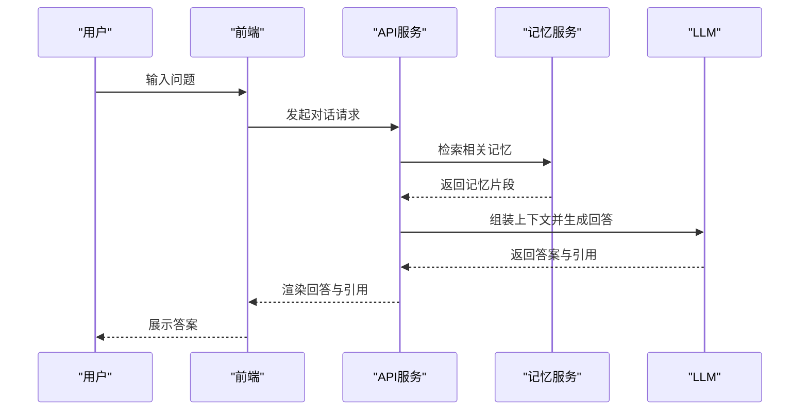
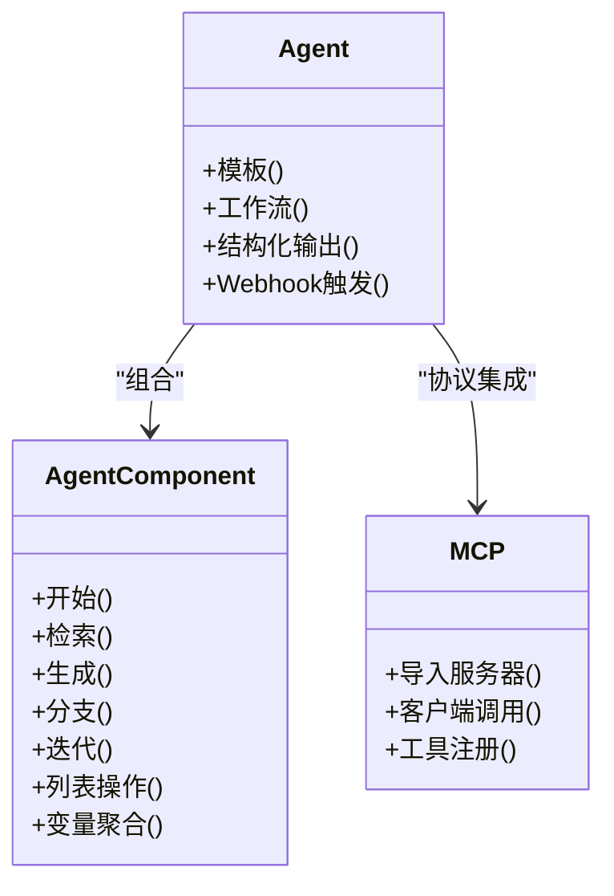
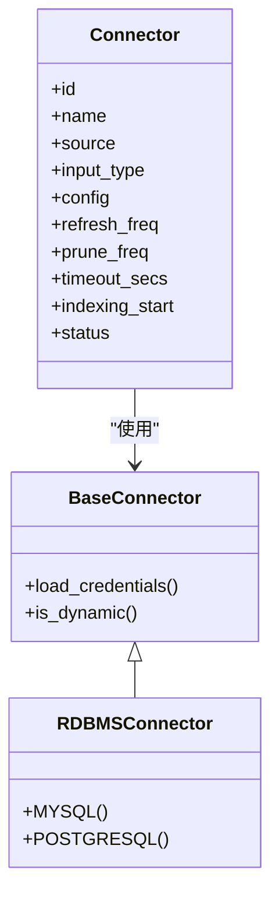
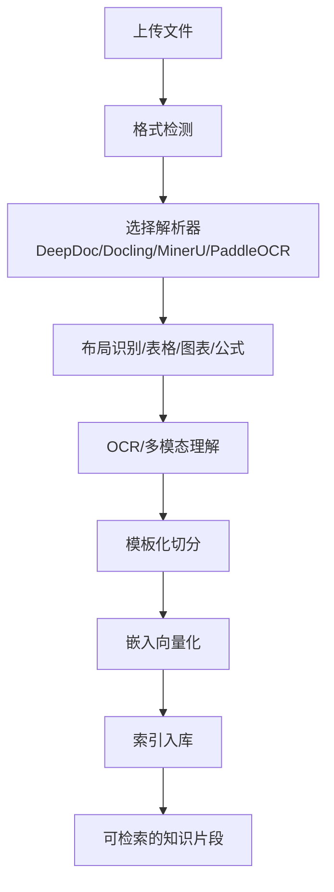
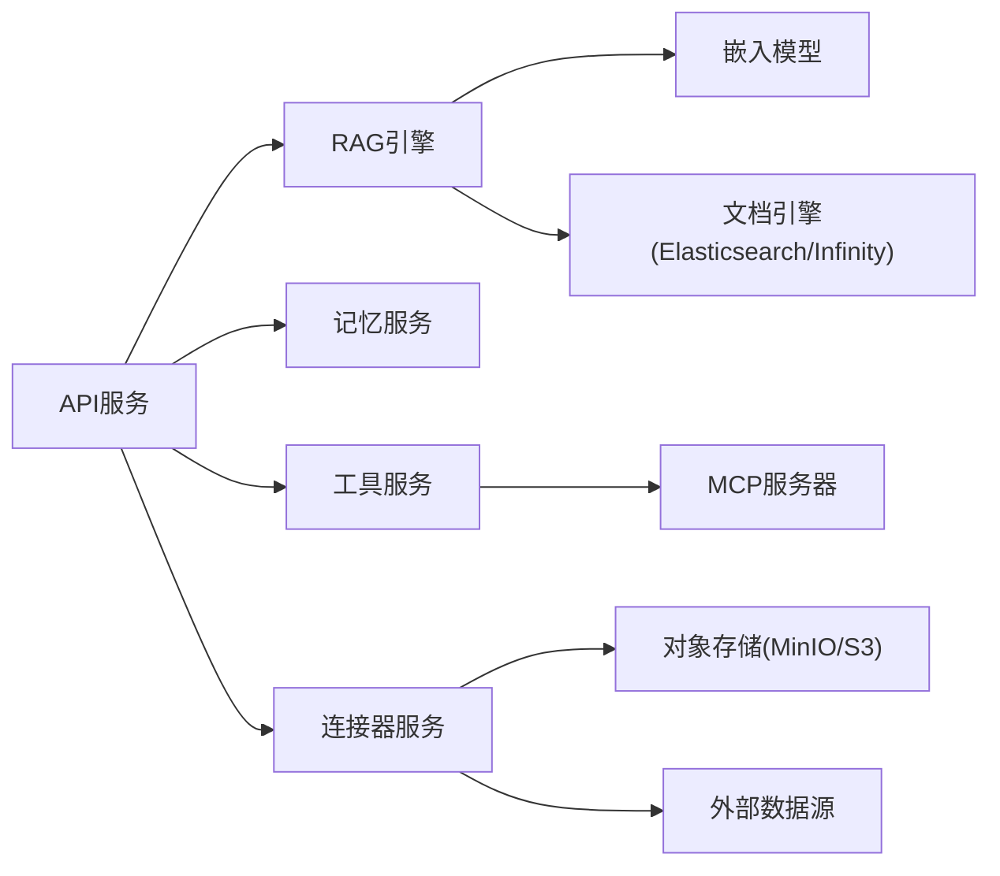

# 项目介绍与定位

<cite>
**本文引用的文件**
- [README.md](file://README.md)
- [docs/basics/rag.md](file://docs/basics/rag.md)
- [docs/basics/agent_context_engine.md](file://docs/basics/agent_context_engine.md)
- [docs/quickstart.mdx](file://docs/quickstart.mdx)
- [docs/guides/dataset/configure_knowledge_base.md](file://docs/guides/dataset/configure_knowledge_base.md)
- [docs/guides/dataset/run_retrieval_test.md](file://docs/guides/dataset/run_retrieval_test.md)
- [docs/guides/chat/start_chat.md](file://docs/guides/chat/start_chat.md)
- [docs/guides/agent/agent_introduction.md](file://docs/guides/agent/agent_introduction.md)
- [docs/references/glossary.mdx](file://docs/references/glossary.mdx)
- [docs/faq.mdx](file://docs/faq.mdx)
- [docs/administrator/upgrade_ragflow.mdx](file://docs/administrator/upgrade_ragflow.mdx)
- [api/db/db_models.py](file://api/db/db_models.py)
- [api/db/services/connector_service.py](file://api/db/services/connector_service.py)
- [common/data_source/interfaces.py](file://common/data_source/interfaces.py)
- [common/data_source/rdbms_connector.py](file://common/data_source/rdbms_connector.py)
- [deepdoc/vision/layout_recognizer.py](file://deepdoc/vision/layout_recognizer.py)
- [deepdoc/README.md](file://deepdoc/README.md)
- [api/apps/services/memory_api_service.py](file://api/apps/services/memory_api_service.py)
- [api/db/joint_services/memory_message_service.py](file://api/db/joint_services/memory_message_service.py)
- [web/src/hooks/use-memory-request.ts](file://web/src/hooks/use-memory-request.ts)
</cite>

## 目录
1. [引言](#引言)
2. [项目结构](#项目结构)
3. [核心组件](#核心组件)
4. [架构总览](#架构总览)
5. [详细组件分析](#详细组件分析)
6. [依赖关系分析](#依赖关系分析)
7. [性能考量](#性能考量)
8. [故障排查指南](#故障排查指南)
9. [结论](#结论)
10. [附录](#附录)

## 引言
RAGFlow 是一款领先的开源检索增强生成（RAG）引擎，将前沿的 RAG 技术与智能体（Agent）能力深度融合，为企业打造“上下文层”基础设施。它提供可适配任意规模企业的端到端 RAG 工作流，凭借融合式“上下文引擎”与预置的 Agent 模板，帮助开发者以极致效率与精度将复杂数据转化为高可信、生产级的人工智能系统。

- 价值主张
  - 以“高质量输入驱动高质量输出”的理念，通过深度文档理解与模板化切分，实现复杂非结构化数据的高保真知识抽取。
  - 以“检索即服务”的方式，提供多路召回、混合重排序与可解释的检索结果，显著降低幻觉风险，提升答案可信度。
  - 以“上下文引擎”为核心，打通“静态知识库（RAG）+ 动态交互记忆（Memory）+ 工具编排（Tool Orchestrator）”，构建面向智能体的统一上下文平台。
  - 提供开箱即用的 Agent 模板与无代码工作流编辑器，降低企业构建智能问答、研究助理、客服代理等应用的门槛。

- 目标用户
  - 企业研发团队：希望快速搭建可解释、可维护、可扩展的 RAG 应用。
  - 数据与AI工程师：需要对切分策略、检索参数、嵌入模型进行精细调优。
  - 业务与产品团队：通过无代码模板与可视化界面，快速落地智能客服、知识问答、报告生成等场景。

- 应用场景
  - 企业知识问答与内部搜索：基于私域文档与数据库，提供权威、可溯源的答案。
  - 复杂文档理解与专业问答：合同、法规、技术文档等高结构化内容的准确问答。
  - 动态知识融合与决策支持：跨系统、跨格式的数据整合与推理，辅助业务决策。
  - 智能体与自动化流程：结合工具调用与记忆管理，实现多轮对话与任务编排。

- 市场价值
  - 降低企业进入AI的门槛：提供可解释、可审计、可运维的RAG平台。
  - 提升生产力：通过自动化切分、检索与生成，减少重复劳动。
  - 增强安全性与合规性：私有部署、可溯源引用、细粒度权限控制。

**章节来源**
- [README.md:76-144](file://README.md#L76-L144)
- [docs/basics/rag.md:6-108](file://docs/basics/rag.md#L6-L108)
- [docs/basics/agent_context_engine.md:6-62](file://docs/basics/agent_context_engine.md#L6-L62)

## 项目结构
RAGFlow 采用前后端分离与模块化设计，核心模块包括：
- 文档解析与理解（DeepDoc）：支持多格式文档布局识别、表格/图表/公式抽取与OCR。
- 检索与生成（RAG）：向量化、混合检索、重排序、提示工程与上下文组装。
- 记忆与工具（Memory & Tools）：动态记忆管理、工具选择与编排。
- 智能体（Agent）：无代码工作流编辑器、组件化编排、MCP协议支持。
- 数据源与同步（Connectors）：支持多种异构数据源的增量/全量同步。
- 平台与服务（API/DB/Web）：REST/SDK接口、数据库模型、前端UI与运维工具。

**图示来源**
- [docs/basics/agent_context_engine.md:26-34](file://docs/basics/agent_context_engine.md#L26-L34)
- [deepdoc/README.md:131-147](file://deepdoc/README.md#L131-L147)
- [api/db/db_models.py:1171-1202](file://api/db/db_models.py#L1171-L1202)

**章节来源**
- [docs/basics/agent_context_engine.md:26-34](file://docs/basics/agent_context_engine.md#L26-L34)
- [deepdoc/README.md:131-147](file://deepdoc/README.md#L131-L147)
- [api/db/db_models.py:1171-1202](file://api/db/db_models.py#L1171-L1202)

## 核心组件
- 上下文引擎（Context Engine）
  - 知识核心（高级RAG）：TreeRAG、GraphRAG、长上下文目录、多路召回与融合重排序。
  - 记忆层（Memory）：会话历史、用户偏好、内部状态的动态检索与摘要。
  - 工具编排（Tool Orchestrator）：基于技能索引的工具选择与调用。
- 文档解析（DeepDoc）
  - 多格式解析、布局识别、表格/图表/公式抽取、OCR与多模态理解。
- 数据集与检索（Dataset & Retrieval）
  - 模板化切分、嵌入模型、元数据过滤、检索测试与调优。
- 智能体（Agent）
  - 组件化工作流、MCP协议、多Agent协作、结构化输出与可视化。
- 数据源与同步（Connectors）
  - 支持S3/MinIO、Google Drive、Notion、Confluence、Discord、JIRA、GitHub/GitLab、Slack、Teams、Zendesk、Airtable等。

**章节来源**
- [docs/basics/agent_context_engine.md:26-34](file://docs/basics/agent_context_engine.md#L26-L34)
- [docs/basics/rag.md:49-76](file://docs/basics/rag.md#L49-L76)
- [docs/guides/dataset/configure_knowledge_base.md:40-75](file://docs/guides/dataset/configure_knowledge_base.md#L40-L75)
- [docs/guides/agent/agent_introduction.md:18-34](file://docs/guides/agent/agent_introduction.md#L18-L34)
- [common/data_source/interfaces.py:203-210](file://common/data_source/interfaces.py#L203-L210)

## 架构总览
RAGFlow 的整体架构围绕“上下文引擎”展开，将 RAG、Memory 与 Tool Orchestrator 三者统一为一个服务层，向上支撑聊天、Agent、搜索等应用，向下对接多样的数据源与存储。

**图示来源**
- [docs/basics/agent_context_engine.md:26-34](file://docs/basics/agent_context_engine.md#L26-L34)
- [docs/basics/rag.md:49-76](file://docs/basics/rag.md#L49-L76)

## 详细组件分析

### RAG 引擎与检索
- 数据处理与向量化
  - 多格式文档解析与布局识别，支持表格、图表、公式等结构化抽取。
  - 切分策略与模板化，兼顾语义完整性与检索粒度。
- 检索与重排序
  - 混合检索：关键词（BM25）+ 向量相似度，支持rerank模型融合。
  - 知识图谱检索：GraphRAG 实现多跳实体/关系检索与社区报告聚合。
- 上下文构造与生成
  - 将检索到的片段与系统提示组合，交给LLM生成最终答案，并提供可溯源引用。

**图示来源**
- [docs/basics/rag.md:25-48](file://docs/basics/rag.md#L25-L48)
- [docs/guides/dataset/run_retrieval_test.md:16-22](file://docs/guides/dataset/run_retrieval_test.md#L16-L22)

**章节来源**
- [docs/basics/rag.md:25-48](file://docs/basics/rag.md#L25-L48)
- [docs/guides/dataset/run_retrieval_test.md:16-63](file://docs/guides/dataset/run_retrieval_test.md#L16-L63)

### 记忆管理（Memory）
- 动态记忆与生命周期
  - 存储原始对话、触发摘要形成语义记忆、按需检索过往交互。
- 与Agent/聊天的集成
  - 在对话中注入记忆上下文，提升个性化与连贯性。
- API与前端支持
  - 提供内存列表、配置查询与消息提取等接口，前端可查询与刷新。

**图示来源**
- [api/apps/services/memory_api_service.py:206-217](file://api/apps/services/memory_api_service.py#L206-L217)
- [api/db/joint_services/memory_message_service.py:53-83](file://api/db/joint_services/memory_message_service.py#L53-L83)
- [web/src/hooks/use-memory-request.ts:1-30](file://web/src/hooks/use-memory-request.ts#L1-L30)

**章节来源**
- [api/apps/services/memory_api_service.py:206-217](file://api/apps/services/memory_api_service.py#L206-L217)
- [api/db/joint_services/memory_message_service.py:53-83](file://api/db/joint_services/memory_message_service.py#L53-L83)
- [web/src/hooks/use-memory-request.ts:1-30](file://web/src/hooks/use-memory-request.ts#L1-L30)

### 智能体（Agent）与工具编排
- 组件化工作流
  - Begin/End、Retrieval、Generate、Switch、Iteration、List Operations、Variable Aggregator等组件构成可复用的Agent模板。
- MCP 协议与工具选择
  - 基于工具与技能索引的动态选择，避免在提示词中堆砌大量工具描述。
- 多Agent协作与结构化输出
  - 支持多Agent协同、结构化输出、Webhook触发与可视化。

**图示来源**
- [docs/guides/agent/agent_introduction.md:18-34](file://docs/guides/agent/agent_introduction.md#L18-L34)
- [docs/basics/agent_context_engine.md:30-34](file://docs/basics/agent_context_engine.md#L30-L34)

**章节来源**
- [docs/guides/agent/agent_introduction.md:18-34](file://docs/guides/agent/agent_introduction.md#L18-L34)
- [docs/basics/agent_context_engine.md:30-34](file://docs/basics/agent_context_engine.md#L30-L34)

### 数据源与同步（Connectors）
- 支持范围
  - S3/MinIO、Google Drive、Notion、Confluence、Discord、JIRA、GitHub/GitLab、Slack、Teams、Zendesk、Airtable、IMAP、Gmail、WebDAV、Bitbucket、Asana、Seafile、Moodle、DingTalk AI Table等。
- 连接器抽象
  - 统一的连接器接口与凭证管理，支持轮询/事件驱动的增量同步。
- 关联与调度
  - Connector与知识库关联、自动解析开关、任务调度与日志记录。

**图示来源**
- [common/data_source/interfaces.py:203-210](file://common/data_source/interfaces.py#L203-L210)
- [common/data_source/rdbms_connector.py:19-22](file://common/data_source/rdbms_connector.py#L19-L22)
- [api/db/db_models.py:1171-1189](file://api/db/db_models.py#L1171-L1189)

**章节来源**
- [common/data_source/interfaces.py:203-210](file://common/data_source/interfaces.py#L203-L210)
- [common/data_source/rdbms_connector.py:19-22](file://common/data_source/rdbms_connector.py#L19-L22)
- [api/db/db_models.py:1171-1189](file://api/db/db_models.py#L1171-L1189)

### 文档解析（DeepDoc）
- 多格式支持
  - PDF、DOCX、EXCEL、PPT、TXT、MD/MDX、JSON、HTML、图片等。
- 结构化抽取
  - 布局识别、表格/图表/公式转自然语言、图片文字识别与上下文描述。
- 性能与可扩展
  - 支持本地/远程解析器（如Docling Serve、MinerU、PaddleOCR），可按需切换后端。

**图示来源**
- [deepdoc/README.md:131-147](file://deepdoc/README.md#L131-L147)
- [deepdoc/vision/layout_recognizer.py:48-66](file://deepdoc/vision/layout_recognizer.py#L48-L66)

**章节来源**
- [deepdoc/README.md:131-147](file://deepdoc/README.md#L131-L147)
- [deepdoc/vision/layout_recognizer.py:48-66](file://deepdoc/vision/layout_recognizer.py#L48-L66)

## 依赖关系分析
- 组件耦合与内聚
  - 上下文引擎作为核心服务层，向上提供统一接口，向下解耦解析、检索、记忆与工具。
  - Connectors 与数据集服务解耦，便于扩展新的数据源。
- 外部依赖
  - Elasticsearch/Infinity 作为文档引擎，提供混合检索与元数据过滤。
  - MinIO/兼容S3 作为对象存储，承载文件与中间产物。
  - LLM/Embedding/Rerank 由外部模型提供方或本地部署提供。
- 接口契约
  - REST/SDK API 明确请求/响应结构，便于第三方集成。
  - MCP 协议定义工具导入与调用规范。

**图示来源**
- [docs/basics/rag.md:69-76](file://docs/basics/rag.md#L69-L76)
- [docs/faq.mdx:63-67](file://docs/faq.mdx#L63-L67)

**章节来源**
- [docs/basics/rag.md:69-76](file://docs/basics/rag.md#L69-L76)
- [docs/faq.mdx:63-67](file://docs/faq.mdx#L63-L67)

## 性能考量
- 检索性能
  - 混合检索与重排序会增加延迟，建议根据场景选择是否启用rerank与知识图谱。
  - TopN与相似度阈值影响召回质量与响应时间，应结合业务调优。
- 解析与嵌入
  - 大文件分页批处理、GPU加速（DeepDoc）、批大小可调，平衡吞吐与内存占用。
- 记忆与工具
  - 记忆摘要与工具检索可显著提升上下文质量，但需权衡计算成本。
- 存储与网络
  - 对象存储与文档引擎的可用性直接影响系统稳定性，建议监控与容量规划。

**章节来源**
- [docs/guides/dataset/run_retrieval_test.md:30-63](file://docs/guides/dataset/run_retrieval_test.md#L30-L63)
- [docs/faq.mdx:480-488](file://docs/faq.mdx#L480-L488)

## 故障排查指南
- 启动与网络
  - 未完全初始化导致登录异常：等待服务日志显示“Running on all addresses”，再访问。
  - Elasticsearch/Infinity 不可用：检查容器健康状态与 vm.max_map_count 设置。
- 模型与依赖
  - HuggingFace 访问失败：配置 HF_ENDPOINT 或挂载本地缓存。
  - Ollama/IP可达性：确保RAGFlow与Ollama在同一LAN或公网IP可访问。
- 解析卡顿
  - 小百分比卡住：重启解析任务；接近完成卡住：提高内存限制。
- API与集成
  - 获取API Key与SDK使用：参考HTTP/Python API参考与获取密钥文档。
  - 升级与回滚：遵循升级文档，注意数据卷清理与版本兼容。

**章节来源**
- [docs/faq.mdx:204-224](file://docs/faq.mdx#L204-L224)
- [docs/faq.mdx:154-182](file://docs/faq.mdx#L154-L182)
- [docs/faq.mdx:235-270](file://docs/faq.mdx#L235-L270)
- [docs/faq.mdx:446-448](file://docs/faq.mdx#L446-L448)
- [docs/administrator/upgrade_ragflow.mdx:14-16](file://docs/administrator/upgrade_ragflow.mdx#L14-L16)

## 结论
RAGFlow 以“上下文引擎”为核心，将 RAG、Memory 与 Tool Orchestrator 有机融合，为企业提供从数据接入、知识抽取、检索生成到智能体编排的一体化能力。通过模板化切分、混合检索、可解释引用与工具编排，RAGFlow 不仅解决了传统RAG在“静态知识、盲点数据、幻觉风险”等方面的局限，更面向Agent时代提供了可扩展、可运维、可审计的上下文基础设施。面向未来，RAGFlow 将持续演进为“上下文工程2.0”的核心平台，推动企业AI从“问答增强”走向“智能体增强”。

## 附录

### 使用场景与价值
- 企业知识问答：基于私域文档与数据库，提供权威、可溯源的答案，满足安全与合规要求。
- 复杂文档理解：合同、法规、技术文档等高结构化内容的准确问答，保障上下文完整性。
- 动态知识融合：跨系统、跨格式的数据整合与推理，辅助业务决策与报告生成。
- 智能体与自动化：结合工具调用与记忆管理，实现多轮对话、任务编排与结构化输出。

**章节来源**
- [docs/basics/rag.md:85-95](file://docs/basics/rag.md#L85-L95)

### 快速开始与配置要点
- 快速开始：Docker一键部署、服务健康检查、LLM配置与数据集创建。
- 数据集配置：模板化切分、嵌入模型选择、文件上传与解析、检索测试。
- 聊天与Agent：系统提示、相似度阈值、TopN、重排序、跨语言搜索、结构化输出。

**章节来源**
- [docs/quickstart.mdx:40-250](file://docs/quickstart.mdx#L40-L250)
- [docs/guides/dataset/configure_knowledge_base.md:25-126](file://docs/guides/dataset/configure_knowledge_base.md#L25-L126)
- [docs/guides/chat/start_chat.md:16-119](file://docs/guides/chat/start_chat.md#L16-L119)

### 术语与概念
- 跨语言检索：在多语言环境下，通过系统默认模型翻译查询，实现跨语言语义匹配。
- 上下文引擎：将RAG、Memory与Tool Orchestrator统一为端到端的上下文装配平台。

**章节来源**
- [docs/references/glossary.mdx:20-27](file://docs/references/glossary.mdx#L20-L27)
- [docs/basics/agent_context_engine.md:6-12](file://docs/basics/agent_context_engine.md#L6-L12)