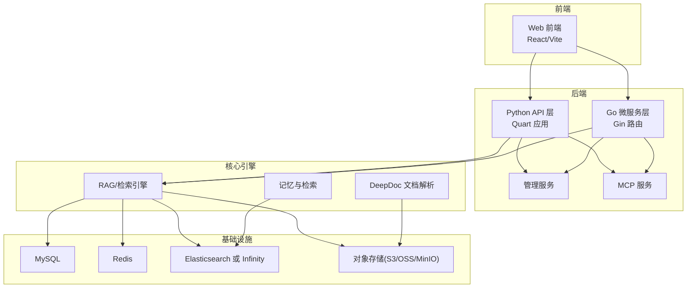
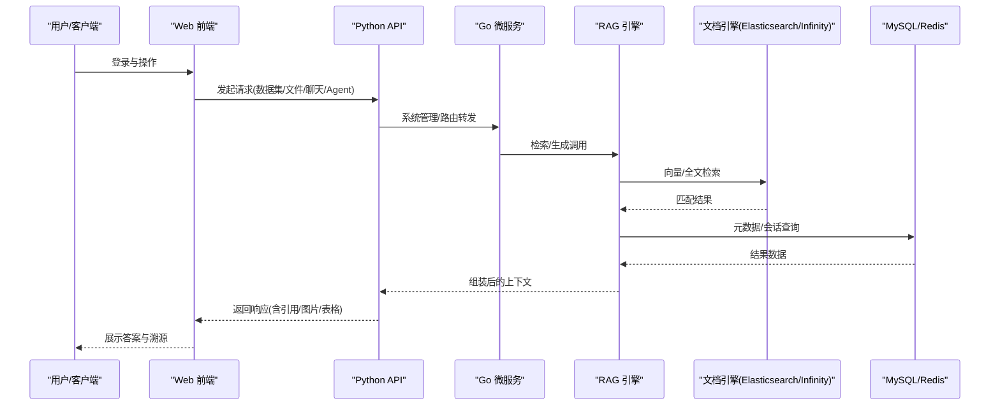
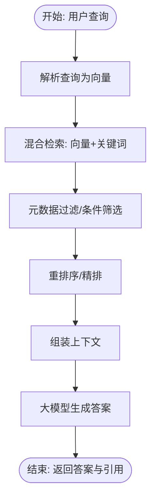
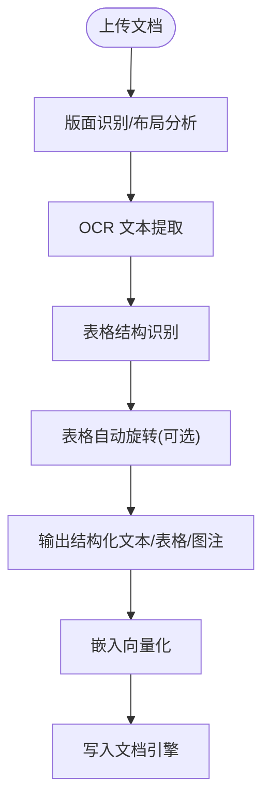
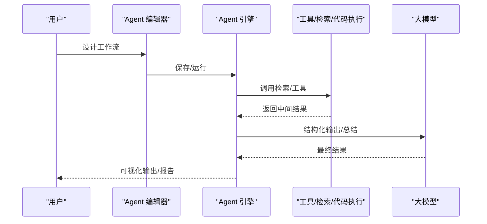
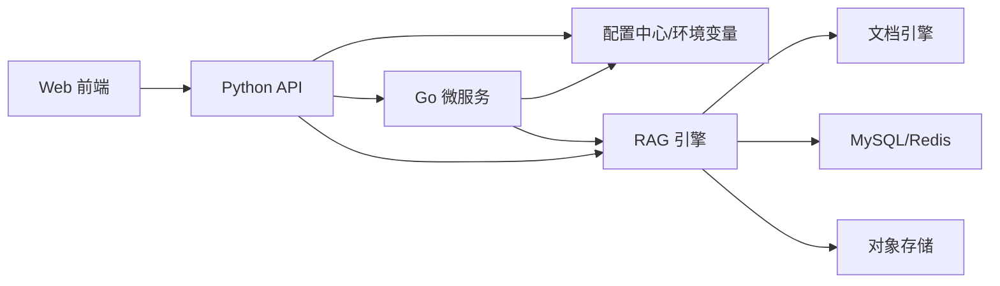

# 项目概述

<cite>
**本文引用的文件**
- [README.md](file://README.md)
- [docs/quickstart.mdx](file://docs/quickstart.mdx)
- [docs/basics/rag.md](file://docs/basics/rag.md)
- [docs/guides/agent/agent_introduction.md](file://docs/guides/agent/agent_introduction.md)
- [docs/release_notes.md](file://docs/release_notes.md)
- [api/ragflow_server.py](file://api/ragflow_server.py)
- [internal/server/config.go](file://internal/server/config.go)
- [internal/router/router.go](file://internal/router/router.go)
- [common/settings.py](file://common/settings.py)
- [deepdoc/README.md](file://deepdoc/README.md)
- [docker/docker-compose.yml](file://docker/docker-compose.yml)
- [api/apps/api_app.py](file://api/apps/api_app.py)
- [web/package.json](file://web/package.json)
</cite>

## 目录
1. [引言](#引言)
2. [项目结构](#项目结构)
3. [核心组件](#核心组件)
4. [架构总览](#架构总览)
5. [详细组件分析](#详细组件分析)
6. [依赖关系分析](#依赖关系分析)
7. [性能考量](#性能考量)
8. [故障排查指南](#故障排查指南)
9. [结论](#结论)
10. [附录](#附录)

## 引言
RAGFlow 是一个开源的检索增强生成（RAG）引擎，将前沿的 RAG 技术与智能体（Agent）能力深度融合，为企业构建强大的“上下文层”。它以“高质量输入即高质量输出”的理念，提供从复杂非结构化数据中抽取知识、可解释的模板化分块、跨语言检索、多模态理解、以及兼容多种异构数据源的自动化 RAG 工作流。系统采用前后端分离、Go/Gin 后端 + Python/Quart 前后端协同、容器化部署，并支持事件驱动与任务执行器，满足企业级规模的可扩展与稳定性需求。

## 项目结构
RAGFlow 仓库采用模块化组织方式，按职责划分为前端 Web、后端 API、Go 微服务、RAG/检索核心、深度文档解析（DeepDoc）、数据源连接器、内存与检索工具、MCP 服务、SDK 等多个子系统。下图展示主要模块与交互关系：

图表来源
- [docker/docker-compose.yml:1-135](file://docker/docker-compose.yml#L1-L135)
- [internal/router/router.go:78-258](file://internal/router/router.go#L78-L258)
- [api/ragflow_server.py:100-155](file://api/ragflow_server.py#L100-L155)
- [common/settings.py:260-336](file://common/settings.py#L260-L336)

章节来源
- [README.md:140-144](file://README.md#L140-L144)
- [docker/docker-compose.yml:1-135](file://docker/docker-compose.yml#L1-L135)

## 核心组件
- 检索与生成引擎：负责向量/关键词混合召回、重排序、上下文构造与答案生成；支持多模型工厂与默认模型配置。
- 深度文档解析（DeepDoc）：提供 OCR、版面识别、表格结构识别、自动旋转等能力，覆盖 PDF/DOCX/EXCEL/PPT 等格式。
- 智能体（Agent）：无代码工作流编辑器与图编排框架，支持多 Agent 协作、结构化输出、Webhook 触发、代码执行沙箱等。
- 数据源连接器：统一抽象多源接入（GitHub/Google Drive/Notion/S3/Confluence/Discord 等），并支持增量同步。
- 记忆与检索：支持会话记忆、消息检索、向量与全文检索结合，提升对话连贯性与事实性。
- 管理与运维：内置管理服务、健康检查、令牌管理、可视化监控与升级迁移工具链。
- 前后端分离：Web 前端基于 React/Vite，后端 API 提供 HTTP 与 Python SDK 接口，便于集成业务系统。

章节来源
- [docs/basics/rag.md:49-107](file://docs/basics/rag.md#L49-L107)
- [deepdoc/README.md:1-147](file://deepdoc/README.md#L1-L147)
- [docs/guides/agent/agent_introduction.md:1-54](file://docs/guides/agent/agent_introduction.md#L1-L54)
- [common/settings.py:260-336](file://common/settings.py#L260-L336)

## 架构总览
RAGFlow 的系统架构围绕“文档解析 → 向量化与索引 → 检索与重排序 → 上下文组装 → 大模型生成”闭环展开。后端通过 Go 微服务提供路由与系统管理，Python API 层承载业务接口与任务调度，前端通过 Web UI 与 SDK 进行交互。文档引擎可切换 Elasticsearch 或 Infinity，存储层支持 S3/OSS/MinIO 等对象存储，数据库与缓存分别用于元数据与消息队列。

图表来源
- [internal/router/router.go:78-258](file://internal/router/router.go#L78-L258)
- [api/ragflow_server.py:146-155](file://api/ragflow_server.py#L146-L155)
- [common/settings.py:260-336](file://common/settings.py#L260-L336)

章节来源
- [README.md:140-144](file://README.md#L140-L144)
- [internal/server/config.go:35-49](file://internal/server/config.go#L35-L49)

## 详细组件分析

### 检索与生成引擎
- 检索策略：支持向量相似度与关键词（BM25）混合召回，结合元数据过滤与重排序，提升召回精度与相关性。
- 上下文构造：将检索到的片段与提示词工程结合，生成可溯源的答案；支持长上下文优化（如目录结构抽取）。
- 多模态支持：图像/表格/公式等多模态内容经视觉模型解析后转化为高保真文本，提升检索与生成质量。
- 模型工厂：统一接入多家大模型厂商，支持动态切换与默认模型配置，便于企业按需选择。

图表来源
- [docs/basics/rag.md:25-47](file://docs/basics/rag.md#L25-L47)
- [common/settings.py:337-341](file://common/settings.py#L337-L341)

章节来源
- [docs/basics/rag.md:49-107](file://docs/basics/rag.md#L49-L107)
- [common/settings.py:260-336](file://common/settings.py#L260-L336)

### 深度文档解析（DeepDoc）
- OCR/版面识别/表格结构识别：针对扫描件、PDF、表格等复杂文档进行高精度布局与结构恢复。
- 表格自动旋转：对旋转表格进行角度检测与矫正，显著提升 OCR 与结构识别准确率。
- 多格式解析：覆盖 PDF/DOCX/EXCEL/PPT 等，输出带位置信息的文本块、表格与图注，便于后续检索与生成。

图表来源
- [deepdoc/README.md:46-147](file://deepdoc/README.md#L46-L147)
- [common/settings.py:260-336](file://common/settings.py#L260-L336)

章节来源
- [deepdoc/README.md:1-147](file://deepdoc/README.md#L1-L147)

### 智能体（Agent）与工作流
- 无代码编辑器：拖拽式组件拼装，支持分支、循环、迭代、变量聚合、列表操作等控制流。
- 多 Agent 协作：支持主从 Agent、并行工具调用、结构化输出与会话保留。
- 执行沙箱：支持本地 gVisor 与阿里云沙箱，安全执行代码类工具。
- 集成 MCP：支持 MCP Server 导入、Agent 作为 MCP 客户端、RAGFlow 自身作为 MCP Server。

图表来源
- [docs/guides/agent/agent_introduction.md:18-54](file://docs/guides/agent/agent_introduction.md#L18-L54)
- [api/apps/api_app.py:26-118](file://api/apps/api_app.py#L26-L118)

章节来源
- [docs/guides/agent/agent_introduction.md:1-54](file://docs/guides/agent/agent_introduction.md#L1-L54)
- [api/apps/api_app.py:1-118](file://api/apps/api_app.py#L1-L118)

### 数据源连接器与同步
- 统一抽象：通过统一接口适配 GitHub/Google Drive/Notion/S3/Confluence/Discord 等多源数据。
- 增量同步：支持定时或事件触发的数据同步，降低重复处理成本。
- 安全访问：支持 OAuth、API Key、IAM 等认证方式，保障企业数据安全。

章节来源
- [README.md:91-101](file://README.md#L91-L101)
- [docs/release_notes.md:46-50](file://docs/release_notes.md#L46-L50)

### 记忆与检索
- 会话记忆：在对话过程中维护上下文，结合检索结果生成更贴切的答案。
- 多引擎支持：文档引擎可切换 Elasticsearch 或 Infinity，消息存储与文档存储保持一致。

章节来源
- [docs/basics/rag.md:78-83](file://docs/basics/rag.md#L78-L83)
- [common/settings.py:287-301](file://common/settings.py#L287-L301)

### 管理与运维
- 管理服务：提供图形化管理界面、服务状态监控、令牌管理与团队协作。
- 健康检查：内置健康检查端点与日志采集，便于快速定位问题。
- 升级与迁移：提供升级指引与迁移脚本，保障平滑演进。

章节来源
- [internal/router/router.go:80-85](file://internal/router/router.go#L80-L85)
- [api/ragflow_server.py:146-155](file://api/ragflow_server.py#L146-L155)

## 依赖关系分析
RAGFlow 的依赖关系体现为“前端 → Python API → Go 微服务 → 核心引擎/存储”的分层依赖，同时通过统一配置中心与环境变量实现松耦合。

图表来源
- [internal/server/config.go:35-49](file://internal/server/config.go#L35-L49)
- [common/settings.py:174-336](file://common/settings.py#L174-L336)
- [docker/docker-compose.yml:1-135](file://docker/docker-compose.yml#L1-L135)

章节来源
- [internal/server/config.go:211-703](file://internal/server/config.go#L211-L703)
- [common/settings.py:174-414](file://common/settings.py#L174-L414)

## 性能考量
- 检索性能：混合检索与重排序策略减少无关召回，元数据过滤降低无效计算。
- 并行与并发：后端采用异步框架与任务队列，提升高并发下的吞吐与响应时间。
- 存储与索引：支持 Elasticsearch 与 Infinity，可根据场景选择最优文档引擎。
- 多模态优化：DeepDoc 的版面识别与表格结构识别减少信息损失，提高检索质量。
- 部署弹性：容器化与多端口映射便于横向扩展与资源隔离。

## 故障排查指南
- 启动确认：服务启动后需等待初始化完成，可通过日志确认“Running on all addresses”等关键输出。
- 端口与网络：确保宿主机端口映射正确，必要时调整 docker-compose 映射与防火墙设置。
- 文档引擎切换：切换文档引擎（如从 Elasticsearch 到 Infinity）需重启容器并清理卷（注意数据丢失风险）。
- 模型与密钥：确保默认模型工厂、API Key、Base URL 正确配置，避免调用失败。
- 日志与健康检查：通过健康检查端点与日志定位异常，关注检索/生成链路中的错误节点。

章节来源
- [README.md:220-254](file://README.md#L220-L254)
- [docs/quickstart.mdx:222-242](file://docs/quickstart.mdx#L222-L242)
- [internal/router/router.go:80-85](file://internal/router/router.go#L80-L85)

## 结论
RAGFlow 将 RAG 与智能体能力深度融合，提供从文档解析、检索、生成到智能体编排的完整能力闭环。其模块化架构、多引擎可选、多模态支持与企业级运维工具，使其既能满足初学者快速上手，也能支撑大型企业的生产化落地。随着版本持续演进，RAGFlow 在检索精度、Agent 能力、多模态理解与生态集成方面不断突破，成为构建可信、可控、可扩展的下一代智能应用基础设施。

## 附录
- 快速开始与部署：参考官方文档与 Docker Compose 指南，完成基础环境准备与服务启动。
- 使用场景建议：企业知识问答、合同/法规专业问答、动态知识融合与决策支持、客服与培训问答、简历筛选与分析等。
- 开发者参考：HTTP API 与 Python SDK 参考、MCP 集成、Agent 组件参考与最佳实践。

章节来源
- [docs/quickstart.mdx:1-363](file://docs/quickstart.mdx#L1-L363)
- [web/package.json:1-197](file://web/package.json#L1-L197)