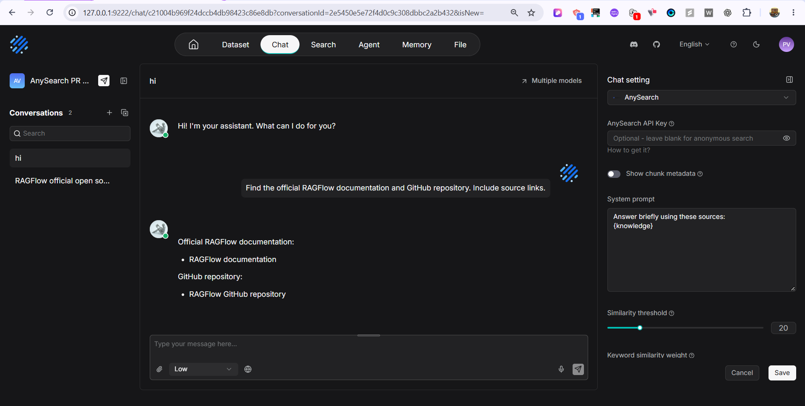

# AnySearch web search

AnySearch is a built-in web search provider for the Go Chat backend. Select it in
Chat settings and enable **Internet** in the message composer. An API key is
optional: anonymous requests use the same search endpoint with lower
service-controlled limits.

## Configuration

1. Open the Chat application's settings and select **AnySearch** as the web search provider.
2. Leave the API key empty for anonymous access, or enter a key from the
   [AnySearch console](https://anysearch.com/console/api-keys).
3. Save the settings and enable **Internet** before sending a message.



The saved settings use these fields:

```json
{
  "web_search_provider": "anysearch",
  "anysearch_api_key": ""
}
```

Only the selected provider's saved key is used. A blank or whitespace-only key
sends no Authorization header. There is no AnySearch environment-variable
fallback, and another provider's saved key is not used. Clearing the provider
disables web search even when old keys remain saved.

Result URLs must be parseable absolute HTTP(S) URLs with a nonempty hostname.
Invalid URLs are discarded before the usable-result limit is applied.

For a web-only Chat, retain the system prompt's `{knowledge}` placeholder and
its dynamic `knowledge` parameter, keep the empty-response text blank and select
a usable chat model. The current retrieval path requires that parameter even
when no datasets are selected. Internet being enabled or a model producing an
answer alone does not demonstrate a search request.

## Requests and results

The provider sends one `POST https://api.anysearch.com/v1/search` request per
query with `Content-Type: application/json`:

```json
{"query": "the actual search query", "max_results": 6}
```

A nonblank saved key adds `Authorization: Bearer <key>`. Requests have a
30-second timeout, honor caller cancellation and refuse redirects. POST requests
are not retried, including after authentication or quota failures.

A successful response must contain an integer `code` equal to zero, an object
`data` and an array `data.results`. Each result's title, URL and content are
mapped to Chat's native chunks and document references. Nonblank `content`
takes precedence over `snippet`; the existing payload builder trims text and
keeps at most six usable results after filtering blank URLs or text. Empty
results are a successful empty retrieval. Invalid envelopes or field types
are errors, not empty success.

HTTP failures, nonzero business codes, timeouts, cancellation, malformed responses
and responses larger than 4 MiB return provider errors. Diagnostics retain safe
status/code/category information without raw upstream bodies, messages or
credential-bearing transport errors. Invalid keys are not retried anonymously.
The existing Chat and reasoning paths may log a search failure and continue
generating an answer; this does not mean AnySearch succeeded.

## Maintenance and validation

Registration, transport and decoding live in
`internal/service/web_search_provider.go`. Deterministic tests are in
`internal/service/web_search_anysearch_test.go` alongside the existing provider
regressions. The frontend reuses the Chat provider catalog, saved-setting schema
and optional-key policy.

Run through the repository's prepared native build environment:

```bash
bash build.sh --test -run AnySearch ./internal/service/...
bash build.sh --test ./internal/service/...
RAGFLOW_TEST_ANYSEARCH=1 bash build.sh --test-integration-go -run TestAnySearchLiveProvider -v ./internal/service/...
bash build.sh --go
./bin/ragflow_server --api --help
cd web
npm run type-check
npm run build
```

Verify the binary output path against the current build script. Frontend tests
cover selection, key validation, settings round trips and Internet availability.
For real-service validation, use the normal saved Chat configuration and record
the actual request, HTTP/business status, returned URLs, delivered references and
`request_id` when available. Keep credentials out of evidence. Tests contacting
real services belong in the integration/e2e tier.

The opt-in live provider test calls the real endpoint and correlates its returned
text, titles and URLs with native chunks. Set `ANYSEARCH_TEST_API_KEY` privately
to include a keyed request in that test; this variable is test-only and does not
configure Chat. The live provider test does not replace normal Chat validation.

This Chat provider exposes general search. Agent/Canvas tools, capability
discovery, explicit vertical/source controls, parallel search and URL extraction
are separate follow-up integrations. Chat registration does not register Canvas
tools. Merge and release inclusion are separate from local implementation and
validation.

Protocol source: [official REST specification](https://github.com/anysearch-ai/anysearch-skill/blob/main/scripts/shared/doc_spec.md).
