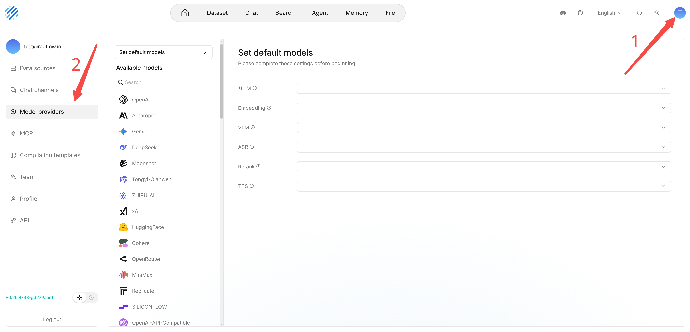

# Configure model API key

RAGFlow model provider management allows you to connect online models, local models, and OpenAI-compatible models to RAGFlow for use in knowledge bases, chats, search, and agents.

## Get model API key

RAGFlow supports most mainstream LLMs. Please refer to [Supported Models](../../guides/models/supported_models.mdx) for a complete list of supported models. You will need to apply for your model API key online. 

:::note
If you find your online LLM is not on the list, don't feel disheartened. The list is expanding, and you can [file a feature request](https://github.com/infiniflow/ragflow/issues/new?assignees=&labels=feature+request&projects=&template=feature_request.yml&title=%5BFeature+Request%5D%3A+) with us! Alternatively, if you have customized or locally-deployed models, you can [bind them to RAGFlow using Ollama, Xinference, or LocalAI](./deploy_local_llm.mdx).
:::

## Add a model provider instance

### Select a model provider

Go to **User settings** **>** **Model providers**. In **Available models**, select a provider and complete its configuration. After the configuration succeeds, the provider is marked as **Configured**.

### Create a model provider instance and configure connection information

An instance stores a set of connection settings under a provider. You can create separate instances for test environments, production environments, local models, or proxy gateways to avoid mixing configurations for different purposes.
When you configure a provider for the first time, the right pane prompts you to create an instance first. After the instance is saved, you can continue to fill in **API Key** and **Base URL** and add models.

**API Key** is used for authentication. **Base URL** specifies the model service endpoint.

For official providers, keep the default **Base URL** in most cases. For proxies, gateways, local models, or compatible APIs, enter the actual service address.

To configure a model provider:

1. Select the provider you want to configure.
2. Enter an instance name.
3. Enter **API Key** and **Base URL**.
4. Save the instance.

:::caution
Do not expose your API Key. An incorrect Base URL causes connection verification or model calls to fail. When using a compatible API, confirm whether the path must include `/v1`.
:::

### Verify the connection

After filling in **API Key** and **Base URL**, verify the connection first. If verification fails, check the API Key, Base URL, network connection, account quota, and model availability.

.png>)

## Add models to an instance

After you add a model provider instance and the connection verification succeeds, you can add and configure models for this instance. Add the model types required by your business, such as large language models (LLMs), embedding models, vision-language models (VLMs), automatic speech recognition models (ASR), rerank models, and text-to-speech models (TTS).

After adding models, you can set them as the default models for the corresponding model types.

### Add models from the list

After the model instance connection succeeds, RAGFlow automatically displays some models supported by the model provider. You can search for the models you need and add them one by one, or add the models in the current list in batch.

.png>)

### Add a custom model

If the required model is not shown in the list but is actually supported by the model provider, you can add it manually as a custom model. When adding a custom model, fill in the model name and select the model type.

The model name must match the model ID exposed by the model provider API. Otherwise, RAGFlow may not be able to identify the model correctly during calls.

To add a custom model:

1. Go to the configured provider instance and click **Add custom model**.
2. Enter the model name. The name must match the actual model identifier provided by the provider.
3. Select the corresponding model type.
4. Fill in **Max tokens** according to the model capability. This value sets the maximum number of tokens the model can generate in one call.
5. If the model supports tool calling, enable **Tool call**. After it is enabled, the model can call external tools or functions during chats or agent runs, such as knowledge retrieval or API requests. Do not enable it for models that do not support this capability.
6. Click **Confirm** to save the model, and verify whether the model is available through an actual call.

.png>)
.png>)

## Set default models

Default models are used when RAGFlow needs to select a model automatically and no model has been specified separately. Set default models after adding and verifying models to avoid selecting unavailable models on business pages.

At minimum, set the following defaults:

1. Default LLM.
2. Default embedding model.

If you have configured a rerank model, it is also recommended to set a default rerank model. Configure VLM, ASR, TTS, and OCR defaults as required by your business.

.png>)

## Model types and usage

| Model type | Full name | Main function | Input | Output | Typical scenarios |
| --- | --- | --- | --- | --- | --- |
| LLM | Large Language Model | Understands, reasons over, and generates text | Text prompts | Text | Intelligent question answering, content generation, summarization, and information extraction |
| Embedding | Embedding model | Converts text into vector representations | Text | Vectors | Semantic retrieval, similarity calculation, and knowledge base indexing |
| Rerank | Rerank model | Scores and reorders initially retrieved candidate results by relevance | Query text and candidate text | Relevance scores and ranking results | Optimizing retrieval results and improving knowledge base Q&A accuracy |
| VLM | Vision-Language Model | Understands images and the text, objects, and scene information in them | Images, text, or images with text | Text | Image Q&A, chart understanding, and visual content analysis |
| ASR | Automatic Speech Recognition model | Converts speech into text | Audio | Text | Speech transcription, meeting records, and real-time captions |
| TTS | Text-to-Speech model | Converts text into speech | Text | Audio | Voice playback, audio content, and voice interaction |
| OCR | Optical Character Recognition model | Recognizes text in images or scanned documents | Images or scanned documents | Recognized text | Scanned document recognition and receipt recognition |

The following model types usually work together for retrieval and generation:

1. **Embedding**, **Rerank**, and **LLM**: The embedding model converts queries and knowledge chunks into vectors, and the system recalls candidate chunks based on vector similarity. The rerank model scores and reorders the candidate chunks by relevance. The LLM understands the question based on the selected knowledge content and generates the answer.

2. **VLM**, **ASR**, **TTS**, and **OCR**: VLM is used to understand images and image-text information. OCR recognizes text in images or scanned documents. ASR converts speech into text. TTS converts text into speech. Different model types jointly support multimodal scenarios such as image understanding, document recognition, and voice interaction.

3. **Moderation**: The moderation model is used to identify non-compliant, harmful, or sensitive content in text or images. It can review user input and model output to reduce the risk of generating or spreading non-compliant content.

## Supported model list

See [Supported Models](./supported_models.mdx).