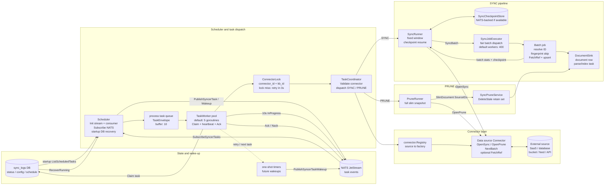
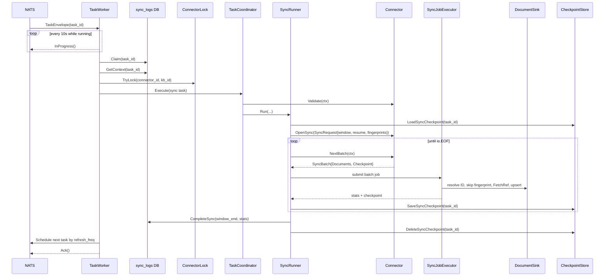
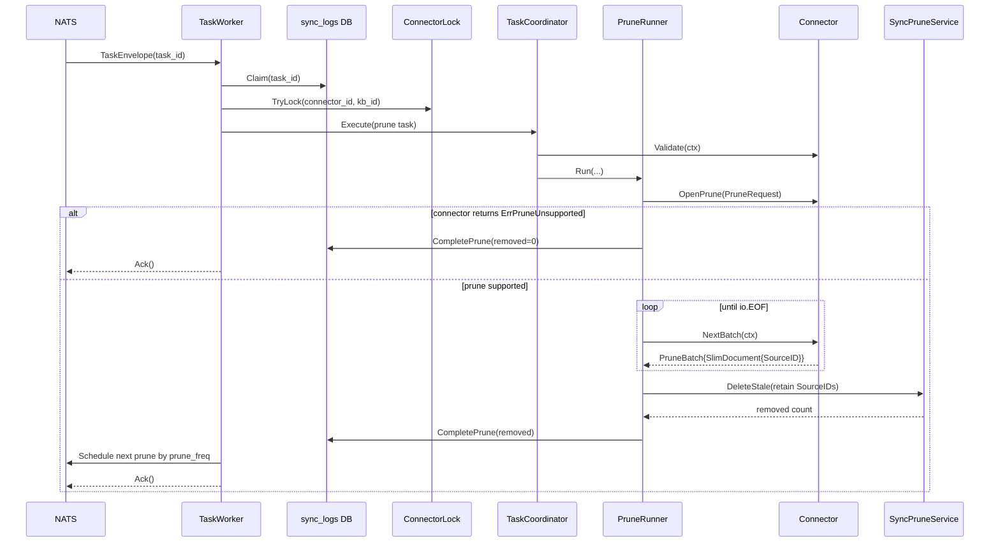

# Syncer Developer Guide

This document describes the main architecture of the Go data-source syncer, the interfaces connectors must implement, task redelivery/resume semantics, configuration validation entry points, testing approach, and the responsibility of each file under `internal/syncer`.

> [!NOTE]
> This document only covers the current Go syncer path. New data sources should plug into the interface model of `internal/syncer/connector` instead of adding compatibility layers around the old Python sync worker.

## Overall architecture

The Go syncer converts sync tasks in `sync_logs` into connector calls, then writes the unified documents produced by the connectors into the knowledge base. The production path relies on NATS/JetStream for task wake-up and cross-process delivery; the DB remains the source of truth for task status, connector configuration, and scheduling times.



Primary flow:

1. `Syncer` starts the scheduler, task workers, and the shared batch job executor.
2. `Scheduler` pulls or receives ready-to-run tasks and puts them into the in-process task queue.
3. `TaskWorker` claims a task and acquires a lock by `(connector_id, kb_id)` to prevent concurrent writes for the same connector and knowledge base.
4. `TaskCoordinator` dispatches to `SyncRunner` or `PruneRunner` based on task type.
5. `SyncRunner` calls the connector's `OpenSync`, reads `SourceDocument` batches, and submits them to `SyncJobExecutor`.
6. `SyncJobExecutor` fairly schedules batch jobs across tasks; within a job, documents are processed one by one with fingerprint skip, lazy download, and upsert.
7. `PruneRunner` calls the connector's `OpenPrune`, collects a full slim snapshot, then deletes documents that no longer exist in the source.

The connector package is only responsible for "reading the external source and normalizing it into documents". It does not write the DB directly, does not create RAGFlow document IDs, and does not schedule parse tasks. Writes, ID resolution, retry statistics, task completion, and scheduling of the next task are all handled in the syncer/service layer.

> [!IMPORTANT]
> The connector boundary is "reading the external source and producing `SourceDocument` / `SlimDocument`". Do not write to the RAGFlow DB, create final document IDs, persist checkpoints, or trigger parsing inside a connector.

## Runtime concurrency and scheduling

`cmd/ragflow_server.go` reads `file_syncer.max_concurrent_syncs` in `--syncer` mode and calls `syncer.NewSyncer(maxConcurrentSyncs)`. The current config template and default config both use 5, so a syncer process executes at most 5 sync/prune tasks concurrently by default.

> [!NOTE]
> "At most 5 concurrent runs" refers to the task worker concurrency, not the number of document-processing workers. Batch jobs within each task go into the shared `SyncJobExecutor`, which has 400 job workers by default.

Key defaults:

| Config | Default | Purpose |
| --- |--------:| --- |
| `file_syncer.max_concurrent_syncs` |       5 | task concurrency passed by the syncer server to `NewSyncer` |
| `Config.TaskWorkerCount` |       5 | number of `TaskWorker` goroutines |
| `Config.TaskQueueSize` |      10 | in-process `TaskEnvelope` queue length |
| `Config.JobWorkerCount` |     400 | global batch job worker count |
| `Config.JobQueueSize` |     450 | global batch job queue length |
| `Config.ItemRetryCount` |       3 | per-document processing retry count |
| `Config.ItemRetryBaseDelay` |      1s | per-document exponential backoff base |

### NATS subscription

The production path requires the message queue engine to implement `SyncTaskBroker`. `NewSyncer` creates the `Scheduler`; if the current MQ supports `SyncTaskBroker`, a NATS-driven scheduler is used.

Startup sequence:

1. `Scheduler.Run` calls `InitSyncerStream()` to initialize the JetStream stream.
2. Calls `InitSyncerConsumer()` to initialize the consumer.
3. Calls `SubscribeSyncerTasks(ctx, handler)` to listen for syncer task wake-up messages.
4. Each message is wrapped into a `TaskEnvelope{TaskID, Handle}` and pushed into the in-process task queue.
5. On enqueue, the NATS handle heartbeat is started; if the context is cancelled and the message has not been enqueued yet, the message is `Nack`ed.

> [!IMPORTANT]
> `Scheduler.Run` currently requires a NATS broker. Without `SyncTaskBroker` it returns `syncer scheduler requires a NATS broker`, so the syncer server cannot run in pure DB-polling mode.

### Startup recovery

After the NATS subscription is established, the scheduler performs a DB reconciliation:

1. `SyncTaskService.RecoverRunning(ctx)` restores running/claimed tasks left behind by a previous process exit to a schedulable state.
2. `ListScheduledTasks(ctx)` lists all scheduled tasks.
3. For each scheduled task, calls `ScheduleTask(ctx, task)`.
4. Due tasks are published to NATS immediately; future tasks get a one-shot timer.

This ensures that after a syncer restart, already-scheduled tasks in the DB are re-woken instead of relying only on future messages.

### Timer re-arm

`Scheduler.ScheduleTask` computes the delay based on task type and last-update time:

- SYNC uses the connector's `refresh_freq`.
- PRUNE is only scheduled when `sync_deleted_files` is true in the connector config, at `prune_freq`.
- A frequency <= 0 or missing `UpdateDate` publishes immediately.
- For a future execution time, a one-shot timer is created via `time.AfterFunc`.

When the timer fires, it calls `PublishSyncerTaskWakeup(taskID)`. If publishing fails and the context is still alive, the timer is re-armed after 3 seconds.

> [!CAUTION]
> Only one timer is kept per task ID. Re-scheduling first stops the old timer and replaces it with the new delay, so a task is never woken by multiple local timers at once.

### Worker claim, ack, and heartbeat

After `TaskWorker` picks up a `TaskEnvelope` from the in-process queue:

1. Calls `InProgress()` on the NATS handle every 10 seconds to prevent the message from timing out during long-running tasks.
2. Calls `SyncTaskService.Claim(ctx, taskID)` to claim the DB task.
3. If claiming fails, another worker or process already owns the task; the current message is `Ack`ed, and if the task is still scheduled, it is re-published after 3 seconds.
4. Reads the full `SyncTaskContext`.
5. Acquires the `(connector_id, kb_id)` lock.
6. Executes `TaskCoordinator.Execute`.
7. On success, schedules `NextTaskID` and finally `Ack`s the NATS message.

Error handling:

- Context cancellation or process exit: the task is rescheduled to a runnable state and re-sent after 3 seconds; the current message is `Ack`ed or `Nack`ed depending on where the failure occurred.
- Connector/KB lock contention: the task is rescheduled and re-sent after 3 seconds; the current message is `Ack`ed.
- User cancellation: directly `Ack` and do not reschedule.
- Transient errors: the failure count is recorded; if the cap is not exceeded, reschedule with exponential backoff.
- Non-transient errors: the task is marked failed and `Ack`ed.

> [!WARNING]
> A NATS `Ack` only means the current message has been fully handled by this process; it does not equal a successful sync task. The actual task state (success, failure, reschedule) is still determined by the sync task/log status in the DB.

### SYNC pipeline

A SYNC task enters the data pipeline from `SyncRunner`:



Supplementary details (beyond the diagram):

- `OpenSync`'s `WindowEnd` is fixed when the task starts; a re-run reuses the same window from the checkpoint state.
- Batch checkpoints are only saved after the batch job returns successfully; a failed batch is reprocessed on the next run.
- Per-document failures first go through document-level retries with `ItemRetryCount = 3`; task-level transient errors then go through task rescheduling with `maxTransientTaskRetries = 3`.
- A failed claim `Ack`s the current message and re-publishes the wake-up after 3 seconds if the task is still scheduled.
- Connector/KB lock contention calls `RescheduleClaimed` and re-publishes the wake-up after 3 seconds.
- `Ack` only confirms the current NATS message has been handled; it does not mean the task succeeded.

### PRUNE pipeline

A PRUNE task only needs the complete source-side ID snapshot:



Supplementary details (beyond the diagram):

- PRUNE is only scheduled by the scheduler when `sync_deleted_files` is true in the connector config.
- `OpenPrune` must enumerate the complete current source snapshot and return only `SourceID`s, without downloading content.
- Lock, claim, heartbeat, and Ack/Nack rules are the same as for SYNC tasks.

> [!CAUTION]
> `OpenPrune` must return the complete slim snapshot of the current source. It is not an incremental interface; returning only the IDs changed in this run would mistakenly delete historical documents.

## Directory layout

`internal/syncer/`:

- `syncer.go`: syncer entry point; assembles default dependencies and starts/stops the scheduler, workers, and executor.
- `config.go`: defaults and normalization for syncer concurrency, queue, and retry config.
- `scheduler.go`: task scheduling; scans the DB by default and can also publish tasks via the NATS broker.
- `task_worker.go`: task consumption, claim, locking, error handling, and task-level transient-failure retries.
- `task_coordinator.go`: execution entry for a single claimed task; selects the sync or prune runner by task type.
- `sync_runner.go`: main SYNC task flow; handles the fixed window, checkpoints, fingerprints, lazy download, and document upsert.
- `prune_runner.go`: main PRUNE task flow; collects the full source snapshot and cleans up stale documents.
- `job_executor.go`: shared batch job executor; fairly distributes each task's batch jobs across the global workers.
- `checkpoint_store.go`: SYNC task checkpoint storage interface with an in-memory implementation; the production path can persist it via the message queue.
- `connector_lock.go`: mutex per connector and KB, preventing concurrent syncs of the same source and KB.
- `transient_error.go`: task-level transient error detection, e.g. timeout, 429, 5xx, connection reset.
- `*_test.go`: syncer-layer unit tests.

`internal/syncer/connector/`:

- `interface.go`: core interfaces every connector must implement.
- `models.go`: unified models exchanged between connectors and runners.
- `registry.go`: registry mapping source names to connector factories.
- `builtin.go`: registration entry for connectors built into the current binary.
- `fingerprint.go`: stable fingerprint and file name normalization utilities.
- `<source>.go`: per data-source implementations, e.g. `rss.go`, `github.go`, `gmail.go`, `imap.go`, `google_drive.go`, `outlook.go`, `rest_api.go`, `mysql.go`, `postgresql.go`, `discord.go`.
- `<source>_test.go`: unit tests for each data source.
- `mock/mock.go`: mock connector for syncer testing.

## Connector interfaces

The interfaces are defined in `internal/syncer/connector/interface.go`.

### `Connector`

Every data source must implement:

```go
type Connector interface {
    Validate(ctx context.Context) error
    OpenSync(ctx context.Context, request SyncRequest) (SyncSession, error)
    OpenPrune(ctx context.Context, request PruneRequest) (PruneSession, error)
}
```

`Validate`:

- Verifies that the saved connector config and credentials are usable.
- Called by `TaskCoordinator.Execute` before each task starts.
- Should check local config such as required fields, credential shape, and batch size.
- For data sources that need network probing, do a lightweight API call, e.g. list one page, fetch the current user, or ping the database.
- Must not start a long-running sync or produce documents.

> [!WARNING]
> `Validate` sits on the execution path of every task. It must be a lightweight probe and must not scan the full remote data or download document content.

`OpenSync`:

- Opens a session with a fixed sync window.
- The input `SyncRequest` carries the task ID, connector ID, KB ID, source type, existing fingerprints, window boundaries, and the resume checkpoint.
- The returned `SyncSession` streams `SyncBatch`es via `NextBatch`.
- The connector should apply window filtering here, build its internal pagination state, and skip already-committed positions based on `Resume`.

> [!IMPORTANT]
> `OpenSync` receives a fixed window. Do not keep expanding the window with "current time" inside `NextBatch`; otherwise a failed re-run would change this task's boundaries.

`OpenPrune`:

- Opens a full source snapshot session.
- Returns `SlimDocument{SourceID}` without downloading content.
- If the data source cannot provide a full snapshot, return `connector.ErrPruneUnsupported`. `PruneRunner` then completes PRUNE as a no-op and deletes nothing.

### `SyncSession`

```go
type SyncSession interface {
    NextBatch(ctx context.Context) (SyncBatch, error)
    Close() error
}
```

`NextBatch`:

- Returns the next batch of source documents.
- Must return `io.EOF` when there is no more data.
- Each non-empty batch should carry a `Checkpoint` representing "the resumable position after this batch has been committed".
- Documents within a batch are emitted in a stable order so checkpoints can reliably skip committed data.

> [!CAUTION]
> If batch order is unstable, checkpoint resume may duplicate large amounts of data and, in the worst case, miss data. Tests for new connectors must cover resume.

`Close`:

- Releases resources such as HTTP responses, DB cursors, and temporary files.
- Should return `nil` even if the current connector holds no resources.

### `Fetcher`

```go
type Fetcher interface {
    Fetch(ctx context.Context, ref FetchReference) ([]byte, error)
}
```

This is an optional interface. When `SourceDocument.Blob` is empty and `FetchRef` is non-empty, `SyncRunner` asserts the session to `Fetcher` and calls `Fetch`.

When to use:

- The list API can provide metadata/fingerprint, but downloading the content is expensive.
- Large files or remote attachments should only be downloaded when the runner decides an upsert is needed.
- Connectors such as Google Drive or blob-like storage should prefer lazy download.

> [!NOTE]
> `FetchRef`'s contents are defined by the connector itself, but must contain the full context needed for the download. The runner has no knowledge of the remote API's account, page token, file ID, or URL semantics.

### `SettingValidator`

```go
type SettingValidator interface {
    ValidateConnectorSetting(ctx context.Context, request map[string]any) error
}
```

This optional interface is used by the test-connection flow. The service layer constructs a connector from unsaved raw config via `Registry.OpenFromConfig`, then calls `ValidateConnectorSetting`.

Recommendations:

- Use `connectorSettingValidationTimeout` to bound network probing.
- Reuse `Validate`'s local validation logic.
- Return clear messages for user-fixable errors, such as missing token, 401, 403, 404, 429, or database connection failures.

> [!IMPORTANT]
> `ValidateConnectorSetting` faces the frontend's "test connection" and its input may not be saved to the DB yet. Do not rely on task context, connector ID, KB ID, or persisted state.

## Data model semantics

The models are defined in `internal/syncer/connector/models.go`.

`SourceDocument`:

- `SourceID`: stable ID within the source system. It must be stable and unique within a connector. The RAGFlow document ID is resolved by the service layer as `kb_id + connector_id + SourceID`, not generated by the connector.
- `SemanticIdentifier`: human-readable name shown to users, e.g. file name, email subject, page path.
- `Extension`: parsing extension, with the dot, e.g. `.txt`, `.pdf`.
- `Blob`: the document content. It can be populated directly, or left empty with a `FetchRef`.
- `FetchRef`: lazy-download reference. Contents are defined by the connector itself, usually a JSON string holding the remote ID, URL, account, etc.
- `UpdatedAt`: the source document's update time, used for waterline, checkpoint, and ordering.
- `SizeBytes`: the source document's size. May be 0 if unknown.
- `Metadata`: optional additional info such as URL, owner, channel, repo, etc.
- `Fingerprint`: content or remote version fingerprint. If it matches a stored fingerprint, the runner skips the upsert.

> [!IMPORTANT]
> `SourceID` is the core of delete-sync, ID compatibility, and idempotent upserts. It must be stable across sync runs and unique within a connector.

`SyncRequest`:

- `FromBeginning` true means a full sync; otherwise `WindowStart` and `WindowEnd` define an incremental window.
- `Fingerprints` is a map of fingerprints for documents already stored under the current KB/source type, keyed by the resolved RAGFlow document ID; not all connectors can use it directly. Most connectors just set `SourceDocument.Fingerprint` and let the runner handle skipping uniformly.
- `Resume` is the connector checkpoint saved after the last successfully committed batch.

`SyncCheckpoint`:

- `Cursor`: connector-owned cursor, e.g. remote page token, offset, or source ID.
- `SourceID`: the last source document ID of the last successfully committed batch.
- `UpdatedAt`: the update-time reference of the last successfully committed batch.

`SlimDocument`:

- Contains only `SourceID`.
- PRUNE uses it to build the retain set; any old document not present in the full slim snapshot is considered stale.

## Retry and resume

Here "retry/resume" refers to task-level continuation at batch/document granularity, not resumable byte-range downloads of a single HTTP download.

> [!NOTE]
> The current design continues from after the last successfully committed batch only while the saved anchor still exists in the current source listing. It does not guarantee that a partially downloaded remote file resumes from a byte range.

Happy path:

1. `SyncRunner.prepareCheckpoint` creates or loads `SyncCheckpointState` for the task.
2. `OpenSync` receives the fixed `WindowStart`, `WindowEnd`, and the existing `Resume`.
3. Each `SyncBatch` is submitted to `SyncJobExecutor`.
4. Within a batch job, documents are processed one by one; on success, the batch's corresponding checkpoint is returned.
5. `collectResults` only saves the checkpoint when there were no prior errors.
6. After the whole task succeeds, `CompleteSync` commits the new poll waterline and deletes the checkpoint.

Resume after failure:

- If a task fails (network, timeout, worker exit, etc.) and is rescheduled, the next execution of the same task ID loads the saved `SyncCheckpointState`.
- `OpenSync` should skip already-committed batches based on `request.Resume`.
- The last batch that was not committed successfully is reprocessed. This is expected behavior.
- The upsert path must stay idempotent; reprocessing the same `SourceID` must not produce duplicate documents.

Anchor invalidation:

Continuation is only trustworthy while the saved source anchor still exists in
the current listing. If a connector returns `ErrSyncResumeInvalid` from
`OpenSync` or `NextBatch`, `SyncRunner` clears the connector checkpoint, resets
the accumulated stats, and restarts the same fixed sync window from the
beginning with `Resume=nil`. The restart is bounded by
`MaxAnchorRestartCount` (default 2); after that the task fails rather than
guessing a new offset. Connectors enforce this through
`ErrSyncResumeInvalid` in `connector/models.go`.

Requirements when implementing checkpoints:

- Batch output order must be stable. Common approaches: sort by update time, remote pagination order, or source ID.
- A checkpoint must represent "where to continue after this batch was successfully committed".
- If using a remote cursor, confirm whether the cursor points to the next page or to a position within the current page. In-page resume usually also requires `SourceID`.
- If only `SourceID` is saved, the next run must be able to re-enumerate and skip data before that ID.
- Do not commit checkpoints inside the connector; checkpoints are only saved by the runner after a batch succeeds.

Transient-error retries work on two layers:

- Document level: `SyncRunner.processDocumentWithRetry` retries per-document failures matching `service.IsRetryable(err)` with exponential backoff.
- Task level: `TaskWorker` retries tasks for transient sync errors such as timeout, 429, 5xx, and connection reset, up to `maxTransientTaskRetries` times.

> [!WARNING]
> Checkpoints are only saved by the runner after a batch job succeeds. Connectors must not persist "how far sync has progressed" themselves in `NextBatch` or `Fetch`; otherwise failed re-runs diverge from the runner's commit point.

## Validation

There are two related entry points.

Task-execution validation:

- `TaskCoordinator.Execute` calls `connector.Validate(ctx)` at the start of every task.
- This validates the saved configuration.
- Failure leads to task failure or a transient-error retry.

Test-connection validation:

- The API/service layer builds the connector via `Registry.OpenFromConfig(source, config)`.
- If the connector implements `SettingValidator`, `ValidateConnectorSetting(ctx, config)` is called.
- This validates unsaved configuration and should fit the frontend's "test connection".

Implementation recommendations:

- Constructors should only parse config and do no network I/O.
- `Validate` checks config and credentials, then does a lightweight remote probe.
- `ValidateConnectorSetting` uses a timeout context and returns errors users can understand.
- Preserve status information for external-service errors, e.g. HTTP 401/403/404/429.
- In unit tests, simulate validation via function hooks or `httptest`, never real services.

> [!CAUTION]
> Default unit tests must not depend on real SaaS, databases, object storage, or LLMs. Tests requiring real services must carry the corresponding build tag.

## Adding a new connector

1. Add an implementation in `internal/syncer/connector/<source>.go`.
2. Provide `New<Source>Connector(config map[string]any) (*<Source>Connector, error)`.
3. Implement the `Connector` interface: `Validate`, `OpenSync`, `OpenPrune`.
4. If test connection is supported, implement `ValidateConnectorSetting`.
5. If lazy download is supported, have the session or connector implement `Fetcher`.
6. Register the source in `RegisterBuiltIns` in `internal/syncer/connector/builtin.go`.
7. Add `internal/syncer/connector/<source>_test.go`.

Constructors must stay compatible with the config fields already used by the Python/frontend. Do not add wrapper configs or dual-path compatibility layers for internal migration; prefer converging on the current Go connector model.

> [!NOTE]
> Existing data sources are good references in the same directory: RSS shows the simple pull model, Google Drive shows pagination, fingerprinting, and lazy download, MySQL/PostgreSQL show database-style connectors, and REST API shows a config-driven connector.

## Testing

Default Go unit tests must not depend on external services. New connector tests should use:

- Function hooks to mock remote APIs, e.g. `fetchPage`, `listFiles`, `downloadFile`.
- `httptest.Server` to mock HTTP APIs.
- `sqlmock` to mock database-style connectors.
- In-memory sinks, mock connectors, or fake checkpoint stores to test syncer runner behavior.

Recommended coverage:

- `New<Source>Connector` parses required config and defaults.
- `ValidateConnectorSetting` branches for success, missing credentials, 401/403/404/429, etc.
- `OpenSync` full sync.
- `OpenSync` incremental window filtering: `WindowStart < UpdatedAt <= WindowEnd`.
- `OpenSync` resume: reopening a session with a checkpoint skips already-committed documents.
- fingerprint: identical fingerprints skip download or upsert.
- lazy download: when `SourceDocument.FetchRef` is non-empty, the runner or session `Fetch` retrieves the content.
- `OpenPrune` full slim snapshot.
- The `ErrPruneUnsupported` branch, if the data source does not support delete-sync.

Commands:

```bash
bash build.sh --test ./internal/syncer/connector
bash build.sh --test ./internal/syncer
```

Do not use bare `go test` as the primary verification; Go tests in this repo require `build.sh` to inject the CGO and native static library flags.

Tests that need real MySQL, MinIO, Elasticsearch, Infinity, LLMs, or external SaaS must carry the `integration`, `e2e`, or `manual` build tag and must not enter the default unit run.

> [!IMPORTANT]
> New connectors should at least have package-scoped unit tests, run first via `bash build.sh --test ./internal/syncer/connector`. Behavior changes in the syncer runners should add `bash build.sh --test ./internal/syncer`.

## Common pitfalls

- An unstable `SourceID` leads to duplicate documents or accidental deletions during prune.
- Unstable batch ordering leads to excessive duplication or missed data on checkpoint resume.
- `OpenPrune` is not an incremental interface; it must return the complete slim snapshot of the current source.
- Connectors must not write to the RAGFlow DB or parse files themselves.
- `FetchRef` must contain everything needed for the download, because the runner only has the `SourceDocument` and the session when processing documents.
- The `Fingerprint` algorithm must be stable across processes for the same document.
- The incremental window lower bound is open, i.e. `WindowStart < UpdatedAt <= WindowEnd`.

## External

> [!TIP]
> For more info, you can review these PR:
> + [feat[Go]: complete the base for data Syncer - #17890](https://github.com/infiniflow/ragflow/pull/17890)
> + [feat[Go]: monitoring NATs and refactoring concurrency logic - #18049](https://github.com/infiniflow/ragflow/pull/18049)
> + [feat[Go]: resuming transmission from the point of interruption during data source synchronisation - #18176](https://github.com/infiniflow/ragflow/pull/18176)
