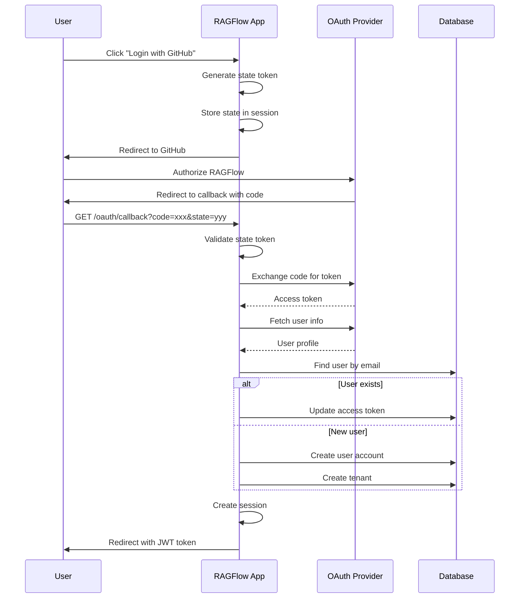

# Authentication Flow Analysis

## Tổng Quan

RAGFlow hỗ trợ nhiều phương thức authentication:
1. **JWT Token** - Session-based authentication
2. **API Token (Bearer)** - For SDK/API access
3. **OAuth 2.0** - GitHub, OIDC providers

## Authentication Architecture

```
┌─────────────────────────────────────────────────────────────────────────┐
│                        AUTHENTICATION FLOW                               │
└─────────────────────────────────────────────────────────────────────────┘

                    ┌─────────────────────────────┐
                    │      Incoming Request       │
                    │   Authorization: {token}    │
                    └──────────────┬──────────────┘
                                   │
                                   ▼
                    ┌─────────────────────────────┐
                    │      _load_user()           │
                    │  (Before each request)      │
                    └──────────────┬──────────────┘
                                   │
              ┌────────────────────┼────────────────────┐
              │                    │                    │
              ▼                    ▼                    ▼
    ┌─────────────────┐  ┌─────────────────┐  ┌─────────────────┐
    │  JWT Token      │  │  Bearer Token   │  │  No Token       │
    │  (Session)      │  │  (API Token)    │  │  (Public API)   │
    └────────┬────────┘  └────────┬────────┘  └────────┬────────┘
             │                    │                    │
             ▼                    ▼                    ▼
    ┌─────────────────┐  ┌─────────────────┐  ┌─────────────────┐
    │ Deserialize JWT │  │ Query APIToken  │  │  g.user = None  │
    │ → access_token  │  │  by token       │  │                 │
    └────────┬────────┘  └────────┬────────┘  └─────────────────┘
             │                    │
             ▼                    ▼
    ┌─────────────────┐  ┌─────────────────┐
    │ Query User by   │  │ Get tenant_id   │
    │ access_token    │  │ from APIToken   │
    └────────┬────────┘  └────────┬────────┘
             │                    │
             └──────────┬─────────┘
                        │
                        ▼
              ┌─────────────────┐
              │   g.user = user │
              │   (Request ctx) │
              └─────────────────┘
```

## Code Implementation

### Token Loading (`/api/apps/__init__.py`)

```python
def _load_user():
    """
    Load user from Authorization header.
    Called before every request via @app.before_request.
    """
    jwt = Serializer(secret_key=settings.SECRET_KEY)
    authorization = request.headers.get("Authorization")
    g.user = None

    if not authorization:
        return  # No auth header, continue as anonymous

    try:
        # 1. Try JWT token (session-based)
        access_token = str(jwt.loads(authorization))

        # Validate token format
        if not access_token or not access_token.strip():
            logging.warning("Empty access token")
            return None

        # Access tokens must be UUIDs (32+ hex chars)
        if len(access_token.strip()) < 32:
            logging.warning(f"Invalid token format: {len(access_token)} chars")
            return None

        # Query user by access_token
        user = UserService.query(
            access_token=access_token,
            status=StatusEnum.VALID.value
        )

        # 2. Fallback: Try API Token (Bearer format)
        if not user and len(authorization.split()) == 2:
            # Format: "Bearer {api_token}"
            bearer, token = authorization.split()
            if bearer.lower() == "bearer":
                api_tokens = APIToken.query(token=token)
                if api_tokens:
                    # Get user by tenant_id from API token
                    user = UserService.query(
                        id=api_tokens[0].tenant_id,
                        status=StatusEnum.VALID.value
                    )

        if user:
            g.user = user[0]
            return user[0]

    except Exception as e:
        logging.warning(f"load_user exception: {e}")

    return None
```

### Login Required Decorator

```python
def login_required(func):
    """
    Decorator that requires authenticated user.
    Returns 401 Unauthorized if no valid user.
    """
    @wraps(func)
    async def wrapper(*args, **kwargs):
        if not current_user:
            raise Unauthorized("Authentication required")
        return await current_app.ensure_async(func)(*args, **kwargs)
    return wrapper

# Usage
@manager.route("/protected", methods=["GET"])
@login_required
async def protected_endpoint():
    # current_user is guaranteed to be valid here
    return get_json_result(data={"user_id": current_user.id})
```

### User Login Flow

```python
@manager.route("/login", methods=["POST"])
@validate_request("email", "password")
async def login():
    """
    Email/password login endpoint.

    Request:
        - email: User email
        - password: User password

    Response:
        - access_token: JWT token for session
        - user: User object
    """
    req = await request.json
    email = req["email"]
    password = req["password"]

    # 1. Query user by email
    users = UserService.query(email=email, status=StatusEnum.VALID.value)
    if not users:
        return get_json_result(
            code=RetCode.AUTHENTICATION_ERROR,
            message="Invalid email or password"
        )

    user = users[0]

    # 2. Verify password
    if not UserService.verify_password(password, user.password):
        return get_json_result(
            code=RetCode.AUTHENTICATION_ERROR,
            message="Invalid email or password"
        )

    # 3. Generate new access token
    user.access_token = get_uuid()
    UserService.save(user)

    # 4. Create session
    login_user(user)

    # 5. Return token
    jwt = Serializer(secret_key=settings.SECRET_KEY)
    return get_json_result(data={
        "access_token": jwt.dumps(user.access_token),
        "user": user.to_dict()
    })
```

## OAuth 2.0 Flow

### OAuth Client Implementation

```python
# /api/apps/auth/oauth.py

class OAuthClient:
    """Generic OAuth 2.0 client."""

    def __init__(self, config):
        self.client_id = config["client_id"]
        self.client_secret = config["client_secret"]
        self.authorization_url = config["authorization_url"]
        self.token_url = config["token_url"]
        self.userinfo_url = config["userinfo_url"]
        self.redirect_uri = config["redirect_uri"]
        self.scope = config.get("scope", "openid email profile")

    def get_authorization_url(self, state):
        """Build OAuth authorization URL."""
        params = {
            "client_id": self.client_id,
            "redirect_uri": self.redirect_uri,
            "response_type": "code",
            "scope": self.scope,
            "state": state
        }
        return f"{self.authorization_url}?{urlencode(params)}"

    def exchange_code_for_token(self, code):
        """Exchange authorization code for access token."""
        payload = {
            "client_id": self.client_id,
            "client_secret": self.client_secret,
            "code": code,
            "redirect_uri": self.redirect_uri,
            "grant_type": "authorization_code"
        }
        response = requests.post(self.token_url, data=payload)
        return response.json()

    def fetch_user_info(self, access_token):
        """Fetch user profile from OAuth provider."""
        headers = {"Authorization": f"Bearer {access_token}"}
        response = requests.get(self.userinfo_url, headers=headers)
        return self.normalize_user_info(response.json())

    def normalize_user_info(self, raw_info):
        """Normalize user info to standard format."""
        return {
            "id": raw_info.get("sub") or raw_info.get("id"),
            "email": raw_info.get("email"),
            "name": raw_info.get("name") or raw_info.get("login"),
            "avatar": raw_info.get("picture") or raw_info.get("avatar_url")
        }
```

### OAuth Login Endpoint

```python
@manager.route("/login/<channel>", methods=["GET"])
def oauth_login(channel):
    """
    Initiate OAuth login flow.

    Args:
        channel: OAuth provider (github, google, etc.)
    """
    channel_config = settings.OAUTH_CONFIG.get(channel)
    if not channel_config:
        return redirect("/?error=invalid_provider")

    auth_cli = get_auth_client(channel_config)

    # Generate state for CSRF protection
    state = get_uuid()
    session["oauth_state"] = state

    # Redirect to OAuth provider
    auth_url = auth_cli.get_authorization_url(state)
    return redirect(auth_url)


@manager.route("/oauth/callback/<channel>", methods=["GET"])
def oauth_callback(channel):
    """
    OAuth callback handler.

    Query params:
        - code: Authorization code from provider
        - state: CSRF state token
    """
    code = request.args.get("code")
    state = request.args.get("state")

    # 1. Validate state (CSRF protection)
    if not state or state != session.get("oauth_state"):
        return redirect("/?error=invalid_state")

    # 2. Get OAuth client
    channel_config = settings.OAUTH_CONFIG.get(channel)
    auth_cli = get_auth_client(channel_config)

    # 3. Exchange code for token
    token_info = auth_cli.exchange_code_for_token(code)
    access_token = token_info.get("access_token")

    if not access_token:
        return redirect("/?error=token_exchange_failed")

    # 4. Fetch user info
    user_info = auth_cli.fetch_user_info(access_token)

    # 5. Find or create user
    users = UserService.query(email=user_info["email"])

    if not users:
        # Auto-register new OAuth user
        user_id = get_uuid()
        users = user_register(user_id, {
            "email": user_info["email"],
            "nickname": user_info["name"],
            "avatar": user_info["avatar"],
            "login_channel": channel,
            "password": ""  # No password for OAuth users
        })

    user = users[0]

    # 6. Generate access token
    user.access_token = get_uuid()
    UserService.save(user)

    # 7. Create session
    login_user(user)

    # 8. Redirect to app
    jwt = Serializer(secret_key=settings.SECRET_KEY)
    token = jwt.dumps(user.access_token)
    return redirect(f"/?auth={token}")
```

## API Token Authentication

### Create API Token

```python
@manager.route("/api_token/create", methods=["POST"])
@login_required
@validate_request("dialog_id")
async def create_api_token():
    """
    Create API token for external access.

    Request:
        - dialog_id: Dialog to associate with token

    Response:
        - token: API token string
    """
    req = await request.json

    token = APIToken.create(
        tenant_id=current_user.id,
        token=get_uuid(),
        dialog_id=req["dialog_id"],
        source="api"
    )

    return get_json_result(data={"token": token.token})
```

### Using API Token

```bash
# SDK/API calls use Bearer token
curl -X POST "https://api.ragflow.io/api/v1/chat" \
  -H "Authorization: Bearer {api_token}" \
  -H "Content-Type: application/json" \
  -d '{"question": "Hello"}'
```

## Sequence Diagram: OAuth Flow



## Security Considerations

### Token Validation

```python
# 1. Token format validation
if len(access_token.strip()) < 32:
    return None  # Invalid UUID format

# 2. Token status validation
user = UserService.query(
    access_token=access_token,
    status=StatusEnum.VALID.value  # Only active users
)

# 3. API token scope validation
api_token = APIToken.query(token=bearer_token)
if api_token:
    # Check if token is for allowed dialog
    if api_token.dialog_id != requested_dialog_id:
        return None
```

### CSRF Protection

```python
# OAuth state validation
state = get_uuid()
session["oauth_state"] = state

# On callback
if state != session.get("oauth_state"):
    return redirect("/?error=csrf_detected")
```

### Password Hashing

```python
import bcrypt

def hash_password(password: str) -> str:
    return bcrypt.hashpw(password.encode(), bcrypt.gensalt()).decode()

def verify_password(password: str, hashed: str) -> bool:
    return bcrypt.checkpw(password.encode(), hashed.encode())
```

## Configuration

```python
# settings.py

SECRET_KEY = os.environ.get("SECRET_KEY", "your-secret-key")

OAUTH_CONFIG = {
    "github": {
        "client_id": os.environ.get("GITHUB_CLIENT_ID"),
        "client_secret": os.environ.get("GITHUB_CLIENT_SECRET"),
        "authorization_url": "https://github.com/login/oauth/authorize",
        "token_url": "https://github.com/login/oauth/access_token",
        "userinfo_url": "https://api.github.com/user",
        "redirect_uri": "https://your-app/oauth/callback/github",
        "scope": "user:email"
    },
    "google": {
        "client_id": os.environ.get("GOOGLE_CLIENT_ID"),
        "client_secret": os.environ.get("GOOGLE_CLIENT_SECRET"),
        "authorization_url": "https://accounts.google.com/o/oauth2/v2/auth",
        "token_url": "https://oauth2.googleapis.com/token",
        "userinfo_url": "https://www.googleapis.com/oauth2/v3/userinfo",
        "redirect_uri": "https://your-app/oauth/callback/google",
        "scope": "openid email profile"
    }
}
```

## Related Files

- `/api/apps/__init__.py` - Token loading logic
- `/api/apps/user_app.py` - Login/register endpoints
- `/api/apps/auth/oauth.py` - OAuth client
- `/api/apps/auth/github.py` - GitHub-specific OAuth
- `/api/apps/auth/oidc.py` - OpenID Connect
- `/api/db/db_models.py` - User, APIToken models
