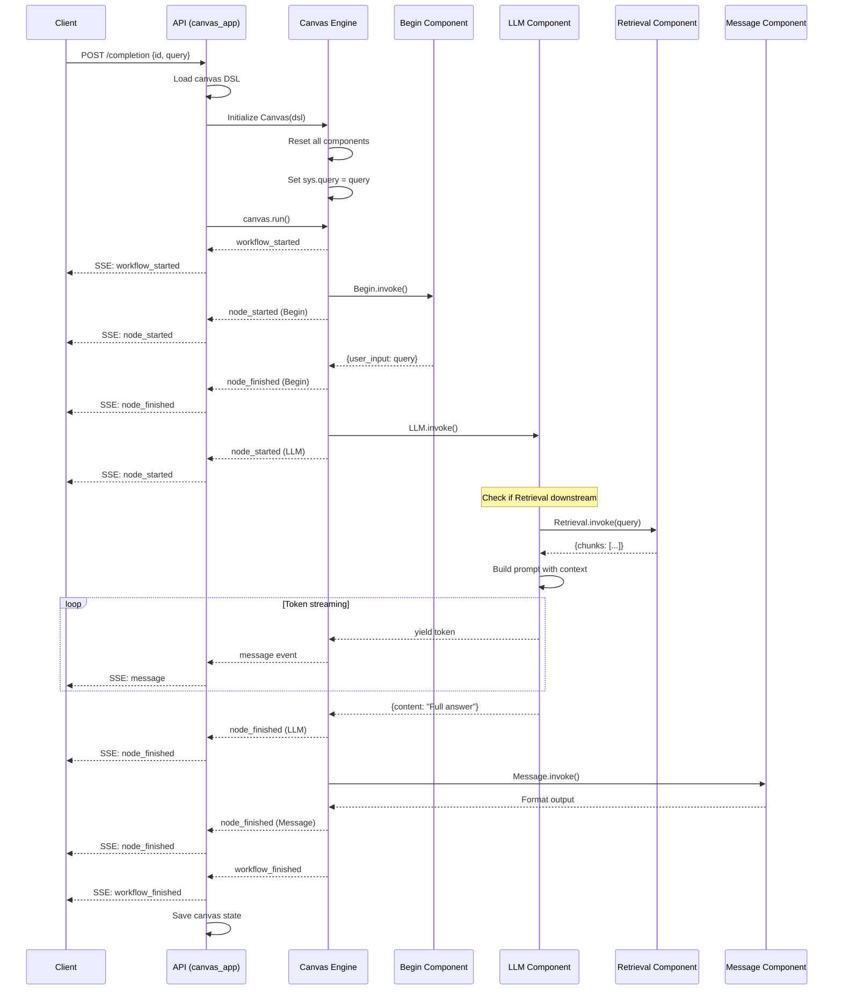

# Canvas App Analysis

## Tổng Quan

`canvas_app.py` (609 lines) là blueprint xử lý Agent Workflow API - cho phép tạo và chạy các workflow phức tạp với visual canvas.

## File Location
```
/api/apps/canvas_app.py
```

## API Endpoints

| Endpoint | Method | Auth | Mô Tả |
|----------|--------|------|-------|
| `/templates` | GET | Required | List agent templates |
| `/set` | POST | Required | Save/update canvas workflow |
| `/get/<canvas_id>` | GET | Required | Retrieve canvas DSL |
| `/completion` | POST | Required | **Execute workflow (SSE)** |
| `/debug` | POST | Required | Debug single component |
| `/reset` | POST | Required | Reset canvas state |
| `/rerun` | POST | Required | Reprocess failed pipeline |
| `/cancel/<task_id>` | PUT | Required | Cancel running task |
| `/test_db_connect` | POST | Required | Test database connectivity |
| `/upload/<canvas_id>` | POST | Optional | Upload file to canvas |

## Core Flow: Workflow Execution

```
┌─────────────────────────────────────────────────────────────────────────┐
│                     CANVAS WORKFLOW EXECUTION                            │
└─────────────────────────────────────────────────────────────────────────┘

Client                        API                      Canvas Engine
  │                            │                            │
  │ POST /completion           │                            │
  │ {id, query, stream: true}  │                            │
  ├───────────────────────────►│                            │
  │                            │                            │
  │              ┌─────────────┴─────────────┐              │
  │              │ Load canvas DSL           │              │
  │              │ Initialize Canvas engine  │              │
  │              └─────────────┬─────────────┘              │
  │                            │                            │
  │                            │ canvas.run(query)          │
  │                            ├───────────────────────────►│
  │                            │                            │
  │                            │      workflow_started      │
  │ SSE: workflow_started      │◄───────────────────────────┤
  │◄───────────────────────────┤                            │
  │                            │                            │
  │                            │      node_started (Begin)  │
  │ SSE: node_started          │◄───────────────────────────┤
  │◄───────────────────────────┤                            │
  │                            │                            │
  │                            │      node_finished (Begin) │
  │ SSE: node_finished         │◄───────────────────────────┤
  │◄───────────────────────────┤                            │
  │                            │                            │
  │                            │      node_started (LLM)    │
  │ SSE: node_started          │◄───────────────────────────┤
  │◄───────────────────────────┤                            │
  │                            │                            │
  │                            │      message (streaming)   │
  │ SSE: message               │◄───────────────────────────┤
  │◄───────────────────────────┤                            │
  │                            │                            │
  │  ... (more tokens/nodes)   │                            │
  │                            │                            │
  │                            │      workflow_finished     │
  │ SSE: workflow_finished     │◄───────────────────────────┤
  │◄───────────────────────────┤                            │
  │                            │                            │
```

## Code Analysis

### Completion Endpoint (Workflow Execution)

```python
@manager.route('/completion', methods=['POST'])
@validate_request("id")
@login_required
async def completion():
    """
    Execute canvas workflow with streaming output.

    Request:
        - id: Canvas ID
        - query: User input (optional, from sys.query)
        - stream: Boolean (default True)
        - message_id: Unique message ID

    Response:
        - SSE stream of workflow events
    """
    req = await request_json()
    canvas_id = req["id"]

    # 1. Load canvas from database
    e, user_canvas = UserCanvasService.get_by_id(canvas_id)
    if not e:
        raise LookupError(f"Canvas {canvas_id} not found")

    # 2. Initialize Canvas engine with DSL
    canvas = Canvas(json.dumps(user_canvas.dsl), current_user.id)

    # 3. Reset canvas state
    canvas.reset()

    # 4. Set user query
    query = req.get("query", "")
    canvas.set_global_variable("sys.query", query)

    # 5. Define streaming generator
    def stream():
        try:
            # Execute workflow and yield events
            async for event in canvas.run(**req):
                yield format_sse_event(event)

        except Exception as e:
            logging.exception(e)
            yield error_event(str(e))

        # Save canvas state
        UserCanvasService.update_by_id(canvas_id, {
            "dsl": json.loads(canvas.to_json())
        })

    resp = Response(stream(), mimetype="text/event-stream")
    resp.headers.add_header("Cache-control", "no-cache")
    resp.headers.add_header("X-Accel-Buffering", "no")
    return resp
```

### Debug Single Component

```python
@manager.route('/debug', methods=['POST'])
@validate_request("id", "component_id", "params")
@login_required
async def debug():
    """
    Debug a single component in isolation.

    Request:
        - id: Canvas ID
        - component_id: Component to debug
        - params: Input parameters for component

    Response:
        - Component outputs
    """
    req = await request_json()

    # Load canvas
    e, user_canvas = UserCanvasService.get_by_id(req["id"])
    canvas = Canvas(json.dumps(user_canvas.dsl), current_user.id)
    canvas.reset()

    # Get component
    component = canvas.get_component(req["component_id"])["obj"]
    component.reset()

    # Set debug inputs
    if isinstance(component, LLM):
        component.set_debug_inputs(req["params"])

    # Execute component
    component.invoke(**{k: o["value"] for k, o in req["params"].items()})

    # Return outputs
    outputs = component.output()
    return get_json_result(data=outputs)
```

### SSE Event Types

```python
# Workflow started
{
    "event": "workflow_started",
    "message_id": "msg_123",
    "created_at": 1699999999,
    "data": {"inputs": {"query": "..."}}
}

# Node started
{
    "event": "node_started",
    "component_id": "LLM:Planning",
    "component_name": "Planning Agent",
    "component_type": "LLM",
    "thoughts": "Processing your request..."
}

# Streaming message (from LLM/Message components)
{
    "event": "message",
    "content": "Here is the answer...",
    "start_to_think": false  # true when <think> tag detected
}

# Node finished
{
    "event": "node_finished",
    "component_id": "LLM:Planning",
    "inputs": {...},
    "outputs": {"content": "..."},
    "elapsed_time": 2.5
}

# User input required
{
    "event": "user_inputs",
    "component_id": "UserFillUp:Confirm",
    "inputs": {
        "feedback": {"type": "text", "optional": false}
    }
}

# Workflow finished
{
    "event": "workflow_finished",
    "outputs": {...},
    "elapsed_time": 5.0
}

# Error event
{
    "event": "error",
    "message": "Error description"
}
```

### Canvas Templates

```python
@manager.route('/templates', methods=['GET'])
@login_required
async def templates():
    """
    List available canvas templates.

    Response:
        - List of template objects with name, avatar, dsl
    """
    templates = CanvasTemplateService.get_all()

    return get_json_result(data=[{
        "id": t.id,
        "name": t.name,
        "avatar": t.avatar,
        "description": t.description,
        "dsl": t.dsl
    } for t in templates])
```

### Cancel Running Task

```python
@manager.route('/cancel/<task_id>', methods=['PUT'])
@login_required
async def cancel(task_id):
    """
    Cancel a running workflow execution.

    The cancellation is propagated to all running components
    via the has_canceled() check in Canvas.run().
    """
    # Set cancellation flag in Redis
    REDIS_CONN.set(f"cancel:{task_id}", "1", ex=3600)

    return get_json_result(data=True)
```

## Canvas DSL Structure

```json
{
    "components": {
        "begin": {
            "obj": {
                "component_name": "Begin",
                "params": {
                    "prologue": "Hello! How can I help?",
                    "mode": "conversational"
                }
            },
            "downstream": ["LLM:Planning"],
            "upstream": []
        },
        "LLM:Planning": {
            "obj": {
                "component_name": "LLM",
                "params": {
                    "llm_id": "gpt-4@OpenAI",
                    "sys_prompt": "You are a helpful assistant...",
                    "prompts": [
                        {"role": "user", "content": "{sys.query}"}
                    ],
                    "temperature": 0.7,
                    "cite": true
                }
            },
            "downstream": ["Message:Output"],
            "upstream": ["begin"]
        },
        "Message:Output": {
            "obj": {
                "component_name": "Message",
                "params": {
                    "content": ["{LLM:Planning@content}"]
                }
            },
            "downstream": [],
            "upstream": ["LLM:Planning"]
        }
    },
    "globals": {
        "sys.query": "",
        "sys.user_id": "user_123"
    },
    "path": ["begin"],
    "history": [],
    "memory": []
}
```

## Sequence Diagram: Agent Workflow



## Component Types

| Component | Purpose | Key Parameters |
|-----------|---------|----------------|
| **Begin** | Entry point | prologue, mode |
| **LLM** | Language model call | llm_id, prompt, temperature |
| **Agent** | ReAct with tools | tools, max_rounds |
| **Retrieval** | KB search | kb_ids, top_n, threshold |
| **Categorize** | Route by condition | categories, examples |
| **Message** | Format output | content template |
| **Webhook** | HTTP call | url, method, headers |
| **Iteration** | Loop over array | array variable |
| **UserFillUp** | Request user input | input fields |

## Error Handling

```python
def stream():
    try:
        async for event in canvas.run(**req):
            yield format_sse_event(event)

    except ComponentExecutionError as e:
        # Component-level error
        yield error_event(e.component_id, str(e))

    except TimeoutError as e:
        # Execution timeout
        yield error_event(None, "Workflow execution timed out")

    except Exception as e:
        logging.exception(e)
        yield error_event(None, str(e))

    finally:
        # Always save state
        try:
            UserCanvasService.update_by_id(canvas_id, {...})
        except:
            pass
```

## Related Files

- `/agent/canvas.py` - Canvas execution engine
- `/agent/component/*.py` - Component implementations
- `/agent/tools/*.py` - Tool integrations
- `/api/db/services/canvas_service.py` - Canvas storage
