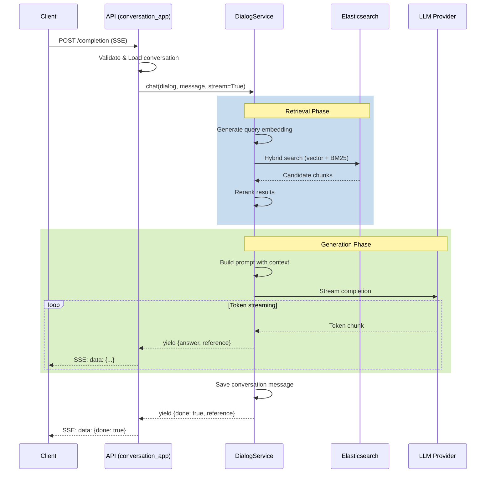

# Conversation App Analysis

## Tổng Quan

`conversation_app.py` (419 lines) là blueprint xử lý chat/conversation API với **Server-Sent Events (SSE)** streaming.

## File Location
```
/api/apps/conversation_app.py
```

## API Endpoints

| Endpoint | Method | Auth | Mô Tả |
|----------|--------|------|-------|
| `/set` | POST | Required | Create/update conversation |
| `/get` | GET | Required | Retrieve conversation |
| `/list` | GET | Required | List conversations by dialog |
| `/completion` | POST | Required | **Stream chat responses (SSE)** |
| `/delete_msg` | POST | Required | Remove message from history |
| `/thumbup` | POST | Required | Rate assistant response |
| `/ask` | POST | Required | Query knowledge bases (SSE) |
| `/mindmap` | POST | Required | Generate mind map |
| `/tts` | POST | Required | Stream audio output |

## Core Flow: Chat Completion (SSE Streaming)

```
┌─────────────────────────────────────────────────────────────────────────┐
│                      CHAT COMPLETION FLOW (SSE)                          │
└─────────────────────────────────────────────────────────────────────────┘

Client                          API                         Services
  │                              │                              │
  │ POST /completion             │                              │
  │ {conversation_id,            │                              │
  │  messages: [...]}            │                              │
  ├─────────────────────────────►│                              │
  │                              │                              │
  │                   ┌──────────┴──────────┐                   │
  │                   │ Validate request    │                   │
  │                   │ Load conversation   │                   │
  │                   │ Load dialog config  │                   │
  │                   └──────────┬──────────┘                   │
  │                              │                              │
  │                              │  DialogService.chat()        │
  │                              ├─────────────────────────────►│
  │                              │                              │
  │                              │     ┌────────────────────────┤
  │                              │     │ 1. Load LLM models     │
  │                              │     │ 2. Query refinement    │
  │                              │     │ 3. Retrieve chunks     │
  │                              │     │ 4. Rerank results      │
  │                              │     │ 5. Build prompt        │
  │                              │     │ 6. Stream LLM response │
  │                              │     └────────────────────────┤
  │                              │                              │
  │  SSE: data: {"answer": "H"}  │◄─────────────────────────────┤
  │◄─────────────────────────────┤                              │
  │                              │                              │
  │  SSE: data: {"answer": "He"} │◄─────────────────────────────┤
  │◄─────────────────────────────┤                              │
  │                              │                              │
  │  SSE: data: {"answer":"Hello,│◄─────────────────────────────┤
  │              "reference":{}} │                              │
  │◄─────────────────────────────┤                              │
  │                              │                              │
  │  ... (more tokens)           │                              │
  │                              │                              │
  │  SSE: data: {"done": true,   │◄─────────────────────────────┤
  │              "reference":    │                              │
  │              {"chunks":[...]}}                              │
  │◄─────────────────────────────┤                              │
  │                              │                              │
```

## Code Analysis

### Completion Endpoint (SSE Streaming)

```python
@manager.route("/completion", methods=["POST"])
@login_required
@validate_request("conversation_id", "messages")
async def completion():
    """
    Stream chat completion using Server-Sent Events.

    Request:
        - conversation_id: Conversation ID
        - messages: Array of {role, content}
        - stream: Boolean (default True)

    Response:
        - SSE stream of JSON objects
        - Each event: data: {answer, reference, audio_binary}
        - Final event: data: {done: true, reference: {...}}
    """
    req = await request.json
    conv_id = req["conversation_id"]

    # 1. Load conversation and dialog
    e, conv = ConversationService.get_by_id(conv_id)
    if not e:
        raise LookupError("Conversation not found")

    e, dia = DialogService.get_by_id(conv.dialog_id)
    if not e:
        raise LookupError("Dialog not found")

    # 2. Extract user message
    messages = req["messages"]
    msg = messages[-1]["content"]  # Latest user message

    # 3. Generate unique message ID
    message_id = get_uuid()

    # 4. Define streaming generator
    def stream():
        try:
            # Call DialogService.chat() which yields tokens
            for ans in chat(dia, msg, True, **req):
                # Structure the response
                ans = structure_answer(conv, ans, message_id, conv.id)

                yield "data:" + json.dumps({
                    "code": 0,
                    "message": "",
                    "data": ans
                }, ensure_ascii=False) + "\n\n"

        except Exception as e:
            logging.exception(e)
            yield "data:" + json.dumps({
                "code": 500,
                "message": str(e),
                "data": {"answer": "**ERROR**: " + str(e)}
            }, ensure_ascii=False) + "\n\n"

        # Final event
        yield "data:" + json.dumps({
            "code": 0,
            "message": "",
            "data": True
        }, ensure_ascii=False) + "\n\n"

    # 5. Return SSE response
    resp = Response(stream(), mimetype="text/event-stream")
    resp.headers.add_header("Cache-control", "no-cache")
    resp.headers.add_header("Connection", "keep-alive")
    resp.headers.add_header("X-Accel-Buffering", "no")
    return resp
```

### SSE Response Structure

```python
def structure_answer(conv, ans, message_id, conv_id):
    """
    Structure the streaming answer for client consumption.

    Args:
        conv: Conversation object
        ans: Raw answer from DialogService.chat()
        message_id: Unique message ID
        conv_id: Conversation ID

    Returns:
        Structured answer dict
    """
    return {
        "id": message_id,
        "conversation_id": conv_id,
        "answer": ans.get("answer", ""),
        "reference": ans.get("reference", {}),
        "audio_binary": ans.get("audio_binary"),  # TTS if enabled
        "created_at": time.time()
    }
```

### SSE Event Format

```
# Token streaming event
data: {"code": 0, "message": "", "data": {"id": "msg_123", "answer": "Hello", "reference": {}}}

# Intermediate event with partial answer
data: {"code": 0, "message": "", "data": {"id": "msg_123", "answer": "Hello, I can help", "reference": {}}}

# Final event with references
data: {"code": 0, "message": "", "data": {"id": "msg_123", "answer": "Hello, I can help you with that.", "reference": {"chunks": [...], "doc_aggs": [...]}}}

# Completion signal
data: {"code": 0, "message": "", "data": true}

# Error event
data: {"code": 500, "message": "Error details", "data": {"answer": "**ERROR**: ..."}}
```

### Ask Endpoint (Search with Summary)

```python
@manager.route("/ask", methods=["POST"])
@login_required
@validate_request("question", "kb_ids")
async def ask():
    """
    Search knowledge bases and generate summary.

    Request:
        - question: Search query
        - kb_ids: List of knowledge base IDs
        - search_config: Optional search configuration

    Response:
        - SSE stream with search results and summary
    """
    req = await request.json
    question = req["question"]
    kb_ids = req["kb_ids"]

    def stream():
        for ans in DialogService.ask(
            question,
            kb_ids,
            current_user.id,
            search_config=req.get("search_config", {})
        ):
            yield "data:" + json.dumps({
                "code": 0,
                "data": ans
            }, ensure_ascii=False) + "\n\n"

    resp = Response(stream(), mimetype="text/event-stream")
    resp.headers.add_header("Cache-control", "no-cache")
    return resp
```

### Mind Map Generation

```python
@manager.route("/mindmap", methods=["POST"])
@login_required
@validate_request("question", "kb_ids")
async def mindmap():
    """
    Generate mind map from retrieved content.

    Uses trio.run() for async processing with MindMapExtractor.
    """
    req = await request.json

    def stream():
        for ans in DialogService.gen_mindmap(
            req["question"],
            req["kb_ids"],
            current_user.id,
            search_config=req.get("search_config", {})
        ):
            yield "data:" + json.dumps({
                "code": 0,
                "data": ans
            }, ensure_ascii=False) + "\n\n"

    resp = Response(stream(), mimetype="text/event-stream")
    return resp
```

### TTS (Text-to-Speech) Streaming

```python
@manager.route("/tts", methods=["POST"])
@login_required
@validate_request("text")
async def tts():
    """
    Stream audio from text using TTS model.

    Request:
        - text: Text to convert to speech
        - dialog_id: Dialog ID for TTS configuration

    Response:
        - SSE stream with base64 audio chunks
    """
    req = await request.json
    text = req["text"]

    # Load TTS model from dialog config
    e, dia = DialogService.get_by_id(req.get("dialog_id"))
    tts_mdl = LLMBundle(current_user.id, LLMType.TTS, dia.tts_id)

    def stream():
        for audio_chunk in tts_mdl.tts(text):
            yield "data:" + json.dumps({
                "code": 0,
                "data": {"audio": base64.b64encode(audio_chunk).decode()}
            }) + "\n\n"

    resp = Response(stream(), mimetype="text/event-stream")
    return resp
```

## SSE Implementation Details

### Client-Side Handling (JavaScript)

```javascript
const eventSource = new EventSource('/v1/conversation/completion', {
    method: 'POST',
    headers: {
        'Content-Type': 'application/json',
        'Authorization': `Bearer ${token}`
    },
    body: JSON.stringify({
        conversation_id: convId,
        messages: [{ role: 'user', content: question }]
    })
});

eventSource.onmessage = (event) => {
    const data = JSON.parse(event.data);

    if (data === true) {
        // Stream complete
        eventSource.close();
        return;
    }

    if (data.code !== 0) {
        console.error('Error:', data.message);
        return;
    }

    // Append streaming content
    appendToChat(data.answer);

    // Handle references when available
    if (data.reference?.chunks) {
        displayReferences(data.reference.chunks);
    }
};

eventSource.onerror = (error) => {
    console.error('SSE Error:', error);
    eventSource.close();
};
```

### HTTP Headers for SSE

```python
resp = Response(stream(), mimetype="text/event-stream")
resp.headers.add_header("Cache-control", "no-cache")      # Disable caching
resp.headers.add_header("Connection", "keep-alive")       # Keep connection open
resp.headers.add_header("X-Accel-Buffering", "no")       # Disable Nginx buffering
```

## Sequence Diagram: Chat with RAG



## Error Handling

```python
def stream():
    try:
        for ans in chat(dia, msg, True, **req):
            yield format_sse(ans)

    except LookupError as e:
        # Resource not found
        yield error_sse(404, str(e))

    except PermissionError as e:
        # Authorization failed
        yield error_sse(403, str(e))

    except Exception as e:
        # Generic error
        logging.exception(e)
        yield error_sse(500, str(e))

    finally:
        # Always send completion signal
        yield "data: true\n\n"

def error_sse(code, message):
    return "data:" + json.dumps({
        "code": code,
        "message": message,
        "data": {"answer": f"**ERROR**: {message}"}
    }) + "\n\n"
```

## Performance Considerations

1. **Streaming vs Buffering**: SSE allows real-time token display
2. **Nginx Buffering**: Must disable with `X-Accel-Buffering: no`
3. **Connection Keep-Alive**: Long-lived connections for streaming
4. **Memory Management**: Generator-based streaming avoids memory buildup
5. **Timeout Handling**: LLM calls have configurable timeouts

## Related Files

- `/api/db/services/dialog_service.py` - RAG chat implementation
- `/api/db/services/conversation_service.py` - Conversation storage
- `/rag/llm/chat_model.py` - LLM streaming interface
